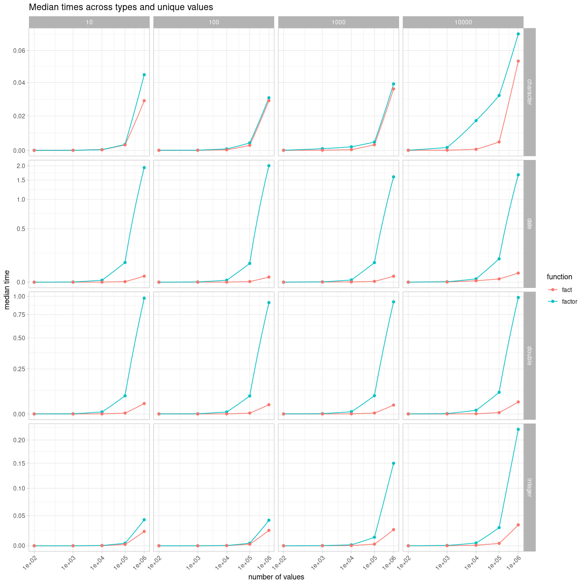

<!-- bench/bench.md is generated from bench/bench.Rmd. Please edit that file -->

``` r
library(facts)
```

## Logical vectors

``` r
# Logical is much faster because we only have to check for 3 values
y <- x <- runif(1e6) > .5
y[sample(seq_along(y), 1e4)] <- NA

bench::mark(
  factor(x),
  fact(x),
  factor(y),
  fact(y),
  check = FALSE
)[1:9] |> 
  transform(expression = sapply(expression, deparse)) |> 
  gt::gt("expression")
#> Warning: Some expressions had a GC in every iteration; so filtering is disabled.
```

<div id="tycymlugvt" style="overflow-x:auto;overflow-y:auto;width:auto;height:auto;">
<style>html {
  font-family: -apple-system, BlinkMacSystemFont, 'Segoe UI', Roboto, Oxygen, Ubuntu, Cantarell, 'Helvetica Neue', 'Fira Sans', 'Droid Sans', Arial, sans-serif;
}

#tycymlugvt .gt_table {
  display: table;
  border-collapse: collapse;
  margin-left: auto;
  margin-right: auto;
  color: #333333;
  font-size: 16px;
  font-weight: normal;
  font-style: normal;
  background-color: #FFFFFF;
  width: auto;
  border-top-style: solid;
  border-top-width: 2px;
  border-top-color: #A8A8A8;
  border-right-style: none;
  border-right-width: 2px;
  border-right-color: #D3D3D3;
  border-bottom-style: solid;
  border-bottom-width: 2px;
  border-bottom-color: #A8A8A8;
  border-left-style: none;
  border-left-width: 2px;
  border-left-color: #D3D3D3;
}

#tycymlugvt .gt_heading {
  background-color: #FFFFFF;
  text-align: center;
  border-bottom-color: #FFFFFF;
  border-left-style: none;
  border-left-width: 1px;
  border-left-color: #D3D3D3;
  border-right-style: none;
  border-right-width: 1px;
  border-right-color: #D3D3D3;
}

#tycymlugvt .gt_title {
  color: #333333;
  font-size: 125%;
  font-weight: initial;
  padding-top: 4px;
  padding-bottom: 4px;
  padding-left: 5px;
  padding-right: 5px;
  border-bottom-color: #FFFFFF;
  border-bottom-width: 0;
}

#tycymlugvt .gt_subtitle {
  color: #333333;
  font-size: 85%;
  font-weight: initial;
  padding-top: 0;
  padding-bottom: 6px;
  padding-left: 5px;
  padding-right: 5px;
  border-top-color: #FFFFFF;
  border-top-width: 0;
}

#tycymlugvt .gt_bottom_border {
  border-bottom-style: solid;
  border-bottom-width: 2px;
  border-bottom-color: #D3D3D3;
}

#tycymlugvt .gt_col_headings {
  border-top-style: solid;
  border-top-width: 2px;
  border-top-color: #D3D3D3;
  border-bottom-style: solid;
  border-bottom-width: 2px;
  border-bottom-color: #D3D3D3;
  border-left-style: none;
  border-left-width: 1px;
  border-left-color: #D3D3D3;
  border-right-style: none;
  border-right-width: 1px;
  border-right-color: #D3D3D3;
}

#tycymlugvt .gt_col_heading {
  color: #333333;
  background-color: #FFFFFF;
  font-size: 100%;
  font-weight: normal;
  text-transform: inherit;
  border-left-style: none;
  border-left-width: 1px;
  border-left-color: #D3D3D3;
  border-right-style: none;
  border-right-width: 1px;
  border-right-color: #D3D3D3;
  vertical-align: bottom;
  padding-top: 5px;
  padding-bottom: 6px;
  padding-left: 5px;
  padding-right: 5px;
  overflow-x: hidden;
}

#tycymlugvt .gt_column_spanner_outer {
  color: #333333;
  background-color: #FFFFFF;
  font-size: 100%;
  font-weight: normal;
  text-transform: inherit;
  padding-top: 0;
  padding-bottom: 0;
  padding-left: 4px;
  padding-right: 4px;
}

#tycymlugvt .gt_column_spanner_outer:first-child {
  padding-left: 0;
}

#tycymlugvt .gt_column_spanner_outer:last-child {
  padding-right: 0;
}

#tycymlugvt .gt_column_spanner {
  border-bottom-style: solid;
  border-bottom-width: 2px;
  border-bottom-color: #D3D3D3;
  vertical-align: bottom;
  padding-top: 5px;
  padding-bottom: 5px;
  overflow-x: hidden;
  display: inline-block;
  width: 100%;
}

#tycymlugvt .gt_group_heading {
  padding-top: 8px;
  padding-bottom: 8px;
  padding-left: 5px;
  padding-right: 5px;
  color: #333333;
  background-color: #FFFFFF;
  font-size: 100%;
  font-weight: initial;
  text-transform: inherit;
  border-top-style: solid;
  border-top-width: 2px;
  border-top-color: #D3D3D3;
  border-bottom-style: solid;
  border-bottom-width: 2px;
  border-bottom-color: #D3D3D3;
  border-left-style: none;
  border-left-width: 1px;
  border-left-color: #D3D3D3;
  border-right-style: none;
  border-right-width: 1px;
  border-right-color: #D3D3D3;
  vertical-align: middle;
}

#tycymlugvt .gt_empty_group_heading {
  padding: 0.5px;
  color: #333333;
  background-color: #FFFFFF;
  font-size: 100%;
  font-weight: initial;
  border-top-style: solid;
  border-top-width: 2px;
  border-top-color: #D3D3D3;
  border-bottom-style: solid;
  border-bottom-width: 2px;
  border-bottom-color: #D3D3D3;
  vertical-align: middle;
}

#tycymlugvt .gt_from_md > :first-child {
  margin-top: 0;
}

#tycymlugvt .gt_from_md > :last-child {
  margin-bottom: 0;
}

#tycymlugvt .gt_row {
  padding-top: 8px;
  padding-bottom: 8px;
  padding-left: 5px;
  padding-right: 5px;
  margin: 10px;
  border-top-style: solid;
  border-top-width: 1px;
  border-top-color: #D3D3D3;
  border-left-style: none;
  border-left-width: 1px;
  border-left-color: #D3D3D3;
  border-right-style: none;
  border-right-width: 1px;
  border-right-color: #D3D3D3;
  vertical-align: middle;
  overflow-x: hidden;
}

#tycymlugvt .gt_stub {
  color: #333333;
  background-color: #FFFFFF;
  font-size: 100%;
  font-weight: initial;
  text-transform: inherit;
  border-right-style: solid;
  border-right-width: 2px;
  border-right-color: #D3D3D3;
  padding-left: 5px;
  padding-right: 5px;
}

#tycymlugvt .gt_stub_row_group {
  color: #333333;
  background-color: #FFFFFF;
  font-size: 100%;
  font-weight: initial;
  text-transform: inherit;
  border-right-style: solid;
  border-right-width: 2px;
  border-right-color: #D3D3D3;
  padding-left: 5px;
  padding-right: 5px;
  vertical-align: top;
}

#tycymlugvt .gt_row_group_first td {
  border-top-width: 2px;
}

#tycymlugvt .gt_summary_row {
  color: #333333;
  background-color: #FFFFFF;
  text-transform: inherit;
  padding-top: 8px;
  padding-bottom: 8px;
  padding-left: 5px;
  padding-right: 5px;
}

#tycymlugvt .gt_first_summary_row {
  border-top-style: solid;
  border-top-color: #D3D3D3;
}

#tycymlugvt .gt_first_summary_row.thick {
  border-top-width: 2px;
}

#tycymlugvt .gt_last_summary_row {
  padding-top: 8px;
  padding-bottom: 8px;
  padding-left: 5px;
  padding-right: 5px;
  border-bottom-style: solid;
  border-bottom-width: 2px;
  border-bottom-color: #D3D3D3;
}

#tycymlugvt .gt_grand_summary_row {
  color: #333333;
  background-color: #FFFFFF;
  text-transform: inherit;
  padding-top: 8px;
  padding-bottom: 8px;
  padding-left: 5px;
  padding-right: 5px;
}

#tycymlugvt .gt_first_grand_summary_row {
  padding-top: 8px;
  padding-bottom: 8px;
  padding-left: 5px;
  padding-right: 5px;
  border-top-style: double;
  border-top-width: 6px;
  border-top-color: #D3D3D3;
}

#tycymlugvt .gt_striped {
  background-color: rgba(128, 128, 128, 0.05);
}

#tycymlugvt .gt_table_body {
  border-top-style: solid;
  border-top-width: 2px;
  border-top-color: #D3D3D3;
  border-bottom-style: solid;
  border-bottom-width: 2px;
  border-bottom-color: #D3D3D3;
}

#tycymlugvt .gt_footnotes {
  color: #333333;
  background-color: #FFFFFF;
  border-bottom-style: none;
  border-bottom-width: 2px;
  border-bottom-color: #D3D3D3;
  border-left-style: none;
  border-left-width: 2px;
  border-left-color: #D3D3D3;
  border-right-style: none;
  border-right-width: 2px;
  border-right-color: #D3D3D3;
}

#tycymlugvt .gt_footnote {
  margin: 0px;
  font-size: 90%;
  padding-left: 4px;
  padding-right: 4px;
  padding-left: 5px;
  padding-right: 5px;
}

#tycymlugvt .gt_sourcenotes {
  color: #333333;
  background-color: #FFFFFF;
  border-bottom-style: none;
  border-bottom-width: 2px;
  border-bottom-color: #D3D3D3;
  border-left-style: none;
  border-left-width: 2px;
  border-left-color: #D3D3D3;
  border-right-style: none;
  border-right-width: 2px;
  border-right-color: #D3D3D3;
}

#tycymlugvt .gt_sourcenote {
  font-size: 90%;
  padding-top: 4px;
  padding-bottom: 4px;
  padding-left: 5px;
  padding-right: 5px;
}

#tycymlugvt .gt_left {
  text-align: left;
}

#tycymlugvt .gt_center {
  text-align: center;
}

#tycymlugvt .gt_right {
  text-align: right;
  font-variant-numeric: tabular-nums;
}

#tycymlugvt .gt_font_normal {
  font-weight: normal;
}

#tycymlugvt .gt_font_bold {
  font-weight: bold;
}

#tycymlugvt .gt_font_italic {
  font-style: italic;
}

#tycymlugvt .gt_super {
  font-size: 65%;
}

#tycymlugvt .gt_footnote_marks {
  font-style: italic;
  font-weight: normal;
  font-size: 75%;
  vertical-align: 0.4em;
}

#tycymlugvt .gt_asterisk {
  font-size: 100%;
  vertical-align: 0;
}

#tycymlugvt .gt_indent_1 {
  text-indent: 5px;
}

#tycymlugvt .gt_indent_2 {
  text-indent: 10px;
}

#tycymlugvt .gt_indent_3 {
  text-indent: 15px;
}

#tycymlugvt .gt_indent_4 {
  text-indent: 20px;
}

#tycymlugvt .gt_indent_5 {
  text-indent: 25px;
}
</style>
<table class="gt_table">
  
  <thead class="gt_col_headings">
    <tr>
      <th class="gt_col_heading gt_columns_bottom_border gt_left" rowspan="1" colspan="1" scope="col"></th>
      <th class="gt_col_heading gt_columns_bottom_border gt_center" rowspan="1" colspan="1" scope="col">min</th>
      <th class="gt_col_heading gt_columns_bottom_border gt_center" rowspan="1" colspan="1" scope="col">median</th>
      <th class="gt_col_heading gt_columns_bottom_border gt_right" rowspan="1" colspan="1" scope="col">itr.sec</th>
      <th class="gt_col_heading gt_columns_bottom_border gt_center" rowspan="1" colspan="1" scope="col">mem_alloc</th>
      <th class="gt_col_heading gt_columns_bottom_border gt_right" rowspan="1" colspan="1" scope="col">gc.sec</th>
      <th class="gt_col_heading gt_columns_bottom_border gt_right" rowspan="1" colspan="1" scope="col">n_itr</th>
      <th class="gt_col_heading gt_columns_bottom_border gt_right" rowspan="1" colspan="1" scope="col">n_gc</th>
      <th class="gt_col_heading gt_columns_bottom_border gt_center" rowspan="1" colspan="1" scope="col">total_time</th>
    </tr>
  </thead>
  <tbody class="gt_table_body">
    <tr><th scope="row" class="gt_row gt_left gt_stub">factor(x)</th>
<td class="gt_row gt_center">137.2ms</td>
<td class="gt_row gt_center">137.9ms</td>
<td class="gt_row gt_right">7.207089</td>
<td class="gt_row gt_center">22.9MB</td>
<td class="gt_row gt_right">9.008861</td>
<td class="gt_row gt_right">4</td>
<td class="gt_row gt_right">5</td>
<td class="gt_row gt_center">555ms</td></tr>
    <tr><th scope="row" class="gt_row gt_left gt_stub">fact(x)</th>
<td class="gt_row gt_center">14.5ms</td>
<td class="gt_row gt_center">17.4ms</td>
<td class="gt_row gt_right">49.635916</td>
<td class="gt_row gt_center">23.0MB</td>
<td class="gt_row gt_right">49.635916</td>
<td class="gt_row gt_right">25</td>
<td class="gt_row gt_right">25</td>
<td class="gt_row gt_center">504ms</td></tr>
    <tr><th scope="row" class="gt_row gt_left gt_stub">factor(y)</th>
<td class="gt_row gt_center">136.2ms</td>
<td class="gt_row gt_center">141.3ms</td>
<td class="gt_row gt_right">6.544152</td>
<td class="gt_row gt_center">22.9MB</td>
<td class="gt_row gt_right">4.908114</td>
<td class="gt_row gt_right">4</td>
<td class="gt_row gt_right">3</td>
<td class="gt_row gt_center">611ms</td></tr>
    <tr><th scope="row" class="gt_row gt_left gt_stub">fact(y)</th>
<td class="gt_row gt_center">10.7ms</td>
<td class="gt_row gt_center">14.5ms</td>
<td class="gt_row gt_right">59.071864</td>
<td class="gt_row gt_center">22.9MB</td>
<td class="gt_row gt_right">59.071864</td>
<td class="gt_row gt_right">30</td>
<td class="gt_row gt_right">30</td>
<td class="gt_row gt_center">508ms</td></tr>
  </tbody>
  
  
</table>
</div>

## Other vector types

``` r
res <- bench::press(
  n_unique = 10^(1:4),
  n_values = 10^(2:6),
  value_type = c("character", "double", "integer", "date"),
  {
    x <- switch(
      value_type,
      character = stringi::stri_rand_strings(n_unique, 5),
      double = runif(n_unique),
      integer = order(runif(n_unique)),
      date = Sys.Date() + order(runif(n_unique))
    )
    x <- sample(x, n_values, TRUE)
    bench::mark(
      factor = factor(x),
      fact = fact(x),
      check = FALSE
    )
  }
)
#> Running with:
#>    n_unique n_values value_type
#>  1       10      100 character
#>  2      100      100 character
#>  3     1000      100 character
#>  4    10000      100 character
#>  5       10     1000 character
#>  6      100     1000 character
#>  7     1000     1000 character
#>  8    10000     1000 character
#>  9       10    10000 character
#> 10      100    10000 character
#> 11     1000    10000 character
#> 12    10000    10000 character
#> 13       10   100000 character
#> 14      100   100000 character
#> 15     1000   100000 character
#> 16    10000   100000 character
#> 17       10  1000000 character
#> 18      100  1000000 character
#> Warning: Some expressions had a GC in every iteration; so filtering is disabled.
#> 19     1000  1000000 character
#> Warning: Some expressions had a GC in every iteration; so filtering is disabled.
#> 20    10000  1000000 character
#> 21       10      100 double
#> 22      100      100 double
#> 23     1000      100 double
#> 24    10000      100 double
#> 25       10     1000 double
#> 26      100     1000 double
#> 27     1000     1000 double
#> 28    10000     1000 double
#> 29       10    10000 double
#> 30      100    10000 double
#> 31     1000    10000 double
#> 32    10000    10000 double
#> 33       10   100000 double
#> 34      100   100000 double
#> 35     1000   100000 double
#> 36    10000   100000 double
#> 37       10  1000000 double
#> Warning: Some expressions had a GC in every iteration; so filtering is disabled.
#> 38      100  1000000 double
#> Warning: Some expressions had a GC in every iteration; so filtering is disabled.
#> 39     1000  1000000 double
#> Warning: Some expressions had a GC in every iteration; so filtering is disabled.
#> 40    10000  1000000 double
#> Warning: Some expressions had a GC in every iteration; so filtering is disabled.
#> 41       10      100 integer
#> 42      100      100 integer
#> 43     1000      100 integer
#> 44    10000      100 integer
#> 45       10     1000 integer
#> 46      100     1000 integer
#> 47     1000     1000 integer
#> 48    10000     1000 integer
#> 49       10    10000 integer
#> 50      100    10000 integer
#> 51     1000    10000 integer
#> 52    10000    10000 integer
#> 53       10   100000 integer
#> 54      100   100000 integer
#> 55     1000   100000 integer
#> 56    10000   100000 integer
#> 57       10  1000000 integer
#> 58      100  1000000 integer
#> 59     1000  1000000 integer
#> 60    10000  1000000 integer
#> 61       10      100 date
#> 62      100      100 date
#> 63     1000      100 date
#> 64    10000      100 date
#> 65       10     1000 date
#> 66      100     1000 date
#> 67     1000     1000 date
#> 68    10000     1000 date
#> 69       10    10000 date
#> 70      100    10000 date
#> 71     1000    10000 date
#> 72    10000    10000 date
#> 73       10   100000 date
#> 74      100   100000 date
#> 75     1000   100000 date
#> 76    10000   100000 date
#> 77       10  1000000 date
#> Warning: Some expressions had a GC in every iteration; so filtering is disabled.
#> 78      100  1000000 date
#> Warning: Some expressions had a GC in every iteration; so filtering is disabled.
#> 79     1000  1000000 date
#> Warning: Some expressions had a GC in every iteration; so filtering is disabled.
#> 80    10000  1000000 date
#> Warning: Some expressions had a GC in every iteration; so filtering is disabled.
```

``` r
res[1:9] |> 
  transform(expression = sapply(expression, deparse1)) |> 
  gt::gt("expression", "value_type") |> 
  gt::tab_options(row.striping.include_table_body = TRUE)
```

<div id="idgenqgxnj" style="overflow-x:auto;overflow-y:auto;width:auto;height:auto;">
<style>html {
  font-family: -apple-system, BlinkMacSystemFont, 'Segoe UI', Roboto, Oxygen, Ubuntu, Cantarell, 'Helvetica Neue', 'Fira Sans', 'Droid Sans', Arial, sans-serif;
}

#idgenqgxnj .gt_table {
  display: table;
  border-collapse: collapse;
  margin-left: auto;
  margin-right: auto;
  color: #333333;
  font-size: 16px;
  font-weight: normal;
  font-style: normal;
  background-color: #FFFFFF;
  width: auto;
  border-top-style: solid;
  border-top-width: 2px;
  border-top-color: #A8A8A8;
  border-right-style: none;
  border-right-width: 2px;
  border-right-color: #D3D3D3;
  border-bottom-style: solid;
  border-bottom-width: 2px;
  border-bottom-color: #A8A8A8;
  border-left-style: none;
  border-left-width: 2px;
  border-left-color: #D3D3D3;
}

#idgenqgxnj .gt_heading {
  background-color: #FFFFFF;
  text-align: center;
  border-bottom-color: #FFFFFF;
  border-left-style: none;
  border-left-width: 1px;
  border-left-color: #D3D3D3;
  border-right-style: none;
  border-right-width: 1px;
  border-right-color: #D3D3D3;
}

#idgenqgxnj .gt_title {
  color: #333333;
  font-size: 125%;
  font-weight: initial;
  padding-top: 4px;
  padding-bottom: 4px;
  padding-left: 5px;
  padding-right: 5px;
  border-bottom-color: #FFFFFF;
  border-bottom-width: 0;
}

#idgenqgxnj .gt_subtitle {
  color: #333333;
  font-size: 85%;
  font-weight: initial;
  padding-top: 0;
  padding-bottom: 6px;
  padding-left: 5px;
  padding-right: 5px;
  border-top-color: #FFFFFF;
  border-top-width: 0;
}

#idgenqgxnj .gt_bottom_border {
  border-bottom-style: solid;
  border-bottom-width: 2px;
  border-bottom-color: #D3D3D3;
}

#idgenqgxnj .gt_col_headings {
  border-top-style: solid;
  border-top-width: 2px;
  border-top-color: #D3D3D3;
  border-bottom-style: solid;
  border-bottom-width: 2px;
  border-bottom-color: #D3D3D3;
  border-left-style: none;
  border-left-width: 1px;
  border-left-color: #D3D3D3;
  border-right-style: none;
  border-right-width: 1px;
  border-right-color: #D3D3D3;
}

#idgenqgxnj .gt_col_heading {
  color: #333333;
  background-color: #FFFFFF;
  font-size: 100%;
  font-weight: normal;
  text-transform: inherit;
  border-left-style: none;
  border-left-width: 1px;
  border-left-color: #D3D3D3;
  border-right-style: none;
  border-right-width: 1px;
  border-right-color: #D3D3D3;
  vertical-align: bottom;
  padding-top: 5px;
  padding-bottom: 6px;
  padding-left: 5px;
  padding-right: 5px;
  overflow-x: hidden;
}

#idgenqgxnj .gt_column_spanner_outer {
  color: #333333;
  background-color: #FFFFFF;
  font-size: 100%;
  font-weight: normal;
  text-transform: inherit;
  padding-top: 0;
  padding-bottom: 0;
  padding-left: 4px;
  padding-right: 4px;
}

#idgenqgxnj .gt_column_spanner_outer:first-child {
  padding-left: 0;
}

#idgenqgxnj .gt_column_spanner_outer:last-child {
  padding-right: 0;
}

#idgenqgxnj .gt_column_spanner {
  border-bottom-style: solid;
  border-bottom-width: 2px;
  border-bottom-color: #D3D3D3;
  vertical-align: bottom;
  padding-top: 5px;
  padding-bottom: 5px;
  overflow-x: hidden;
  display: inline-block;
  width: 100%;
}

#idgenqgxnj .gt_group_heading {
  padding-top: 8px;
  padding-bottom: 8px;
  padding-left: 5px;
  padding-right: 5px;
  color: #333333;
  background-color: #FFFFFF;
  font-size: 100%;
  font-weight: initial;
  text-transform: inherit;
  border-top-style: solid;
  border-top-width: 2px;
  border-top-color: #D3D3D3;
  border-bottom-style: solid;
  border-bottom-width: 2px;
  border-bottom-color: #D3D3D3;
  border-left-style: none;
  border-left-width: 1px;
  border-left-color: #D3D3D3;
  border-right-style: none;
  border-right-width: 1px;
  border-right-color: #D3D3D3;
  vertical-align: middle;
}

#idgenqgxnj .gt_empty_group_heading {
  padding: 0.5px;
  color: #333333;
  background-color: #FFFFFF;
  font-size: 100%;
  font-weight: initial;
  border-top-style: solid;
  border-top-width: 2px;
  border-top-color: #D3D3D3;
  border-bottom-style: solid;
  border-bottom-width: 2px;
  border-bottom-color: #D3D3D3;
  vertical-align: middle;
}

#idgenqgxnj .gt_from_md > :first-child {
  margin-top: 0;
}

#idgenqgxnj .gt_from_md > :last-child {
  margin-bottom: 0;
}

#idgenqgxnj .gt_row {
  padding-top: 8px;
  padding-bottom: 8px;
  padding-left: 5px;
  padding-right: 5px;
  margin: 10px;
  border-top-style: solid;
  border-top-width: 1px;
  border-top-color: #D3D3D3;
  border-left-style: none;
  border-left-width: 1px;
  border-left-color: #D3D3D3;
  border-right-style: none;
  border-right-width: 1px;
  border-right-color: #D3D3D3;
  vertical-align: middle;
  overflow-x: hidden;
}

#idgenqgxnj .gt_stub {
  color: #333333;
  background-color: #FFFFFF;
  font-size: 100%;
  font-weight: initial;
  text-transform: inherit;
  border-right-style: solid;
  border-right-width: 2px;
  border-right-color: #D3D3D3;
  padding-left: 5px;
  padding-right: 5px;
}

#idgenqgxnj .gt_stub_row_group {
  color: #333333;
  background-color: #FFFFFF;
  font-size: 100%;
  font-weight: initial;
  text-transform: inherit;
  border-right-style: solid;
  border-right-width: 2px;
  border-right-color: #D3D3D3;
  padding-left: 5px;
  padding-right: 5px;
  vertical-align: top;
}

#idgenqgxnj .gt_row_group_first td {
  border-top-width: 2px;
}

#idgenqgxnj .gt_summary_row {
  color: #333333;
  background-color: #FFFFFF;
  text-transform: inherit;
  padding-top: 8px;
  padding-bottom: 8px;
  padding-left: 5px;
  padding-right: 5px;
}

#idgenqgxnj .gt_first_summary_row {
  border-top-style: solid;
  border-top-color: #D3D3D3;
}

#idgenqgxnj .gt_first_summary_row.thick {
  border-top-width: 2px;
}

#idgenqgxnj .gt_last_summary_row {
  padding-top: 8px;
  padding-bottom: 8px;
  padding-left: 5px;
  padding-right: 5px;
  border-bottom-style: solid;
  border-bottom-width: 2px;
  border-bottom-color: #D3D3D3;
}

#idgenqgxnj .gt_grand_summary_row {
  color: #333333;
  background-color: #FFFFFF;
  text-transform: inherit;
  padding-top: 8px;
  padding-bottom: 8px;
  padding-left: 5px;
  padding-right: 5px;
}

#idgenqgxnj .gt_first_grand_summary_row {
  padding-top: 8px;
  padding-bottom: 8px;
  padding-left: 5px;
  padding-right: 5px;
  border-top-style: double;
  border-top-width: 6px;
  border-top-color: #D3D3D3;
}

#idgenqgxnj .gt_striped {
  background-color: rgba(128, 128, 128, 0.05);
}

#idgenqgxnj .gt_table_body {
  border-top-style: solid;
  border-top-width: 2px;
  border-top-color: #D3D3D3;
  border-bottom-style: solid;
  border-bottom-width: 2px;
  border-bottom-color: #D3D3D3;
}

#idgenqgxnj .gt_footnotes {
  color: #333333;
  background-color: #FFFFFF;
  border-bottom-style: none;
  border-bottom-width: 2px;
  border-bottom-color: #D3D3D3;
  border-left-style: none;
  border-left-width: 2px;
  border-left-color: #D3D3D3;
  border-right-style: none;
  border-right-width: 2px;
  border-right-color: #D3D3D3;
}

#idgenqgxnj .gt_footnote {
  margin: 0px;
  font-size: 90%;
  padding-left: 4px;
  padding-right: 4px;
  padding-left: 5px;
  padding-right: 5px;
}

#idgenqgxnj .gt_sourcenotes {
  color: #333333;
  background-color: #FFFFFF;
  border-bottom-style: none;
  border-bottom-width: 2px;
  border-bottom-color: #D3D3D3;
  border-left-style: none;
  border-left-width: 2px;
  border-left-color: #D3D3D3;
  border-right-style: none;
  border-right-width: 2px;
  border-right-color: #D3D3D3;
}

#idgenqgxnj .gt_sourcenote {
  font-size: 90%;
  padding-top: 4px;
  padding-bottom: 4px;
  padding-left: 5px;
  padding-right: 5px;
}

#idgenqgxnj .gt_left {
  text-align: left;
}

#idgenqgxnj .gt_center {
  text-align: center;
}

#idgenqgxnj .gt_right {
  text-align: right;
  font-variant-numeric: tabular-nums;
}

#idgenqgxnj .gt_font_normal {
  font-weight: normal;
}

#idgenqgxnj .gt_font_bold {
  font-weight: bold;
}

#idgenqgxnj .gt_font_italic {
  font-style: italic;
}

#idgenqgxnj .gt_super {
  font-size: 65%;
}

#idgenqgxnj .gt_footnote_marks {
  font-style: italic;
  font-weight: normal;
  font-size: 75%;
  vertical-align: 0.4em;
}

#idgenqgxnj .gt_asterisk {
  font-size: 100%;
  vertical-align: 0;
}

#idgenqgxnj .gt_indent_1 {
  text-indent: 5px;
}

#idgenqgxnj .gt_indent_2 {
  text-indent: 10px;
}

#idgenqgxnj .gt_indent_3 {
  text-indent: 15px;
}

#idgenqgxnj .gt_indent_4 {
  text-indent: 20px;
}

#idgenqgxnj .gt_indent_5 {
  text-indent: 25px;
}
</style>
<table class="gt_table">
  
  <thead class="gt_col_headings">
    <tr>
      <th class="gt_col_heading gt_columns_bottom_border gt_left" rowspan="1" colspan="1" scope="col"></th>
      <th class="gt_col_heading gt_columns_bottom_border gt_right" rowspan="1" colspan="1" scope="col">n_unique</th>
      <th class="gt_col_heading gt_columns_bottom_border gt_right" rowspan="1" colspan="1" scope="col">n_values</th>
      <th class="gt_col_heading gt_columns_bottom_border gt_center" rowspan="1" colspan="1" scope="col">min</th>
      <th class="gt_col_heading gt_columns_bottom_border gt_center" rowspan="1" colspan="1" scope="col">median</th>
      <th class="gt_col_heading gt_columns_bottom_border gt_right" rowspan="1" colspan="1" scope="col">itr.sec</th>
      <th class="gt_col_heading gt_columns_bottom_border gt_center" rowspan="1" colspan="1" scope="col">mem_alloc</th>
      <th class="gt_col_heading gt_columns_bottom_border gt_right" rowspan="1" colspan="1" scope="col">gc.sec</th>
    </tr>
  </thead>
  <tbody class="gt_table_body">
    <tr class="gt_group_heading_row">
      <td colspan="8" class="gt_group_heading">character</td>
    </tr>
    <tr class="gt_row_group_first"><th scope="row" class="gt_row gt_left gt_stub">factor(x)</th>
<td class="gt_row gt_right">10</td>
<td class="gt_row gt_right">1e+02</td>
<td class="gt_row gt_center">28.67µs</td>
<td class="gt_row gt_center">30.76µs</td>
<td class="gt_row gt_right">2.919414e+04</td>
<td class="gt_row gt_center">2.75KB</td>
<td class="gt_row gt_right">11.682329</td></tr>
    <tr><th scope="row" class="gt_row gt_left gt_stub">fact(x)</th>
<td class="gt_row gt_right gt_striped">10</td>
<td class="gt_row gt_right gt_striped">1e+02</td>
<td class="gt_row gt_center gt_striped">54.79µs</td>
<td class="gt_row gt_center gt_striped">57.60µs</td>
<td class="gt_row gt_right gt_striped">1.682948e+04</td>
<td class="gt_row gt_center gt_striped">156.47KB</td>
<td class="gt_row gt_right gt_striped">12.542152</td></tr>
    <tr><th scope="row" class="gt_row gt_left gt_stub">factor(x)</th>
<td class="gt_row gt_right">100</td>
<td class="gt_row gt_right">1e+02</td>
<td class="gt_row gt_center">65.25µs</td>
<td class="gt_row gt_center">67.62µs</td>
<td class="gt_row gt_right">1.425245e+04</td>
<td class="gt_row gt_center">9.32KB</td>
<td class="gt_row gt_right">6.283224</td></tr>
    <tr><th scope="row" class="gt_row gt_left gt_stub">fact(x)</th>
<td class="gt_row gt_right gt_striped">100</td>
<td class="gt_row gt_right gt_striped">1e+02</td>
<td class="gt_row gt_center gt_striped">56.41µs</td>
<td class="gt_row gt_center gt_striped">59.24µs</td>
<td class="gt_row gt_right gt_striped">1.628401e+04</td>
<td class="gt_row gt_center gt_striped">4.87KB</td>
<td class="gt_row gt_right gt_striped">12.720230</td></tr>
    <tr><th scope="row" class="gt_row gt_left gt_stub">factor(x)</th>
<td class="gt_row gt_right">1000</td>
<td class="gt_row gt_right">1e+02</td>
<td class="gt_row gt_center">86.08µs</td>
<td class="gt_row gt_center">88.66µs</td>
<td class="gt_row gt_right">1.080274e+04</td>
<td class="gt_row gt_center">13.21KB</td>
<td class="gt_row gt_right">4.106727</td></tr>
    <tr><th scope="row" class="gt_row gt_left gt_stub">fact(x)</th>
<td class="gt_row gt_right gt_striped">1000</td>
<td class="gt_row gt_right gt_striped">1e+02</td>
<td class="gt_row gt_center gt_striped">56.59µs</td>
<td class="gt_row gt_center gt_striped">59.59µs</td>
<td class="gt_row gt_right gt_striped">1.588323e+04</td>
<td class="gt_row gt_center gt_striped">5.80KB</td>
<td class="gt_row gt_right gt_striped">12.682910</td></tr>
    <tr><th scope="row" class="gt_row gt_left gt_stub">factor(x)</th>
<td class="gt_row gt_right">10000</td>
<td class="gt_row gt_right">1e+02</td>
<td class="gt_row gt_center">96.81µs</td>
<td class="gt_row gt_center">99.53µs</td>
<td class="gt_row gt_right">9.829412e+03</td>
<td class="gt_row gt_center">13.49KB</td>
<td class="gt_row gt_right">4.117894</td></tr>
    <tr><th scope="row" class="gt_row gt_left gt_stub">fact(x)</th>
<td class="gt_row gt_right gt_striped">10000</td>
<td class="gt_row gt_right gt_striped">1e+02</td>
<td class="gt_row gt_center gt_striped">57.23µs</td>
<td class="gt_row gt_center gt_striped">60.23µs</td>
<td class="gt_row gt_right gt_striped">1.616308e+04</td>
<td class="gt_row gt_center gt_striped">6.41KB</td>
<td class="gt_row gt_right gt_striped">10.566865</td></tr>
    <tr><th scope="row" class="gt_row gt_left gt_stub">factor(x)</th>
<td class="gt_row gt_right">10</td>
<td class="gt_row gt_right">1e+03</td>
<td class="gt_row gt_center">43.09µs</td>
<td class="gt_row gt_center">45.29µs</td>
<td class="gt_row gt_right">2.143792e+04</td>
<td class="gt_row gt_center">23.81KB</td>
<td class="gt_row gt_right">17.164069</td></tr>
    <tr><th scope="row" class="gt_row gt_left gt_stub">fact(x)</th>
<td class="gt_row gt_right gt_striped">10</td>
<td class="gt_row gt_right gt_striped">1e+03</td>
<td class="gt_row gt_center gt_striped">79.26µs</td>
<td class="gt_row gt_center gt_striped">82.75µs</td>
<td class="gt_row gt_right gt_striped">1.176067e+04</td>
<td class="gt_row gt_center gt_striped">19.91KB</td>
<td class="gt_row gt_right gt_striped">8.264702</td></tr>
    <tr><th scope="row" class="gt_row gt_left gt_stub">factor(x)</th>
<td class="gt_row gt_right">100</td>
<td class="gt_row gt_right">1e+03</td>
<td class="gt_row gt_center">116.15µs</td>
<td class="gt_row gt_center">118.89µs</td>
<td class="gt_row gt_right">8.193937e+03</td>
<td class="gt_row gt_center">34.55KB</td>
<td class="gt_row gt_right">8.348382</td></tr>
    <tr><th scope="row" class="gt_row gt_left gt_stub">fact(x)</th>
<td class="gt_row gt_right gt_striped">100</td>
<td class="gt_row gt_right gt_striped">1e+03</td>
<td class="gt_row gt_center gt_striped">76.38µs</td>
<td class="gt_row gt_center gt_striped">80.06µs</td>
<td class="gt_row gt_right gt_striped">1.212487e+04</td>
<td class="gt_row gt_center gt_striped">23.95KB</td>
<td class="gt_row gt_right gt_striped">8.341843</td></tr>
    <tr><th scope="row" class="gt_row gt_left gt_stub">factor(x)</th>
<td class="gt_row gt_right">1000</td>
<td class="gt_row gt_right">1e+03</td>
<td class="gt_row gt_center">804.64µs</td>
<td class="gt_row gt_center">813.43µs</td>
<td class="gt_row gt_right">1.202519e+03</td>
<td class="gt_row gt_center">92.68KB</td>
<td class="gt_row gt_right">4.083256</td></tr>
    <tr><th scope="row" class="gt_row gt_left gt_stub">fact(x)</th>
<td class="gt_row gt_right gt_striped">1000</td>
<td class="gt_row gt_right gt_striped">1e+03</td>
<td class="gt_row gt_center gt_striped">110.44µs</td>
<td class="gt_row gt_center gt_striped">113.61µs</td>
<td class="gt_row gt_right gt_striped">8.454763e+03</td>
<td class="gt_row gt_center gt_striped">41.39KB</td>
<td class="gt_row gt_right gt_striped">10.450881</td></tr>
    <tr><th scope="row" class="gt_row gt_left gt_stub">factor(x)</th>
<td class="gt_row gt_right">10000</td>
<td class="gt_row gt_right">1e+03</td>
<td class="gt_row gt_center">1.31ms</td>
<td class="gt_row gt_center">1.33ms</td>
<td class="gt_row gt_right">7.046304e+02</td>
<td class="gt_row gt_center">115.83KB</td>
<td class="gt_row gt_right">2.018998</td></tr>
    <tr><th scope="row" class="gt_row gt_left gt_stub">fact(x)</th>
<td class="gt_row gt_right gt_striped">10000</td>
<td class="gt_row gt_right gt_striped">1e+03</td>
<td class="gt_row gt_center gt_striped">110.53µs</td>
<td class="gt_row gt_center gt_striped">113.96µs</td>
<td class="gt_row gt_right gt_striped">8.336872e+03</td>
<td class="gt_row gt_center gt_striped">54.38KB</td>
<td class="gt_row gt_right gt_striped">14.967455</td></tr>
    <tr><th scope="row" class="gt_row gt_left gt_stub">factor(x)</th>
<td class="gt_row gt_right">10</td>
<td class="gt_row gt_right">1e+04</td>
<td class="gt_row gt_center">207.58µs</td>
<td class="gt_row gt_center">214.72µs</td>
<td class="gt_row gt_right">4.459823e+03</td>
<td class="gt_row gt_center">284.44KB</td>
<td class="gt_row gt_right">39.364997</td></tr>
    <tr><th scope="row" class="gt_row gt_left gt_stub">fact(x)</th>
<td class="gt_row gt_right gt_striped">10</td>
<td class="gt_row gt_right gt_striped">1e+04</td>
<td class="gt_row gt_center gt_striped">319.72µs</td>
<td class="gt_row gt_center gt_striped">329.25µs</td>
<td class="gt_row gt_right gt_striped">2.851597e+03</td>
<td class="gt_row gt_center gt_striped">245.38KB</td>
<td class="gt_row gt_right gt_striped">19.398616</td></tr>
    <tr><th scope="row" class="gt_row gt_left gt_stub">factor(x)</th>
<td class="gt_row gt_right">100</td>
<td class="gt_row gt_right">1e+04</td>
<td class="gt_row gt_center">348.40µs</td>
<td class="gt_row gt_center">356.07µs</td>
<td class="gt_row gt_right">2.741902e+03</td>
<td class="gt_row gt_center">295.18KB</td>
<td class="gt_row gt_right">26.772026</td></tr>
    <tr><th scope="row" class="gt_row gt_left gt_stub">fact(x)</th>
<td class="gt_row gt_right gt_striped">100</td>
<td class="gt_row gt_right gt_striped">1e+04</td>
<td class="gt_row gt_center gt_striped">268.57µs</td>
<td class="gt_row gt_center gt_striped">276.18µs</td>
<td class="gt_row gt_right gt_striped">3.540232e+03</td>
<td class="gt_row gt_center gt_striped">249.42KB</td>
<td class="gt_row gt_right gt_striped">25.505998</td></tr>
    <tr><th scope="row" class="gt_row gt_left gt_stub">factor(x)</th>
<td class="gt_row gt_right">1000</td>
<td class="gt_row gt_right">1e+04</td>
<td class="gt_row gt_center">1.58ms</td>
<td class="gt_row gt_center">1.59ms</td>
<td class="gt_row gt_right">6.161662e+02</td>
<td class="gt_row gt_center">379.46KB</td>
<td class="gt_row gt_right">6.182269</td></tr>
    <tr><th scope="row" class="gt_row gt_left gt_stub">fact(x)</th>
<td class="gt_row gt_right gt_striped">1000</td>
<td class="gt_row gt_right gt_striped">1e+04</td>
<td class="gt_row gt_center gt_striped">336.30µs</td>
<td class="gt_row gt_center gt_striped">343.41µs</td>
<td class="gt_row gt_right gt_striped">2.839770e+03</td>
<td class="gt_row gt_center gt_striped">281.03KB</td>
<td class="gt_row gt_right gt_striped">19.245431</td></tr>
    <tr><th scope="row" class="gt_row gt_left gt_stub">factor(x)</th>
<td class="gt_row gt_right">10000</td>
<td class="gt_row gt_right">1e+04</td>
<td class="gt_row gt_center">12.79ms</td>
<td class="gt_row gt_center">13.04ms</td>
<td class="gt_row gt_right">7.626862e+01</td>
<td class="gt_row gt_center">926.45KB</td>
<td class="gt_row gt_right">2.061314</td></tr>
    <tr><th scope="row" class="gt_row gt_left gt_stub">fact(x)</th>
<td class="gt_row gt_right gt_striped">10000</td>
<td class="gt_row gt_right gt_striped">1e+04</td>
<td class="gt_row gt_center gt_striped">503.60µs</td>
<td class="gt_row gt_center gt_striped">513.07µs</td>
<td class="gt_row gt_right gt_striped">1.899135e+03</td>
<td class="gt_row gt_center gt_striped">484.41KB</td>
<td class="gt_row gt_right gt_striped">24.039683</td></tr>
    <tr><th scope="row" class="gt_row gt_left gt_stub">factor(x)</th>
<td class="gt_row gt_right">10</td>
<td class="gt_row gt_right">1e+05</td>
<td class="gt_row gt_center">1.66ms</td>
<td class="gt_row gt_center">1.72ms</td>
<td class="gt_row gt_right">5.738699e+02</td>
<td class="gt_row gt_center">2.53MB</td>
<td class="gt_row gt_right">43.769736</td></tr>
    <tr><th scope="row" class="gt_row gt_left gt_stub">fact(x)</th>
<td class="gt_row gt_right gt_striped">10</td>
<td class="gt_row gt_right gt_striped">1e+05</td>
<td class="gt_row gt_center gt_striped">1.85ms</td>
<td class="gt_row gt_center gt_striped">1.93ms</td>
<td class="gt_row gt_right gt_striped">5.116040e+02</td>
<td class="gt_row gt_center gt_striped">2.15MB</td>
<td class="gt_row gt_right gt_striped">32.705277</td></tr>
    <tr><th scope="row" class="gt_row gt_left gt_stub">factor(x)</th>
<td class="gt_row gt_right">100</td>
<td class="gt_row gt_right">1e+05</td>
<td class="gt_row gt_center">2.14ms</td>
<td class="gt_row gt_center">2.22ms</td>
<td class="gt_row gt_right">4.427430e+02</td>
<td class="gt_row gt_center">2.54MB</td>
<td class="gt_row gt_right">32.970222</td></tr>
    <tr><th scope="row" class="gt_row gt_left gt_stub">fact(x)</th>
<td class="gt_row gt_right gt_striped">100</td>
<td class="gt_row gt_right gt_striped">1e+05</td>
<td class="gt_row gt_center gt_striped">2.09ms</td>
<td class="gt_row gt_center gt_striped">2.17ms</td>
<td class="gt_row gt_right gt_striped">4.530696e+02</td>
<td class="gt_row gt_center gt_striped">2.15MB</td>
<td class="gt_row gt_right gt_striped">32.865156</td></tr>
    <tr><th scope="row" class="gt_row gt_left gt_stub">factor(x)</th>
<td class="gt_row gt_right">1000</td>
<td class="gt_row gt_right">1e+05</td>
<td class="gt_row gt_center">3.82ms</td>
<td class="gt_row gt_center">3.90ms</td>
<td class="gt_row gt_right">2.530581e+02</td>
<td class="gt_row gt_center">2.62MB</td>
<td class="gt_row gt_right">20.518224</td></tr>
    <tr><th scope="row" class="gt_row gt_left gt_stub">fact(x)</th>
<td class="gt_row gt_right gt_striped">1000</td>
<td class="gt_row gt_right gt_striped">1e+05</td>
<td class="gt_row gt_center gt_striped">2.51ms</td>
<td class="gt_row gt_center gt_striped">2.60ms</td>
<td class="gt_row gt_right gt_striped">3.790847e+02</td>
<td class="gt_row gt_center gt_striped">2.18MB</td>
<td class="gt_row gt_right gt_striped">27.908075</td></tr>
    <tr><th scope="row" class="gt_row gt_left gt_stub">factor(x)</th>
<td class="gt_row gt_right">10000</td>
<td class="gt_row gt_right">1e+05</td>
<td class="gt_row gt_center">24.47ms</td>
<td class="gt_row gt_center">24.76ms</td>
<td class="gt_row gt_right">3.997794e+01</td>
<td class="gt_row gt_center">3.59MB</td>
<td class="gt_row gt_right">4.441993</td></tr>
    <tr><th scope="row" class="gt_row gt_left gt_stub">fact(x)</th>
<td class="gt_row gt_right gt_striped">10000</td>
<td class="gt_row gt_right gt_striped">1e+05</td>
<td class="gt_row gt_center gt_striped">3.59ms</td>
<td class="gt_row gt_center gt_striped">3.71ms</td>
<td class="gt_row gt_right gt_striped">2.639879e+02</td>
<td class="gt_row gt_center gt_striped">2.47MB</td>
<td class="gt_row gt_right gt_striped">20.659922</td></tr>
    <tr><th scope="row" class="gt_row gt_left gt_stub">factor(x)</th>
<td class="gt_row gt_right">10</td>
<td class="gt_row gt_right">1e+06</td>
<td class="gt_row gt_center">23.30ms</td>
<td class="gt_row gt_center">23.41ms</td>
<td class="gt_row gt_right">4.255499e+01</td>
<td class="gt_row gt_center">23.26MB</td>
<td class="gt_row gt_right">99.294971</td></tr>
    <tr><th scope="row" class="gt_row gt_left gt_stub">fact(x)</th>
<td class="gt_row gt_right gt_striped">10</td>
<td class="gt_row gt_right gt_striped">1e+06</td>
<td class="gt_row gt_center gt_striped">20.65ms</td>
<td class="gt_row gt_center gt_striped">21.14ms</td>
<td class="gt_row gt_right gt_striped">4.563225e+01</td>
<td class="gt_row gt_center gt_striped">19.44MB</td>
<td class="gt_row gt_right gt_striped">79.856444</td></tr>
    <tr><th scope="row" class="gt_row gt_left gt_stub">factor(x)</th>
<td class="gt_row gt_right">100</td>
<td class="gt_row gt_right">1e+06</td>
<td class="gt_row gt_center">28.31ms</td>
<td class="gt_row gt_center">28.79ms</td>
<td class="gt_row gt_right">3.454946e+01</td>
<td class="gt_row gt_center">23.27MB</td>
<td class="gt_row gt_right">34.549462</td></tr>
    <tr><th scope="row" class="gt_row gt_left gt_stub">fact(x)</th>
<td class="gt_row gt_right gt_striped">100</td>
<td class="gt_row gt_right gt_striped">1e+06</td>
<td class="gt_row gt_center gt_striped">24.35ms</td>
<td class="gt_row gt_center gt_striped">27.18ms</td>
<td class="gt_row gt_right gt_striped">3.303319e+01</td>
<td class="gt_row gt_center gt_striped">19.45MB</td>
<td class="gt_row gt_right gt_striped">23.317547</td></tr>
    <tr><th scope="row" class="gt_row gt_left gt_stub">factor(x)</th>
<td class="gt_row gt_right">1000</td>
<td class="gt_row gt_right">1e+06</td>
<td class="gt_row gt_center">29.00ms</td>
<td class="gt_row gt_center">29.49ms</td>
<td class="gt_row gt_right">2.992052e+01</td>
<td class="gt_row gt_center">23.35MB</td>
<td class="gt_row gt_right">29.920521</td></tr>
    <tr><th scope="row" class="gt_row gt_left gt_stub">fact(x)</th>
<td class="gt_row gt_right gt_striped">1000</td>
<td class="gt_row gt_right gt_striped">1e+06</td>
<td class="gt_row gt_center gt_striped">25.68ms</td>
<td class="gt_row gt_center gt_striped">28.57ms</td>
<td class="gt_row gt_right gt_striped">3.547858e+01</td>
<td class="gt_row gt_center gt_striped">19.48MB</td>
<td class="gt_row gt_right gt_striped">19.710324</td></tr>
    <tr><th scope="row" class="gt_row gt_left gt_stub">factor(x)</th>
<td class="gt_row gt_right">10000</td>
<td class="gt_row gt_right">1e+06</td>
<td class="gt_row gt_center">52.53ms</td>
<td class="gt_row gt_center">53.42ms</td>
<td class="gt_row gt_right">1.860243e+01</td>
<td class="gt_row gt_center">24.32MB</td>
<td class="gt_row gt_right">27.903643</td></tr>
    <tr><th scope="row" class="gt_row gt_left gt_stub">fact(x)</th>
<td class="gt_row gt_right gt_striped">10000</td>
<td class="gt_row gt_right gt_striped">1e+06</td>
<td class="gt_row gt_center gt_striped">36.70ms</td>
<td class="gt_row gt_center gt_striped">37.19ms</td>
<td class="gt_row gt_right gt_striped">2.682787e+01</td>
<td class="gt_row gt_center gt_striped">19.77MB</td>
<td class="gt_row gt_right gt_striped">42.924592</td></tr>
    <tr class="gt_group_heading_row">
      <td colspan="8" class="gt_group_heading">double</td>
    </tr>
    <tr class="gt_row_group_first"><th scope="row" class="gt_row gt_left gt_stub">factor(x)</th>
<td class="gt_row gt_right">10</td>
<td class="gt_row gt_right">1e+02</td>
<td class="gt_row gt_center">104.56µs</td>
<td class="gt_row gt_center">106.68µs</td>
<td class="gt_row gt_right">9.097708e+03</td>
<td class="gt_row gt_center">3.58KB</td>
<td class="gt_row gt_right">2.019469</td></tr>
    <tr><th scope="row" class="gt_row gt_left gt_stub">fact(x)</th>
<td class="gt_row gt_right gt_striped">10</td>
<td class="gt_row gt_right gt_striped">1e+02</td>
<td class="gt_row gt_center gt_striped">64.00µs</td>
<td class="gt_row gt_center gt_striped">67.05µs</td>
<td class="gt_row gt_right gt_striped">1.448094e+04</td>
<td class="gt_row gt_center gt_striped">76.56KB</td>
<td class="gt_row gt_right gt_striped">12.661858</td></tr>
    <tr><th scope="row" class="gt_row gt_left gt_stub">factor(x)</th>
<td class="gt_row gt_right">100</td>
<td class="gt_row gt_right">1e+02</td>
<td class="gt_row gt_center">146.88µs</td>
<td class="gt_row gt_center">149.26µs</td>
<td class="gt_row gt_right">6.483558e+03</td>
<td class="gt_row gt_center">12.43KB</td>
<td class="gt_row gt_right">4.097035</td></tr>
    <tr><th scope="row" class="gt_row gt_left gt_stub">fact(x)</th>
<td class="gt_row gt_right gt_striped">100</td>
<td class="gt_row gt_right gt_striped">1e+02</td>
<td class="gt_row gt_center gt_striped">67.09µs</td>
<td class="gt_row gt_center gt_striped">69.92µs</td>
<td class="gt_row gt_right gt_striped">1.337248e+04</td>
<td class="gt_row gt_center gt_striped">8.33KB</td>
<td class="gt_row gt_right gt_striped">10.567787</td></tr>
    <tr><th scope="row" class="gt_row gt_left gt_stub">factor(x)</th>
<td class="gt_row gt_right">1000</td>
<td class="gt_row gt_right">1e+02</td>
<td class="gt_row gt_center">172.60µs</td>
<td class="gt_row gt_center">175.01µs</td>
<td class="gt_row gt_right">5.552019e+03</td>
<td class="gt_row gt_center">14.93KB</td>
<td class="gt_row gt_right">2.035198</td></tr>
    <tr><th scope="row" class="gt_row gt_left gt_stub">fact(x)</th>
<td class="gt_row gt_right gt_striped">1000</td>
<td class="gt_row gt_right gt_striped">1e+02</td>
<td class="gt_row gt_center gt_striped">67.93µs</td>
<td class="gt_row gt_center gt_striped">71.20µs</td>
<td class="gt_row gt_right gt_striped">1.350809e+04</td>
<td class="gt_row gt_center gt_striped">9.45KB</td>
<td class="gt_row gt_right gt_striped">10.553192</td></tr>
    <tr><th scope="row" class="gt_row gt_left gt_stub">factor(x)</th>
<td class="gt_row gt_right">10000</td>
<td class="gt_row gt_right">1e+02</td>
<td class="gt_row gt_center">173.54µs</td>
<td class="gt_row gt_center">176.07µs</td>
<td class="gt_row gt_right">5.521248e+03</td>
<td class="gt_row gt_center">15.15KB</td>
<td class="gt_row gt_right">4.097401</td></tr>
    <tr><th scope="row" class="gt_row gt_left gt_stub">fact(x)</th>
<td class="gt_row gt_right gt_striped">10000</td>
<td class="gt_row gt_right gt_striped">1e+02</td>
<td class="gt_row gt_center gt_striped">67.17µs</td>
<td class="gt_row gt_center gt_striped">70.24µs</td>
<td class="gt_row gt_right gt_striped">1.374584e+04</td>
<td class="gt_row gt_center gt_striped">10.05KB</td>
<td class="gt_row gt_right gt_striped">10.521926</td></tr>
    <tr><th scope="row" class="gt_row gt_left gt_stub">factor(x)</th>
<td class="gt_row gt_right">10</td>
<td class="gt_row gt_right">1e+03</td>
<td class="gt_row gt_center">703.16µs</td>
<td class="gt_row gt_center">708.27µs</td>
<td class="gt_row gt_right">1.371992e+03</td>
<td class="gt_row gt_center">31.67KB</td>
<td class="gt_row gt_right">0.000000</td></tr>
    <tr><th scope="row" class="gt_row gt_left gt_stub">fact(x)</th>
<td class="gt_row gt_right gt_striped">10</td>
<td class="gt_row gt_right gt_striped">1e+03</td>
<td class="gt_row gt_center gt_striped">92.80µs</td>
<td class="gt_row gt_center gt_striped">96.44µs</td>
<td class="gt_row gt_right gt_striped">1.000625e+04</td>
<td class="gt_row gt_center gt_striped">36.75KB</td>
<td class="gt_row gt_right gt_striped">8.302216</td></tr>
    <tr><th scope="row" class="gt_row gt_left gt_stub">factor(x)</th>
<td class="gt_row gt_right">100</td>
<td class="gt_row gt_right">1e+03</td>
<td class="gt_row gt_center">773.87µs</td>
<td class="gt_row gt_center">782.16µs</td>
<td class="gt_row gt_right">1.242957e+03</td>
<td class="gt_row gt_center">43.24KB</td>
<td class="gt_row gt_right">2.021068</td></tr>
    <tr><th scope="row" class="gt_row gt_left gt_stub">fact(x)</th>
<td class="gt_row gt_right gt_striped">100</td>
<td class="gt_row gt_right gt_striped">1e+03</td>
<td class="gt_row gt_center gt_striped">98.64µs</td>
<td class="gt_row gt_center gt_striped">103.00µs</td>
<td class="gt_row gt_right gt_striped">9.423974e+03</td>
<td class="gt_row gt_center gt_striped">41.66KB</td>
<td class="gt_row gt_right gt_striped">8.410508</td></tr>
    <tr><th scope="row" class="gt_row gt_left gt_stub">factor(x)</th>
<td class="gt_row gt_right">1000</td>
<td class="gt_row gt_right">1e+03</td>
<td class="gt_row gt_center">1.21ms</td>
<td class="gt_row gt_center">1.22ms</td>
<td class="gt_row gt_right">8.073915e+02</td>
<td class="gt_row gt_center">105.65KB</td>
<td class="gt_row gt_right">2.023538</td></tr>
    <tr><th scope="row" class="gt_row gt_left gt_stub">fact(x)</th>
<td class="gt_row gt_right gt_striped">1000</td>
<td class="gt_row gt_right gt_striped">1e+03</td>
<td class="gt_row gt_center gt_striped">141.84µs</td>
<td class="gt_row gt_center gt_striped">145.56µs</td>
<td class="gt_row gt_right gt_striped">6.688952e+03</td>
<td class="gt_row gt_center gt_striped">69.39KB</td>
<td class="gt_row gt_right gt_striped">9.617472</td></tr>
    <tr><th scope="row" class="gt_row gt_left gt_stub">factor(x)</th>
<td class="gt_row gt_right">10000</td>
<td class="gt_row gt_right">1e+03</td>
<td class="gt_row gt_center">1.48ms</td>
<td class="gt_row gt_center">1.52ms</td>
<td class="gt_row gt_right">6.476238e+02</td>
<td class="gt_row gt_center">130.65KB</td>
<td class="gt_row gt_right">0.000000</td></tr>
    <tr><th scope="row" class="gt_row gt_left gt_stub">fact(x)</th>
<td class="gt_row gt_right gt_striped">10000</td>
<td class="gt_row gt_right gt_striped">1e+03</td>
<td class="gt_row gt_center gt_striped">163.70µs</td>
<td class="gt_row gt_center gt_striped">175.32µs</td>
<td class="gt_row gt_right gt_striped">5.678790e+03</td>
<td class="gt_row gt_center gt_striped">84.64KB</td>
<td class="gt_row gt_right gt_striped">8.329724</td></tr>
    <tr><th scope="row" class="gt_row gt_left gt_stub">factor(x)</th>
<td class="gt_row gt_right">10</td>
<td class="gt_row gt_right">1e+04</td>
<td class="gt_row gt_center">7.35ms</td>
<td class="gt_row gt_center">7.38ms</td>
<td class="gt_row gt_right">1.349225e+02</td>
<td class="gt_row gt_center">362.61KB</td>
<td class="gt_row gt_right">0.000000</td></tr>
    <tr><th scope="row" class="gt_row gt_left gt_stub">fact(x)</th>
<td class="gt_row gt_right gt_striped">10</td>
<td class="gt_row gt_right gt_striped">1e+04</td>
<td class="gt_row gt_center gt_striped">455.10µs</td>
<td class="gt_row gt_center gt_striped">476.92µs</td>
<td class="gt_row gt_right gt_striped">2.030007e+03</td>
<td class="gt_row gt_center gt_striped">338.84KB</td>
<td class="gt_row gt_right gt_striped">10.410293</td></tr>
    <tr><th scope="row" class="gt_row gt_left gt_stub">factor(x)</th>
<td class="gt_row gt_right">100</td>
<td class="gt_row gt_right">1e+04</td>
<td class="gt_row gt_center">7.57ms</td>
<td class="gt_row gt_center">7.63ms</td>
<td class="gt_row gt_right">1.302599e+02</td>
<td class="gt_row gt_center">374.18KB</td>
<td class="gt_row gt_right">0.000000</td></tr>
    <tr><th scope="row" class="gt_row gt_left gt_stub">fact(x)</th>
<td class="gt_row gt_right gt_striped">100</td>
<td class="gt_row gt_right gt_striped">1e+04</td>
<td class="gt_row gt_center gt_striped">421.57µs</td>
<td class="gt_row gt_center gt_striped">440.29µs</td>
<td class="gt_row gt_right gt_striped">2.239297e+03</td>
<td class="gt_row gt_center gt_striped">343.76KB</td>
<td class="gt_row gt_right gt_striped">12.687234</td></tr>
    <tr><th scope="row" class="gt_row gt_left gt_stub">factor(x)</th>
<td class="gt_row gt_right">1000</td>
<td class="gt_row gt_right">1e+04</td>
<td class="gt_row gt_center">8.51ms</td>
<td class="gt_row gt_center">8.62ms</td>
<td class="gt_row gt_right">1.147014e+02</td>
<td class="gt_row gt_center">465.49KB</td>
<td class="gt_row gt_right">0.000000</td></tr>
    <tr><th scope="row" class="gt_row gt_left gt_stub">fact(x)</th>
<td class="gt_row gt_right gt_striped">1000</td>
<td class="gt_row gt_right gt_striped">1e+04</td>
<td class="gt_row gt_center gt_striped">509.13µs</td>
<td class="gt_row gt_center gt_striped">518.45µs</td>
<td class="gt_row gt_right gt_striped">1.887553e+03</td>
<td class="gt_row gt_center gt_striped">388.49KB</td>
<td class="gt_row gt_right gt_striped">10.416958</td></tr>
    <tr><th scope="row" class="gt_row gt_left gt_stub">factor(x)</th>
<td class="gt_row gt_right">10000</td>
<td class="gt_row gt_right">1e+04</td>
<td class="gt_row gt_center">13.43ms</td>
<td class="gt_row gt_center">13.60ms</td>
<td class="gt_row gt_right">7.239936e+01</td>
<td class="gt_row gt_center">1.03MB</td>
<td class="gt_row gt_right">2.068553</td></tr>
    <tr><th scope="row" class="gt_row gt_left gt_stub">fact(x)</th>
<td class="gt_row gt_right gt_striped">10000</td>
<td class="gt_row gt_right gt_striped">1e+04</td>
<td class="gt_row gt_center gt_striped">930.33µs</td>
<td class="gt_row gt_center gt_striped">949.18µs</td>
<td class="gt_row gt_right gt_striped">1.035967e+03</td>
<td class="gt_row gt_center gt_striped">688.90KB</td>
<td class="gt_row gt_right gt_striped">10.506764</td></tr>
    <tr><th scope="row" class="gt_row gt_left gt_stub">factor(x)</th>
<td class="gt_row gt_right">10</td>
<td class="gt_row gt_right">1e+05</td>
<td class="gt_row gt_center">74.42ms</td>
<td class="gt_row gt_center">74.55ms</td>
<td class="gt_row gt_right">1.341505e+01</td>
<td class="gt_row gt_center">3.29MB</td>
<td class="gt_row gt_right">2.235842</td></tr>
    <tr><th scope="row" class="gt_row gt_left gt_stub">fact(x)</th>
<td class="gt_row gt_right gt_striped">10</td>
<td class="gt_row gt_right gt_striped">1e+05</td>
<td class="gt_row gt_center gt_striped">3.78ms</td>
<td class="gt_row gt_center gt_striped">3.92ms</td>
<td class="gt_row gt_right gt_striped">2.527861e+02</td>
<td class="gt_row gt_center gt_striped">3.17MB</td>
<td class="gt_row gt_right gt_striped">13.075143</td></tr>
    <tr><th scope="row" class="gt_row gt_left gt_stub">factor(x)</th>
<td class="gt_row gt_right">100</td>
<td class="gt_row gt_right">1e+05</td>
<td class="gt_row gt_center">75.70ms</td>
<td class="gt_row gt_center">75.86ms</td>
<td class="gt_row gt_right">1.316986e+01</td>
<td class="gt_row gt_center">3.30MB</td>
<td class="gt_row gt_right">0.000000</td></tr>
    <tr><th scope="row" class="gt_row gt_left gt_stub">fact(x)</th>
<td class="gt_row gt_right gt_striped">100</td>
<td class="gt_row gt_right gt_striped">1e+05</td>
<td class="gt_row gt_center gt_striped">3.48ms</td>
<td class="gt_row gt_center gt_striped">3.60ms</td>
<td class="gt_row gt_right gt_striped">2.749671e+02</td>
<td class="gt_row gt_center gt_striped">3.18MB</td>
<td class="gt_row gt_right gt_striped">15.398155</td></tr>
    <tr><th scope="row" class="gt_row gt_left gt_stub">factor(x)</th>
<td class="gt_row gt_right">1000</td>
<td class="gt_row gt_right">1e+05</td>
<td class="gt_row gt_center">76.95ms</td>
<td class="gt_row gt_center">77.21ms</td>
<td class="gt_row gt_right">1.283881e+01</td>
<td class="gt_row gt_center">3.39MB</td>
<td class="gt_row gt_right">2.567762</td></tr>
    <tr><th scope="row" class="gt_row gt_left gt_stub">fact(x)</th>
<td class="gt_row gt_right gt_striped">1000</td>
<td class="gt_row gt_right gt_striped">1e+05</td>
<td class="gt_row gt_center gt_striped">3.63ms</td>
<td class="gt_row gt_center gt_striped">3.77ms</td>
<td class="gt_row gt_right gt_striped">2.637374e+02</td>
<td class="gt_row gt_center gt_striped">3.22MB</td>
<td class="gt_row gt_right gt_striped">13.077887</td></tr>
    <tr><th scope="row" class="gt_row gt_left gt_stub">factor(x)</th>
<td class="gt_row gt_right">10000</td>
<td class="gt_row gt_right">1e+05</td>
<td class="gt_row gt_center">88.36ms</td>
<td class="gt_row gt_center">90.14ms</td>
<td class="gt_row gt_right">1.111243e+01</td>
<td class="gt_row gt_center">4.43MB</td>
<td class="gt_row gt_right">0.000000</td></tr>
    <tr><th scope="row" class="gt_row gt_left gt_stub">fact(x)</th>
<td class="gt_row gt_right gt_striped">10000</td>
<td class="gt_row gt_right gt_striped">1e+05</td>
<td class="gt_row gt_center gt_striped">5.36ms</td>
<td class="gt_row gt_center gt_striped">5.48ms</td>
<td class="gt_row gt_right gt_striped">1.778548e+02</td>
<td class="gt_row gt_center gt_striped">3.70MB</td>
<td class="gt_row gt_right gt_striped">10.978692</td></tr>
    <tr><th scope="row" class="gt_row gt_left gt_stub">factor(x)</th>
<td class="gt_row gt_right">10</td>
<td class="gt_row gt_right">1e+06</td>
<td class="gt_row gt_center">748.56ms</td>
<td class="gt_row gt_center">748.56ms</td>
<td class="gt_row gt_right">1.335906e+00</td>
<td class="gt_row gt_center">30.89MB</td>
<td class="gt_row gt_right">1.335906</td></tr>
    <tr><th scope="row" class="gt_row gt_left gt_stub">fact(x)</th>
<td class="gt_row gt_right gt_striped">10</td>
<td class="gt_row gt_right gt_striped">1e+06</td>
<td class="gt_row gt_center gt_striped">42.45ms</td>
<td class="gt_row gt_center gt_striped">47.72ms</td>
<td class="gt_row gt_right gt_striped">1.843791e+01</td>
<td class="gt_row gt_center gt_striped">34.70MB</td>
<td class="gt_row gt_right gt_striped">14.750329</td></tr>
    <tr><th scope="row" class="gt_row gt_left gt_stub">factor(x)</th>
<td class="gt_row gt_right">100</td>
<td class="gt_row gt_right">1e+06</td>
<td class="gt_row gt_center">756.07ms</td>
<td class="gt_row gt_center">756.07ms</td>
<td class="gt_row gt_right">1.322626e+00</td>
<td class="gt_row gt_center">30.90MB</td>
<td class="gt_row gt_right">1.322626</td></tr>
    <tr><th scope="row" class="gt_row gt_left gt_stub">fact(x)</th>
<td class="gt_row gt_right gt_striped">100</td>
<td class="gt_row gt_right gt_striped">1e+06</td>
<td class="gt_row gt_center gt_striped">35.73ms</td>
<td class="gt_row gt_center gt_striped">40.56ms</td>
<td class="gt_row gt_right gt_striped">2.440048e+01</td>
<td class="gt_row gt_center gt_striped">34.71MB</td>
<td class="gt_row gt_right gt_striped">22.523523</td></tr>
    <tr><th scope="row" class="gt_row gt_left gt_stub">factor(x)</th>
<td class="gt_row gt_right">1000</td>
<td class="gt_row gt_right">1e+06</td>
<td class="gt_row gt_center">761.63ms</td>
<td class="gt_row gt_center">761.63ms</td>
<td class="gt_row gt_right">1.312971e+00</td>
<td class="gt_row gt_center">30.99MB</td>
<td class="gt_row gt_right">1.312971</td></tr>
    <tr><th scope="row" class="gt_row gt_left gt_stub">fact(x)</th>
<td class="gt_row gt_right gt_striped">1000</td>
<td class="gt_row gt_right gt_striped">1e+06</td>
<td class="gt_row gt_center gt_striped">36.66ms</td>
<td class="gt_row gt_center gt_striped">39.32ms</td>
<td class="gt_row gt_right gt_striped">2.244836e+01</td>
<td class="gt_row gt_center gt_striped">34.75MB</td>
<td class="gt_row gt_right gt_striped">14.965573</td></tr>
    <tr><th scope="row" class="gt_row gt_left gt_stub">factor(x)</th>
<td class="gt_row gt_right">10000</td>
<td class="gt_row gt_right">1e+06</td>
<td class="gt_row gt_center">805.68ms</td>
<td class="gt_row gt_center">805.68ms</td>
<td class="gt_row gt_right">1.241191e+00</td>
<td class="gt_row gt_center">32.03MB</td>
<td class="gt_row gt_right">1.241191</td></tr>
    <tr><th scope="row" class="gt_row gt_left gt_stub">fact(x)</th>
<td class="gt_row gt_right gt_striped">10000</td>
<td class="gt_row gt_right gt_striped">1e+06</td>
<td class="gt_row gt_center gt_striped">48.76ms</td>
<td class="gt_row gt_center gt_striped">51.43ms</td>
<td class="gt_row gt_right gt_striped">1.932481e+01</td>
<td class="gt_row gt_center gt_striped">35.23MB</td>
<td class="gt_row gt_right gt_striped">15.459851</td></tr>
    <tr class="gt_group_heading_row">
      <td colspan="8" class="gt_group_heading">integer</td>
    </tr>
    <tr class="gt_row_group_first"><th scope="row" class="gt_row gt_left gt_stub">factor(x)</th>
<td class="gt_row gt_right">10</td>
<td class="gt_row gt_right">1e+02</td>
<td class="gt_row gt_center">31.96µs</td>
<td class="gt_row gt_center">34.41µs</td>
<td class="gt_row gt_right">2.835471e+04</td>
<td class="gt_row gt_center">3.58KB</td>
<td class="gt_row gt_right">11.346422</td></tr>
    <tr><th scope="row" class="gt_row gt_left gt_stub">fact(x)</th>
<td class="gt_row gt_right gt_striped">10</td>
<td class="gt_row gt_right gt_striped">1e+02</td>
<td class="gt_row gt_center gt_striped">62.26µs</td>
<td class="gt_row gt_center gt_striped">66.31µs</td>
<td class="gt_row gt_right gt_striped">1.479197e+04</td>
<td class="gt_row gt_center gt_striped">27.66KB</td>
<td class="gt_row gt_right gt_striped">10.400766</td></tr>
    <tr><th scope="row" class="gt_row gt_left gt_stub">factor(x)</th>
<td class="gt_row gt_right">100</td>
<td class="gt_row gt_right">1e+02</td>
<td class="gt_row gt_center">38.71µs</td>
<td class="gt_row gt_center">41.03µs</td>
<td class="gt_row gt_right">2.379780e+04</td>
<td class="gt_row gt_center">10.15KB</td>
<td class="gt_row gt_right">11.904855</td></tr>
    <tr><th scope="row" class="gt_row gt_left gt_stub">fact(x)</th>
<td class="gt_row gt_right gt_striped">100</td>
<td class="gt_row gt_right gt_striped">1e+02</td>
<td class="gt_row gt_center gt_striped">64.86µs</td>
<td class="gt_row gt_center gt_striped">69.09µs</td>
<td class="gt_row gt_right gt_striped">1.427147e+04</td>
<td class="gt_row gt_center gt_striped">6.01KB</td>
<td class="gt_row gt_right gt_striped">10.467562</td></tr>
    <tr><th scope="row" class="gt_row gt_left gt_stub">factor(x)</th>
<td class="gt_row gt_right">1000</td>
<td class="gt_row gt_right">1e+02</td>
<td class="gt_row gt_center">58.34µs</td>
<td class="gt_row gt_center">61.63µs</td>
<td class="gt_row gt_right">1.595011e+04</td>
<td class="gt_row gt_center">13.95KB</td>
<td class="gt_row gt_right">6.239447</td></tr>
    <tr><th scope="row" class="gt_row gt_left gt_stub">fact(x)</th>
<td class="gt_row gt_right gt_striped">1000</td>
<td class="gt_row gt_right gt_striped">1e+02</td>
<td class="gt_row gt_center gt_striped">66.75µs</td>
<td class="gt_row gt_center gt_striped">70.83µs</td>
<td class="gt_row gt_right gt_striped">1.394790e+04</td>
<td class="gt_row gt_center gt_striped">6.90KB</td>
<td class="gt_row gt_right gt_striped">12.697219</td></tr>
    <tr><th scope="row" class="gt_row gt_left gt_stub">factor(x)</th>
<td class="gt_row gt_right">10000</td>
<td class="gt_row gt_right">1e+02</td>
<td class="gt_row gt_center">76.25µs</td>
<td class="gt_row gt_center">81.11µs</td>
<td class="gt_row gt_right">1.228156e+04</td>
<td class="gt_row gt_center">14.37KB</td>
<td class="gt_row gt_right">4.110982</td></tr>
    <tr><th scope="row" class="gt_row gt_left gt_stub">fact(x)</th>
<td class="gt_row gt_right gt_striped">10000</td>
<td class="gt_row gt_right gt_striped">1e+02</td>
<td class="gt_row gt_center gt_striped">67.92µs</td>
<td class="gt_row gt_center gt_striped">71.09µs</td>
<td class="gt_row gt_right gt_striped">1.372736e+04</td>
<td class="gt_row gt_center gt_striped">7.56KB</td>
<td class="gt_row gt_right gt_striped">10.502956</td></tr>
    <tr><th scope="row" class="gt_row gt_left gt_stub">factor(x)</th>
<td class="gt_row gt_right">10</td>
<td class="gt_row gt_right">1e+03</td>
<td class="gt_row gt_center">57.06µs</td>
<td class="gt_row gt_center">60.59µs</td>
<td class="gt_row gt_right">1.573941e+04</td>
<td class="gt_row gt_center">31.67KB</td>
<td class="gt_row gt_right">8.232985</td></tr>
    <tr><th scope="row" class="gt_row gt_left gt_stub">fact(x)</th>
<td class="gt_row gt_right gt_striped">10</td>
<td class="gt_row gt_right gt_striped">1e+03</td>
<td class="gt_row gt_center gt_striped">79.47µs</td>
<td class="gt_row gt_center gt_striped">83.73µs</td>
<td class="gt_row gt_right gt_striped">1.183145e+04</td>
<td class="gt_row gt_center gt_striped">20.98KB</td>
<td class="gt_row gt_right gt_striped">8.260746</td></tr>
    <tr><th scope="row" class="gt_row gt_left gt_stub">factor(x)</th>
<td class="gt_row gt_right">100</td>
<td class="gt_row gt_right">1e+03</td>
<td class="gt_row gt_center">74.06µs</td>
<td class="gt_row gt_center">78.76µs</td>
<td class="gt_row gt_right">1.238098e+04</td>
<td class="gt_row gt_center">42.46KB</td>
<td class="gt_row gt_right">6.302891</td></tr>
    <tr><th scope="row" class="gt_row gt_left gt_stub">fact(x)</th>
<td class="gt_row gt_right gt_striped">100</td>
<td class="gt_row gt_right gt_striped">1e+03</td>
<td class="gt_row gt_center gt_striped">86.26µs</td>
<td class="gt_row gt_center gt_striped">90.86µs</td>
<td class="gt_row gt_right gt_striped">1.089424e+04</td>
<td class="gt_row gt_center gt_striped">25.11KB</td>
<td class="gt_row gt_right gt_striped">8.319392</td></tr>
    <tr><th scope="row" class="gt_row gt_left gt_stub">factor(x)</th>
<td class="gt_row gt_right">1000</td>
<td class="gt_row gt_right">1e+03</td>
<td class="gt_row gt_center">280.87µs</td>
<td class="gt_row gt_center">291.11µs</td>
<td class="gt_row gt_right">3.392336e+03</td>
<td class="gt_row gt_center">101.81KB</td>
<td class="gt_row gt_right">2.021654</td></tr>
    <tr><th scope="row" class="gt_row gt_left gt_stub">fact(x)</th>
<td class="gt_row gt_right gt_striped">1000</td>
<td class="gt_row gt_right gt_striped">1e+03</td>
<td class="gt_row gt_center gt_striped">145.53µs</td>
<td class="gt_row gt_center gt_striped">148.97µs</td>
<td class="gt_row gt_right gt_striped">6.660703e+03</td>
<td class="gt_row gt_center gt_striped">49.12KB</td>
<td class="gt_row gt_right gt_striped">6.217209</td></tr>
    <tr><th scope="row" class="gt_row gt_left gt_stub">factor(x)</th>
<td class="gt_row gt_right">10000</td>
<td class="gt_row gt_right">1e+03</td>
<td class="gt_row gt_center">505.02µs</td>
<td class="gt_row gt_center">520.28µs</td>
<td class="gt_row gt_right">1.915302e+03</td>
<td class="gt_row gt_center">123.37KB</td>
<td class="gt_row gt_right">2.035389</td></tr>
    <tr><th scope="row" class="gt_row gt_left gt_stub">fact(x)</th>
<td class="gt_row gt_right gt_striped">10000</td>
<td class="gt_row gt_right gt_striped">1e+03</td>
<td class="gt_row gt_center gt_striped">139.32µs</td>
<td class="gt_row gt_center gt_striped">143.14µs</td>
<td class="gt_row gt_right gt_striped">6.946985e+03</td>
<td class="gt_row gt_center gt_striped">61.50KB</td>
<td class="gt_row gt_right gt_striped">4.096100</td></tr>
    <tr><th scope="row" class="gt_row gt_left gt_stub">factor(x)</th>
<td class="gt_row gt_right">10</td>
<td class="gt_row gt_right">1e+04</td>
<td class="gt_row gt_center">313.09µs</td>
<td class="gt_row gt_center">327.85µs</td>
<td class="gt_row gt_right">2.909242e+03</td>
<td class="gt_row gt_center">362.61KB</td>
<td class="gt_row gt_right">12.603216</td></tr>
    <tr><th scope="row" class="gt_row gt_left gt_stub">fact(x)</th>
<td class="gt_row gt_right gt_striped">10</td>
<td class="gt_row gt_right gt_striped">1e+04</td>
<td class="gt_row gt_center gt_striped">247.78µs</td>
<td class="gt_row gt_center gt_striped">257.69µs</td>
<td class="gt_row gt_right gt_striped">3.869667e+03</td>
<td class="gt_row gt_center gt_striped">182.44KB</td>
<td class="gt_row gt_right gt_striped">6.139080</td></tr>
    <tr><th scope="row" class="gt_row gt_left gt_stub">factor(x)</th>
<td class="gt_row gt_right">100</td>
<td class="gt_row gt_right">1e+04</td>
<td class="gt_row gt_center">357.57µs</td>
<td class="gt_row gt_center">364.79µs</td>
<td class="gt_row gt_right">2.728646e+03</td>
<td class="gt_row gt_center">373.40KB</td>
<td class="gt_row gt_right">12.236080</td></tr>
    <tr><th scope="row" class="gt_row gt_left gt_stub">fact(x)</th>
<td class="gt_row gt_right gt_striped">100</td>
<td class="gt_row gt_right gt_striped">1e+04</td>
<td class="gt_row gt_center gt_striped">283.13µs</td>
<td class="gt_row gt_center gt_striped">289.02µs</td>
<td class="gt_row gt_right gt_striped">3.422794e+03</td>
<td class="gt_row gt_center gt_striped">186.58KB</td>
<td class="gt_row gt_right gt_striped">6.163495</td></tr>
    <tr><th scope="row" class="gt_row gt_left gt_stub">factor(x)</th>
<td class="gt_row gt_right">1000</td>
<td class="gt_row gt_right">1e+04</td>
<td class="gt_row gt_center">1.49ms</td>
<td class="gt_row gt_center">1.50ms</td>
<td class="gt_row gt_right">6.630757e+02</td>
<td class="gt_row gt_center">457.68KB</td>
<td class="gt_row gt_right">2.021572</td></tr>
    <tr><th scope="row" class="gt_row gt_left gt_stub">fact(x)</th>
<td class="gt_row gt_right gt_striped">1000</td>
<td class="gt_row gt_right gt_striped">1e+04</td>
<td class="gt_row gt_center gt_striped">334.37µs</td>
<td class="gt_row gt_center gt_striped">340.00µs</td>
<td class="gt_row gt_right gt_striped">2.909788e+03</td>
<td class="gt_row gt_center gt_striped">224.28KB</td>
<td class="gt_row gt_right gt_striped">8.272319</td></tr>
    <tr><th scope="row" class="gt_row gt_left gt_stub">factor(x)</th>
<td class="gt_row gt_right">10000</td>
<td class="gt_row gt_right">1e+04</td>
<td class="gt_row gt_center">4.06ms</td>
<td class="gt_row gt_center">4.20ms</td>
<td class="gt_row gt_right">2.378278e+02</td>
<td class="gt_row gt_center">1002.13KB</td>
<td class="gt_row gt_right">2.015490</td></tr>
    <tr><th scope="row" class="gt_row gt_left gt_stub">fact(x)</th>
<td class="gt_row gt_right gt_striped">10000</td>
<td class="gt_row gt_right gt_striped">1e+04</td>
<td class="gt_row gt_center gt_striped">774.24µs</td>
<td class="gt_row gt_center gt_striped">794.77µs</td>
<td class="gt_row gt_right gt_striped">1.251520e+03</td>
<td class="gt_row gt_center gt_striped">482.82KB</td>
<td class="gt_row gt_right gt_striped">6.175263</td></tr>
    <tr><th scope="row" class="gt_row gt_left gt_stub">factor(x)</th>
<td class="gt_row gt_right">10</td>
<td class="gt_row gt_right">1e+05</td>
<td class="gt_row gt_center">2.87ms</td>
<td class="gt_row gt_center">2.99ms</td>
<td class="gt_row gt_right">3.336382e+02</td>
<td class="gt_row gt_center">3.29MB</td>
<td class="gt_row gt_right">12.998892</td></tr>
    <tr><th scope="row" class="gt_row gt_left gt_stub">fact(x)</th>
<td class="gt_row gt_right gt_striped">10</td>
<td class="gt_row gt_right gt_striped">1e+05</td>
<td class="gt_row gt_center gt_striped">1.91ms</td>
<td class="gt_row gt_center gt_striped">1.96ms</td>
<td class="gt_row gt_right gt_striped">5.091315e+02</td>
<td class="gt_row gt_center gt_striped">1.65MB</td>
<td class="gt_row gt_right gt_striped">8.346418</td></tr>
    <tr><th scope="row" class="gt_row gt_left gt_stub">factor(x)</th>
<td class="gt_row gt_right">100</td>
<td class="gt_row gt_right">1e+05</td>
<td class="gt_row gt_center">3.30ms</td>
<td class="gt_row gt_center">3.35ms</td>
<td class="gt_row gt_right">2.969569e+02</td>
<td class="gt_row gt_center">3.30MB</td>
<td class="gt_row gt_right">10.681904</td></tr>
    <tr><th scope="row" class="gt_row gt_left gt_stub">fact(x)</th>
<td class="gt_row gt_right gt_striped">100</td>
<td class="gt_row gt_right gt_striped">1e+05</td>
<td class="gt_row gt_center gt_striped">2.18ms</td>
<td class="gt_row gt_center gt_striped">2.20ms</td>
<td class="gt_row gt_right gt_striped">4.508157e+02</td>
<td class="gt_row gt_center gt_striped">1.65MB</td>
<td class="gt_row gt_right gt_striped">8.348439</td></tr>
    <tr><th scope="row" class="gt_row gt_left gt_stub">factor(x)</th>
<td class="gt_row gt_right">1000</td>
<td class="gt_row gt_right">1e+05</td>
<td class="gt_row gt_center">12.06ms</td>
<td class="gt_row gt_center">12.47ms</td>
<td class="gt_row gt_right">8.056942e+01</td>
<td class="gt_row gt_center">3.38MB</td>
<td class="gt_row gt_right">4.240496</td></tr>
    <tr><th scope="row" class="gt_row gt_left gt_stub">fact(x)</th>
<td class="gt_row gt_right gt_striped">1000</td>
<td class="gt_row gt_right gt_striped">1e+05</td>
<td class="gt_row gt_center gt_striped">2.30ms</td>
<td class="gt_row gt_center gt_striped">2.35ms</td>
<td class="gt_row gt_right gt_striped">4.230929e+02</td>
<td class="gt_row gt_center gt_striped">1.69MB</td>
<td class="gt_row gt_right gt_striped">8.378078</td></tr>
    <tr><th scope="row" class="gt_row gt_left gt_stub">factor(x)</th>
<td class="gt_row gt_right">10000</td>
<td class="gt_row gt_right">1e+05</td>
<td class="gt_row gt_center">24.24ms</td>
<td class="gt_row gt_center">24.98ms</td>
<td class="gt_row gt_right">4.006935e+01</td>
<td class="gt_row gt_center">4.35MB</td>
<td class="gt_row gt_right">2.108913</td></tr>
    <tr><th scope="row" class="gt_row gt_left gt_stub">fact(x)</th>
<td class="gt_row gt_right gt_striped">10000</td>
<td class="gt_row gt_right gt_striped">1e+05</td>
<td class="gt_row gt_center gt_striped">3.29ms</td>
<td class="gt_row gt_center gt_striped">3.40ms</td>
<td class="gt_row gt_right gt_striped">2.915807e+02</td>
<td class="gt_row gt_center gt_striped">2.10MB</td>
<td class="gt_row gt_right gt_striped">6.248157</td></tr>
    <tr><th scope="row" class="gt_row gt_left gt_stub">factor(x)</th>
<td class="gt_row gt_right">10</td>
<td class="gt_row gt_right">1e+06</td>
<td class="gt_row gt_center">29.29ms</td>
<td class="gt_row gt_center">29.88ms</td>
<td class="gt_row gt_right">3.218219e+01</td>
<td class="gt_row gt_center">30.89MB</td>
<td class="gt_row gt_right">28.159416</td></tr>
    <tr><th scope="row" class="gt_row gt_left gt_stub">fact(x)</th>
<td class="gt_row gt_right gt_striped">10</td>
<td class="gt_row gt_right gt_striped">1e+06</td>
<td class="gt_row gt_center gt_striped">19.00ms</td>
<td class="gt_row gt_center gt_striped">19.26ms</td>
<td class="gt_row gt_right gt_striped">5.181898e+01</td>
<td class="gt_row gt_center gt_striped">19.45MB</td>
<td class="gt_row gt_right gt_striped">16.363888</td></tr>
    <tr><th scope="row" class="gt_row gt_left gt_stub">factor(x)</th>
<td class="gt_row gt_right">100</td>
<td class="gt_row gt_right">1e+06</td>
<td class="gt_row gt_center">32.68ms</td>
<td class="gt_row gt_center">32.80ms</td>
<td class="gt_row gt_right">3.033237e+01</td>
<td class="gt_row gt_center">30.90MB</td>
<td class="gt_row gt_right">34.665562</td></tr>
    <tr><th scope="row" class="gt_row gt_left gt_stub">fact(x)</th>
<td class="gt_row gt_right gt_striped">100</td>
<td class="gt_row gt_right gt_striped">1e+06</td>
<td class="gt_row gt_center gt_striped">21.83ms</td>
<td class="gt_row gt_center gt_striped">22.20ms</td>
<td class="gt_row gt_right gt_striped">4.472938e+01</td>
<td class="gt_row gt_center gt_striped">19.45MB</td>
<td class="gt_row gt_right gt_striped">13.155700</td></tr>
    <tr><th scope="row" class="gt_row gt_left gt_stub">factor(x)</th>
<td class="gt_row gt_right">1000</td>
<td class="gt_row gt_right">1e+06</td>
<td class="gt_row gt_center">119.43ms</td>
<td class="gt_row gt_center">122.14ms</td>
<td class="gt_row gt_right">8.233415e+00</td>
<td class="gt_row gt_center">30.98MB</td>
<td class="gt_row gt_right">5.488943</td></tr>
    <tr><th scope="row" class="gt_row gt_left gt_stub">fact(x)</th>
<td class="gt_row gt_right gt_striped">1000</td>
<td class="gt_row gt_right gt_striped">1e+06</td>
<td class="gt_row gt_center gt_striped">22.61ms</td>
<td class="gt_row gt_center gt_striped">23.09ms</td>
<td class="gt_row gt_right gt_striped">4.327265e+01</td>
<td class="gt_row gt_center gt_striped">19.49MB</td>
<td class="gt_row gt_right gt_striped">21.636325</td></tr>
    <tr><th scope="row" class="gt_row gt_left gt_stub">factor(x)</th>
<td class="gt_row gt_right">10000</td>
<td class="gt_row gt_right">1e+06</td>
<td class="gt_row gt_center">206.08ms</td>
<td class="gt_row gt_center">206.81ms</td>
<td class="gt_row gt_right">4.835239e+00</td>
<td class="gt_row gt_center">31.95MB</td>
<td class="gt_row gt_right">2.417620</td></tr>
    <tr><th scope="row" class="gt_row gt_left gt_stub">fact(x)</th>
<td class="gt_row gt_right gt_striped">10000</td>
<td class="gt_row gt_right gt_striped">1e+06</td>
<td class="gt_row gt_center gt_striped">30.23ms</td>
<td class="gt_row gt_center gt_striped">30.38ms</td>
<td class="gt_row gt_right gt_striped">3.288002e+01</td>
<td class="gt_row gt_center gt_striped">19.90MB</td>
<td class="gt_row gt_right gt_striped">14.945462</td></tr>
    <tr class="gt_group_heading_row">
      <td colspan="8" class="gt_group_heading">date</td>
    </tr>
    <tr class="gt_row_group_first"><th scope="row" class="gt_row gt_left gt_stub">factor(x)</th>
<td class="gt_row gt_right">10</td>
<td class="gt_row gt_right">1e+02</td>
<td class="gt_row gt_center">225.19µs</td>
<td class="gt_row gt_center">235.07µs</td>
<td class="gt_row gt_right">4.190981e+03</td>
<td class="gt_row gt_center">80.95KB</td>
<td class="gt_row gt_right">6.211928</td></tr>
    <tr><th scope="row" class="gt_row gt_left gt_stub">fact(x)</th>
<td class="gt_row gt_right gt_striped">10</td>
<td class="gt_row gt_right gt_striped">1e+02</td>
<td class="gt_row gt_center gt_striped">155.75µs</td>
<td class="gt_row gt_center gt_striped">164.75µs</td>
<td class="gt_row gt_right gt_striped">6.005857e+03</td>
<td class="gt_row gt_center gt_striped">29.70KB</td>
<td class="gt_row gt_right gt_striped">10.485085</td></tr>
    <tr><th scope="row" class="gt_row gt_left gt_stub">factor(x)</th>
<td class="gt_row gt_right">100</td>
<td class="gt_row gt_right">1e+02</td>
<td class="gt_row gt_center">283.04µs</td>
<td class="gt_row gt_center">292.96µs</td>
<td class="gt_row gt_right">3.395468e+03</td>
<td class="gt_row gt_center">67.34KB</td>
<td class="gt_row gt_right">6.287904</td></tr>
    <tr><th scope="row" class="gt_row gt_left gt_stub">fact(x)</th>
<td class="gt_row gt_right gt_striped">100</td>
<td class="gt_row gt_right gt_striped">1e+02</td>
<td class="gt_row gt_center gt_striped">214.95µs</td>
<td class="gt_row gt_center gt_striped">225.44µs</td>
<td class="gt_row gt_right gt_striped">4.414258e+03</td>
<td class="gt_row gt_center gt_striped">29.23KB</td>
<td class="gt_row gt_right gt_striped">6.220185</td></tr>
    <tr><th scope="row" class="gt_row gt_left gt_stub">factor(x)</th>
<td class="gt_row gt_right">1000</td>
<td class="gt_row gt_right">1e+02</td>
<td class="gt_row gt_center">328.82µs</td>
<td class="gt_row gt_center">343.60µs</td>
<td class="gt_row gt_right">2.896454e+03</td>
<td class="gt_row gt_center">82.40KB</td>
<td class="gt_row gt_right">4.128944</td></tr>
    <tr><th scope="row" class="gt_row gt_left gt_stub">fact(x)</th>
<td class="gt_row gt_right gt_striped">1000</td>
<td class="gt_row gt_right gt_striped">1e+02</td>
<td class="gt_row gt_center gt_striped">257.91µs</td>
<td class="gt_row gt_center gt_striped">268.66µs</td>
<td class="gt_row gt_right gt_striped">3.713160e+03</td>
<td class="gt_row gt_center gt_striped">41.94KB</td>
<td class="gt_row gt_right gt_striped">6.265174</td></tr>
    <tr><th scope="row" class="gt_row gt_left gt_stub">factor(x)</th>
<td class="gt_row gt_right">10000</td>
<td class="gt_row gt_right">1e+02</td>
<td class="gt_row gt_center">335.78µs</td>
<td class="gt_row gt_center">347.81µs</td>
<td class="gt_row gt_right">2.873115e+03</td>
<td class="gt_row gt_center">83.23KB</td>
<td class="gt_row gt_right">4.113263</td></tr>
    <tr><th scope="row" class="gt_row gt_left gt_stub">fact(x)</th>
<td class="gt_row gt_right gt_striped">10000</td>
<td class="gt_row gt_right gt_striped">1e+02</td>
<td class="gt_row gt_center gt_striped">262.88µs</td>
<td class="gt_row gt_center gt_striped">272.48µs</td>
<td class="gt_row gt_right gt_striped">3.603447e+03</td>
<td class="gt_row gt_center gt_striped">42.69KB</td>
<td class="gt_row gt_right gt_striped">6.230744</td></tr>
    <tr><th scope="row" class="gt_row gt_left gt_stub">factor(x)</th>
<td class="gt_row gt_right">10</td>
<td class="gt_row gt_right">1e+03</td>
<td class="gt_row gt_center">1.10ms</td>
<td class="gt_row gt_center">1.13ms</td>
<td class="gt_row gt_right">8.743676e+02</td>
<td class="gt_row gt_center">355.42KB</td>
<td class="gt_row gt_right">2.331647</td></tr>
    <tr><th scope="row" class="gt_row gt_left gt_stub">fact(x)</th>
<td class="gt_row gt_right gt_striped">10</td>
<td class="gt_row gt_right gt_striped">1e+03</td>
<td class="gt_row gt_center gt_striped">183.26µs</td>
<td class="gt_row gt_center gt_striped">193.31µs</td>
<td class="gt_row gt_right gt_striped">5.035899e+03</td>
<td class="gt_row gt_center gt_striped">22.66KB</td>
<td class="gt_row gt_right gt_striped">8.279324</td></tr>
    <tr><th scope="row" class="gt_row gt_left gt_stub">factor(x)</th>
<td class="gt_row gt_right">100</td>
<td class="gt_row gt_right">1e+03</td>
<td class="gt_row gt_center">1.23ms</td>
<td class="gt_row gt_center">1.27ms</td>
<td class="gt_row gt_right">7.799377e+02</td>
<td class="gt_row gt_center">400.74KB</td>
<td class="gt_row gt_right">2.025812</td></tr>
    <tr><th scope="row" class="gt_row gt_left gt_stub">fact(x)</th>
<td class="gt_row gt_right gt_striped">100</td>
<td class="gt_row gt_right gt_striped">1e+03</td>
<td class="gt_row gt_center gt_striped">286.45µs</td>
<td class="gt_row gt_center gt_striped">299.75µs</td>
<td class="gt_row gt_right gt_striped">3.235421e+03</td>
<td class="gt_row gt_center gt_striped">61.77KB</td>
<td class="gt_row gt_right gt_striped">6.225954</td></tr>
    <tr><th scope="row" class="gt_row gt_left gt_stub">factor(x)</th>
<td class="gt_row gt_right">1000</td>
<td class="gt_row gt_right">1e+03</td>
<td class="gt_row gt_center">1.84ms</td>
<td class="gt_row gt_center">1.89ms</td>
<td class="gt_row gt_right">5.252700e+02</td>
<td class="gt_row gt_center">645.02KB</td>
<td class="gt_row gt_right">2.028070</td></tr>
    <tr><th scope="row" class="gt_row gt_left gt_stub">fact(x)</th>
<td class="gt_row gt_right gt_striped">1000</td>
<td class="gt_row gt_right gt_striped">1e+03</td>
<td class="gt_row gt_center gt_striped">881.21µs</td>
<td class="gt_row gt_center gt_striped">892.92µs</td>
<td class="gt_row gt_right gt_striped">1.113519e+03</td>
<td class="gt_row gt_center gt_striped">273.08KB</td>
<td class="gt_row gt_right gt_striped">4.093822</td></tr>
    <tr><th scope="row" class="gt_row gt_left gt_stub">factor(x)</th>
<td class="gt_row gt_right">10000</td>
<td class="gt_row gt_right">1e+03</td>
<td class="gt_row gt_center">2.29ms</td>
<td class="gt_row gt_center">2.32ms</td>
<td class="gt_row gt_right">4.283394e+02</td>
<td class="gt_row gt_center">775.87KB</td>
<td class="gt_row gt_right">4.118648</td></tr>
    <tr><th scope="row" class="gt_row gt_left gt_stub">fact(x)</th>
<td class="gt_row gt_right gt_striped">10000</td>
<td class="gt_row gt_right gt_striped">1e+03</td>
<td class="gt_row gt_center gt_striped">1.23ms</td>
<td class="gt_row gt_center gt_striped">1.25ms</td>
<td class="gt_row gt_right gt_striped">7.955087e+02</td>
<td class="gt_row gt_center gt_striped">395.58KB</td>
<td class="gt_row gt_right gt_striped">4.090019</td></tr>
    <tr><th scope="row" class="gt_row gt_left gt_stub">factor(x)</th>
<td class="gt_row gt_right">10</td>
<td class="gt_row gt_right">1e+04</td>
<td class="gt_row gt_center">10.19ms</td>
<td class="gt_row gt_center">10.60ms</td>
<td class="gt_row gt_right">9.410456e+01</td>
<td class="gt_row gt_center">3.49MB</td>
<td class="gt_row gt_right">4.182425</td></tr>
    <tr><th scope="row" class="gt_row gt_left gt_stub">fact(x)</th>
<td class="gt_row gt_right gt_striped">10</td>
<td class="gt_row gt_right gt_striped">1e+04</td>
<td class="gt_row gt_center gt_striped">453.69µs</td>
<td class="gt_row gt_center gt_striped">464.05µs</td>
<td class="gt_row gt_right gt_striped">2.143062e+03</td>
<td class="gt_row gt_center gt_striped">184.13KB</td>
<td class="gt_row gt_right gt_striped">4.074263</td></tr>
    <tr><th scope="row" class="gt_row gt_left gt_stub">factor(x)</th>
<td class="gt_row gt_right">100</td>
<td class="gt_row gt_right">1e+04</td>
<td class="gt_row gt_center">10.79ms</td>
<td class="gt_row gt_center">11.01ms</td>
<td class="gt_row gt_right">8.950677e+01</td>
<td class="gt_row gt_center">3.53MB</td>
<td class="gt_row gt_right">4.163106</td></tr>
    <tr><th scope="row" class="gt_row gt_left gt_stub">fact(x)</th>
<td class="gt_row gt_right gt_striped">100</td>
<td class="gt_row gt_right gt_striped">1e+04</td>
<td class="gt_row gt_center gt_striped">551.34µs</td>
<td class="gt_row gt_center gt_striped">562.21µs</td>
<td class="gt_row gt_right gt_striped">1.749145e+03</td>
<td class="gt_row gt_center gt_striped">223.23KB</td>
<td class="gt_row gt_right gt_striped">4.130214</td></tr>
    <tr><th scope="row" class="gt_row gt_left gt_stub">factor(x)</th>
<td class="gt_row gt_right">1000</td>
<td class="gt_row gt_right">1e+04</td>
<td class="gt_row gt_center">11.92ms</td>
<td class="gt_row gt_center">12.35ms</td>
<td class="gt_row gt_right">8.041565e+01</td>
<td class="gt_row gt_center">3.91MB</td>
<td class="gt_row gt_right">4.232403</td></tr>
    <tr><th scope="row" class="gt_row gt_left gt_stub">fact(x)</th>
<td class="gt_row gt_right gt_striped">1000</td>
<td class="gt_row gt_right gt_striped">1e+04</td>
<td class="gt_row gt_center gt_striped">1.57ms</td>
<td class="gt_row gt_center gt_striped">1.59ms</td>
<td class="gt_row gt_right gt_striped">6.203532e+02</td>
<td class="gt_row gt_center gt_striped">573.83KB</td>
<td class="gt_row gt_right gt_striped">4.094741</td></tr>
    <tr><th scope="row" class="gt_row gt_left gt_stub">factor(x)</th>
<td class="gt_row gt_right">10000</td>
<td class="gt_row gt_right">1e+04</td>
<td class="gt_row gt_center">18.57ms</td>
<td class="gt_row gt_center">19.32ms</td>
<td class="gt_row gt_right">5.073046e+01</td>
<td class="gt_row gt_center">6.23MB</td>
<td class="gt_row gt_right">4.227539</td></tr>
    <tr><th scope="row" class="gt_row gt_left gt_stub">fact(x)</th>
<td class="gt_row gt_right gt_striped">10000</td>
<td class="gt_row gt_right gt_striped">1e+04</td>
<td class="gt_row gt_center gt_striped">7.38ms</td>
<td class="gt_row gt_center gt_striped">7.78ms</td>
<td class="gt_row gt_right gt_striped">1.259310e+02</td>
<td class="gt_row gt_center gt_striped">2.62MB</td>
<td class="gt_row gt_right gt_striped">4.128884</td></tr>
    <tr><th scope="row" class="gt_row gt_left gt_stub">factor(x)</th>
<td class="gt_row gt_right">10</td>
<td class="gt_row gt_right">1e+05</td>
<td class="gt_row gt_center">117.04ms</td>
<td class="gt_row gt_center">117.35ms</td>
<td class="gt_row gt_right">8.293544e+00</td>
<td class="gt_row gt_center">37.57MB</td>
<td class="gt_row gt_right">2.764515</td></tr>
    <tr><th scope="row" class="gt_row gt_left gt_stub">fact(x)</th>
<td class="gt_row gt_right gt_striped">10</td>
<td class="gt_row gt_right gt_striped">1e+05</td>
<td class="gt_row gt_center gt_striped">2.95ms</td>
<td class="gt_row gt_center gt_striped">3.06ms</td>
<td class="gt_row gt_right gt_striped">3.235216e+02</td>
<td class="gt_row gt_center gt_striped">1.65MB</td>
<td class="gt_row gt_right gt_striped">8.863605</td></tr>
    <tr><th scope="row" class="gt_row gt_left gt_stub">factor(x)</th>
<td class="gt_row gt_right">100</td>
<td class="gt_row gt_right">1e+05</td>
<td class="gt_row gt_center">117.30ms</td>
<td class="gt_row gt_center">118.66ms</td>
<td class="gt_row gt_right">8.427139e+00</td>
<td class="gt_row gt_center">34.62MB</td>
<td class="gt_row gt_right">12.640708</td></tr>
    <tr><th scope="row" class="gt_row gt_left gt_stub">fact(x)</th>
<td class="gt_row gt_right gt_striped">100</td>
<td class="gt_row gt_right gt_striped">1e+05</td>
<td class="gt_row gt_center gt_striped">3.05ms</td>
<td class="gt_row gt_center gt_striped">3.12ms</td>
<td class="gt_row gt_right gt_striped">3.167113e+02</td>
<td class="gt_row gt_center gt_striped">1.69MB</td>
<td class="gt_row gt_right gt_striped">9.048894</td></tr>
    <tr><th scope="row" class="gt_row gt_left gt_stub">factor(x)</th>
<td class="gt_row gt_right">1000</td>
<td class="gt_row gt_right">1e+05</td>
<td class="gt_row gt_center">122.98ms</td>
<td class="gt_row gt_center">125.33ms</td>
<td class="gt_row gt_right">7.978642e+00</td>
<td class="gt_row gt_center">35.00MB</td>
<td class="gt_row gt_right">7.978642</td></tr>
    <tr><th scope="row" class="gt_row gt_left gt_stub">fact(x)</th>
<td class="gt_row gt_right gt_striped">1000</td>
<td class="gt_row gt_right gt_striped">1e+05</td>
<td class="gt_row gt_center gt_striped">4.37ms</td>
<td class="gt_row gt_center gt_striped">4.62ms</td>
<td class="gt_row gt_right gt_striped">2.152451e+02</td>
<td class="gt_row gt_center gt_striped">2.03MB</td>
<td class="gt_row gt_right gt_striped">6.522579</td></tr>
    <tr><th scope="row" class="gt_row gt_left gt_stub">factor(x)</th>
<td class="gt_row gt_right">10000</td>
<td class="gt_row gt_right">1e+05</td>
<td class="gt_row gt_center">142.70ms</td>
<td class="gt_row gt_center">142.70ms</td>
<td class="gt_row gt_right">7.007637e+00</td>
<td class="gt_row gt_center">38.99MB</td>
<td class="gt_row gt_right">21.022912</td></tr>
    <tr><th scope="row" class="gt_row gt_left gt_stub">fact(x)</th>
<td class="gt_row gt_right gt_striped">10000</td>
<td class="gt_row gt_right gt_striped">1e+05</td>
<td class="gt_row gt_center gt_striped">17.25ms</td>
<td class="gt_row gt_center gt_striped">17.83ms</td>
<td class="gt_row gt_right gt_striped">5.572015e+01</td>
<td class="gt_row gt_center gt_striped">5.50MB</td>
<td class="gt_row gt_right gt_striped">6.965018</td></tr>
    <tr><th scope="row" class="gt_row gt_left gt_stub">factor(x)</th>
<td class="gt_row gt_right">10</td>
<td class="gt_row gt_right">1e+06</td>
<td class="gt_row gt_center">1.62s</td>
<td class="gt_row gt_center">1.62s</td>
<td class="gt_row gt_right">6.180837e-01</td>
<td class="gt_row gt_center">371.70MB</td>
<td class="gt_row gt_right">1.854251</td></tr>
    <tr><th scope="row" class="gt_row gt_left gt_stub">fact(x)</th>
<td class="gt_row gt_right gt_striped">10</td>
<td class="gt_row gt_right gt_striped">1e+06</td>
<td class="gt_row gt_center gt_striped">29.86ms</td>
<td class="gt_row gt_center gt_striped">30.67ms</td>
<td class="gt_row gt_right gt_striped">2.365480e+01</td>
<td class="gt_row gt_center gt_striped">19.45MB</td>
<td class="gt_row gt_right gt_striped">5.913699</td></tr>
    <tr><th scope="row" class="gt_row gt_left gt_stub">factor(x)</th>
<td class="gt_row gt_right">100</td>
<td class="gt_row gt_right">1e+06</td>
<td class="gt_row gt_center">1.61s</td>
<td class="gt_row gt_center">1.61s</td>
<td class="gt_row gt_right">6.203271e-01</td>
<td class="gt_row gt_center">343.74MB</td>
<td class="gt_row gt_right">2.481308</td></tr>
    <tr><th scope="row" class="gt_row gt_left gt_stub">fact(x)</th>
<td class="gt_row gt_right gt_striped">100</td>
<td class="gt_row gt_right gt_striped">1e+06</td>
<td class="gt_row gt_center gt_striped">28.95ms</td>
<td class="gt_row gt_center gt_striped">29.52ms</td>
<td class="gt_row gt_right gt_striped">2.790427e+01</td>
<td class="gt_row gt_center gt_striped">19.48MB</td>
<td class="gt_row gt_right gt_striped">3.720569</td></tr>
    <tr><th scope="row" class="gt_row gt_left gt_stub">factor(x)</th>
<td class="gt_row gt_right">1000</td>
<td class="gt_row gt_right">1e+06</td>
<td class="gt_row gt_center">1.57s</td>
<td class="gt_row gt_center">1.57s</td>
<td class="gt_row gt_right">6.372116e-01</td>
<td class="gt_row gt_center">344.13MB</td>
<td class="gt_row gt_right">1.911635</td></tr>
    <tr><th scope="row" class="gt_row gt_left gt_stub">fact(x)</th>
<td class="gt_row gt_right gt_striped">1000</td>
<td class="gt_row gt_right gt_striped">1e+06</td>
<td class="gt_row gt_center gt_striped">33.15ms</td>
<td class="gt_row gt_center gt_striped">34.44ms</td>
<td class="gt_row gt_right gt_striped">2.647990e+01</td>
<td class="gt_row gt_center gt_striped">19.83MB</td>
<td class="gt_row gt_right gt_striped">1.891422</td></tr>
    <tr><th scope="row" class="gt_row gt_left gt_stub">factor(x)</th>
<td class="gt_row gt_right">10000</td>
<td class="gt_row gt_right">1e+06</td>
<td class="gt_row gt_center">1.63s</td>
<td class="gt_row gt_center">1.63s</td>
<td class="gt_row gt_right">6.148710e-01</td>
<td class="gt_row gt_center">348.12MB</td>
<td class="gt_row gt_right">1.844613</td></tr>
    <tr><th scope="row" class="gt_row gt_left gt_stub">fact(x)</th>
<td class="gt_row gt_right gt_striped">10000</td>
<td class="gt_row gt_right gt_striped">1e+06</td>
<td class="gt_row gt_center gt_striped">54.10ms</td>
<td class="gt_row gt_center gt_striped">55.66ms</td>
<td class="gt_row gt_right gt_striped">1.631327e+01</td>
<td class="gt_row gt_center gt_striped">23.30MB</td>
<td class="gt_row gt_right gt_striped">1.812586</td></tr>
  </tbody>
  
  
</table>
</div>

``` r
f_plot <- function(x) {
  x$expression <- as.character(x$expression)
  # x$median <- log1p(x$median)
  # x <- tidyr::unnest(x, c(time, gc))
  # x$n_unique <- factor(x$n_unique)
  # x$n_values <- factor(x$n_values)
  ggplot2::ggplot(
    x, 
    ggplot2::aes_string(
      x = "n_values", 
      y = "median",
      col = "expression",
      group = "expression"
    )
  ) +
    ggplot2::geom_line() +
    ggplot2::geom_point() +
    ggplot2::scale_x_continuous(
      trans = "log1p",
      breaks = 10^(2:6)
    ) +
    ggplot2::scale_y_continuous(trans = "log1p") +
    ggplot2::coord_trans("log1p", "log1p") +
    ggplot2::theme_light() +
    ggplot2::theme(
      axis.text.x = ggplot2::element_text(angle = 45, hjust = 1)
    ) +
    ggplot2::facet_grid(
      cols = ggplot2::vars(n_unique),
      rows = ggplot2::vars(value_type),
      scales = "free"
    ) +
    ggplot2::labs(
      x = "number of values",
      y = "median time",
      col = "function",
      title = "Median times across types and unique values"
    )
}
```

``` r
f_plot(res)
```


