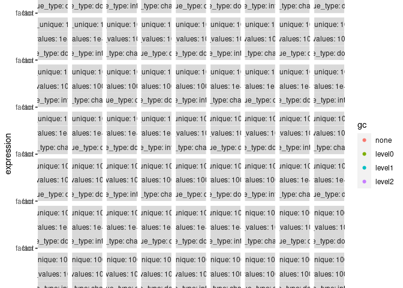

<!-- bench/bench.md is generated from bench/bench.Rmd. Please edit that file -->

``` r
library(facts)
#> Registered S3 methods overwritten by 'facts':
#>   method            from
#>   [.fact            mark
#>   as.Date.fact      mark
#>   as.character.fact mark
#>   as.double.fact    mark
#>   as.integer.fact   mark
#>   print.fact        mark
#>   print.pseudo_id   mark
#>   unique.fact       mark
```

## Logical vectors

``` r
# Logical is much faster because we only have to check for 3 values
y <- x <- runif(1e6) > .5
y[sample(seq_along(y), 1e4)] <- NA

bench::mark(
  factor(x),
  fact(x),
  factor(y),
  fact(y),
  check = FALSE
)[1:9] |> 
  transform(expression = sapply(expression, deparse)) |> 
  gt::gt("expression")
#> Warning: Some expressions had a GC in every iteration; so filtering is disabled.
```

<div id="pqnfhhbqkt" style="overflow-x:auto;overflow-y:auto;width:auto;height:auto;">
<style>html {
  font-family: -apple-system, BlinkMacSystemFont, 'Segoe UI', Roboto, Oxygen, Ubuntu, Cantarell, 'Helvetica Neue', 'Fira Sans', 'Droid Sans', Arial, sans-serif;
}

#pqnfhhbqkt .gt_table {
  display: table;
  border-collapse: collapse;
  margin-left: auto;
  margin-right: auto;
  color: #333333;
  font-size: 16px;
  font-weight: normal;
  font-style: normal;
  background-color: #FFFFFF;
  width: auto;
  border-top-style: solid;
  border-top-width: 2px;
  border-top-color: #A8A8A8;
  border-right-style: none;
  border-right-width: 2px;
  border-right-color: #D3D3D3;
  border-bottom-style: solid;
  border-bottom-width: 2px;
  border-bottom-color: #A8A8A8;
  border-left-style: none;
  border-left-width: 2px;
  border-left-color: #D3D3D3;
}

#pqnfhhbqkt .gt_heading {
  background-color: #FFFFFF;
  text-align: center;
  border-bottom-color: #FFFFFF;
  border-left-style: none;
  border-left-width: 1px;
  border-left-color: #D3D3D3;
  border-right-style: none;
  border-right-width: 1px;
  border-right-color: #D3D3D3;
}

#pqnfhhbqkt .gt_title {
  color: #333333;
  font-size: 125%;
  font-weight: initial;
  padding-top: 4px;
  padding-bottom: 4px;
  padding-left: 5px;
  padding-right: 5px;
  border-bottom-color: #FFFFFF;
  border-bottom-width: 0;
}

#pqnfhhbqkt .gt_subtitle {
  color: #333333;
  font-size: 85%;
  font-weight: initial;
  padding-top: 0;
  padding-bottom: 6px;
  padding-left: 5px;
  padding-right: 5px;
  border-top-color: #FFFFFF;
  border-top-width: 0;
}

#pqnfhhbqkt .gt_bottom_border {
  border-bottom-style: solid;
  border-bottom-width: 2px;
  border-bottom-color: #D3D3D3;
}

#pqnfhhbqkt .gt_col_headings {
  border-top-style: solid;
  border-top-width: 2px;
  border-top-color: #D3D3D3;
  border-bottom-style: solid;
  border-bottom-width: 2px;
  border-bottom-color: #D3D3D3;
  border-left-style: none;
  border-left-width: 1px;
  border-left-color: #D3D3D3;
  border-right-style: none;
  border-right-width: 1px;
  border-right-color: #D3D3D3;
}

#pqnfhhbqkt .gt_col_heading {
  color: #333333;
  background-color: #FFFFFF;
  font-size: 100%;
  font-weight: normal;
  text-transform: inherit;
  border-left-style: none;
  border-left-width: 1px;
  border-left-color: #D3D3D3;
  border-right-style: none;
  border-right-width: 1px;
  border-right-color: #D3D3D3;
  vertical-align: bottom;
  padding-top: 5px;
  padding-bottom: 6px;
  padding-left: 5px;
  padding-right: 5px;
  overflow-x: hidden;
}

#pqnfhhbqkt .gt_column_spanner_outer {
  color: #333333;
  background-color: #FFFFFF;
  font-size: 100%;
  font-weight: normal;
  text-transform: inherit;
  padding-top: 0;
  padding-bottom: 0;
  padding-left: 4px;
  padding-right: 4px;
}

#pqnfhhbqkt .gt_column_spanner_outer:first-child {
  padding-left: 0;
}

#pqnfhhbqkt .gt_column_spanner_outer:last-child {
  padding-right: 0;
}

#pqnfhhbqkt .gt_column_spanner {
  border-bottom-style: solid;
  border-bottom-width: 2px;
  border-bottom-color: #D3D3D3;
  vertical-align: bottom;
  padding-top: 5px;
  padding-bottom: 5px;
  overflow-x: hidden;
  display: inline-block;
  width: 100%;
}

#pqnfhhbqkt .gt_group_heading {
  padding-top: 8px;
  padding-bottom: 8px;
  padding-left: 5px;
  padding-right: 5px;
  color: #333333;
  background-color: #FFFFFF;
  font-size: 100%;
  font-weight: initial;
  text-transform: inherit;
  border-top-style: solid;
  border-top-width: 2px;
  border-top-color: #D3D3D3;
  border-bottom-style: solid;
  border-bottom-width: 2px;
  border-bottom-color: #D3D3D3;
  border-left-style: none;
  border-left-width: 1px;
  border-left-color: #D3D3D3;
  border-right-style: none;
  border-right-width: 1px;
  border-right-color: #D3D3D3;
  vertical-align: middle;
}

#pqnfhhbqkt .gt_empty_group_heading {
  padding: 0.5px;
  color: #333333;
  background-color: #FFFFFF;
  font-size: 100%;
  font-weight: initial;
  border-top-style: solid;
  border-top-width: 2px;
  border-top-color: #D3D3D3;
  border-bottom-style: solid;
  border-bottom-width: 2px;
  border-bottom-color: #D3D3D3;
  vertical-align: middle;
}

#pqnfhhbqkt .gt_from_md > :first-child {
  margin-top: 0;
}

#pqnfhhbqkt .gt_from_md > :last-child {
  margin-bottom: 0;
}

#pqnfhhbqkt .gt_row {
  padding-top: 8px;
  padding-bottom: 8px;
  padding-left: 5px;
  padding-right: 5px;
  margin: 10px;
  border-top-style: solid;
  border-top-width: 1px;
  border-top-color: #D3D3D3;
  border-left-style: none;
  border-left-width: 1px;
  border-left-color: #D3D3D3;
  border-right-style: none;
  border-right-width: 1px;
  border-right-color: #D3D3D3;
  vertical-align: middle;
  overflow-x: hidden;
}

#pqnfhhbqkt .gt_stub {
  color: #333333;
  background-color: #FFFFFF;
  font-size: 100%;
  font-weight: initial;
  text-transform: inherit;
  border-right-style: solid;
  border-right-width: 2px;
  border-right-color: #D3D3D3;
  padding-left: 5px;
  padding-right: 5px;
}

#pqnfhhbqkt .gt_stub_row_group {
  color: #333333;
  background-color: #FFFFFF;
  font-size: 100%;
  font-weight: initial;
  text-transform: inherit;
  border-right-style: solid;
  border-right-width: 2px;
  border-right-color: #D3D3D3;
  padding-left: 5px;
  padding-right: 5px;
  vertical-align: top;
}

#pqnfhhbqkt .gt_row_group_first td {
  border-top-width: 2px;
}

#pqnfhhbqkt .gt_summary_row {
  color: #333333;
  background-color: #FFFFFF;
  text-transform: inherit;
  padding-top: 8px;
  padding-bottom: 8px;
  padding-left: 5px;
  padding-right: 5px;
}

#pqnfhhbqkt .gt_first_summary_row {
  border-top-style: solid;
  border-top-color: #D3D3D3;
}

#pqnfhhbqkt .gt_first_summary_row.thick {
  border-top-width: 2px;
}

#pqnfhhbqkt .gt_last_summary_row {
  padding-top: 8px;
  padding-bottom: 8px;
  padding-left: 5px;
  padding-right: 5px;
  border-bottom-style: solid;
  border-bottom-width: 2px;
  border-bottom-color: #D3D3D3;
}

#pqnfhhbqkt .gt_grand_summary_row {
  color: #333333;
  background-color: #FFFFFF;
  text-transform: inherit;
  padding-top: 8px;
  padding-bottom: 8px;
  padding-left: 5px;
  padding-right: 5px;
}

#pqnfhhbqkt .gt_first_grand_summary_row {
  padding-top: 8px;
  padding-bottom: 8px;
  padding-left: 5px;
  padding-right: 5px;
  border-top-style: double;
  border-top-width: 6px;
  border-top-color: #D3D3D3;
}

#pqnfhhbqkt .gt_striped {
  background-color: rgba(128, 128, 128, 0.05);
}

#pqnfhhbqkt .gt_table_body {
  border-top-style: solid;
  border-top-width: 2px;
  border-top-color: #D3D3D3;
  border-bottom-style: solid;
  border-bottom-width: 2px;
  border-bottom-color: #D3D3D3;
}

#pqnfhhbqkt .gt_footnotes {
  color: #333333;
  background-color: #FFFFFF;
  border-bottom-style: none;
  border-bottom-width: 2px;
  border-bottom-color: #D3D3D3;
  border-left-style: none;
  border-left-width: 2px;
  border-left-color: #D3D3D3;
  border-right-style: none;
  border-right-width: 2px;
  border-right-color: #D3D3D3;
}

#pqnfhhbqkt .gt_footnote {
  margin: 0px;
  font-size: 90%;
  padding-left: 4px;
  padding-right: 4px;
  padding-left: 5px;
  padding-right: 5px;
}

#pqnfhhbqkt .gt_sourcenotes {
  color: #333333;
  background-color: #FFFFFF;
  border-bottom-style: none;
  border-bottom-width: 2px;
  border-bottom-color: #D3D3D3;
  border-left-style: none;
  border-left-width: 2px;
  border-left-color: #D3D3D3;
  border-right-style: none;
  border-right-width: 2px;
  border-right-color: #D3D3D3;
}

#pqnfhhbqkt .gt_sourcenote {
  font-size: 90%;
  padding-top: 4px;
  padding-bottom: 4px;
  padding-left: 5px;
  padding-right: 5px;
}

#pqnfhhbqkt .gt_left {
  text-align: left;
}

#pqnfhhbqkt .gt_center {
  text-align: center;
}

#pqnfhhbqkt .gt_right {
  text-align: right;
  font-variant-numeric: tabular-nums;
}

#pqnfhhbqkt .gt_font_normal {
  font-weight: normal;
}

#pqnfhhbqkt .gt_font_bold {
  font-weight: bold;
}

#pqnfhhbqkt .gt_font_italic {
  font-style: italic;
}

#pqnfhhbqkt .gt_super {
  font-size: 65%;
}

#pqnfhhbqkt .gt_footnote_marks {
  font-style: italic;
  font-weight: normal;
  font-size: 75%;
  vertical-align: 0.4em;
}

#pqnfhhbqkt .gt_asterisk {
  font-size: 100%;
  vertical-align: 0;
}

#pqnfhhbqkt .gt_indent_1 {
  text-indent: 5px;
}

#pqnfhhbqkt .gt_indent_2 {
  text-indent: 10px;
}

#pqnfhhbqkt .gt_indent_3 {
  text-indent: 15px;
}

#pqnfhhbqkt .gt_indent_4 {
  text-indent: 20px;
}

#pqnfhhbqkt .gt_indent_5 {
  text-indent: 25px;
}
</style>
<table class="gt_table">
  
  <thead class="gt_col_headings">
    <tr>
      <th class="gt_col_heading gt_columns_bottom_border gt_left" rowspan="1" colspan="1" scope="col"></th>
      <th class="gt_col_heading gt_columns_bottom_border gt_center" rowspan="1" colspan="1" scope="col">min</th>
      <th class="gt_col_heading gt_columns_bottom_border gt_center" rowspan="1" colspan="1" scope="col">median</th>
      <th class="gt_col_heading gt_columns_bottom_border gt_right" rowspan="1" colspan="1" scope="col">itr.sec</th>
      <th class="gt_col_heading gt_columns_bottom_border gt_center" rowspan="1" colspan="1" scope="col">mem_alloc</th>
      <th class="gt_col_heading gt_columns_bottom_border gt_right" rowspan="1" colspan="1" scope="col">gc.sec</th>
      <th class="gt_col_heading gt_columns_bottom_border gt_right" rowspan="1" colspan="1" scope="col">n_itr</th>
      <th class="gt_col_heading gt_columns_bottom_border gt_right" rowspan="1" colspan="1" scope="col">n_gc</th>
      <th class="gt_col_heading gt_columns_bottom_border gt_center" rowspan="1" colspan="1" scope="col">total_time</th>
    </tr>
  </thead>
  <tbody class="gt_table_body">
    <tr><th scope="row" class="gt_row gt_left gt_stub">factor(x)</th>
<td class="gt_row gt_center">148.8ms</td>
<td class="gt_row gt_center">152.1ms</td>
<td class="gt_row gt_right">6.473024</td>
<td class="gt_row gt_center">22.9MB</td>
<td class="gt_row gt_right">8.091280</td>
<td class="gt_row gt_right">4</td>
<td class="gt_row gt_right">5</td>
<td class="gt_row gt_center">618ms</td></tr>
    <tr><th scope="row" class="gt_row gt_left gt_stub">fact(x)</th>
<td class="gt_row gt_center">21.1ms</td>
<td class="gt_row gt_center">24.1ms</td>
<td class="gt_row gt_right">33.837625</td>
<td class="gt_row gt_center">23.0MB</td>
<td class="gt_row gt_right">33.837625</td>
<td class="gt_row gt_right">17</td>
<td class="gt_row gt_right">17</td>
<td class="gt_row gt_center">502ms</td></tr>
    <tr><th scope="row" class="gt_row gt_left gt_stub">factor(y)</th>
<td class="gt_row gt_center">145.2ms</td>
<td class="gt_row gt_center">149.7ms</td>
<td class="gt_row gt_right">6.696535</td>
<td class="gt_row gt_center">22.9MB</td>
<td class="gt_row gt_right">5.022401</td>
<td class="gt_row gt_right">4</td>
<td class="gt_row gt_right">3</td>
<td class="gt_row gt_center">597ms</td></tr>
    <tr><th scope="row" class="gt_row gt_left gt_stub">fact(y)</th>
<td class="gt_row gt_center">14.5ms</td>
<td class="gt_row gt_center">21.1ms</td>
<td class="gt_row gt_right">36.772687</td>
<td class="gt_row gt_center">22.9MB</td>
<td class="gt_row gt_right">36.772687</td>
<td class="gt_row gt_right">19</td>
<td class="gt_row gt_right">19</td>
<td class="gt_row gt_center">517ms</td></tr>
  </tbody>
  
  
</table>
</div>

## Character

``` r
res <- bench::press(
  n_unique = 10^(1:4),
  n_values = 10^(2:6),
  value_type = c("character", "double", "integer", "date"),
  {
    x <- switch(
      value_type,
      character = stringi::stri_rand_strings(n_unique, 5),
      double = runif(n_unique),
      integer = order(runif(n_unique)),
      date = Sys.Date() + order(runif(n_unique))
    )
    x <- sample(x, n_values, TRUE)
    bench::mark(
      factor = factor(x),
      fact = fact(x),
      check = FALSE
    )
  }
)
#> Running with:
#>    n_unique n_values value_type
#>  1       10      100 character
#>  2      100      100 character
#>  3     1000      100 character
#>  4    10000      100 character
#>  5       10     1000 character
#>  6      100     1000 character
#>  7     1000     1000 character
#>  8    10000     1000 character
#>  9       10    10000 character
#> 10      100    10000 character
#> 11     1000    10000 character
#> 12    10000    10000 character
#> 13       10   100000 character
#> 14      100   100000 character
#> 15     1000   100000 character
#> 16    10000   100000 character
#> 17       10  1000000 character
#> Warning: Some expressions had a GC in every iteration; so filtering is disabled.
#> 18      100  1000000 character
#> 19     1000  1000000 character
#> 20    10000  1000000 character
#> 21       10      100 double
#> 22      100      100 double
#> 23     1000      100 double
#> 24    10000      100 double
#> 25       10     1000 double
#> 26      100     1000 double
#> 27     1000     1000 double
#> 28    10000     1000 double
#> 29       10    10000 double
#> 30      100    10000 double
#> 31     1000    10000 double
#> 32    10000    10000 double
#> 33       10   100000 double
#> 34      100   100000 double
#> 35     1000   100000 double
#> 36    10000   100000 double
#> 37       10  1000000 double
#> Warning: Some expressions had a GC in every iteration; so filtering is disabled.
#> 38      100  1000000 double
#> Warning: Some expressions had a GC in every iteration; so filtering is disabled.
#> 39     1000  1000000 double
#> 40    10000  1000000 double
#> Warning: Some expressions had a GC in every iteration; so filtering is disabled.
#> 41       10      100 integer
#> 42      100      100 integer
#> 43     1000      100 integer
#> 44    10000      100 integer
#> 45       10     1000 integer
#> 46      100     1000 integer
#> 47     1000     1000 integer
#> 48    10000     1000 integer
#> 49       10    10000 integer
#> 50      100    10000 integer
#> 51     1000    10000 integer
#> 52    10000    10000 integer
#> 53       10   100000 integer
#> 54      100   100000 integer
#> 55     1000   100000 integer
#> 56    10000   100000 integer
#> 57       10  1000000 integer
#> 58      100  1000000 integer
#> 59     1000  1000000 integer
#> 60    10000  1000000 integer
#> Warning: Some expressions had a GC in every iteration; so filtering is disabled.
#> 61       10      100 date
#> 62      100      100 date
#> 63     1000      100 date
#> 64    10000      100 date
#> 65       10     1000 date
#> 66      100     1000 date
#> 67     1000     1000 date
#> 68    10000     1000 date
#> 69       10    10000 date
#> 70      100    10000 date
#> 71     1000    10000 date
#> 72    10000    10000 date
#> 73       10   100000 date
#> 74      100   100000 date
#> Warning: Some expressions had a GC in every iteration; so filtering is disabled.
#> 75     1000   100000 date
#> 76    10000   100000 date
#> Warning: Some expressions had a GC in every iteration; so filtering is disabled.
#> 77       10  1000000 date
#> Warning: Some expressions had a GC in every iteration; so filtering is disabled.
#> 78      100  1000000 date
#> Warning: Some expressions had a GC in every iteration; so filtering is disabled.
#> 79     1000  1000000 date
#> Warning: Some expressions had a GC in every iteration; so filtering is disabled.
#> 80    10000  1000000 date
#> Warning: Some expressions had a GC in every iteration; so filtering is disabled.

res[1:9] |> 
  transform(expression = sapply(expression, deparse)) |> 
  gt::gt("expression")
```

<div id="wrbtsfyzac" style="overflow-x:auto;overflow-y:auto;width:auto;height:auto;">
<style>html {
  font-family: -apple-system, BlinkMacSystemFont, 'Segoe UI', Roboto, Oxygen, Ubuntu, Cantarell, 'Helvetica Neue', 'Fira Sans', 'Droid Sans', Arial, sans-serif;
}

#wrbtsfyzac .gt_table {
  display: table;
  border-collapse: collapse;
  margin-left: auto;
  margin-right: auto;
  color: #333333;
  font-size: 16px;
  font-weight: normal;
  font-style: normal;
  background-color: #FFFFFF;
  width: auto;
  border-top-style: solid;
  border-top-width: 2px;
  border-top-color: #A8A8A8;
  border-right-style: none;
  border-right-width: 2px;
  border-right-color: #D3D3D3;
  border-bottom-style: solid;
  border-bottom-width: 2px;
  border-bottom-color: #A8A8A8;
  border-left-style: none;
  border-left-width: 2px;
  border-left-color: #D3D3D3;
}

#wrbtsfyzac .gt_heading {
  background-color: #FFFFFF;
  text-align: center;
  border-bottom-color: #FFFFFF;
  border-left-style: none;
  border-left-width: 1px;
  border-left-color: #D3D3D3;
  border-right-style: none;
  border-right-width: 1px;
  border-right-color: #D3D3D3;
}

#wrbtsfyzac .gt_title {
  color: #333333;
  font-size: 125%;
  font-weight: initial;
  padding-top: 4px;
  padding-bottom: 4px;
  padding-left: 5px;
  padding-right: 5px;
  border-bottom-color: #FFFFFF;
  border-bottom-width: 0;
}

#wrbtsfyzac .gt_subtitle {
  color: #333333;
  font-size: 85%;
  font-weight: initial;
  padding-top: 0;
  padding-bottom: 6px;
  padding-left: 5px;
  padding-right: 5px;
  border-top-color: #FFFFFF;
  border-top-width: 0;
}

#wrbtsfyzac .gt_bottom_border {
  border-bottom-style: solid;
  border-bottom-width: 2px;
  border-bottom-color: #D3D3D3;
}

#wrbtsfyzac .gt_col_headings {
  border-top-style: solid;
  border-top-width: 2px;
  border-top-color: #D3D3D3;
  border-bottom-style: solid;
  border-bottom-width: 2px;
  border-bottom-color: #D3D3D3;
  border-left-style: none;
  border-left-width: 1px;
  border-left-color: #D3D3D3;
  border-right-style: none;
  border-right-width: 1px;
  border-right-color: #D3D3D3;
}

#wrbtsfyzac .gt_col_heading {
  color: #333333;
  background-color: #FFFFFF;
  font-size: 100%;
  font-weight: normal;
  text-transform: inherit;
  border-left-style: none;
  border-left-width: 1px;
  border-left-color: #D3D3D3;
  border-right-style: none;
  border-right-width: 1px;
  border-right-color: #D3D3D3;
  vertical-align: bottom;
  padding-top: 5px;
  padding-bottom: 6px;
  padding-left: 5px;
  padding-right: 5px;
  overflow-x: hidden;
}

#wrbtsfyzac .gt_column_spanner_outer {
  color: #333333;
  background-color: #FFFFFF;
  font-size: 100%;
  font-weight: normal;
  text-transform: inherit;
  padding-top: 0;
  padding-bottom: 0;
  padding-left: 4px;
  padding-right: 4px;
}

#wrbtsfyzac .gt_column_spanner_outer:first-child {
  padding-left: 0;
}

#wrbtsfyzac .gt_column_spanner_outer:last-child {
  padding-right: 0;
}

#wrbtsfyzac .gt_column_spanner {
  border-bottom-style: solid;
  border-bottom-width: 2px;
  border-bottom-color: #D3D3D3;
  vertical-align: bottom;
  padding-top: 5px;
  padding-bottom: 5px;
  overflow-x: hidden;
  display: inline-block;
  width: 100%;
}

#wrbtsfyzac .gt_group_heading {
  padding-top: 8px;
  padding-bottom: 8px;
  padding-left: 5px;
  padding-right: 5px;
  color: #333333;
  background-color: #FFFFFF;
  font-size: 100%;
  font-weight: initial;
  text-transform: inherit;
  border-top-style: solid;
  border-top-width: 2px;
  border-top-color: #D3D3D3;
  border-bottom-style: solid;
  border-bottom-width: 2px;
  border-bottom-color: #D3D3D3;
  border-left-style: none;
  border-left-width: 1px;
  border-left-color: #D3D3D3;
  border-right-style: none;
  border-right-width: 1px;
  border-right-color: #D3D3D3;
  vertical-align: middle;
}

#wrbtsfyzac .gt_empty_group_heading {
  padding: 0.5px;
  color: #333333;
  background-color: #FFFFFF;
  font-size: 100%;
  font-weight: initial;
  border-top-style: solid;
  border-top-width: 2px;
  border-top-color: #D3D3D3;
  border-bottom-style: solid;
  border-bottom-width: 2px;
  border-bottom-color: #D3D3D3;
  vertical-align: middle;
}

#wrbtsfyzac .gt_from_md > :first-child {
  margin-top: 0;
}

#wrbtsfyzac .gt_from_md > :last-child {
  margin-bottom: 0;
}

#wrbtsfyzac .gt_row {
  padding-top: 8px;
  padding-bottom: 8px;
  padding-left: 5px;
  padding-right: 5px;
  margin: 10px;
  border-top-style: solid;
  border-top-width: 1px;
  border-top-color: #D3D3D3;
  border-left-style: none;
  border-left-width: 1px;
  border-left-color: #D3D3D3;
  border-right-style: none;
  border-right-width: 1px;
  border-right-color: #D3D3D3;
  vertical-align: middle;
  overflow-x: hidden;
}

#wrbtsfyzac .gt_stub {
  color: #333333;
  background-color: #FFFFFF;
  font-size: 100%;
  font-weight: initial;
  text-transform: inherit;
  border-right-style: solid;
  border-right-width: 2px;
  border-right-color: #D3D3D3;
  padding-left: 5px;
  padding-right: 5px;
}

#wrbtsfyzac .gt_stub_row_group {
  color: #333333;
  background-color: #FFFFFF;
  font-size: 100%;
  font-weight: initial;
  text-transform: inherit;
  border-right-style: solid;
  border-right-width: 2px;
  border-right-color: #D3D3D3;
  padding-left: 5px;
  padding-right: 5px;
  vertical-align: top;
}

#wrbtsfyzac .gt_row_group_first td {
  border-top-width: 2px;
}

#wrbtsfyzac .gt_summary_row {
  color: #333333;
  background-color: #FFFFFF;
  text-transform: inherit;
  padding-top: 8px;
  padding-bottom: 8px;
  padding-left: 5px;
  padding-right: 5px;
}

#wrbtsfyzac .gt_first_summary_row {
  border-top-style: solid;
  border-top-color: #D3D3D3;
}

#wrbtsfyzac .gt_first_summary_row.thick {
  border-top-width: 2px;
}

#wrbtsfyzac .gt_last_summary_row {
  padding-top: 8px;
  padding-bottom: 8px;
  padding-left: 5px;
  padding-right: 5px;
  border-bottom-style: solid;
  border-bottom-width: 2px;
  border-bottom-color: #D3D3D3;
}

#wrbtsfyzac .gt_grand_summary_row {
  color: #333333;
  background-color: #FFFFFF;
  text-transform: inherit;
  padding-top: 8px;
  padding-bottom: 8px;
  padding-left: 5px;
  padding-right: 5px;
}

#wrbtsfyzac .gt_first_grand_summary_row {
  padding-top: 8px;
  padding-bottom: 8px;
  padding-left: 5px;
  padding-right: 5px;
  border-top-style: double;
  border-top-width: 6px;
  border-top-color: #D3D3D3;
}

#wrbtsfyzac .gt_striped {
  background-color: rgba(128, 128, 128, 0.05);
}

#wrbtsfyzac .gt_table_body {
  border-top-style: solid;
  border-top-width: 2px;
  border-top-color: #D3D3D3;
  border-bottom-style: solid;
  border-bottom-width: 2px;
  border-bottom-color: #D3D3D3;
}

#wrbtsfyzac .gt_footnotes {
  color: #333333;
  background-color: #FFFFFF;
  border-bottom-style: none;
  border-bottom-width: 2px;
  border-bottom-color: #D3D3D3;
  border-left-style: none;
  border-left-width: 2px;
  border-left-color: #D3D3D3;
  border-right-style: none;
  border-right-width: 2px;
  border-right-color: #D3D3D3;
}

#wrbtsfyzac .gt_footnote {
  margin: 0px;
  font-size: 90%;
  padding-left: 4px;
  padding-right: 4px;
  padding-left: 5px;
  padding-right: 5px;
}

#wrbtsfyzac .gt_sourcenotes {
  color: #333333;
  background-color: #FFFFFF;
  border-bottom-style: none;
  border-bottom-width: 2px;
  border-bottom-color: #D3D3D3;
  border-left-style: none;
  border-left-width: 2px;
  border-left-color: #D3D3D3;
  border-right-style: none;
  border-right-width: 2px;
  border-right-color: #D3D3D3;
}

#wrbtsfyzac .gt_sourcenote {
  font-size: 90%;
  padding-top: 4px;
  padding-bottom: 4px;
  padding-left: 5px;
  padding-right: 5px;
}

#wrbtsfyzac .gt_left {
  text-align: left;
}

#wrbtsfyzac .gt_center {
  text-align: center;
}

#wrbtsfyzac .gt_right {
  text-align: right;
  font-variant-numeric: tabular-nums;
}

#wrbtsfyzac .gt_font_normal {
  font-weight: normal;
}

#wrbtsfyzac .gt_font_bold {
  font-weight: bold;
}

#wrbtsfyzac .gt_font_italic {
  font-style: italic;
}

#wrbtsfyzac .gt_super {
  font-size: 65%;
}

#wrbtsfyzac .gt_footnote_marks {
  font-style: italic;
  font-weight: normal;
  font-size: 75%;
  vertical-align: 0.4em;
}

#wrbtsfyzac .gt_asterisk {
  font-size: 100%;
  vertical-align: 0;
}

#wrbtsfyzac .gt_indent_1 {
  text-indent: 5px;
}

#wrbtsfyzac .gt_indent_2 {
  text-indent: 10px;
}

#wrbtsfyzac .gt_indent_3 {
  text-indent: 15px;
}

#wrbtsfyzac .gt_indent_4 {
  text-indent: 20px;
}

#wrbtsfyzac .gt_indent_5 {
  text-indent: 25px;
}
</style>
<table class="gt_table">
  
  <thead class="gt_col_headings">
    <tr>
      <th class="gt_col_heading gt_columns_bottom_border gt_left" rowspan="1" colspan="1" scope="col"></th>
      <th class="gt_col_heading gt_columns_bottom_border gt_right" rowspan="1" colspan="1" scope="col">n_unique</th>
      <th class="gt_col_heading gt_columns_bottom_border gt_right" rowspan="1" colspan="1" scope="col">n_values</th>
      <th class="gt_col_heading gt_columns_bottom_border gt_left" rowspan="1" colspan="1" scope="col">value_type</th>
      <th class="gt_col_heading gt_columns_bottom_border gt_center" rowspan="1" colspan="1" scope="col">min</th>
      <th class="gt_col_heading gt_columns_bottom_border gt_center" rowspan="1" colspan="1" scope="col">median</th>
      <th class="gt_col_heading gt_columns_bottom_border gt_right" rowspan="1" colspan="1" scope="col">itr.sec</th>
      <th class="gt_col_heading gt_columns_bottom_border gt_center" rowspan="1" colspan="1" scope="col">mem_alloc</th>
      <th class="gt_col_heading gt_columns_bottom_border gt_right" rowspan="1" colspan="1" scope="col">gc.sec</th>
    </tr>
  </thead>
  <tbody class="gt_table_body">
    <tr><th scope="row" class="gt_row gt_left gt_stub">factor(x)</th>
<td class="gt_row gt_right">10</td>
<td class="gt_row gt_right">1e+02</td>
<td class="gt_row gt_left">character</td>
<td class="gt_row gt_center">31.95µs</td>
<td class="gt_row gt_center">37.41µs</td>
<td class="gt_row gt_right">2.304133e+04</td>
<td class="gt_row gt_center">2.75KB</td>
<td class="gt_row gt_right">9.2202188</td></tr>
    <tr><th scope="row" class="gt_row gt_left gt_stub">fact(x)</th>
<td class="gt_row gt_right">10</td>
<td class="gt_row gt_right">1e+02</td>
<td class="gt_row gt_left">character</td>
<td class="gt_row gt_center">30.43µs</td>
<td class="gt_row gt_center">34.01µs</td>
<td class="gt_row gt_right">2.724871e+04</td>
<td class="gt_row gt_center">57.98KB</td>
<td class="gt_row gt_right">8.1770671</td></tr>
    <tr><th scope="row" class="gt_row gt_left gt_stub">factor(x)</th>
<td class="gt_row gt_right">100</td>
<td class="gt_row gt_right">1e+02</td>
<td class="gt_row gt_left">character</td>
<td class="gt_row gt_center">77.96µs</td>
<td class="gt_row gt_center">85.57µs</td>
<td class="gt_row gt_right">1.115701e+04</td>
<td class="gt_row gt_center">11.19KB</td>
<td class="gt_row gt_right">4.1101526</td></tr>
    <tr><th scope="row" class="gt_row gt_left gt_stub">fact(x)</th>
<td class="gt_row gt_right">100</td>
<td class="gt_row gt_right">1e+02</td>
<td class="gt_row gt_left">character</td>
<td class="gt_row gt_center">31.11µs</td>
<td class="gt_row gt_center">34.05µs</td>
<td class="gt_row gt_right">2.728603e+04</td>
<td class="gt_row gt_center">6.01KB</td>
<td class="gt_row gt_right">10.9187778</td></tr>
    <tr><th scope="row" class="gt_row gt_left gt_stub">factor(x)</th>
<td class="gt_row gt_right">1000</td>
<td class="gt_row gt_right">1e+02</td>
<td class="gt_row gt_left">character</td>
<td class="gt_row gt_center">93.01µs</td>
<td class="gt_row gt_center">98.30µs</td>
<td class="gt_row gt_right">9.334571e+03</td>
<td class="gt_row gt_center">13.07KB</td>
<td class="gt_row gt_right">2.0610666</td></tr>
    <tr><th scope="row" class="gt_row gt_left gt_stub">fact(x)</th>
<td class="gt_row gt_right">1000</td>
<td class="gt_row gt_right">1e+02</td>
<td class="gt_row gt_left">character</td>
<td class="gt_row gt_center">32.70µs</td>
<td class="gt_row gt_center">36.29µs</td>
<td class="gt_row gt_right">2.577320e+04</td>
<td class="gt_row gt_center">6.96KB</td>
<td class="gt_row gt_right">10.3134068</td></tr>
    <tr><th scope="row" class="gt_row gt_left gt_stub">factor(x)</th>
<td class="gt_row gt_right">10000</td>
<td class="gt_row gt_right">1e+02</td>
<td class="gt_row gt_left">character</td>
<td class="gt_row gt_center">100.58µs</td>
<td class="gt_row gt_center">105.72µs</td>
<td class="gt_row gt_right">8.664556e+03</td>
<td class="gt_row gt_center">13.44KB</td>
<td class="gt_row gt_right">4.1299122</td></tr>
    <tr><th scope="row" class="gt_row gt_left gt_stub">fact(x)</th>
<td class="gt_row gt_right">10000</td>
<td class="gt_row gt_right">1e+02</td>
<td class="gt_row gt_left">character</td>
<td class="gt_row gt_center">32.56µs</td>
<td class="gt_row gt_center">41.03µs</td>
<td class="gt_row gt_right">2.195538e+04</td>
<td class="gt_row gt_center">7.13KB</td>
<td class="gt_row gt_right">6.5885896</td></tr>
    <tr><th scope="row" class="gt_row gt_left gt_stub">factor(x)</th>
<td class="gt_row gt_right">10</td>
<td class="gt_row gt_right">1e+03</td>
<td class="gt_row gt_left">character</td>
<td class="gt_row gt_center">52.50µs</td>
<td class="gt_row gt_center">66.81µs</td>
<td class="gt_row gt_right">1.405772e+04</td>
<td class="gt_row gt_center">23.81KB</td>
<td class="gt_row gt_right">8.3889130</td></tr>
    <tr><th scope="row" class="gt_row gt_left gt_stub">fact(x)</th>
<td class="gt_row gt_right">10</td>
<td class="gt_row gt_right">1e+03</td>
<td class="gt_row gt_left">character</td>
<td class="gt_row gt_center">53.65µs</td>
<td class="gt_row gt_center">70.41µs</td>
<td class="gt_row gt_right">1.320560e+04</td>
<td class="gt_row gt_center">23.87KB</td>
<td class="gt_row gt_right">8.4286603</td></tr>
    <tr><th scope="row" class="gt_row gt_left gt_stub">factor(x)</th>
<td class="gt_row gt_right">100</td>
<td class="gt_row gt_right">1e+03</td>
<td class="gt_row gt_left">character</td>
<td class="gt_row gt_center">130.64µs</td>
<td class="gt_row gt_center">172.38µs</td>
<td class="gt_row gt_right">5.345903e+03</td>
<td class="gt_row gt_center">34.55KB</td>
<td class="gt_row gt_right">4.1217449</td></tr>
    <tr><th scope="row" class="gt_row gt_left gt_stub">fact(x)</th>
<td class="gt_row gt_right">100</td>
<td class="gt_row gt_right">1e+03</td>
<td class="gt_row gt_left">character</td>
<td class="gt_row gt_center">53.42µs</td>
<td class="gt_row gt_center">65.43µs</td>
<td class="gt_row gt_right">1.349005e+04</td>
<td class="gt_row gt_center">28.73KB</td>
<td class="gt_row gt_right">10.8790696</td></tr>
    <tr><th scope="row" class="gt_row gt_left gt_stub">factor(x)</th>
<td class="gt_row gt_right">1000</td>
<td class="gt_row gt_right">1e+03</td>
<td class="gt_row gt_left">character</td>
<td class="gt_row gt_center">889.12µs</td>
<td class="gt_row gt_center">983.95µs</td>
<td class="gt_row gt_right">9.721059e+02</td>
<td class="gt_row gt_center">93.33KB</td>
<td class="gt_row gt_right">2.0210102</td></tr>
    <tr><th scope="row" class="gt_row gt_left gt_stub">fact(x)</th>
<td class="gt_row gt_right">1000</td>
<td class="gt_row gt_right">1e+03</td>
<td class="gt_row gt_left">character</td>
<td class="gt_row gt_center">89.52µs</td>
<td class="gt_row gt_center">102.09µs</td>
<td class="gt_row gt_right">8.842245e+03</td>
<td class="gt_row gt_center">50.61KB</td>
<td class="gt_row gt_right">10.6174892</td></tr>
    <tr><th scope="row" class="gt_row gt_left gt_stub">factor(x)</th>
<td class="gt_row gt_right">10000</td>
<td class="gt_row gt_right">1e+03</td>
<td class="gt_row gt_left">character</td>
<td class="gt_row gt_center">1.48ms</td>
<td class="gt_row gt_center">1.78ms</td>
<td class="gt_row gt_right">5.585714e+02</td>
<td class="gt_row gt_center">114.98KB</td>
<td class="gt_row gt_right">2.0385818</td></tr>
    <tr><th scope="row" class="gt_row gt_left gt_stub">fact(x)</th>
<td class="gt_row gt_right">10000</td>
<td class="gt_row gt_right">1e+03</td>
<td class="gt_row gt_left">character</td>
<td class="gt_row gt_center">88.06µs</td>
<td class="gt_row gt_center">106.42µs</td>
<td class="gt_row gt_right">8.751384e+03</td>
<td class="gt_row gt_center">65.44KB</td>
<td class="gt_row gt_right">15.3264177</td></tr>
    <tr><th scope="row" class="gt_row gt_left gt_stub">factor(x)</th>
<td class="gt_row gt_right">10</td>
<td class="gt_row gt_right">1e+04</td>
<td class="gt_row gt_left">character</td>
<td class="gt_row gt_center">229.24µs</td>
<td class="gt_row gt_center">276.09µs</td>
<td class="gt_row gt_right">3.403997e+03</td>
<td class="gt_row gt_center">284.44KB</td>
<td class="gt_row gt_right">25.2147934</td></tr>
    <tr><th scope="row" class="gt_row gt_left gt_stub">fact(x)</th>
<td class="gt_row gt_right">10</td>
<td class="gt_row gt_right">1e+04</td>
<td class="gt_row gt_left">character</td>
<td class="gt_row gt_center">381.64µs</td>
<td class="gt_row gt_center">435.67µs</td>
<td class="gt_row gt_right">2.238922e+03</td>
<td class="gt_row gt_center">284.49KB</td>
<td class="gt_row gt_right">15.4256404</td></tr>
    <tr><th scope="row" class="gt_row gt_left gt_stub">factor(x)</th>
<td class="gt_row gt_right">100</td>
<td class="gt_row gt_right">1e+04</td>
<td class="gt_row gt_left">character</td>
<td class="gt_row gt_center">355.12µs</td>
<td class="gt_row gt_center">397.89µs</td>
<td class="gt_row gt_right">2.399979e+03</td>
<td class="gt_row gt_center">295.18KB</td>
<td class="gt_row gt_right">19.8527639</td></tr>
    <tr><th scope="row" class="gt_row gt_left gt_stub">fact(x)</th>
<td class="gt_row gt_right">100</td>
<td class="gt_row gt_right">1e+04</td>
<td class="gt_row gt_left">character</td>
<td class="gt_row gt_center">280.45µs</td>
<td class="gt_row gt_center">343.85µs</td>
<td class="gt_row gt_right">2.881083e+03</td>
<td class="gt_row gt_center">289.36KB</td>
<td class="gt_row gt_right">20.2102456</td></tr>
    <tr><th scope="row" class="gt_row gt_left gt_stub">factor(x)</th>
<td class="gt_row gt_right">1000</td>
<td class="gt_row gt_right">1e+04</td>
<td class="gt_row gt_left">character</td>
<td class="gt_row gt_center">1.90ms</td>
<td class="gt_row gt_center">2.31ms</td>
<td class="gt_row gt_right">4.230974e+02</td>
<td class="gt_row gt_center">379.46KB</td>
<td class="gt_row gt_right">4.1480136</td></tr>
    <tr><th scope="row" class="gt_row gt_left gt_stub">fact(x)</th>
<td class="gt_row gt_right">1000</td>
<td class="gt_row gt_right">1e+04</td>
<td class="gt_row gt_left">character</td>
<td class="gt_row gt_center">335.33µs</td>
<td class="gt_row gt_center">414.82µs</td>
<td class="gt_row gt_right">2.248071e+03</td>
<td class="gt_row gt_center">328.00KB</td>
<td class="gt_row gt_right">21.3340102</td></tr>
    <tr><th scope="row" class="gt_row gt_left gt_stub">factor(x)</th>
<td class="gt_row gt_right">10000</td>
<td class="gt_row gt_right">1e+04</td>
<td class="gt_row gt_left">character</td>
<td class="gt_row gt_center">16.43ms</td>
<td class="gt_row gt_center">18.49ms</td>
<td class="gt_row gt_right">5.297229e+01</td>
<td class="gt_row gt_center">917.16KB</td>
<td class="gt_row gt_right">0.0000000</td></tr>
    <tr><th scope="row" class="gt_row gt_left gt_stub">fact(x)</th>
<td class="gt_row gt_right">10000</td>
<td class="gt_row gt_right">1e+04</td>
<td class="gt_row gt_left">character</td>
<td class="gt_row gt_center">705.72µs</td>
<td class="gt_row gt_center">841.33µs</td>
<td class="gt_row gt_right">1.122878e+03</td>
<td class="gt_row gt_center">536.85KB</td>
<td class="gt_row gt_right">15.2328435</td></tr>
    <tr><th scope="row" class="gt_row gt_left gt_stub">factor(x)</th>
<td class="gt_row gt_right">10</td>
<td class="gt_row gt_right">1e+05</td>
<td class="gt_row gt_left">character</td>
<td class="gt_row gt_center">2.11ms</td>
<td class="gt_row gt_center">2.49ms</td>
<td class="gt_row gt_right">3.820220e+02</td>
<td class="gt_row gt_center">2.53MB</td>
<td class="gt_row gt_right">31.6323920</td></tr>
    <tr><th scope="row" class="gt_row gt_left gt_stub">fact(x)</th>
<td class="gt_row gt_right">10</td>
<td class="gt_row gt_right">1e+05</td>
<td class="gt_row gt_left">character</td>
<td class="gt_row gt_center">3.61ms</td>
<td class="gt_row gt_center">4.76ms</td>
<td class="gt_row gt_right">2.076030e+02</td>
<td class="gt_row gt_center">2.53MB</td>
<td class="gt_row gt_right">13.6881128</td></tr>
    <tr><th scope="row" class="gt_row gt_left gt_stub">factor(x)</th>
<td class="gt_row gt_right">100</td>
<td class="gt_row gt_right">1e+05</td>
<td class="gt_row gt_left">character</td>
<td class="gt_row gt_center">2.44ms</td>
<td class="gt_row gt_center">3.11ms</td>
<td class="gt_row gt_right">3.062923e+02</td>
<td class="gt_row gt_center">2.54MB</td>
<td class="gt_row gt_right">23.5609433</td></tr>
    <tr><th scope="row" class="gt_row gt_left gt_stub">fact(x)</th>
<td class="gt_row gt_right">100</td>
<td class="gt_row gt_right">1e+05</td>
<td class="gt_row gt_left">character</td>
<td class="gt_row gt_center">2.40ms</td>
<td class="gt_row gt_center">3.07ms</td>
<td class="gt_row gt_right">3.152932e+02</td>
<td class="gt_row gt_center">2.53MB</td>
<td class="gt_row gt_right">23.8858518</td></tr>
    <tr><th scope="row" class="gt_row gt_left gt_stub">factor(x)</th>
<td class="gt_row gt_right">1000</td>
<td class="gt_row gt_right">1e+05</td>
<td class="gt_row gt_left">character</td>
<td class="gt_row gt_center">4.58ms</td>
<td class="gt_row gt_center">5.59ms</td>
<td class="gt_row gt_right">1.767354e+02</td>
<td class="gt_row gt_center">2.62MB</td>
<td class="gt_row gt_right">13.7715876</td></tr>
    <tr><th scope="row" class="gt_row gt_left gt_stub">fact(x)</th>
<td class="gt_row gt_right">1000</td>
<td class="gt_row gt_right">1e+05</td>
<td class="gt_row gt_left">character</td>
<td class="gt_row gt_center">3.24ms</td>
<td class="gt_row gt_center">3.66ms</td>
<td class="gt_row gt_right">2.602567e+02</td>
<td class="gt_row gt_center">2.57MB</td>
<td class="gt_row gt_right">21.2937278</td></tr>
    <tr><th scope="row" class="gt_row gt_left gt_stub">factor(x)</th>
<td class="gt_row gt_right">10000</td>
<td class="gt_row gt_right">1e+05</td>
<td class="gt_row gt_left">character</td>
<td class="gt_row gt_center">29.05ms</td>
<td class="gt_row gt_center">31.29ms</td>
<td class="gt_row gt_right">3.218796e+01</td>
<td class="gt_row gt_center">3.59MB</td>
<td class="gt_row gt_right">4.5982797</td></tr>
    <tr><th scope="row" class="gt_row gt_left gt_stub">fact(x)</th>
<td class="gt_row gt_right">10000</td>
<td class="gt_row gt_right">1e+05</td>
<td class="gt_row gt_left">character</td>
<td class="gt_row gt_center">4.41ms</td>
<td class="gt_row gt_center">5.90ms</td>
<td class="gt_row gt_right">1.698240e+02</td>
<td class="gt_row gt_center">2.93MB</td>
<td class="gt_row gt_right">16.5106656</td></tr>
    <tr><th scope="row" class="gt_row gt_left gt_stub">factor(x)</th>
<td class="gt_row gt_right">10</td>
<td class="gt_row gt_right">1e+06</td>
<td class="gt_row gt_left">character</td>
<td class="gt_row gt_center">41.05ms</td>
<td class="gt_row gt_center">45.74ms</td>
<td class="gt_row gt_right">1.338797e+01</td>
<td class="gt_row gt_center">23.26MB</td>
<td class="gt_row gt_right">15.3005342</td></tr>
    <tr><th scope="row" class="gt_row gt_left gt_stub">fact(x)</th>
<td class="gt_row gt_right">10</td>
<td class="gt_row gt_right">1e+06</td>
<td class="gt_row gt_left">character</td>
<td class="gt_row gt_center">38.04ms</td>
<td class="gt_row gt_center">44.33ms</td>
<td class="gt_row gt_right">2.288464e+01</td>
<td class="gt_row gt_center">23.26MB</td>
<td class="gt_row gt_right">9.5352658</td></tr>
    <tr><th scope="row" class="gt_row gt_left gt_stub">factor(x)</th>
<td class="gt_row gt_right">100</td>
<td class="gt_row gt_right">1e+06</td>
<td class="gt_row gt_left">character</td>
<td class="gt_row gt_center">31.79ms</td>
<td class="gt_row gt_center">32.09ms</td>
<td class="gt_row gt_right">3.115926e+01</td>
<td class="gt_row gt_center">23.27MB</td>
<td class="gt_row gt_right">171.3759159</td></tr>
    <tr><th scope="row" class="gt_row gt_left gt_stub">fact(x)</th>
<td class="gt_row gt_right">100</td>
<td class="gt_row gt_right">1e+06</td>
<td class="gt_row gt_left">character</td>
<td class="gt_row gt_center">28.71ms</td>
<td class="gt_row gt_center">35.63ms</td>
<td class="gt_row gt_right">2.889856e+01</td>
<td class="gt_row gt_center">23.26MB</td>
<td class="gt_row gt_right">96.3285462</td></tr>
    <tr><th scope="row" class="gt_row gt_left gt_stub">factor(x)</th>
<td class="gt_row gt_right">1000</td>
<td class="gt_row gt_right">1e+06</td>
<td class="gt_row gt_left">character</td>
<td class="gt_row gt_center">35.46ms</td>
<td class="gt_row gt_center">38.27ms</td>
<td class="gt_row gt_right">2.563365e+01</td>
<td class="gt_row gt_center">23.35MB</td>
<td class="gt_row gt_right">44.8588855</td></tr>
    <tr><th scope="row" class="gt_row gt_left gt_stub">fact(x)</th>
<td class="gt_row gt_right">1000</td>
<td class="gt_row gt_right">1e+06</td>
<td class="gt_row gt_left">character</td>
<td class="gt_row gt_center">34.96ms</td>
<td class="gt_row gt_center">38.72ms</td>
<td class="gt_row gt_right">2.599597e+01</td>
<td class="gt_row gt_center">23.30MB</td>
<td class="gt_row gt_right">51.9919358</td></tr>
    <tr><th scope="row" class="gt_row gt_left gt_stub">factor(x)</th>
<td class="gt_row gt_right">10000</td>
<td class="gt_row gt_right">1e+06</td>
<td class="gt_row gt_left">character</td>
<td class="gt_row gt_center">80.54ms</td>
<td class="gt_row gt_center">80.54ms</td>
<td class="gt_row gt_right">1.241648e+01</td>
<td class="gt_row gt_center">24.32MB</td>
<td class="gt_row gt_right">62.0824035</td></tr>
    <tr><th scope="row" class="gt_row gt_left gt_stub">fact(x)</th>
<td class="gt_row gt_right">10000</td>
<td class="gt_row gt_right">1e+06</td>
<td class="gt_row gt_left">character</td>
<td class="gt_row gt_center">54.22ms</td>
<td class="gt_row gt_center">55.77ms</td>
<td class="gt_row gt_right">1.793113e+01</td>
<td class="gt_row gt_center">23.66MB</td>
<td class="gt_row gt_right">62.7589647</td></tr>
    <tr><th scope="row" class="gt_row gt_left gt_stub">factor(x)</th>
<td class="gt_row gt_right">10</td>
<td class="gt_row gt_right">1e+02</td>
<td class="gt_row gt_left">double</td>
<td class="gt_row gt_center">113.59µs</td>
<td class="gt_row gt_center">141.75µs</td>
<td class="gt_row gt_right">6.946615e+03</td>
<td class="gt_row gt_center">3.58KB</td>
<td class="gt_row gt_right">2.0264337</td></tr>
    <tr><th scope="row" class="gt_row gt_left gt_stub">fact(x)</th>
<td class="gt_row gt_right">10</td>
<td class="gt_row gt_right">1e+02</td>
<td class="gt_row gt_left">double</td>
<td class="gt_row gt_center">80.44µs</td>
<td class="gt_row gt_center">97.50µs</td>
<td class="gt_row gt_right">9.941105e+03</td>
<td class="gt_row gt_center">67.82KB</td>
<td class="gt_row gt_right">8.3820443</td></tr>
    <tr><th scope="row" class="gt_row gt_left gt_stub">factor(x)</th>
<td class="gt_row gt_right">100</td>
<td class="gt_row gt_right">1e+02</td>
<td class="gt_row gt_left">double</td>
<td class="gt_row gt_center">172.99µs</td>
<td class="gt_row gt_center">212.56µs</td>
<td class="gt_row gt_right">4.350905e+03</td>
<td class="gt_row gt_center">12.43KB</td>
<td class="gt_row gt_right">2.0398057</td></tr>
    <tr><th scope="row" class="gt_row gt_left gt_stub">fact(x)</th>
<td class="gt_row gt_right">100</td>
<td class="gt_row gt_right">1e+02</td>
<td class="gt_row gt_left">double</td>
<td class="gt_row gt_center">125.34µs</td>
<td class="gt_row gt_center">148.54µs</td>
<td class="gt_row gt_right">6.342574e+03</td>
<td class="gt_row gt_center">9.22KB</td>
<td class="gt_row gt_right">4.1185545</td></tr>
    <tr><th scope="row" class="gt_row gt_left gt_stub">factor(x)</th>
<td class="gt_row gt_right">1000</td>
<td class="gt_row gt_right">1e+02</td>
<td class="gt_row gt_left">double</td>
<td class="gt_row gt_center">203.95µs</td>
<td class="gt_row gt_center">238.99µs</td>
<td class="gt_row gt_right">3.975843e+03</td>
<td class="gt_row gt_center">14.68KB</td>
<td class="gt_row gt_right">2.0326397</td></tr>
    <tr><th scope="row" class="gt_row gt_left gt_stub">fact(x)</th>
<td class="gt_row gt_right">1000</td>
<td class="gt_row gt_right">1e+02</td>
<td class="gt_row gt_left">double</td>
<td class="gt_row gt_center">167.41µs</td>
<td class="gt_row gt_center">208.90µs</td>
<td class="gt_row gt_right">4.299647e+03</td>
<td class="gt_row gt_center">10.91KB</td>
<td class="gt_row gt_right">4.1663250</td></tr>
    <tr><th scope="row" class="gt_row gt_left gt_stub">factor(x)</th>
<td class="gt_row gt_right">10000</td>
<td class="gt_row gt_right">1e+02</td>
<td class="gt_row gt_left">double</td>
<td class="gt_row gt_center">189.65µs</td>
<td class="gt_row gt_center">216.73µs</td>
<td class="gt_row gt_right">4.480285e+03</td>
<td class="gt_row gt_center">15.15KB</td>
<td class="gt_row gt_right">2.0364930</td></tr>
    <tr><th scope="row" class="gt_row gt_left gt_stub">fact(x)</th>
<td class="gt_row gt_right">10000</td>
<td class="gt_row gt_right">1e+02</td>
<td class="gt_row gt_left">double</td>
<td class="gt_row gt_center">152.50µs</td>
<td class="gt_row gt_center">176.48µs</td>
<td class="gt_row gt_right">5.317378e+03</td>
<td class="gt_row gt_center">11.77KB</td>
<td class="gt_row gt_right">4.1204011</td></tr>
    <tr><th scope="row" class="gt_row gt_left gt_stub">factor(x)</th>
<td class="gt_row gt_right">10</td>
<td class="gt_row gt_right">1e+03</td>
<td class="gt_row gt_left">double</td>
<td class="gt_row gt_center">764.90µs</td>
<td class="gt_row gt_center">927.47µs</td>
<td class="gt_row gt_right">1.036546e+03</td>
<td class="gt_row gt_center">31.67KB</td>
<td class="gt_row gt_right">0.0000000</td></tr>
    <tr><th scope="row" class="gt_row gt_left gt_stub">fact(x)</th>
<td class="gt_row gt_right">10</td>
<td class="gt_row gt_right">1e+03</td>
<td class="gt_row gt_left">double</td>
<td class="gt_row gt_center">117.09µs</td>
<td class="gt_row gt_center">140.76µs</td>
<td class="gt_row gt_right">6.399049e+03</td>
<td class="gt_row gt_center">28.89KB</td>
<td class="gt_row gt_right">6.3608834</td></tr>
    <tr><th scope="row" class="gt_row gt_left gt_stub">factor(x)</th>
<td class="gt_row gt_right">100</td>
<td class="gt_row gt_right">1e+03</td>
<td class="gt_row gt_left">double</td>
<td class="gt_row gt_center">881.31µs</td>
<td class="gt_row gt_center">1.10ms</td>
<td class="gt_row gt_right">8.624942e+02</td>
<td class="gt_row gt_center">43.24KB</td>
<td class="gt_row gt_right">0.0000000</td></tr>
    <tr><th scope="row" class="gt_row gt_left gt_stub">fact(x)</th>
<td class="gt_row gt_right">100</td>
<td class="gt_row gt_right">1e+03</td>
<td class="gt_row gt_left">double</td>
<td class="gt_row gt_center">189.77µs</td>
<td class="gt_row gt_center">233.12µs</td>
<td class="gt_row gt_right">3.949793e+03</td>
<td class="gt_row gt_center">36.34KB</td>
<td class="gt_row gt_right">4.1818873</td></tr>
    <tr><th scope="row" class="gt_row gt_left gt_stub">factor(x)</th>
<td class="gt_row gt_right">1000</td>
<td class="gt_row gt_right">1e+03</td>
<td class="gt_row gt_left">double</td>
<td class="gt_row gt_center">1.30ms</td>
<td class="gt_row gt_center">1.58ms</td>
<td class="gt_row gt_right">6.086974e+02</td>
<td class="gt_row gt_center">105.27KB</td>
<td class="gt_row gt_right">2.0289914</td></tr>
    <tr><th scope="row" class="gt_row gt_left gt_stub">fact(x)</th>
<td class="gt_row gt_right">1000</td>
<td class="gt_row gt_right">1e+03</td>
<td class="gt_row gt_left">double</td>
<td class="gt_row gt_center">607.35µs</td>
<td class="gt_row gt_center">684.09µs</td>
<td class="gt_row gt_right">1.406819e+03</td>
<td class="gt_row gt_center">76.20KB</td>
<td class="gt_row gt_right">2.0300412</td></tr>
    <tr><th scope="row" class="gt_row gt_left gt_stub">factor(x)</th>
<td class="gt_row gt_right">10000</td>
<td class="gt_row gt_right">1e+03</td>
<td class="gt_row gt_left">double</td>
<td class="gt_row gt_center">1.59ms</td>
<td class="gt_row gt_center">1.97ms</td>
<td class="gt_row gt_right">5.059354e+02</td>
<td class="gt_row gt_center">130.18KB</td>
<td class="gt_row gt_right">0.0000000</td></tr>
    <tr><th scope="row" class="gt_row gt_left gt_stub">fact(x)</th>
<td class="gt_row gt_right">10000</td>
<td class="gt_row gt_right">1e+03</td>
<td class="gt_row gt_left">double</td>
<td class="gt_row gt_center">828.66µs</td>
<td class="gt_row gt_center">953.31µs</td>
<td class="gt_row gt_right">9.907102e+02</td>
<td class="gt_row gt_center">98.89KB</td>
<td class="gt_row gt_right">4.1193770</td></tr>
    <tr><th scope="row" class="gt_row gt_left gt_stub">factor(x)</th>
<td class="gt_row gt_right">10</td>
<td class="gt_row gt_right">1e+04</td>
<td class="gt_row gt_left">double</td>
<td class="gt_row gt_center">7.37ms</td>
<td class="gt_row gt_center">8.17ms</td>
<td class="gt_row gt_right">1.186039e+02</td>
<td class="gt_row gt_center">362.61KB</td>
<td class="gt_row gt_right">0.0000000</td></tr>
    <tr><th scope="row" class="gt_row gt_left gt_stub">fact(x)</th>
<td class="gt_row gt_right">10</td>
<td class="gt_row gt_right">1e+04</td>
<td class="gt_row gt_left">double</td>
<td class="gt_row gt_center">341.88µs</td>
<td class="gt_row gt_center">394.54µs</td>
<td class="gt_row gt_right">2.399858e+03</td>
<td class="gt_row gt_center">260.67KB</td>
<td class="gt_row gt_right">15.1889776</td></tr>
    <tr><th scope="row" class="gt_row gt_left gt_stub">factor(x)</th>
<td class="gt_row gt_right">100</td>
<td class="gt_row gt_right">1e+04</td>
<td class="gt_row gt_left">double</td>
<td class="gt_row gt_center">7.52ms</td>
<td class="gt_row gt_center">8.41ms</td>
<td class="gt_row gt_right">1.149833e+02</td>
<td class="gt_row gt_center">374.18KB</td>
<td class="gt_row gt_right">0.0000000</td></tr>
    <tr><th scope="row" class="gt_row gt_left gt_stub">fact(x)</th>
<td class="gt_row gt_right">100</td>
<td class="gt_row gt_right">1e+04</td>
<td class="gt_row gt_left">double</td>
<td class="gt_row gt_center">416.12µs</td>
<td class="gt_row gt_center">447.10µs</td>
<td class="gt_row gt_right">2.031417e+03</td>
<td class="gt_row gt_center">268.12KB</td>
<td class="gt_row gt_right">12.8300010</td></tr>
    <tr><th scope="row" class="gt_row gt_left gt_stub">factor(x)</th>
<td class="gt_row gt_right">1000</td>
<td class="gt_row gt_right">1e+04</td>
<td class="gt_row gt_left">double</td>
<td class="gt_row gt_center">8.66ms</td>
<td class="gt_row gt_center">9.75ms</td>
<td class="gt_row gt_right">9.946232e+01</td>
<td class="gt_row gt_center">465.49KB</td>
<td class="gt_row gt_right">0.0000000</td></tr>
    <tr><th scope="row" class="gt_row gt_left gt_stub">fact(x)</th>
<td class="gt_row gt_right">1000</td>
<td class="gt_row gt_right">1e+04</td>
<td class="gt_row gt_left">double</td>
<td class="gt_row gt_center">1.16ms</td>
<td class="gt_row gt_center">1.33ms</td>
<td class="gt_row gt_right">7.033903e+02</td>
<td class="gt_row gt_center">333.95KB</td>
<td class="gt_row gt_right">6.2990176</td></tr>
    <tr><th scope="row" class="gt_row gt_left gt_stub">factor(x)</th>
<td class="gt_row gt_right">10000</td>
<td class="gt_row gt_right">1e+04</td>
<td class="gt_row gt_left">double</td>
<td class="gt_row gt_center">15.45ms</td>
<td class="gt_row gt_center">16.49ms</td>
<td class="gt_row gt_right">5.917757e+01</td>
<td class="gt_row gt_center">1.02MB</td>
<td class="gt_row gt_right">2.1134845</td></tr>
    <tr><th scope="row" class="gt_row gt_left gt_stub">fact(x)</th>
<td class="gt_row gt_right">10000</td>
<td class="gt_row gt_right">1e+04</td>
<td class="gt_row gt_left">double</td>
<td class="gt_row gt_center">6.07ms</td>
<td class="gt_row gt_center">7.31ms</td>
<td class="gt_row gt_right">1.379808e+02</td>
<td class="gt_row gt_center">757.17KB</td>
<td class="gt_row gt_right">2.0291296</td></tr>
    <tr><th scope="row" class="gt_row gt_left gt_stub">factor(x)</th>
<td class="gt_row gt_right">10</td>
<td class="gt_row gt_right">1e+05</td>
<td class="gt_row gt_left">double</td>
<td class="gt_row gt_center">98.52ms</td>
<td class="gt_row gt_center">98.86ms</td>
<td class="gt_row gt_right">1.000584e+01</td>
<td class="gt_row gt_center">3.29MB</td>
<td class="gt_row gt_right">2.0011674</td></tr>
    <tr><th scope="row" class="gt_row gt_left gt_stub">fact(x)</th>
<td class="gt_row gt_right">10</td>
<td class="gt_row gt_right">1e+05</td>
<td class="gt_row gt_left">double</td>
<td class="gt_row gt_center">3.59ms</td>
<td class="gt_row gt_center">3.85ms</td>
<td class="gt_row gt_right">2.557708e+02</td>
<td class="gt_row gt_center">2.41MB</td>
<td class="gt_row gt_right">15.9856730</td></tr>
    <tr><th scope="row" class="gt_row gt_left gt_stub">factor(x)</th>
<td class="gt_row gt_right">100</td>
<td class="gt_row gt_right">1e+05</td>
<td class="gt_row gt_left">double</td>
<td class="gt_row gt_center">100.82ms</td>
<td class="gt_row gt_center">104.41ms</td>
<td class="gt_row gt_right">9.622830e+00</td>
<td class="gt_row gt_center">3.30MB</td>
<td class="gt_row gt_right">0.0000000</td></tr>
    <tr><th scope="row" class="gt_row gt_left gt_stub">fact(x)</th>
<td class="gt_row gt_right">100</td>
<td class="gt_row gt_right">1e+05</td>
<td class="gt_row gt_left">double</td>
<td class="gt_row gt_center">3.69ms</td>
<td class="gt_row gt_center">3.96ms</td>
<td class="gt_row gt_right">2.465449e+02</td>
<td class="gt_row gt_center">2.42MB</td>
<td class="gt_row gt_right">16.1291061</td></tr>
    <tr><th scope="row" class="gt_row gt_left gt_stub">factor(x)</th>
<td class="gt_row gt_right">1000</td>
<td class="gt_row gt_right">1e+05</td>
<td class="gt_row gt_left">double</td>
<td class="gt_row gt_center">106.89ms</td>
<td class="gt_row gt_center">108.99ms</td>
<td class="gt_row gt_right">9.151704e+00</td>
<td class="gt_row gt_center">3.39MB</td>
<td class="gt_row gt_right">0.0000000</td></tr>
    <tr><th scope="row" class="gt_row gt_left gt_stub">fact(x)</th>
<td class="gt_row gt_right">1000</td>
<td class="gt_row gt_right">1e+05</td>
<td class="gt_row gt_left">double</td>
<td class="gt_row gt_center">4.81ms</td>
<td class="gt_row gt_center">5.27ms</td>
<td class="gt_row gt_right">1.826288e+02</td>
<td class="gt_row gt_center">2.48MB</td>
<td class="gt_row gt_right">8.1774110</td></tr>
    <tr><th scope="row" class="gt_row gt_left gt_stub">factor(x)</th>
<td class="gt_row gt_right">10000</td>
<td class="gt_row gt_right">1e+05</td>
<td class="gt_row gt_left">double</td>
<td class="gt_row gt_center">118.51ms</td>
<td class="gt_row gt_center">120.14ms</td>
<td class="gt_row gt_right">7.906686e+00</td>
<td class="gt_row gt_center">4.43MB</td>
<td class="gt_row gt_right">0.0000000</td></tr>
    <tr><th scope="row" class="gt_row gt_left gt_stub">fact(x)</th>
<td class="gt_row gt_right">10000</td>
<td class="gt_row gt_right">1e+05</td>
<td class="gt_row gt_left">double</td>
<td class="gt_row gt_center">15.97ms</td>
<td class="gt_row gt_center">17.09ms</td>
<td class="gt_row gt_right">5.818399e+01</td>
<td class="gt_row gt_center">3.17MB</td>
<td class="gt_row gt_right">4.3099250</td></tr>
    <tr><th scope="row" class="gt_row gt_left gt_stub">factor(x)</th>
<td class="gt_row gt_right">10</td>
<td class="gt_row gt_right">1e+06</td>
<td class="gt_row gt_left">double</td>
<td class="gt_row gt_center">1.00s</td>
<td class="gt_row gt_center">1.00s</td>
<td class="gt_row gt_right">9.966698e-01</td>
<td class="gt_row gt_center">30.89MB</td>
<td class="gt_row gt_right">0.9966698</td></tr>
    <tr><th scope="row" class="gt_row gt_left gt_stub">fact(x)</th>
<td class="gt_row gt_right">10</td>
<td class="gt_row gt_right">1e+06</td>
<td class="gt_row gt_left">double</td>
<td class="gt_row gt_center">38.40ms</td>
<td class="gt_row gt_center">43.45ms</td>
<td class="gt_row gt_right">2.270861e+01</td>
<td class="gt_row gt_center">27.07MB</td>
<td class="gt_row gt_right">15.1390706</td></tr>
    <tr><th scope="row" class="gt_row gt_left gt_stub">factor(x)</th>
<td class="gt_row gt_right">100</td>
<td class="gt_row gt_right">1e+06</td>
<td class="gt_row gt_left">double</td>
<td class="gt_row gt_center">1.06s</td>
<td class="gt_row gt_center">1.06s</td>
<td class="gt_row gt_right">9.415421e-01</td>
<td class="gt_row gt_center">30.90MB</td>
<td class="gt_row gt_right">0.9415421</td></tr>
    <tr><th scope="row" class="gt_row gt_left gt_stub">fact(x)</th>
<td class="gt_row gt_right">100</td>
<td class="gt_row gt_right">1e+06</td>
<td class="gt_row gt_left">double</td>
<td class="gt_row gt_center">36.20ms</td>
<td class="gt_row gt_center">41.46ms</td>
<td class="gt_row gt_right">2.416990e+01</td>
<td class="gt_row gt_center">27.08MB</td>
<td class="gt_row gt_right">18.5922282</td></tr>
    <tr><th scope="row" class="gt_row gt_left gt_stub">factor(x)</th>
<td class="gt_row gt_right">1000</td>
<td class="gt_row gt_right">1e+06</td>
<td class="gt_row gt_left">double</td>
<td class="gt_row gt_center">1.09s</td>
<td class="gt_row gt_center">1.09s</td>
<td class="gt_row gt_right">9.184964e-01</td>
<td class="gt_row gt_center">30.99MB</td>
<td class="gt_row gt_right">0.0000000</td></tr>
    <tr><th scope="row" class="gt_row gt_left gt_stub">fact(x)</th>
<td class="gt_row gt_right">1000</td>
<td class="gt_row gt_right">1e+06</td>
<td class="gt_row gt_left">double</td>
<td class="gt_row gt_center">38.59ms</td>
<td class="gt_row gt_center">39.50ms</td>
<td class="gt_row gt_right">2.494701e+01</td>
<td class="gt_row gt_center">27.15MB</td>
<td class="gt_row gt_right">58.2097013</td></tr>
    <tr><th scope="row" class="gt_row gt_left gt_stub">factor(x)</th>
<td class="gt_row gt_right">10000</td>
<td class="gt_row gt_right">1e+06</td>
<td class="gt_row gt_left">double</td>
<td class="gt_row gt_center">1.21s</td>
<td class="gt_row gt_center">1.21s</td>
<td class="gt_row gt_right">8.297935e-01</td>
<td class="gt_row gt_center">32.03MB</td>
<td class="gt_row gt_right">0.8297935</td></tr>
    <tr><th scope="row" class="gt_row gt_left gt_stub">fact(x)</th>
<td class="gt_row gt_right">10000</td>
<td class="gt_row gt_right">1e+06</td>
<td class="gt_row gt_left">double</td>
<td class="gt_row gt_center">60.70ms</td>
<td class="gt_row gt_center">69.73ms</td>
<td class="gt_row gt_right">1.462244e+01</td>
<td class="gt_row gt_center">27.83MB</td>
<td class="gt_row gt_right">10.9668333</td></tr>
    <tr><th scope="row" class="gt_row gt_left gt_stub">factor(x)</th>
<td class="gt_row gt_right">10</td>
<td class="gt_row gt_right">1e+02</td>
<td class="gt_row gt_left">integer</td>
<td class="gt_row gt_center">41.81µs</td>
<td class="gt_row gt_center">44.41µs</td>
<td class="gt_row gt_right">2.170733e+04</td>
<td class="gt_row gt_center">3.58KB</td>
<td class="gt_row gt_right">8.6864063</td></tr>
    <tr><th scope="row" class="gt_row gt_left gt_stub">fact(x)</th>
<td class="gt_row gt_right">10</td>
<td class="gt_row gt_right">1e+02</td>
<td class="gt_row gt_left">integer</td>
<td class="gt_row gt_center">76.72µs</td>
<td class="gt_row gt_center">83.01µs</td>
<td class="gt_row gt_right">1.140815e+04</td>
<td class="gt_row gt_center">16.34KB</td>
<td class="gt_row gt_right">8.4161901</td></tr>
    <tr><th scope="row" class="gt_row gt_left gt_stub">factor(x)</th>
<td class="gt_row gt_right">100</td>
<td class="gt_row gt_right">1e+02</td>
<td class="gt_row gt_left">integer</td>
<td class="gt_row gt_center">54.25µs</td>
<td class="gt_row gt_center">57.64µs</td>
<td class="gt_row gt_right">1.616751e+04</td>
<td class="gt_row gt_center">10.29KB</td>
<td class="gt_row gt_right">6.3618214</td></tr>
    <tr><th scope="row" class="gt_row gt_left gt_stub">fact(x)</th>
<td class="gt_row gt_right">100</td>
<td class="gt_row gt_right">1e+02</td>
<td class="gt_row gt_left">integer</td>
<td class="gt_row gt_center">83.07µs</td>
<td class="gt_row gt_center">88.28µs</td>
<td class="gt_row gt_right">1.042564e+04</td>
<td class="gt_row gt_center">6.06KB</td>
<td class="gt_row gt_right">8.6073361</td></tr>
    <tr><th scope="row" class="gt_row gt_left gt_stub">factor(x)</th>
<td class="gt_row gt_right">1000</td>
<td class="gt_row gt_right">1e+02</td>
<td class="gt_row gt_left">integer</td>
<td class="gt_row gt_center">85.82µs</td>
<td class="gt_row gt_center">91.89µs</td>
<td class="gt_row gt_right">9.695298e+03</td>
<td class="gt_row gt_center">14.04KB</td>
<td class="gt_row gt_right">4.1691239</td></tr>
    <tr><th scope="row" class="gt_row gt_left gt_stub">fact(x)</th>
<td class="gt_row gt_right">1000</td>
<td class="gt_row gt_right">1e+02</td>
<td class="gt_row gt_left">integer</td>
<td class="gt_row gt_center">79.17µs</td>
<td class="gt_row gt_center">85.06µs</td>
<td class="gt_row gt_right">1.099620e+04</td>
<td class="gt_row gt_center">6.94KB</td>
<td class="gt_row gt_right">8.4667550</td></tr>
    <tr><th scope="row" class="gt_row gt_left gt_stub">factor(x)</th>
<td class="gt_row gt_right">10000</td>
<td class="gt_row gt_right">1e+02</td>
<td class="gt_row gt_left">integer</td>
<td class="gt_row gt_center">93.98µs</td>
<td class="gt_row gt_center">99.37µs</td>
<td class="gt_row gt_right">9.693103e+03</td>
<td class="gt_row gt_center">14.37KB</td>
<td class="gt_row gt_right">4.1370479</td></tr>
    <tr><th scope="row" class="gt_row gt_left gt_stub">fact(x)</th>
<td class="gt_row gt_right">10000</td>
<td class="gt_row gt_right">1e+02</td>
<td class="gt_row gt_left">integer</td>
<td class="gt_row gt_center">81.49µs</td>
<td class="gt_row gt_center">88.33µs</td>
<td class="gt_row gt_right">9.542885e+03</td>
<td class="gt_row gt_center">7.56KB</td>
<td class="gt_row gt_right">6.3860483</td></tr>
    <tr><th scope="row" class="gt_row gt_left gt_stub">factor(x)</th>
<td class="gt_row gt_right">10</td>
<td class="gt_row gt_right">1e+03</td>
<td class="gt_row gt_left">integer</td>
<td class="gt_row gt_center">79.76µs</td>
<td class="gt_row gt_center">84.61µs</td>
<td class="gt_row gt_right">1.086486e+04</td>
<td class="gt_row gt_center">31.67KB</td>
<td class="gt_row gt_right">6.2681908</td></tr>
    <tr><th scope="row" class="gt_row gt_left gt_stub">fact(x)</th>
<td class="gt_row gt_right">10</td>
<td class="gt_row gt_right">1e+03</td>
<td class="gt_row gt_left">integer</td>
<td class="gt_row gt_center">101.55µs</td>
<td class="gt_row gt_center">107.24µs</td>
<td class="gt_row gt_right">8.654937e+03</td>
<td class="gt_row gt_center">20.98KB</td>
<td class="gt_row gt_right">6.2161384</td></tr>
    <tr><th scope="row" class="gt_row gt_left gt_stub">factor(x)</th>
<td class="gt_row gt_right">100</td>
<td class="gt_row gt_right">1e+03</td>
<td class="gt_row gt_left">integer</td>
<td class="gt_row gt_center">99.86µs</td>
<td class="gt_row gt_center">105.98µs</td>
<td class="gt_row gt_right">8.826940e+03</td>
<td class="gt_row gt_center">42.46KB</td>
<td class="gt_row gt_right">6.3200044</td></tr>
    <tr><th scope="row" class="gt_row gt_left gt_stub">fact(x)</th>
<td class="gt_row gt_right">100</td>
<td class="gt_row gt_right">1e+03</td>
<td class="gt_row gt_left">integer</td>
<td class="gt_row gt_center">105.18µs</td>
<td class="gt_row gt_center">111.03µs</td>
<td class="gt_row gt_right">8.504031e+03</td>
<td class="gt_row gt_center">25.11KB</td>
<td class="gt_row gt_right">6.2822195</td></tr>
    <tr><th scope="row" class="gt_row gt_left gt_stub">factor(x)</th>
<td class="gt_row gt_right">1000</td>
<td class="gt_row gt_right">1e+03</td>
<td class="gt_row gt_left">integer</td>
<td class="gt_row gt_center">352.69µs</td>
<td class="gt_row gt_center">369.50µs</td>
<td class="gt_row gt_right">2.612334e+03</td>
<td class="gt_row gt_center">101.10KB</td>
<td class="gt_row gt_right">4.1042175</td></tr>
    <tr><th scope="row" class="gt_row gt_left gt_stub">fact(x)</th>
<td class="gt_row gt_right">1000</td>
<td class="gt_row gt_right">1e+03</td>
<td class="gt_row gt_left">integer</td>
<td class="gt_row gt_center">175.95µs</td>
<td class="gt_row gt_center">189.44µs</td>
<td class="gt_row gt_right">4.686400e+03</td>
<td class="gt_row gt_center">48.84KB</td>
<td class="gt_row gt_right">4.1399290</td></tr>
    <tr><th scope="row" class="gt_row gt_left gt_stub">factor(x)</th>
<td class="gt_row gt_right">10000</td>
<td class="gt_row gt_right">1e+03</td>
<td class="gt_row gt_left">integer</td>
<td class="gt_row gt_center">647.71µs</td>
<td class="gt_row gt_center">667.29µs</td>
<td class="gt_row gt_right">1.420813e+03</td>
<td class="gt_row gt_center">123.93KB</td>
<td class="gt_row gt_right">2.0268377</td></tr>
    <tr><th scope="row" class="gt_row gt_left gt_stub">fact(x)</th>
<td class="gt_row gt_right">10000</td>
<td class="gt_row gt_right">1e+03</td>
<td class="gt_row gt_left">integer</td>
<td class="gt_row gt_center">170.02µs</td>
<td class="gt_row gt_center">181.16µs</td>
<td class="gt_row gt_right">5.223207e+03</td>
<td class="gt_row gt_center">61.72KB</td>
<td class="gt_row gt_right">6.2778929</td></tr>
    <tr><th scope="row" class="gt_row gt_left gt_stub">factor(x)</th>
<td class="gt_row gt_right">10</td>
<td class="gt_row gt_right">1e+04</td>
<td class="gt_row gt_left">integer</td>
<td class="gt_row gt_center">421.82µs</td>
<td class="gt_row gt_center">460.72µs</td>
<td class="gt_row gt_right">2.108246e+03</td>
<td class="gt_row gt_center">362.61KB</td>
<td class="gt_row gt_right">10.8812695</td></tr>
    <tr><th scope="row" class="gt_row gt_left gt_stub">fact(x)</th>
<td class="gt_row gt_right">10</td>
<td class="gt_row gt_right">1e+04</td>
<td class="gt_row gt_left">integer</td>
<td class="gt_row gt_center">301.47µs</td>
<td class="gt_row gt_center">320.78µs</td>
<td class="gt_row gt_right">3.005160e+03</td>
<td class="gt_row gt_center">182.44KB</td>
<td class="gt_row gt_right">8.3187827</td></tr>
    <tr><th scope="row" class="gt_row gt_left gt_stub">factor(x)</th>
<td class="gt_row gt_right">100</td>
<td class="gt_row gt_right">1e+04</td>
<td class="gt_row gt_left">integer</td>
<td class="gt_row gt_center">464.19µs</td>
<td class="gt_row gt_center">484.33µs</td>
<td class="gt_row gt_right">2.012489e+03</td>
<td class="gt_row gt_center">373.40KB</td>
<td class="gt_row gt_right">8.3332859</td></tr>
    <tr><th scope="row" class="gt_row gt_left gt_stub">fact(x)</th>
<td class="gt_row gt_right">100</td>
<td class="gt_row gt_right">1e+04</td>
<td class="gt_row gt_left">integer</td>
<td class="gt_row gt_center">356.79µs</td>
<td class="gt_row gt_center">376.47µs</td>
<td class="gt_row gt_right">2.531958e+03</td>
<td class="gt_row gt_center">186.58KB</td>
<td class="gt_row gt_right">8.4118215</td></tr>
    <tr><th scope="row" class="gt_row gt_left gt_stub">factor(x)</th>
<td class="gt_row gt_right">1000</td>
<td class="gt_row gt_right">1e+04</td>
<td class="gt_row gt_left">integer</td>
<td class="gt_row gt_center">1.93ms</td>
<td class="gt_row gt_center">2.05ms</td>
<td class="gt_row gt_right">4.616819e+02</td>
<td class="gt_row gt_center">457.68KB</td>
<td class="gt_row gt_right">2.0249206</td></tr>
    <tr><th scope="row" class="gt_row gt_left gt_stub">fact(x)</th>
<td class="gt_row gt_right">1000</td>
<td class="gt_row gt_right">1e+04</td>
<td class="gt_row gt_left">integer</td>
<td class="gt_row gt_center">416.10µs</td>
<td class="gt_row gt_center">440.96µs</td>
<td class="gt_row gt_right">2.203111e+03</td>
<td class="gt_row gt_center">224.28KB</td>
<td class="gt_row gt_right">6.2059453</td></tr>
    <tr><th scope="row" class="gt_row gt_left gt_stub">factor(x)</th>
<td class="gt_row gt_right">10000</td>
<td class="gt_row gt_right">1e+04</td>
<td class="gt_row gt_left">integer</td>
<td class="gt_row gt_center">5.37ms</td>
<td class="gt_row gt_center">5.73ms</td>
<td class="gt_row gt_right">1.708439e+02</td>
<td class="gt_row gt_center">1002.13KB</td>
<td class="gt_row gt_right">2.0338565</td></tr>
    <tr><th scope="row" class="gt_row gt_left gt_stub">fact(x)</th>
<td class="gt_row gt_right">10000</td>
<td class="gt_row gt_right">1e+04</td>
<td class="gt_row gt_left">integer</td>
<td class="gt_row gt_center">996.47µs</td>
<td class="gt_row gt_center">1.08ms</td>
<td class="gt_row gt_right">9.036284e+02</td>
<td class="gt_row gt_center">482.82KB</td>
<td class="gt_row gt_right">6.2462790</td></tr>
    <tr><th scope="row" class="gt_row gt_left gt_stub">factor(x)</th>
<td class="gt_row gt_right">10</td>
<td class="gt_row gt_right">1e+05</td>
<td class="gt_row gt_left">integer</td>
<td class="gt_row gt_center">3.70ms</td>
<td class="gt_row gt_center">4.42ms</td>
<td class="gt_row gt_right">2.094155e+02</td>
<td class="gt_row gt_center">3.29MB</td>
<td class="gt_row gt_right">11.0218710</td></tr>
    <tr><th scope="row" class="gt_row gt_left gt_stub">fact(x)</th>
<td class="gt_row gt_right">10</td>
<td class="gt_row gt_right">1e+05</td>
<td class="gt_row gt_left">integer</td>
<td class="gt_row gt_center">2.17ms</td>
<td class="gt_row gt_center">2.47ms</td>
<td class="gt_row gt_right">4.010275e+02</td>
<td class="gt_row gt_center">1.65MB</td>
<td class="gt_row gt_right">10.7803080</td></tr>
    <tr><th scope="row" class="gt_row gt_left gt_stub">factor(x)</th>
<td class="gt_row gt_right">100</td>
<td class="gt_row gt_right">1e+05</td>
<td class="gt_row gt_left">integer</td>
<td class="gt_row gt_center">4.35ms</td>
<td class="gt_row gt_center">4.75ms</td>
<td class="gt_row gt_right">1.991629e+02</td>
<td class="gt_row gt_center">3.30MB</td>
<td class="gt_row gt_right">11.0646043</td></tr>
    <tr><th scope="row" class="gt_row gt_left gt_stub">fact(x)</th>
<td class="gt_row gt_right">100</td>
<td class="gt_row gt_right">1e+05</td>
<td class="gt_row gt_left">integer</td>
<td class="gt_row gt_center">2.79ms</td>
<td class="gt_row gt_center">2.98ms</td>
<td class="gt_row gt_right">3.173973e+02</td>
<td class="gt_row gt_center">1.65MB</td>
<td class="gt_row gt_right">8.6366620</td></tr>
    <tr><th scope="row" class="gt_row gt_left gt_stub">factor(x)</th>
<td class="gt_row gt_right">1000</td>
<td class="gt_row gt_right">1e+05</td>
<td class="gt_row gt_left">integer</td>
<td class="gt_row gt_center">16.82ms</td>
<td class="gt_row gt_center">17.43ms</td>
<td class="gt_row gt_right">5.683138e+01</td>
<td class="gt_row gt_center">3.38MB</td>
<td class="gt_row gt_right">4.3716446</td></tr>
    <tr><th scope="row" class="gt_row gt_left gt_stub">fact(x)</th>
<td class="gt_row gt_right">1000</td>
<td class="gt_row gt_right">1e+05</td>
<td class="gt_row gt_left">integer</td>
<td class="gt_row gt_center">2.88ms</td>
<td class="gt_row gt_center">3.15ms</td>
<td class="gt_row gt_right">3.126321e+02</td>
<td class="gt_row gt_center">1.69MB</td>
<td class="gt_row gt_right">6.2526420</td></tr>
    <tr><th scope="row" class="gt_row gt_left gt_stub">factor(x)</th>
<td class="gt_row gt_right">10000</td>
<td class="gt_row gt_right">1e+05</td>
<td class="gt_row gt_left">integer</td>
<td class="gt_row gt_center">30.83ms</td>
<td class="gt_row gt_center">32.80ms</td>
<td class="gt_row gt_right">2.960452e+01</td>
<td class="gt_row gt_center">4.35MB</td>
<td class="gt_row gt_right">2.1146087</td></tr>
    <tr><th scope="row" class="gt_row gt_left gt_stub">fact(x)</th>
<td class="gt_row gt_right">10000</td>
<td class="gt_row gt_right">1e+05</td>
<td class="gt_row gt_left">integer</td>
<td class="gt_row gt_center">4.27ms</td>
<td class="gt_row gt_center">4.77ms</td>
<td class="gt_row gt_right">2.060861e+02</td>
<td class="gt_row gt_center">2.10MB</td>
<td class="gt_row gt_right">6.3737966</td></tr>
    <tr><th scope="row" class="gt_row gt_left gt_stub">factor(x)</th>
<td class="gt_row gt_right">10</td>
<td class="gt_row gt_right">1e+06</td>
<td class="gt_row gt_left">integer</td>
<td class="gt_row gt_center">45.49ms</td>
<td class="gt_row gt_center">48.15ms</td>
<td class="gt_row gt_right">2.102966e+01</td>
<td class="gt_row gt_center">30.89MB</td>
<td class="gt_row gt_right">35.0494352</td></tr>
    <tr><th scope="row" class="gt_row gt_left gt_stub">fact(x)</th>
<td class="gt_row gt_right">10</td>
<td class="gt_row gt_right">1e+06</td>
<td class="gt_row gt_left">integer</td>
<td class="gt_row gt_center">25.05ms</td>
<td class="gt_row gt_center">25.89ms</td>
<td class="gt_row gt_right">3.872533e+01</td>
<td class="gt_row gt_center">19.45MB</td>
<td class="gt_row gt_right">48.4066571</td></tr>
    <tr><th scope="row" class="gt_row gt_left gt_stub">factor(x)</th>
<td class="gt_row gt_right">100</td>
<td class="gt_row gt_right">1e+06</td>
<td class="gt_row gt_left">integer</td>
<td class="gt_row gt_center">49.08ms</td>
<td class="gt_row gt_center">49.41ms</td>
<td class="gt_row gt_right">2.023870e+01</td>
<td class="gt_row gt_center">30.90MB</td>
<td class="gt_row gt_right">70.8354475</td></tr>
    <tr><th scope="row" class="gt_row gt_left gt_stub">fact(x)</th>
<td class="gt_row gt_right">100</td>
<td class="gt_row gt_right">1e+06</td>
<td class="gt_row gt_left">integer</td>
<td class="gt_row gt_center">27.44ms</td>
<td class="gt_row gt_center">28.24ms</td>
<td class="gt_row gt_right">3.510401e+01</td>
<td class="gt_row gt_center">19.45MB</td>
<td class="gt_row gt_right">24.5728097</td></tr>
    <tr><th scope="row" class="gt_row gt_left gt_stub">factor(x)</th>
<td class="gt_row gt_right">1000</td>
<td class="gt_row gt_right">1e+06</td>
<td class="gt_row gt_left">integer</td>
<td class="gt_row gt_center">164.64ms</td>
<td class="gt_row gt_center">164.64ms</td>
<td class="gt_row gt_right">6.073785e+00</td>
<td class="gt_row gt_center">30.98MB</td>
<td class="gt_row gt_right">18.2213562</td></tr>
    <tr><th scope="row" class="gt_row gt_left gt_stub">fact(x)</th>
<td class="gt_row gt_right">1000</td>
<td class="gt_row gt_right">1e+06</td>
<td class="gt_row gt_left">integer</td>
<td class="gt_row gt_center">28.33ms</td>
<td class="gt_row gt_center">30.25ms</td>
<td class="gt_row gt_right">3.126684e+01</td>
<td class="gt_row gt_center">19.49MB</td>
<td class="gt_row gt_right">22.3334582</td></tr>
    <tr><th scope="row" class="gt_row gt_left gt_stub">factor(x)</th>
<td class="gt_row gt_right">10000</td>
<td class="gt_row gt_right">1e+06</td>
<td class="gt_row gt_left">integer</td>
<td class="gt_row gt_center">303.45ms</td>
<td class="gt_row gt_center">311.33ms</td>
<td class="gt_row gt_right">3.211993e+00</td>
<td class="gt_row gt_center">31.95MB</td>
<td class="gt_row gt_right">3.2119928</td></tr>
    <tr><th scope="row" class="gt_row gt_left gt_stub">fact(x)</th>
<td class="gt_row gt_right">10000</td>
<td class="gt_row gt_right">1e+06</td>
<td class="gt_row gt_left">integer</td>
<td class="gt_row gt_center">39.80ms</td>
<td class="gt_row gt_center">42.33ms</td>
<td class="gt_row gt_right">2.323029e+01</td>
<td class="gt_row gt_center">19.90MB</td>
<td class="gt_row gt_right">7.7434286</td></tr>
    <tr><th scope="row" class="gt_row gt_left gt_stub">factor(x)</th>
<td class="gt_row gt_right">10</td>
<td class="gt_row gt_right">1e+02</td>
<td class="gt_row gt_left">date</td>
<td class="gt_row gt_center">274.32µs</td>
<td class="gt_row gt_center">290.17µs</td>
<td class="gt_row gt_right">3.302400e+03</td>
<td class="gt_row gt_center">74.94KB</td>
<td class="gt_row gt_right">4.1228468</td></tr>
    <tr><th scope="row" class="gt_row gt_left gt_stub">fact(x)</th>
<td class="gt_row gt_right">10</td>
<td class="gt_row gt_right">1e+02</td>
<td class="gt_row gt_left">date</td>
<td class="gt_row gt_center">192.40µs</td>
<td class="gt_row gt_center">207.60µs</td>
<td class="gt_row gt_right">4.422048e+03</td>
<td class="gt_row gt_center">25.46KB</td>
<td class="gt_row gt_right">8.4029423</td></tr>
    <tr><th scope="row" class="gt_row gt_left gt_stub">factor(x)</th>
<td class="gt_row gt_right">100</td>
<td class="gt_row gt_right">1e+02</td>
<td class="gt_row gt_left">date</td>
<td class="gt_row gt_center">368.94µs</td>
<td class="gt_row gt_center">391.49µs</td>
<td class="gt_row gt_right">2.422884e+03</td>
<td class="gt_row gt_center">67.85KB</td>
<td class="gt_row gt_right">4.1630311</td></tr>
    <tr><th scope="row" class="gt_row gt_left gt_stub">fact(x)</th>
<td class="gt_row gt_right">100</td>
<td class="gt_row gt_right">1e+02</td>
<td class="gt_row gt_left">date</td>
<td class="gt_row gt_center">277.05µs</td>
<td class="gt_row gt_center">296.37µs</td>
<td class="gt_row gt_right">3.248026e+03</td>
<td class="gt_row gt_center">29.83KB</td>
<td class="gt_row gt_right">4.1561432</td></tr>
    <tr><th scope="row" class="gt_row gt_left gt_stub">factor(x)</th>
<td class="gt_row gt_right">1000</td>
<td class="gt_row gt_right">1e+02</td>
<td class="gt_row gt_left">date</td>
<td class="gt_row gt_center">417.78µs</td>
<td class="gt_row gt_center">445.33µs</td>
<td class="gt_row gt_right">2.049855e+03</td>
<td class="gt_row gt_center">80.23KB</td>
<td class="gt_row gt_right">4.1919332</td></tr>
    <tr><th scope="row" class="gt_row gt_left gt_stub">fact(x)</th>
<td class="gt_row gt_right">1000</td>
<td class="gt_row gt_right">1e+02</td>
<td class="gt_row gt_left">date</td>
<td class="gt_row gt_center">293.37µs</td>
<td class="gt_row gt_center">335.52µs</td>
<td class="gt_row gt_right">2.756334e+03</td>
<td class="gt_row gt_center">41.00KB</td>
<td class="gt_row gt_right">4.1324350</td></tr>
    <tr><th scope="row" class="gt_row gt_left gt_stub">factor(x)</th>
<td class="gt_row gt_right">10000</td>
<td class="gt_row gt_right">1e+02</td>
<td class="gt_row gt_left">date</td>
<td class="gt_row gt_center">395.72µs</td>
<td class="gt_row gt_center">414.01µs</td>
<td class="gt_row gt_right">2.255264e+03</td>
<td class="gt_row gt_center">81.84KB</td>
<td class="gt_row gt_right">4.1764151</td></tr>
    <tr><th scope="row" class="gt_row gt_left gt_stub">fact(x)</th>
<td class="gt_row gt_right">10000</td>
<td class="gt_row gt_right">1e+02</td>
<td class="gt_row gt_left">date</td>
<td class="gt_row gt_center">310.80µs</td>
<td class="gt_row gt_center">368.36µs</td>
<td class="gt_row gt_right">2.511084e+03</td>
<td class="gt_row gt_center">42.95KB</td>
<td class="gt_row gt_right">4.1712351</td></tr>
    <tr><th scope="row" class="gt_row gt_left gt_stub">factor(x)</th>
<td class="gt_row gt_right">10</td>
<td class="gt_row gt_right">1e+03</td>
<td class="gt_row gt_left">date</td>
<td class="gt_row gt_center">1.37ms</td>
<td class="gt_row gt_center">1.54ms</td>
<td class="gt_row gt_right">6.227825e+02</td>
<td class="gt_row gt_center">343.61KB</td>
<td class="gt_row gt_right">2.0419097</td></tr>
    <tr><th scope="row" class="gt_row gt_left gt_stub">fact(x)</th>
<td class="gt_row gt_right">10</td>
<td class="gt_row gt_right">1e+03</td>
<td class="gt_row gt_left">date</td>
<td class="gt_row gt_center">226.58µs</td>
<td class="gt_row gt_center">245.08µs</td>
<td class="gt_row gt_right">3.859242e+03</td>
<td class="gt_row gt_center">22.66KB</td>
<td class="gt_row gt_right">6.2312840</td></tr>
    <tr><th scope="row" class="gt_row gt_left gt_stub">factor(x)</th>
<td class="gt_row gt_right">100</td>
<td class="gt_row gt_right">1e+03</td>
<td class="gt_row gt_left">date</td>
<td class="gt_row gt_center">1.60ms</td>
<td class="gt_row gt_center">1.74ms</td>
<td class="gt_row gt_right">5.529862e+02</td>
<td class="gt_row gt_center">387.66KB</td>
<td class="gt_row gt_right">2.0405393</td></tr>
    <tr><th scope="row" class="gt_row gt_left gt_stub">fact(x)</th>
<td class="gt_row gt_right">100</td>
<td class="gt_row gt_right">1e+03</td>
<td class="gt_row gt_left">date</td>
<td class="gt_row gt_center">341.15µs</td>
<td class="gt_row gt_center">360.19µs</td>
<td class="gt_row gt_right">2.653816e+03</td>
<td class="gt_row gt_center">60.50KB</td>
<td class="gt_row gt_right">4.1433510</td></tr>
    <tr><th scope="row" class="gt_row gt_left gt_stub">factor(x)</th>
<td class="gt_row gt_right">1000</td>
<td class="gt_row gt_right">1e+03</td>
<td class="gt_row gt_left">date</td>
<td class="gt_row gt_center">2.27ms</td>
<td class="gt_row gt_center">2.39ms</td>
<td class="gt_row gt_right">3.952762e+02</td>
<td class="gt_row gt_center">626.43KB</td>
<td class="gt_row gt_right">4.1390183</td></tr>
    <tr><th scope="row" class="gt_row gt_left gt_stub">fact(x)</th>
<td class="gt_row gt_right">1000</td>
<td class="gt_row gt_right">1e+03</td>
<td class="gt_row gt_left">date</td>
<td class="gt_row gt_center">1.09ms</td>
<td class="gt_row gt_center">1.16ms</td>
<td class="gt_row gt_right">8.235374e+02</td>
<td class="gt_row gt_center">266.22KB</td>
<td class="gt_row gt_right">2.0334257</td></tr>
    <tr><th scope="row" class="gt_row gt_left gt_stub">factor(x)</th>
<td class="gt_row gt_right">10000</td>
<td class="gt_row gt_right">1e+03</td>
<td class="gt_row gt_left">date</td>
<td class="gt_row gt_center">2.91ms</td>
<td class="gt_row gt_center">3.24ms</td>
<td class="gt_row gt_right">2.989454e+02</td>
<td class="gt_row gt_center">748.24KB</td>
<td class="gt_row gt_right">4.1810544</td></tr>
    <tr><th scope="row" class="gt_row gt_left gt_stub">fact(x)</th>
<td class="gt_row gt_right">10000</td>
<td class="gt_row gt_right">1e+03</td>
<td class="gt_row gt_left">date</td>
<td class="gt_row gt_center">1.53ms</td>
<td class="gt_row gt_center">1.76ms</td>
<td class="gt_row gt_right">5.418281e+02</td>
<td class="gt_row gt_center">380.20KB</td>
<td class="gt_row gt_right">2.0369477</td></tr>
    <tr><th scope="row" class="gt_row gt_left gt_stub">factor(x)</th>
<td class="gt_row gt_right">10</td>
<td class="gt_row gt_right">1e+04</td>
<td class="gt_row gt_left">date</td>
<td class="gt_row gt_center">14.01ms</td>
<td class="gt_row gt_center">15.38ms</td>
<td class="gt_row gt_right">6.420301e+01</td>
<td class="gt_row gt_center">3.37MB</td>
<td class="gt_row gt_right">4.4277935</td></tr>
    <tr><th scope="row" class="gt_row gt_left gt_stub">fact(x)</th>
<td class="gt_row gt_right">10</td>
<td class="gt_row gt_right">1e+04</td>
<td class="gt_row gt_left">date</td>
<td class="gt_row gt_center">507.19µs</td>
<td class="gt_row gt_center">539.06µs</td>
<td class="gt_row gt_right">1.779378e+03</td>
<td class="gt_row gt_center">184.13KB</td>
<td class="gt_row gt_right">6.1927312</td></tr>
    <tr><th scope="row" class="gt_row gt_left gt_stub">factor(x)</th>
<td class="gt_row gt_right">100</td>
<td class="gt_row gt_right">1e+04</td>
<td class="gt_row gt_left">date</td>
<td class="gt_row gt_center">13.52ms</td>
<td class="gt_row gt_center">14.12ms</td>
<td class="gt_row gt_right">6.782439e+01</td>
<td class="gt_row gt_center">3.41MB</td>
<td class="gt_row gt_right">4.3757670</td></tr>
    <tr><th scope="row" class="gt_row gt_left gt_stub">fact(x)</th>
<td class="gt_row gt_right">100</td>
<td class="gt_row gt_right">1e+04</td>
<td class="gt_row gt_left">date</td>
<td class="gt_row gt_center">618.69µs</td>
<td class="gt_row gt_center">674.28µs</td>
<td class="gt_row gt_right">1.405586e+03</td>
<td class="gt_row gt_center">221.97KB</td>
<td class="gt_row gt_right">4.1280057</td></tr>
    <tr><th scope="row" class="gt_row gt_left gt_stub">factor(x)</th>
<td class="gt_row gt_right">1000</td>
<td class="gt_row gt_right">1e+04</td>
<td class="gt_row gt_left">date</td>
<td class="gt_row gt_center">16.77ms</td>
<td class="gt_row gt_center">18.15ms</td>
<td class="gt_row gt_right">5.527608e+01</td>
<td class="gt_row gt_center">3.79MB</td>
<td class="gt_row gt_right">4.4220866</td></tr>
    <tr><th scope="row" class="gt_row gt_left gt_stub">fact(x)</th>
<td class="gt_row gt_right">1000</td>
<td class="gt_row gt_right">1e+04</td>
<td class="gt_row gt_left">date</td>
<td class="gt_row gt_center">1.91ms</td>
<td class="gt_row gt_center">2.08ms</td>
<td class="gt_row gt_right">4.685484e+02</td>
<td class="gt_row gt_center">562.02KB</td>
<td class="gt_row gt_right">4.1464465</td></tr>
    <tr><th scope="row" class="gt_row gt_left gt_stub">factor(x)</th>
<td class="gt_row gt_right">10000</td>
<td class="gt_row gt_right">1e+04</td>
<td class="gt_row gt_left">date</td>
<td class="gt_row gt_center">25.13ms</td>
<td class="gt_row gt_center">27.26ms</td>
<td class="gt_row gt_right">3.665141e+01</td>
<td class="gt_row gt_center">6.03MB</td>
<td class="gt_row gt_right">4.3119301</td></tr>
    <tr><th scope="row" class="gt_row gt_left gt_stub">fact(x)</th>
<td class="gt_row gt_right">10000</td>
<td class="gt_row gt_right">1e+04</td>
<td class="gt_row gt_left">date</td>
<td class="gt_row gt_center">9.59ms</td>
<td class="gt_row gt_center">10.33ms</td>
<td class="gt_row gt_right">9.682897e+01</td>
<td class="gt_row gt_center">2.50MB</td>
<td class="gt_row gt_right">4.2099552</td></tr>
    <tr><th scope="row" class="gt_row gt_left gt_stub">factor(x)</th>
<td class="gt_row gt_right">10</td>
<td class="gt_row gt_right">1e+05</td>
<td class="gt_row gt_left">date</td>
<td class="gt_row gt_center">168.39ms</td>
<td class="gt_row gt_center">168.39ms</td>
<td class="gt_row gt_right">5.938666e+00</td>
<td class="gt_row gt_center">36.43MB</td>
<td class="gt_row gt_right">11.8773324</td></tr>
    <tr><th scope="row" class="gt_row gt_left gt_stub">fact(x)</th>
<td class="gt_row gt_right">10</td>
<td class="gt_row gt_right">1e+05</td>
<td class="gt_row gt_left">date</td>
<td class="gt_row gt_center">3.41ms</td>
<td class="gt_row gt_center">3.75ms</td>
<td class="gt_row gt_right">2.615831e+02</td>
<td class="gt_row gt_center">1.65MB</td>
<td class="gt_row gt_right">18.1295231</td></tr>
    <tr><th scope="row" class="gt_row gt_left gt_stub">factor(x)</th>
<td class="gt_row gt_right">100</td>
<td class="gt_row gt_right">1e+05</td>
<td class="gt_row gt_left">date</td>
<td class="gt_row gt_center">177.39ms</td>
<td class="gt_row gt_center">183.50ms</td>
<td class="gt_row gt_right">5.378121e+00</td>
<td class="gt_row gt_center">33.47MB</td>
<td class="gt_row gt_right">5.3781214</td></tr>
    <tr><th scope="row" class="gt_row gt_left gt_stub">fact(x)</th>
<td class="gt_row gt_right">100</td>
<td class="gt_row gt_right">1e+05</td>
<td class="gt_row gt_left">date</td>
<td class="gt_row gt_center">2.98ms</td>
<td class="gt_row gt_center">3.26ms</td>
<td class="gt_row gt_right">2.043936e+02</td>
<td class="gt_row gt_center">1.68MB</td>
<td class="gt_row gt_right">5.9532121</td></tr>
    <tr><th scope="row" class="gt_row gt_left gt_stub">factor(x)</th>
<td class="gt_row gt_right">1000</td>
<td class="gt_row gt_right">1e+05</td>
<td class="gt_row gt_left">date</td>
<td class="gt_row gt_center">162.72ms</td>
<td class="gt_row gt_center">168.63ms</td>
<td class="gt_row gt_right">5.930178e+00</td>
<td class="gt_row gt_center">33.85MB</td>
<td class="gt_row gt_right">2.9650889</td></tr>
    <tr><th scope="row" class="gt_row gt_left gt_stub">fact(x)</th>
<td class="gt_row gt_right">1000</td>
<td class="gt_row gt_right">1e+05</td>
<td class="gt_row gt_left">date</td>
<td class="gt_row gt_center">5.21ms</td>
<td class="gt_row gt_center">5.56ms</td>
<td class="gt_row gt_right">1.785270e+02</td>
<td class="gt_row gt_center">2.02MB</td>
<td class="gt_row gt_right">6.6947611</td></tr>
    <tr><th scope="row" class="gt_row gt_left gt_stub">factor(x)</th>
<td class="gt_row gt_right">10000</td>
<td class="gt_row gt_right">1e+05</td>
<td class="gt_row gt_left">date</td>
<td class="gt_row gt_center">196.13ms</td>
<td class="gt_row gt_center">217.11ms</td>
<td class="gt_row gt_right">4.667818e+00</td>
<td class="gt_row gt_center">37.73MB</td>
<td class="gt_row gt_right">6.2237578</td></tr>
    <tr><th scope="row" class="gt_row gt_left gt_stub">fact(x)</th>
<td class="gt_row gt_right">10000</td>
<td class="gt_row gt_right">1e+05</td>
<td class="gt_row gt_left">date</td>
<td class="gt_row gt_center">19.86ms</td>
<td class="gt_row gt_center">22.29ms</td>
<td class="gt_row gt_right">4.119796e+01</td>
<td class="gt_row gt_center">5.38MB</td>
<td class="gt_row gt_right">3.9236152</td></tr>
    <tr><th scope="row" class="gt_row gt_left gt_stub">factor(x)</th>
<td class="gt_row gt_right">10</td>
<td class="gt_row gt_right">1e+06</td>
<td class="gt_row gt_left">date</td>
<td class="gt_row gt_center">2.83s</td>
<td class="gt_row gt_center">2.83s</td>
<td class="gt_row gt_right">3.529444e-01</td>
<td class="gt_row gt_center">360.25MB</td>
<td class="gt_row gt_right">1.4117774</td></tr>
    <tr><th scope="row" class="gt_row gt_left gt_stub">fact(x)</th>
<td class="gt_row gt_right">10</td>
<td class="gt_row gt_right">1e+06</td>
<td class="gt_row gt_left">date</td>
<td class="gt_row gt_center">32.45ms</td>
<td class="gt_row gt_center">41.12ms</td>
<td class="gt_row gt_right">1.990689e+01</td>
<td class="gt_row gt_center">19.45MB</td>
<td class="gt_row gt_right">1.9906890</td></tr>
    <tr><th scope="row" class="gt_row gt_left gt_stub">factor(x)</th>
<td class="gt_row gt_right">100</td>
<td class="gt_row gt_right">1e+06</td>
<td class="gt_row gt_left">date</td>
<td class="gt_row gt_center">2.06s</td>
<td class="gt_row gt_center">2.06s</td>
<td class="gt_row gt_right">4.862046e-01</td>
<td class="gt_row gt_center">332.30MB</td>
<td class="gt_row gt_right">1.4586137</td></tr>
    <tr><th scope="row" class="gt_row gt_left gt_stub">fact(x)</th>
<td class="gt_row gt_right">100</td>
<td class="gt_row gt_right">1e+06</td>
<td class="gt_row gt_left">date</td>
<td class="gt_row gt_center">23.52ms</td>
<td class="gt_row gt_center">27.62ms</td>
<td class="gt_row gt_right">2.771466e+01</td>
<td class="gt_row gt_center">19.48MB</td>
<td class="gt_row gt_right">3.4643328</td></tr>
    <tr><th scope="row" class="gt_row gt_left gt_stub">factor(x)</th>
<td class="gt_row gt_right">1000</td>
<td class="gt_row gt_right">1e+06</td>
<td class="gt_row gt_left">date</td>
<td class="gt_row gt_center">1.89s</td>
<td class="gt_row gt_center">1.89s</td>
<td class="gt_row gt_right">5.285217e-01</td>
<td class="gt_row gt_center">332.67MB</td>
<td class="gt_row gt_right">0.5285217</td></tr>
    <tr><th scope="row" class="gt_row gt_left gt_stub">fact(x)</th>
<td class="gt_row gt_right">1000</td>
<td class="gt_row gt_right">1e+06</td>
<td class="gt_row gt_left">date</td>
<td class="gt_row gt_center">37.71ms</td>
<td class="gt_row gt_center">41.86ms</td>
<td class="gt_row gt_right">1.822223e+01</td>
<td class="gt_row gt_center">19.82MB</td>
<td class="gt_row gt_right">1.8222226</td></tr>
    <tr><th scope="row" class="gt_row gt_left gt_stub">factor(x)</th>
<td class="gt_row gt_right">10000</td>
<td class="gt_row gt_right">1e+06</td>
<td class="gt_row gt_left">date</td>
<td class="gt_row gt_center">2.34s</td>
<td class="gt_row gt_center">2.34s</td>
<td class="gt_row gt_right">4.268959e-01</td>
<td class="gt_row gt_center">336.56MB</td>
<td class="gt_row gt_right">1.2806878</td></tr>
    <tr><th scope="row" class="gt_row gt_left gt_stub">fact(x)</th>
<td class="gt_row gt_right">10000</td>
<td class="gt_row gt_right">1e+06</td>
<td class="gt_row gt_left">date</td>
<td class="gt_row gt_center">53.76ms</td>
<td class="gt_row gt_center">63.28ms</td>
<td class="gt_row gt_right">1.544572e+01</td>
<td class="gt_row gt_center">23.18MB</td>
<td class="gt_row gt_right">0.0000000</td></tr>
  </tbody>
  
  
</table>
</div>

bench:::autoplot.bench_mark(res)
#> Loading required namespace: tidyr


