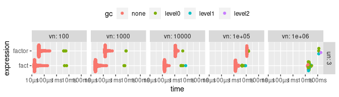
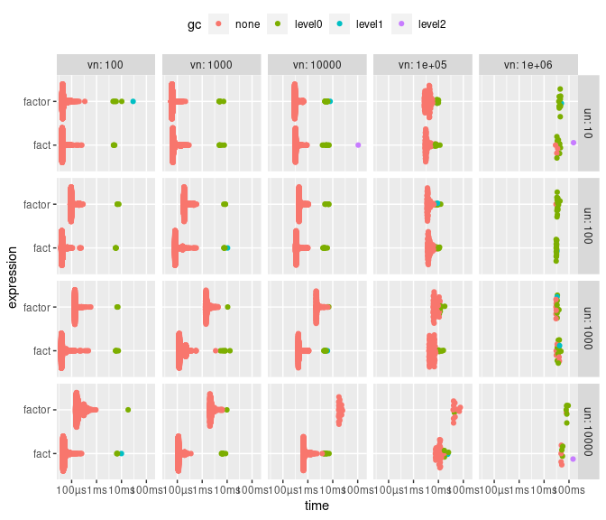
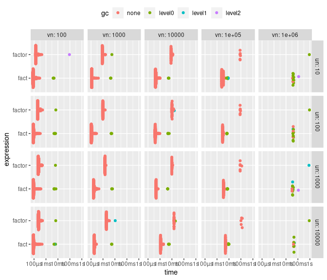
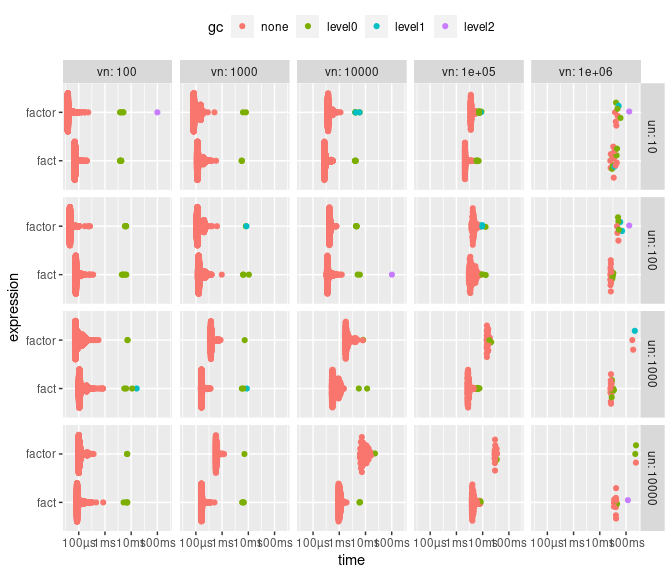
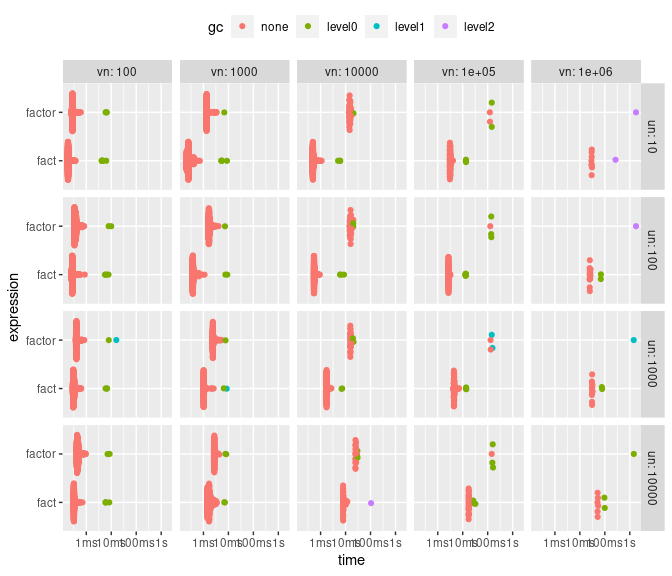

<!-- bench/bench.md is generated from bench/bench.Rmd. Please edit that file -->

``` r
library(facts)
#> Registered S3 methods overwritten by 'facts':
#>   method            from
#>   [.fact            mark
#>   as.Date.fact      mark
#>   as.character.fact mark
#>   as.double.fact    mark
#>   as.integer.fact   mark
#>   print.fact        mark
#>   print.pseudo_id   mark
#>   unique.fact       mark
```

``` r
# to save these
bench_env <- new.env()

do_bench <- function(
    unique_n = 10^(1:4), 
    values_n = 10^(2:6), 
    values_type = c("logical", "character", "double", "integer", "date")
) {
  values_type <- match.arg(values_type)
  
  if (values_type == "logical") {
    unique_n <- 3
  }
  
  res <- bench::press(
    un = unique_n,
    vn = values_n,
    {
      x <- switch(
        values_type,
        character = stringi::stri_rand_strings(un, 5),
        double = runif(un),
        integer = order(runif(un)),
        date = Sys.Date() + order(runif(un)),
        logical = c(TRUE, FALSE, NA)
      )
      x <- sample(x, vn, TRUE)
      bench::mark(
        factor = factor(x),
        fact = fact(x),
        check = FALSE
      )
    }
  )
  
  assign(values_type, res, envir = bench_env)
  
  print(bench:::autoplot.bench_mark(res) + ggplot2::theme(legend.position = "top"))
  
  writeLines('<details><summary>Show table</summary>')
  res[1:9] |>
    transform(expression = sapply(expression, deparse)) |>
    gt::gt("expression") |> 
    print()
  writeLines("</details>")
  
  invisible()
}
```

## Logical

Logical is much faster because we only have to check for 3 values

``` r
do_bench(values_type = "logical")
#> Running with:
#>      un      vn
#> 1     3     100
#> 2     3    1000
#> 3     3   10000
#> 4     3  100000
#> 5     3 1000000
#> Warning: Some expressions had a GC in every iteration; so filtering is disabled.
#> Loading required namespace: tidyr
```


<details>
<summary>
Show table
</summary>

<div id="vrfsbaadce"
style="overflow-x:auto;overflow-y:auto;width:auto;height:auto;">

<style>html {
  font-family: -apple-system, BlinkMacSystemFont, 'Segoe UI', Roboto, Oxygen, Ubuntu, Cantarell, 'Helvetica Neue', 'Fira Sans', 'Droid Sans', Arial, sans-serif;
}

#vrfsbaadce .gt_table {
  display: table;
  border-collapse: collapse;
  margin-left: auto;
  margin-right: auto;
  color: #333333;
  font-size: 16px;
  font-weight: normal;
  font-style: normal;
  background-color: #FFFFFF;
  width: auto;
  border-top-style: solid;
  border-top-width: 2px;
  border-top-color: #A8A8A8;
  border-right-style: none;
  border-right-width: 2px;
  border-right-color: #D3D3D3;
  border-bottom-style: solid;
  border-bottom-width: 2px;
  border-bottom-color: #A8A8A8;
  border-left-style: none;
  border-left-width: 2px;
  border-left-color: #D3D3D3;
}

#vrfsbaadce .gt_heading {
  background-color: #FFFFFF;
  text-align: center;
  border-bottom-color: #FFFFFF;
  border-left-style: none;
  border-left-width: 1px;
  border-left-color: #D3D3D3;
  border-right-style: none;
  border-right-width: 1px;
  border-right-color: #D3D3D3;
}

#vrfsbaadce .gt_title {
  color: #333333;
  font-size: 125%;
  font-weight: initial;
  padding-top: 4px;
  padding-bottom: 4px;
  padding-left: 5px;
  padding-right: 5px;
  border-bottom-color: #FFFFFF;
  border-bottom-width: 0;
}

#vrfsbaadce .gt_subtitle {
  color: #333333;
  font-size: 85%;
  font-weight: initial;
  padding-top: 0;
  padding-bottom: 6px;
  padding-left: 5px;
  padding-right: 5px;
  border-top-color: #FFFFFF;
  border-top-width: 0;
}

#vrfsbaadce .gt_bottom_border {
  border-bottom-style: solid;
  border-bottom-width: 2px;
  border-bottom-color: #D3D3D3;
}

#vrfsbaadce .gt_col_headings {
  border-top-style: solid;
  border-top-width: 2px;
  border-top-color: #D3D3D3;
  border-bottom-style: solid;
  border-bottom-width: 2px;
  border-bottom-color: #D3D3D3;
  border-left-style: none;
  border-left-width: 1px;
  border-left-color: #D3D3D3;
  border-right-style: none;
  border-right-width: 1px;
  border-right-color: #D3D3D3;
}

#vrfsbaadce .gt_col_heading {
  color: #333333;
  background-color: #FFFFFF;
  font-size: 100%;
  font-weight: normal;
  text-transform: inherit;
  border-left-style: none;
  border-left-width: 1px;
  border-left-color: #D3D3D3;
  border-right-style: none;
  border-right-width: 1px;
  border-right-color: #D3D3D3;
  vertical-align: bottom;
  padding-top: 5px;
  padding-bottom: 6px;
  padding-left: 5px;
  padding-right: 5px;
  overflow-x: hidden;
}

#vrfsbaadce .gt_column_spanner_outer {
  color: #333333;
  background-color: #FFFFFF;
  font-size: 100%;
  font-weight: normal;
  text-transform: inherit;
  padding-top: 0;
  padding-bottom: 0;
  padding-left: 4px;
  padding-right: 4px;
}

#vrfsbaadce .gt_column_spanner_outer:first-child {
  padding-left: 0;
}

#vrfsbaadce .gt_column_spanner_outer:last-child {
  padding-right: 0;
}

#vrfsbaadce .gt_column_spanner {
  border-bottom-style: solid;
  border-bottom-width: 2px;
  border-bottom-color: #D3D3D3;
  vertical-align: bottom;
  padding-top: 5px;
  padding-bottom: 5px;
  overflow-x: hidden;
  display: inline-block;
  width: 100%;
}

#vrfsbaadce .gt_group_heading {
  padding-top: 8px;
  padding-bottom: 8px;
  padding-left: 5px;
  padding-right: 5px;
  color: #333333;
  background-color: #FFFFFF;
  font-size: 100%;
  font-weight: initial;
  text-transform: inherit;
  border-top-style: solid;
  border-top-width: 2px;
  border-top-color: #D3D3D3;
  border-bottom-style: solid;
  border-bottom-width: 2px;
  border-bottom-color: #D3D3D3;
  border-left-style: none;
  border-left-width: 1px;
  border-left-color: #D3D3D3;
  border-right-style: none;
  border-right-width: 1px;
  border-right-color: #D3D3D3;
  vertical-align: middle;
}

#vrfsbaadce .gt_empty_group_heading {
  padding: 0.5px;
  color: #333333;
  background-color: #FFFFFF;
  font-size: 100%;
  font-weight: initial;
  border-top-style: solid;
  border-top-width: 2px;
  border-top-color: #D3D3D3;
  border-bottom-style: solid;
  border-bottom-width: 2px;
  border-bottom-color: #D3D3D3;
  vertical-align: middle;
}

#vrfsbaadce .gt_from_md > :first-child {
  margin-top: 0;
}

#vrfsbaadce .gt_from_md > :last-child {
  margin-bottom: 0;
}

#vrfsbaadce .gt_row {
  padding-top: 8px;
  padding-bottom: 8px;
  padding-left: 5px;
  padding-right: 5px;
  margin: 10px;
  border-top-style: solid;
  border-top-width: 1px;
  border-top-color: #D3D3D3;
  border-left-style: none;
  border-left-width: 1px;
  border-left-color: #D3D3D3;
  border-right-style: none;
  border-right-width: 1px;
  border-right-color: #D3D3D3;
  vertical-align: middle;
  overflow-x: hidden;
}

#vrfsbaadce .gt_stub {
  color: #333333;
  background-color: #FFFFFF;
  font-size: 100%;
  font-weight: initial;
  text-transform: inherit;
  border-right-style: solid;
  border-right-width: 2px;
  border-right-color: #D3D3D3;
  padding-left: 5px;
  padding-right: 5px;
}

#vrfsbaadce .gt_stub_row_group {
  color: #333333;
  background-color: #FFFFFF;
  font-size: 100%;
  font-weight: initial;
  text-transform: inherit;
  border-right-style: solid;
  border-right-width: 2px;
  border-right-color: #D3D3D3;
  padding-left: 5px;
  padding-right: 5px;
  vertical-align: top;
}

#vrfsbaadce .gt_row_group_first td {
  border-top-width: 2px;
}

#vrfsbaadce .gt_summary_row {
  color: #333333;
  background-color: #FFFFFF;
  text-transform: inherit;
  padding-top: 8px;
  padding-bottom: 8px;
  padding-left: 5px;
  padding-right: 5px;
}

#vrfsbaadce .gt_first_summary_row {
  border-top-style: solid;
  border-top-color: #D3D3D3;
}

#vrfsbaadce .gt_first_summary_row.thick {
  border-top-width: 2px;
}

#vrfsbaadce .gt_last_summary_row {
  padding-top: 8px;
  padding-bottom: 8px;
  padding-left: 5px;
  padding-right: 5px;
  border-bottom-style: solid;
  border-bottom-width: 2px;
  border-bottom-color: #D3D3D3;
}

#vrfsbaadce .gt_grand_summary_row {
  color: #333333;
  background-color: #FFFFFF;
  text-transform: inherit;
  padding-top: 8px;
  padding-bottom: 8px;
  padding-left: 5px;
  padding-right: 5px;
}

#vrfsbaadce .gt_first_grand_summary_row {
  padding-top: 8px;
  padding-bottom: 8px;
  padding-left: 5px;
  padding-right: 5px;
  border-top-style: double;
  border-top-width: 6px;
  border-top-color: #D3D3D3;
}

#vrfsbaadce .gt_striped {
  background-color: rgba(128, 128, 128, 0.05);
}

#vrfsbaadce .gt_table_body {
  border-top-style: solid;
  border-top-width: 2px;
  border-top-color: #D3D3D3;
  border-bottom-style: solid;
  border-bottom-width: 2px;
  border-bottom-color: #D3D3D3;
}

#vrfsbaadce .gt_footnotes {
  color: #333333;
  background-color: #FFFFFF;
  border-bottom-style: none;
  border-bottom-width: 2px;
  border-bottom-color: #D3D3D3;
  border-left-style: none;
  border-left-width: 2px;
  border-left-color: #D3D3D3;
  border-right-style: none;
  border-right-width: 2px;
  border-right-color: #D3D3D3;
}

#vrfsbaadce .gt_footnote {
  margin: 0px;
  font-size: 90%;
  padding-left: 4px;
  padding-right: 4px;
  padding-left: 5px;
  padding-right: 5px;
}

#vrfsbaadce .gt_sourcenotes {
  color: #333333;
  background-color: #FFFFFF;
  border-bottom-style: none;
  border-bottom-width: 2px;
  border-bottom-color: #D3D3D3;
  border-left-style: none;
  border-left-width: 2px;
  border-left-color: #D3D3D3;
  border-right-style: none;
  border-right-width: 2px;
  border-right-color: #D3D3D3;
}

#vrfsbaadce .gt_sourcenote {
  font-size: 90%;
  padding-top: 4px;
  padding-bottom: 4px;
  padding-left: 5px;
  padding-right: 5px;
}

#vrfsbaadce .gt_left {
  text-align: left;
}

#vrfsbaadce .gt_center {
  text-align: center;
}

#vrfsbaadce .gt_right {
  text-align: right;
  font-variant-numeric: tabular-nums;
}

#vrfsbaadce .gt_font_normal {
  font-weight: normal;
}

#vrfsbaadce .gt_font_bold {
  font-weight: bold;
}

#vrfsbaadce .gt_font_italic {
  font-style: italic;
}

#vrfsbaadce .gt_super {
  font-size: 65%;
}

#vrfsbaadce .gt_footnote_marks {
  font-style: italic;
  font-weight: normal;
  font-size: 75%;
  vertical-align: 0.4em;
}

#vrfsbaadce .gt_asterisk {
  font-size: 100%;
  vertical-align: 0;
}

#vrfsbaadce .gt_indent_1 {
  text-indent: 5px;
}

#vrfsbaadce .gt_indent_2 {
  text-indent: 10px;
}

#vrfsbaadce .gt_indent_3 {
  text-indent: 15px;
}

#vrfsbaadce .gt_indent_4 {
  text-indent: 20px;
}

#vrfsbaadce .gt_indent_5 {
  text-indent: 25px;
}
</style>
<table class="gt_table">
<thead class="gt_col_headings">
<tr>
<th class="gt_col_heading gt_columns_bottom_border gt_left" rowspan="1" colspan="1" scope="col">
</th>
<th class="gt_col_heading gt_columns_bottom_border gt_right" rowspan="1" colspan="1" scope="col">
un
</th>
<th class="gt_col_heading gt_columns_bottom_border gt_right" rowspan="1" colspan="1" scope="col">
vn
</th>
<th class="gt_col_heading gt_columns_bottom_border gt_center" rowspan="1" colspan="1" scope="col">
min
</th>
<th class="gt_col_heading gt_columns_bottom_border gt_center" rowspan="1" colspan="1" scope="col">
median
</th>
<th class="gt_col_heading gt_columns_bottom_border gt_right" rowspan="1" colspan="1" scope="col">
itr.sec
</th>
<th class="gt_col_heading gt_columns_bottom_border gt_center" rowspan="1" colspan="1" scope="col">
mem_alloc
</th>
<th class="gt_col_heading gt_columns_bottom_border gt_right" rowspan="1" colspan="1" scope="col">
gc.sec
</th>
<th class="gt_col_heading gt_columns_bottom_border gt_right" rowspan="1" colspan="1" scope="col">
n_itr
</th>
</tr>
</thead>
<tbody class="gt_table_body">
<tr>
<th scope="row" class="gt_row gt_left gt_stub">
factor(x)
</th>
<td class="gt_row gt_right">
3
</td>
<td class="gt_row gt_right">
1e+02
</td>
<td class="gt_row gt_center">
34.79µs
</td>
<td class="gt_row gt_center">
37.57µs
</td>
<td class="gt_row gt_right">
23612.260721
</td>
<td class="gt_row gt_center">
2.53KB
</td>
<td class="gt_row gt_right">
9.448684
</td>
<td class="gt_row gt_right">
9996
</td>
</tr>
<tr>
<th scope="row" class="gt_row gt_left gt_stub">
fact(x)
</th>
<td class="gt_row gt_right">
3
</td>
<td class="gt_row gt_right">
1e+02
</td>
<td class="gt_row gt_center">
15.12µs
</td>
<td class="gt_row gt_center">
16.63µs
</td>
<td class="gt_row gt_right">
55982.108441
</td>
<td class="gt_row gt_center">
76.42KB
</td>
<td class="gt_row gt_right">
11.198661
</td>
<td class="gt_row gt_right">
9998
</td>
</tr>
<tr>
<th scope="row" class="gt_row gt_left gt_stub">
factor(x)
</th>
<td class="gt_row gt_right">
3
</td>
<td class="gt_row gt_right">
1e+03
</td>
<td class="gt_row gt_center">
126.18µs
</td>
<td class="gt_row gt_center">
141.67µs
</td>
<td class="gt_row gt_right">
6477.866423
</td>
<td class="gt_row gt_center">
23.62KB
</td>
<td class="gt_row gt_right">
4.114237
</td>
<td class="gt_row gt_right">
3149
</td>
</tr>
<tr>
<th scope="row" class="gt_row gt_left gt_stub">
fact(x)
</th>
<td class="gt_row gt_right">
3
</td>
<td class="gt_row gt_right">
1e+03
</td>
<td class="gt_row gt_center">
21.68µs
</td>
<td class="gt_row gt_center">
23.35µs
</td>
<td class="gt_row gt_right">
37044.179477
</td>
<td class="gt_row gt_center">
23.88KB
</td>
<td class="gt_row gt_right">
14.823601
</td>
<td class="gt_row gt_right">
9996
</td>
</tr>
<tr>
<th scope="row" class="gt_row gt_left gt_stub">
factor(x)
</th>
<td class="gt_row gt_right">
3
</td>
<td class="gt_row gt_right">
1e+04
</td>
<td class="gt_row gt_center">
1.03ms
</td>
<td class="gt_row gt_center">
1.14ms
</td>
<td class="gt_row gt_right">
847.705862
</td>
<td class="gt_row gt_center">
234.56KB
</td>
<td class="gt_row gt_right">
2.013553
</td>
<td class="gt_row gt_right">
421
</td>
</tr>
<tr>
<th scope="row" class="gt_row gt_left gt_stub">
fact(x)
</th>
<td class="gt_row gt_right">
3
</td>
<td class="gt_row gt_right">
1e+04
</td>
<td class="gt_row gt_center">
143.54µs
</td>
<td class="gt_row gt_center">
148.13µs
</td>
<td class="gt_row gt_right">
6338.169311
</td>
<td class="gt_row gt_center">
234.63KB
</td>
<td class="gt_row gt_right">
31.365985
</td>
<td class="gt_row gt_right">
2829
</td>
</tr>
<tr>
<th scope="row" class="gt_row gt_left gt_stub">
factor(x)
</th>
<td class="gt_row gt_right">
3
</td>
<td class="gt_row gt_right">
1e+05
</td>
<td class="gt_row gt_center">
10.65ms
</td>
<td class="gt_row gt_center">
11.30ms
</td>
<td class="gt_row gt_right">
87.812616
</td>
<td class="gt_row gt_center">
2.29MB
</td>
<td class="gt_row gt_right">
4.181553
</td>
<td class="gt_row gt_right">
42
</td>
</tr>
<tr>
<th scope="row" class="gt_row gt_left gt_stub">
fact(x)
</th>
<td class="gt_row gt_right">
3
</td>
<td class="gt_row gt_right">
1e+05
</td>
<td class="gt_row gt_center">
1.29ms
</td>
<td class="gt_row gt_center">
1.40ms
</td>
<td class="gt_row gt_right">
675.675934
</td>
<td class="gt_row gt_center">
2.29MB
</td>
<td class="gt_row gt_right">
38.610053
</td>
<td class="gt_row gt_right">
280
</td>
</tr>
<tr>
<th scope="row" class="gt_row gt_left gt_stub">
factor(x)
</th>
<td class="gt_row gt_right">
3
</td>
<td class="gt_row gt_right">
1e+06
</td>
<td class="gt_row gt_center">
120.97ms
</td>
<td class="gt_row gt_center">
123.08ms
</td>
<td class="gt_row gt_right">
7.304526
</td>
<td class="gt_row gt_center">
22.89MB
</td>
<td class="gt_row gt_right">
9.130658
</td>
<td class="gt_row gt_right">
4
</td>
</tr>
<tr>
<th scope="row" class="gt_row gt_left gt_stub">
fact(x)
</th>
<td class="gt_row gt_right">
3
</td>
<td class="gt_row gt_right">
1e+06
</td>
<td class="gt_row gt_center">
14.91ms
</td>
<td class="gt_row gt_center">
18.72ms
</td>
<td class="gt_row gt_right">
49.922728
</td>
<td class="gt_row gt_center">
22.89MB
</td>
<td class="gt_row gt_right">
45.928910
</td>
<td class="gt_row gt_right">
25
</td>
</tr>
</tbody>
</table>

</div>

</details>

## Character

``` r
do_bench(values_type = "character")
#> Running with:
#>       un      vn
#>  1    10     100
#>  2   100     100
#>  3  1000     100
#>  4 10000     100
#>  5    10    1000
#>  6   100    1000
#>  7  1000    1000
#>  8 10000    1000
#>  9    10   10000
#> 10   100   10000
#> 11  1000   10000
#> 12 10000   10000
#> 13    10  100000
#> 14   100  100000
#> 15  1000  100000
#> 16 10000  100000
#> 17    10 1000000
#> Warning: Some expressions had a GC in every iteration; so filtering is disabled.
#> 18   100 1000000
#> Warning: Some expressions had a GC in every iteration; so filtering is disabled.
#> 19  1000 1000000
#> 20 10000 1000000
```


<details>
<summary>
Show table
</summary>

<div id="kbempanunz"
style="overflow-x:auto;overflow-y:auto;width:auto;height:auto;">

<style>html {
  font-family: -apple-system, BlinkMacSystemFont, 'Segoe UI', Roboto, Oxygen, Ubuntu, Cantarell, 'Helvetica Neue', 'Fira Sans', 'Droid Sans', Arial, sans-serif;
}

#kbempanunz .gt_table {
  display: table;
  border-collapse: collapse;
  margin-left: auto;
  margin-right: auto;
  color: #333333;
  font-size: 16px;
  font-weight: normal;
  font-style: normal;
  background-color: #FFFFFF;
  width: auto;
  border-top-style: solid;
  border-top-width: 2px;
  border-top-color: #A8A8A8;
  border-right-style: none;
  border-right-width: 2px;
  border-right-color: #D3D3D3;
  border-bottom-style: solid;
  border-bottom-width: 2px;
  border-bottom-color: #A8A8A8;
  border-left-style: none;
  border-left-width: 2px;
  border-left-color: #D3D3D3;
}

#kbempanunz .gt_heading {
  background-color: #FFFFFF;
  text-align: center;
  border-bottom-color: #FFFFFF;
  border-left-style: none;
  border-left-width: 1px;
  border-left-color: #D3D3D3;
  border-right-style: none;
  border-right-width: 1px;
  border-right-color: #D3D3D3;
}

#kbempanunz .gt_title {
  color: #333333;
  font-size: 125%;
  font-weight: initial;
  padding-top: 4px;
  padding-bottom: 4px;
  padding-left: 5px;
  padding-right: 5px;
  border-bottom-color: #FFFFFF;
  border-bottom-width: 0;
}

#kbempanunz .gt_subtitle {
  color: #333333;
  font-size: 85%;
  font-weight: initial;
  padding-top: 0;
  padding-bottom: 6px;
  padding-left: 5px;
  padding-right: 5px;
  border-top-color: #FFFFFF;
  border-top-width: 0;
}

#kbempanunz .gt_bottom_border {
  border-bottom-style: solid;
  border-bottom-width: 2px;
  border-bottom-color: #D3D3D3;
}

#kbempanunz .gt_col_headings {
  border-top-style: solid;
  border-top-width: 2px;
  border-top-color: #D3D3D3;
  border-bottom-style: solid;
  border-bottom-width: 2px;
  border-bottom-color: #D3D3D3;
  border-left-style: none;
  border-left-width: 1px;
  border-left-color: #D3D3D3;
  border-right-style: none;
  border-right-width: 1px;
  border-right-color: #D3D3D3;
}

#kbempanunz .gt_col_heading {
  color: #333333;
  background-color: #FFFFFF;
  font-size: 100%;
  font-weight: normal;
  text-transform: inherit;
  border-left-style: none;
  border-left-width: 1px;
  border-left-color: #D3D3D3;
  border-right-style: none;
  border-right-width: 1px;
  border-right-color: #D3D3D3;
  vertical-align: bottom;
  padding-top: 5px;
  padding-bottom: 6px;
  padding-left: 5px;
  padding-right: 5px;
  overflow-x: hidden;
}

#kbempanunz .gt_column_spanner_outer {
  color: #333333;
  background-color: #FFFFFF;
  font-size: 100%;
  font-weight: normal;
  text-transform: inherit;
  padding-top: 0;
  padding-bottom: 0;
  padding-left: 4px;
  padding-right: 4px;
}

#kbempanunz .gt_column_spanner_outer:first-child {
  padding-left: 0;
}

#kbempanunz .gt_column_spanner_outer:last-child {
  padding-right: 0;
}

#kbempanunz .gt_column_spanner {
  border-bottom-style: solid;
  border-bottom-width: 2px;
  border-bottom-color: #D3D3D3;
  vertical-align: bottom;
  padding-top: 5px;
  padding-bottom: 5px;
  overflow-x: hidden;
  display: inline-block;
  width: 100%;
}

#kbempanunz .gt_group_heading {
  padding-top: 8px;
  padding-bottom: 8px;
  padding-left: 5px;
  padding-right: 5px;
  color: #333333;
  background-color: #FFFFFF;
  font-size: 100%;
  font-weight: initial;
  text-transform: inherit;
  border-top-style: solid;
  border-top-width: 2px;
  border-top-color: #D3D3D3;
  border-bottom-style: solid;
  border-bottom-width: 2px;
  border-bottom-color: #D3D3D3;
  border-left-style: none;
  border-left-width: 1px;
  border-left-color: #D3D3D3;
  border-right-style: none;
  border-right-width: 1px;
  border-right-color: #D3D3D3;
  vertical-align: middle;
}

#kbempanunz .gt_empty_group_heading {
  padding: 0.5px;
  color: #333333;
  background-color: #FFFFFF;
  font-size: 100%;
  font-weight: initial;
  border-top-style: solid;
  border-top-width: 2px;
  border-top-color: #D3D3D3;
  border-bottom-style: solid;
  border-bottom-width: 2px;
  border-bottom-color: #D3D3D3;
  vertical-align: middle;
}

#kbempanunz .gt_from_md > :first-child {
  margin-top: 0;
}

#kbempanunz .gt_from_md > :last-child {
  margin-bottom: 0;
}

#kbempanunz .gt_row {
  padding-top: 8px;
  padding-bottom: 8px;
  padding-left: 5px;
  padding-right: 5px;
  margin: 10px;
  border-top-style: solid;
  border-top-width: 1px;
  border-top-color: #D3D3D3;
  border-left-style: none;
  border-left-width: 1px;
  border-left-color: #D3D3D3;
  border-right-style: none;
  border-right-width: 1px;
  border-right-color: #D3D3D3;
  vertical-align: middle;
  overflow-x: hidden;
}

#kbempanunz .gt_stub {
  color: #333333;
  background-color: #FFFFFF;
  font-size: 100%;
  font-weight: initial;
  text-transform: inherit;
  border-right-style: solid;
  border-right-width: 2px;
  border-right-color: #D3D3D3;
  padding-left: 5px;
  padding-right: 5px;
}

#kbempanunz .gt_stub_row_group {
  color: #333333;
  background-color: #FFFFFF;
  font-size: 100%;
  font-weight: initial;
  text-transform: inherit;
  border-right-style: solid;
  border-right-width: 2px;
  border-right-color: #D3D3D3;
  padding-left: 5px;
  padding-right: 5px;
  vertical-align: top;
}

#kbempanunz .gt_row_group_first td {
  border-top-width: 2px;
}

#kbempanunz .gt_summary_row {
  color: #333333;
  background-color: #FFFFFF;
  text-transform: inherit;
  padding-top: 8px;
  padding-bottom: 8px;
  padding-left: 5px;
  padding-right: 5px;
}

#kbempanunz .gt_first_summary_row {
  border-top-style: solid;
  border-top-color: #D3D3D3;
}

#kbempanunz .gt_first_summary_row.thick {
  border-top-width: 2px;
}

#kbempanunz .gt_last_summary_row {
  padding-top: 8px;
  padding-bottom: 8px;
  padding-left: 5px;
  padding-right: 5px;
  border-bottom-style: solid;
  border-bottom-width: 2px;
  border-bottom-color: #D3D3D3;
}

#kbempanunz .gt_grand_summary_row {
  color: #333333;
  background-color: #FFFFFF;
  text-transform: inherit;
  padding-top: 8px;
  padding-bottom: 8px;
  padding-left: 5px;
  padding-right: 5px;
}

#kbempanunz .gt_first_grand_summary_row {
  padding-top: 8px;
  padding-bottom: 8px;
  padding-left: 5px;
  padding-right: 5px;
  border-top-style: double;
  border-top-width: 6px;
  border-top-color: #D3D3D3;
}

#kbempanunz .gt_striped {
  background-color: rgba(128, 128, 128, 0.05);
}

#kbempanunz .gt_table_body {
  border-top-style: solid;
  border-top-width: 2px;
  border-top-color: #D3D3D3;
  border-bottom-style: solid;
  border-bottom-width: 2px;
  border-bottom-color: #D3D3D3;
}

#kbempanunz .gt_footnotes {
  color: #333333;
  background-color: #FFFFFF;
  border-bottom-style: none;
  border-bottom-width: 2px;
  border-bottom-color: #D3D3D3;
  border-left-style: none;
  border-left-width: 2px;
  border-left-color: #D3D3D3;
  border-right-style: none;
  border-right-width: 2px;
  border-right-color: #D3D3D3;
}

#kbempanunz .gt_footnote {
  margin: 0px;
  font-size: 90%;
  padding-left: 4px;
  padding-right: 4px;
  padding-left: 5px;
  padding-right: 5px;
}

#kbempanunz .gt_sourcenotes {
  color: #333333;
  background-color: #FFFFFF;
  border-bottom-style: none;
  border-bottom-width: 2px;
  border-bottom-color: #D3D3D3;
  border-left-style: none;
  border-left-width: 2px;
  border-left-color: #D3D3D3;
  border-right-style: none;
  border-right-width: 2px;
  border-right-color: #D3D3D3;
}

#kbempanunz .gt_sourcenote {
  font-size: 90%;
  padding-top: 4px;
  padding-bottom: 4px;
  padding-left: 5px;
  padding-right: 5px;
}

#kbempanunz .gt_left {
  text-align: left;
}

#kbempanunz .gt_center {
  text-align: center;
}

#kbempanunz .gt_right {
  text-align: right;
  font-variant-numeric: tabular-nums;
}

#kbempanunz .gt_font_normal {
  font-weight: normal;
}

#kbempanunz .gt_font_bold {
  font-weight: bold;
}

#kbempanunz .gt_font_italic {
  font-style: italic;
}

#kbempanunz .gt_super {
  font-size: 65%;
}

#kbempanunz .gt_footnote_marks {
  font-style: italic;
  font-weight: normal;
  font-size: 75%;
  vertical-align: 0.4em;
}

#kbempanunz .gt_asterisk {
  font-size: 100%;
  vertical-align: 0;
}

#kbempanunz .gt_indent_1 {
  text-indent: 5px;
}

#kbempanunz .gt_indent_2 {
  text-indent: 10px;
}

#kbempanunz .gt_indent_3 {
  text-indent: 15px;
}

#kbempanunz .gt_indent_4 {
  text-indent: 20px;
}

#kbempanunz .gt_indent_5 {
  text-indent: 25px;
}
</style>
<table class="gt_table">
<thead class="gt_col_headings">
<tr>
<th class="gt_col_heading gt_columns_bottom_border gt_left" rowspan="1" colspan="1" scope="col">
</th>
<th class="gt_col_heading gt_columns_bottom_border gt_right" rowspan="1" colspan="1" scope="col">
un
</th>
<th class="gt_col_heading gt_columns_bottom_border gt_right" rowspan="1" colspan="1" scope="col">
vn
</th>
<th class="gt_col_heading gt_columns_bottom_border gt_center" rowspan="1" colspan="1" scope="col">
min
</th>
<th class="gt_col_heading gt_columns_bottom_border gt_center" rowspan="1" colspan="1" scope="col">
median
</th>
<th class="gt_col_heading gt_columns_bottom_border gt_right" rowspan="1" colspan="1" scope="col">
itr.sec
</th>
<th class="gt_col_heading gt_columns_bottom_border gt_center" rowspan="1" colspan="1" scope="col">
mem_alloc
</th>
<th class="gt_col_heading gt_columns_bottom_border gt_right" rowspan="1" colspan="1" scope="col">
gc.sec
</th>
<th class="gt_col_heading gt_columns_bottom_border gt_right" rowspan="1" colspan="1" scope="col">
n_itr
</th>
</tr>
</thead>
<tbody class="gt_table_body">
<tr>
<th scope="row" class="gt_row gt_left gt_stub">
factor(x)
</th>
<td class="gt_row gt_right">
10
</td>
<td class="gt_row gt_right">
1e+02
</td>
<td class="gt_row gt_center">
40.06µs
</td>
<td class="gt_row gt_center">
44.18µs
</td>
<td class="gt_row gt_right">
20410.17637
</td>
<td class="gt_row gt_center">
2.75KB
</td>
<td class="gt_row gt_right">
13.673633
</td>
<td class="gt_row gt_right">
8956
</td>
</tr>
<tr>
<th scope="row" class="gt_row gt_left gt_stub">
fact(x)
</th>
<td class="gt_row gt_right">
10
</td>
<td class="gt_row gt_right">
1e+02
</td>
<td class="gt_row gt_center">
39.62µs
</td>
<td class="gt_row gt_center">
42.63µs
</td>
<td class="gt_row gt_right">
22683.71547
</td>
<td class="gt_row gt_center">
55.69KB
</td>
<td class="gt_row gt_right">
9.077117
</td>
<td class="gt_row gt_right">
9996
</td>
</tr>
<tr>
<th scope="row" class="gt_row gt_left gt_stub">
factor(x)
</th>
<td class="gt_row gt_right">
100
</td>
<td class="gt_row gt_right">
1e+02
</td>
<td class="gt_row gt_center">
87.78µs
</td>
<td class="gt_row gt_center">
98.20µs
</td>
<td class="gt_row gt_right">
9153.52469
</td>
<td class="gt_row gt_center">
9.46KB
</td>
<td class="gt_row gt_right">
6.269537
</td>
<td class="gt_row gt_right">
4380
</td>
</tr>
<tr>
<th scope="row" class="gt_row gt_left gt_stub">
fact(x)
</th>
<td class="gt_row gt_right">
100
</td>
<td class="gt_row gt_right">
1e+02
</td>
<td class="gt_row gt_center">
37.90µs
</td>
<td class="gt_row gt_center">
41.41µs
</td>
<td class="gt_row gt_right">
22927.05541
</td>
<td class="gt_row gt_center">
5.91KB
</td>
<td class="gt_row gt_right">
9.174492
</td>
<td class="gt_row gt_right">
9996
</td>
</tr>
<tr>
<th scope="row" class="gt_row gt_left gt_stub">
factor(x)
</th>
<td class="gt_row gt_right">
1000
</td>
<td class="gt_row gt_right">
1e+02
</td>
<td class="gt_row gt_center">
130.33µs
</td>
<td class="gt_row gt_center">
135.19µs
</td>
<td class="gt_row gt_right">
7087.00480
</td>
<td class="gt_row gt_center">
13.30KB
</td>
<td class="gt_row gt_right">
4.114371
</td>
<td class="gt_row gt_right">
3445
</td>
</tr>
<tr>
<th scope="row" class="gt_row gt_left gt_stub">
fact(x)
</th>
<td class="gt_row gt_right">
1000
</td>
<td class="gt_row gt_right">
1e+02
</td>
<td class="gt_row gt_center">
37.05µs
</td>
<td class="gt_row gt_center">
39.96µs
</td>
<td class="gt_row gt_right">
23038.29901
</td>
<td class="gt_row gt_center">
7.06KB
</td>
<td class="gt_row gt_right">
11.524912
</td>
<td class="gt_row gt_right">
9995
</td>
</tr>
<tr>
<th scope="row" class="gt_row gt_left gt_stub">
factor(x)
</th>
<td class="gt_row gt_right">
10000
</td>
<td class="gt_row gt_right">
1e+02
</td>
<td class="gt_row gt_center">
142.74µs
</td>
<td class="gt_row gt_center">
179.91µs
</td>
<td class="gt_row gt_right">
4328.28598
</td>
<td class="gt_row gt_center">
13.49KB
</td>
<td class="gt_row gt_right">
2.076913
</td>
<td class="gt_row gt_right">
2084
</td>
</tr>
<tr>
<th scope="row" class="gt_row gt_left gt_stub">
fact(x)
</th>
<td class="gt_row gt_right">
10000
</td>
<td class="gt_row gt_right">
1e+02
</td>
<td class="gt_row gt_center">
42.44µs
</td>
<td class="gt_row gt_center">
48.41µs
</td>
<td class="gt_row gt_right">
19316.02259
</td>
<td class="gt_row gt_center">
7.67KB
</td>
<td class="gt_row gt_right">
8.517704
</td>
<td class="gt_row gt_right">
9071
</td>
</tr>
<tr>
<th scope="row" class="gt_row gt_left gt_stub">
factor(x)
</th>
<td class="gt_row gt_right">
10
</td>
<td class="gt_row gt_right">
1e+03
</td>
<td class="gt_row gt_center">
56.79µs
</td>
<td class="gt_row gt_center">
62.05µs
</td>
<td class="gt_row gt_right">
15579.39281
</td>
<td class="gt_row gt_center">
23.81KB
</td>
<td class="gt_row gt_right">
15.136121
</td>
<td class="gt_row gt_right">
7205
</td>
</tr>
<tr>
<th scope="row" class="gt_row gt_left gt_stub">
fact(x)
</th>
<td class="gt_row gt_right">
10
</td>
<td class="gt_row gt_right">
1e+03
</td>
<td class="gt_row gt_center">
64.36µs
</td>
<td class="gt_row gt_center">
68.70µs
</td>
<td class="gt_row gt_right">
12681.72765
</td>
<td class="gt_row gt_center">
23.87KB
</td>
<td class="gt_row gt_right">
12.877029
</td>
<td class="gt_row gt_right">
5909
</td>
</tr>
<tr>
<th scope="row" class="gt_row gt_left gt_stub">
factor(x)
</th>
<td class="gt_row gt_right">
100
</td>
<td class="gt_row gt_right">
1e+03
</td>
<td class="gt_row gt_center">
172.88µs
</td>
<td class="gt_row gt_center">
190.90µs
</td>
<td class="gt_row gt_right">
4543.42615
</td>
<td class="gt_row gt_center">
34.55KB
</td>
<td class="gt_row gt_right">
6.307394
</td>
<td class="gt_row gt_right">
2161
</td>
</tr>
<tr>
<th scope="row" class="gt_row gt_left gt_stub">
fact(x)
</th>
<td class="gt_row gt_right">
100
</td>
<td class="gt_row gt_right">
1e+03
</td>
<td class="gt_row gt_center">
78.78µs
</td>
<td class="gt_row gt_center">
83.41µs
</td>
<td class="gt_row gt_right">
10164.12477
</td>
<td class="gt_row gt_center">
28.73KB
</td>
<td class="gt_row gt_right">
10.903373
</td>
<td class="gt_row gt_right">
4661
</td>
</tr>
<tr>
<th scope="row" class="gt_row gt_left gt_stub">
factor(x)
</th>
<td class="gt_row gt_right">
1000
</td>
<td class="gt_row gt_right">
1e+03
</td>
<td class="gt_row gt_center">
1.34ms
</td>
<td class="gt_row gt_center">
1.50ms
</td>
<td class="gt_row gt_right">
587.13472
</td>
<td class="gt_row gt_center">
93.47KB
</td>
<td class="gt_row gt_right">
2.038662
</td>
<td class="gt_row gt_right">
288
</td>
</tr>
<tr>
<th scope="row" class="gt_row gt_left gt_stub">
fact(x)
</th>
<td class="gt_row gt_right">
1000
</td>
<td class="gt_row gt_right">
1e+03
</td>
<td class="gt_row gt_center">
113.18µs
</td>
<td class="gt_row gt_center">
132.22µs
</td>
<td class="gt_row gt_right">
6276.45374
</td>
<td class="gt_row gt_center">
50.68KB
</td>
<td class="gt_row gt_right">
13.302269
</td>
<td class="gt_row gt_right">
2831
</td>
</tr>
<tr>
<th scope="row" class="gt_row gt_left gt_stub">
factor(x)
</th>
<td class="gt_row gt_right">
10000
</td>
<td class="gt_row gt_right">
1e+03
</td>
<td class="gt_row gt_center">
1.93ms
</td>
<td class="gt_row gt_center">
2.18ms
</td>
<td class="gt_row gt_right">
416.85868
</td>
<td class="gt_row gt_center">
115.46KB
</td>
<td class="gt_row gt_right">
2.033457
</td>
<td class="gt_row gt_right">
205
</td>
</tr>
<tr>
<th scope="row" class="gt_row gt_left gt_stub">
fact(x)
</th>
<td class="gt_row gt_right">
10000
</td>
<td class="gt_row gt_right">
1e+03
</td>
<td class="gt_row gt_center">
105.95µs
</td>
<td class="gt_row gt_center">
112.99µs
</td>
<td class="gt_row gt_right">
7934.19228
</td>
<td class="gt_row gt_center">
65.69KB
</td>
<td class="gt_row gt_right">
20.472400
</td>
<td class="gt_row gt_right">
3488
</td>
</tr>
<tr>
<th scope="row" class="gt_row gt_left gt_stub">
factor(x)
</th>
<td class="gt_row gt_right">
10
</td>
<td class="gt_row gt_right">
1e+04
</td>
<td class="gt_row gt_center">
291.23µs
</td>
<td class="gt_row gt_center">
307.49µs
</td>
<td class="gt_row gt_right">
2960.31019
</td>
<td class="gt_row gt_center">
284.44KB
</td>
<td class="gt_row gt_right">
36.160141
</td>
<td class="gt_row gt_right">
1228
</td>
</tr>
<tr>
<th scope="row" class="gt_row gt_left gt_stub">
fact(x)
</th>
<td class="gt_row gt_right">
10
</td>
<td class="gt_row gt_right">
1e+04
</td>
<td class="gt_row gt_center">
301.52µs
</td>
<td class="gt_row gt_center">
323.98µs
</td>
<td class="gt_row gt_right">
2899.06113
</td>
<td class="gt_row gt_center">
284.49KB
</td>
<td class="gt_row gt_right">
28.961650
</td>
<td class="gt_row gt_right">
1001
</td>
</tr>
<tr>
<th scope="row" class="gt_row gt_left gt_stub">
factor(x)
</th>
<td class="gt_row gt_right">
100
</td>
<td class="gt_row gt_right">
1e+04
</td>
<td class="gt_row gt_center">
433.10µs
</td>
<td class="gt_row gt_center">
450.99µs
</td>
<td class="gt_row gt_right">
1954.62416
</td>
<td class="gt_row gt_center">
295.18KB
</td>
<td class="gt_row gt_right">
12.916019
</td>
<td class="gt_row gt_right">
908
</td>
</tr>
<tr>
<th scope="row" class="gt_row gt_left gt_stub">
fact(x)
</th>
<td class="gt_row gt_right">
100
</td>
<td class="gt_row gt_right">
1e+04
</td>
<td class="gt_row gt_center">
322.50µs
</td>
<td class="gt_row gt_center">
342.56µs
</td>
<td class="gt_row gt_right">
2709.82713
</td>
<td class="gt_row gt_center">
289.36KB
</td>
<td class="gt_row gt_right">
19.668100
</td>
<td class="gt_row gt_right">
1240
</td>
</tr>
<tr>
<th scope="row" class="gt_row gt_left gt_stub">
factor(x)
</th>
<td class="gt_row gt_right">
1000
</td>
<td class="gt_row gt_right">
1e+04
</td>
<td class="gt_row gt_center">
2.06ms
</td>
<td class="gt_row gt_center">
2.23ms
</td>
<td class="gt_row gt_right">
415.21406
</td>
<td class="gt_row gt_center">
379.46KB
</td>
<td class="gt_row gt_right">
4.090779
</td>
<td class="gt_row gt_right">
203
</td>
</tr>
<tr>
<th scope="row" class="gt_row gt_left gt_stub">
fact(x)
</th>
<td class="gt_row gt_right">
1000
</td>
<td class="gt_row gt_right">
1e+04
</td>
<td class="gt_row gt_center">
409.95µs
</td>
<td class="gt_row gt_center">
426.30µs
</td>
<td class="gt_row gt_right">
2147.39951
</td>
<td class="gt_row gt_center">
328.00KB
</td>
<td class="gt_row gt_right">
19.781572
</td>
<td class="gt_row gt_right">
977
</td>
</tr>
<tr>
<th scope="row" class="gt_row gt_left gt_stub">
factor(x)
</th>
<td class="gt_row gt_right">
10000
</td>
<td class="gt_row gt_right">
1e+04
</td>
<td class="gt_row gt_center">
17.12ms
</td>
<td class="gt_row gt_center">
18.70ms
</td>
<td class="gt_row gt_right">
51.73534
</td>
<td class="gt_row gt_center">
926.02KB
</td>
<td class="gt_row gt_right">
0.000000
</td>
<td class="gt_row gt_right">
26
</td>
</tr>
<tr>
<th scope="row" class="gt_row gt_left gt_stub">
fact(x)
</th>
<td class="gt_row gt_right">
10000
</td>
<td class="gt_row gt_right">
1e+04
</td>
<td class="gt_row gt_center">
648.22µs
</td>
<td class="gt_row gt_center">
684.58µs
</td>
<td class="gt_row gt_right">
1224.74068
</td>
<td class="gt_row gt_center">
573.28KB
</td>
<td class="gt_row gt_right">
17.465108
</td>
<td class="gt_row gt_right">
561
</td>
</tr>
<tr>
<th scope="row" class="gt_row gt_left gt_stub">
factor(x)
</th>
<td class="gt_row gt_right">
10
</td>
<td class="gt_row gt_right">
1e+05
</td>
<td class="gt_row gt_center">
2.69ms
</td>
<td class="gt_row gt_center">
4.11ms
</td>
<td class="gt_row gt_right">
255.15683
</td>
<td class="gt_row gt_center">
2.53MB
</td>
<td class="gt_row gt_right">
18.727107
</td>
<td class="gt_row gt_right">
109
</td>
</tr>
<tr>
<th scope="row" class="gt_row gt_left gt_stub">
fact(x)
</th>
<td class="gt_row gt_right">
10
</td>
<td class="gt_row gt_right">
1e+05
</td>
<td class="gt_row gt_center">
2.89ms
</td>
<td class="gt_row gt_center">
3.20ms
</td>
<td class="gt_row gt_right">
276.76856
</td>
<td class="gt_row gt_center">
2.53MB
</td>
<td class="gt_row gt_right">
18.298748
</td>
<td class="gt_row gt_right">
121
</td>
</tr>
<tr>
<th scope="row" class="gt_row gt_left gt_stub">
factor(x)
</th>
<td class="gt_row gt_right">
100
</td>
<td class="gt_row gt_right">
1e+05
</td>
<td class="gt_row gt_center">
3.45ms
</td>
<td class="gt_row gt_center">
3.72ms
</td>
<td class="gt_row gt_right">
246.91942
</td>
<td class="gt_row gt_center">
2.54MB
</td>
<td class="gt_row gt_right">
21.368027
</td>
<td class="gt_row gt_right">
104
</td>
</tr>
<tr>
<th scope="row" class="gt_row gt_left gt_stub">
fact(x)
</th>
<td class="gt_row gt_right">
100
</td>
<td class="gt_row gt_right">
1e+05
</td>
<td class="gt_row gt_center">
3.60ms
</td>
<td class="gt_row gt_center">
4.24ms
</td>
<td class="gt_row gt_right">
220.69420
</td>
<td class="gt_row gt_center">
2.53MB
</td>
<td class="gt_row gt_right">
16.092286
</td>
<td class="gt_row gt_right">
96
</td>
</tr>
<tr>
<th scope="row" class="gt_row gt_left gt_stub">
factor(x)
</th>
<td class="gt_row gt_right">
1000
</td>
<td class="gt_row gt_right">
1e+05
</td>
<td class="gt_row gt_center">
6.09ms
</td>
<td class="gt_row gt_center">
7.58ms
</td>
<td class="gt_row gt_right">
123.06461
</td>
<td class="gt_row gt_center">
2.62MB
</td>
<td class="gt_row gt_right">
11.394871
</td>
<td class="gt_row gt_right">
54
</td>
</tr>
<tr>
<th scope="row" class="gt_row gt_left gt_stub">
fact(x)
</th>
<td class="gt_row gt_right">
1000
</td>
<td class="gt_row gt_right">
1e+05
</td>
<td class="gt_row gt_center">
4.12ms
</td>
<td class="gt_row gt_center">
5.31ms
</td>
<td class="gt_row gt_right">
179.15634
</td>
<td class="gt_row gt_center">
2.57MB
</td>
<td class="gt_row gt_right">
16.501242
</td>
<td class="gt_row gt_right">
76
</td>
</tr>
<tr>
<th scope="row" class="gt_row gt_left gt_stub">
factor(x)
</th>
<td class="gt_row gt_right">
10000
</td>
<td class="gt_row gt_right">
1e+05
</td>
<td class="gt_row gt_center">
38.89ms
</td>
<td class="gt_row gt_center">
43.30ms
</td>
<td class="gt_row gt_right">
20.26858
</td>
<td class="gt_row gt_center">
3.59MB
</td>
<td class="gt_row gt_right">
2.026858
</td>
<td class="gt_row gt_right">
10
</td>
</tr>
<tr>
<th scope="row" class="gt_row gt_left gt_stub">
fact(x)
</th>
<td class="gt_row gt_right">
10000
</td>
<td class="gt_row gt_right">
1e+05
</td>
<td class="gt_row gt_center">
7.55ms
</td>
<td class="gt_row gt_center">
11.03ms
</td>
<td class="gt_row gt_right">
92.47084
</td>
<td class="gt_row gt_center">
2.93MB
</td>
<td class="gt_row gt_right">
9.484189
</td>
<td class="gt_row gt_right">
39
</td>
</tr>
<tr>
<th scope="row" class="gt_row gt_left gt_stub">
factor(x)
</th>
<td class="gt_row gt_right">
10
</td>
<td class="gt_row gt_right">
1e+06
</td>
<td class="gt_row gt_center">
39.05ms
</td>
<td class="gt_row gt_center">
44.40ms
</td>
<td class="gt_row gt_right">
22.89492
</td>
<td class="gt_row gt_center">
23.26MB
</td>
<td class="gt_row gt_right">
22.894922
</td>
<td class="gt_row gt_right">
12
</td>
</tr>
<tr>
<th scope="row" class="gt_row gt_left gt_stub">
fact(x)
</th>
<td class="gt_row gt_right">
10
</td>
<td class="gt_row gt_right">
1e+06
</td>
<td class="gt_row gt_center">
28.86ms
</td>
<td class="gt_row gt_center">
34.97ms
</td>
<td class="gt_row gt_right">
21.34155
</td>
<td class="gt_row gt_center">
23.26MB
</td>
<td class="gt_row gt_right">
15.521129
</td>
<td class="gt_row gt_right">
11
</td>
</tr>
<tr>
<th scope="row" class="gt_row gt_left gt_stub">
factor(x)
</th>
<td class="gt_row gt_right">
100
</td>
<td class="gt_row gt_right">
1e+06
</td>
<td class="gt_row gt_center">
30.17ms
</td>
<td class="gt_row gt_center">
34.19ms
</td>
<td class="gt_row gt_right">
28.64146
</td>
<td class="gt_row gt_center">
23.27MB
</td>
<td class="gt_row gt_right">
26.732030
</td>
<td class="gt_row gt_right">
15
</td>
</tr>
<tr>
<th scope="row" class="gt_row gt_left gt_stub">
fact(x)
</th>
<td class="gt_row gt_right">
100
</td>
<td class="gt_row gt_right">
1e+06
</td>
<td class="gt_row gt_center">
30.50ms
</td>
<td class="gt_row gt_center">
31.45ms
</td>
<td class="gt_row gt_right">
31.82136
</td>
<td class="gt_row gt_center">
23.26MB
</td>
<td class="gt_row gt_right">
31.821360
</td>
<td class="gt_row gt_right">
16
</td>
</tr>
<tr>
<th scope="row" class="gt_row gt_left gt_stub">
factor(x)
</th>
<td class="gt_row gt_right">
1000
</td>
<td class="gt_row gt_right">
1e+06
</td>
<td class="gt_row gt_center">
29.90ms
</td>
<td class="gt_row gt_center">
30.43ms
</td>
<td class="gt_row gt_right">
32.64281
</td>
<td class="gt_row gt_center">
23.35MB
</td>
<td class="gt_row gt_right">
32.642806
</td>
<td class="gt_row gt_right">
8
</td>
</tr>
<tr>
<th scope="row" class="gt_row gt_left gt_stub">
fact(x)
</th>
<td class="gt_row gt_right">
1000
</td>
<td class="gt_row gt_right">
1e+06
</td>
<td class="gt_row gt_center">
30.61ms
</td>
<td class="gt_row gt_center">
33.44ms
</td>
<td class="gt_row gt_right">
28.37761
</td>
<td class="gt_row gt_center">
23.30MB
</td>
<td class="gt_row gt_right">
51.079700
</td>
<td class="gt_row gt_right">
5
</td>
</tr>
<tr>
<th scope="row" class="gt_row gt_left gt_stub">
factor(x)
</th>
<td class="gt_row gt_right">
10000
</td>
<td class="gt_row gt_right">
1e+06
</td>
<td class="gt_row gt_center">
78.72ms
</td>
<td class="gt_row gt_center">
78.72ms
</td>
<td class="gt_row gt_right">
12.70254
</td>
<td class="gt_row gt_center">
24.32MB
</td>
<td class="gt_row gt_right">
76.215212
</td>
<td class="gt_row gt_right">
1
</td>
</tr>
<tr>
<th scope="row" class="gt_row gt_left gt_stub">
fact(x)
</th>
<td class="gt_row gt_right">
10000
</td>
<td class="gt_row gt_right">
1e+06
</td>
<td class="gt_row gt_center">
48.08ms
</td>
<td class="gt_row gt_center">
48.84ms
</td>
<td class="gt_row gt_right">
20.28796
</td>
<td class="gt_row gt_center">
23.66MB
</td>
<td class="gt_row gt_right">
20.287958
</td>
<td class="gt_row gt_right">
4
</td>
</tr>
</tbody>
</table>

</div>

</details>

## Doubles

``` r
do_bench(values_type = "double")
#> Running with:
#>       un      vn
#>  1    10     100
#>  2   100     100
#>  3  1000     100
#>  4 10000     100
#>  5    10    1000
#>  6   100    1000
#>  7  1000    1000
#>  8 10000    1000
#>  9    10   10000
#> 10   100   10000
#> 11  1000   10000
#> 12 10000   10000
#> 13    10  100000
#> 14   100  100000
#> 15  1000  100000
#> 16 10000  100000
#> 17    10 1000000
#> Warning: Some expressions had a GC in every iteration; so filtering is disabled.
#> 18   100 1000000
#> Warning: Some expressions had a GC in every iteration; so filtering is disabled.
#> 19  1000 1000000
#> Warning: Some expressions had a GC in every iteration; so filtering is disabled.
#> 20 10000 1000000
#> Warning: Some expressions had a GC in every iteration; so filtering is disabled.
```


<details>
<summary>
Show table
</summary>

<div id="beorxbegdz"
style="overflow-x:auto;overflow-y:auto;width:auto;height:auto;">

<style>html {
  font-family: -apple-system, BlinkMacSystemFont, 'Segoe UI', Roboto, Oxygen, Ubuntu, Cantarell, 'Helvetica Neue', 'Fira Sans', 'Droid Sans', Arial, sans-serif;
}

#beorxbegdz .gt_table {
  display: table;
  border-collapse: collapse;
  margin-left: auto;
  margin-right: auto;
  color: #333333;
  font-size: 16px;
  font-weight: normal;
  font-style: normal;
  background-color: #FFFFFF;
  width: auto;
  border-top-style: solid;
  border-top-width: 2px;
  border-top-color: #A8A8A8;
  border-right-style: none;
  border-right-width: 2px;
  border-right-color: #D3D3D3;
  border-bottom-style: solid;
  border-bottom-width: 2px;
  border-bottom-color: #A8A8A8;
  border-left-style: none;
  border-left-width: 2px;
  border-left-color: #D3D3D3;
}

#beorxbegdz .gt_heading {
  background-color: #FFFFFF;
  text-align: center;
  border-bottom-color: #FFFFFF;
  border-left-style: none;
  border-left-width: 1px;
  border-left-color: #D3D3D3;
  border-right-style: none;
  border-right-width: 1px;
  border-right-color: #D3D3D3;
}

#beorxbegdz .gt_title {
  color: #333333;
  font-size: 125%;
  font-weight: initial;
  padding-top: 4px;
  padding-bottom: 4px;
  padding-left: 5px;
  padding-right: 5px;
  border-bottom-color: #FFFFFF;
  border-bottom-width: 0;
}

#beorxbegdz .gt_subtitle {
  color: #333333;
  font-size: 85%;
  font-weight: initial;
  padding-top: 0;
  padding-bottom: 6px;
  padding-left: 5px;
  padding-right: 5px;
  border-top-color: #FFFFFF;
  border-top-width: 0;
}

#beorxbegdz .gt_bottom_border {
  border-bottom-style: solid;
  border-bottom-width: 2px;
  border-bottom-color: #D3D3D3;
}

#beorxbegdz .gt_col_headings {
  border-top-style: solid;
  border-top-width: 2px;
  border-top-color: #D3D3D3;
  border-bottom-style: solid;
  border-bottom-width: 2px;
  border-bottom-color: #D3D3D3;
  border-left-style: none;
  border-left-width: 1px;
  border-left-color: #D3D3D3;
  border-right-style: none;
  border-right-width: 1px;
  border-right-color: #D3D3D3;
}

#beorxbegdz .gt_col_heading {
  color: #333333;
  background-color: #FFFFFF;
  font-size: 100%;
  font-weight: normal;
  text-transform: inherit;
  border-left-style: none;
  border-left-width: 1px;
  border-left-color: #D3D3D3;
  border-right-style: none;
  border-right-width: 1px;
  border-right-color: #D3D3D3;
  vertical-align: bottom;
  padding-top: 5px;
  padding-bottom: 6px;
  padding-left: 5px;
  padding-right: 5px;
  overflow-x: hidden;
}

#beorxbegdz .gt_column_spanner_outer {
  color: #333333;
  background-color: #FFFFFF;
  font-size: 100%;
  font-weight: normal;
  text-transform: inherit;
  padding-top: 0;
  padding-bottom: 0;
  padding-left: 4px;
  padding-right: 4px;
}

#beorxbegdz .gt_column_spanner_outer:first-child {
  padding-left: 0;
}

#beorxbegdz .gt_column_spanner_outer:last-child {
  padding-right: 0;
}

#beorxbegdz .gt_column_spanner {
  border-bottom-style: solid;
  border-bottom-width: 2px;
  border-bottom-color: #D3D3D3;
  vertical-align: bottom;
  padding-top: 5px;
  padding-bottom: 5px;
  overflow-x: hidden;
  display: inline-block;
  width: 100%;
}

#beorxbegdz .gt_group_heading {
  padding-top: 8px;
  padding-bottom: 8px;
  padding-left: 5px;
  padding-right: 5px;
  color: #333333;
  background-color: #FFFFFF;
  font-size: 100%;
  font-weight: initial;
  text-transform: inherit;
  border-top-style: solid;
  border-top-width: 2px;
  border-top-color: #D3D3D3;
  border-bottom-style: solid;
  border-bottom-width: 2px;
  border-bottom-color: #D3D3D3;
  border-left-style: none;
  border-left-width: 1px;
  border-left-color: #D3D3D3;
  border-right-style: none;
  border-right-width: 1px;
  border-right-color: #D3D3D3;
  vertical-align: middle;
}

#beorxbegdz .gt_empty_group_heading {
  padding: 0.5px;
  color: #333333;
  background-color: #FFFFFF;
  font-size: 100%;
  font-weight: initial;
  border-top-style: solid;
  border-top-width: 2px;
  border-top-color: #D3D3D3;
  border-bottom-style: solid;
  border-bottom-width: 2px;
  border-bottom-color: #D3D3D3;
  vertical-align: middle;
}

#beorxbegdz .gt_from_md > :first-child {
  margin-top: 0;
}

#beorxbegdz .gt_from_md > :last-child {
  margin-bottom: 0;
}

#beorxbegdz .gt_row {
  padding-top: 8px;
  padding-bottom: 8px;
  padding-left: 5px;
  padding-right: 5px;
  margin: 10px;
  border-top-style: solid;
  border-top-width: 1px;
  border-top-color: #D3D3D3;
  border-left-style: none;
  border-left-width: 1px;
  border-left-color: #D3D3D3;
  border-right-style: none;
  border-right-width: 1px;
  border-right-color: #D3D3D3;
  vertical-align: middle;
  overflow-x: hidden;
}

#beorxbegdz .gt_stub {
  color: #333333;
  background-color: #FFFFFF;
  font-size: 100%;
  font-weight: initial;
  text-transform: inherit;
  border-right-style: solid;
  border-right-width: 2px;
  border-right-color: #D3D3D3;
  padding-left: 5px;
  padding-right: 5px;
}

#beorxbegdz .gt_stub_row_group {
  color: #333333;
  background-color: #FFFFFF;
  font-size: 100%;
  font-weight: initial;
  text-transform: inherit;
  border-right-style: solid;
  border-right-width: 2px;
  border-right-color: #D3D3D3;
  padding-left: 5px;
  padding-right: 5px;
  vertical-align: top;
}

#beorxbegdz .gt_row_group_first td {
  border-top-width: 2px;
}

#beorxbegdz .gt_summary_row {
  color: #333333;
  background-color: #FFFFFF;
  text-transform: inherit;
  padding-top: 8px;
  padding-bottom: 8px;
  padding-left: 5px;
  padding-right: 5px;
}

#beorxbegdz .gt_first_summary_row {
  border-top-style: solid;
  border-top-color: #D3D3D3;
}

#beorxbegdz .gt_first_summary_row.thick {
  border-top-width: 2px;
}

#beorxbegdz .gt_last_summary_row {
  padding-top: 8px;
  padding-bottom: 8px;
  padding-left: 5px;
  padding-right: 5px;
  border-bottom-style: solid;
  border-bottom-width: 2px;
  border-bottom-color: #D3D3D3;
}

#beorxbegdz .gt_grand_summary_row {
  color: #333333;
  background-color: #FFFFFF;
  text-transform: inherit;
  padding-top: 8px;
  padding-bottom: 8px;
  padding-left: 5px;
  padding-right: 5px;
}

#beorxbegdz .gt_first_grand_summary_row {
  padding-top: 8px;
  padding-bottom: 8px;
  padding-left: 5px;
  padding-right: 5px;
  border-top-style: double;
  border-top-width: 6px;
  border-top-color: #D3D3D3;
}

#beorxbegdz .gt_striped {
  background-color: rgba(128, 128, 128, 0.05);
}

#beorxbegdz .gt_table_body {
  border-top-style: solid;
  border-top-width: 2px;
  border-top-color: #D3D3D3;
  border-bottom-style: solid;
  border-bottom-width: 2px;
  border-bottom-color: #D3D3D3;
}

#beorxbegdz .gt_footnotes {
  color: #333333;
  background-color: #FFFFFF;
  border-bottom-style: none;
  border-bottom-width: 2px;
  border-bottom-color: #D3D3D3;
  border-left-style: none;
  border-left-width: 2px;
  border-left-color: #D3D3D3;
  border-right-style: none;
  border-right-width: 2px;
  border-right-color: #D3D3D3;
}

#beorxbegdz .gt_footnote {
  margin: 0px;
  font-size: 90%;
  padding-left: 4px;
  padding-right: 4px;
  padding-left: 5px;
  padding-right: 5px;
}

#beorxbegdz .gt_sourcenotes {
  color: #333333;
  background-color: #FFFFFF;
  border-bottom-style: none;
  border-bottom-width: 2px;
  border-bottom-color: #D3D3D3;
  border-left-style: none;
  border-left-width: 2px;
  border-left-color: #D3D3D3;
  border-right-style: none;
  border-right-width: 2px;
  border-right-color: #D3D3D3;
}

#beorxbegdz .gt_sourcenote {
  font-size: 90%;
  padding-top: 4px;
  padding-bottom: 4px;
  padding-left: 5px;
  padding-right: 5px;
}

#beorxbegdz .gt_left {
  text-align: left;
}

#beorxbegdz .gt_center {
  text-align: center;
}

#beorxbegdz .gt_right {
  text-align: right;
  font-variant-numeric: tabular-nums;
}

#beorxbegdz .gt_font_normal {
  font-weight: normal;
}

#beorxbegdz .gt_font_bold {
  font-weight: bold;
}

#beorxbegdz .gt_font_italic {
  font-style: italic;
}

#beorxbegdz .gt_super {
  font-size: 65%;
}

#beorxbegdz .gt_footnote_marks {
  font-style: italic;
  font-weight: normal;
  font-size: 75%;
  vertical-align: 0.4em;
}

#beorxbegdz .gt_asterisk {
  font-size: 100%;
  vertical-align: 0;
}

#beorxbegdz .gt_indent_1 {
  text-indent: 5px;
}

#beorxbegdz .gt_indent_2 {
  text-indent: 10px;
}

#beorxbegdz .gt_indent_3 {
  text-indent: 15px;
}

#beorxbegdz .gt_indent_4 {
  text-indent: 20px;
}

#beorxbegdz .gt_indent_5 {
  text-indent: 25px;
}
</style>
<table class="gt_table">
<thead class="gt_col_headings">
<tr>
<th class="gt_col_heading gt_columns_bottom_border gt_left" rowspan="1" colspan="1" scope="col">
</th>
<th class="gt_col_heading gt_columns_bottom_border gt_right" rowspan="1" colspan="1" scope="col">
un
</th>
<th class="gt_col_heading gt_columns_bottom_border gt_right" rowspan="1" colspan="1" scope="col">
vn
</th>
<th class="gt_col_heading gt_columns_bottom_border gt_center" rowspan="1" colspan="1" scope="col">
min
</th>
<th class="gt_col_heading gt_columns_bottom_border gt_center" rowspan="1" colspan="1" scope="col">
median
</th>
<th class="gt_col_heading gt_columns_bottom_border gt_right" rowspan="1" colspan="1" scope="col">
itr.sec
</th>
<th class="gt_col_heading gt_columns_bottom_border gt_center" rowspan="1" colspan="1" scope="col">
mem_alloc
</th>
<th class="gt_col_heading gt_columns_bottom_border gt_right" rowspan="1" colspan="1" scope="col">
gc.sec
</th>
<th class="gt_col_heading gt_columns_bottom_border gt_right" rowspan="1" colspan="1" scope="col">
n_itr
</th>
</tr>
</thead>
<tbody class="gt_table_body">
<tr>
<th scope="row" class="gt_row gt_left gt_stub">
factor(x)
</th>
<td class="gt_row gt_right">
10
</td>
<td class="gt_row gt_right">
1e+02
</td>
<td class="gt_row gt_center">
132.55µs
</td>
<td class="gt_row gt_center">
143.07µs
</td>
<td class="gt_row gt_right">
6495.689410
</td>
<td class="gt_row gt_center">
3.58KB
</td>
<td class="gt_row gt_right">
2.449355
</td>
<td class="gt_row gt_right">
2652
</td>
</tr>
<tr>
<th scope="row" class="gt_row gt_left gt_stub">
fact(x)
</th>
<td class="gt_row gt_right">
10
</td>
<td class="gt_row gt_right">
1e+02
</td>
<td class="gt_row gt_center">
80.05µs
</td>
<td class="gt_row gt_center">
85.85µs
</td>
<td class="gt_row gt_right">
10583.733593
</td>
<td class="gt_row gt_center">
65.48KB
</td>
<td class="gt_row gt_right">
10.449974
</td>
<td class="gt_row gt_right">
5064
</td>
</tr>
<tr>
<th scope="row" class="gt_row gt_left gt_stub">
factor(x)
</th>
<td class="gt_row gt_right">
100
</td>
<td class="gt_row gt_right">
1e+02
</td>
<td class="gt_row gt_center">
200.11µs
</td>
<td class="gt_row gt_center">
208.31µs
</td>
<td class="gt_row gt_right">
4381.613212
</td>
<td class="gt_row gt_center">
12.43KB
</td>
<td class="gt_row gt_right">
2.026648
</td>
<td class="gt_row gt_right">
2162
</td>
</tr>
<tr>
<th scope="row" class="gt_row gt_left gt_stub">
fact(x)
</th>
<td class="gt_row gt_right">
100
</td>
<td class="gt_row gt_right">
1e+02
</td>
<td class="gt_row gt_center">
83.65µs
</td>
<td class="gt_row gt_center">
89.29µs
</td>
<td class="gt_row gt_right">
10485.640977
</td>
<td class="gt_row gt_center">
7.50KB
</td>
<td class="gt_row gt_right">
10.583005
</td>
<td class="gt_row gt_right">
4954
</td>
</tr>
<tr>
<th scope="row" class="gt_row gt_left gt_stub">
factor(x)
</th>
<td class="gt_row gt_right">
1000
</td>
<td class="gt_row gt_right">
1e+02
</td>
<td class="gt_row gt_center">
218.68µs
</td>
<td class="gt_row gt_center">
234.09µs
</td>
<td class="gt_row gt_right">
4118.975450
</td>
<td class="gt_row gt_center">
14.93KB
</td>
<td class="gt_row gt_right">
2.025062
</td>
<td class="gt_row gt_right">
2034
</td>
</tr>
<tr>
<th scope="row" class="gt_row gt_left gt_stub">
fact(x)
</th>
<td class="gt_row gt_right">
1000
</td>
<td class="gt_row gt_right">
1e+02
</td>
<td class="gt_row gt_center">
83.72µs
</td>
<td class="gt_row gt_center">
89.58µs
</td>
<td class="gt_row gt_right">
10517.874258
</td>
<td class="gt_row gt_center">
8.62KB
</td>
<td class="gt_row gt_right">
10.560115
</td>
<td class="gt_row gt_right">
4980
</td>
</tr>
<tr>
<th scope="row" class="gt_row gt_left gt_stub">
factor(x)
</th>
<td class="gt_row gt_right">
10000
</td>
<td class="gt_row gt_right">
1e+02
</td>
<td class="gt_row gt_center">
224.03µs
</td>
<td class="gt_row gt_center">
238.88µs
</td>
<td class="gt_row gt_right">
3980.964767
</td>
<td class="gt_row gt_center">
15.09KB
</td>
<td class="gt_row gt_right">
2.025936
</td>
<td class="gt_row gt_right">
1965
</td>
</tr>
<tr>
<th scope="row" class="gt_row gt_left gt_stub">
fact(x)
</th>
<td class="gt_row gt_right">
10000
</td>
<td class="gt_row gt_right">
1e+02
</td>
<td class="gt_row gt_center">
82.86µs
</td>
<td class="gt_row gt_center">
90.20µs
</td>
<td class="gt_row gt_right">
10338.910836
</td>
<td class="gt_row gt_center">
8.70KB
</td>
<td class="gt_row gt_right">
8.363123
</td>
<td class="gt_row gt_right">
4945
</td>
</tr>
<tr>
<th scope="row" class="gt_row gt_left gt_stub">
factor(x)
</th>
<td class="gt_row gt_right">
10
</td>
<td class="gt_row gt_right">
1e+03
</td>
<td class="gt_row gt_center">
871.87µs
</td>
<td class="gt_row gt_center">
880.24µs
</td>
<td class="gt_row gt_right">
1110.939935
</td>
<td class="gt_row gt_center">
31.67KB
</td>
<td class="gt_row gt_right">
2.019891
</td>
<td class="gt_row gt_right">
550
</td>
</tr>
<tr>
<th scope="row" class="gt_row gt_left gt_stub">
fact(x)
</th>
<td class="gt_row gt_right">
10
</td>
<td class="gt_row gt_right">
1e+03
</td>
<td class="gt_row gt_center">
111.99µs
</td>
<td class="gt_row gt_center">
115.07µs
</td>
<td class="gt_row gt_right">
8596.176474
</td>
<td class="gt_row gt_center">
28.89KB
</td>
<td class="gt_row gt_right">
8.295466
</td>
<td class="gt_row gt_right">
4145
</td>
</tr>
<tr>
<th scope="row" class="gt_row gt_left gt_stub">
factor(x)
</th>
<td class="gt_row gt_right">
100
</td>
<td class="gt_row gt_right">
1e+03
</td>
<td class="gt_row gt_center">
937.01µs
</td>
<td class="gt_row gt_center">
969.31µs
</td>
<td class="gt_row gt_right">
1034.566362
</td>
<td class="gt_row gt_center">
43.24KB
</td>
<td class="gt_row gt_right">
0.000000
</td>
<td class="gt_row gt_right">
518
</td>
</tr>
<tr>
<th scope="row" class="gt_row gt_left gt_stub">
fact(x)
</th>
<td class="gt_row gt_right">
100
</td>
<td class="gt_row gt_right">
1e+03
</td>
<td class="gt_row gt_center">
102.98µs
</td>
<td class="gt_row gt_center">
107.90µs
</td>
<td class="gt_row gt_right">
9188.925666
</td>
<td class="gt_row gt_center">
33.80KB
</td>
<td class="gt_row gt_right">
8.338408
</td>
<td class="gt_row gt_right">
4408
</td>
</tr>
<tr>
<th scope="row" class="gt_row gt_left gt_stub">
factor(x)
</th>
<td class="gt_row gt_right">
1000
</td>
<td class="gt_row gt_right">
1e+03
</td>
<td class="gt_row gt_center">
1.43ms
</td>
<td class="gt_row gt_center">
1.48ms
</td>
<td class="gt_row gt_right">
683.313857
</td>
<td class="gt_row gt_center">
105.81KB
</td>
<td class="gt_row gt_right">
0.000000
</td>
<td class="gt_row gt_right">
342
</td>
</tr>
<tr>
<th scope="row" class="gt_row gt_left gt_stub">
fact(x)
</th>
<td class="gt_row gt_right">
1000
</td>
<td class="gt_row gt_right">
1e+03
</td>
<td class="gt_row gt_center">
158.00µs
</td>
<td class="gt_row gt_center">
168.93µs
</td>
<td class="gt_row gt_right">
5619.399276
</td>
<td class="gt_row gt_center">
61.60KB
</td>
<td class="gt_row gt_right">
6.211569
</td>
<td class="gt_row gt_right">
2714
</td>
</tr>
<tr>
<th scope="row" class="gt_row gt_left gt_stub">
factor(x)
</th>
<td class="gt_row gt_right">
10000
</td>
<td class="gt_row gt_right">
1e+03
</td>
<td class="gt_row gt_center">
1.85ms
</td>
<td class="gt_row gt_center">
1.93ms
</td>
<td class="gt_row gt_right">
506.282728
</td>
<td class="gt_row gt_center">
130.49KB
</td>
<td class="gt_row gt_right">
2.041463
</td>
<td class="gt_row gt_right">
248
</td>
</tr>
<tr>
<th scope="row" class="gt_row gt_left gt_stub">
fact(x)
</th>
<td class="gt_row gt_right">
10000
</td>
<td class="gt_row gt_right">
1e+03
</td>
<td class="gt_row gt_center">
180.21µs
</td>
<td class="gt_row gt_center">
188.28µs
</td>
<td class="gt_row gt_right">
5275.446153
</td>
<td class="gt_row gt_center">
76.71KB
</td>
<td class="gt_row gt_right">
6.199114
</td>
<td class="gt_row gt_right">
2553
</td>
</tr>
<tr>
<th scope="row" class="gt_row gt_left gt_stub">
factor(x)
</th>
<td class="gt_row gt_right">
10
</td>
<td class="gt_row gt_right">
1e+04
</td>
<td class="gt_row gt_center">
8.29ms
</td>
<td class="gt_row gt_center">
8.61ms
</td>
<td class="gt_row gt_right">
112.850134
</td>
<td class="gt_row gt_center">
362.61KB
</td>
<td class="gt_row gt_right">
0.000000
</td>
<td class="gt_row gt_right">
57
</td>
</tr>
<tr>
<th scope="row" class="gt_row gt_left gt_stub">
fact(x)
</th>
<td class="gt_row gt_right">
10
</td>
<td class="gt_row gt_right">
1e+04
</td>
<td class="gt_row gt_center">
415.27µs
</td>
<td class="gt_row gt_center">
451.02µs
</td>
<td class="gt_row gt_right">
2112.866796
</td>
<td class="gt_row gt_center">
260.67KB
</td>
<td class="gt_row gt_right">
8.351252
</td>
<td class="gt_row gt_right">
1012
</td>
</tr>
<tr>
<th scope="row" class="gt_row gt_left gt_stub">
factor(x)
</th>
<td class="gt_row gt_right">
100
</td>
<td class="gt_row gt_right">
1e+04
</td>
<td class="gt_row gt_center">
9.34ms
</td>
<td class="gt_row gt_center">
10.22ms
</td>
<td class="gt_row gt_right">
96.587420
</td>
<td class="gt_row gt_center">
374.18KB
</td>
<td class="gt_row gt_right">
2.055051
</td>
<td class="gt_row gt_right">
47
</td>
</tr>
<tr>
<th scope="row" class="gt_row gt_left gt_stub">
fact(x)
</th>
<td class="gt_row gt_right">
100
</td>
<td class="gt_row gt_right">
1e+04
</td>
<td class="gt_row gt_center">
383.05µs
</td>
<td class="gt_row gt_center">
400.87µs
</td>
<td class="gt_row gt_right">
2396.963109
</td>
<td class="gt_row gt_center">
265.59KB
</td>
<td class="gt_row gt_right">
10.512996
</td>
<td class="gt_row gt_right">
1140
</td>
</tr>
<tr>
<th scope="row" class="gt_row gt_left gt_stub">
factor(x)
</th>
<td class="gt_row gt_right">
1000
</td>
<td class="gt_row gt_right">
1e+04
</td>
<td class="gt_row gt_center">
9.72ms
</td>
<td class="gt_row gt_center">
9.79ms
</td>
<td class="gt_row gt_right">
100.779474
</td>
<td class="gt_row gt_center">
465.49KB
</td>
<td class="gt_row gt_right">
0.000000
</td>
<td class="gt_row gt_right">
51
</td>
</tr>
<tr>
<th scope="row" class="gt_row gt_left gt_stub">
fact(x)
</th>
<td class="gt_row gt_right">
1000
</td>
<td class="gt_row gt_right">
1e+04
</td>
<td class="gt_row gt_center">
470.95µs
</td>
<td class="gt_row gt_center">
477.24µs
</td>
<td class="gt_row gt_right">
2083.148427
</td>
<td class="gt_row gt_center">
310.32KB
</td>
<td class="gt_row gt_right">
10.457572
</td>
<td class="gt_row gt_right">
996
</td>
</tr>
<tr>
<th scope="row" class="gt_row gt_left gt_stub">
factor(x)
</th>
<td class="gt_row gt_right">
10000
</td>
<td class="gt_row gt_right">
1e+04
</td>
<td class="gt_row gt_center">
14.37ms
</td>
<td class="gt_row gt_center">
14.93ms
</td>
<td class="gt_row gt_right">
66.653087
</td>
<td class="gt_row gt_center">
1.02MB
</td>
<td class="gt_row gt_right">
2.019791
</td>
<td class="gt_row gt_right">
33
</td>
</tr>
<tr>
<th scope="row" class="gt_row gt_left gt_stub">
fact(x)
</th>
<td class="gt_row gt_right">
10000
</td>
<td class="gt_row gt_right">
1e+04
</td>
<td class="gt_row gt_center">
1.10ms
</td>
<td class="gt_row gt_center">
1.14ms
</td>
<td class="gt_row gt_right">
842.557987
</td>
<td class="gt_row gt_center">
576.72KB
</td>
<td class="gt_row gt_right">
8.301064
</td>
<td class="gt_row gt_right">
406
</td>
</tr>
<tr>
<th scope="row" class="gt_row gt_left gt_stub">
factor(x)
</th>
<td class="gt_row gt_right">
10
</td>
<td class="gt_row gt_right">
1e+05
</td>
<td class="gt_row gt_center">
84.10ms
</td>
<td class="gt_row gt_center">
85.47ms
</td>
<td class="gt_row gt_right">
11.584017
</td>
<td class="gt_row gt_center">
3.29MB
</td>
<td class="gt_row gt_right">
0.000000
</td>
<td class="gt_row gt_right">
6
</td>
</tr>
<tr>
<th scope="row" class="gt_row gt_left gt_stub">
fact(x)
</th>
<td class="gt_row gt_right">
10
</td>
<td class="gt_row gt_right">
1e+05
</td>
<td class="gt_row gt_center">
2.41ms
</td>
<td class="gt_row gt_center">
2.64ms
</td>
<td class="gt_row gt_right">
343.828556
</td>
<td class="gt_row gt_center">
2.41MB
</td>
<td class="gt_row gt_right">
15.628571
</td>
<td class="gt_row gt_right">
154
</td>
</tr>
<tr>
<th scope="row" class="gt_row gt_left gt_stub">
factor(x)
</th>
<td class="gt_row gt_right">
100
</td>
<td class="gt_row gt_right">
1e+05
</td>
<td class="gt_row gt_center">
84.43ms
</td>
<td class="gt_row gt_center">
85.85ms
</td>
<td class="gt_row gt_right">
11.474724
</td>
<td class="gt_row gt_center">
3.30MB
</td>
<td class="gt_row gt_right">
0.000000
</td>
<td class="gt_row gt_right">
6
</td>
</tr>
<tr>
<th scope="row" class="gt_row gt_left gt_stub">
fact(x)
</th>
<td class="gt_row gt_right">
100
</td>
<td class="gt_row gt_right">
1e+05
</td>
<td class="gt_row gt_center">
2.91ms
</td>
<td class="gt_row gt_center">
3.02ms
</td>
<td class="gt_row gt_right">
328.586552
</td>
<td class="gt_row gt_center">
2.41MB
</td>
<td class="gt_row gt_right">
13.056419
</td>
<td class="gt_row gt_right">
151
</td>
</tr>
<tr>
<th scope="row" class="gt_row gt_left gt_stub">
factor(x)
</th>
<td class="gt_row gt_right">
1000
</td>
<td class="gt_row gt_right">
1e+05
</td>
<td class="gt_row gt_center">
86.03ms
</td>
<td class="gt_row gt_center">
86.21ms
</td>
<td class="gt_row gt_right">
10.927774
</td>
<td class="gt_row gt_center">
3.39MB
</td>
<td class="gt_row gt_right">
0.000000
</td>
<td class="gt_row gt_right">
6
</td>
</tr>
<tr>
<th scope="row" class="gt_row gt_left gt_stub">
fact(x)
</th>
<td class="gt_row gt_right">
1000
</td>
<td class="gt_row gt_right">
1e+05
</td>
<td class="gt_row gt_center">
3.42ms
</td>
<td class="gt_row gt_center">
3.56ms
</td>
<td class="gt_row gt_right">
279.629058
</td>
<td class="gt_row gt_center">
2.46MB
</td>
<td class="gt_row gt_right">
13.107612
</td>
<td class="gt_row gt_right">
128
</td>
</tr>
<tr>
<th scope="row" class="gt_row gt_left gt_stub">
factor(x)
</th>
<td class="gt_row gt_right">
10000
</td>
<td class="gt_row gt_right">
1e+05
</td>
<td class="gt_row gt_center">
100.95ms
</td>
<td class="gt_row gt_center">
113.85ms
</td>
<td class="gt_row gt_right">
8.647878
</td>
<td class="gt_row gt_center">
4.43MB
</td>
<td class="gt_row gt_right">
0.000000
</td>
<td class="gt_row gt_right">
5
</td>
</tr>
<tr>
<th scope="row" class="gt_row gt_left gt_stub">
fact(x)
</th>
<td class="gt_row gt_right">
10000
</td>
<td class="gt_row gt_right">
1e+05
</td>
<td class="gt_row gt_center">
5.00ms
</td>
<td class="gt_row gt_center">
5.09ms
</td>
<td class="gt_row gt_right">
195.104127
</td>
<td class="gt_row gt_center">
2.94MB
</td>
<td class="gt_row gt_right">
10.960906
</td>
<td class="gt_row gt_right">
89
</td>
</tr>
<tr>
<th scope="row" class="gt_row gt_left gt_stub">
factor(x)
</th>
<td class="gt_row gt_right">
10
</td>
<td class="gt_row gt_right">
1e+06
</td>
<td class="gt_row gt_center">
903.45ms
</td>
<td class="gt_row gt_center">
903.45ms
</td>
<td class="gt_row gt_right">
1.106864
</td>
<td class="gt_row gt_center">
30.89MB
</td>
<td class="gt_row gt_right">
1.106864
</td>
<td class="gt_row gt_right">
1
</td>
</tr>
<tr>
<th scope="row" class="gt_row gt_left gt_stub">
fact(x)
</th>
<td class="gt_row gt_right">
10
</td>
<td class="gt_row gt_right">
1e+06
</td>
<td class="gt_row gt_center">
35.41ms
</td>
<td class="gt_row gt_center">
40.81ms
</td>
<td class="gt_row gt_right">
21.104743
</td>
<td class="gt_row gt_center">
27.07MB
</td>
<td class="gt_row gt_right">
17.267517
</td>
<td class="gt_row gt_right">
11
</td>
</tr>
<tr>
<th scope="row" class="gt_row gt_left gt_stub">
factor(x)
</th>
<td class="gt_row gt_right">
100
</td>
<td class="gt_row gt_right">
1e+06
</td>
<td class="gt_row gt_center">
927.48ms
</td>
<td class="gt_row gt_center">
927.48ms
</td>
<td class="gt_row gt_right">
1.078186
</td>
<td class="gt_row gt_center">
30.90MB
</td>
<td class="gt_row gt_right">
2.156372
</td>
<td class="gt_row gt_right">
1
</td>
</tr>
<tr>
<th scope="row" class="gt_row gt_left gt_stub">
fact(x)
</th>
<td class="gt_row gt_right">
100
</td>
<td class="gt_row gt_right">
1e+06
</td>
<td class="gt_row gt_center">
37.94ms
</td>
<td class="gt_row gt_center">
40.51ms
</td>
<td class="gt_row gt_right">
24.627976
</td>
<td class="gt_row gt_center">
27.08MB
</td>
<td class="gt_row gt_right">
15.155678
</td>
<td class="gt_row gt_right">
13
</td>
</tr>
<tr>
<th scope="row" class="gt_row gt_left gt_stub">
factor(x)
</th>
<td class="gt_row gt_right">
1000
</td>
<td class="gt_row gt_right">
1e+06
</td>
<td class="gt_row gt_center">
844.24ms
</td>
<td class="gt_row gt_center">
844.24ms
</td>
<td class="gt_row gt_right">
1.184496
</td>
<td class="gt_row gt_center">
30.99MB
</td>
<td class="gt_row gt_right">
1.184496
</td>
<td class="gt_row gt_right">
1
</td>
</tr>
<tr>
<th scope="row" class="gt_row gt_left gt_stub">
fact(x)
</th>
<td class="gt_row gt_right">
1000
</td>
<td class="gt_row gt_right">
1e+06
</td>
<td class="gt_row gt_center">
32.30ms
</td>
<td class="gt_row gt_center">
35.95ms
</td>
<td class="gt_row gt_right">
23.739845
</td>
<td class="gt_row gt_center">
27.12MB
</td>
<td class="gt_row gt_right">
21.761524
</td>
<td class="gt_row gt_right">
12
</td>
</tr>
<tr>
<th scope="row" class="gt_row gt_left gt_stub">
factor(x)
</th>
<td class="gt_row gt_right">
10000
</td>
<td class="gt_row gt_right">
1e+06
</td>
<td class="gt_row gt_center">
888.90ms
</td>
<td class="gt_row gt_center">
888.90ms
</td>
<td class="gt_row gt_right">
1.124985
</td>
<td class="gt_row gt_center">
32.03MB
</td>
<td class="gt_row gt_right">
2.249971
</td>
<td class="gt_row gt_right">
1
</td>
</tr>
<tr>
<th scope="row" class="gt_row gt_left gt_stub">
fact(x)
</th>
<td class="gt_row gt_right">
10000
</td>
<td class="gt_row gt_right">
1e+06
</td>
<td class="gt_row gt_center">
42.71ms
</td>
<td class="gt_row gt_center">
46.26ms
</td>
<td class="gt_row gt_right">
21.800660
</td>
<td class="gt_row gt_center">
27.60MB
</td>
<td class="gt_row gt_right">
13.873147
</td>
<td class="gt_row gt_right">
11
</td>
</tr>
</tbody>
</table>

</div>

</details>

## Integers

``` r
do_bench(values_type = "integer")
#> Running with:
#>       un      vn
#>  1    10     100
#>  2   100     100
#>  3  1000     100
#>  4 10000     100
#>  5    10    1000
#>  6   100    1000
#>  7  1000    1000
#>  8 10000    1000
#>  9    10   10000
#> 10   100   10000
#> 11  1000   10000
#> 12 10000   10000
#> 13    10  100000
#> 14   100  100000
#> 15  1000  100000
#> 16 10000  100000
#> 17    10 1000000
#> 18   100 1000000
#> 19  1000 1000000
#> 20 10000 1000000
```


<details>
<summary>
Show table
</summary>

<div id="fdhiytpgsh"
style="overflow-x:auto;overflow-y:auto;width:auto;height:auto;">

<style>html {
  font-family: -apple-system, BlinkMacSystemFont, 'Segoe UI', Roboto, Oxygen, Ubuntu, Cantarell, 'Helvetica Neue', 'Fira Sans', 'Droid Sans', Arial, sans-serif;
}

#fdhiytpgsh .gt_table {
  display: table;
  border-collapse: collapse;
  margin-left: auto;
  margin-right: auto;
  color: #333333;
  font-size: 16px;
  font-weight: normal;
  font-style: normal;
  background-color: #FFFFFF;
  width: auto;
  border-top-style: solid;
  border-top-width: 2px;
  border-top-color: #A8A8A8;
  border-right-style: none;
  border-right-width: 2px;
  border-right-color: #D3D3D3;
  border-bottom-style: solid;
  border-bottom-width: 2px;
  border-bottom-color: #A8A8A8;
  border-left-style: none;
  border-left-width: 2px;
  border-left-color: #D3D3D3;
}

#fdhiytpgsh .gt_heading {
  background-color: #FFFFFF;
  text-align: center;
  border-bottom-color: #FFFFFF;
  border-left-style: none;
  border-left-width: 1px;
  border-left-color: #D3D3D3;
  border-right-style: none;
  border-right-width: 1px;
  border-right-color: #D3D3D3;
}

#fdhiytpgsh .gt_title {
  color: #333333;
  font-size: 125%;
  font-weight: initial;
  padding-top: 4px;
  padding-bottom: 4px;
  padding-left: 5px;
  padding-right: 5px;
  border-bottom-color: #FFFFFF;
  border-bottom-width: 0;
}

#fdhiytpgsh .gt_subtitle {
  color: #333333;
  font-size: 85%;
  font-weight: initial;
  padding-top: 0;
  padding-bottom: 6px;
  padding-left: 5px;
  padding-right: 5px;
  border-top-color: #FFFFFF;
  border-top-width: 0;
}

#fdhiytpgsh .gt_bottom_border {
  border-bottom-style: solid;
  border-bottom-width: 2px;
  border-bottom-color: #D3D3D3;
}

#fdhiytpgsh .gt_col_headings {
  border-top-style: solid;
  border-top-width: 2px;
  border-top-color: #D3D3D3;
  border-bottom-style: solid;
  border-bottom-width: 2px;
  border-bottom-color: #D3D3D3;
  border-left-style: none;
  border-left-width: 1px;
  border-left-color: #D3D3D3;
  border-right-style: none;
  border-right-width: 1px;
  border-right-color: #D3D3D3;
}

#fdhiytpgsh .gt_col_heading {
  color: #333333;
  background-color: #FFFFFF;
  font-size: 100%;
  font-weight: normal;
  text-transform: inherit;
  border-left-style: none;
  border-left-width: 1px;
  border-left-color: #D3D3D3;
  border-right-style: none;
  border-right-width: 1px;
  border-right-color: #D3D3D3;
  vertical-align: bottom;
  padding-top: 5px;
  padding-bottom: 6px;
  padding-left: 5px;
  padding-right: 5px;
  overflow-x: hidden;
}

#fdhiytpgsh .gt_column_spanner_outer {
  color: #333333;
  background-color: #FFFFFF;
  font-size: 100%;
  font-weight: normal;
  text-transform: inherit;
  padding-top: 0;
  padding-bottom: 0;
  padding-left: 4px;
  padding-right: 4px;
}

#fdhiytpgsh .gt_column_spanner_outer:first-child {
  padding-left: 0;
}

#fdhiytpgsh .gt_column_spanner_outer:last-child {
  padding-right: 0;
}

#fdhiytpgsh .gt_column_spanner {
  border-bottom-style: solid;
  border-bottom-width: 2px;
  border-bottom-color: #D3D3D3;
  vertical-align: bottom;
  padding-top: 5px;
  padding-bottom: 5px;
  overflow-x: hidden;
  display: inline-block;
  width: 100%;
}

#fdhiytpgsh .gt_group_heading {
  padding-top: 8px;
  padding-bottom: 8px;
  padding-left: 5px;
  padding-right: 5px;
  color: #333333;
  background-color: #FFFFFF;
  font-size: 100%;
  font-weight: initial;
  text-transform: inherit;
  border-top-style: solid;
  border-top-width: 2px;
  border-top-color: #D3D3D3;
  border-bottom-style: solid;
  border-bottom-width: 2px;
  border-bottom-color: #D3D3D3;
  border-left-style: none;
  border-left-width: 1px;
  border-left-color: #D3D3D3;
  border-right-style: none;
  border-right-width: 1px;
  border-right-color: #D3D3D3;
  vertical-align: middle;
}

#fdhiytpgsh .gt_empty_group_heading {
  padding: 0.5px;
  color: #333333;
  background-color: #FFFFFF;
  font-size: 100%;
  font-weight: initial;
  border-top-style: solid;
  border-top-width: 2px;
  border-top-color: #D3D3D3;
  border-bottom-style: solid;
  border-bottom-width: 2px;
  border-bottom-color: #D3D3D3;
  vertical-align: middle;
}

#fdhiytpgsh .gt_from_md > :first-child {
  margin-top: 0;
}

#fdhiytpgsh .gt_from_md > :last-child {
  margin-bottom: 0;
}

#fdhiytpgsh .gt_row {
  padding-top: 8px;
  padding-bottom: 8px;
  padding-left: 5px;
  padding-right: 5px;
  margin: 10px;
  border-top-style: solid;
  border-top-width: 1px;
  border-top-color: #D3D3D3;
  border-left-style: none;
  border-left-width: 1px;
  border-left-color: #D3D3D3;
  border-right-style: none;
  border-right-width: 1px;
  border-right-color: #D3D3D3;
  vertical-align: middle;
  overflow-x: hidden;
}

#fdhiytpgsh .gt_stub {
  color: #333333;
  background-color: #FFFFFF;
  font-size: 100%;
  font-weight: initial;
  text-transform: inherit;
  border-right-style: solid;
  border-right-width: 2px;
  border-right-color: #D3D3D3;
  padding-left: 5px;
  padding-right: 5px;
}

#fdhiytpgsh .gt_stub_row_group {
  color: #333333;
  background-color: #FFFFFF;
  font-size: 100%;
  font-weight: initial;
  text-transform: inherit;
  border-right-style: solid;
  border-right-width: 2px;
  border-right-color: #D3D3D3;
  padding-left: 5px;
  padding-right: 5px;
  vertical-align: top;
}

#fdhiytpgsh .gt_row_group_first td {
  border-top-width: 2px;
}

#fdhiytpgsh .gt_summary_row {
  color: #333333;
  background-color: #FFFFFF;
  text-transform: inherit;
  padding-top: 8px;
  padding-bottom: 8px;
  padding-left: 5px;
  padding-right: 5px;
}

#fdhiytpgsh .gt_first_summary_row {
  border-top-style: solid;
  border-top-color: #D3D3D3;
}

#fdhiytpgsh .gt_first_summary_row.thick {
  border-top-width: 2px;
}

#fdhiytpgsh .gt_last_summary_row {
  padding-top: 8px;
  padding-bottom: 8px;
  padding-left: 5px;
  padding-right: 5px;
  border-bottom-style: solid;
  border-bottom-width: 2px;
  border-bottom-color: #D3D3D3;
}

#fdhiytpgsh .gt_grand_summary_row {
  color: #333333;
  background-color: #FFFFFF;
  text-transform: inherit;
  padding-top: 8px;
  padding-bottom: 8px;
  padding-left: 5px;
  padding-right: 5px;
}

#fdhiytpgsh .gt_first_grand_summary_row {
  padding-top: 8px;
  padding-bottom: 8px;
  padding-left: 5px;
  padding-right: 5px;
  border-top-style: double;
  border-top-width: 6px;
  border-top-color: #D3D3D3;
}

#fdhiytpgsh .gt_striped {
  background-color: rgba(128, 128, 128, 0.05);
}

#fdhiytpgsh .gt_table_body {
  border-top-style: solid;
  border-top-width: 2px;
  border-top-color: #D3D3D3;
  border-bottom-style: solid;
  border-bottom-width: 2px;
  border-bottom-color: #D3D3D3;
}

#fdhiytpgsh .gt_footnotes {
  color: #333333;
  background-color: #FFFFFF;
  border-bottom-style: none;
  border-bottom-width: 2px;
  border-bottom-color: #D3D3D3;
  border-left-style: none;
  border-left-width: 2px;
  border-left-color: #D3D3D3;
  border-right-style: none;
  border-right-width: 2px;
  border-right-color: #D3D3D3;
}

#fdhiytpgsh .gt_footnote {
  margin: 0px;
  font-size: 90%;
  padding-left: 4px;
  padding-right: 4px;
  padding-left: 5px;
  padding-right: 5px;
}

#fdhiytpgsh .gt_sourcenotes {
  color: #333333;
  background-color: #FFFFFF;
  border-bottom-style: none;
  border-bottom-width: 2px;
  border-bottom-color: #D3D3D3;
  border-left-style: none;
  border-left-width: 2px;
  border-left-color: #D3D3D3;
  border-right-style: none;
  border-right-width: 2px;
  border-right-color: #D3D3D3;
}

#fdhiytpgsh .gt_sourcenote {
  font-size: 90%;
  padding-top: 4px;
  padding-bottom: 4px;
  padding-left: 5px;
  padding-right: 5px;
}

#fdhiytpgsh .gt_left {
  text-align: left;
}

#fdhiytpgsh .gt_center {
  text-align: center;
}

#fdhiytpgsh .gt_right {
  text-align: right;
  font-variant-numeric: tabular-nums;
}

#fdhiytpgsh .gt_font_normal {
  font-weight: normal;
}

#fdhiytpgsh .gt_font_bold {
  font-weight: bold;
}

#fdhiytpgsh .gt_font_italic {
  font-style: italic;
}

#fdhiytpgsh .gt_super {
  font-size: 65%;
}

#fdhiytpgsh .gt_footnote_marks {
  font-style: italic;
  font-weight: normal;
  font-size: 75%;
  vertical-align: 0.4em;
}

#fdhiytpgsh .gt_asterisk {
  font-size: 100%;
  vertical-align: 0;
}

#fdhiytpgsh .gt_indent_1 {
  text-indent: 5px;
}

#fdhiytpgsh .gt_indent_2 {
  text-indent: 10px;
}

#fdhiytpgsh .gt_indent_3 {
  text-indent: 15px;
}

#fdhiytpgsh .gt_indent_4 {
  text-indent: 20px;
}

#fdhiytpgsh .gt_indent_5 {
  text-indent: 25px;
}
</style>
<table class="gt_table">
<thead class="gt_col_headings">
<tr>
<th class="gt_col_heading gt_columns_bottom_border gt_left" rowspan="1" colspan="1" scope="col">
</th>
<th class="gt_col_heading gt_columns_bottom_border gt_right" rowspan="1" colspan="1" scope="col">
un
</th>
<th class="gt_col_heading gt_columns_bottom_border gt_right" rowspan="1" colspan="1" scope="col">
vn
</th>
<th class="gt_col_heading gt_columns_bottom_border gt_center" rowspan="1" colspan="1" scope="col">
min
</th>
<th class="gt_col_heading gt_columns_bottom_border gt_center" rowspan="1" colspan="1" scope="col">
median
</th>
<th class="gt_col_heading gt_columns_bottom_border gt_right" rowspan="1" colspan="1" scope="col">
itr.sec
</th>
<th class="gt_col_heading gt_columns_bottom_border gt_center" rowspan="1" colspan="1" scope="col">
mem_alloc
</th>
<th class="gt_col_heading gt_columns_bottom_border gt_right" rowspan="1" colspan="1" scope="col">
gc.sec
</th>
<th class="gt_col_heading gt_columns_bottom_border gt_right" rowspan="1" colspan="1" scope="col">
n_itr
</th>
</tr>
</thead>
<tbody class="gt_table_body">
<tr>
<th scope="row" class="gt_row gt_left gt_stub">
factor(x)
</th>
<td class="gt_row gt_right">
10
</td>
<td class="gt_row gt_right">
1e+02
</td>
<td class="gt_row gt_center">
37.38µs
</td>
<td class="gt_row gt_center">
39.24µs
</td>
<td class="gt_row gt_right">
23484.857095
</td>
<td class="gt_row gt_center">
3.58KB
</td>
<td class="gt_row gt_right">
13.076201
</td>
<td class="gt_row gt_right">
8980
</td>
</tr>
<tr>
<th scope="row" class="gt_row gt_left gt_stub">
fact(x)
</th>
<td class="gt_row gt_right">
10
</td>
<td class="gt_row gt_right">
1e+02
</td>
<td class="gt_row gt_center">
69.13µs
</td>
<td class="gt_row gt_center">
72.19µs
</td>
<td class="gt_row gt_right">
13442.898237
</td>
<td class="gt_row gt_center">
27.67KB
</td>
<td class="gt_row gt_right">
12.606657
</td>
<td class="gt_row gt_right">
6398
</td>
</tr>
<tr>
<th scope="row" class="gt_row gt_left gt_stub">
factor(x)
</th>
<td class="gt_row gt_right">
100
</td>
<td class="gt_row gt_right">
1e+02
</td>
<td class="gt_row gt_center">
44.02µs
</td>
<td class="gt_row gt_center">
46.44µs
</td>
<td class="gt_row gt_right">
20430.816480
</td>
<td class="gt_row gt_center">
10.15KB
</td>
<td class="gt_row gt_right">
10.663265
</td>
<td class="gt_row gt_right">
9580
</td>
</tr>
<tr>
<th scope="row" class="gt_row gt_left gt_stub">
fact(x)
</th>
<td class="gt_row gt_right">
100
</td>
<td class="gt_row gt_right">
1e+02
</td>
<td class="gt_row gt_center">
72.08µs
</td>
<td class="gt_row gt_center">
77.69µs
</td>
<td class="gt_row gt_right">
12059.038163
</td>
<td class="gt_row gt_center">
6.01KB
</td>
<td class="gt_row gt_right">
10.565129
</td>
<td class="gt_row gt_right">
5707
</td>
</tr>
<tr>
<th scope="row" class="gt_row gt_left gt_stub">
factor(x)
</th>
<td class="gt_row gt_right">
1000
</td>
<td class="gt_row gt_right">
1e+02
</td>
<td class="gt_row gt_center">
71.76µs
</td>
<td class="gt_row gt_center">
88.43µs
</td>
<td class="gt_row gt_right">
9498.075618
</td>
<td class="gt_row gt_center">
13.90KB
</td>
<td class="gt_row gt_right">
4.119747
</td>
<td class="gt_row gt_right">
4611
</td>
</tr>
<tr>
<th scope="row" class="gt_row gt_left gt_stub">
fact(x)
</th>
<td class="gt_row gt_right">
1000
</td>
<td class="gt_row gt_right">
1e+02
</td>
<td class="gt_row gt_center">
96.53µs
</td>
<td class="gt_row gt_center">
109.34µs
</td>
<td class="gt_row gt_right">
7682.898771
</td>
<td class="gt_row gt_center">
6.88KB
</td>
<td class="gt_row gt_right">
8.678790
</td>
<td class="gt_row gt_right">
3541
</td>
</tr>
<tr>
<th scope="row" class="gt_row gt_left gt_stub">
factor(x)
</th>
<td class="gt_row gt_right">
10000
</td>
<td class="gt_row gt_right">
1e+02
</td>
<td class="gt_row gt_center">
96.42µs
</td>
<td class="gt_row gt_center">
108.26µs
</td>
<td class="gt_row gt_right">
8270.618119
</td>
<td class="gt_row gt_center">
14.37KB
</td>
<td class="gt_row gt_right">
4.116784
</td>
<td class="gt_row gt_right">
4018
</td>
</tr>
<tr>
<th scope="row" class="gt_row gt_left gt_stub">
fact(x)
</th>
<td class="gt_row gt_right">
10000
</td>
<td class="gt_row gt_right">
1e+02
</td>
<td class="gt_row gt_center">
83.38µs
</td>
<td class="gt_row gt_center">
90.41µs
</td>
<td class="gt_row gt_right">
9588.450032
</td>
<td class="gt_row gt_center">
7.56KB
</td>
<td class="gt_row gt_right">
8.438680
</td>
<td class="gt_row gt_right">
4545
</td>
</tr>
<tr>
<th scope="row" class="gt_row gt_left gt_stub">
factor(x)
</th>
<td class="gt_row gt_right">
10
</td>
<td class="gt_row gt_right">
1e+03
</td>
<td class="gt_row gt_center">
79.17µs
</td>
<td class="gt_row gt_center">
85.95µs
</td>
<td class="gt_row gt_right">
9295.065679
</td>
<td class="gt_row gt_center">
31.67KB
</td>
<td class="gt_row gt_right">
4.119240
</td>
<td class="gt_row gt_right">
4513
</td>
</tr>
<tr>
<th scope="row" class="gt_row gt_left gt_stub">
fact(x)
</th>
<td class="gt_row gt_right">
10
</td>
<td class="gt_row gt_right">
1e+03
</td>
<td class="gt_row gt_center">
108.08µs
</td>
<td class="gt_row gt_center">
118.46µs
</td>
<td class="gt_row gt_right">
7073.688160
</td>
<td class="gt_row gt_center">
20.98KB
</td>
<td class="gt_row gt_right">
6.210437
</td>
<td class="gt_row gt_right">
3417
</td>
</tr>
<tr>
<th scope="row" class="gt_row gt_left gt_stub">
factor(x)
</th>
<td class="gt_row gt_right">
100
</td>
<td class="gt_row gt_right">
1e+03
</td>
<td class="gt_row gt_center">
105.54µs
</td>
<td class="gt_row gt_center">
116.69µs
</td>
<td class="gt_row gt_right">
7117.129739
</td>
<td class="gt_row gt_center">
42.46KB
</td>
<td class="gt_row gt_right">
4.136664
</td>
<td class="gt_row gt_right">
3441
</td>
</tr>
<tr>
<th scope="row" class="gt_row gt_left gt_stub">
fact(x)
</th>
<td class="gt_row gt_right">
100
</td>
<td class="gt_row gt_right">
1e+03
</td>
<td class="gt_row gt_center">
118.17µs
</td>
<td class="gt_row gt_center">
132.89µs
</td>
<td class="gt_row gt_right">
6290.280555
</td>
<td class="gt_row gt_center">
25.11KB
</td>
<td class="gt_row gt_right">
6.294477
</td>
<td class="gt_row gt_right">
2998
</td>
</tr>
<tr>
<th scope="row" class="gt_row gt_left gt_stub">
factor(x)
</th>
<td class="gt_row gt_right">
1000
</td>
<td class="gt_row gt_right">
1e+03
</td>
<td class="gt_row gt_center">
345.45µs
</td>
<td class="gt_row gt_center">
377.88µs
</td>
<td class="gt_row gt_right">
2465.529000
</td>
<td class="gt_row gt_center">
100.26KB
</td>
<td class="gt_row gt_right">
2.029242
</td>
<td class="gt_row gt_right">
1215
</td>
</tr>
<tr>
<th scope="row" class="gt_row gt_left gt_stub">
fact(x)
</th>
<td class="gt_row gt_right">
1000
</td>
<td class="gt_row gt_right">
1e+03
</td>
<td class="gt_row gt_center">
155.59µs
</td>
<td class="gt_row gt_center">
165.47µs
</td>
<td class="gt_row gt_right">
5757.898602
</td>
<td class="gt_row gt_center">
48.52KB
</td>
<td class="gt_row gt_right">
6.260854
</td>
<td class="gt_row gt_right">
2759
</td>
</tr>
<tr>
<th scope="row" class="gt_row gt_left gt_stub">
factor(x)
</th>
<td class="gt_row gt_right">
10000
</td>
<td class="gt_row gt_right">
1e+03
</td>
<td class="gt_row gt_center">
575.11µs
</td>
<td class="gt_row gt_center">
595.47µs
</td>
<td class="gt_row gt_right">
1625.064491
</td>
<td class="gt_row gt_center">
122.94KB
</td>
<td class="gt_row gt_right">
2.028795
</td>
<td class="gt_row gt_right">
801
</td>
</tr>
<tr>
<th scope="row" class="gt_row gt_left gt_stub">
fact(x)
</th>
<td class="gt_row gt_right">
10000
</td>
<td class="gt_row gt_right">
1e+03
</td>
<td class="gt_row gt_center">
159.84µs
</td>
<td class="gt_row gt_center">
167.47µs
</td>
<td class="gt_row gt_right">
5688.116109
</td>
<td class="gt_row gt_center">
61.34KB
</td>
<td class="gt_row gt_right">
6.236969
</td>
<td class="gt_row gt_right">
2736
</td>
</tr>
<tr>
<th scope="row" class="gt_row gt_left gt_stub">
factor(x)
</th>
<td class="gt_row gt_right">
10
</td>
<td class="gt_row gt_right">
1e+04
</td>
<td class="gt_row gt_center">
358.93µs
</td>
<td class="gt_row gt_center">
380.35µs
</td>
<td class="gt_row gt_right">
2470.293496
</td>
<td class="gt_row gt_center">
362.61KB
</td>
<td class="gt_row gt_right">
12.722542
</td>
<td class="gt_row gt_right">
1165
</td>
</tr>
<tr>
<th scope="row" class="gt_row gt_left gt_stub">
fact(x)
</th>
<td class="gt_row gt_right">
10
</td>
<td class="gt_row gt_right">
1e+04
</td>
<td class="gt_row gt_center">
268.07µs
</td>
<td class="gt_row gt_center">
281.41µs
</td>
<td class="gt_row gt_right">
3321.949701
</td>
<td class="gt_row gt_center">
182.44KB
</td>
<td class="gt_row gt_right">
8.268699
</td>
<td class="gt_row gt_right">
1607
</td>
</tr>
<tr>
<th scope="row" class="gt_row gt_left gt_stub">
factor(x)
</th>
<td class="gt_row gt_right">
100
</td>
<td class="gt_row gt_right">
1e+04
</td>
<td class="gt_row gt_center">
416.16µs
</td>
<td class="gt_row gt_center">
435.20µs
</td>
<td class="gt_row gt_right">
2252.385901
</td>
<td class="gt_row gt_center">
373.40KB
</td>
<td class="gt_row gt_right">
10.466477
</td>
<td class="gt_row gt_right">
1076
</td>
</tr>
<tr>
<th scope="row" class="gt_row gt_left gt_stub">
fact(x)
</th>
<td class="gt_row gt_right">
100
</td>
<td class="gt_row gt_right">
1e+04
</td>
<td class="gt_row gt_center">
317.81µs
</td>
<td class="gt_row gt_center">
365.79µs
</td>
<td class="gt_row gt_right">
2454.176705
</td>
<td class="gt_row gt_center">
186.58KB
</td>
<td class="gt_row gt_right">
7.750032
</td>
<td class="gt_row gt_right">
950
</td>
</tr>
<tr>
<th scope="row" class="gt_row gt_left gt_stub">
factor(x)
</th>
<td class="gt_row gt_right">
1000
</td>
<td class="gt_row gt_right">
1e+04
</td>
<td class="gt_row gt_center">
1.68ms
</td>
<td class="gt_row gt_center">
1.93ms
</td>
<td class="gt_row gt_right">
446.461549
</td>
<td class="gt_row gt_center">
457.68KB
</td>
<td class="gt_row gt_right">
2.029371
</td>
<td class="gt_row gt_right">
220
</td>
</tr>
<tr>
<th scope="row" class="gt_row gt_left gt_stub">
fact(x)
</th>
<td class="gt_row gt_right">
1000
</td>
<td class="gt_row gt_right">
1e+04
</td>
<td class="gt_row gt_center">
512.03µs
</td>
<td class="gt_row gt_center">
695.90µs
</td>
<td class="gt_row gt_right">
1322.317712
</td>
<td class="gt_row gt_center">
224.28KB
</td>
<td class="gt_row gt_right">
4.132243
</td>
<td class="gt_row gt_right">
640
</td>
</tr>
<tr>
<th scope="row" class="gt_row gt_left gt_stub">
factor(x)
</th>
<td class="gt_row gt_right">
10000
</td>
<td class="gt_row gt_right">
1e+04
</td>
<td class="gt_row gt_center">
6.09ms
</td>
<td class="gt_row gt_center">
8.44ms
</td>
<td class="gt_row gt_right">
108.803113
</td>
<td class="gt_row gt_center">
999.46KB
</td>
<td class="gt_row gt_right">
2.092368
</td>
<td class="gt_row gt_right">
52
</td>
</tr>
<tr>
<th scope="row" class="gt_row gt_left gt_stub">
fact(x)
</th>
<td class="gt_row gt_right">
10000
</td>
<td class="gt_row gt_right">
1e+04
</td>
<td class="gt_row gt_center">
899.82µs
</td>
<td class="gt_row gt_center">
1.02ms
</td>
<td class="gt_row gt_right">
954.454337
</td>
<td class="gt_row gt_center">
481.78KB
</td>
<td class="gt_row gt_right">
6.224702
</td>
<td class="gt_row gt_right">
460
</td>
</tr>
<tr>
<th scope="row" class="gt_row gt_left gt_stub">
factor(x)
</th>
<td class="gt_row gt_right">
10
</td>
<td class="gt_row gt_right">
1e+05
</td>
<td class="gt_row gt_center">
3.40ms
</td>
<td class="gt_row gt_center">
3.59ms
</td>
<td class="gt_row gt_right">
267.102985
</td>
<td class="gt_row gt_center">
3.29MB
</td>
<td class="gt_row gt_right">
13.244776
</td>
<td class="gt_row gt_right">
121
</td>
</tr>
<tr>
<th scope="row" class="gt_row gt_left gt_stub">
fact(x)
</th>
<td class="gt_row gt_right">
10
</td>
<td class="gt_row gt_right">
1e+05
</td>
<td class="gt_row gt_center">
2.09ms
</td>
<td class="gt_row gt_center">
2.15ms
</td>
<td class="gt_row gt_right">
444.374130
</td>
<td class="gt_row gt_center">
1.65MB
</td>
<td class="gt_row gt_right">
12.942936
</td>
<td class="gt_row gt_right">
206
</td>
</tr>
<tr>
<th scope="row" class="gt_row gt_left gt_stub">
factor(x)
</th>
<td class="gt_row gt_right">
100
</td>
<td class="gt_row gt_right">
1e+05
</td>
<td class="gt_row gt_center">
3.75ms
</td>
<td class="gt_row gt_center">
4.37ms
</td>
<td class="gt_row gt_right">
218.046379
</td>
<td class="gt_row gt_center">
3.30MB
</td>
<td class="gt_row gt_right">
11.012443
</td>
<td class="gt_row gt_right">
99
</td>
</tr>
<tr>
<th scope="row" class="gt_row gt_left gt_stub">
fact(x)
</th>
<td class="gt_row gt_right">
100
</td>
<td class="gt_row gt_right">
1e+05
</td>
<td class="gt_row gt_center">
2.94ms
</td>
<td class="gt_row gt_center">
3.79ms
</td>
<td class="gt_row gt_right">
240.482191
</td>
<td class="gt_row gt_center">
1.65MB
</td>
<td class="gt_row gt_right">
6.384483
</td>
<td class="gt_row gt_right">
113
</td>
</tr>
<tr>
<th scope="row" class="gt_row gt_left gt_stub">
factor(x)
</th>
<td class="gt_row gt_right">
1000
</td>
<td class="gt_row gt_right">
1e+05
</td>
<td class="gt_row gt_center">
14.09ms
</td>
<td class="gt_row gt_center">
15.38ms
</td>
<td class="gt_row gt_right">
64.261008
</td>
<td class="gt_row gt_center">
3.38MB
</td>
<td class="gt_row gt_right">
4.284067
</td>
<td class="gt_row gt_right">
30
</td>
</tr>
<tr>
<th scope="row" class="gt_row gt_left gt_stub">
fact(x)
</th>
<td class="gt_row gt_right">
1000
</td>
<td class="gt_row gt_right">
1e+05
</td>
<td class="gt_row gt_center">
2.61ms
</td>
<td class="gt_row gt_center">
2.83ms
</td>
<td class="gt_row gt_right">
340.200735
</td>
<td class="gt_row gt_center">
1.69MB
</td>
<td class="gt_row gt_right">
8.452192
</td>
<td class="gt_row gt_right">
161
</td>
</tr>
<tr>
<th scope="row" class="gt_row gt_left gt_stub">
factor(x)
</th>
<td class="gt_row gt_right">
10000
</td>
<td class="gt_row gt_right">
1e+05
</td>
<td class="gt_row gt_center">
28.14ms
</td>
<td class="gt_row gt_center">
29.85ms
</td>
<td class="gt_row gt_right">
32.908399
</td>
<td class="gt_row gt_center">
4.35MB
</td>
<td class="gt_row gt_right">
2.056775
</td>
<td class="gt_row gt_right">
16
</td>
</tr>
<tr>
<th scope="row" class="gt_row gt_left gt_stub">
fact(x)
</th>
<td class="gt_row gt_right">
10000
</td>
<td class="gt_row gt_right">
1e+05
</td>
<td class="gt_row gt_center">
3.83ms
</td>
<td class="gt_row gt_center">
4.27ms
</td>
<td class="gt_row gt_right">
218.074276
</td>
<td class="gt_row gt_center">
2.10MB
</td>
<td class="gt_row gt_right">
8.468904
</td>
<td class="gt_row gt_right">
103
</td>
</tr>
<tr>
<th scope="row" class="gt_row gt_left gt_stub">
factor(x)
</th>
<td class="gt_row gt_right">
10
</td>
<td class="gt_row gt_right">
1e+06
</td>
<td class="gt_row gt_center">
38.12ms
</td>
<td class="gt_row gt_center">
41.73ms
</td>
<td class="gt_row gt_right">
23.592453
</td>
<td class="gt_row gt_center">
30.89MB
</td>
<td class="gt_row gt_right">
29.490566
</td>
<td class="gt_row gt_right">
4
</td>
</tr>
<tr>
<th scope="row" class="gt_row gt_left gt_stub">
fact(x)
</th>
<td class="gt_row gt_right">
10
</td>
<td class="gt_row gt_right">
1e+06
</td>
<td class="gt_row gt_center">
25.10ms
</td>
<td class="gt_row gt_center">
33.90ms
</td>
<td class="gt_row gt_right">
30.149483
</td>
<td class="gt_row gt_center">
19.45MB
</td>
<td class="gt_row gt_right">
20.099655
</td>
<td class="gt_row gt_right">
9
</td>
</tr>
<tr>
<th scope="row" class="gt_row gt_left gt_stub">
factor(x)
</th>
<td class="gt_row gt_right">
100
</td>
<td class="gt_row gt_right">
1e+06
</td>
<td class="gt_row gt_center">
45.24ms
</td>
<td class="gt_row gt_center">
47.16ms
</td>
<td class="gt_row gt_right">
20.896423
</td>
<td class="gt_row gt_center">
30.90MB
</td>
<td class="gt_row gt_right">
41.792846
</td>
<td class="gt_row gt_right">
3
</td>
</tr>
<tr>
<th scope="row" class="gt_row gt_left gt_stub">
fact(x)
</th>
<td class="gt_row gt_right">
100
</td>
<td class="gt_row gt_right">
1e+06
</td>
<td class="gt_row gt_center">
25.11ms
</td>
<td class="gt_row gt_center">
26.26ms
</td>
<td class="gt_row gt_right">
38.088982
</td>
<td class="gt_row gt_center">
19.45MB
</td>
<td class="gt_row gt_right">
13.603208
</td>
<td class="gt_row gt_right">
14
</td>
</tr>
<tr>
<th scope="row" class="gt_row gt_left gt_stub">
factor(x)
</th>
<td class="gt_row gt_right">
1000
</td>
<td class="gt_row gt_right">
1e+06
</td>
<td class="gt_row gt_center">
173.42ms
</td>
<td class="gt_row gt_center">
180.12ms
</td>
<td class="gt_row gt_right">
5.551757
</td>
<td class="gt_row gt_center">
30.98MB
</td>
<td class="gt_row gt_right">
2.775878
</td>
<td class="gt_row gt_right">
2
</td>
</tr>
<tr>
<th scope="row" class="gt_row gt_left gt_stub">
fact(x)
</th>
<td class="gt_row gt_right">
1000
</td>
<td class="gt_row gt_right">
1e+06
</td>
<td class="gt_row gt_center">
25.27ms
</td>
<td class="gt_row gt_center">
26.62ms
</td>
<td class="gt_row gt_right">
37.386694
</td>
<td class="gt_row gt_center">
19.49MB
</td>
<td class="gt_row gt_right">
18.693347
</td>
<td class="gt_row gt_right">
12
</td>
</tr>
<tr>
<th scope="row" class="gt_row gt_left gt_stub">
factor(x)
</th>
<td class="gt_row gt_right">
10000
</td>
<td class="gt_row gt_right">
1e+06
</td>
<td class="gt_row gt_center">
237.96ms
</td>
<td class="gt_row gt_center">
237.96ms
</td>
<td class="gt_row gt_right">
4.202409
</td>
<td class="gt_row gt_center">
31.95MB
</td>
<td class="gt_row gt_right">
8.404819
</td>
<td class="gt_row gt_right">
1
</td>
</tr>
<tr>
<th scope="row" class="gt_row gt_left gt_stub">
fact(x)
</th>
<td class="gt_row gt_right">
10000
</td>
<td class="gt_row gt_right">
1e+06
</td>
<td class="gt_row gt_center">
34.41ms
</td>
<td class="gt_row gt_center">
41.13ms
</td>
<td class="gt_row gt_right">
25.473326
</td>
<td class="gt_row gt_center">
19.90MB
</td>
<td class="gt_row gt_right">
5.660739
</td>
<td class="gt_row gt_right">
9
</td>
</tr>
</tbody>
</table>

</div>

</details>

## Dates

``` r
do_bench(values_type = "date")
#> Running with:
#>       un      vn
#>  1    10     100
#>  2   100     100
#>  3  1000     100
#>  4 10000     100
#>  5    10    1000
#>  6   100    1000
#>  7  1000    1000
#>  8 10000    1000
#>  9    10   10000
#> 10   100   10000
#> 11  1000   10000
#> 12 10000   10000
#> 13    10  100000
#> 14   100  100000
#> 15  1000  100000
#> 16 10000  100000
#> 17    10 1000000
#> Warning: Some expressions had a GC in every iteration; so filtering is disabled.
#> 18   100 1000000
#> Warning: Some expressions had a GC in every iteration; so filtering is disabled.
#> 19  1000 1000000
#> Warning: Some expressions had a GC in every iteration; so filtering is disabled.
#> 20 10000 1000000
#> Warning: Some expressions had a GC in every iteration; so filtering is disabled.
```


<details>
<summary>
Show table
</summary>

<div id="dpvywehrkr"
style="overflow-x:auto;overflow-y:auto;width:auto;height:auto;">

<style>html {
  font-family: -apple-system, BlinkMacSystemFont, 'Segoe UI', Roboto, Oxygen, Ubuntu, Cantarell, 'Helvetica Neue', 'Fira Sans', 'Droid Sans', Arial, sans-serif;
}

#dpvywehrkr .gt_table {
  display: table;
  border-collapse: collapse;
  margin-left: auto;
  margin-right: auto;
  color: #333333;
  font-size: 16px;
  font-weight: normal;
  font-style: normal;
  background-color: #FFFFFF;
  width: auto;
  border-top-style: solid;
  border-top-width: 2px;
  border-top-color: #A8A8A8;
  border-right-style: none;
  border-right-width: 2px;
  border-right-color: #D3D3D3;
  border-bottom-style: solid;
  border-bottom-width: 2px;
  border-bottom-color: #A8A8A8;
  border-left-style: none;
  border-left-width: 2px;
  border-left-color: #D3D3D3;
}

#dpvywehrkr .gt_heading {
  background-color: #FFFFFF;
  text-align: center;
  border-bottom-color: #FFFFFF;
  border-left-style: none;
  border-left-width: 1px;
  border-left-color: #D3D3D3;
  border-right-style: none;
  border-right-width: 1px;
  border-right-color: #D3D3D3;
}

#dpvywehrkr .gt_title {
  color: #333333;
  font-size: 125%;
  font-weight: initial;
  padding-top: 4px;
  padding-bottom: 4px;
  padding-left: 5px;
  padding-right: 5px;
  border-bottom-color: #FFFFFF;
  border-bottom-width: 0;
}

#dpvywehrkr .gt_subtitle {
  color: #333333;
  font-size: 85%;
  font-weight: initial;
  padding-top: 0;
  padding-bottom: 6px;
  padding-left: 5px;
  padding-right: 5px;
  border-top-color: #FFFFFF;
  border-top-width: 0;
}

#dpvywehrkr .gt_bottom_border {
  border-bottom-style: solid;
  border-bottom-width: 2px;
  border-bottom-color: #D3D3D3;
}

#dpvywehrkr .gt_col_headings {
  border-top-style: solid;
  border-top-width: 2px;
  border-top-color: #D3D3D3;
  border-bottom-style: solid;
  border-bottom-width: 2px;
  border-bottom-color: #D3D3D3;
  border-left-style: none;
  border-left-width: 1px;
  border-left-color: #D3D3D3;
  border-right-style: none;
  border-right-width: 1px;
  border-right-color: #D3D3D3;
}

#dpvywehrkr .gt_col_heading {
  color: #333333;
  background-color: #FFFFFF;
  font-size: 100%;
  font-weight: normal;
  text-transform: inherit;
  border-left-style: none;
  border-left-width: 1px;
  border-left-color: #D3D3D3;
  border-right-style: none;
  border-right-width: 1px;
  border-right-color: #D3D3D3;
  vertical-align: bottom;
  padding-top: 5px;
  padding-bottom: 6px;
  padding-left: 5px;
  padding-right: 5px;
  overflow-x: hidden;
}

#dpvywehrkr .gt_column_spanner_outer {
  color: #333333;
  background-color: #FFFFFF;
  font-size: 100%;
  font-weight: normal;
  text-transform: inherit;
  padding-top: 0;
  padding-bottom: 0;
  padding-left: 4px;
  padding-right: 4px;
}

#dpvywehrkr .gt_column_spanner_outer:first-child {
  padding-left: 0;
}

#dpvywehrkr .gt_column_spanner_outer:last-child {
  padding-right: 0;
}

#dpvywehrkr .gt_column_spanner {
  border-bottom-style: solid;
  border-bottom-width: 2px;
  border-bottom-color: #D3D3D3;
  vertical-align: bottom;
  padding-top: 5px;
  padding-bottom: 5px;
  overflow-x: hidden;
  display: inline-block;
  width: 100%;
}

#dpvywehrkr .gt_group_heading {
  padding-top: 8px;
  padding-bottom: 8px;
  padding-left: 5px;
  padding-right: 5px;
  color: #333333;
  background-color: #FFFFFF;
  font-size: 100%;
  font-weight: initial;
  text-transform: inherit;
  border-top-style: solid;
  border-top-width: 2px;
  border-top-color: #D3D3D3;
  border-bottom-style: solid;
  border-bottom-width: 2px;
  border-bottom-color: #D3D3D3;
  border-left-style: none;
  border-left-width: 1px;
  border-left-color: #D3D3D3;
  border-right-style: none;
  border-right-width: 1px;
  border-right-color: #D3D3D3;
  vertical-align: middle;
}

#dpvywehrkr .gt_empty_group_heading {
  padding: 0.5px;
  color: #333333;
  background-color: #FFFFFF;
  font-size: 100%;
  font-weight: initial;
  border-top-style: solid;
  border-top-width: 2px;
  border-top-color: #D3D3D3;
  border-bottom-style: solid;
  border-bottom-width: 2px;
  border-bottom-color: #D3D3D3;
  vertical-align: middle;
}

#dpvywehrkr .gt_from_md > :first-child {
  margin-top: 0;
}

#dpvywehrkr .gt_from_md > :last-child {
  margin-bottom: 0;
}

#dpvywehrkr .gt_row {
  padding-top: 8px;
  padding-bottom: 8px;
  padding-left: 5px;
  padding-right: 5px;
  margin: 10px;
  border-top-style: solid;
  border-top-width: 1px;
  border-top-color: #D3D3D3;
  border-left-style: none;
  border-left-width: 1px;
  border-left-color: #D3D3D3;
  border-right-style: none;
  border-right-width: 1px;
  border-right-color: #D3D3D3;
  vertical-align: middle;
  overflow-x: hidden;
}

#dpvywehrkr .gt_stub {
  color: #333333;
  background-color: #FFFFFF;
  font-size: 100%;
  font-weight: initial;
  text-transform: inherit;
  border-right-style: solid;
  border-right-width: 2px;
  border-right-color: #D3D3D3;
  padding-left: 5px;
  padding-right: 5px;
}

#dpvywehrkr .gt_stub_row_group {
  color: #333333;
  background-color: #FFFFFF;
  font-size: 100%;
  font-weight: initial;
  text-transform: inherit;
  border-right-style: solid;
  border-right-width: 2px;
  border-right-color: #D3D3D3;
  padding-left: 5px;
  padding-right: 5px;
  vertical-align: top;
}

#dpvywehrkr .gt_row_group_first td {
  border-top-width: 2px;
}

#dpvywehrkr .gt_summary_row {
  color: #333333;
  background-color: #FFFFFF;
  text-transform: inherit;
  padding-top: 8px;
  padding-bottom: 8px;
  padding-left: 5px;
  padding-right: 5px;
}

#dpvywehrkr .gt_first_summary_row {
  border-top-style: solid;
  border-top-color: #D3D3D3;
}

#dpvywehrkr .gt_first_summary_row.thick {
  border-top-width: 2px;
}

#dpvywehrkr .gt_last_summary_row {
  padding-top: 8px;
  padding-bottom: 8px;
  padding-left: 5px;
  padding-right: 5px;
  border-bottom-style: solid;
  border-bottom-width: 2px;
  border-bottom-color: #D3D3D3;
}

#dpvywehrkr .gt_grand_summary_row {
  color: #333333;
  background-color: #FFFFFF;
  text-transform: inherit;
  padding-top: 8px;
  padding-bottom: 8px;
  padding-left: 5px;
  padding-right: 5px;
}

#dpvywehrkr .gt_first_grand_summary_row {
  padding-top: 8px;
  padding-bottom: 8px;
  padding-left: 5px;
  padding-right: 5px;
  border-top-style: double;
  border-top-width: 6px;
  border-top-color: #D3D3D3;
}

#dpvywehrkr .gt_striped {
  background-color: rgba(128, 128, 128, 0.05);
}

#dpvywehrkr .gt_table_body {
  border-top-style: solid;
  border-top-width: 2px;
  border-top-color: #D3D3D3;
  border-bottom-style: solid;
  border-bottom-width: 2px;
  border-bottom-color: #D3D3D3;
}

#dpvywehrkr .gt_footnotes {
  color: #333333;
  background-color: #FFFFFF;
  border-bottom-style: none;
  border-bottom-width: 2px;
  border-bottom-color: #D3D3D3;
  border-left-style: none;
  border-left-width: 2px;
  border-left-color: #D3D3D3;
  border-right-style: none;
  border-right-width: 2px;
  border-right-color: #D3D3D3;
}

#dpvywehrkr .gt_footnote {
  margin: 0px;
  font-size: 90%;
  padding-left: 4px;
  padding-right: 4px;
  padding-left: 5px;
  padding-right: 5px;
}

#dpvywehrkr .gt_sourcenotes {
  color: #333333;
  background-color: #FFFFFF;
  border-bottom-style: none;
  border-bottom-width: 2px;
  border-bottom-color: #D3D3D3;
  border-left-style: none;
  border-left-width: 2px;
  border-left-color: #D3D3D3;
  border-right-style: none;
  border-right-width: 2px;
  border-right-color: #D3D3D3;
}

#dpvywehrkr .gt_sourcenote {
  font-size: 90%;
  padding-top: 4px;
  padding-bottom: 4px;
  padding-left: 5px;
  padding-right: 5px;
}

#dpvywehrkr .gt_left {
  text-align: left;
}

#dpvywehrkr .gt_center {
  text-align: center;
}

#dpvywehrkr .gt_right {
  text-align: right;
  font-variant-numeric: tabular-nums;
}

#dpvywehrkr .gt_font_normal {
  font-weight: normal;
}

#dpvywehrkr .gt_font_bold {
  font-weight: bold;
}

#dpvywehrkr .gt_font_italic {
  font-style: italic;
}

#dpvywehrkr .gt_super {
  font-size: 65%;
}

#dpvywehrkr .gt_footnote_marks {
  font-style: italic;
  font-weight: normal;
  font-size: 75%;
  vertical-align: 0.4em;
}

#dpvywehrkr .gt_asterisk {
  font-size: 100%;
  vertical-align: 0;
}

#dpvywehrkr .gt_indent_1 {
  text-indent: 5px;
}

#dpvywehrkr .gt_indent_2 {
  text-indent: 10px;
}

#dpvywehrkr .gt_indent_3 {
  text-indent: 15px;
}

#dpvywehrkr .gt_indent_4 {
  text-indent: 20px;
}

#dpvywehrkr .gt_indent_5 {
  text-indent: 25px;
}
</style>
<table class="gt_table">
<thead class="gt_col_headings">
<tr>
<th class="gt_col_heading gt_columns_bottom_border gt_left" rowspan="1" colspan="1" scope="col">
</th>
<th class="gt_col_heading gt_columns_bottom_border gt_right" rowspan="1" colspan="1" scope="col">
un
</th>
<th class="gt_col_heading gt_columns_bottom_border gt_right" rowspan="1" colspan="1" scope="col">
vn
</th>
<th class="gt_col_heading gt_columns_bottom_border gt_center" rowspan="1" colspan="1" scope="col">
min
</th>
<th class="gt_col_heading gt_columns_bottom_border gt_center" rowspan="1" colspan="1" scope="col">
median
</th>
<th class="gt_col_heading gt_columns_bottom_border gt_right" rowspan="1" colspan="1" scope="col">
itr.sec
</th>
<th class="gt_col_heading gt_columns_bottom_border gt_center" rowspan="1" colspan="1" scope="col">
mem_alloc
</th>
<th class="gt_col_heading gt_columns_bottom_border gt_right" rowspan="1" colspan="1" scope="col">
gc.sec
</th>
<th class="gt_col_heading gt_columns_bottom_border gt_right" rowspan="1" colspan="1" scope="col">
n_itr
</th>
</tr>
</thead>
<tbody class="gt_table_body">
<tr>
<th scope="row" class="gt_row gt_left gt_stub">
factor(x)
</th>
<td class="gt_row gt_right">
10
</td>
<td class="gt_row gt_right">
1e+02
</td>
<td class="gt_row gt_center">
256.81µs
</td>
<td class="gt_row gt_center">
281.06µs
</td>
<td class="gt_row gt_right">
3418.7600818
</td>
<td class="gt_row gt_center">
80.73KB
</td>
<td class="gt_row gt_right">
6.234821
</td>
<td class="gt_row gt_right">
1645
</td>
</tr>
<tr>
<th scope="row" class="gt_row gt_left gt_stub">
fact(x)
</th>
<td class="gt_row gt_right">
10
</td>
<td class="gt_row gt_right">
1e+02
</td>
<td class="gt_row gt_center">
177.37µs
</td>
<td class="gt_row gt_center">
187.76µs
</td>
<td class="gt_row gt_right">
5124.8409014
</td>
<td class="gt_row gt_center">
29.71KB
</td>
<td class="gt_row gt_right">
14.972407
</td>
<td class="gt_row gt_right">
2396
</td>
</tr>
<tr>
<th scope="row" class="gt_row gt_left gt_stub">
factor(x)
</th>
<td class="gt_row gt_right">
100
</td>
<td class="gt_row gt_right">
1e+02
</td>
<td class="gt_row gt_center">
322.36µs
</td>
<td class="gt_row gt_center">
375.66µs
</td>
<td class="gt_row gt_right">
2559.2750449
</td>
<td class="gt_row gt_center">
67.66KB
</td>
<td class="gt_row gt_right">
4.147934
</td>
<td class="gt_row gt_right">
1234
</td>
</tr>
<tr>
<th scope="row" class="gt_row gt_left gt_stub">
fact(x)
</th>
<td class="gt_row gt_right">
100
</td>
<td class="gt_row gt_right">
1e+02
</td>
<td class="gt_row gt_center">
260.00µs
</td>
<td class="gt_row gt_center">
275.47µs
</td>
<td class="gt_row gt_right">
3455.8785621
</td>
<td class="gt_row gt_center">
29.47KB
</td>
<td class="gt_row gt_right">
8.434115
</td>
<td class="gt_row gt_right">
1639
</td>
</tr>
<tr>
<th scope="row" class="gt_row gt_left gt_stub">
factor(x)
</th>
<td class="gt_row gt_right">
1000
</td>
<td class="gt_row gt_right">
1e+02
</td>
<td class="gt_row gt_center">
382.11µs
</td>
<td class="gt_row gt_center">
404.78µs
</td>
<td class="gt_row gt_right">
2391.3893821
</td>
<td class="gt_row gt_center">
81.57KB
</td>
<td class="gt_row gt_right">
4.199103
</td>
<td class="gt_row gt_right">
1139
</td>
</tr>
<tr>
<th scope="row" class="gt_row gt_left gt_stub">
fact(x)
</th>
<td class="gt_row gt_right">
1000
</td>
<td class="gt_row gt_right">
1e+02
</td>
<td class="gt_row gt_center">
288.17µs
</td>
<td class="gt_row gt_center">
312.33µs
</td>
<td class="gt_row gt_right">
3041.4791830
</td>
<td class="gt_row gt_center">
41.19KB
</td>
<td class="gt_row gt_right">
6.241065
</td>
<td class="gt_row gt_right">
1462
</td>
</tr>
<tr>
<th scope="row" class="gt_row gt_left gt_stub">
factor(x)
</th>
<td class="gt_row gt_right">
10000
</td>
<td class="gt_row gt_right">
1e+02
</td>
<td class="gt_row gt_center">
409.24µs
</td>
<td class="gt_row gt_center">
448.87µs
</td>
<td class="gt_row gt_right">
2144.1025984
</td>
<td class="gt_row gt_center">
84.37KB
</td>
<td class="gt_row gt_right">
4.127243
</td>
<td class="gt_row gt_right">
1039
</td>
</tr>
<tr>
<th scope="row" class="gt_row gt_left gt_stub">
fact(x)
</th>
<td class="gt_row gt_right">
10000
</td>
<td class="gt_row gt_right">
1e+02
</td>
<td class="gt_row gt_center">
304.19µs
</td>
<td class="gt_row gt_center">
321.82µs
</td>
<td class="gt_row gt_right">
2998.5527992
</td>
<td class="gt_row gt_center">
44.22KB
</td>
<td class="gt_row gt_right">
8.440683
</td>
<td class="gt_row gt_right">
1421
</td>
</tr>
<tr>
<th scope="row" class="gt_row gt_left gt_stub">
factor(x)
</th>
<td class="gt_row gt_right">
10
</td>
<td class="gt_row gt_right">
1e+03
</td>
<td class="gt_row gt_center">
1.32ms
</td>
<td class="gt_row gt_center">
1.35ms
</td>
<td class="gt_row gt_right">
686.3814566
</td>
<td class="gt_row gt_center">
355.42KB
</td>
<td class="gt_row gt_right">
2.024724
</td>
<td class="gt_row gt_right">
339
</td>
</tr>
<tr>
<th scope="row" class="gt_row gt_left gt_stub">
fact(x)
</th>
<td class="gt_row gt_right">
10
</td>
<td class="gt_row gt_right">
1e+03
</td>
<td class="gt_row gt_center">
210.16µs
</td>
<td class="gt_row gt_center">
248.82µs
</td>
<td class="gt_row gt_right">
3678.5026351
</td>
<td class="gt_row gt_center">
22.66KB
</td>
<td class="gt_row gt_right">
8.417626
</td>
<td class="gt_row gt_right">
1748
</td>
</tr>
<tr>
<th scope="row" class="gt_row gt_left gt_stub">
factor(x)
</th>
<td class="gt_row gt_right">
100
</td>
<td class="gt_row gt_right">
1e+03
</td>
<td class="gt_row gt_center">
1.53ms
</td>
<td class="gt_row gt_center">
1.69ms
</td>
<td class="gt_row gt_right">
568.3693947
</td>
<td class="gt_row gt_center">
400.74KB
</td>
<td class="gt_row gt_right">
2.022667
</td>
<td class="gt_row gt_right">
281
</td>
</tr>
<tr>
<th scope="row" class="gt_row gt_left gt_stub">
fact(x)
</th>
<td class="gt_row gt_right">
100
</td>
<td class="gt_row gt_right">
1e+03
</td>
<td class="gt_row gt_center">
349.13µs
</td>
<td class="gt_row gt_center">
379.04µs
</td>
<td class="gt_row gt_right">
2456.9628108
</td>
<td class="gt_row gt_center">
61.77KB
</td>
<td class="gt_row gt_right">
4.136301
</td>
<td class="gt_row gt_right">
1188
</td>
</tr>
<tr>
<th scope="row" class="gt_row gt_left gt_stub">
factor(x)
</th>
<td class="gt_row gt_right">
1000
</td>
<td class="gt_row gt_right">
1e+03
</td>
<td class="gt_row gt_center">
2.20ms
</td>
<td class="gt_row gt_center">
2.39ms
</td>
<td class="gt_row gt_right">
394.8454545
</td>
<td class="gt_row gt_center">
644.51KB
</td>
<td class="gt_row gt_right">
2.024848
</td>
<td class="gt_row gt_right">
195
</td>
</tr>
<tr>
<th scope="row" class="gt_row gt_left gt_stub">
fact(x)
</th>
<td class="gt_row gt_right">
1000
</td>
<td class="gt_row gt_right">
1e+03
</td>
<td class="gt_row gt_center">
986.88µs
</td>
<td class="gt_row gt_center">
1.03ms
</td>
<td class="gt_row gt_right">
951.3936567
</td>
<td class="gt_row gt_center">
272.61KB
</td>
<td class="gt_row gt_right">
4.118587
</td>
<td class="gt_row gt_right">
462
</td>
</tr>
<tr>
<th scope="row" class="gt_row gt_left gt_stub">
factor(x)
</th>
<td class="gt_row gt_right">
10000
</td>
<td class="gt_row gt_right">
1e+03
</td>
<td class="gt_row gt_center">
2.62ms
</td>
<td class="gt_row gt_center">
2.73ms
</td>
<td class="gt_row gt_right">
363.3200441
</td>
<td class="gt_row gt_center">
776.70KB
</td>
<td class="gt_row gt_right">
4.128637
</td>
<td class="gt_row gt_right">
176
</td>
</tr>
<tr>
<th scope="row" class="gt_row gt_left gt_stub">
fact(x)
</th>
<td class="gt_row gt_right">
10000
</td>
<td class="gt_row gt_right">
1e+03
</td>
<td class="gt_row gt_center">
1.40ms
</td>
<td class="gt_row gt_center">
1.69ms
</td>
<td class="gt_row gt_right">
550.3101036
</td>
<td class="gt_row gt_center">
396.33KB
</td>
<td class="gt_row gt_right">
4.106792
</td>
<td class="gt_row gt_right">
268
</td>
</tr>
<tr>
<th scope="row" class="gt_row gt_left gt_stub">
factor(x)
</th>
<td class="gt_row gt_right">
10
</td>
<td class="gt_row gt_right">
1e+04
</td>
<td class="gt_row gt_center">
13.50ms
</td>
<td class="gt_row gt_center">
14.68ms
</td>
<td class="gt_row gt_right">
67.1095239
</td>
<td class="gt_row gt_center">
3.49MB
</td>
<td class="gt_row gt_right">
2.033622
</td>
<td class="gt_row gt_right">
33
</td>
</tr>
<tr>
<th scope="row" class="gt_row gt_left gt_stub">
fact(x)
</th>
<td class="gt_row gt_right">
10
</td>
<td class="gt_row gt_right">
1e+04
</td>
<td class="gt_row gt_center">
470.68µs
</td>
<td class="gt_row gt_center">
497.09µs
</td>
<td class="gt_row gt_right">
1939.3133712
</td>
<td class="gt_row gt_center">
184.13KB
</td>
<td class="gt_row gt_right">
6.209114
</td>
<td class="gt_row gt_right">
937
</td>
</tr>
<tr>
<th scope="row" class="gt_row gt_left gt_stub">
factor(x)
</th>
<td class="gt_row gt_right">
100
</td>
<td class="gt_row gt_right">
1e+04
</td>
<td class="gt_row gt_center">
14.23ms
</td>
<td class="gt_row gt_center">
15.91ms
</td>
<td class="gt_row gt_right">
62.7233264
</td>
<td class="gt_row gt_center">
3.53MB
</td>
<td class="gt_row gt_right">
4.325747
</td>
<td class="gt_row gt_right">
29
</td>
</tr>
<tr>
<th scope="row" class="gt_row gt_left gt_stub">
fact(x)
</th>
<td class="gt_row gt_right">
100
</td>
<td class="gt_row gt_right">
1e+04
</td>
<td class="gt_row gt_center">
537.12µs
</td>
<td class="gt_row gt_center">
551.58µs
</td>
<td class="gt_row gt_right">
1766.0145453
</td>
<td class="gt_row gt_center">
223.23KB
</td>
<td class="gt_row gt_right">
6.262463
</td>
<td class="gt_row gt_right">
846
</td>
</tr>
<tr>
<th scope="row" class="gt_row gt_left gt_stub">
factor(x)
</th>
<td class="gt_row gt_right">
1000
</td>
<td class="gt_row gt_right">
1e+04
</td>
<td class="gt_row gt_center">
15.32ms
</td>
<td class="gt_row gt_center">
15.71ms
</td>
<td class="gt_row gt_right">
62.8832342
</td>
<td class="gt_row gt_center">
3.91MB
</td>
<td class="gt_row gt_right">
4.192216
</td>
<td class="gt_row gt_right">
30
</td>
</tr>
<tr>
<th scope="row" class="gt_row gt_left gt_stub">
fact(x)
</th>
<td class="gt_row gt_right">
1000
</td>
<td class="gt_row gt_right">
1e+04
</td>
<td class="gt_row gt_center">
1.72ms
</td>
<td class="gt_row gt_center">
1.76ms
</td>
<td class="gt_row gt_right">
556.7481282
</td>
<td class="gt_row gt_center">
573.83KB
</td>
<td class="gt_row gt_right">
4.108842
</td>
<td class="gt_row gt_right">
271
</td>
</tr>
<tr>
<th scope="row" class="gt_row gt_left gt_stub">
factor(x)
</th>
<td class="gt_row gt_right">
10000
</td>
<td class="gt_row gt_right">
1e+04
</td>
<td class="gt_row gt_center">
24.43ms
</td>
<td class="gt_row gt_center">
25.42ms
</td>
<td class="gt_row gt_right">
38.8650372
</td>
<td class="gt_row gt_center">
6.24MB
</td>
<td class="gt_row gt_right">
4.318337
</td>
<td class="gt_row gt_right">
18
</td>
</tr>
<tr>
<th scope="row" class="gt_row gt_left gt_stub">
fact(x)
</th>
<td class="gt_row gt_right">
10000
</td>
<td class="gt_row gt_right">
1e+04
</td>
<td class="gt_row gt_center">
7.92ms
</td>
<td class="gt_row gt_center">
8.06ms
</td>
<td class="gt_row gt_right">
117.2430619
</td>
<td class="gt_row gt_center">
2.62MB
</td>
<td class="gt_row gt_right">
2.494533
</td>
<td class="gt_row gt_right">
47
</td>
</tr>
<tr>
<th scope="row" class="gt_row gt_left gt_stub">
factor(x)
</th>
<td class="gt_row gt_right">
10
</td>
<td class="gt_row gt_right">
1e+05
</td>
<td class="gt_row gt_center">
122.34ms
</td>
<td class="gt_row gt_center">
123.08ms
</td>
<td class="gt_row gt_right">
8.1249145
</td>
<td class="gt_row gt_center">
37.57MB
</td>
<td class="gt_row gt_right">
8.124915
</td>
<td class="gt_row gt_right">
2
</td>
</tr>
<tr>
<th scope="row" class="gt_row gt_left gt_stub">
fact(x)
</th>
<td class="gt_row gt_right">
10
</td>
<td class="gt_row gt_right">
1e+05
</td>
<td class="gt_row gt_center">
3.03ms
</td>
<td class="gt_row gt_center">
3.15ms
</td>
<td class="gt_row gt_right">
314.5195261
</td>
<td class="gt_row gt_center">
1.65MB
</td>
<td class="gt_row gt_right">
8.922540
</td>
<td class="gt_row gt_right">
141
</td>
</tr>
<tr>
<th scope="row" class="gt_row gt_left gt_stub">
factor(x)
</th>
<td class="gt_row gt_right">
100
</td>
<td class="gt_row gt_right">
1e+05
</td>
<td class="gt_row gt_center">
127.03ms
</td>
<td class="gt_row gt_center">
127.03ms
</td>
<td class="gt_row gt_right">
7.8720273
</td>
<td class="gt_row gt_center">
34.62MB
</td>
<td class="gt_row gt_right">
23.616082
</td>
<td class="gt_row gt_right">
1
</td>
</tr>
<tr>
<th scope="row" class="gt_row gt_left gt_stub">
fact(x)
</th>
<td class="gt_row gt_right">
100
</td>
<td class="gt_row gt_right">
1e+05
</td>
<td class="gt_row gt_center">
2.66ms
</td>
<td class="gt_row gt_center">
2.72ms
</td>
<td class="gt_row gt_right">
363.6619990
</td>
<td class="gt_row gt_center">
1.69MB
</td>
<td class="gt_row gt_right">
20.203444
</td>
<td class="gt_row gt_right">
144
</td>
</tr>
<tr>
<th scope="row" class="gt_row gt_left gt_stub">
factor(x)
</th>
<td class="gt_row gt_right">
1000
</td>
<td class="gt_row gt_right">
1e+05
</td>
<td class="gt_row gt_center">
130.67ms
</td>
<td class="gt_row gt_center">
131.50ms
</td>
<td class="gt_row gt_right">
7.6048231
</td>
<td class="gt_row gt_center">
35.00MB
</td>
<td class="gt_row gt_right">
7.604823
</td>
<td class="gt_row gt_right">
2
</td>
</tr>
<tr>
<th scope="row" class="gt_row gt_left gt_stub">
fact(x)
</th>
<td class="gt_row gt_right">
1000
</td>
<td class="gt_row gt_right">
1e+05
</td>
<td class="gt_row gt_center">
4.24ms
</td>
<td class="gt_row gt_center">
4.50ms
</td>
<td class="gt_row gt_right">
219.2017951
</td>
<td class="gt_row gt_center">
2.03MB
</td>
<td class="gt_row gt_right">
6.510944
</td>
<td class="gt_row gt_right">
101
</td>
</tr>
<tr>
<th scope="row" class="gt_row gt_left gt_stub">
factor(x)
</th>
<td class="gt_row gt_right">
10000
</td>
<td class="gt_row gt_right">
1e+05
</td>
<td class="gt_row gt_center">
145.07ms
</td>
<td class="gt_row gt_center">
145.07ms
</td>
<td class="gt_row gt_right">
6.8933072
</td>
<td class="gt_row gt_center">
38.99MB
</td>
<td class="gt_row gt_right">
20.679922
</td>
<td class="gt_row gt_right">
1
</td>
</tr>
<tr>
<th scope="row" class="gt_row gt_left gt_stub">
fact(x)
</th>
<td class="gt_row gt_right">
10000
</td>
<td class="gt_row gt_right">
1e+05
</td>
<td class="gt_row gt_center">
17.21ms
</td>
<td class="gt_row gt_center">
17.39ms
</td>
<td class="gt_row gt_right">
57.3893989
</td>
<td class="gt_row gt_center">
5.50MB
</td>
<td class="gt_row gt_right">
6.886728
</td>
<td class="gt_row gt_right">
25
</td>
</tr>
<tr>
<th scope="row" class="gt_row gt_left gt_stub">
factor(x)
</th>
<td class="gt_row gt_right">
10
</td>
<td class="gt_row gt_right">
1e+06
</td>
<td class="gt_row gt_center">
1.77s
</td>
<td class="gt_row gt_center">
1.77s
</td>
<td class="gt_row gt_right">
0.5651331
</td>
<td class="gt_row gt_center">
371.70MB
</td>
<td class="gt_row gt_right">
1.695399
</td>
<td class="gt_row gt_right">
1
</td>
</tr>
<tr>
<th scope="row" class="gt_row gt_left gt_stub">
fact(x)
</th>
<td class="gt_row gt_right">
10
</td>
<td class="gt_row gt_right">
1e+06
</td>
<td class="gt_row gt_center">
28.90ms
</td>
<td class="gt_row gt_center">
29.79ms
</td>
<td class="gt_row gt_right">
17.7978826
</td>
<td class="gt_row gt_center">
19.45MB
</td>
<td class="gt_row gt_right">
1.977543
</td>
<td class="gt_row gt_right">
9
</td>
</tr>
<tr>
<th scope="row" class="gt_row gt_left gt_stub">
factor(x)
</th>
<td class="gt_row gt_right">
100
</td>
<td class="gt_row gt_right">
1e+06
</td>
<td class="gt_row gt_center">
1.77s
</td>
<td class="gt_row gt_center">
1.77s
</td>
<td class="gt_row gt_right">
0.5638406
</td>
<td class="gt_row gt_center">
343.74MB
</td>
<td class="gt_row gt_right">
1.691522
</td>
<td class="gt_row gt_right">
1
</td>
</tr>
<tr>
<th scope="row" class="gt_row gt_left gt_stub">
fact(x)
</th>
<td class="gt_row gt_right">
100
</td>
<td class="gt_row gt_right">
1e+06
</td>
<td class="gt_row gt_center">
24.51ms
</td>
<td class="gt_row gt_center">
25.10ms
</td>
<td class="gt_row gt_right">
32.7742602
</td>
<td class="gt_row gt_center">
19.48MB
</td>
<td class="gt_row gt_right">
3.855795
</td>
<td class="gt_row gt_right">
17
</td>
</tr>
<tr>
<th scope="row" class="gt_row gt_left gt_stub">
factor(x)
</th>
<td class="gt_row gt_right">
1000
</td>
<td class="gt_row gt_right">
1e+06
</td>
<td class="gt_row gt_center">
1.44s
</td>
<td class="gt_row gt_center">
1.44s
</td>
<td class="gt_row gt_right">
0.6949939
</td>
<td class="gt_row gt_center">
344.13MB
</td>
<td class="gt_row gt_right">
1.389988
</td>
<td class="gt_row gt_right">
1
</td>
</tr>
<tr>
<th scope="row" class="gt_row gt_left gt_stub">
fact(x)
</th>
<td class="gt_row gt_right">
1000
</td>
<td class="gt_row gt_right">
1e+06
</td>
<td class="gt_row gt_center">
30.33ms
</td>
<td class="gt_row gt_center">
30.89ms
</td>
<td class="gt_row gt_right">
26.6479385
</td>
<td class="gt_row gt_center">
19.83MB
</td>
<td class="gt_row gt_right">
3.806848
</td>
<td class="gt_row gt_right">
14
</td>
</tr>
<tr>
<th scope="row" class="gt_row gt_left gt_stub">
factor(x)
</th>
<td class="gt_row gt_right">
10000
</td>
<td class="gt_row gt_right">
1e+06
</td>
<td class="gt_row gt_center">
1.45s
</td>
<td class="gt_row gt_center">
1.45s
</td>
<td class="gt_row gt_right">
0.6911887
</td>
<td class="gt_row gt_center">
348.12MB
</td>
<td class="gt_row gt_right">
1.382377
</td>
<td class="gt_row gt_right">
1
</td>
</tr>
<tr>
<th scope="row" class="gt_row gt_left gt_stub">
fact(x)
</th>
<td class="gt_row gt_right">
10000
</td>
<td class="gt_row gt_right">
1e+06
</td>
<td class="gt_row gt_center">
50.86ms
</td>
<td class="gt_row gt_center">
52.19ms
</td>
<td class="gt_row gt_right">
15.7717605
</td>
<td class="gt_row gt_center">
23.30MB
</td>
<td class="gt_row gt_right">
3.942940
</td>
<td class="gt_row gt_right">
8
</td>
</tr>
</tbody>
</table>

</div>

</details>
