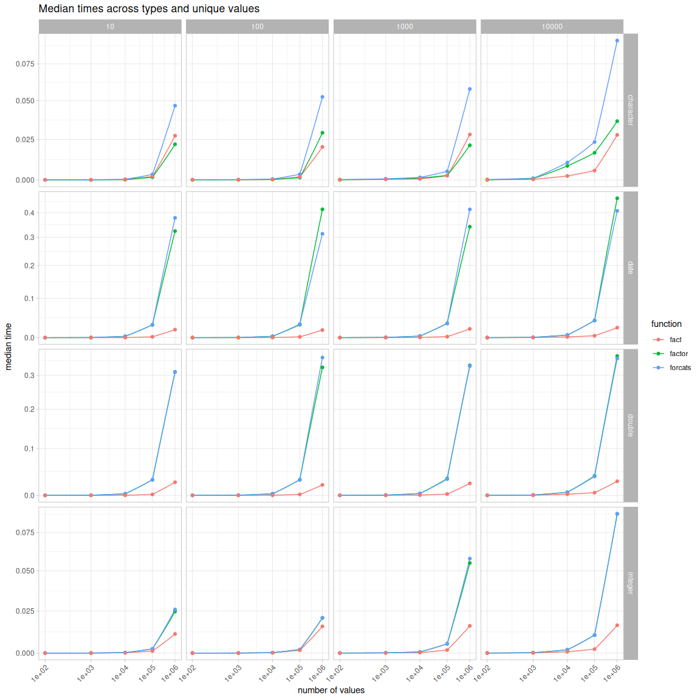

<!-- bench/bench.md is generated from bench/bench.Rmd. Please edit that file -->

``` r
requireNamespace("bench")
#> Loading required namespace: bench
requireNamespace("stringi")
requireNamespace("ggplot2")
#> Loading required namespace: ggplot2
requireNamespace("ggbeeswarm")
#> Loading required namespace: ggbeeswarm
requireNamespace("gt")
#> Loading required namespace: gt

library(facts)
library(forcats, include.only = "as_factor")

# assuming it's the same as numeric
as_factor.Date <- function(x, ...) {
  factor(x)
}

registerS3method("as_factor", "Date", as_factor.Date)
```

## Benchmarks

``` r
res <- bench::press(
  n_unique = 10^(1:4),
  n_values = 10^(2:6),
  value_type = c("character", "double", "integer", "date"),
  {
    x <- switch(
      value_type,
      character = stringi::stri_rand_strings(n_unique, 5),
      double = stats::runif(n_unique),
      integer = order(stats::runif(n_unique)),
      date = Sys.Date() + order(stats::runif(n_unique)),
      logical = c(TRUE, FALSE, NA)
    )
    x <- sample(x, n_values, TRUE)
    bench::mark(
      factor = factor(x),
      forcats = as_factor(x),
      fact = fact(x),
      check = FALSE
    )
  }
)
#> Running with:
#>    n_unique n_values value_type
#>  1       10      100 character
#>  2      100      100 character
#>  3     1000      100 character
#>  4    10000      100 character
#>  5       10     1000 character
#>  6      100     1000 character
#>  7     1000     1000 character
#>  8    10000     1000 character
#>  9       10    10000 character
#> 10      100    10000 character
#> 11     1000    10000 character
#> 12    10000    10000 character
#> 13       10   100000 character
#> 14      100   100000 character
#> 15     1000   100000 character
#> 16    10000   100000 character
#> 17       10  1000000 character
#> Warning: Some expressions had a GC in every iteration; so filtering is
#> disabled.
#> 18      100  1000000 character
#> Warning: Some expressions had a GC in every iteration; so filtering is
#> disabled.
#> 19     1000  1000000 character
#> Warning: Some expressions had a GC in every iteration; so filtering is
#> disabled.
#> 20    10000  1000000 character
#> Warning: Some expressions had a GC in every iteration; so filtering is
#> disabled.
#> 21       10      100 double
#> 22      100      100 double
#> 23     1000      100 double
#> 24    10000      100 double
#> 25       10     1000 double
#> 26      100     1000 double
#> 27     1000     1000 double
#> 28    10000     1000 double
#> 29       10    10000 double
#> 30      100    10000 double
#> 31     1000    10000 double
#> 32    10000    10000 double
#> 33       10   100000 double
#> 34      100   100000 double
#> 35     1000   100000 double
#> 36    10000   100000 double
#> 37       10  1000000 double
#> Warning: Some expressions had a GC in every iteration; so filtering is
#> disabled.
#> 38      100  1000000 double
#> Warning: Some expressions had a GC in every iteration; so filtering is
#> disabled.
#> 39     1000  1000000 double
#> Warning: Some expressions had a GC in every iteration; so filtering is
#> disabled.
#> 40    10000  1000000 double
#> Warning: Some expressions had a GC in every iteration; so filtering is
#> disabled.
#> 41       10      100 integer
#> 42      100      100 integer
#> 43     1000      100 integer
#> 44    10000      100 integer
#> 45       10     1000 integer
#> 46      100     1000 integer
#> 47     1000     1000 integer
#> 48    10000     1000 integer
#> 49       10    10000 integer
#> 50      100    10000 integer
#> 51     1000    10000 integer
#> 52    10000    10000 integer
#> 53       10   100000 integer
#> 54      100   100000 integer
#> 55     1000   100000 integer
#> 56    10000   100000 integer
#> 57       10  1000000 integer
#> 58      100  1000000 integer
#> 59     1000  1000000 integer
#> Warning: Some expressions had a GC in every iteration; so filtering is
#> disabled.
#> 60    10000  1000000 integer
#> Warning: Some expressions had a GC in every iteration; so filtering is
#> disabled.
#> 61       10      100 date
#> 62      100      100 date
#> 63     1000      100 date
#> 64    10000      100 date
#> 65       10     1000 date
#> 66      100     1000 date
#> 67     1000     1000 date
#> 68    10000     1000 date
#> 69       10    10000 date
#> 70      100    10000 date
#> 71     1000    10000 date
#> 72    10000    10000 date
#> 73       10   100000 date
#> 74      100   100000 date
#> 75     1000   100000 date
#> 76    10000   100000 date
#> 77       10  1000000 date
#> Warning: Some expressions had a GC in every iteration; so filtering is
#> disabled.
#> 78      100  1000000 date
#> Warning: Some expressions had a GC in every iteration; so filtering is
#> disabled.
#> 79     1000  1000000 date
#> Warning: Some expressions had a GC in every iteration; so filtering is
#> disabled.
#> 80    10000  1000000 date
#> Warning: Some expressions had a GC in every iteration; so filtering is
#> disabled.
```

``` r
res[1:9] |> 
  transform(expression = sapply(expression, deparse1)) |> 
  gt::gt("expression", "value_type") |> 
  gt::tab_options(row.striping.include_table_body = TRUE)
```

<div id="xtbibnxmnm" style="padding-left:0px;padding-right:0px;padding-top:10px;padding-bottom:10px;overflow-x:auto;overflow-y:auto;width:auto;height:auto;">
<style>#xtbibnxmnm table {
  font-family: system-ui, 'Segoe UI', Roboto, Helvetica, Arial, sans-serif, 'Apple Color Emoji', 'Segoe UI Emoji', 'Segoe UI Symbol', 'Noto Color Emoji';
  -webkit-font-smoothing: antialiased;
  -moz-osx-font-smoothing: grayscale;
}
&#10;#xtbibnxmnm thead, #xtbibnxmnm tbody, #xtbibnxmnm tfoot, #xtbibnxmnm tr, #xtbibnxmnm td, #xtbibnxmnm th {
  border-style: none;
}
&#10;#xtbibnxmnm p {
  margin: 0;
  padding: 0;
}
&#10;#xtbibnxmnm .gt_table {
  display: table;
  border-collapse: collapse;
  line-height: normal;
  margin-left: auto;
  margin-right: auto;
  color: #333333;
  font-size: 16px;
  font-weight: normal;
  font-style: normal;
  background-color: #FFFFFF;
  width: auto;
  border-top-style: solid;
  border-top-width: 2px;
  border-top-color: #A8A8A8;
  border-right-style: none;
  border-right-width: 2px;
  border-right-color: #D3D3D3;
  border-bottom-style: solid;
  border-bottom-width: 2px;
  border-bottom-color: #A8A8A8;
  border-left-style: none;
  border-left-width: 2px;
  border-left-color: #D3D3D3;
}
&#10;#xtbibnxmnm .gt_caption {
  padding-top: 4px;
  padding-bottom: 4px;
}
&#10;#xtbibnxmnm .gt_title {
  color: #333333;
  font-size: 125%;
  font-weight: initial;
  padding-top: 4px;
  padding-bottom: 4px;
  padding-left: 5px;
  padding-right: 5px;
  border-bottom-color: #FFFFFF;
  border-bottom-width: 0;
}
&#10;#xtbibnxmnm .gt_subtitle {
  color: #333333;
  font-size: 85%;
  font-weight: initial;
  padding-top: 3px;
  padding-bottom: 5px;
  padding-left: 5px;
  padding-right: 5px;
  border-top-color: #FFFFFF;
  border-top-width: 0;
}
&#10;#xtbibnxmnm .gt_heading {
  background-color: #FFFFFF;
  text-align: center;
  border-bottom-color: #FFFFFF;
  border-left-style: none;
  border-left-width: 1px;
  border-left-color: #D3D3D3;
  border-right-style: none;
  border-right-width: 1px;
  border-right-color: #D3D3D3;
}
&#10;#xtbibnxmnm .gt_bottom_border {
  border-bottom-style: solid;
  border-bottom-width: 2px;
  border-bottom-color: #D3D3D3;
}
&#10;#xtbibnxmnm .gt_col_headings {
  border-top-style: solid;
  border-top-width: 2px;
  border-top-color: #D3D3D3;
  border-bottom-style: solid;
  border-bottom-width: 2px;
  border-bottom-color: #D3D3D3;
  border-left-style: none;
  border-left-width: 1px;
  border-left-color: #D3D3D3;
  border-right-style: none;
  border-right-width: 1px;
  border-right-color: #D3D3D3;
}
&#10;#xtbibnxmnm .gt_col_heading {
  color: #333333;
  background-color: #FFFFFF;
  font-size: 100%;
  font-weight: normal;
  text-transform: inherit;
  border-left-style: none;
  border-left-width: 1px;
  border-left-color: #D3D3D3;
  border-right-style: none;
  border-right-width: 1px;
  border-right-color: #D3D3D3;
  vertical-align: bottom;
  padding-top: 5px;
  padding-bottom: 6px;
  padding-left: 5px;
  padding-right: 5px;
  overflow-x: hidden;
}
&#10;#xtbibnxmnm .gt_column_spanner_outer {
  color: #333333;
  background-color: #FFFFFF;
  font-size: 100%;
  font-weight: normal;
  text-transform: inherit;
  padding-top: 0;
  padding-bottom: 0;
  padding-left: 4px;
  padding-right: 4px;
}
&#10;#xtbibnxmnm .gt_column_spanner_outer:first-child {
  padding-left: 0;
}
&#10;#xtbibnxmnm .gt_column_spanner_outer:last-child {
  padding-right: 0;
}
&#10;#xtbibnxmnm .gt_column_spanner {
  border-bottom-style: solid;
  border-bottom-width: 2px;
  border-bottom-color: #D3D3D3;
  vertical-align: bottom;
  padding-top: 5px;
  padding-bottom: 5px;
  overflow-x: hidden;
  display: inline-block;
  width: 100%;
}
&#10;#xtbibnxmnm .gt_spanner_row {
  border-bottom-style: hidden;
}
&#10;#xtbibnxmnm .gt_group_heading {
  padding-top: 8px;
  padding-bottom: 8px;
  padding-left: 5px;
  padding-right: 5px;
  color: #333333;
  background-color: #FFFFFF;
  font-size: 100%;
  font-weight: initial;
  text-transform: inherit;
  border-top-style: solid;
  border-top-width: 2px;
  border-top-color: #D3D3D3;
  border-bottom-style: solid;
  border-bottom-width: 2px;
  border-bottom-color: #D3D3D3;
  border-left-style: none;
  border-left-width: 1px;
  border-left-color: #D3D3D3;
  border-right-style: none;
  border-right-width: 1px;
  border-right-color: #D3D3D3;
  vertical-align: middle;
  text-align: left;
}
&#10;#xtbibnxmnm .gt_empty_group_heading {
  padding: 0.5px;
  color: #333333;
  background-color: #FFFFFF;
  font-size: 100%;
  font-weight: initial;
  border-top-style: solid;
  border-top-width: 2px;
  border-top-color: #D3D3D3;
  border-bottom-style: solid;
  border-bottom-width: 2px;
  border-bottom-color: #D3D3D3;
  vertical-align: middle;
}
&#10;#xtbibnxmnm .gt_from_md > :first-child {
  margin-top: 0;
}
&#10;#xtbibnxmnm .gt_from_md > :last-child {
  margin-bottom: 0;
}
&#10;#xtbibnxmnm .gt_row {
  padding-top: 8px;
  padding-bottom: 8px;
  padding-left: 5px;
  padding-right: 5px;
  margin: 10px;
  border-top-style: solid;
  border-top-width: 1px;
  border-top-color: #D3D3D3;
  border-left-style: none;
  border-left-width: 1px;
  border-left-color: #D3D3D3;
  border-right-style: none;
  border-right-width: 1px;
  border-right-color: #D3D3D3;
  vertical-align: middle;
  overflow-x: hidden;
}
&#10;#xtbibnxmnm .gt_stub {
  color: #333333;
  background-color: #FFFFFF;
  font-size: 100%;
  font-weight: initial;
  text-transform: inherit;
  border-right-style: solid;
  border-right-width: 2px;
  border-right-color: #D3D3D3;
  padding-left: 5px;
  padding-right: 5px;
}
&#10;#xtbibnxmnm .gt_stub_row_group {
  color: #333333;
  background-color: #FFFFFF;
  font-size: 100%;
  font-weight: initial;
  text-transform: inherit;
  border-right-style: solid;
  border-right-width: 2px;
  border-right-color: #D3D3D3;
  padding-left: 5px;
  padding-right: 5px;
  vertical-align: top;
}
&#10;#xtbibnxmnm .gt_row_group_first td {
  border-top-width: 2px;
}
&#10;#xtbibnxmnm .gt_row_group_first th {
  border-top-width: 2px;
}
&#10;#xtbibnxmnm .gt_summary_row {
  color: #333333;
  background-color: #FFFFFF;
  text-transform: inherit;
  padding-top: 8px;
  padding-bottom: 8px;
  padding-left: 5px;
  padding-right: 5px;
}
&#10;#xtbibnxmnm .gt_first_summary_row {
  border-top-style: solid;
  border-top-color: #D3D3D3;
}
&#10;#xtbibnxmnm .gt_first_summary_row.thick {
  border-top-width: 2px;
}
&#10;#xtbibnxmnm .gt_last_summary_row {
  padding-top: 8px;
  padding-bottom: 8px;
  padding-left: 5px;
  padding-right: 5px;
  border-bottom-style: solid;
  border-bottom-width: 2px;
  border-bottom-color: #D3D3D3;
}
&#10;#xtbibnxmnm .gt_grand_summary_row {
  color: #333333;
  background-color: #FFFFFF;
  text-transform: inherit;
  padding-top: 8px;
  padding-bottom: 8px;
  padding-left: 5px;
  padding-right: 5px;
}
&#10;#xtbibnxmnm .gt_first_grand_summary_row {
  padding-top: 8px;
  padding-bottom: 8px;
  padding-left: 5px;
  padding-right: 5px;
  border-top-style: double;
  border-top-width: 6px;
  border-top-color: #D3D3D3;
}
&#10;#xtbibnxmnm .gt_last_grand_summary_row_top {
  padding-top: 8px;
  padding-bottom: 8px;
  padding-left: 5px;
  padding-right: 5px;
  border-bottom-style: double;
  border-bottom-width: 6px;
  border-bottom-color: #D3D3D3;
}
&#10;#xtbibnxmnm .gt_striped {
  background-color: rgba(128, 128, 128, 0.05);
}
&#10;#xtbibnxmnm .gt_table_body {
  border-top-style: solid;
  border-top-width: 2px;
  border-top-color: #D3D3D3;
  border-bottom-style: solid;
  border-bottom-width: 2px;
  border-bottom-color: #D3D3D3;
}
&#10;#xtbibnxmnm .gt_footnotes {
  color: #333333;
  background-color: #FFFFFF;
  border-bottom-style: none;
  border-bottom-width: 2px;
  border-bottom-color: #D3D3D3;
  border-left-style: none;
  border-left-width: 2px;
  border-left-color: #D3D3D3;
  border-right-style: none;
  border-right-width: 2px;
  border-right-color: #D3D3D3;
}
&#10;#xtbibnxmnm .gt_footnote {
  margin: 0px;
  font-size: 90%;
  padding-top: 4px;
  padding-bottom: 4px;
  padding-left: 5px;
  padding-right: 5px;
}
&#10;#xtbibnxmnm .gt_sourcenotes {
  color: #333333;
  background-color: #FFFFFF;
  border-bottom-style: none;
  border-bottom-width: 2px;
  border-bottom-color: #D3D3D3;
  border-left-style: none;
  border-left-width: 2px;
  border-left-color: #D3D3D3;
  border-right-style: none;
  border-right-width: 2px;
  border-right-color: #D3D3D3;
}
&#10;#xtbibnxmnm .gt_sourcenote {
  font-size: 90%;
  padding-top: 4px;
  padding-bottom: 4px;
  padding-left: 5px;
  padding-right: 5px;
}
&#10;#xtbibnxmnm .gt_left {
  text-align: left;
}
&#10;#xtbibnxmnm .gt_center {
  text-align: center;
}
&#10;#xtbibnxmnm .gt_right {
  text-align: right;
  font-variant-numeric: tabular-nums;
}
&#10;#xtbibnxmnm .gt_font_normal {
  font-weight: normal;
}
&#10;#xtbibnxmnm .gt_font_bold {
  font-weight: bold;
}
&#10;#xtbibnxmnm .gt_font_italic {
  font-style: italic;
}
&#10;#xtbibnxmnm .gt_super {
  font-size: 65%;
}
&#10;#xtbibnxmnm .gt_footnote_marks {
  font-size: 75%;
  vertical-align: 0.4em;
  position: initial;
}
&#10;#xtbibnxmnm .gt_asterisk {
  font-size: 100%;
  vertical-align: 0;
}
&#10;#xtbibnxmnm .gt_indent_1 {
  text-indent: 5px;
}
&#10;#xtbibnxmnm .gt_indent_2 {
  text-indent: 10px;
}
&#10;#xtbibnxmnm .gt_indent_3 {
  text-indent: 15px;
}
&#10;#xtbibnxmnm .gt_indent_4 {
  text-indent: 20px;
}
&#10;#xtbibnxmnm .gt_indent_5 {
  text-indent: 25px;
}
</style>
<table class="gt_table" data-quarto-disable-processing="false" data-quarto-bootstrap="false">
  <thead>
    &#10;    <tr class="gt_col_headings">
      <th class="gt_col_heading gt_columns_bottom_border gt_left" rowspan="1" colspan="1" scope="col" id=""></th>
      <th class="gt_col_heading gt_columns_bottom_border gt_right" rowspan="1" colspan="1" scope="col" id="n_unique">n_unique</th>
      <th class="gt_col_heading gt_columns_bottom_border gt_right" rowspan="1" colspan="1" scope="col" id="n_values">n_values</th>
      <th class="gt_col_heading gt_columns_bottom_border gt_center" rowspan="1" colspan="1" scope="col" id="min">min</th>
      <th class="gt_col_heading gt_columns_bottom_border gt_center" rowspan="1" colspan="1" scope="col" id="median">median</th>
      <th class="gt_col_heading gt_columns_bottom_border gt_right" rowspan="1" colspan="1" scope="col" id="itr.sec">itr.sec</th>
      <th class="gt_col_heading gt_columns_bottom_border gt_center" rowspan="1" colspan="1" scope="col" id="mem_alloc">mem_alloc</th>
      <th class="gt_col_heading gt_columns_bottom_border gt_right" rowspan="1" colspan="1" scope="col" id="gc.sec">gc.sec</th>
    </tr>
  </thead>
  <tbody class="gt_table_body">
    <tr class="gt_group_heading_row">
      <th colspan="8" class="gt_group_heading" scope="colgroup" id="character">character</th>
    </tr>
    <tr class="gt_row_group_first"><th id="stub_1_1" scope="row" class="gt_row gt_left gt_stub">factor(x)</th>
<td headers="character stub_1_1 n_unique" class="gt_row gt_right">10</td>
<td headers="character stub_1_1 n_values" class="gt_row gt_right">1e+02</td>
<td headers="character stub_1_1 min" class="gt_row gt_center">155.09µs</td>
<td headers="character stub_1_1 median" class="gt_row gt_center">165.63µs</td>
<td headers="character stub_1_1 itr.sec" class="gt_row gt_right">5395.3912372</td>
<td headers="character stub_1_1 mem_alloc" class="gt_row gt_center">2.75KB</td>
<td headers="character stub_1_1 gc.sec" class="gt_row gt_right">9.6432372</td></tr>
    <tr><th id="stub_1_2" scope="row" class="gt_row gt_left gt_stub">as_factor(x)</th>
<td headers="character stub_1_2 n_unique" class="gt_row gt_right gt_striped">10</td>
<td headers="character stub_1_2 n_values" class="gt_row gt_right gt_striped">1e+02</td>
<td headers="character stub_1_2 min" class="gt_row gt_center gt_striped">614.11µs</td>
<td headers="character stub_1_2 median" class="gt_row gt_center gt_striped">842.41µs</td>
<td headers="character stub_1_2 itr.sec" class="gt_row gt_right gt_striped">1245.5530927</td>
<td headers="character stub_1_2 mem_alloc" class="gt_row gt_center gt_striped">80.83KB</td>
<td headers="character stub_1_2 gc.sec" class="gt_row gt_right gt_striped">0.0000000</td></tr>
    <tr><th id="stub_1_3" scope="row" class="gt_row gt_left gt_stub">fact(x)</th>
<td headers="character stub_1_3 n_unique" class="gt_row gt_right">10</td>
<td headers="character stub_1_3 n_values" class="gt_row gt_right">1e+02</td>
<td headers="character stub_1_3 min" class="gt_row gt_center">281.82µs</td>
<td headers="character stub_1_3 median" class="gt_row gt_center">337.62µs</td>
<td headers="character stub_1_3 itr.sec" class="gt_row gt_right">2714.9373134</td>
<td headers="character stub_1_3 mem_alloc" class="gt_row gt_center">158.52KB</td>
<td headers="character stub_1_3 gc.sec" class="gt_row gt_right">2.0474640</td></tr>
    <tr><th id="stub_1_4" scope="row" class="gt_row gt_left gt_stub">factor(x)</th>
<td headers="character stub_1_4 n_unique" class="gt_row gt_right gt_striped">100</td>
<td headers="character stub_1_4 n_values" class="gt_row gt_right gt_striped">1e+02</td>
<td headers="character stub_1_4 min" class="gt_row gt_center gt_striped">336.76µs</td>
<td headers="character stub_1_4 median" class="gt_row gt_center gt_striped">376.78µs</td>
<td headers="character stub_1_4 itr.sec" class="gt_row gt_right gt_striped">2535.8767395</td>
<td headers="character stub_1_4 mem_alloc" class="gt_row gt_center gt_striped">11.10KB</td>
<td headers="character stub_1_4 gc.sec" class="gt_row gt_right gt_striped">0.0000000</td></tr>
    <tr><th id="stub_1_5" scope="row" class="gt_row gt_left gt_stub">as_factor(x)</th>
<td headers="character stub_1_5 n_unique" class="gt_row gt_right">100</td>
<td headers="character stub_1_5 n_values" class="gt_row gt_right">1e+02</td>
<td headers="character stub_1_5 min" class="gt_row gt_center">845.07µs</td>
<td headers="character stub_1_5 median" class="gt_row gt_center">895.82µs</td>
<td headers="character stub_1_5 itr.sec" class="gt_row gt_right">1069.5878678</td>
<td headers="character stub_1_5 mem_alloc" class="gt_row gt_center">31.41KB</td>
<td headers="character stub_1_5 gc.sec" class="gt_row gt_right">2.0728447</td></tr>
    <tr><th id="stub_1_6" scope="row" class="gt_row gt_left gt_stub">fact(x)</th>
<td headers="character stub_1_6 n_unique" class="gt_row gt_right gt_striped">100</td>
<td headers="character stub_1_6 n_values" class="gt_row gt_right gt_striped">1e+02</td>
<td headers="character stub_1_6 min" class="gt_row gt_center gt_striped">289.06µs</td>
<td headers="character stub_1_6 median" class="gt_row gt_center gt_striped">309.11µs</td>
<td headers="character stub_1_6 itr.sec" class="gt_row gt_right gt_striped">3071.9392302</td>
<td headers="character stub_1_6 mem_alloc" class="gt_row gt_center gt_striped">5.48KB</td>
<td headers="character stub_1_6 gc.sec" class="gt_row gt_right gt_striped">2.0686459</td></tr>
    <tr><th id="stub_1_7" scope="row" class="gt_row gt_left gt_stub">factor(x)</th>
<td headers="character stub_1_7 n_unique" class="gt_row gt_right">1000</td>
<td headers="character stub_1_7 n_values" class="gt_row gt_right">1e+02</td>
<td headers="character stub_1_7 min" class="gt_row gt_center">460.65µs</td>
<td headers="character stub_1_7 median" class="gt_row gt_center">476.74µs</td>
<td headers="character stub_1_7 itr.sec" class="gt_row gt_right">1990.6095197</td>
<td headers="character stub_1_7 mem_alloc" class="gt_row gt_center">12.73KB</td>
<td headers="character stub_1_7 gc.sec" class="gt_row gt_right">0.0000000</td></tr>
    <tr><th id="stub_1_8" scope="row" class="gt_row gt_left gt_stub">as_factor(x)</th>
<td headers="character stub_1_8 n_unique" class="gt_row gt_right gt_striped">1000</td>
<td headers="character stub_1_8 n_values" class="gt_row gt_right gt_striped">1e+02</td>
<td headers="character stub_1_8 min" class="gt_row gt_center gt_striped">1.02ms</td>
<td headers="character stub_1_8 median" class="gt_row gt_center gt_striped">1.13ms</td>
<td headers="character stub_1_8 itr.sec" class="gt_row gt_right gt_striped">860.1695170</td>
<td headers="character stub_1_8 mem_alloc" class="gt_row gt_center gt_striped">35.89KB</td>
<td headers="character stub_1_8 gc.sec" class="gt_row gt_right gt_striped">2.0726976</td></tr>
    <tr><th id="stub_1_9" scope="row" class="gt_row gt_left gt_stub">fact(x)</th>
<td headers="character stub_1_9 n_unique" class="gt_row gt_right">1000</td>
<td headers="character stub_1_9 n_values" class="gt_row gt_right">1e+02</td>
<td headers="character stub_1_9 min" class="gt_row gt_center">295.77µs</td>
<td headers="character stub_1_9 median" class="gt_row gt_center">316.49µs</td>
<td headers="character stub_1_9 itr.sec" class="gt_row gt_right">2882.9274239</td>
<td headers="character stub_1_9 mem_alloc" class="gt_row gt_center">6.10KB</td>
<td headers="character stub_1_9 gc.sec" class="gt_row gt_right">2.0592339</td></tr>
    <tr><th id="stub_1_10" scope="row" class="gt_row gt_left gt_stub">factor(x)</th>
<td headers="character stub_1_10 n_unique" class="gt_row gt_right gt_striped">10000</td>
<td headers="character stub_1_10 n_values" class="gt_row gt_right gt_striped">1e+02</td>
<td headers="character stub_1_10 min" class="gt_row gt_center gt_striped">517.15µs</td>
<td headers="character stub_1_10 median" class="gt_row gt_center gt_striped">533.88µs</td>
<td headers="character stub_1_10 itr.sec" class="gt_row gt_right gt_striped">1743.3894242</td>
<td headers="character stub_1_10 mem_alloc" class="gt_row gt_center gt_striped">13.49KB</td>
<td headers="character stub_1_10 gc.sec" class="gt_row gt_right gt_striped">0.0000000</td></tr>
    <tr><th id="stub_1_11" scope="row" class="gt_row gt_left gt_stub">as_factor(x)</th>
<td headers="character stub_1_11 n_unique" class="gt_row gt_right">10000</td>
<td headers="character stub_1_11 n_values" class="gt_row gt_right">1e+02</td>
<td headers="character stub_1_11 min" class="gt_row gt_center">1.05ms</td>
<td headers="character stub_1_11 median" class="gt_row gt_center">1.13ms</td>
<td headers="character stub_1_11 itr.sec" class="gt_row gt_right">842.8446319</td>
<td headers="character stub_1_11 mem_alloc" class="gt_row gt_center">37.92KB</td>
<td headers="character stub_1_11 gc.sec" class="gt_row gt_right">0.0000000</td></tr>
    <tr><th id="stub_1_12" scope="row" class="gt_row gt_left gt_stub">fact(x)</th>
<td headers="character stub_1_12 n_unique" class="gt_row gt_right gt_striped">10000</td>
<td headers="character stub_1_12 n_values" class="gt_row gt_right gt_striped">1e+02</td>
<td headers="character stub_1_12 min" class="gt_row gt_center gt_striped">294.97µs</td>
<td headers="character stub_1_12 median" class="gt_row gt_center gt_striped">316.84µs</td>
<td headers="character stub_1_12 itr.sec" class="gt_row gt_right gt_striped">2944.9285492</td>
<td headers="character stub_1_12 mem_alloc" class="gt_row gt_center gt_striped">6.41KB</td>
<td headers="character stub_1_12 gc.sec" class="gt_row gt_right gt_striped">2.0900841</td></tr>
    <tr><th id="stub_1_13" scope="row" class="gt_row gt_left gt_stub">factor(x)</th>
<td headers="character stub_1_13 n_unique" class="gt_row gt_right">10</td>
<td headers="character stub_1_13 n_values" class="gt_row gt_right">1e+03</td>
<td headers="character stub_1_13 min" class="gt_row gt_center">281.07µs</td>
<td headers="character stub_1_13 median" class="gt_row gt_center">292.40µs</td>
<td headers="character stub_1_13 itr.sec" class="gt_row gt_right">3281.6551122</td>
<td headers="character stub_1_13 mem_alloc" class="gt_row gt_center">23.81KB</td>
<td headers="character stub_1_13 gc.sec" class="gt_row gt_right">2.0600472</td></tr>
    <tr><th id="stub_1_14" scope="row" class="gt_row gt_left gt_stub">as_factor(x)</th>
<td headers="character stub_1_14 n_unique" class="gt_row gt_right gt_striped">10</td>
<td headers="character stub_1_14 n_values" class="gt_row gt_right gt_striped">1e+03</td>
<td headers="character stub_1_14 min" class="gt_row gt_center gt_striped">922.88µs</td>
<td headers="character stub_1_14 median" class="gt_row gt_center gt_striped">1.11ms</td>
<td headers="character stub_1_14 itr.sec" class="gt_row gt_right gt_striped">904.7703563</td>
<td headers="character stub_1_14 mem_alloc" class="gt_row gt_center gt_striped">59.60KB</td>
<td headers="character stub_1_14 gc.sec" class="gt_row gt_right gt_striped">0.0000000</td></tr>
    <tr><th id="stub_1_15" scope="row" class="gt_row gt_left gt_stub">fact(x)</th>
<td headers="character stub_1_15 n_unique" class="gt_row gt_right">10</td>
<td headers="character stub_1_15 n_values" class="gt_row gt_right">1e+03</td>
<td headers="character stub_1_15 min" class="gt_row gt_center">365.44µs</td>
<td headers="character stub_1_15 median" class="gt_row gt_center">392.64µs</td>
<td headers="character stub_1_15 itr.sec" class="gt_row gt_right">2282.0470093</td>
<td headers="character stub_1_15 mem_alloc" class="gt_row gt_center">20.09KB</td>
<td headers="character stub_1_15 gc.sec" class="gt_row gt_right">2.0503567</td></tr>
    <tr><th id="stub_1_16" scope="row" class="gt_row gt_left gt_stub">factor(x)</th>
<td headers="character stub_1_16 n_unique" class="gt_row gt_right gt_striped">100</td>
<td headers="character stub_1_16 n_values" class="gt_row gt_right gt_striped">1e+03</td>
<td headers="character stub_1_16 min" class="gt_row gt_center gt_striped">605.89µs</td>
<td headers="character stub_1_16 median" class="gt_row gt_center gt_striped">629.17µs</td>
<td headers="character stub_1_16 itr.sec" class="gt_row gt_right gt_striped">1430.6161020</td>
<td headers="character stub_1_16 mem_alloc" class="gt_row gt_center gt_striped">34.55KB</td>
<td headers="character stub_1_16 gc.sec" class="gt_row gt_right gt_striped">0.0000000</td></tr>
    <tr><th id="stub_1_17" scope="row" class="gt_row gt_left gt_stub">as_factor(x)</th>
<td headers="character stub_1_17 n_unique" class="gt_row gt_right">100</td>
<td headers="character stub_1_17 n_values" class="gt_row gt_right">1e+03</td>
<td headers="character stub_1_17 min" class="gt_row gt_center">1.30ms</td>
<td headers="character stub_1_17 median" class="gt_row gt_center">1.36ms</td>
<td headers="character stub_1_17 itr.sec" class="gt_row gt_right">690.6312634</td>
<td headers="character stub_1_17 mem_alloc" class="gt_row gt_center">90.62KB</td>
<td headers="character stub_1_17 gc.sec" class="gt_row gt_right">2.0739678</td></tr>
    <tr><th id="stub_1_18" scope="row" class="gt_row gt_left gt_stub">fact(x)</th>
<td headers="character stub_1_18 n_unique" class="gt_row gt_right gt_striped">100</td>
<td headers="character stub_1_18 n_values" class="gt_row gt_right gt_striped">1e+03</td>
<td headers="character stub_1_18 min" class="gt_row gt_center gt_striped">407.06µs</td>
<td headers="character stub_1_18 median" class="gt_row gt_center gt_striped">424.71µs</td>
<td headers="character stub_1_18 itr.sec" class="gt_row gt_right gt_striped">2312.8977240</td>
<td headers="character stub_1_18 mem_alloc" class="gt_row gt_center gt_striped">23.95KB</td>
<td headers="character stub_1_18 gc.sec" class="gt_row gt_right gt_striped">2.0650873</td></tr>
    <tr><th id="stub_1_19" scope="row" class="gt_row gt_left gt_stub">factor(x)</th>
<td headers="character stub_1_19 n_unique" class="gt_row gt_right">1000</td>
<td headers="character stub_1_19 n_values" class="gt_row gt_right">1e+03</td>
<td headers="character stub_1_19 min" class="gt_row gt_center">4.21ms</td>
<td headers="character stub_1_19 median" class="gt_row gt_center">4.27ms</td>
<td headers="character stub_1_19 itr.sec" class="gt_row gt_right">232.0354697</td>
<td headers="character stub_1_19 mem_alloc" class="gt_row gt_center">92.62KB</td>
<td headers="character stub_1_19 gc.sec" class="gt_row gt_right">0.0000000</td></tr>
    <tr><th id="stub_1_20" scope="row" class="gt_row gt_left gt_stub">as_factor(x)</th>
<td headers="character stub_1_20 n_unique" class="gt_row gt_right gt_striped">1000</td>
<td headers="character stub_1_20 n_values" class="gt_row gt_right gt_striped">1e+03</td>
<td headers="character stub_1_20 min" class="gt_row gt_center gt_striped">5.20ms</td>
<td headers="character stub_1_20 median" class="gt_row gt_center gt_striped">5.38ms</td>
<td headers="character stub_1_20 itr.sec" class="gt_row gt_right gt_striped">184.9345219</td>
<td headers="character stub_1_20 mem_alloc" class="gt_row gt_center gt_striped">261.57KB</td>
<td headers="character stub_1_20 gc.sec" class="gt_row gt_right gt_striped">0.0000000</td></tr>
    <tr><th id="stub_1_21" scope="row" class="gt_row gt_left gt_stub">fact(x)</th>
<td headers="character stub_1_21 n_unique" class="gt_row gt_right">1000</td>
<td headers="character stub_1_21 n_values" class="gt_row gt_right">1e+03</td>
<td headers="character stub_1_21 min" class="gt_row gt_center">529.07µs</td>
<td headers="character stub_1_21 median" class="gt_row gt_center">562.55µs</td>
<td headers="character stub_1_21 itr.sec" class="gt_row gt_right">1642.4335907</td>
<td headers="character stub_1_21 mem_alloc" class="gt_row gt_center">45.36KB</td>
<td headers="character stub_1_21 gc.sec" class="gt_row gt_right">2.0530420</td></tr>
    <tr><th id="stub_1_22" scope="row" class="gt_row gt_left gt_stub">factor(x)</th>
<td headers="character stub_1_22 n_unique" class="gt_row gt_right gt_striped">10000</td>
<td headers="character stub_1_22 n_values" class="gt_row gt_right gt_striped">1e+03</td>
<td headers="character stub_1_22 min" class="gt_row gt_center gt_striped">6.86ms</td>
<td headers="character stub_1_22 median" class="gt_row gt_center gt_striped">7.03ms</td>
<td headers="character stub_1_22 itr.sec" class="gt_row gt_right gt_striped">134.4696308</td>
<td headers="character stub_1_22 mem_alloc" class="gt_row gt_center gt_striped">115.97KB</td>
<td headers="character stub_1_22 gc.sec" class="gt_row gt_right gt_striped">0.0000000</td></tr>
    <tr><th id="stub_1_23" scope="row" class="gt_row gt_left gt_stub">as_factor(x)</th>
<td headers="character stub_1_23 n_unique" class="gt_row gt_right">10000</td>
<td headers="character stub_1_23 n_values" class="gt_row gt_right">1e+03</td>
<td headers="character stub_1_23 min" class="gt_row gt_center">8.01ms</td>
<td headers="character stub_1_23 median" class="gt_row gt_center">8.22ms</td>
<td headers="character stub_1_23 itr.sec" class="gt_row gt_right">115.9809299</td>
<td headers="character stub_1_23 mem_alloc" class="gt_row gt_center">325.12KB</td>
<td headers="character stub_1_23 gc.sec" class="gt_row gt_right">2.0710880</td></tr>
    <tr><th id="stub_1_24" scope="row" class="gt_row gt_left gt_stub">fact(x)</th>
<td headers="character stub_1_24 n_unique" class="gt_row gt_right gt_striped">10000</td>
<td headers="character stub_1_24 n_values" class="gt_row gt_right gt_striped">1e+03</td>
<td headers="character stub_1_24 min" class="gt_row gt_center gt_striped">557.30µs</td>
<td headers="character stub_1_24 median" class="gt_row gt_center gt_striped">584.05µs</td>
<td headers="character stub_1_24 itr.sec" class="gt_row gt_right gt_striped">1604.3190703</td>
<td headers="character stub_1_24 mem_alloc" class="gt_row gt_center gt_striped">54.44KB</td>
<td headers="character stub_1_24 gc.sec" class="gt_row gt_right gt_striped">0.0000000</td></tr>
    <tr><th id="stub_1_25" scope="row" class="gt_row gt_left gt_stub">factor(x)</th>
<td headers="character stub_1_25 n_unique" class="gt_row gt_right">10</td>
<td headers="character stub_1_25 n_values" class="gt_row gt_right">1e+04</td>
<td headers="character stub_1_25 min" class="gt_row gt_center">1.15ms</td>
<td headers="character stub_1_25 median" class="gt_row gt_center">1.20ms</td>
<td headers="character stub_1_25 itr.sec" class="gt_row gt_right">776.1451674</td>
<td headers="character stub_1_25 mem_alloc" class="gt_row gt_center">284.44KB</td>
<td headers="character stub_1_25 gc.sec" class="gt_row gt_right">4.2296739</td></tr>
    <tr><th id="stub_1_26" scope="row" class="gt_row gt_left gt_stub">as_factor(x)</th>
<td headers="character stub_1_26 n_unique" class="gt_row gt_right gt_striped">10</td>
<td headers="character stub_1_26 n_values" class="gt_row gt_right gt_striped">1e+04</td>
<td headers="character stub_1_26 min" class="gt_row gt_center gt_striped">2.98ms</td>
<td headers="character stub_1_26 median" class="gt_row gt_center gt_striped">3.13ms</td>
<td headers="character stub_1_26 itr.sec" class="gt_row gt_right gt_striped">305.7597814</td>
<td headers="character stub_1_26 mem_alloc" class="gt_row gt_center gt_striped">636.63KB</td>
<td headers="character stub_1_26 gc.sec" class="gt_row gt_right gt_striped">4.2466636</td></tr>
    <tr><th id="stub_1_27" scope="row" class="gt_row gt_left gt_stub">fact(x)</th>
<td headers="character stub_1_27 n_unique" class="gt_row gt_right">10</td>
<td headers="character stub_1_27 n_values" class="gt_row gt_right">1e+04</td>
<td headers="character stub_1_27 min" class="gt_row gt_center">1.27ms</td>
<td headers="character stub_1_27 median" class="gt_row gt_center">1.34ms</td>
<td headers="character stub_1_27 itr.sec" class="gt_row gt_right">713.9760832</td>
<td headers="character stub_1_27 mem_alloc" class="gt_row gt_center">245.56KB</td>
<td headers="character stub_1_27 gc.sec" class="gt_row gt_right">2.0457767</td></tr>
    <tr><th id="stub_1_28" scope="row" class="gt_row gt_left gt_stub">factor(x)</th>
<td headers="character stub_1_28 n_unique" class="gt_row gt_right gt_striped">100</td>
<td headers="character stub_1_28 n_values" class="gt_row gt_right gt_striped">1e+04</td>
<td headers="character stub_1_28 min" class="gt_row gt_center gt_striped">2.02ms</td>
<td headers="character stub_1_28 median" class="gt_row gt_center gt_striped">2.10ms</td>
<td headers="character stub_1_28 itr.sec" class="gt_row gt_right gt_striped">471.4209039</td>
<td headers="character stub_1_28 mem_alloc" class="gt_row gt_center gt_striped">295.18KB</td>
<td headers="character stub_1_28 gc.sec" class="gt_row gt_right gt_striped">4.2091152</td></tr>
    <tr><th id="stub_1_29" scope="row" class="gt_row gt_left gt_stub">as_factor(x)</th>
<td headers="character stub_1_29 n_unique" class="gt_row gt_right">100</td>
<td headers="character stub_1_29 n_values" class="gt_row gt_right">1e+04</td>
<td headers="character stub_1_29 min" class="gt_row gt_center">4.39ms</td>
<td headers="character stub_1_29 median" class="gt_row gt_center">4.50ms</td>
<td headers="character stub_1_29 itr.sec" class="gt_row gt_right">218.5699838</td>
<td headers="character stub_1_29 mem_alloc" class="gt_row gt_center">667.66KB</td>
<td headers="character stub_1_29 gc.sec" class="gt_row gt_right">2.0619810</td></tr>
    <tr><th id="stub_1_30" scope="row" class="gt_row gt_left gt_stub">fact(x)</th>
<td headers="character stub_1_30 n_unique" class="gt_row gt_right gt_striped">100</td>
<td headers="character stub_1_30 n_values" class="gt_row gt_right gt_striped">1e+04</td>
<td headers="character stub_1_30 min" class="gt_row gt_center gt_striped">1.41ms</td>
<td headers="character stub_1_30 median" class="gt_row gt_center gt_striped">1.46ms</td>
<td headers="character stub_1_30 itr.sec" class="gt_row gt_right gt_striped">675.2974370</td>
<td headers="character stub_1_30 mem_alloc" class="gt_row gt_center gt_striped">249.42KB</td>
<td headers="character stub_1_30 gc.sec" class="gt_row gt_right gt_striped">4.4427463</td></tr>
    <tr><th id="stub_1_31" scope="row" class="gt_row gt_left gt_stub">factor(x)</th>
<td headers="character stub_1_31 n_unique" class="gt_row gt_right">1000</td>
<td headers="character stub_1_31 n_values" class="gt_row gt_right">1e+04</td>
<td headers="character stub_1_31 min" class="gt_row gt_center">8.46ms</td>
<td headers="character stub_1_31 median" class="gt_row gt_center">8.63ms</td>
<td headers="character stub_1_31 itr.sec" class="gt_row gt_right">114.5522896</td>
<td headers="character stub_1_31 mem_alloc" class="gt_row gt_center">379.46KB</td>
<td headers="character stub_1_31 gc.sec" class="gt_row gt_right">0.0000000</td></tr>
    <tr><th id="stub_1_32" scope="row" class="gt_row gt_left gt_stub">as_factor(x)</th>
<td headers="character stub_1_32 n_unique" class="gt_row gt_right gt_striped">1000</td>
<td headers="character stub_1_32 n_values" class="gt_row gt_right gt_striped">1e+04</td>
<td headers="character stub_1_32 min" class="gt_row gt_center gt_striped">11.16ms</td>
<td headers="character stub_1_32 median" class="gt_row gt_center gt_striped">11.42ms</td>
<td headers="character stub_1_32 itr.sec" class="gt_row gt_right gt_striped">87.4422630</td>
<td headers="character stub_1_32 mem_alloc" class="gt_row gt_center gt_striped">909.92KB</td>
<td headers="character stub_1_32 gc.sec" class="gt_row gt_right gt_striped">2.0819586</td></tr>
    <tr><th id="stub_1_33" scope="row" class="gt_row gt_left gt_stub">fact(x)</th>
<td headers="character stub_1_33 n_unique" class="gt_row gt_right">1000</td>
<td headers="character stub_1_33 n_values" class="gt_row gt_right">1e+04</td>
<td headers="character stub_1_33 min" class="gt_row gt_center">1.74ms</td>
<td headers="character stub_1_33 median" class="gt_row gt_center">1.79ms</td>
<td headers="character stub_1_33 itr.sec" class="gt_row gt_right">548.3988319</td>
<td headers="character stub_1_33 mem_alloc" class="gt_row gt_center">281.03KB</td>
<td headers="character stub_1_33 gc.sec" class="gt_row gt_right">4.2022899</td></tr>
    <tr><th id="stub_1_34" scope="row" class="gt_row gt_left gt_stub">factor(x)</th>
<td headers="character stub_1_34 n_unique" class="gt_row gt_right gt_striped">10000</td>
<td headers="character stub_1_34 n_values" class="gt_row gt_right gt_striped">1e+04</td>
<td headers="character stub_1_34 min" class="gt_row gt_center gt_striped">68.24ms</td>
<td headers="character stub_1_34 median" class="gt_row gt_center gt_striped">68.98ms</td>
<td headers="character stub_1_34 itr.sec" class="gt_row gt_right gt_striped">14.5180848</td>
<td headers="character stub_1_34 mem_alloc" class="gt_row gt_center gt_striped">916.97KB</td>
<td headers="character stub_1_34 gc.sec" class="gt_row gt_right gt_striped">0.0000000</td></tr>
    <tr><th id="stub_1_35" scope="row" class="gt_row gt_left gt_stub">as_factor(x)</th>
<td headers="character stub_1_35 n_unique" class="gt_row gt_right">10000</td>
<td headers="character stub_1_35 n_values" class="gt_row gt_right">1e+04</td>
<td headers="character stub_1_35 min" class="gt_row gt_center">77.14ms</td>
<td headers="character stub_1_35 median" class="gt_row gt_center">79.43ms</td>
<td headers="character stub_1_35 itr.sec" class="gt_row gt_right">12.5884182</td>
<td headers="character stub_1_35 mem_alloc" class="gt_row gt_center">2.42MB</td>
<td headers="character stub_1_35 gc.sec" class="gt_row gt_right">0.0000000</td></tr>
    <tr><th id="stub_1_36" scope="row" class="gt_row gt_left gt_stub">fact(x)</th>
<td headers="character stub_1_36 n_unique" class="gt_row gt_right gt_striped">10000</td>
<td headers="character stub_1_36 n_values" class="gt_row gt_right gt_striped">1e+04</td>
<td headers="character stub_1_36 min" class="gt_row gt_center gt_striped">2.73ms</td>
<td headers="character stub_1_36 median" class="gt_row gt_center gt_striped">2.88ms</td>
<td headers="character stub_1_36 itr.sec" class="gt_row gt_right gt_striped">337.2247723</td>
<td headers="character stub_1_36 mem_alloc" class="gt_row gt_center gt_striped">480.72KB</td>
<td headers="character stub_1_36 gc.sec" class="gt_row gt_right gt_striped">4.2418210</td></tr>
    <tr><th id="stub_1_37" scope="row" class="gt_row gt_left gt_stub">factor(x)</th>
<td headers="character stub_1_37 n_unique" class="gt_row gt_right">10</td>
<td headers="character stub_1_37 n_values" class="gt_row gt_right">1e+05</td>
<td headers="character stub_1_37 min" class="gt_row gt_center">9.95ms</td>
<td headers="character stub_1_37 median" class="gt_row gt_center">10.15ms</td>
<td headers="character stub_1_37 itr.sec" class="gt_row gt_right">92.3087119</td>
<td headers="character stub_1_37 mem_alloc" class="gt_row gt_center">2.53MB</td>
<td headers="character stub_1_37 gc.sec" class="gt_row gt_right">4.3956529</td></tr>
    <tr><th id="stub_1_38" scope="row" class="gt_row gt_left gt_stub">as_factor(x)</th>
<td headers="character stub_1_38 n_unique" class="gt_row gt_right gt_striped">10</td>
<td headers="character stub_1_38 n_values" class="gt_row gt_right gt_striped">1e+05</td>
<td headers="character stub_1_38 min" class="gt_row gt_center gt_striped">22.87ms</td>
<td headers="character stub_1_38 median" class="gt_row gt_center gt_striped">23.38ms</td>
<td headers="character stub_1_38 itr.sec" class="gt_row gt_right gt_striped">42.1099912</td>
<td headers="character stub_1_38 mem_alloc" class="gt_row gt_center gt_striped">5.96MB</td>
<td headers="character stub_1_38 gc.sec" class="gt_row gt_right gt_striped">7.4311749</td></tr>
    <tr><th id="stub_1_39" scope="row" class="gt_row gt_left gt_stub">fact(x)</th>
<td headers="character stub_1_39 n_unique" class="gt_row gt_right">10</td>
<td headers="character stub_1_39 n_values" class="gt_row gt_right">1e+05</td>
<td headers="character stub_1_39 min" class="gt_row gt_center">10.04ms</td>
<td headers="character stub_1_39 median" class="gt_row gt_center">10.23ms</td>
<td headers="character stub_1_39 itr.sec" class="gt_row gt_right">95.9582761</td>
<td headers="character stub_1_39 mem_alloc" class="gt_row gt_center">2.15MB</td>
<td headers="character stub_1_39 gc.sec" class="gt_row gt_right">6.8541626</td></tr>
    <tr><th id="stub_1_40" scope="row" class="gt_row gt_left gt_stub">factor(x)</th>
<td headers="character stub_1_40 n_unique" class="gt_row gt_right gt_striped">100</td>
<td headers="character stub_1_40 n_values" class="gt_row gt_right gt_striped">1e+05</td>
<td headers="character stub_1_40 min" class="gt_row gt_center gt_striped">12.08ms</td>
<td headers="character stub_1_40 median" class="gt_row gt_center gt_striped">12.30ms</td>
<td headers="character stub_1_40 itr.sec" class="gt_row gt_right gt_striped">80.3943455</td>
<td headers="character stub_1_40 mem_alloc" class="gt_row gt_center gt_striped">2.54MB</td>
<td headers="character stub_1_40 gc.sec" class="gt_row gt_right gt_striped">4.3456403</td></tr>
    <tr><th id="stub_1_41" scope="row" class="gt_row gt_left gt_stub">as_factor(x)</th>
<td headers="character stub_1_41 n_unique" class="gt_row gt_right">100</td>
<td headers="character stub_1_41 n_values" class="gt_row gt_right">1e+05</td>
<td headers="character stub_1_41 min" class="gt_row gt_center">27.21ms</td>
<td headers="character stub_1_41 median" class="gt_row gt_center">27.48ms</td>
<td headers="character stub_1_41 itr.sec" class="gt_row gt_right">35.8780575</td>
<td headers="character stub_1_41 mem_alloc" class="gt_row gt_center">5.99MB</td>
<td headers="character stub_1_41 gc.sec" class="gt_row gt_right">7.6881552</td></tr>
    <tr><th id="stub_1_42" scope="row" class="gt_row gt_left gt_stub">fact(x)</th>
<td headers="character stub_1_42 n_unique" class="gt_row gt_right gt_striped">100</td>
<td headers="character stub_1_42 n_values" class="gt_row gt_right gt_striped">1e+05</td>
<td headers="character stub_1_42 min" class="gt_row gt_center gt_striped">11.37ms</td>
<td headers="character stub_1_42 median" class="gt_row gt_center gt_striped">11.68ms</td>
<td headers="character stub_1_42 itr.sec" class="gt_row gt_right gt_striped">84.5394619</td>
<td headers="character stub_1_42 mem_alloc" class="gt_row gt_center gt_striped">2.15MB</td>
<td headers="character stub_1_42 gc.sec" class="gt_row gt_right gt_striped">4.4494454</td></tr>
    <tr><th id="stub_1_43" scope="row" class="gt_row gt_left gt_stub">factor(x)</th>
<td headers="character stub_1_43 n_unique" class="gt_row gt_right">1000</td>
<td headers="character stub_1_43 n_values" class="gt_row gt_right">1e+05</td>
<td headers="character stub_1_43 min" class="gt_row gt_center">21.50ms</td>
<td headers="character stub_1_43 median" class="gt_row gt_center">21.98ms</td>
<td headers="character stub_1_43 itr.sec" class="gt_row gt_right">44.2809208</td>
<td headers="character stub_1_43 mem_alloc" class="gt_row gt_center">2.62MB</td>
<td headers="character stub_1_43 gc.sec" class="gt_row gt_right">2.1086153</td></tr>
    <tr><th id="stub_1_44" scope="row" class="gt_row gt_left gt_stub">as_factor(x)</th>
<td headers="character stub_1_44 n_unique" class="gt_row gt_right gt_striped">1000</td>
<td headers="character stub_1_44 n_values" class="gt_row gt_right gt_striped">1e+05</td>
<td headers="character stub_1_44 min" class="gt_row gt_center gt_striped">39.04ms</td>
<td headers="character stub_1_44 median" class="gt_row gt_center gt_striped">39.50ms</td>
<td headers="character stub_1_44 itr.sec" class="gt_row gt_right gt_striped">25.1510750</td>
<td headers="character stub_1_44 mem_alloc" class="gt_row gt_center gt_striped">6.23MB</td>
<td headers="character stub_1_44 gc.sec" class="gt_row gt_right gt_striped">4.5729227</td></tr>
    <tr><th id="stub_1_45" scope="row" class="gt_row gt_left gt_stub">fact(x)</th>
<td headers="character stub_1_45 n_unique" class="gt_row gt_right">1000</td>
<td headers="character stub_1_45 n_values" class="gt_row gt_right">1e+05</td>
<td headers="character stub_1_45 min" class="gt_row gt_center">12.65ms</td>
<td headers="character stub_1_45 median" class="gt_row gt_center">13.05ms</td>
<td headers="character stub_1_45 itr.sec" class="gt_row gt_right">75.1411373</td>
<td headers="character stub_1_45 mem_alloc" class="gt_row gt_center">2.18MB</td>
<td headers="character stub_1_45 gc.sec" class="gt_row gt_right">2.0872538</td></tr>
    <tr><th id="stub_1_46" scope="row" class="gt_row gt_left gt_stub">factor(x)</th>
<td headers="character stub_1_46 n_unique" class="gt_row gt_right gt_striped">10000</td>
<td headers="character stub_1_46 n_values" class="gt_row gt_right gt_striped">1e+05</td>
<td headers="character stub_1_46 min" class="gt_row gt_center gt_striped">130.16ms</td>
<td headers="character stub_1_46 median" class="gt_row gt_center gt_striped">131.21ms</td>
<td headers="character stub_1_46 itr.sec" class="gt_row gt_right gt_striped">7.5719894</td>
<td headers="character stub_1_46 mem_alloc" class="gt_row gt_center gt_striped">3.59MB</td>
<td headers="character stub_1_46 gc.sec" class="gt_row gt_right gt_striped">0.0000000</td></tr>
    <tr><th id="stub_1_47" scope="row" class="gt_row gt_left gt_stub">as_factor(x)</th>
<td headers="character stub_1_47 n_unique" class="gt_row gt_right">10000</td>
<td headers="character stub_1_47 n_values" class="gt_row gt_right">1e+05</td>
<td headers="character stub_1_47 min" class="gt_row gt_center">171.16ms</td>
<td headers="character stub_1_47 median" class="gt_row gt_center">171.71ms</td>
<td headers="character stub_1_47 itr.sec" class="gt_row gt_right">5.8236648</td>
<td headers="character stub_1_47 mem_alloc" class="gt_row gt_center">9.08MB</td>
<td headers="character stub_1_47 gc.sec" class="gt_row gt_right">2.9118324</td></tr>
    <tr><th id="stub_1_48" scope="row" class="gt_row gt_left gt_stub">fact(x)</th>
<td headers="character stub_1_48 n_unique" class="gt_row gt_right gt_striped">10000</td>
<td headers="character stub_1_48 n_values" class="gt_row gt_right gt_striped">1e+05</td>
<td headers="character stub_1_48 min" class="gt_row gt_center gt_striped">16.83ms</td>
<td headers="character stub_1_48 median" class="gt_row gt_center gt_striped">17.45ms</td>
<td headers="character stub_1_48 itr.sec" class="gt_row gt_right gt_striped">56.9433305</td>
<td headers="character stub_1_48 mem_alloc" class="gt_row gt_center gt_striped">2.54MB</td>
<td headers="character stub_1_48 gc.sec" class="gt_row gt_right gt_striped">2.1090122</td></tr>
    <tr><th id="stub_1_49" scope="row" class="gt_row gt_left gt_stub">factor(x)</th>
<td headers="character stub_1_49 n_unique" class="gt_row gt_right">10</td>
<td headers="character stub_1_49 n_values" class="gt_row gt_right">1e+06</td>
<td headers="character stub_1_49 min" class="gt_row gt_center">105.25ms</td>
<td headers="character stub_1_49 median" class="gt_row gt_center">121.32ms</td>
<td headers="character stub_1_49 itr.sec" class="gt_row gt_right">7.9483401</td>
<td headers="character stub_1_49 mem_alloc" class="gt_row gt_center">23.26MB</td>
<td headers="character stub_1_49 gc.sec" class="gt_row gt_right">3.9741700</td></tr>
    <tr><th id="stub_1_50" scope="row" class="gt_row gt_left gt_stub">as_factor(x)</th>
<td headers="character stub_1_50 n_unique" class="gt_row gt_right gt_striped">10</td>
<td headers="character stub_1_50 n_values" class="gt_row gt_right gt_striped">1e+06</td>
<td headers="character stub_1_50 min" class="gt_row gt_center gt_striped">252.50ms</td>
<td headers="character stub_1_50 median" class="gt_row gt_center gt_striped">257.45ms</td>
<td headers="character stub_1_50 itr.sec" class="gt_row gt_right gt_striped">3.8843053</td>
<td headers="character stub_1_50 mem_alloc" class="gt_row gt_center gt_striped">57.59MB</td>
<td headers="character stub_1_50 gc.sec" class="gt_row gt_right gt_striped">7.7686106</td></tr>
    <tr><th id="stub_1_51" scope="row" class="gt_row gt_left gt_stub">fact(x)</th>
<td headers="character stub_1_51 n_unique" class="gt_row gt_right">10</td>
<td headers="character stub_1_51 n_values" class="gt_row gt_right">1e+06</td>
<td headers="character stub_1_51 min" class="gt_row gt_center">111.87ms</td>
<td headers="character stub_1_51 median" class="gt_row gt_center">118.95ms</td>
<td headers="character stub_1_51 itr.sec" class="gt_row gt_right">8.0755314</td>
<td headers="character stub_1_51 mem_alloc" class="gt_row gt_center">19.44MB</td>
<td headers="character stub_1_51 gc.sec" class="gt_row gt_right">6.4604251</td></tr>
    <tr><th id="stub_1_52" scope="row" class="gt_row gt_left gt_stub">factor(x)</th>
<td headers="character stub_1_52 n_unique" class="gt_row gt_right gt_striped">100</td>
<td headers="character stub_1_52 n_values" class="gt_row gt_right gt_striped">1e+06</td>
<td headers="character stub_1_52 min" class="gt_row gt_center gt_striped">147.98ms</td>
<td headers="character stub_1_52 median" class="gt_row gt_center gt_striped">156.51ms</td>
<td headers="character stub_1_52 itr.sec" class="gt_row gt_right gt_striped">6.3466545</td>
<td headers="character stub_1_52 mem_alloc" class="gt_row gt_center gt_striped">23.27MB</td>
<td headers="character stub_1_52 gc.sec" class="gt_row gt_right gt_striped">4.7599909</td></tr>
    <tr><th id="stub_1_53" scope="row" class="gt_row gt_left gt_stub">as_factor(x)</th>
<td headers="character stub_1_53 n_unique" class="gt_row gt_right">100</td>
<td headers="character stub_1_53 n_values" class="gt_row gt_right">1e+06</td>
<td headers="character stub_1_53 min" class="gt_row gt_center">288.02ms</td>
<td headers="character stub_1_53 median" class="gt_row gt_center">320.61ms</td>
<td headers="character stub_1_53 itr.sec" class="gt_row gt_right">3.1190215</td>
<td headers="character stub_1_53 mem_alloc" class="gt_row gt_center">57.62MB</td>
<td headers="character stub_1_53 gc.sec" class="gt_row gt_right">6.2380430</td></tr>
    <tr><th id="stub_1_54" scope="row" class="gt_row gt_left gt_stub">fact(x)</th>
<td headers="character stub_1_54 n_unique" class="gt_row gt_right gt_striped">100</td>
<td headers="character stub_1_54 n_values" class="gt_row gt_right gt_striped">1e+06</td>
<td headers="character stub_1_54 min" class="gt_row gt_center gt_striped">132.38ms</td>
<td headers="character stub_1_54 median" class="gt_row gt_center gt_striped">132.82ms</td>
<td headers="character stub_1_54 itr.sec" class="gt_row gt_right gt_striped">7.5325144</td>
<td headers="character stub_1_54 mem_alloc" class="gt_row gt_center gt_striped">19.45MB</td>
<td headers="character stub_1_54 gc.sec" class="gt_row gt_right gt_striped">7.5325144</td></tr>
    <tr><th id="stub_1_55" scope="row" class="gt_row gt_left gt_stub">factor(x)</th>
<td headers="character stub_1_55 n_unique" class="gt_row gt_right">1000</td>
<td headers="character stub_1_55 n_values" class="gt_row gt_right">1e+06</td>
<td headers="character stub_1_55 min" class="gt_row gt_center">148.17ms</td>
<td headers="character stub_1_55 median" class="gt_row gt_center">155.83ms</td>
<td headers="character stub_1_55 itr.sec" class="gt_row gt_right">6.3289795</td>
<td headers="character stub_1_55 mem_alloc" class="gt_row gt_center">23.35MB</td>
<td headers="character stub_1_55 gc.sec" class="gt_row gt_right">3.1644898</td></tr>
    <tr><th id="stub_1_56" scope="row" class="gt_row gt_left gt_stub">as_factor(x)</th>
<td headers="character stub_1_56 n_unique" class="gt_row gt_right gt_striped">1000</td>
<td headers="character stub_1_56 n_values" class="gt_row gt_right gt_striped">1e+06</td>
<td headers="character stub_1_56 min" class="gt_row gt_center gt_striped">324.30ms</td>
<td headers="character stub_1_56 median" class="gt_row gt_center gt_striped">333.62ms</td>
<td headers="character stub_1_56 itr.sec" class="gt_row gt_right gt_striped">2.9974593</td>
<td headers="character stub_1_56 mem_alloc" class="gt_row gt_center gt_striped">57.86MB</td>
<td headers="character stub_1_56 gc.sec" class="gt_row gt_right gt_striped">4.4961890</td></tr>
    <tr><th id="stub_1_57" scope="row" class="gt_row gt_left gt_stub">fact(x)</th>
<td headers="character stub_1_57 n_unique" class="gt_row gt_right">1000</td>
<td headers="character stub_1_57 n_values" class="gt_row gt_right">1e+06</td>
<td headers="character stub_1_57 min" class="gt_row gt_center">132.65ms</td>
<td headers="character stub_1_57 median" class="gt_row gt_center">138.67ms</td>
<td headers="character stub_1_57 itr.sec" class="gt_row gt_right">7.1975731</td>
<td headers="character stub_1_57 mem_alloc" class="gt_row gt_center">19.48MB</td>
<td headers="character stub_1_57 gc.sec" class="gt_row gt_right">5.3981799</td></tr>
    <tr><th id="stub_1_58" scope="row" class="gt_row gt_left gt_stub">factor(x)</th>
<td headers="character stub_1_58 n_unique" class="gt_row gt_right gt_striped">10000</td>
<td headers="character stub_1_58 n_values" class="gt_row gt_right gt_striped">1e+06</td>
<td headers="character stub_1_58 min" class="gt_row gt_center gt_striped">285.85ms</td>
<td headers="character stub_1_58 median" class="gt_row gt_center gt_striped">288.43ms</td>
<td headers="character stub_1_58 itr.sec" class="gt_row gt_right gt_striped">3.4670564</td>
<td headers="character stub_1_58 mem_alloc" class="gt_row gt_center gt_striped">24.32MB</td>
<td headers="character stub_1_58 gc.sec" class="gt_row gt_right gt_striped">1.7335282</td></tr>
    <tr><th id="stub_1_59" scope="row" class="gt_row gt_left gt_stub">as_factor(x)</th>
<td headers="character stub_1_59 n_unique" class="gt_row gt_right">10000</td>
<td headers="character stub_1_59 n_values" class="gt_row gt_right">1e+06</td>
<td headers="character stub_1_59 min" class="gt_row gt_center">626.95ms</td>
<td headers="character stub_1_59 median" class="gt_row gt_center">626.95ms</td>
<td headers="character stub_1_59 itr.sec" class="gt_row gt_right">1.5950242</td>
<td headers="character stub_1_59 mem_alloc" class="gt_row gt_center">60.71MB</td>
<td headers="character stub_1_59 gc.sec" class="gt_row gt_right">3.1900483</td></tr>
    <tr><th id="stub_1_60" scope="row" class="gt_row gt_left gt_stub">fact(x)</th>
<td headers="character stub_1_60 n_unique" class="gt_row gt_right gt_striped">10000</td>
<td headers="character stub_1_60 n_values" class="gt_row gt_right gt_striped">1e+06</td>
<td headers="character stub_1_60 min" class="gt_row gt_center gt_striped">162.86ms</td>
<td headers="character stub_1_60 median" class="gt_row gt_center gt_striped">174.41ms</td>
<td headers="character stub_1_60 itr.sec" class="gt_row gt_right gt_striped">5.8351507</td>
<td headers="character stub_1_60 mem_alloc" class="gt_row gt_center gt_striped">19.84MB</td>
<td headers="character stub_1_60 gc.sec" class="gt_row gt_right gt_striped">3.8901005</td></tr>
    <tr class="gt_group_heading_row">
      <th colspan="8" class="gt_group_heading" scope="colgroup" id="double">double</th>
    </tr>
    <tr class="gt_row_group_first"><th id="stub_1_61" scope="row" class="gt_row gt_left gt_stub">factor(x)</th>
<td headers="double stub_1_61 n_unique" class="gt_row gt_right">10</td>
<td headers="double stub_1_61 n_values" class="gt_row gt_right">1e+02</td>
<td headers="double stub_1_61 min" class="gt_row gt_center">555.39µs</td>
<td headers="double stub_1_61 median" class="gt_row gt_center">570.29µs</td>
<td headers="double stub_1_61 itr.sec" class="gt_row gt_right">1653.8384628</td>
<td headers="double stub_1_61 mem_alloc" class="gt_row gt_center">3.58KB</td>
<td headers="double stub_1_61 gc.sec" class="gt_row gt_right">0.0000000</td></tr>
    <tr><th id="stub_1_62" scope="row" class="gt_row gt_left gt_stub">as_factor(x)</th>
<td headers="double stub_1_62 n_unique" class="gt_row gt_right gt_striped">10</td>
<td headers="double stub_1_62 n_values" class="gt_row gt_right gt_striped">1e+02</td>
<td headers="double stub_1_62 min" class="gt_row gt_center gt_striped">633.33µs</td>
<td headers="double stub_1_62 median" class="gt_row gt_center gt_striped">664.64µs</td>
<td headers="double stub_1_62 itr.sec" class="gt_row gt_right gt_striped">1441.0146695</td>
<td headers="double stub_1_62 mem_alloc" class="gt_row gt_center gt_striped">5.99KB</td>
<td headers="double stub_1_62 gc.sec" class="gt_row gt_right gt_striped">2.0468958</td></tr>
    <tr><th id="stub_1_63" scope="row" class="gt_row gt_left gt_stub">fact(x)</th>
<td headers="double stub_1_63 n_unique" class="gt_row gt_right">10</td>
<td headers="double stub_1_63 n_values" class="gt_row gt_right">1e+02</td>
<td headers="double stub_1_63 min" class="gt_row gt_center">320.94µs</td>
<td headers="double stub_1_63 median" class="gt_row gt_center">355.32µs</td>
<td headers="double stub_1_63 itr.sec" class="gt_row gt_right">2601.7712611</td>
<td headers="double stub_1_63 mem_alloc" class="gt_row gt_center">70.39KB</td>
<td headers="double stub_1_63 gc.sec" class="gt_row gt_right">0.0000000</td></tr>
    <tr><th id="stub_1_64" scope="row" class="gt_row gt_left gt_stub">factor(x)</th>
<td headers="double stub_1_64 n_unique" class="gt_row gt_right gt_striped">100</td>
<td headers="double stub_1_64 n_values" class="gt_row gt_right gt_striped">1e+02</td>
<td headers="double stub_1_64 min" class="gt_row gt_center gt_striped">777.35µs</td>
<td headers="double stub_1_64 median" class="gt_row gt_center gt_striped">797.78µs</td>
<td headers="double stub_1_64 itr.sec" class="gt_row gt_right gt_striped">1188.1583864</td>
<td headers="double stub_1_64 mem_alloc" class="gt_row gt_center gt_striped">10.68KB</td>
<td headers="double stub_1_64 gc.sec" class="gt_row gt_right gt_striped">0.0000000</td></tr>
    <tr><th id="stub_1_65" scope="row" class="gt_row gt_left gt_stub">as_factor(x)</th>
<td headers="double stub_1_65 n_unique" class="gt_row gt_right">100</td>
<td headers="double stub_1_65 n_values" class="gt_row gt_right">1e+02</td>
<td headers="double stub_1_65 min" class="gt_row gt_center">860.36µs</td>
<td headers="double stub_1_65 median" class="gt_row gt_center">894.80µs</td>
<td headers="double stub_1_65 itr.sec" class="gt_row gt_right">1048.2999913</td>
<td headers="double stub_1_65 mem_alloc" class="gt_row gt_center">10.68KB</td>
<td headers="double stub_1_65 gc.sec" class="gt_row gt_right">0.0000000</td></tr>
    <tr><th id="stub_1_66" scope="row" class="gt_row gt_left gt_stub">fact(x)</th>
<td headers="double stub_1_66 n_unique" class="gt_row gt_right gt_striped">100</td>
<td headers="double stub_1_66 n_values" class="gt_row gt_right gt_striped">1e+02</td>
<td headers="double stub_1_66 min" class="gt_row gt_center gt_striped">337.79µs</td>
<td headers="double stub_1_66 median" class="gt_row gt_center gt_striped">356.57µs</td>
<td headers="double stub_1_66 itr.sec" class="gt_row gt_right gt_striped">2625.1446175</td>
<td headers="double stub_1_66 mem_alloc" class="gt_row gt_center gt_striped">8.22KB</td>
<td headers="double stub_1_66 gc.sec" class="gt_row gt_right gt_striped">2.0735739</td></tr>
    <tr><th id="stub_1_67" scope="row" class="gt_row gt_left gt_stub">factor(x)</th>
<td headers="double stub_1_67 n_unique" class="gt_row gt_right">1000</td>
<td headers="double stub_1_67 n_values" class="gt_row gt_right">1e+02</td>
<td headers="double stub_1_67 min" class="gt_row gt_center">923.98µs</td>
<td headers="double stub_1_67 median" class="gt_row gt_center">950.72µs</td>
<td headers="double stub_1_67 itr.sec" class="gt_row gt_right">1005.6785684</td>
<td headers="double stub_1_67 mem_alloc" class="gt_row gt_center">14.84KB</td>
<td headers="double stub_1_67 gc.sec" class="gt_row gt_right">0.0000000</td></tr>
    <tr><th id="stub_1_68" scope="row" class="gt_row gt_left gt_stub">as_factor(x)</th>
<td headers="double stub_1_68 n_unique" class="gt_row gt_right gt_striped">1000</td>
<td headers="double stub_1_68 n_values" class="gt_row gt_right gt_striped">1e+02</td>
<td headers="double stub_1_68 min" class="gt_row gt_center gt_striped">1.02ms</td>
<td headers="double stub_1_68 median" class="gt_row gt_center gt_striped">1.07ms</td>
<td headers="double stub_1_68 itr.sec" class="gt_row gt_right gt_striped">894.9431562</td>
<td headers="double stub_1_68 mem_alloc" class="gt_row gt_center gt_striped">14.84KB</td>
<td headers="double stub_1_68 gc.sec" class="gt_row gt_right gt_striped">0.0000000</td></tr>
    <tr><th id="stub_1_69" scope="row" class="gt_row gt_left gt_stub">fact(x)</th>
<td headers="double stub_1_69 n_unique" class="gt_row gt_right">1000</td>
<td headers="double stub_1_69 n_values" class="gt_row gt_right">1e+02</td>
<td headers="double stub_1_69 min" class="gt_row gt_center">342.61µs</td>
<td headers="double stub_1_69 median" class="gt_row gt_center">366.46µs</td>
<td headers="double stub_1_69 itr.sec" class="gt_row gt_right">2493.6873812</td>
<td headers="double stub_1_69 mem_alloc" class="gt_row gt_center">9.91KB</td>
<td headers="double stub_1_69 gc.sec" class="gt_row gt_right">2.0763425</td></tr>
    <tr><th id="stub_1_70" scope="row" class="gt_row gt_left gt_stub">factor(x)</th>
<td headers="double stub_1_70 n_unique" class="gt_row gt_right gt_striped">10000</td>
<td headers="double stub_1_70 n_values" class="gt_row gt_right gt_striped">1e+02</td>
<td headers="double stub_1_70 min" class="gt_row gt_center gt_striped">932.97µs</td>
<td headers="double stub_1_70 median" class="gt_row gt_center gt_striped">963.39µs</td>
<td headers="double stub_1_70 itr.sec" class="gt_row gt_right gt_striped">965.7532200</td>
<td headers="double stub_1_70 mem_alloc" class="gt_row gt_center gt_striped">15.15KB</td>
<td headers="double stub_1_70 gc.sec" class="gt_row gt_right gt_striped">0.0000000</td></tr>
    <tr><th id="stub_1_71" scope="row" class="gt_row gt_left gt_stub">as_factor(x)</th>
<td headers="double stub_1_71 n_unique" class="gt_row gt_right">10000</td>
<td headers="double stub_1_71 n_values" class="gt_row gt_right">1e+02</td>
<td headers="double stub_1_71 min" class="gt_row gt_center">1.02ms</td>
<td headers="double stub_1_71 median" class="gt_row gt_center">1.06ms</td>
<td headers="double stub_1_71 itr.sec" class="gt_row gt_right">900.3832484</td>
<td headers="double stub_1_71 mem_alloc" class="gt_row gt_center">15.15KB</td>
<td headers="double stub_1_71 gc.sec" class="gt_row gt_right">0.0000000</td></tr>
    <tr><th id="stub_1_72" scope="row" class="gt_row gt_left gt_stub">fact(x)</th>
<td headers="double stub_1_72 n_unique" class="gt_row gt_right gt_striped">10000</td>
<td headers="double stub_1_72 n_values" class="gt_row gt_right gt_striped">1e+02</td>
<td headers="double stub_1_72 min" class="gt_row gt_center gt_striped">343.62µs</td>
<td headers="double stub_1_72 median" class="gt_row gt_center gt_striped">365.33µs</td>
<td headers="double stub_1_72 itr.sec" class="gt_row gt_right gt_striped">2559.5695021</td>
<td headers="double stub_1_72 mem_alloc" class="gt_row gt_center gt_striped">10.05KB</td>
<td headers="double stub_1_72 gc.sec" class="gt_row gt_right gt_striped">2.0725259</td></tr>
    <tr><th id="stub_1_73" scope="row" class="gt_row gt_left gt_stub">factor(x)</th>
<td headers="double stub_1_73 n_unique" class="gt_row gt_right">10</td>
<td headers="double stub_1_73 n_values" class="gt_row gt_right">1e+03</td>
<td headers="double stub_1_73 min" class="gt_row gt_center">3.72ms</td>
<td headers="double stub_1_73 median" class="gt_row gt_center">3.78ms</td>
<td headers="double stub_1_73 itr.sec" class="gt_row gt_right">259.2649253</td>
<td headers="double stub_1_73 mem_alloc" class="gt_row gt_center">31.67KB</td>
<td headers="double stub_1_73 gc.sec" class="gt_row gt_right">0.0000000</td></tr>
    <tr><th id="stub_1_74" scope="row" class="gt_row gt_left gt_stub">as_factor(x)</th>
<td headers="double stub_1_74 n_unique" class="gt_row gt_right gt_striped">10</td>
<td headers="double stub_1_74 n_values" class="gt_row gt_right gt_striped">1e+03</td>
<td headers="double stub_1_74 min" class="gt_row gt_center gt_striped">3.83ms</td>
<td headers="double stub_1_74 median" class="gt_row gt_center gt_striped">3.98ms</td>
<td headers="double stub_1_74 itr.sec" class="gt_row gt_right gt_striped">242.3315036</td>
<td headers="double stub_1_74 mem_alloc" class="gt_row gt_center gt_striped">31.67KB</td>
<td headers="double stub_1_74 gc.sec" class="gt_row gt_right gt_striped">0.0000000</td></tr>
    <tr><th id="stub_1_75" scope="row" class="gt_row gt_left gt_stub">fact(x)</th>
<td headers="double stub_1_75 n_unique" class="gt_row gt_right">10</td>
<td headers="double stub_1_75 n_values" class="gt_row gt_right">1e+03</td>
<td headers="double stub_1_75 min" class="gt_row gt_center">465.93µs</td>
<td headers="double stub_1_75 median" class="gt_row gt_center">491.84µs</td>
<td headers="double stub_1_75 itr.sec" class="gt_row gt_right">1937.2510828</td>
<td headers="double stub_1_75 mem_alloc" class="gt_row gt_center">36.93KB</td>
<td headers="double stub_1_75 gc.sec" class="gt_row gt_right">4.2251932</td></tr>
    <tr><th id="stub_1_76" scope="row" class="gt_row gt_left gt_stub">factor(x)</th>
<td headers="double stub_1_76 n_unique" class="gt_row gt_right gt_striped">100</td>
<td headers="double stub_1_76 n_values" class="gt_row gt_right gt_striped">1e+03</td>
<td headers="double stub_1_76 min" class="gt_row gt_center gt_striped">4.19ms</td>
<td headers="double stub_1_76 median" class="gt_row gt_center gt_striped">4.28ms</td>
<td headers="double stub_1_76 itr.sec" class="gt_row gt_right gt_striped">229.1676462</td>
<td headers="double stub_1_76 mem_alloc" class="gt_row gt_center gt_striped">43.24KB</td>
<td headers="double stub_1_76 gc.sec" class="gt_row gt_right gt_striped">0.0000000</td></tr>
    <tr><th id="stub_1_77" scope="row" class="gt_row gt_left gt_stub">as_factor(x)</th>
<td headers="double stub_1_77 n_unique" class="gt_row gt_right">100</td>
<td headers="double stub_1_77 n_values" class="gt_row gt_right">1e+03</td>
<td headers="double stub_1_77 min" class="gt_row gt_center">4.30ms</td>
<td headers="double stub_1_77 median" class="gt_row gt_center">4.39ms</td>
<td headers="double stub_1_77 itr.sec" class="gt_row gt_right">227.4181456</td>
<td headers="double stub_1_77 mem_alloc" class="gt_row gt_center">43.24KB</td>
<td headers="double stub_1_77 gc.sec" class="gt_row gt_right">0.0000000</td></tr>
    <tr><th id="stub_1_78" scope="row" class="gt_row gt_left gt_stub">fact(x)</th>
<td headers="double stub_1_78 n_unique" class="gt_row gt_right gt_striped">100</td>
<td headers="double stub_1_78 n_values" class="gt_row gt_right gt_striped">1e+03</td>
<td headers="double stub_1_78 min" class="gt_row gt_center gt_striped">498.55µs</td>
<td headers="double stub_1_78 median" class="gt_row gt_center gt_striped">523.73µs</td>
<td headers="double stub_1_78 itr.sec" class="gt_row gt_right gt_striped">1865.9390051</td>
<td headers="double stub_1_78 mem_alloc" class="gt_row gt_center gt_striped">41.66KB</td>
<td headers="double stub_1_78 gc.sec" class="gt_row gt_right gt_striped">2.0527382</td></tr>
    <tr><th id="stub_1_79" scope="row" class="gt_row gt_left gt_stub">factor(x)</th>
<td headers="double stub_1_79 n_unique" class="gt_row gt_right">1000</td>
<td headers="double stub_1_79 n_values" class="gt_row gt_right">1e+03</td>
<td headers="double stub_1_79 min" class="gt_row gt_center">6.46ms</td>
<td headers="double stub_1_79 median" class="gt_row gt_center">6.62ms</td>
<td headers="double stub_1_79 itr.sec" class="gt_row gt_right">149.6782114</td>
<td headers="double stub_1_79 mem_alloc" class="gt_row gt_center">105.65KB</td>
<td headers="double stub_1_79 gc.sec" class="gt_row gt_right">2.1382602</td></tr>
    <tr><th id="stub_1_80" scope="row" class="gt_row gt_left gt_stub">as_factor(x)</th>
<td headers="double stub_1_80 n_unique" class="gt_row gt_right gt_striped">1000</td>
<td headers="double stub_1_80 n_values" class="gt_row gt_right gt_striped">1e+03</td>
<td headers="double stub_1_80 min" class="gt_row gt_center gt_striped">6.57ms</td>
<td headers="double stub_1_80 median" class="gt_row gt_center gt_striped">6.83ms</td>
<td headers="double stub_1_80 itr.sec" class="gt_row gt_right gt_striped">145.0309562</td>
<td headers="double stub_1_80 mem_alloc" class="gt_row gt_center gt_striped">105.65KB</td>
<td headers="double stub_1_80 gc.sec" class="gt_row gt_right gt_striped">0.0000000</td></tr>
    <tr><th id="stub_1_81" scope="row" class="gt_row gt_left gt_stub">fact(x)</th>
<td headers="double stub_1_81 n_unique" class="gt_row gt_right">1000</td>
<td headers="double stub_1_81 n_values" class="gt_row gt_right">1e+03</td>
<td headers="double stub_1_81 min" class="gt_row gt_center">683.23µs</td>
<td headers="double stub_1_81 median" class="gt_row gt_center">714.87µs</td>
<td headers="double stub_1_81 itr.sec" class="gt_row gt_right">1330.5104851</td>
<td headers="double stub_1_81 mem_alloc" class="gt_row gt_center">73.39KB</td>
<td headers="double stub_1_81 gc.sec" class="gt_row gt_right">2.0628070</td></tr>
    <tr><th id="stub_1_82" scope="row" class="gt_row gt_left gt_stub">factor(x)</th>
<td headers="double stub_1_82 n_unique" class="gt_row gt_right gt_striped">10000</td>
<td headers="double stub_1_82 n_values" class="gt_row gt_right gt_striped">1e+03</td>
<td headers="double stub_1_82 min" class="gt_row gt_center gt_striped">7.88ms</td>
<td headers="double stub_1_82 median" class="gt_row gt_center gt_striped">8.04ms</td>
<td headers="double stub_1_82 itr.sec" class="gt_row gt_right gt_striped">118.6253324</td>
<td headers="double stub_1_82 mem_alloc" class="gt_row gt_center gt_striped">131.90KB</td>
<td headers="double stub_1_82 gc.sec" class="gt_row gt_right gt_striped">0.0000000</td></tr>
    <tr><th id="stub_1_83" scope="row" class="gt_row gt_left gt_stub">as_factor(x)</th>
<td headers="double stub_1_83 n_unique" class="gt_row gt_right">10000</td>
<td headers="double stub_1_83 n_values" class="gt_row gt_right">1e+03</td>
<td headers="double stub_1_83 min" class="gt_row gt_center">7.99ms</td>
<td headers="double stub_1_83 median" class="gt_row gt_center">8.12ms</td>
<td headers="double stub_1_83 itr.sec" class="gt_row gt_right">120.2412437</td>
<td headers="double stub_1_83 mem_alloc" class="gt_row gt_center">131.90KB</td>
<td headers="double stub_1_83 gc.sec" class="gt_row gt_right">0.0000000</td></tr>
    <tr><th id="stub_1_84" scope="row" class="gt_row gt_left gt_stub">fact(x)</th>
<td headers="double stub_1_84 n_unique" class="gt_row gt_right gt_striped">10000</td>
<td headers="double stub_1_84 n_values" class="gt_row gt_right gt_striped">1e+03</td>
<td headers="double stub_1_84 min" class="gt_row gt_center gt_striped">794.24µs</td>
<td headers="double stub_1_84 median" class="gt_row gt_center gt_striped">827.74µs</td>
<td headers="double stub_1_84 itr.sec" class="gt_row gt_right gt_striped">1143.5152180</td>
<td headers="double stub_1_84 mem_alloc" class="gt_row gt_center gt_striped">85.20KB</td>
<td headers="double stub_1_84 gc.sec" class="gt_row gt_right gt_striped">2.0566820</td></tr>
    <tr><th id="stub_1_85" scope="row" class="gt_row gt_left gt_stub">factor(x)</th>
<td headers="double stub_1_85 n_unique" class="gt_row gt_right">10</td>
<td headers="double stub_1_85 n_values" class="gt_row gt_right">1e+04</td>
<td headers="double stub_1_85 min" class="gt_row gt_center">35.55ms</td>
<td headers="double stub_1_85 median" class="gt_row gt_center">36.72ms</td>
<td headers="double stub_1_85 itr.sec" class="gt_row gt_right">27.2429104</td>
<td headers="double stub_1_85 mem_alloc" class="gt_row gt_center">362.61KB</td>
<td headers="double stub_1_85 gc.sec" class="gt_row gt_right">0.0000000</td></tr>
    <tr><th id="stub_1_86" scope="row" class="gt_row gt_left gt_stub">as_factor(x)</th>
<td headers="double stub_1_86 n_unique" class="gt_row gt_right gt_striped">10</td>
<td headers="double stub_1_86 n_values" class="gt_row gt_right gt_striped">1e+04</td>
<td headers="double stub_1_86 min" class="gt_row gt_center gt_striped">36.05ms</td>
<td headers="double stub_1_86 median" class="gt_row gt_center gt_striped">37.33ms</td>
<td headers="double stub_1_86 itr.sec" class="gt_row gt_right gt_striped">26.9812422</td>
<td headers="double stub_1_86 mem_alloc" class="gt_row gt_center gt_striped">362.61KB</td>
<td headers="double stub_1_86 gc.sec" class="gt_row gt_right gt_striped">0.0000000</td></tr>
    <tr><th id="stub_1_87" scope="row" class="gt_row gt_left gt_stub">fact(x)</th>
<td headers="double stub_1_87 n_unique" class="gt_row gt_right">10</td>
<td headers="double stub_1_87 n_values" class="gt_row gt_right">1e+04</td>
<td headers="double stub_1_87 min" class="gt_row gt_center">1.65ms</td>
<td headers="double stub_1_87 median" class="gt_row gt_center">1.74ms</td>
<td headers="double stub_1_87 itr.sec" class="gt_row gt_right">554.4303477</td>
<td headers="double stub_1_87 mem_alloc" class="gt_row gt_center">403.02KB</td>
<td headers="double stub_1_87 gc.sec" class="gt_row gt_right">4.2162004</td></tr>
    <tr><th id="stub_1_88" scope="row" class="gt_row gt_left gt_stub">factor(x)</th>
<td headers="double stub_1_88 n_unique" class="gt_row gt_right gt_striped">100</td>
<td headers="double stub_1_88 n_values" class="gt_row gt_right gt_striped">1e+04</td>
<td headers="double stub_1_88 min" class="gt_row gt_center gt_striped">36.64ms</td>
<td headers="double stub_1_88 median" class="gt_row gt_center gt_striped">37.98ms</td>
<td headers="double stub_1_88 itr.sec" class="gt_row gt_right gt_striped">26.3538594</td>
<td headers="double stub_1_88 mem_alloc" class="gt_row gt_center gt_striped">374.18KB</td>
<td headers="double stub_1_88 gc.sec" class="gt_row gt_right gt_striped">0.0000000</td></tr>
    <tr><th id="stub_1_89" scope="row" class="gt_row gt_left gt_stub">as_factor(x)</th>
<td headers="double stub_1_89 n_unique" class="gt_row gt_right">100</td>
<td headers="double stub_1_89 n_values" class="gt_row gt_right">1e+04</td>
<td headers="double stub_1_89 min" class="gt_row gt_center">36.89ms</td>
<td headers="double stub_1_89 median" class="gt_row gt_center">37.17ms</td>
<td headers="double stub_1_89 itr.sec" class="gt_row gt_right">26.6159710</td>
<td headers="double stub_1_89 mem_alloc" class="gt_row gt_center">374.18KB</td>
<td headers="double stub_1_89 gc.sec" class="gt_row gt_right">2.2179976</td></tr>
    <tr><th id="stub_1_90" scope="row" class="gt_row gt_left gt_stub">fact(x)</th>
<td headers="double stub_1_90 n_unique" class="gt_row gt_right gt_striped">100</td>
<td headers="double stub_1_90 n_values" class="gt_row gt_right gt_striped">1e+04</td>
<td headers="double stub_1_90 min" class="gt_row gt_center gt_striped">1.97ms</td>
<td headers="double stub_1_90 median" class="gt_row gt_center gt_striped">2.05ms</td>
<td headers="double stub_1_90 itr.sec" class="gt_row gt_right gt_striped">481.7092818</td>
<td headers="double stub_1_90 mem_alloc" class="gt_row gt_center gt_striped">407.76KB</td>
<td headers="double stub_1_90 gc.sec" class="gt_row gt_right gt_striped">2.0498267</td></tr>
    <tr><th id="stub_1_91" scope="row" class="gt_row gt_left gt_stub">factor(x)</th>
<td headers="double stub_1_91 n_unique" class="gt_row gt_right">1000</td>
<td headers="double stub_1_91 n_values" class="gt_row gt_right">1e+04</td>
<td headers="double stub_1_91 min" class="gt_row gt_center">41.14ms</td>
<td headers="double stub_1_91 median" class="gt_row gt_center">41.80ms</td>
<td headers="double stub_1_91 itr.sec" class="gt_row gt_right">23.6453852</td>
<td headers="double stub_1_91 mem_alloc" class="gt_row gt_center">465.49KB</td>
<td headers="double stub_1_91 gc.sec" class="gt_row gt_right">2.1495805</td></tr>
    <tr><th id="stub_1_92" scope="row" class="gt_row gt_left gt_stub">as_factor(x)</th>
<td headers="double stub_1_92 n_unique" class="gt_row gt_right gt_striped">1000</td>
<td headers="double stub_1_92 n_values" class="gt_row gt_right gt_striped">1e+04</td>
<td headers="double stub_1_92 min" class="gt_row gt_center gt_striped">41.35ms</td>
<td headers="double stub_1_92 median" class="gt_row gt_center gt_striped">42.94ms</td>
<td headers="double stub_1_92 itr.sec" class="gt_row gt_right gt_striped">23.3431858</td>
<td headers="double stub_1_92 mem_alloc" class="gt_row gt_center gt_striped">465.49KB</td>
<td headers="double stub_1_92 gc.sec" class="gt_row gt_right gt_striped">0.0000000</td></tr>
    <tr><th id="stub_1_93" scope="row" class="gt_row gt_left gt_stub">fact(x)</th>
<td headers="double stub_1_93 n_unique" class="gt_row gt_right">1000</td>
<td headers="double stub_1_93 n_values" class="gt_row gt_right">1e+04</td>
<td headers="double stub_1_93 min" class="gt_row gt_center">2.39ms</td>
<td headers="double stub_1_93 median" class="gt_row gt_center">2.47ms</td>
<td headers="double stub_1_93 itr.sec" class="gt_row gt_right">388.6367289</td>
<td headers="double stub_1_93 mem_alloc" class="gt_row gt_center">452.49KB</td>
<td headers="double stub_1_93 gc.sec" class="gt_row gt_right">2.0562790</td></tr>
    <tr><th id="stub_1_94" scope="row" class="gt_row gt_left gt_stub">factor(x)</th>
<td headers="double stub_1_94 n_unique" class="gt_row gt_right gt_striped">10000</td>
<td headers="double stub_1_94 n_values" class="gt_row gt_right gt_striped">1e+04</td>
<td headers="double stub_1_94 min" class="gt_row gt_center gt_striped">66.48ms</td>
<td headers="double stub_1_94 median" class="gt_row gt_center gt_striped">66.82ms</td>
<td headers="double stub_1_94 itr.sec" class="gt_row gt_right gt_striped">14.8364063</td>
<td headers="double stub_1_94 mem_alloc" class="gt_row gt_center gt_striped">1.02MB</td>
<td headers="double stub_1_94 gc.sec" class="gt_row gt_right gt_striped">2.1194866</td></tr>
    <tr><th id="stub_1_95" scope="row" class="gt_row gt_left gt_stub">as_factor(x)</th>
<td headers="double stub_1_95 n_unique" class="gt_row gt_right">10000</td>
<td headers="double stub_1_95 n_values" class="gt_row gt_right">1e+04</td>
<td headers="double stub_1_95 min" class="gt_row gt_center">65.98ms</td>
<td headers="double stub_1_95 median" class="gt_row gt_center">66.77ms</td>
<td headers="double stub_1_95 itr.sec" class="gt_row gt_right">14.9738348</td>
<td headers="double stub_1_95 mem_alloc" class="gt_row gt_center">1.02MB</td>
<td headers="double stub_1_95 gc.sec" class="gt_row gt_right">0.0000000</td></tr>
    <tr><th id="stub_1_96" scope="row" class="gt_row gt_left gt_stub">fact(x)</th>
<td headers="double stub_1_96 n_unique" class="gt_row gt_right gt_striped">10000</td>
<td headers="double stub_1_96 n_values" class="gt_row gt_right gt_striped">1e+04</td>
<td headers="double stub_1_96 min" class="gt_row gt_center gt_striped">4.32ms</td>
<td headers="double stub_1_96 median" class="gt_row gt_center gt_striped">4.43ms</td>
<td headers="double stub_1_96 itr.sec" class="gt_row gt_right gt_striped">221.0626388</td>
<td headers="double stub_1_96 mem_alloc" class="gt_row gt_center gt_striped">750.65KB</td>
<td headers="double stub_1_96 gc.sec" class="gt_row gt_right gt_striped">2.0468763</td></tr>
    <tr><th id="stub_1_97" scope="row" class="gt_row gt_left gt_stub">factor(x)</th>
<td headers="double stub_1_97 n_unique" class="gt_row gt_right">10</td>
<td headers="double stub_1_97 n_values" class="gt_row gt_right">1e+05</td>
<td headers="double stub_1_97 min" class="gt_row gt_center">361.73ms</td>
<td headers="double stub_1_97 median" class="gt_row gt_center">361.81ms</td>
<td headers="double stub_1_97 itr.sec" class="gt_row gt_right">2.7638972</td>
<td headers="double stub_1_97 mem_alloc" class="gt_row gt_center">3.29MB</td>
<td headers="double stub_1_97 gc.sec" class="gt_row gt_right">0.0000000</td></tr>
    <tr><th id="stub_1_98" scope="row" class="gt_row gt_left gt_stub">as_factor(x)</th>
<td headers="double stub_1_98 n_unique" class="gt_row gt_right gt_striped">10</td>
<td headers="double stub_1_98 n_values" class="gt_row gt_right gt_striped">1e+05</td>
<td headers="double stub_1_98 min" class="gt_row gt_center gt_striped">363.83ms</td>
<td headers="double stub_1_98 median" class="gt_row gt_center gt_striped">366.25ms</td>
<td headers="double stub_1_98 itr.sec" class="gt_row gt_right gt_striped">2.7303928</td>
<td headers="double stub_1_98 mem_alloc" class="gt_row gt_center gt_striped">3.29MB</td>
<td headers="double stub_1_98 gc.sec" class="gt_row gt_right gt_striped">0.0000000</td></tr>
    <tr><th id="stub_1_99" scope="row" class="gt_row gt_left gt_stub">fact(x)</th>
<td headers="double stub_1_99 n_unique" class="gt_row gt_right">10</td>
<td headers="double stub_1_99 n_values" class="gt_row gt_right">1e+05</td>
<td headers="double stub_1_99 min" class="gt_row gt_center">16.13ms</td>
<td headers="double stub_1_99 median" class="gt_row gt_center">16.74ms</td>
<td headers="double stub_1_99 itr.sec" class="gt_row gt_right">59.0589753</td>
<td headers="double stub_1_99 mem_alloc" class="gt_row gt_center">3.67MB</td>
<td headers="double stub_1_99 gc.sec" class="gt_row gt_right">4.3747389</td></tr>
    <tr><th id="stub_1_100" scope="row" class="gt_row gt_left gt_stub">factor(x)</th>
<td headers="double stub_1_100 n_unique" class="gt_row gt_right gt_striped">100</td>
<td headers="double stub_1_100 n_values" class="gt_row gt_right gt_striped">1e+05</td>
<td headers="double stub_1_100 min" class="gt_row gt_center gt_striped">357.80ms</td>
<td headers="double stub_1_100 median" class="gt_row gt_center gt_striped">357.88ms</td>
<td headers="double stub_1_100 itr.sec" class="gt_row gt_right gt_striped">2.7942006</td>
<td headers="double stub_1_100 mem_alloc" class="gt_row gt_center gt_striped">3.30MB</td>
<td headers="double stub_1_100 gc.sec" class="gt_row gt_right gt_striped">0.0000000</td></tr>
    <tr><th id="stub_1_101" scope="row" class="gt_row gt_left gt_stub">as_factor(x)</th>
<td headers="double stub_1_101 n_unique" class="gt_row gt_right">100</td>
<td headers="double stub_1_101 n_values" class="gt_row gt_right">1e+05</td>
<td headers="double stub_1_101 min" class="gt_row gt_center">357.61ms</td>
<td headers="double stub_1_101 median" class="gt_row gt_center">359.56ms</td>
<td headers="double stub_1_101 itr.sec" class="gt_row gt_right">2.7811549</td>
<td headers="double stub_1_101 mem_alloc" class="gt_row gt_center">3.30MB</td>
<td headers="double stub_1_101 gc.sec" class="gt_row gt_right">0.0000000</td></tr>
    <tr><th id="stub_1_102" scope="row" class="gt_row gt_left gt_stub">fact(x)</th>
<td headers="double stub_1_102 n_unique" class="gt_row gt_right gt_striped">100</td>
<td headers="double stub_1_102 n_values" class="gt_row gt_right gt_striped">1e+05</td>
<td headers="double stub_1_102 min" class="gt_row gt_center gt_striped">16.55ms</td>
<td headers="double stub_1_102 median" class="gt_row gt_center gt_striped">16.90ms</td>
<td headers="double stub_1_102 itr.sec" class="gt_row gt_right gt_striped">58.1343486</td>
<td headers="double stub_1_102 mem_alloc" class="gt_row gt_center gt_striped">3.68MB</td>
<td headers="double stub_1_102 gc.sec" class="gt_row gt_right gt_striped">4.4718730</td></tr>
    <tr><th id="stub_1_103" scope="row" class="gt_row gt_left gt_stub">factor(x)</th>
<td headers="double stub_1_103 n_unique" class="gt_row gt_right">1000</td>
<td headers="double stub_1_103 n_values" class="gt_row gt_right">1e+05</td>
<td headers="double stub_1_103 min" class="gt_row gt_center">379.79ms</td>
<td headers="double stub_1_103 median" class="gt_row gt_center">379.92ms</td>
<td headers="double stub_1_103 itr.sec" class="gt_row gt_right">2.6321685</td>
<td headers="double stub_1_103 mem_alloc" class="gt_row gt_center">3.39MB</td>
<td headers="double stub_1_103 gc.sec" class="gt_row gt_right">0.0000000</td></tr>
    <tr><th id="stub_1_104" scope="row" class="gt_row gt_left gt_stub">as_factor(x)</th>
<td headers="double stub_1_104 n_unique" class="gt_row gt_right gt_striped">1000</td>
<td headers="double stub_1_104 n_values" class="gt_row gt_right gt_striped">1e+05</td>
<td headers="double stub_1_104 min" class="gt_row gt_center gt_striped">373.28ms</td>
<td headers="double stub_1_104 median" class="gt_row gt_center gt_striped">373.28ms</td>
<td headers="double stub_1_104 itr.sec" class="gt_row gt_right gt_striped">2.6789644</td>
<td headers="double stub_1_104 mem_alloc" class="gt_row gt_center gt_striped">3.39MB</td>
<td headers="double stub_1_104 gc.sec" class="gt_row gt_right gt_striped">2.6789644</td></tr>
    <tr><th id="stub_1_105" scope="row" class="gt_row gt_left gt_stub">fact(x)</th>
<td headers="double stub_1_105 n_unique" class="gt_row gt_right">1000</td>
<td headers="double stub_1_105 n_values" class="gt_row gt_right">1e+05</td>
<td headers="double stub_1_105 min" class="gt_row gt_center">17.61ms</td>
<td headers="double stub_1_105 median" class="gt_row gt_center">17.90ms</td>
<td headers="double stub_1_105 itr.sec" class="gt_row gt_right">55.3495967</td>
<td headers="double stub_1_105 mem_alloc" class="gt_row gt_center">3.72MB</td>
<td headers="double stub_1_105 gc.sec" class="gt_row gt_right">4.4279677</td></tr>
    <tr><th id="stub_1_106" scope="row" class="gt_row gt_left gt_stub">factor(x)</th>
<td headers="double stub_1_106 n_unique" class="gt_row gt_right gt_striped">10000</td>
<td headers="double stub_1_106 n_values" class="gt_row gt_right gt_striped">1e+05</td>
<td headers="double stub_1_106 min" class="gt_row gt_center gt_striped">423.15ms</td>
<td headers="double stub_1_106 median" class="gt_row gt_center gt_striped">424.34ms</td>
<td headers="double stub_1_106 itr.sec" class="gt_row gt_right gt_striped">2.3565870</td>
<td headers="double stub_1_106 mem_alloc" class="gt_row gt_center gt_striped">4.43MB</td>
<td headers="double stub_1_106 gc.sec" class="gt_row gt_right gt_striped">0.0000000</td></tr>
    <tr><th id="stub_1_107" scope="row" class="gt_row gt_left gt_stub">as_factor(x)</th>
<td headers="double stub_1_107 n_unique" class="gt_row gt_right">10000</td>
<td headers="double stub_1_107 n_values" class="gt_row gt_right">1e+05</td>
<td headers="double stub_1_107 min" class="gt_row gt_center">422.82ms</td>
<td headers="double stub_1_107 median" class="gt_row gt_center">422.82ms</td>
<td headers="double stub_1_107 itr.sec" class="gt_row gt_right">2.3650597</td>
<td headers="double stub_1_107 mem_alloc" class="gt_row gt_center">4.43MB</td>
<td headers="double stub_1_107 gc.sec" class="gt_row gt_right">2.3650597</td></tr>
    <tr><th id="stub_1_108" scope="row" class="gt_row gt_left gt_stub">fact(x)</th>
<td headers="double stub_1_108 n_unique" class="gt_row gt_right gt_striped">10000</td>
<td headers="double stub_1_108 n_values" class="gt_row gt_right gt_striped">1e+05</td>
<td headers="double stub_1_108 min" class="gt_row gt_center gt_striped">21.97ms</td>
<td headers="double stub_1_108 median" class="gt_row gt_center gt_striped">22.57ms</td>
<td headers="double stub_1_108 itr.sec" class="gt_row gt_right gt_striped">44.2486203</td>
<td headers="double stub_1_108 mem_alloc" class="gt_row gt_center gt_striped">4.26MB</td>
<td headers="double stub_1_108 gc.sec" class="gt_row gt_right gt_striped">4.4248620</td></tr>
    <tr><th id="stub_1_109" scope="row" class="gt_row gt_left gt_stub">factor(x)</th>
<td headers="double stub_1_109 n_unique" class="gt_row gt_right">10</td>
<td headers="double stub_1_109 n_values" class="gt_row gt_right">1e+06</td>
<td headers="double stub_1_109 min" class="gt_row gt_center">3.71s</td>
<td headers="double stub_1_109 median" class="gt_row gt_center">3.71s</td>
<td headers="double stub_1_109 itr.sec" class="gt_row gt_right">0.2696799</td>
<td headers="double stub_1_109 mem_alloc" class="gt_row gt_center">30.89MB</td>
<td headers="double stub_1_109 gc.sec" class="gt_row gt_right">0.2696799</td></tr>
    <tr><th id="stub_1_110" scope="row" class="gt_row gt_left gt_stub">as_factor(x)</th>
<td headers="double stub_1_110 n_unique" class="gt_row gt_right gt_striped">10</td>
<td headers="double stub_1_110 n_values" class="gt_row gt_right gt_striped">1e+06</td>
<td headers="double stub_1_110 min" class="gt_row gt_center gt_striped">3.64s</td>
<td headers="double stub_1_110 median" class="gt_row gt_center gt_striped">3.64s</td>
<td headers="double stub_1_110 itr.sec" class="gt_row gt_right gt_striped">0.2747273</td>
<td headers="double stub_1_110 mem_alloc" class="gt_row gt_center gt_striped">30.89MB</td>
<td headers="double stub_1_110 gc.sec" class="gt_row gt_right gt_striped">0.0000000</td></tr>
    <tr><th id="stub_1_111" scope="row" class="gt_row gt_left gt_stub">fact(x)</th>
<td headers="double stub_1_111 n_unique" class="gt_row gt_right">10</td>
<td headers="double stub_1_111 n_values" class="gt_row gt_right">1e+06</td>
<td headers="double stub_1_111 min" class="gt_row gt_center">144.62ms</td>
<td headers="double stub_1_111 median" class="gt_row gt_center">156.57ms</td>
<td headers="double stub_1_111 itr.sec" class="gt_row gt_right">6.3248862</td>
<td headers="double stub_1_111 mem_alloc" class="gt_row gt_center">34.70MB</td>
<td headers="double stub_1_111 gc.sec" class="gt_row gt_right">4.7436646</td></tr>
    <tr><th id="stub_1_112" scope="row" class="gt_row gt_left gt_stub">factor(x)</th>
<td headers="double stub_1_112 n_unique" class="gt_row gt_right gt_striped">100</td>
<td headers="double stub_1_112 n_values" class="gt_row gt_right gt_striped">1e+06</td>
<td headers="double stub_1_112 min" class="gt_row gt_center gt_striped">3.65s</td>
<td headers="double stub_1_112 median" class="gt_row gt_center gt_striped">3.65s</td>
<td headers="double stub_1_112 itr.sec" class="gt_row gt_right gt_striped">0.2738641</td>
<td headers="double stub_1_112 mem_alloc" class="gt_row gt_center gt_striped">30.90MB</td>
<td headers="double stub_1_112 gc.sec" class="gt_row gt_right gt_striped">0.0000000</td></tr>
    <tr><th id="stub_1_113" scope="row" class="gt_row gt_left gt_stub">as_factor(x)</th>
<td headers="double stub_1_113 n_unique" class="gt_row gt_right">100</td>
<td headers="double stub_1_113 n_values" class="gt_row gt_right">1e+06</td>
<td headers="double stub_1_113 min" class="gt_row gt_center">3.65s</td>
<td headers="double stub_1_113 median" class="gt_row gt_center">3.65s</td>
<td headers="double stub_1_113 itr.sec" class="gt_row gt_right">0.2742038</td>
<td headers="double stub_1_113 mem_alloc" class="gt_row gt_center">30.90MB</td>
<td headers="double stub_1_113 gc.sec" class="gt_row gt_right">0.2742038</td></tr>
    <tr><th id="stub_1_114" scope="row" class="gt_row gt_left gt_stub">fact(x)</th>
<td headers="double stub_1_114 n_unique" class="gt_row gt_right gt_striped">100</td>
<td headers="double stub_1_114 n_values" class="gt_row gt_right gt_striped">1e+06</td>
<td headers="double stub_1_114 min" class="gt_row gt_center gt_striped">161.31ms</td>
<td headers="double stub_1_114 median" class="gt_row gt_center gt_striped">161.31ms</td>
<td headers="double stub_1_114 itr.sec" class="gt_row gt_right gt_striped">5.7892058</td>
<td headers="double stub_1_114 mem_alloc" class="gt_row gt_center gt_striped">34.71MB</td>
<td headers="double stub_1_114 gc.sec" class="gt_row gt_right gt_striped">1.9297353</td></tr>
    <tr><th id="stub_1_115" scope="row" class="gt_row gt_left gt_stub">factor(x)</th>
<td headers="double stub_1_115 n_unique" class="gt_row gt_right">1000</td>
<td headers="double stub_1_115 n_values" class="gt_row gt_right">1e+06</td>
<td headers="double stub_1_115 min" class="gt_row gt_center">3.83s</td>
<td headers="double stub_1_115 median" class="gt_row gt_center">3.83s</td>
<td headers="double stub_1_115 itr.sec" class="gt_row gt_right">0.2613353</td>
<td headers="double stub_1_115 mem_alloc" class="gt_row gt_center">30.99MB</td>
<td headers="double stub_1_115 gc.sec" class="gt_row gt_right">0.2613353</td></tr>
    <tr><th id="stub_1_116" scope="row" class="gt_row gt_left gt_stub">as_factor(x)</th>
<td headers="double stub_1_116 n_unique" class="gt_row gt_right gt_striped">1000</td>
<td headers="double stub_1_116 n_values" class="gt_row gt_right gt_striped">1e+06</td>
<td headers="double stub_1_116 min" class="gt_row gt_center gt_striped">3.72s</td>
<td headers="double stub_1_116 median" class="gt_row gt_center gt_striped">3.72s</td>
<td headers="double stub_1_116 itr.sec" class="gt_row gt_right gt_striped">0.2687663</td>
<td headers="double stub_1_116 mem_alloc" class="gt_row gt_center gt_striped">30.99MB</td>
<td headers="double stub_1_116 gc.sec" class="gt_row gt_right gt_striped">0.2687663</td></tr>
    <tr><th id="stub_1_117" scope="row" class="gt_row gt_left gt_stub">fact(x)</th>
<td headers="double stub_1_117 n_unique" class="gt_row gt_right">1000</td>
<td headers="double stub_1_117 n_values" class="gt_row gt_right">1e+06</td>
<td headers="double stub_1_117 min" class="gt_row gt_center">173.33ms</td>
<td headers="double stub_1_117 median" class="gt_row gt_center">182.67ms</td>
<td headers="double stub_1_117 itr.sec" class="gt_row gt_right">5.3972236</td>
<td headers="double stub_1_117 mem_alloc" class="gt_row gt_center">34.75MB</td>
<td headers="double stub_1_117 gc.sec" class="gt_row gt_right">7.1962982</td></tr>
    <tr><th id="stub_1_118" scope="row" class="gt_row gt_left gt_stub">factor(x)</th>
<td headers="double stub_1_118 n_unique" class="gt_row gt_right gt_striped">10000</td>
<td headers="double stub_1_118 n_values" class="gt_row gt_right gt_striped">1e+06</td>
<td headers="double stub_1_118 min" class="gt_row gt_center gt_striped">3.95s</td>
<td headers="double stub_1_118 median" class="gt_row gt_center gt_striped">3.95s</td>
<td headers="double stub_1_118 itr.sec" class="gt_row gt_right gt_striped">0.2529106</td>
<td headers="double stub_1_118 mem_alloc" class="gt_row gt_center gt_striped">32.03MB</td>
<td headers="double stub_1_118 gc.sec" class="gt_row gt_right gt_striped">0.2529106</td></tr>
    <tr><th id="stub_1_119" scope="row" class="gt_row gt_left gt_stub">as_factor(x)</th>
<td headers="double stub_1_119 n_unique" class="gt_row gt_right">10000</td>
<td headers="double stub_1_119 n_values" class="gt_row gt_right">1e+06</td>
<td headers="double stub_1_119 min" class="gt_row gt_center">3.86s</td>
<td headers="double stub_1_119 median" class="gt_row gt_center">3.86s</td>
<td headers="double stub_1_119 itr.sec" class="gt_row gt_right">0.2588203</td>
<td headers="double stub_1_119 mem_alloc" class="gt_row gt_center">32.03MB</td>
<td headers="double stub_1_119 gc.sec" class="gt_row gt_right">0.2588203</td></tr>
    <tr><th id="stub_1_120" scope="row" class="gt_row gt_left gt_stub">fact(x)</th>
<td headers="double stub_1_120 n_unique" class="gt_row gt_right gt_striped">10000</td>
<td headers="double stub_1_120 n_values" class="gt_row gt_right gt_striped">1e+06</td>
<td headers="double stub_1_120 min" class="gt_row gt_center gt_striped">218.52ms</td>
<td headers="double stub_1_120 median" class="gt_row gt_center gt_striped">223.74ms</td>
<td headers="double stub_1_120 itr.sec" class="gt_row gt_right gt_striped">3.4423540</td>
<td headers="double stub_1_120 mem_alloc" class="gt_row gt_center gt_striped">35.30MB</td>
<td headers="double stub_1_120 gc.sec" class="gt_row gt_right gt_striped">3.4423540</td></tr>
    <tr class="gt_group_heading_row">
      <th colspan="8" class="gt_group_heading" scope="colgroup" id="integer">integer</th>
    </tr>
    <tr class="gt_row_group_first"><th id="stub_1_121" scope="row" class="gt_row gt_left gt_stub">factor(x)</th>
<td headers="integer stub_1_121 n_unique" class="gt_row gt_right">10</td>
<td headers="integer stub_1_121 n_values" class="gt_row gt_right">1e+02</td>
<td headers="integer stub_1_121 min" class="gt_row gt_center">162.38µs</td>
<td headers="integer stub_1_121 median" class="gt_row gt_center">177.30µs</td>
<td headers="integer stub_1_121 itr.sec" class="gt_row gt_right">5534.6114145</td>
<td headers="integer stub_1_121 mem_alloc" class="gt_row gt_center">3.58KB</td>
<td headers="integer stub_1_121 gc.sec" class="gt_row gt_right">0.0000000</td></tr>
    <tr><th id="stub_1_122" scope="row" class="gt_row gt_left gt_stub">as_factor(x)</th>
<td headers="integer stub_1_122 n_unique" class="gt_row gt_right gt_striped">10</td>
<td headers="integer stub_1_122 n_values" class="gt_row gt_right gt_striped">1e+02</td>
<td headers="integer stub_1_122 min" class="gt_row gt_center gt_striped">235.91µs</td>
<td headers="integer stub_1_122 median" class="gt_row gt_center gt_striped">251.42µs</td>
<td headers="integer stub_1_122 itr.sec" class="gt_row gt_right gt_striped">3843.6191508</td>
<td headers="integer stub_1_122 mem_alloc" class="gt_row gt_center gt_striped">3.58KB</td>
<td headers="integer stub_1_122 gc.sec" class="gt_row gt_right gt_striped">2.0532154</td></tr>
    <tr><th id="stub_1_123" scope="row" class="gt_row gt_left gt_stub">fact(x)</th>
<td headers="integer stub_1_123 n_unique" class="gt_row gt_right">10</td>
<td headers="integer stub_1_123 n_values" class="gt_row gt_right">1e+02</td>
<td headers="integer stub_1_123 min" class="gt_row gt_center">291.56µs</td>
<td headers="integer stub_1_123 median" class="gt_row gt_center">312.38µs</td>
<td headers="integer stub_1_123 itr.sec" class="gt_row gt_right">3128.8827418</td>
<td headers="integer stub_1_123 mem_alloc" class="gt_row gt_center">16.94KB</td>
<td headers="integer stub_1_123 gc.sec" class="gt_row gt_right">2.0503819</td></tr>
    <tr><th id="stub_1_124" scope="row" class="gt_row gt_left gt_stub">factor(x)</th>
<td headers="integer stub_1_124 n_unique" class="gt_row gt_right gt_striped">100</td>
<td headers="integer stub_1_124 n_values" class="gt_row gt_right gt_striped">1e+02</td>
<td headers="integer stub_1_124 min" class="gt_row gt_center gt_striped">193.41µs</td>
<td headers="integer stub_1_124 median" class="gt_row gt_center gt_striped">205.82µs</td>
<td headers="integer stub_1_124 itr.sec" class="gt_row gt_right gt_striped">4665.3125494</td>
<td headers="integer stub_1_124 mem_alloc" class="gt_row gt_center gt_striped">10.29KB</td>
<td headers="integer stub_1_124 gc.sec" class="gt_row gt_right gt_striped">2.0570161</td></tr>
    <tr><th id="stub_1_125" scope="row" class="gt_row gt_left gt_stub">as_factor(x)</th>
<td headers="integer stub_1_125 n_unique" class="gt_row gt_right">100</td>
<td headers="integer stub_1_125 n_values" class="gt_row gt_right">1e+02</td>
<td headers="integer stub_1_125 min" class="gt_row gt_center">271.92µs</td>
<td headers="integer stub_1_125 median" class="gt_row gt_center">287.35µs</td>
<td headers="integer stub_1_125 itr.sec" class="gt_row gt_right">3280.0744024</td>
<td headers="integer stub_1_125 mem_alloc" class="gt_row gt_center">10.29KB</td>
<td headers="integer stub_1_125 gc.sec" class="gt_row gt_right">2.0905509</td></tr>
    <tr><th id="stub_1_126" scope="row" class="gt_row gt_left gt_stub">fact(x)</th>
<td headers="integer stub_1_126 n_unique" class="gt_row gt_right gt_striped">100</td>
<td headers="integer stub_1_126 n_values" class="gt_row gt_right gt_striped">1e+02</td>
<td headers="integer stub_1_126 min" class="gt_row gt_center gt_striped">305.42µs</td>
<td headers="integer stub_1_126 median" class="gt_row gt_center gt_striped">323.91µs</td>
<td headers="integer stub_1_126 itr.sec" class="gt_row gt_right gt_striped">2939.9278577</td>
<td headers="integer stub_1_126 mem_alloc" class="gt_row gt_center gt_striped">6.06KB</td>
<td headers="integer stub_1_126 gc.sec" class="gt_row gt_right gt_striped">2.0660069</td></tr>
    <tr><th id="stub_1_127" scope="row" class="gt_row gt_left gt_stub">factor(x)</th>
<td headers="integer stub_1_127 n_unique" class="gt_row gt_right">1000</td>
<td headers="integer stub_1_127 n_values" class="gt_row gt_right">1e+02</td>
<td headers="integer stub_1_127 min" class="gt_row gt_center">289.31µs</td>
<td headers="integer stub_1_127 median" class="gt_row gt_center">302.90µs</td>
<td headers="integer stub_1_127 itr.sec" class="gt_row gt_right">3151.0543369</td>
<td headers="integer stub_1_127 mem_alloc" class="gt_row gt_center">13.90KB</td>
<td headers="integer stub_1_127 gc.sec" class="gt_row gt_right">0.0000000</td></tr>
    <tr><th id="stub_1_128" scope="row" class="gt_row gt_left gt_stub">as_factor(x)</th>
<td headers="integer stub_1_128 n_unique" class="gt_row gt_right gt_striped">1000</td>
<td headers="integer stub_1_128 n_values" class="gt_row gt_right gt_striped">1e+02</td>
<td headers="integer stub_1_128 min" class="gt_row gt_center gt_striped">367.31µs</td>
<td headers="integer stub_1_128 median" class="gt_row gt_center gt_striped">393.00µs</td>
<td headers="integer stub_1_128 itr.sec" class="gt_row gt_right gt_striped">2405.1646980</td>
<td headers="integer stub_1_128 mem_alloc" class="gt_row gt_center gt_striped">13.90KB</td>
<td headers="integer stub_1_128 gc.sec" class="gt_row gt_right gt_striped">2.0823937</td></tr>
    <tr><th id="stub_1_129" scope="row" class="gt_row gt_left gt_stub">fact(x)</th>
<td headers="integer stub_1_129 n_unique" class="gt_row gt_right">1000</td>
<td headers="integer stub_1_129 n_values" class="gt_row gt_right">1e+02</td>
<td headers="integer stub_1_129 min" class="gt_row gt_center">314.54µs</td>
<td headers="integer stub_1_129 median" class="gt_row gt_center">333.34µs</td>
<td headers="integer stub_1_129 itr.sec" class="gt_row gt_right">2820.8320957</td>
<td headers="integer stub_1_129 mem_alloc" class="gt_row gt_center">7.38KB</td>
<td headers="integer stub_1_129 gc.sec" class="gt_row gt_right">2.0620118</td></tr>
    <tr><th id="stub_1_130" scope="row" class="gt_row gt_left gt_stub">factor(x)</th>
<td headers="integer stub_1_130 n_unique" class="gt_row gt_right gt_striped">10000</td>
<td headers="integer stub_1_130 n_values" class="gt_row gt_right gt_striped">1e+02</td>
<td headers="integer stub_1_130 min" class="gt_row gt_center gt_striped">370.46µs</td>
<td headers="integer stub_1_130 median" class="gt_row gt_center gt_striped">385.97µs</td>
<td headers="integer stub_1_130 itr.sec" class="gt_row gt_right gt_striped">2476.2171575</td>
<td headers="integer stub_1_130 mem_alloc" class="gt_row gt_center gt_striped">14.37KB</td>
<td headers="integer stub_1_130 gc.sec" class="gt_row gt_right gt_striped">0.0000000</td></tr>
    <tr><th id="stub_1_131" scope="row" class="gt_row gt_left gt_stub">as_factor(x)</th>
<td headers="integer stub_1_131 n_unique" class="gt_row gt_right">10000</td>
<td headers="integer stub_1_131 n_values" class="gt_row gt_right">1e+02</td>
<td headers="integer stub_1_131 min" class="gt_row gt_center">448.69µs</td>
<td headers="integer stub_1_131 median" class="gt_row gt_center">474.01µs</td>
<td headers="integer stub_1_131 itr.sec" class="gt_row gt_right">2020.1364804</td>
<td headers="integer stub_1_131 mem_alloc" class="gt_row gt_center">14.37KB</td>
<td headers="integer stub_1_131 gc.sec" class="gt_row gt_right">0.0000000</td></tr>
    <tr><th id="stub_1_132" scope="row" class="gt_row gt_left gt_stub">fact(x)</th>
<td headers="integer stub_1_132 n_unique" class="gt_row gt_right gt_striped">10000</td>
<td headers="integer stub_1_132 n_values" class="gt_row gt_right gt_striped">1e+02</td>
<td headers="integer stub_1_132 min" class="gt_row gt_center gt_striped">311.66µs</td>
<td headers="integer stub_1_132 median" class="gt_row gt_center gt_striped">330.96µs</td>
<td headers="integer stub_1_132 itr.sec" class="gt_row gt_right gt_striped">2844.8995834</td>
<td headers="integer stub_1_132 mem_alloc" class="gt_row gt_center gt_striped">7.56KB</td>
<td headers="integer stub_1_132 gc.sec" class="gt_row gt_right gt_striped">2.0811262</td></tr>
    <tr><th id="stub_1_133" scope="row" class="gt_row gt_left gt_stub">factor(x)</th>
<td headers="integer stub_1_133 n_unique" class="gt_row gt_right">10</td>
<td headers="integer stub_1_133 n_values" class="gt_row gt_right">1e+03</td>
<td headers="integer stub_1_133 min" class="gt_row gt_center">294.60µs</td>
<td headers="integer stub_1_133 median" class="gt_row gt_center">307.83µs</td>
<td headers="integer stub_1_133 itr.sec" class="gt_row gt_right">2969.0813562</td>
<td headers="integer stub_1_133 mem_alloc" class="gt_row gt_center">31.67KB</td>
<td headers="integer stub_1_133 gc.sec" class="gt_row gt_right">2.0604312</td></tr>
    <tr><th id="stub_1_134" scope="row" class="gt_row gt_left gt_stub">as_factor(x)</th>
<td headers="integer stub_1_134 n_unique" class="gt_row gt_right gt_striped">10</td>
<td headers="integer stub_1_134 n_values" class="gt_row gt_right gt_striped">1e+03</td>
<td headers="integer stub_1_134 min" class="gt_row gt_center gt_striped">367.30µs</td>
<td headers="integer stub_1_134 median" class="gt_row gt_center gt_striped">390.40µs</td>
<td headers="integer stub_1_134 itr.sec" class="gt_row gt_right gt_striped">2329.5088219</td>
<td headers="integer stub_1_134 mem_alloc" class="gt_row gt_center gt_striped">31.67KB</td>
<td headers="integer stub_1_134 gc.sec" class="gt_row gt_right gt_striped">0.0000000</td></tr>
    <tr><th id="stub_1_135" scope="row" class="gt_row gt_left gt_stub">fact(x)</th>
<td headers="integer stub_1_135 n_unique" class="gt_row gt_right">10</td>
<td headers="integer stub_1_135 n_values" class="gt_row gt_right">1e+03</td>
<td headers="integer stub_1_135 min" class="gt_row gt_center">356.71µs</td>
<td headers="integer stub_1_135 median" class="gt_row gt_center">378.01µs</td>
<td headers="integer stub_1_135 itr.sec" class="gt_row gt_right">2455.4148565</td>
<td headers="integer stub_1_135 mem_alloc" class="gt_row gt_center">21.16KB</td>
<td headers="integer stub_1_135 gc.sec" class="gt_row gt_right">2.0530225</td></tr>
    <tr><th id="stub_1_136" scope="row" class="gt_row gt_left gt_stub">factor(x)</th>
<td headers="integer stub_1_136 n_unique" class="gt_row gt_right gt_striped">100</td>
<td headers="integer stub_1_136 n_values" class="gt_row gt_right gt_striped">1e+03</td>
<td headers="integer stub_1_136 min" class="gt_row gt_center gt_striped">352.77µs</td>
<td headers="integer stub_1_136 median" class="gt_row gt_center gt_striped">367.17µs</td>
<td headers="integer stub_1_136 itr.sec" class="gt_row gt_right gt_striped">2503.6090244</td>
<td headers="integer stub_1_136 mem_alloc" class="gt_row gt_center gt_striped">42.46KB</td>
<td headers="integer stub_1_136 gc.sec" class="gt_row gt_right gt_striped">2.0471047</td></tr>
    <tr><th id="stub_1_137" scope="row" class="gt_row gt_left gt_stub">as_factor(x)</th>
<td headers="integer stub_1_137 n_unique" class="gt_row gt_right">100</td>
<td headers="integer stub_1_137 n_values" class="gt_row gt_right">1e+03</td>
<td headers="integer stub_1_137 min" class="gt_row gt_center">428.59µs</td>
<td headers="integer stub_1_137 median" class="gt_row gt_center">454.36µs</td>
<td headers="integer stub_1_137 itr.sec" class="gt_row gt_right">2091.2532251</td>
<td headers="integer stub_1_137 mem_alloc" class="gt_row gt_center">42.46KB</td>
<td headers="integer stub_1_137 gc.sec" class="gt_row gt_right">0.0000000</td></tr>
    <tr><th id="stub_1_138" scope="row" class="gt_row gt_left gt_stub">fact(x)</th>
<td headers="integer stub_1_138 n_unique" class="gt_row gt_right gt_striped">100</td>
<td headers="integer stub_1_138 n_values" class="gt_row gt_right gt_striped">1e+03</td>
<td headers="integer stub_1_138 min" class="gt_row gt_center gt_striped">403.79µs</td>
<td headers="integer stub_1_138 median" class="gt_row gt_center gt_striped">428.81µs</td>
<td headers="integer stub_1_138 itr.sec" class="gt_row gt_right gt_striped">2160.4256540</td>
<td headers="integer stub_1_138 mem_alloc" class="gt_row gt_center gt_striped">25.11KB</td>
<td headers="integer stub_1_138 gc.sec" class="gt_row gt_right gt_striped">2.0733452</td></tr>
    <tr><th id="stub_1_139" scope="row" class="gt_row gt_left gt_stub">factor(x)</th>
<td headers="integer stub_1_139 n_unique" class="gt_row gt_right">1000</td>
<td headers="integer stub_1_139 n_values" class="gt_row gt_right">1e+03</td>
<td headers="integer stub_1_139 min" class="gt_row gt_center">1.41ms</td>
<td headers="integer stub_1_139 median" class="gt_row gt_center">1.45ms</td>
<td headers="integer stub_1_139 itr.sec" class="gt_row gt_right">643.1804383</td>
<td headers="integer stub_1_139 mem_alloc" class="gt_row gt_center">100.68KB</td>
<td headers="integer stub_1_139 gc.sec" class="gt_row gt_right">0.0000000</td></tr>
    <tr><th id="stub_1_140" scope="row" class="gt_row gt_left gt_stub">as_factor(x)</th>
<td headers="integer stub_1_140 n_unique" class="gt_row gt_right gt_striped">1000</td>
<td headers="integer stub_1_140 n_values" class="gt_row gt_right gt_striped">1e+03</td>
<td headers="integer stub_1_140 min" class="gt_row gt_center gt_striped">1.51ms</td>
<td headers="integer stub_1_140 median" class="gt_row gt_center gt_striped">1.56ms</td>
<td headers="integer stub_1_140 itr.sec" class="gt_row gt_right gt_striped">602.7707509</td>
<td headers="integer stub_1_140 mem_alloc" class="gt_row gt_center gt_striped">100.68KB</td>
<td headers="integer stub_1_140 gc.sec" class="gt_row gt_right gt_striped">0.0000000</td></tr>
    <tr><th id="stub_1_141" scope="row" class="gt_row gt_left gt_stub">fact(x)</th>
<td headers="integer stub_1_141 n_unique" class="gt_row gt_right">1000</td>
<td headers="integer stub_1_141 n_values" class="gt_row gt_right">1e+03</td>
<td headers="integer stub_1_141 min" class="gt_row gt_center">632.08µs</td>
<td headers="integer stub_1_141 median" class="gt_row gt_center">661.84µs</td>
<td headers="integer stub_1_141 itr.sec" class="gt_row gt_right">1445.0291830</td>
<td headers="integer stub_1_141 mem_alloc" class="gt_row gt_center">52.68KB</td>
<td headers="integer stub_1_141 gc.sec" class="gt_row gt_right">2.0613826</td></tr>
    <tr><th id="stub_1_142" scope="row" class="gt_row gt_left gt_stub">factor(x)</th>
<td headers="integer stub_1_142 n_unique" class="gt_row gt_right gt_striped">10000</td>
<td headers="integer stub_1_142 n_values" class="gt_row gt_right gt_striped">1e+03</td>
<td headers="integer stub_1_142 min" class="gt_row gt_center gt_striped">2.40ms</td>
<td headers="integer stub_1_142 median" class="gt_row gt_center gt_striped">2.46ms</td>
<td headers="integer stub_1_142 itr.sec" class="gt_row gt_right gt_striped">382.3171793</td>
<td headers="integer stub_1_142 mem_alloc" class="gt_row gt_center gt_striped">122.90KB</td>
<td headers="integer stub_1_142 gc.sec" class="gt_row gt_right gt_striped">0.0000000</td></tr>
    <tr><th id="stub_1_143" scope="row" class="gt_row gt_left gt_stub">as_factor(x)</th>
<td headers="integer stub_1_143 n_unique" class="gt_row gt_right">10000</td>
<td headers="integer stub_1_143 n_values" class="gt_row gt_right">1e+03</td>
<td headers="integer stub_1_143 min" class="gt_row gt_center">2.50ms</td>
<td headers="integer stub_1_143 median" class="gt_row gt_center">2.58ms</td>
<td headers="integer stub_1_143 itr.sec" class="gt_row gt_right">381.6510778</td>
<td headers="integer stub_1_143 mem_alloc" class="gt_row gt_center">122.90KB</td>
<td headers="integer stub_1_143 gc.sec" class="gt_row gt_right">0.0000000</td></tr>
    <tr><th id="stub_1_144" scope="row" class="gt_row gt_left gt_stub">fact(x)</th>
<td headers="integer stub_1_144 n_unique" class="gt_row gt_right gt_striped">10000</td>
<td headers="integer stub_1_144 n_values" class="gt_row gt_right gt_striped">1e+03</td>
<td headers="integer stub_1_144 min" class="gt_row gt_center gt_striped">633.38µs</td>
<td headers="integer stub_1_144 median" class="gt_row gt_center gt_striped">660.39µs</td>
<td headers="integer stub_1_144 itr.sec" class="gt_row gt_right gt_striped">1470.4382356</td>
<td headers="integer stub_1_144 mem_alloc" class="gt_row gt_center gt_striped">61.32KB</td>
<td headers="integer stub_1_144 gc.sec" class="gt_row gt_right gt_striped">2.0623257</td></tr>
    <tr><th id="stub_1_145" scope="row" class="gt_row gt_left gt_stub">factor(x)</th>
<td headers="integer stub_1_145 n_unique" class="gt_row gt_right">10</td>
<td headers="integer stub_1_145 n_values" class="gt_row gt_right">1e+04</td>
<td headers="integer stub_1_145 min" class="gt_row gt_center">1.64ms</td>
<td headers="integer stub_1_145 median" class="gt_row gt_center">1.70ms</td>
<td headers="integer stub_1_145 itr.sec" class="gt_row gt_right">546.1020618</td>
<td headers="integer stub_1_145 mem_alloc" class="gt_row gt_center">362.61KB</td>
<td headers="integer stub_1_145 gc.sec" class="gt_row gt_right">2.0607625</td></tr>
    <tr><th id="stub_1_146" scope="row" class="gt_row gt_left gt_stub">as_factor(x)</th>
<td headers="integer stub_1_146 n_unique" class="gt_row gt_right gt_striped">10</td>
<td headers="integer stub_1_146 n_values" class="gt_row gt_right gt_striped">1e+04</td>
<td headers="integer stub_1_146 min" class="gt_row gt_center gt_striped">1.71ms</td>
<td headers="integer stub_1_146 median" class="gt_row gt_center gt_striped">1.78ms</td>
<td headers="integer stub_1_146 itr.sec" class="gt_row gt_right gt_striped">527.1724449</td>
<td headers="integer stub_1_146 mem_alloc" class="gt_row gt_center gt_striped">362.61KB</td>
<td headers="integer stub_1_146 gc.sec" class="gt_row gt_right gt_striped">2.0433041</td></tr>
    <tr><th id="stub_1_147" scope="row" class="gt_row gt_left gt_stub">fact(x)</th>
<td headers="integer stub_1_147 n_unique" class="gt_row gt_right">10</td>
<td headers="integer stub_1_147 n_values" class="gt_row gt_right">1e+04</td>
<td headers="integer stub_1_147 min" class="gt_row gt_center">998.87µs</td>
<td headers="integer stub_1_147 median" class="gt_row gt_center">1.06ms</td>
<td headers="integer stub_1_147 itr.sec" class="gt_row gt_right">871.1568443</td>
<td headers="integer stub_1_147 mem_alloc" class="gt_row gt_center">246.62KB</td>
<td headers="integer stub_1_147 gc.sec" class="gt_row gt_right">4.1682146</td></tr>
    <tr><th id="stub_1_148" scope="row" class="gt_row gt_left gt_stub">factor(x)</th>
<td headers="integer stub_1_148 n_unique" class="gt_row gt_right gt_striped">100</td>
<td headers="integer stub_1_148 n_values" class="gt_row gt_right gt_striped">1e+04</td>
<td headers="integer stub_1_148 min" class="gt_row gt_center gt_striped">1.74ms</td>
<td headers="integer stub_1_148 median" class="gt_row gt_center gt_striped">1.88ms</td>
<td headers="integer stub_1_148 itr.sec" class="gt_row gt_right gt_striped">509.9062006</td>
<td headers="integer stub_1_148 mem_alloc" class="gt_row gt_center gt_striped">373.40KB</td>
<td headers="integer stub_1_148 gc.sec" class="gt_row gt_right gt_striped">2.0478161</td></tr>
    <tr><th id="stub_1_149" scope="row" class="gt_row gt_left gt_stub">as_factor(x)</th>
<td headers="integer stub_1_149 n_unique" class="gt_row gt_right">100</td>
<td headers="integer stub_1_149 n_values" class="gt_row gt_right">1e+04</td>
<td headers="integer stub_1_149 min" class="gt_row gt_center">1.77ms</td>
<td headers="integer stub_1_149 median" class="gt_row gt_center">1.86ms</td>
<td headers="integer stub_1_149 itr.sec" class="gt_row gt_right">524.9747792</td>
<td headers="integer stub_1_149 mem_alloc" class="gt_row gt_center">373.40KB</td>
<td headers="integer stub_1_149 gc.sec" class="gt_row gt_right">2.0427034</td></tr>
    <tr><th id="stub_1_150" scope="row" class="gt_row gt_left gt_stub">fact(x)</th>
<td headers="integer stub_1_150 n_unique" class="gt_row gt_right gt_striped">100</td>
<td headers="integer stub_1_150 n_values" class="gt_row gt_right gt_striped">1e+04</td>
<td headers="integer stub_1_150 min" class="gt_row gt_center gt_striped">1.32ms</td>
<td headers="integer stub_1_150 median" class="gt_row gt_center gt_striped">1.38ms</td>
<td headers="integer stub_1_150 itr.sec" class="gt_row gt_right gt_striped">685.9241116</td>
<td headers="integer stub_1_150 mem_alloc" class="gt_row gt_center gt_striped">250.58KB</td>
<td headers="integer stub_1_150 gc.sec" class="gt_row gt_right gt_striped">2.0475347</td></tr>
    <tr><th id="stub_1_151" scope="row" class="gt_row gt_left gt_stub">factor(x)</th>
<td headers="integer stub_1_151 n_unique" class="gt_row gt_right">1000</td>
<td headers="integer stub_1_151 n_values" class="gt_row gt_right">1e+04</td>
<td headers="integer stub_1_151 min" class="gt_row gt_center">6.65ms</td>
<td headers="integer stub_1_151 median" class="gt_row gt_center">6.85ms</td>
<td headers="integer stub_1_151 itr.sec" class="gt_row gt_right">138.9592961</td>
<td headers="integer stub_1_151 mem_alloc" class="gt_row gt_center">457.68KB</td>
<td headers="integer stub_1_151 gc.sec" class="gt_row gt_right">2.0740193</td></tr>
    <tr><th id="stub_1_152" scope="row" class="gt_row gt_left gt_stub">as_factor(x)</th>
<td headers="integer stub_1_152 n_unique" class="gt_row gt_right gt_striped">1000</td>
<td headers="integer stub_1_152 n_values" class="gt_row gt_right gt_striped">1e+04</td>
<td headers="integer stub_1_152 min" class="gt_row gt_center gt_striped">6.75ms</td>
<td headers="integer stub_1_152 median" class="gt_row gt_center gt_striped">7.05ms</td>
<td headers="integer stub_1_152 itr.sec" class="gt_row gt_right gt_striped">135.3978582</td>
<td headers="integer stub_1_152 mem_alloc" class="gt_row gt_center gt_striped">457.68KB</td>
<td headers="integer stub_1_152 gc.sec" class="gt_row gt_right gt_striped">0.0000000</td></tr>
    <tr><th id="stub_1_153" scope="row" class="gt_row gt_left gt_stub">fact(x)</th>
<td headers="integer stub_1_153 n_unique" class="gt_row gt_right">1000</td>
<td headers="integer stub_1_153 n_values" class="gt_row gt_right">1e+04</td>
<td headers="integer stub_1_153 min" class="gt_row gt_center">1.53ms</td>
<td headers="integer stub_1_153 median" class="gt_row gt_center">1.63ms</td>
<td headers="integer stub_1_153 itr.sec" class="gt_row gt_right">575.5746170</td>
<td headers="integer stub_1_153 mem_alloc" class="gt_row gt_center">288.28KB</td>
<td headers="integer stub_1_153 gc.sec" class="gt_row gt_right">2.1396826</td></tr>
    <tr><th id="stub_1_154" scope="row" class="gt_row gt_left gt_stub">factor(x)</th>
<td headers="integer stub_1_154 n_unique" class="gt_row gt_right gt_striped">10000</td>
<td headers="integer stub_1_154 n_values" class="gt_row gt_right gt_striped">1e+04</td>
<td headers="integer stub_1_154 min" class="gt_row gt_center gt_striped">19.77ms</td>
<td headers="integer stub_1_154 median" class="gt_row gt_center gt_striped">20.83ms</td>
<td headers="integer stub_1_154 itr.sec" class="gt_row gt_right gt_striped">46.9807309</td>
<td headers="integer stub_1_154 mem_alloc" class="gt_row gt_center gt_striped">998.57KB</td>
<td headers="integer stub_1_154 gc.sec" class="gt_row gt_right gt_striped">0.0000000</td></tr>
    <tr><th id="stub_1_155" scope="row" class="gt_row gt_left gt_stub">as_factor(x)</th>
<td headers="integer stub_1_155 n_unique" class="gt_row gt_right">10000</td>
<td headers="integer stub_1_155 n_values" class="gt_row gt_right">1e+04</td>
<td headers="integer stub_1_155 min" class="gt_row gt_center">19.93ms</td>
<td headers="integer stub_1_155 median" class="gt_row gt_center">20.40ms</td>
<td headers="integer stub_1_155 itr.sec" class="gt_row gt_right">47.0077345</td>
<td headers="integer stub_1_155 mem_alloc" class="gt_row gt_center">998.57KB</td>
<td headers="integer stub_1_155 gc.sec" class="gt_row gt_right">2.0438145</td></tr>
    <tr><th id="stub_1_156" scope="row" class="gt_row gt_left gt_stub">fact(x)</th>
<td headers="integer stub_1_156 n_unique" class="gt_row gt_right gt_striped">10000</td>
<td headers="integer stub_1_156 n_values" class="gt_row gt_right gt_striped">1e+04</td>
<td headers="integer stub_1_156 min" class="gt_row gt_center gt_striped">3.75ms</td>
<td headers="integer stub_1_156 median" class="gt_row gt_center gt_striped">3.87ms</td>
<td headers="integer stub_1_156 itr.sec" class="gt_row gt_right gt_striped">245.9711295</td>
<td headers="integer stub_1_156 mem_alloc" class="gt_row gt_center gt_striped">545.44KB</td>
<td headers="integer stub_1_156 gc.sec" class="gt_row gt_right gt_striped">0.0000000</td></tr>
    <tr><th id="stub_1_157" scope="row" class="gt_row gt_left gt_stub">factor(x)</th>
<td headers="integer stub_1_157 n_unique" class="gt_row gt_right">10</td>
<td headers="integer stub_1_157 n_values" class="gt_row gt_right">1e+05</td>
<td headers="integer stub_1_157 min" class="gt_row gt_center">15.11ms</td>
<td headers="integer stub_1_157 median" class="gt_row gt_center">16.09ms</td>
<td headers="integer stub_1_157 itr.sec" class="gt_row gt_right">60.7642977</td>
<td headers="integer stub_1_157 mem_alloc" class="gt_row gt_center">3.29MB</td>
<td headers="integer stub_1_157 gc.sec" class="gt_row gt_right">4.3403070</td></tr>
    <tr><th id="stub_1_158" scope="row" class="gt_row gt_left gt_stub">as_factor(x)</th>
<td headers="integer stub_1_158 n_unique" class="gt_row gt_right gt_striped">10</td>
<td headers="integer stub_1_158 n_values" class="gt_row gt_right gt_striped">1e+05</td>
<td headers="integer stub_1_158 min" class="gt_row gt_center gt_striped">15.35ms</td>
<td headers="integer stub_1_158 median" class="gt_row gt_center gt_striped">16.70ms</td>
<td headers="integer stub_1_158 itr.sec" class="gt_row gt_right gt_striped">59.2397552</td>
<td headers="integer stub_1_158 mem_alloc" class="gt_row gt_center gt_striped">3.29MB</td>
<td headers="integer stub_1_158 gc.sec" class="gt_row gt_right gt_striped">2.0427502</td></tr>
    <tr><th id="stub_1_159" scope="row" class="gt_row gt_left gt_stub">fact(x)</th>
<td headers="integer stub_1_159 n_unique" class="gt_row gt_right">10</td>
<td headers="integer stub_1_159 n_values" class="gt_row gt_right">1e+05</td>
<td headers="integer stub_1_159 min" class="gt_row gt_center">7.46ms</td>
<td headers="integer stub_1_159 median" class="gt_row gt_center">7.67ms</td>
<td headers="integer stub_1_159 itr.sec" class="gt_row gt_right">126.3803782</td>
<td headers="integer stub_1_159 mem_alloc" class="gt_row gt_center">2.15MB</td>
<td headers="integer stub_1_159 gc.sec" class="gt_row gt_right">4.2840806</td></tr>
    <tr><th id="stub_1_160" scope="row" class="gt_row gt_left gt_stub">factor(x)</th>
<td headers="integer stub_1_160 n_unique" class="gt_row gt_right gt_striped">100</td>
<td headers="integer stub_1_160 n_values" class="gt_row gt_right gt_striped">1e+05</td>
<td headers="integer stub_1_160 min" class="gt_row gt_center gt_striped">14.88ms</td>
<td headers="integer stub_1_160 median" class="gt_row gt_center gt_striped">15.34ms</td>
<td headers="integer stub_1_160 itr.sec" class="gt_row gt_right gt_striped">63.9582623</td>
<td headers="integer stub_1_160 mem_alloc" class="gt_row gt_center gt_striped">3.30MB</td>
<td headers="integer stub_1_160 gc.sec" class="gt_row gt_right gt_striped">2.0631698</td></tr>
    <tr><th id="stub_1_161" scope="row" class="gt_row gt_left gt_stub">as_factor(x)</th>
<td headers="integer stub_1_161 n_unique" class="gt_row gt_right">100</td>
<td headers="integer stub_1_161 n_values" class="gt_row gt_right">1e+05</td>
<td headers="integer stub_1_161 min" class="gt_row gt_center">15.11ms</td>
<td headers="integer stub_1_161 median" class="gt_row gt_center">15.22ms</td>
<td headers="integer stub_1_161 itr.sec" class="gt_row gt_right">64.4446528</td>
<td headers="integer stub_1_161 mem_alloc" class="gt_row gt_center">3.30MB</td>
<td headers="integer stub_1_161 gc.sec" class="gt_row gt_right">4.4444588</td></tr>
    <tr><th id="stub_1_162" scope="row" class="gt_row gt_left gt_stub">fact(x)</th>
<td headers="integer stub_1_162 n_unique" class="gt_row gt_right gt_striped">100</td>
<td headers="integer stub_1_162 n_values" class="gt_row gt_right gt_striped">1e+05</td>
<td headers="integer stub_1_162 min" class="gt_row gt_center gt_striped">10.16ms</td>
<td headers="integer stub_1_162 median" class="gt_row gt_center gt_striped">10.39ms</td>
<td headers="integer stub_1_162 itr.sec" class="gt_row gt_right gt_striped">93.5776025</td>
<td headers="integer stub_1_162 mem_alloc" class="gt_row gt_center gt_striped">2.15MB</td>
<td headers="integer stub_1_162 gc.sec" class="gt_row gt_right gt_striped">2.0795023</td></tr>
    <tr><th id="stub_1_163" scope="row" class="gt_row gt_left gt_stub">factor(x)</th>
<td headers="integer stub_1_163 n_unique" class="gt_row gt_right">1000</td>
<td headers="integer stub_1_163 n_values" class="gt_row gt_right">1e+05</td>
<td headers="integer stub_1_163 min" class="gt_row gt_center">55.98ms</td>
<td headers="integer stub_1_163 median" class="gt_row gt_center">57.45ms</td>
<td headers="integer stub_1_163 itr.sec" class="gt_row gt_right">17.4231226</td>
<td headers="integer stub_1_163 mem_alloc" class="gt_row gt_center">3.38MB</td>
<td headers="integer stub_1_163 gc.sec" class="gt_row gt_right">2.1778903</td></tr>
    <tr><th id="stub_1_164" scope="row" class="gt_row gt_left gt_stub">as_factor(x)</th>
<td headers="integer stub_1_164 n_unique" class="gt_row gt_right gt_striped">1000</td>
<td headers="integer stub_1_164 n_values" class="gt_row gt_right gt_striped">1e+05</td>
<td headers="integer stub_1_164 min" class="gt_row gt_center gt_striped">55.86ms</td>
<td headers="integer stub_1_164 median" class="gt_row gt_center gt_striped">56.83ms</td>
<td headers="integer stub_1_164 itr.sec" class="gt_row gt_right gt_striped">17.6002890</td>
<td headers="integer stub_1_164 mem_alloc" class="gt_row gt_center gt_striped">3.38MB</td>
<td headers="integer stub_1_164 gc.sec" class="gt_row gt_right gt_striped">0.0000000</td></tr>
    <tr><th id="stub_1_165" scope="row" class="gt_row gt_left gt_stub">fact(x)</th>
<td headers="integer stub_1_165 n_unique" class="gt_row gt_right">1000</td>
<td headers="integer stub_1_165 n_values" class="gt_row gt_right">1e+05</td>
<td headers="integer stub_1_165 min" class="gt_row gt_center">10.82ms</td>
<td headers="integer stub_1_165 median" class="gt_row gt_center">11.09ms</td>
<td headers="integer stub_1_165 itr.sec" class="gt_row gt_right">89.9220064</td>
<td headers="integer stub_1_165 mem_alloc" class="gt_row gt_center">2.19MB</td>
<td headers="integer stub_1_165 gc.sec" class="gt_row gt_right">2.0436820</td></tr>
    <tr><th id="stub_1_166" scope="row" class="gt_row gt_left gt_stub">factor(x)</th>
<td headers="integer stub_1_166 n_unique" class="gt_row gt_right gt_striped">10000</td>
<td headers="integer stub_1_166 n_values" class="gt_row gt_right gt_striped">1e+05</td>
<td headers="integer stub_1_166 min" class="gt_row gt_center gt_striped">117.81ms</td>
<td headers="integer stub_1_166 median" class="gt_row gt_center gt_striped">117.98ms</td>
<td headers="integer stub_1_166 itr.sec" class="gt_row gt_right gt_striped">8.3834864</td>
<td headers="integer stub_1_166 mem_alloc" class="gt_row gt_center gt_striped">4.35MB</td>
<td headers="integer stub_1_166 gc.sec" class="gt_row gt_right gt_striped">0.0000000</td></tr>
    <tr><th id="stub_1_167" scope="row" class="gt_row gt_left gt_stub">as_factor(x)</th>
<td headers="integer stub_1_167 n_unique" class="gt_row gt_right">10000</td>
<td headers="integer stub_1_167 n_values" class="gt_row gt_right">1e+05</td>
<td headers="integer stub_1_167 min" class="gt_row gt_center">118.41ms</td>
<td headers="integer stub_1_167 median" class="gt_row gt_center">119.09ms</td>
<td headers="integer stub_1_167 itr.sec" class="gt_row gt_right">8.3900195</td>
<td headers="integer stub_1_167 mem_alloc" class="gt_row gt_center">4.35MB</td>
<td headers="integer stub_1_167 gc.sec" class="gt_row gt_right">0.0000000</td></tr>
    <tr><th id="stub_1_168" scope="row" class="gt_row gt_left gt_stub">fact(x)</th>
<td headers="integer stub_1_168 n_unique" class="gt_row gt_right gt_striped">10000</td>
<td headers="integer stub_1_168 n_values" class="gt_row gt_right gt_striped">1e+05</td>
<td headers="integer stub_1_168 min" class="gt_row gt_center gt_striped">13.16ms</td>
<td headers="integer stub_1_168 median" class="gt_row gt_center gt_striped">13.64ms</td>
<td headers="integer stub_1_168 itr.sec" class="gt_row gt_right gt_striped">72.9224813</td>
<td headers="integer stub_1_168 mem_alloc" class="gt_row gt_center gt_striped">2.66MB</td>
<td headers="integer stub_1_168 gc.sec" class="gt_row gt_right gt_striped">2.0834995</td></tr>
    <tr><th id="stub_1_169" scope="row" class="gt_row gt_left gt_stub">factor(x)</th>
<td headers="integer stub_1_169 n_unique" class="gt_row gt_right">10</td>
<td headers="integer stub_1_169 n_values" class="gt_row gt_right">1e+06</td>
<td headers="integer stub_1_169 min" class="gt_row gt_center">153.22ms</td>
<td headers="integer stub_1_169 median" class="gt_row gt_center">153.50ms</td>
<td headers="integer stub_1_169 itr.sec" class="gt_row gt_right">6.5145605</td>
<td headers="integer stub_1_169 mem_alloc" class="gt_row gt_center">30.89MB</td>
<td headers="integer stub_1_169 gc.sec" class="gt_row gt_right">6.5145605</td></tr>
    <tr><th id="stub_1_170" scope="row" class="gt_row gt_left gt_stub">as_factor(x)</th>
<td headers="integer stub_1_170 n_unique" class="gt_row gt_right gt_striped">10</td>
<td headers="integer stub_1_170 n_values" class="gt_row gt_right gt_striped">1e+06</td>
<td headers="integer stub_1_170 min" class="gt_row gt_center gt_striped">168.33ms</td>
<td headers="integer stub_1_170 median" class="gt_row gt_center gt_striped">168.33ms</td>
<td headers="integer stub_1_170 itr.sec" class="gt_row gt_right gt_striped">5.9407954</td>
<td headers="integer stub_1_170 mem_alloc" class="gt_row gt_center gt_striped">30.89MB</td>
<td headers="integer stub_1_170 gc.sec" class="gt_row gt_right gt_striped">17.8223861</td></tr>
    <tr><th id="stub_1_171" scope="row" class="gt_row gt_left gt_stub">fact(x)</th>
<td headers="integer stub_1_171 n_unique" class="gt_row gt_right">10</td>
<td headers="integer stub_1_171 n_values" class="gt_row gt_right">1e+06</td>
<td headers="integer stub_1_171 min" class="gt_row gt_center">72.86ms</td>
<td headers="integer stub_1_171 median" class="gt_row gt_center">73.45ms</td>
<td headers="integer stub_1_171 itr.sec" class="gt_row gt_right">13.6332460</td>
<td headers="integer stub_1_171 mem_alloc" class="gt_row gt_center">19.45MB</td>
<td headers="integer stub_1_171 gc.sec" class="gt_row gt_right">5.4532984</td></tr>
    <tr><th id="stub_1_172" scope="row" class="gt_row gt_left gt_stub">factor(x)</th>
<td headers="integer stub_1_172 n_unique" class="gt_row gt_right gt_striped">100</td>
<td headers="integer stub_1_172 n_values" class="gt_row gt_right gt_striped">1e+06</td>
<td headers="integer stub_1_172 min" class="gt_row gt_center gt_striped">150.78ms</td>
<td headers="integer stub_1_172 median" class="gt_row gt_center gt_striped">150.78ms</td>
<td headers="integer stub_1_172 itr.sec" class="gt_row gt_right gt_striped">6.6321119</td>
<td headers="integer stub_1_172 mem_alloc" class="gt_row gt_center gt_striped">30.90MB</td>
<td headers="integer stub_1_172 gc.sec" class="gt_row gt_right gt_striped">13.2642237</td></tr>
    <tr><th id="stub_1_173" scope="row" class="gt_row gt_left gt_stub">as_factor(x)</th>
<td headers="integer stub_1_173 n_unique" class="gt_row gt_right">100</td>
<td headers="integer stub_1_173 n_values" class="gt_row gt_right">1e+06</td>
<td headers="integer stub_1_173 min" class="gt_row gt_center">150.43ms</td>
<td headers="integer stub_1_173 median" class="gt_row gt_center">154.69ms</td>
<td headers="integer stub_1_173 itr.sec" class="gt_row gt_right">6.5079182</td>
<td headers="integer stub_1_173 mem_alloc" class="gt_row gt_center">30.90MB</td>
<td headers="integer stub_1_173 gc.sec" class="gt_row gt_right">2.1693061</td></tr>
    <tr><th id="stub_1_174" scope="row" class="gt_row gt_left gt_stub">fact(x)</th>
<td headers="integer stub_1_174 n_unique" class="gt_row gt_right gt_striped">100</td>
<td headers="integer stub_1_174 n_values" class="gt_row gt_right gt_striped">1e+06</td>
<td headers="integer stub_1_174 min" class="gt_row gt_center gt_striped">99.23ms</td>
<td headers="integer stub_1_174 median" class="gt_row gt_center gt_striped">102.72ms</td>
<td headers="integer stub_1_174 itr.sec" class="gt_row gt_right gt_striped">9.8372278</td>
<td headers="integer stub_1_174 mem_alloc" class="gt_row gt_center gt_striped">19.45MB</td>
<td headers="integer stub_1_174 gc.sec" class="gt_row gt_right gt_striped">6.5581518</td></tr>
    <tr><th id="stub_1_175" scope="row" class="gt_row gt_left gt_stub">factor(x)</th>
<td headers="integer stub_1_175 n_unique" class="gt_row gt_right">1000</td>
<td headers="integer stub_1_175 n_values" class="gt_row gt_right">1e+06</td>
<td headers="integer stub_1_175 min" class="gt_row gt_center">619.36ms</td>
<td headers="integer stub_1_175 median" class="gt_row gt_center">619.36ms</td>
<td headers="integer stub_1_175 itr.sec" class="gt_row gt_right">1.6145636</td>
<td headers="integer stub_1_175 mem_alloc" class="gt_row gt_center">30.98MB</td>
<td headers="integer stub_1_175 gc.sec" class="gt_row gt_right">1.6145636</td></tr>
    <tr><th id="stub_1_176" scope="row" class="gt_row gt_left gt_stub">as_factor(x)</th>
<td headers="integer stub_1_176 n_unique" class="gt_row gt_right gt_striped">1000</td>
<td headers="integer stub_1_176 n_values" class="gt_row gt_right gt_striped">1e+06</td>
<td headers="integer stub_1_176 min" class="gt_row gt_center gt_striped">593.92ms</td>
<td headers="integer stub_1_176 median" class="gt_row gt_center gt_striped">593.92ms</td>
<td headers="integer stub_1_176 itr.sec" class="gt_row gt_right gt_striped">1.6837173</td>
<td headers="integer stub_1_176 mem_alloc" class="gt_row gt_center gt_striped">30.98MB</td>
<td headers="integer stub_1_176 gc.sec" class="gt_row gt_right gt_striped">0.0000000</td></tr>
    <tr><th id="stub_1_177" scope="row" class="gt_row gt_left gt_stub">fact(x)</th>
<td headers="integer stub_1_177 n_unique" class="gt_row gt_right">1000</td>
<td headers="integer stub_1_177 n_values" class="gt_row gt_right">1e+06</td>
<td headers="integer stub_1_177 min" class="gt_row gt_center">105.02ms</td>
<td headers="integer stub_1_177 median" class="gt_row gt_center">110.71ms</td>
<td headers="integer stub_1_177 itr.sec" class="gt_row gt_right">9.1178351</td>
<td headers="integer stub_1_177 mem_alloc" class="gt_row gt_center">19.49MB</td>
<td headers="integer stub_1_177 gc.sec" class="gt_row gt_right">1.8235670</td></tr>
    <tr><th id="stub_1_178" scope="row" class="gt_row gt_left gt_stub">factor(x)</th>
<td headers="integer stub_1_178 n_unique" class="gt_row gt_right gt_striped">10000</td>
<td headers="integer stub_1_178 n_values" class="gt_row gt_right gt_striped">1e+06</td>
<td headers="integer stub_1_178 min" class="gt_row gt_center gt_striped">979.75ms</td>
<td headers="integer stub_1_178 median" class="gt_row gt_center gt_striped">979.75ms</td>
<td headers="integer stub_1_178 itr.sec" class="gt_row gt_right gt_striped">1.0206687</td>
<td headers="integer stub_1_178 mem_alloc" class="gt_row gt_center gt_striped">31.95MB</td>
<td headers="integer stub_1_178 gc.sec" class="gt_row gt_right gt_striped">1.0206687</td></tr>
    <tr><th id="stub_1_179" scope="row" class="gt_row gt_left gt_stub">as_factor(x)</th>
<td headers="integer stub_1_179 n_unique" class="gt_row gt_right">10000</td>
<td headers="integer stub_1_179 n_values" class="gt_row gt_right">1e+06</td>
<td headers="integer stub_1_179 min" class="gt_row gt_center">958.22ms</td>
<td headers="integer stub_1_179 median" class="gt_row gt_center">958.22ms</td>
<td headers="integer stub_1_179 itr.sec" class="gt_row gt_right">1.0436005</td>
<td headers="integer stub_1_179 mem_alloc" class="gt_row gt_center">31.95MB</td>
<td headers="integer stub_1_179 gc.sec" class="gt_row gt_right">0.0000000</td></tr>
    <tr><th id="stub_1_180" scope="row" class="gt_row gt_left gt_stub">fact(x)</th>
<td headers="integer stub_1_180 n_unique" class="gt_row gt_right gt_striped">10000</td>
<td headers="integer stub_1_180 n_values" class="gt_row gt_right gt_striped">1e+06</td>
<td headers="integer stub_1_180 min" class="gt_row gt_center gt_striped">118.40ms</td>
<td headers="integer stub_1_180 median" class="gt_row gt_center gt_striped">123.85ms</td>
<td headers="integer stub_1_180 itr.sec" class="gt_row gt_right gt_striped">7.8262232</td>
<td headers="integer stub_1_180 mem_alloc" class="gt_row gt_center gt_striped">19.96MB</td>
<td headers="integer stub_1_180 gc.sec" class="gt_row gt_right gt_striped">1.9565558</td></tr>
    <tr class="gt_group_heading_row">
      <th colspan="8" class="gt_group_heading" scope="colgroup" id="date">date</th>
    </tr>
    <tr class="gt_row_group_first"><th id="stub_1_181" scope="row" class="gt_row gt_left gt_stub">factor(x)</th>
<td headers="date stub_1_181 n_unique" class="gt_row gt_right">10</td>
<td headers="date stub_1_181 n_values" class="gt_row gt_right">1e+02</td>
<td headers="date stub_1_181 min" class="gt_row gt_center">1.01ms</td>
<td headers="date stub_1_181 median" class="gt_row gt_center">1.05ms</td>
<td headers="date stub_1_181 itr.sec" class="gt_row gt_right">919.8105512</td>
<td headers="date stub_1_181 mem_alloc" class="gt_row gt_center">92.70KB</td>
<td headers="date stub_1_181 gc.sec" class="gt_row gt_right">2.0531486</td></tr>
    <tr><th id="stub_1_182" scope="row" class="gt_row gt_left gt_stub">as_factor(x)</th>
<td headers="date stub_1_182 n_unique" class="gt_row gt_right gt_striped">10</td>
<td headers="date stub_1_182 n_values" class="gt_row gt_right gt_striped">1e+02</td>
<td headers="date stub_1_182 min" class="gt_row gt_center gt_striped">1.15ms</td>
<td headers="date stub_1_182 median" class="gt_row gt_center gt_striped">1.21ms</td>
<td headers="date stub_1_182 itr.sec" class="gt_row gt_right gt_striped">798.5153520</td>
<td headers="date stub_1_182 mem_alloc" class="gt_row gt_center gt_striped">16.48KB</td>
<td headers="date stub_1_182 gc.sec" class="gt_row gt_right gt_striped">0.0000000</td></tr>
    <tr><th id="stub_1_183" scope="row" class="gt_row gt_left gt_stub">fact(x)</th>
<td headers="date stub_1_183 n_unique" class="gt_row gt_right">10</td>
<td headers="date stub_1_183 n_values" class="gt_row gt_right">1e+02</td>
<td headers="date stub_1_183 min" class="gt_row gt_center">770.70µs</td>
<td headers="date stub_1_183 median" class="gt_row gt_center">839.25µs</td>
<td headers="date stub_1_183 itr.sec" class="gt_row gt_right">1143.9113578</td>
<td headers="date stub_1_183 mem_alloc" class="gt_row gt_center">19.98KB</td>
<td headers="date stub_1_183 gc.sec" class="gt_row gt_right">2.0573945</td></tr>
    <tr><th id="stub_1_184" scope="row" class="gt_row gt_left gt_stub">factor(x)</th>
<td headers="date stub_1_184 n_unique" class="gt_row gt_right gt_striped">100</td>
<td headers="date stub_1_184 n_values" class="gt_row gt_right gt_striped">1e+02</td>
<td headers="date stub_1_184 min" class="gt_row gt_center gt_striped">1.24ms</td>
<td headers="date stub_1_184 median" class="gt_row gt_center gt_striped">1.30ms</td>
<td headers="date stub_1_184 itr.sec" class="gt_row gt_right gt_striped">738.3509862</td>
<td headers="date stub_1_184 mem_alloc" class="gt_row gt_center gt_striped">33.62KB</td>
<td headers="date stub_1_184 gc.sec" class="gt_row gt_right gt_striped">2.0682100</td></tr>
    <tr><th id="stub_1_185" scope="row" class="gt_row gt_left gt_stub">as_factor(x)</th>
<td headers="date stub_1_185 n_unique" class="gt_row gt_right">100</td>
<td headers="date stub_1_185 n_values" class="gt_row gt_right">1e+02</td>
<td headers="date stub_1_185 min" class="gt_row gt_center">1.40ms</td>
<td headers="date stub_1_185 median" class="gt_row gt_center">1.44ms</td>
<td headers="date stub_1_185 itr.sec" class="gt_row gt_right">665.2953824</td>
<td headers="date stub_1_185 mem_alloc" class="gt_row gt_center">33.62KB</td>
<td headers="date stub_1_185 gc.sec" class="gt_row gt_right">0.0000000</td></tr>
    <tr><th id="stub_1_186" scope="row" class="gt_row gt_left gt_stub">fact(x)</th>
<td headers="date stub_1_186 n_unique" class="gt_row gt_right gt_striped">100</td>
<td headers="date stub_1_186 n_values" class="gt_row gt_right gt_striped">1e+02</td>
<td headers="date stub_1_186 min" class="gt_row gt_center gt_striped">993.55µs</td>
<td headers="date stub_1_186 median" class="gt_row gt_center gt_striped">1.05ms</td>
<td headers="date stub_1_186 itr.sec" class="gt_row gt_right gt_striped">925.2791785</td>
<td headers="date stub_1_186 mem_alloc" class="gt_row gt_center gt_striped">16.30KB</td>
<td headers="date stub_1_186 gc.sec" class="gt_row gt_right gt_striped">2.0792791</td></tr>
    <tr><th id="stub_1_187" scope="row" class="gt_row gt_left gt_stub">factor(x)</th>
<td headers="date stub_1_187 n_unique" class="gt_row gt_right">1000</td>
<td headers="date stub_1_187 n_values" class="gt_row gt_right">1e+02</td>
<td headers="date stub_1_187 min" class="gt_row gt_center">1.43ms</td>
<td headers="date stub_1_187 median" class="gt_row gt_center">1.48ms</td>
<td headers="date stub_1_187 itr.sec" class="gt_row gt_right">649.8309535</td>
<td headers="date stub_1_187 mem_alloc" class="gt_row gt_center">41.63KB</td>
<td headers="date stub_1_187 gc.sec" class="gt_row gt_right">0.0000000</td></tr>
    <tr><th id="stub_1_188" scope="row" class="gt_row gt_left gt_stub">as_factor(x)</th>
<td headers="date stub_1_188 n_unique" class="gt_row gt_right gt_striped">1000</td>
<td headers="date stub_1_188 n_values" class="gt_row gt_right gt_striped">1e+02</td>
<td headers="date stub_1_188 min" class="gt_row gt_center gt_striped">1.55ms</td>
<td headers="date stub_1_188 median" class="gt_row gt_center gt_striped">1.62ms</td>
<td headers="date stub_1_188 itr.sec" class="gt_row gt_right gt_striped">598.5262925</td>
<td headers="date stub_1_188 mem_alloc" class="gt_row gt_center gt_striped">41.63KB</td>
<td headers="date stub_1_188 gc.sec" class="gt_row gt_right gt_striped">2.0854575</td></tr>
    <tr><th id="stub_1_189" scope="row" class="gt_row gt_left gt_stub">fact(x)</th>
<td headers="date stub_1_189 n_unique" class="gt_row gt_right">1000</td>
<td headers="date stub_1_189 n_values" class="gt_row gt_right">1e+02</td>
<td headers="date stub_1_189 min" class="gt_row gt_center">1.14ms</td>
<td headers="date stub_1_189 median" class="gt_row gt_center">1.19ms</td>
<td headers="date stub_1_189 itr.sec" class="gt_row gt_right">822.4118480</td>
<td headers="date stub_1_189 mem_alloc" class="gt_row gt_center">22.55KB</td>
<td headers="date stub_1_189 gc.sec" class="gt_row gt_right">0.0000000</td></tr>
    <tr><th id="stub_1_190" scope="row" class="gt_row gt_left gt_stub">factor(x)</th>
<td headers="date stub_1_190 n_unique" class="gt_row gt_right gt_striped">10000</td>
<td headers="date stub_1_190 n_values" class="gt_row gt_right gt_striped">1e+02</td>
<td headers="date stub_1_190 min" class="gt_row gt_center gt_striped">1.45ms</td>
<td headers="date stub_1_190 median" class="gt_row gt_center gt_striped">1.48ms</td>
<td headers="date stub_1_190 itr.sec" class="gt_row gt_right gt_striped">668.6772181</td>
<td headers="date stub_1_190 mem_alloc" class="gt_row gt_center gt_striped">42.60KB</td>
<td headers="date stub_1_190 gc.sec" class="gt_row gt_right gt_striped">2.0766373</td></tr>
    <tr><th id="stub_1_191" scope="row" class="gt_row gt_left gt_stub">as_factor(x)</th>
<td headers="date stub_1_191 n_unique" class="gt_row gt_right">10000</td>
<td headers="date stub_1_191 n_values" class="gt_row gt_right">1e+02</td>
<td headers="date stub_1_191 min" class="gt_row gt_center">1.58ms</td>
<td headers="date stub_1_191 median" class="gt_row gt_center">1.63ms</td>
<td headers="date stub_1_191 itr.sec" class="gt_row gt_right">596.8323830</td>
<td headers="date stub_1_191 mem_alloc" class="gt_row gt_center">42.60KB</td>
<td headers="date stub_1_191 gc.sec" class="gt_row gt_right">0.0000000</td></tr>
    <tr><th id="stub_1_192" scope="row" class="gt_row gt_left gt_stub">fact(x)</th>
<td headers="date stub_1_192 n_unique" class="gt_row gt_right gt_striped">10000</td>
<td headers="date stub_1_192 n_values" class="gt_row gt_right gt_striped">1e+02</td>
<td headers="date stub_1_192 min" class="gt_row gt_center gt_striped">1.18ms</td>
<td headers="date stub_1_192 median" class="gt_row gt_center gt_striped">1.22ms</td>
<td headers="date stub_1_192 itr.sec" class="gt_row gt_right gt_striped">790.6085486</td>
<td headers="date stub_1_192 mem_alloc" class="gt_row gt_center gt_striped">23.34KB</td>
<td headers="date stub_1_192 gc.sec" class="gt_row gt_right gt_striped">2.0805488</td></tr>
    <tr><th id="stub_1_193" scope="row" class="gt_row gt_left gt_stub">factor(x)</th>
<td headers="date stub_1_193 n_unique" class="gt_row gt_right">10</td>
<td headers="date stub_1_193 n_values" class="gt_row gt_right">1e+03</td>
<td headers="date stub_1_193 min" class="gt_row gt_center">4.25ms</td>
<td headers="date stub_1_193 median" class="gt_row gt_center">4.36ms</td>
<td headers="date stub_1_193 itr.sec" class="gt_row gt_right">226.0023926</td>
<td headers="date stub_1_193 mem_alloc" class="gt_row gt_center">150.04KB</td>
<td headers="date stub_1_193 gc.sec" class="gt_row gt_right">0.0000000</td></tr>
    <tr><th id="stub_1_194" scope="row" class="gt_row gt_left gt_stub">as_factor(x)</th>
<td headers="date stub_1_194 n_unique" class="gt_row gt_right gt_striped">10</td>
<td headers="date stub_1_194 n_values" class="gt_row gt_right gt_striped">1e+03</td>
<td headers="date stub_1_194 min" class="gt_row gt_center gt_striped">4.41ms</td>
<td headers="date stub_1_194 median" class="gt_row gt_center gt_striped">4.54ms</td>
<td headers="date stub_1_194 itr.sec" class="gt_row gt_right gt_striped">215.2429049</td>
<td headers="date stub_1_194 mem_alloc" class="gt_row gt_center gt_striped">150.04KB</td>
<td headers="date stub_1_194 gc.sec" class="gt_row gt_right gt_striped">0.0000000</td></tr>
    <tr><th id="stub_1_195" scope="row" class="gt_row gt_left gt_stub">fact(x)</th>
<td headers="date stub_1_195 n_unique" class="gt_row gt_right">10</td>
<td headers="date stub_1_195 n_values" class="gt_row gt_right">1e+03</td>
<td headers="date stub_1_195 min" class="gt_row gt_center">891.43µs</td>
<td headers="date stub_1_195 median" class="gt_row gt_center">931.86µs</td>
<td headers="date stub_1_195 itr.sec" class="gt_row gt_right">1033.4256280</td>
<td headers="date stub_1_195 mem_alloc" class="gt_row gt_center">21.16KB</td>
<td headers="date stub_1_195 gc.sec" class="gt_row gt_right">2.0627258</td></tr>
    <tr><th id="stub_1_196" scope="row" class="gt_row gt_left gt_stub">factor(x)</th>
<td headers="date stub_1_196 n_unique" class="gt_row gt_right gt_striped">100</td>
<td headers="date stub_1_196 n_values" class="gt_row gt_right gt_striped">1e+03</td>
<td headers="date stub_1_196 min" class="gt_row gt_center gt_striped">4.77ms</td>
<td headers="date stub_1_196 median" class="gt_row gt_center gt_striped">4.94ms</td>
<td headers="date stub_1_196 itr.sec" class="gt_row gt_right gt_striped">198.3050277</td>
<td headers="date stub_1_196 mem_alloc" class="gt_row gt_center gt_striped">176.16KB</td>
<td headers="date stub_1_196 gc.sec" class="gt_row gt_right gt_striped">0.0000000</td></tr>
    <tr><th id="stub_1_197" scope="row" class="gt_row gt_left gt_stub">as_factor(x)</th>
<td headers="date stub_1_197 n_unique" class="gt_row gt_right">100</td>
<td headers="date stub_1_197 n_values" class="gt_row gt_right">1e+03</td>
<td headers="date stub_1_197 min" class="gt_row gt_center">4.89ms</td>
<td headers="date stub_1_197 median" class="gt_row gt_center">5.04ms</td>
<td headers="date stub_1_197 itr.sec" class="gt_row gt_right">190.8483122</td>
<td headers="date stub_1_197 mem_alloc" class="gt_row gt_center">176.16KB</td>
<td headers="date stub_1_197 gc.sec" class="gt_row gt_right">0.0000000</td></tr>
    <tr><th id="stub_1_198" scope="row" class="gt_row gt_left gt_stub">fact(x)</th>
<td headers="date stub_1_198 n_unique" class="gt_row gt_right gt_striped">100</td>
<td headers="date stub_1_198 n_values" class="gt_row gt_right gt_striped">1e+03</td>
<td headers="date stub_1_198 min" class="gt_row gt_center gt_striped">1.27ms</td>
<td headers="date stub_1_198 median" class="gt_row gt_center gt_striped">1.33ms</td>
<td headers="date stub_1_198 itr.sec" class="gt_row gt_right gt_striped">715.1826670</td>
<td headers="date stub_1_198 mem_alloc" class="gt_row gt_center gt_striped">40.88KB</td>
<td headers="date stub_1_198 gc.sec" class="gt_row gt_right gt_striped">2.0790194</td></tr>
    <tr><th id="stub_1_199" scope="row" class="gt_row gt_left gt_stub">factor(x)</th>
<td headers="date stub_1_199 n_unique" class="gt_row gt_right">1000</td>
<td headers="date stub_1_199 n_values" class="gt_row gt_right">1e+03</td>
<td headers="date stub_1_199 min" class="gt_row gt_center">7.05ms</td>
<td headers="date stub_1_199 median" class="gt_row gt_center">7.26ms</td>
<td headers="date stub_1_199 itr.sec" class="gt_row gt_right">132.8176960</td>
<td headers="date stub_1_199 mem_alloc" class="gt_row gt_center">307.69KB</td>
<td headers="date stub_1_199 gc.sec" class="gt_row gt_right">0.0000000</td></tr>
    <tr><th id="stub_1_200" scope="row" class="gt_row gt_left gt_stub">as_factor(x)</th>
<td headers="date stub_1_200 n_unique" class="gt_row gt_right gt_striped">1000</td>
<td headers="date stub_1_200 n_values" class="gt_row gt_right gt_striped">1e+03</td>
<td headers="date stub_1_200 min" class="gt_row gt_center gt_striped">7.20ms</td>
<td headers="date stub_1_200 median" class="gt_row gt_center gt_striped">7.50ms</td>
<td headers="date stub_1_200 itr.sec" class="gt_row gt_right gt_striped">130.8504215</td>
<td headers="date stub_1_200 mem_alloc" class="gt_row gt_center gt_striped">307.69KB</td>
<td headers="date stub_1_200 gc.sec" class="gt_row gt_right gt_striped">0.0000000</td></tr>
    <tr><th id="stub_1_201" scope="row" class="gt_row gt_left gt_stub">fact(x)</th>
<td headers="date stub_1_201 n_unique" class="gt_row gt_right">1000</td>
<td headers="date stub_1_201 n_values" class="gt_row gt_right">1e+03</td>
<td headers="date stub_1_201 min" class="gt_row gt_center">3.36ms</td>
<td headers="date stub_1_201 median" class="gt_row gt_center">3.43ms</td>
<td headers="date stub_1_201 itr.sec" class="gt_row gt_right">283.4232060</td>
<td headers="date stub_1_201 mem_alloc" class="gt_row gt_center">144.04KB</td>
<td headers="date stub_1_201 gc.sec" class="gt_row gt_right">0.0000000</td></tr>
    <tr><th id="stub_1_202" scope="row" class="gt_row gt_left gt_stub">factor(x)</th>
<td headers="date stub_1_202 n_unique" class="gt_row gt_right gt_striped">10000</td>
<td headers="date stub_1_202 n_values" class="gt_row gt_right gt_striped">1e+03</td>
<td headers="date stub_1_202 min" class="gt_row gt_center gt_striped">8.61ms</td>
<td headers="date stub_1_202 median" class="gt_row gt_center gt_striped">8.89ms</td>
<td headers="date stub_1_202 itr.sec" class="gt_row gt_right gt_striped">111.7971015</td>
<td headers="date stub_1_202 mem_alloc" class="gt_row gt_center gt_striped">377.31KB</td>
<td headers="date stub_1_202 gc.sec" class="gt_row gt_right gt_striped">2.1093793</td></tr>
    <tr><th id="stub_1_203" scope="row" class="gt_row gt_left gt_stub">as_factor(x)</th>
<td headers="date stub_1_203 n_unique" class="gt_row gt_right">10000</td>
<td headers="date stub_1_203 n_values" class="gt_row gt_right">1e+03</td>
<td headers="date stub_1_203 min" class="gt_row gt_center">8.74ms</td>
<td headers="date stub_1_203 median" class="gt_row gt_center">9.04ms</td>
<td headers="date stub_1_203 itr.sec" class="gt_row gt_right">109.1065164</td>
<td headers="date stub_1_203 mem_alloc" class="gt_row gt_center">377.31KB</td>
<td headers="date stub_1_203 gc.sec" class="gt_row gt_right">0.0000000</td></tr>
    <tr><th id="stub_1_204" scope="row" class="gt_row gt_left gt_stub">fact(x)</th>
<td headers="date stub_1_204 n_unique" class="gt_row gt_right gt_striped">10000</td>
<td headers="date stub_1_204 n_values" class="gt_row gt_right gt_striped">1e+03</td>
<td headers="date stub_1_204 min" class="gt_row gt_center gt_striped">4.76ms</td>
<td headers="date stub_1_204 median" class="gt_row gt_center gt_striped">4.84ms</td>
<td headers="date stub_1_204 itr.sec" class="gt_row gt_right gt_striped">203.8484494</td>
<td headers="date stub_1_204 mem_alloc" class="gt_row gt_center gt_striped">200.76KB</td>
<td headers="date stub_1_204 gc.sec" class="gt_row gt_right gt_striped">0.0000000</td></tr>
    <tr><th id="stub_1_205" scope="row" class="gt_row gt_left gt_stub">factor(x)</th>
<td headers="date stub_1_205 n_unique" class="gt_row gt_right">10</td>
<td headers="date stub_1_205 n_values" class="gt_row gt_right">1e+04</td>
<td headers="date stub_1_205 min" class="gt_row gt_center">36.53ms</td>
<td headers="date stub_1_205 median" class="gt_row gt_center">36.68ms</td>
<td headers="date stub_1_205 itr.sec" class="gt_row gt_right">27.2153072</td>
<td headers="date stub_1_205 mem_alloc" class="gt_row gt_center">1.50MB</td>
<td headers="date stub_1_205 gc.sec" class="gt_row gt_right">0.0000000</td></tr>
    <tr><th id="stub_1_206" scope="row" class="gt_row gt_left gt_stub">as_factor(x)</th>
<td headers="date stub_1_206 n_unique" class="gt_row gt_right gt_striped">10</td>
<td headers="date stub_1_206 n_values" class="gt_row gt_right gt_striped">1e+04</td>
<td headers="date stub_1_206 min" class="gt_row gt_center gt_striped">36.85ms</td>
<td headers="date stub_1_206 median" class="gt_row gt_center gt_striped">37.18ms</td>
<td headers="date stub_1_206 itr.sec" class="gt_row gt_right gt_striped">26.1726564</td>
<td headers="date stub_1_206 mem_alloc" class="gt_row gt_center gt_striped">1.50MB</td>
<td headers="date stub_1_206 gc.sec" class="gt_row gt_right gt_striped">2.1810547</td></tr>
    <tr><th id="stub_1_207" scope="row" class="gt_row gt_left gt_stub">fact(x)</th>
<td headers="date stub_1_207 n_unique" class="gt_row gt_right">10</td>
<td headers="date stub_1_207 n_values" class="gt_row gt_right">1e+04</td>
<td headers="date stub_1_207 min" class="gt_row gt_center">2.02ms</td>
<td headers="date stub_1_207 median" class="gt_row gt_center">2.09ms</td>
<td headers="date stub_1_207 itr.sec" class="gt_row gt_right">467.7014532</td>
<td headers="date stub_1_207 mem_alloc" class="gt_row gt_center">246.62KB</td>
<td headers="date stub_1_207 gc.sec" class="gt_row gt_right">0.0000000</td></tr>
    <tr><th id="stub_1_208" scope="row" class="gt_row gt_left gt_stub">factor(x)</th>
<td headers="date stub_1_208 n_unique" class="gt_row gt_right gt_striped">100</td>
<td headers="date stub_1_208 n_values" class="gt_row gt_right gt_striped">1e+04</td>
<td headers="date stub_1_208 min" class="gt_row gt_center gt_striped">37.57ms</td>
<td headers="date stub_1_208 median" class="gt_row gt_center gt_striped">38.41ms</td>
<td headers="date stub_1_208 itr.sec" class="gt_row gt_right gt_striped">25.4873661</td>
<td headers="date stub_1_208 mem_alloc" class="gt_row gt_center gt_striped">1.52MB</td>
<td headers="date stub_1_208 gc.sec" class="gt_row gt_right gt_striped">2.1239472</td></tr>
    <tr><th id="stub_1_209" scope="row" class="gt_row gt_left gt_stub">as_factor(x)</th>
<td headers="date stub_1_209 n_unique" class="gt_row gt_right">100</td>
<td headers="date stub_1_209 n_values" class="gt_row gt_right">1e+04</td>
<td headers="date stub_1_209 min" class="gt_row gt_center">38.15ms</td>
<td headers="date stub_1_209 median" class="gt_row gt_center">38.84ms</td>
<td headers="date stub_1_209 itr.sec" class="gt_row gt_right">25.7219490</td>
<td headers="date stub_1_209 mem_alloc" class="gt_row gt_center">1.52MB</td>
<td headers="date stub_1_209 gc.sec" class="gt_row gt_right">0.0000000</td></tr>
    <tr><th id="stub_1_210" scope="row" class="gt_row gt_left gt_stub">fact(x)</th>
<td headers="date stub_1_210 n_unique" class="gt_row gt_right gt_striped">100</td>
<td headers="date stub_1_210 n_values" class="gt_row gt_right gt_striped">1e+04</td>
<td headers="date stub_1_210 min" class="gt_row gt_center gt_striped">2.48ms</td>
<td headers="date stub_1_210 median" class="gt_row gt_center gt_striped">2.54ms</td>
<td headers="date stub_1_210 itr.sec" class="gt_row gt_right gt_striped">381.3691504</td>
<td headers="date stub_1_210 mem_alloc" class="gt_row gt_center gt_striped">266.35KB</td>
<td headers="date stub_1_210 gc.sec" class="gt_row gt_right gt_striped">0.0000000</td></tr>
    <tr><th id="stub_1_211" scope="row" class="gt_row gt_left gt_stub">factor(x)</th>
<td headers="date stub_1_211 n_unique" class="gt_row gt_right">1000</td>
<td headers="date stub_1_211 n_values" class="gt_row gt_right">1e+04</td>
<td headers="date stub_1_211 min" class="gt_row gt_center">42.52ms</td>
<td headers="date stub_1_211 median" class="gt_row gt_center">42.81ms</td>
<td headers="date stub_1_211 itr.sec" class="gt_row gt_right">23.3546848</td>
<td headers="date stub_1_211 mem_alloc" class="gt_row gt_center">1.73MB</td>
<td headers="date stub_1_211 gc.sec" class="gt_row gt_right">0.0000000</td></tr>
    <tr><th id="stub_1_212" scope="row" class="gt_row gt_left gt_stub">as_factor(x)</th>
<td headers="date stub_1_212 n_unique" class="gt_row gt_right gt_striped">1000</td>
<td headers="date stub_1_212 n_values" class="gt_row gt_right gt_striped">1e+04</td>
<td headers="date stub_1_212 min" class="gt_row gt_center gt_striped">43.26ms</td>
<td headers="date stub_1_212 median" class="gt_row gt_center gt_striped">43.62ms</td>
<td headers="date stub_1_212 itr.sec" class="gt_row gt_right gt_striped">22.9290605</td>
<td headers="date stub_1_212 mem_alloc" class="gt_row gt_center gt_striped">1.73MB</td>
<td headers="date stub_1_212 gc.sec" class="gt_row gt_right gt_striped">0.0000000</td></tr>
    <tr><th id="stub_1_213" scope="row" class="gt_row gt_left gt_stub">fact(x)</th>
<td headers="date stub_1_213 n_unique" class="gt_row gt_right">1000</td>
<td headers="date stub_1_213 n_values" class="gt_row gt_right">1e+04</td>
<td headers="date stub_1_213 min" class="gt_row gt_center">6.19ms</td>
<td headers="date stub_1_213 median" class="gt_row gt_center">6.37ms</td>
<td headers="date stub_1_213 itr.sec" class="gt_row gt_right">156.1401169</td>
<td headers="date stub_1_213 mem_alloc" class="gt_row gt_center">434.13KB</td>
<td headers="date stub_1_213 gc.sec" class="gt_row gt_right">0.0000000</td></tr>
    <tr><th id="stub_1_214" scope="row" class="gt_row gt_left gt_stub">factor(x)</th>
<td headers="date stub_1_214 n_unique" class="gt_row gt_right gt_striped">10000</td>
<td headers="date stub_1_214 n_values" class="gt_row gt_right gt_striped">1e+04</td>
<td headers="date stub_1_214 min" class="gt_row gt_center gt_striped">66.72ms</td>
<td headers="date stub_1_214 median" class="gt_row gt_center gt_striped">67.30ms</td>
<td headers="date stub_1_214 itr.sec" class="gt_row gt_right gt_striped">14.8009235</td>
<td headers="date stub_1_214 mem_alloc" class="gt_row gt_center gt_striped">3.00MB</td>
<td headers="date stub_1_214 gc.sec" class="gt_row gt_right gt_striped">0.0000000</td></tr>
    <tr><th id="stub_1_215" scope="row" class="gt_row gt_left gt_stub">as_factor(x)</th>
<td headers="date stub_1_215 n_unique" class="gt_row gt_right">10000</td>
<td headers="date stub_1_215 n_values" class="gt_row gt_right">1e+04</td>
<td headers="date stub_1_215 min" class="gt_row gt_center">67.12ms</td>
<td headers="date stub_1_215 median" class="gt_row gt_center">67.32ms</td>
<td headers="date stub_1_215 itr.sec" class="gt_row gt_right">14.8344096</td>
<td headers="date stub_1_215 mem_alloc" class="gt_row gt_center">3.00MB</td>
<td headers="date stub_1_215 gc.sec" class="gt_row gt_right">0.0000000</td></tr>
    <tr><th id="stub_1_216" scope="row" class="gt_row gt_left gt_stub">fact(x)</th>
<td headers="date stub_1_216 n_unique" class="gt_row gt_right gt_striped">10000</td>
<td headers="date stub_1_216 n_values" class="gt_row gt_right gt_striped">1e+04</td>
<td headers="date stub_1_216 min" class="gt_row gt_center gt_striped">27.27ms</td>
<td headers="date stub_1_216 median" class="gt_row gt_center gt_striped">28.03ms</td>
<td headers="date stub_1_216 itr.sec" class="gt_row gt_right gt_striped">34.3615728</td>
<td headers="date stub_1_216 mem_alloc" class="gt_row gt_center gt_striped">1.44MB</td>
<td headers="date stub_1_216 gc.sec" class="gt_row gt_right gt_striped">2.0212690</td></tr>
    <tr><th id="stub_1_217" scope="row" class="gt_row gt_left gt_stub">factor(x)</th>
<td headers="date stub_1_217 n_unique" class="gt_row gt_right">10</td>
<td headers="date stub_1_217 n_values" class="gt_row gt_right">1e+05</td>
<td headers="date stub_1_217 min" class="gt_row gt_center">360.75ms</td>
<td headers="date stub_1_217 median" class="gt_row gt_center">372.19ms</td>
<td headers="date stub_1_217 itr.sec" class="gt_row gt_right">2.6868088</td>
<td headers="date stub_1_217 mem_alloc" class="gt_row gt_center">14.73MB</td>
<td headers="date stub_1_217 gc.sec" class="gt_row gt_right">0.0000000</td></tr>
    <tr><th id="stub_1_218" scope="row" class="gt_row gt_left gt_stub">as_factor(x)</th>
<td headers="date stub_1_218 n_unique" class="gt_row gt_right gt_striped">10</td>
<td headers="date stub_1_218 n_values" class="gt_row gt_right gt_striped">1e+05</td>
<td headers="date stub_1_218 min" class="gt_row gt_center gt_striped">382.23ms</td>
<td headers="date stub_1_218 median" class="gt_row gt_center gt_striped">382.23ms</td>
<td headers="date stub_1_218 itr.sec" class="gt_row gt_right gt_striped">2.6162364</td>
<td headers="date stub_1_218 mem_alloc" class="gt_row gt_center gt_striped">14.73MB</td>
<td headers="date stub_1_218 gc.sec" class="gt_row gt_right gt_striped">2.6162364</td></tr>
    <tr><th id="stub_1_219" scope="row" class="gt_row gt_left gt_stub">fact(x)</th>
<td headers="date stub_1_219 n_unique" class="gt_row gt_right">10</td>
<td headers="date stub_1_219 n_values" class="gt_row gt_right">1e+05</td>
<td headers="date stub_1_219 min" class="gt_row gt_center">13.06ms</td>
<td headers="date stub_1_219 median" class="gt_row gt_center">13.69ms</td>
<td headers="date stub_1_219 itr.sec" class="gt_row gt_right">71.2692206</td>
<td headers="date stub_1_219 mem_alloc" class="gt_row gt_center">2.15MB</td>
<td headers="date stub_1_219 gc.sec" class="gt_row gt_right">2.0961535</td></tr>
    <tr><th id="stub_1_220" scope="row" class="gt_row gt_left gt_stub">factor(x)</th>
<td headers="date stub_1_220 n_unique" class="gt_row gt_right gt_striped">100</td>
<td headers="date stub_1_220 n_values" class="gt_row gt_right gt_striped">1e+05</td>
<td headers="date stub_1_220 min" class="gt_row gt_center gt_striped">392.49ms</td>
<td headers="date stub_1_220 median" class="gt_row gt_center gt_striped">392.49ms</td>
<td headers="date stub_1_220 itr.sec" class="gt_row gt_right gt_striped">2.5478684</td>
<td headers="date stub_1_220 mem_alloc" class="gt_row gt_center gt_striped">14.76MB</td>
<td headers="date stub_1_220 gc.sec" class="gt_row gt_right gt_striped">2.5478684</td></tr>
    <tr><th id="stub_1_221" scope="row" class="gt_row gt_left gt_stub">as_factor(x)</th>
<td headers="date stub_1_221 n_unique" class="gt_row gt_right">100</td>
<td headers="date stub_1_221 n_values" class="gt_row gt_right">1e+05</td>
<td headers="date stub_1_221 min" class="gt_row gt_center">376.84ms</td>
<td headers="date stub_1_221 median" class="gt_row gt_center">380.41ms</td>
<td headers="date stub_1_221 itr.sec" class="gt_row gt_right">2.6287538</td>
<td headers="date stub_1_221 mem_alloc" class="gt_row gt_center">14.76MB</td>
<td headers="date stub_1_221 gc.sec" class="gt_row gt_right">0.0000000</td></tr>
    <tr><th id="stub_1_222" scope="row" class="gt_row gt_left gt_stub">fact(x)</th>
<td headers="date stub_1_222 n_unique" class="gt_row gt_right gt_striped">100</td>
<td headers="date stub_1_222 n_values" class="gt_row gt_right gt_striped">1e+05</td>
<td headers="date stub_1_222 min" class="gt_row gt_center gt_striped">14.05ms</td>
<td headers="date stub_1_222 median" class="gt_row gt_center gt_striped">14.59ms</td>
<td headers="date stub_1_222 itr.sec" class="gt_row gt_right gt_striped">66.8586797</td>
<td headers="date stub_1_222 mem_alloc" class="gt_row gt_center gt_striped">2.17MB</td>
<td headers="date stub_1_222 gc.sec" class="gt_row gt_right gt_striped">2.0893337</td></tr>
    <tr><th id="stub_1_223" scope="row" class="gt_row gt_left gt_stub">factor(x)</th>
<td headers="date stub_1_223 n_unique" class="gt_row gt_right">1000</td>
<td headers="date stub_1_223 n_values" class="gt_row gt_right">1e+05</td>
<td headers="date stub_1_223 min" class="gt_row gt_center">399.67ms</td>
<td headers="date stub_1_223 median" class="gt_row gt_center">399.99ms</td>
<td headers="date stub_1_223 itr.sec" class="gt_row gt_right">2.5000469</td>
<td headers="date stub_1_223 mem_alloc" class="gt_row gt_center">14.97MB</td>
<td headers="date stub_1_223 gc.sec" class="gt_row gt_right">0.0000000</td></tr>
    <tr><th id="stub_1_224" scope="row" class="gt_row gt_left gt_stub">as_factor(x)</th>
<td headers="date stub_1_224 n_unique" class="gt_row gt_right gt_striped">1000</td>
<td headers="date stub_1_224 n_values" class="gt_row gt_right gt_striped">1e+05</td>
<td headers="date stub_1_224 min" class="gt_row gt_center gt_striped">401.43ms</td>
<td headers="date stub_1_224 median" class="gt_row gt_center gt_striped">401.43ms</td>
<td headers="date stub_1_224 itr.sec" class="gt_row gt_right gt_striped">2.4910918</td>
<td headers="date stub_1_224 mem_alloc" class="gt_row gt_center gt_striped">14.97MB</td>
<td headers="date stub_1_224 gc.sec" class="gt_row gt_right gt_striped">2.4910918</td></tr>
    <tr><th id="stub_1_225" scope="row" class="gt_row gt_left gt_stub">fact(x)</th>
<td headers="date stub_1_225 n_unique" class="gt_row gt_right">1000</td>
<td headers="date stub_1_225 n_values" class="gt_row gt_right">1e+05</td>
<td headers="date stub_1_225 min" class="gt_row gt_center">19.77ms</td>
<td headers="date stub_1_225 median" class="gt_row gt_center">20.54ms</td>
<td headers="date stub_1_225 itr.sec" class="gt_row gt_right">47.0650649</td>
<td headers="date stub_1_225 mem_alloc" class="gt_row gt_center">2.33MB</td>
<td headers="date stub_1_225 gc.sec" class="gt_row gt_right">2.0463072</td></tr>
    <tr><th id="stub_1_226" scope="row" class="gt_row gt_left gt_stub">factor(x)</th>
<td headers="date stub_1_226 n_unique" class="gt_row gt_right gt_striped">10000</td>
<td headers="date stub_1_226 n_values" class="gt_row gt_right gt_striped">1e+05</td>
<td headers="date stub_1_226 min" class="gt_row gt_center gt_striped">437.73ms</td>
<td headers="date stub_1_226 median" class="gt_row gt_center gt_striped">437.73ms</td>
<td headers="date stub_1_226 itr.sec" class="gt_row gt_right gt_striped">2.2845202</td>
<td headers="date stub_1_226 mem_alloc" class="gt_row gt_center gt_striped">17.17MB</td>
<td headers="date stub_1_226 gc.sec" class="gt_row gt_right gt_striped">2.2845202</td></tr>
    <tr><th id="stub_1_227" scope="row" class="gt_row gt_left gt_stub">as_factor(x)</th>
<td headers="date stub_1_227 n_unique" class="gt_row gt_right">10000</td>
<td headers="date stub_1_227 n_values" class="gt_row gt_right">1e+05</td>
<td headers="date stub_1_227 min" class="gt_row gt_center">446.18ms</td>
<td headers="date stub_1_227 median" class="gt_row gt_center">446.18ms</td>
<td headers="date stub_1_227 itr.sec" class="gt_row gt_right">2.2412720</td>
<td headers="date stub_1_227 mem_alloc" class="gt_row gt_center">17.17MB</td>
<td headers="date stub_1_227 gc.sec" class="gt_row gt_right">2.2412720</td></tr>
    <tr><th id="stub_1_228" scope="row" class="gt_row gt_left gt_stub">fact(x)</th>
<td headers="date stub_1_228 n_unique" class="gt_row gt_right gt_striped">10000</td>
<td headers="date stub_1_228 n_values" class="gt_row gt_right gt_striped">1e+05</td>
<td headers="date stub_1_228 min" class="gt_row gt_center gt_striped">59.69ms</td>
<td headers="date stub_1_228 median" class="gt_row gt_center gt_striped">62.10ms</td>
<td headers="date stub_1_228 itr.sec" class="gt_row gt_right gt_striped">16.1801371</td>
<td headers="date stub_1_228 mem_alloc" class="gt_row gt_center gt_striped">4.07MB</td>
<td headers="date stub_1_228 gc.sec" class="gt_row gt_right gt_striped">2.0225171</td></tr>
    <tr><th id="stub_1_229" scope="row" class="gt_row gt_left gt_stub">factor(x)</th>
<td headers="date stub_1_229 n_unique" class="gt_row gt_right">10</td>
<td headers="date stub_1_229 n_values" class="gt_row gt_right">1e+06</td>
<td headers="date stub_1_229 min" class="gt_row gt_center">4.04s</td>
<td headers="date stub_1_229 median" class="gt_row gt_center">4.04s</td>
<td headers="date stub_1_229 itr.sec" class="gt_row gt_right">0.2472325</td>
<td headers="date stub_1_229 mem_alloc" class="gt_row gt_center">145.33MB</td>
<td headers="date stub_1_229 gc.sec" class="gt_row gt_right">0.7416974</td></tr>
    <tr><th id="stub_1_230" scope="row" class="gt_row gt_left gt_stub">as_factor(x)</th>
<td headers="date stub_1_230 n_unique" class="gt_row gt_right gt_striped">10</td>
<td headers="date stub_1_230 n_values" class="gt_row gt_right gt_striped">1e+06</td>
<td headers="date stub_1_230 min" class="gt_row gt_center gt_striped">4.13s</td>
<td headers="date stub_1_230 median" class="gt_row gt_center gt_striped">4.13s</td>
<td headers="date stub_1_230 itr.sec" class="gt_row gt_right gt_striped">0.2421441</td>
<td headers="date stub_1_230 mem_alloc" class="gt_row gt_center gt_striped">145.33MB</td>
<td headers="date stub_1_230 gc.sec" class="gt_row gt_right gt_striped">0.7264324</td></tr>
    <tr><th id="stub_1_231" scope="row" class="gt_row gt_left gt_stub">fact(x)</th>
<td headers="date stub_1_231 n_unique" class="gt_row gt_right">10</td>
<td headers="date stub_1_231 n_values" class="gt_row gt_right">1e+06</td>
<td headers="date stub_1_231 min" class="gt_row gt_center">131.60ms</td>
<td headers="date stub_1_231 median" class="gt_row gt_center">134.30ms</td>
<td headers="date stub_1_231 itr.sec" class="gt_row gt_right">7.4404437</td>
<td headers="date stub_1_231 mem_alloc" class="gt_row gt_center">19.45MB</td>
<td headers="date stub_1_231 gc.sec" class="gt_row gt_right">0.0000000</td></tr>
    <tr><th id="stub_1_232" scope="row" class="gt_row gt_left gt_stub">factor(x)</th>
<td headers="date stub_1_232 n_unique" class="gt_row gt_right gt_striped">100</td>
<td headers="date stub_1_232 n_values" class="gt_row gt_right gt_striped">1e+06</td>
<td headers="date stub_1_232 min" class="gt_row gt_center gt_striped">4.15s</td>
<td headers="date stub_1_232 median" class="gt_row gt_center gt_striped">4.15s</td>
<td headers="date stub_1_232 itr.sec" class="gt_row gt_right gt_striped">0.2407452</td>
<td headers="date stub_1_232 mem_alloc" class="gt_row gt_center gt_striped">145.36MB</td>
<td headers="date stub_1_232 gc.sec" class="gt_row gt_right gt_striped">0.7222357</td></tr>
    <tr><th id="stub_1_233" scope="row" class="gt_row gt_left gt_stub">as_factor(x)</th>
<td headers="date stub_1_233 n_unique" class="gt_row gt_right">100</td>
<td headers="date stub_1_233 n_values" class="gt_row gt_right">1e+06</td>
<td headers="date stub_1_233 min" class="gt_row gt_center">4.19s</td>
<td headers="date stub_1_233 median" class="gt_row gt_center">4.19s</td>
<td headers="date stub_1_233 itr.sec" class="gt_row gt_right">0.2388272</td>
<td headers="date stub_1_233 mem_alloc" class="gt_row gt_center">145.36MB</td>
<td headers="date stub_1_233 gc.sec" class="gt_row gt_right">0.9553088</td></tr>
    <tr><th id="stub_1_234" scope="row" class="gt_row gt_left gt_stub">fact(x)</th>
<td headers="date stub_1_234 n_unique" class="gt_row gt_right gt_striped">100</td>
<td headers="date stub_1_234 n_values" class="gt_row gt_right gt_striped">1e+06</td>
<td headers="date stub_1_234 min" class="gt_row gt_center gt_striped">133.76ms</td>
<td headers="date stub_1_234 median" class="gt_row gt_center gt_striped">160.22ms</td>
<td headers="date stub_1_234 itr.sec" class="gt_row gt_right gt_striped">6.3581394</td>
<td headers="date stub_1_234 mem_alloc" class="gt_row gt_center gt_striped">19.46MB</td>
<td headers="date stub_1_234 gc.sec" class="gt_row gt_right gt_striped">1.5895349</td></tr>
    <tr><th id="stub_1_235" scope="row" class="gt_row gt_left gt_stub">factor(x)</th>
<td headers="date stub_1_235 n_unique" class="gt_row gt_right">1000</td>
<td headers="date stub_1_235 n_values" class="gt_row gt_right">1e+06</td>
<td headers="date stub_1_235 min" class="gt_row gt_center">4.24s</td>
<td headers="date stub_1_235 median" class="gt_row gt_center">4.24s</td>
<td headers="date stub_1_235 itr.sec" class="gt_row gt_right">0.2359907</td>
<td headers="date stub_1_235 mem_alloc" class="gt_row gt_center">145.56MB</td>
<td headers="date stub_1_235 gc.sec" class="gt_row gt_right">0.9439628</td></tr>
    <tr><th id="stub_1_236" scope="row" class="gt_row gt_left gt_stub">as_factor(x)</th>
<td headers="date stub_1_236 n_unique" class="gt_row gt_right gt_striped">1000</td>
<td headers="date stub_1_236 n_values" class="gt_row gt_right gt_striped">1e+06</td>
<td headers="date stub_1_236 min" class="gt_row gt_center gt_striped">4.15s</td>
<td headers="date stub_1_236 median" class="gt_row gt_center gt_striped">4.15s</td>
<td headers="date stub_1_236 itr.sec" class="gt_row gt_right gt_striped">0.2407148</td>
<td headers="date stub_1_236 mem_alloc" class="gt_row gt_center gt_striped">145.56MB</td>
<td headers="date stub_1_236 gc.sec" class="gt_row gt_right gt_striped">0.7221444</td></tr>
    <tr><th id="stub_1_237" scope="row" class="gt_row gt_left gt_stub">fact(x)</th>
<td headers="date stub_1_237 n_unique" class="gt_row gt_right">1000</td>
<td headers="date stub_1_237 n_values" class="gt_row gt_right">1e+06</td>
<td headers="date stub_1_237 min" class="gt_row gt_center">167.02ms</td>
<td headers="date stub_1_237 median" class="gt_row gt_center">184.46ms</td>
<td headers="date stub_1_237 itr.sec" class="gt_row gt_right">5.4222287</td>
<td headers="date stub_1_237 mem_alloc" class="gt_row gt_center">19.63MB</td>
<td headers="date stub_1_237 gc.sec" class="gt_row gt_right">0.0000000</td></tr>
    <tr><th id="stub_1_238" scope="row" class="gt_row gt_left gt_stub">factor(x)</th>
<td headers="date stub_1_238 n_unique" class="gt_row gt_right gt_striped">10000</td>
<td headers="date stub_1_238 n_values" class="gt_row gt_right gt_striped">1e+06</td>
<td headers="date stub_1_238 min" class="gt_row gt_center gt_striped">4.33s</td>
<td headers="date stub_1_238 median" class="gt_row gt_center gt_striped">4.33s</td>
<td headers="date stub_1_238 itr.sec" class="gt_row gt_right gt_striped">0.2307982</td>
<td headers="date stub_1_238 mem_alloc" class="gt_row gt_center gt_striped">147.77MB</td>
<td headers="date stub_1_238 gc.sec" class="gt_row gt_right gt_striped">0.6923945</td></tr>
    <tr><th id="stub_1_239" scope="row" class="gt_row gt_left gt_stub">as_factor(x)</th>
<td headers="date stub_1_239 n_unique" class="gt_row gt_right">10000</td>
<td headers="date stub_1_239 n_values" class="gt_row gt_right">1e+06</td>
<td headers="date stub_1_239 min" class="gt_row gt_center">4.57s</td>
<td headers="date stub_1_239 median" class="gt_row gt_center">4.57s</td>
<td headers="date stub_1_239 itr.sec" class="gt_row gt_right">0.2188811</td>
<td headers="date stub_1_239 mem_alloc" class="gt_row gt_center">147.77MB</td>
<td headers="date stub_1_239 gc.sec" class="gt_row gt_right">0.6566434</td></tr>
    <tr><th id="stub_1_240" scope="row" class="gt_row gt_left gt_stub">fact(x)</th>
<td headers="date stub_1_240 n_unique" class="gt_row gt_right gt_striped">10000</td>
<td headers="date stub_1_240 n_values" class="gt_row gt_right gt_striped">1e+06</td>
<td headers="date stub_1_240 min" class="gt_row gt_center gt_striped">242.97ms</td>
<td headers="date stub_1_240 median" class="gt_row gt_center gt_striped">273.43ms</td>
<td headers="date stub_1_240 itr.sec" class="gt_row gt_right gt_striped">3.6572396</td>
<td headers="date stub_1_240 mem_alloc" class="gt_row gt_center gt_striped">21.37MB</td>
<td headers="date stub_1_240 gc.sec" class="gt_row gt_right gt_striped">0.0000000</td></tr>
  </tbody>
  &#10;  
</table>
</div>

``` r
f_plot <- function(x) {
  x$expression <- as.character(x$expression)
  # x$median <- log1p(x$median)
  # x <- tidyr::unnest(x, c(time, gc))
  # x$n_unique <- factor(x$n_unique)
  # x$n_values <- factor(x$n_values)
  ggplot2::ggplot(
    x, 
    ggplot2::aes_string(
      x = "n_values", 
      y = "median",
      col = "expression",
      group = "expression"
    )
  ) +
    ggplot2::geom_line() +
    ggplot2::geom_point() +
    ggplot2::scale_x_continuous(
      trans = "log1p",
      breaks = 10^(2:6)
    ) +
    ggplot2::scale_y_continuous(trans = "log1p") +
    ggplot2::coord_trans("log1p", "log1p") +
    ggplot2::theme_light() +
    ggplot2::theme(
      axis.text.x = ggplot2::element_text(angle = 45, hjust = 1)
    ) +
    ggplot2::facet_grid(
      cols = ggplot2::vars(n_unique),
      rows = ggplot2::vars(value_type),
      scales = "free"
    ) +
    ggplot2::labs(
      x = "number of values",
      y = "median time",
      col = "function",
      title = "Median times across types and unique values"
    )
}

f_plot(res)
#> Warning: `aes_string()` was deprecated in ggplot2 3.0.0.
#> ℹ Please use tidy evaluation idioms with `aes()`.
#> ℹ See also `vignette("ggplot2-in-packages")` for more information.
#> This warning is displayed once every 8 hours.
#> Call `lifecycle::last_lifecycle_warnings()` to see where this warning was
#> generated.
```


