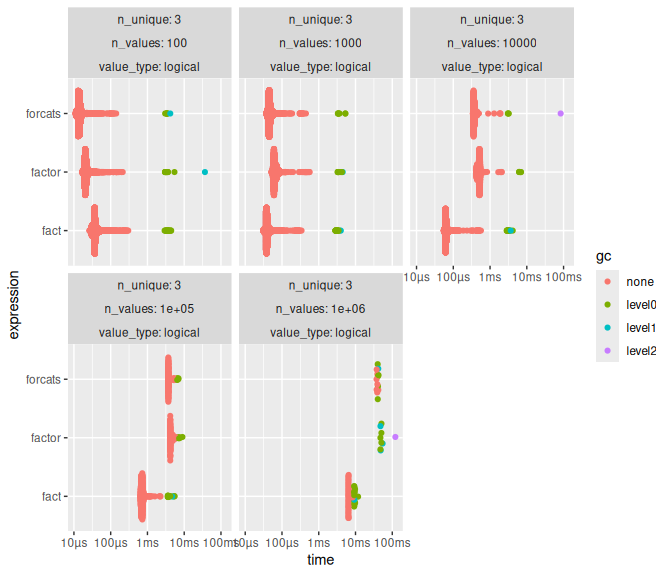

<!-- bench/bench.md is generated from bench/bench.Rmd. Please edit that file -->

``` r
fuj::require_namespace("bench")
fuj::require_namespace("stringi")
fuj::require_namespace("ggplot2")
fuj::require_namespace("ggbeeswarm")
fuj::require_namespace("gt")

library(facts)
library(forcats, include.only = "as_factor")

# assuming it's the same as numeric
as_factor.Date <- function(x, ...) {
  factor(x)
}

registerS3method("as_factor", "Date", as_factor.Date)
```

``` r
f_plot <- function(x) {
  x$expression <- as.character(x$expression)
  # x$median <- log1p(x$median)
  # x <- tidyr::unnest(x, c(time, gc))
  # x$n_unique <- factor(x$n_unique)
  # x$n_values <- factor(x$n_values)
  ggplot2::ggplot(
    x, 
    ggplot2::aes(
      x = .data[["n_values"]],
      y = .data[["median"]],
      col = .data[["expression"]],
      group = .data[["expression"]]
    )
  ) +
    ggplot2::geom_line() +
    ggplot2::geom_point() +
    ggplot2::scale_x_continuous(
      trans = "log1p",
      breaks = 10^(2:6)
    ) +
    ggplot2::scale_y_continuous(trans = "log1p") +
    ggplot2::coord_trans("log1p", "log1p") +
    ggplot2::theme_light() +
    ggplot2::theme(
      axis.text.x = ggplot2::element_text(angle = 45, hjust = 1)
    ) +
    ggplot2::facet_grid(
      cols = ggplot2::vars(n_unique),
      rows = ggplot2::vars(value_type),
      scales = "free"
    ) +
    ggplot2::labs(
      x = "number of values",
      y = "median time",
      col = "function",
      title = "Median times across types and unique values"
    )
}
```

## Benchmarks

### Logical

Logical vectors are by far speediest as `fact()` does not need to
retrieve unique values, instead using both `TRUE` and `FALSE` values by
default, and quickly looking for `NA` values.

``` r
res <- bench::press(
  n_unique = 3,
  n_values = 10^(2:6),
  value_type = "logical",
  {
    x <- sample(c(TRUE, FALSE, NA), n_values, TRUE)
    bench::mark(
      factor = factor(x),
      forcats = as_factor(x),
      fact = fact(x),
      check = FALSE
    )
  }
)
#> Running with:
#>   n_unique n_values value_type
#> 1        3      100 logical
#> 2        3     1000 logical
#> 3        3    10000 logical
#> 4        3   100000 logical
#> 5        3  1000000 logical
#> Warning: Some expressions had a GC in every iteration; so filtering is
#> disabled.
```

``` r
res[1:9] |> 
  transform(expression = sapply(expression, deparse1)) |> 
  gt::gt("expression", "value_type") |> 
  gt::tab_options(row.striping.include_table_body = TRUE)
```

<div id="yefdpjbgmo" style="padding-left:0px;padding-right:0px;padding-top:10px;padding-bottom:10px;overflow-x:auto;overflow-y:auto;width:auto;height:auto;">
<style>#yefdpjbgmo table {
  font-family: system-ui, 'Segoe UI', Roboto, Helvetica, Arial, sans-serif, 'Apple Color Emoji', 'Segoe UI Emoji', 'Segoe UI Symbol', 'Noto Color Emoji';
  -webkit-font-smoothing: antialiased;
  -moz-osx-font-smoothing: grayscale;
}
&#10;#yefdpjbgmo thead, #yefdpjbgmo tbody, #yefdpjbgmo tfoot, #yefdpjbgmo tr, #yefdpjbgmo td, #yefdpjbgmo th {
  border-style: none;
}
&#10;#yefdpjbgmo p {
  margin: 0;
  padding: 0;
}
&#10;#yefdpjbgmo .gt_table {
  display: table;
  border-collapse: collapse;
  line-height: normal;
  margin-left: auto;
  margin-right: auto;
  color: #333333;
  font-size: 16px;
  font-weight: normal;
  font-style: normal;
  background-color: #FFFFFF;
  width: auto;
  border-top-style: solid;
  border-top-width: 2px;
  border-top-color: #A8A8A8;
  border-right-style: none;
  border-right-width: 2px;
  border-right-color: #D3D3D3;
  border-bottom-style: solid;
  border-bottom-width: 2px;
  border-bottom-color: #A8A8A8;
  border-left-style: none;
  border-left-width: 2px;
  border-left-color: #D3D3D3;
}
&#10;#yefdpjbgmo .gt_caption {
  padding-top: 4px;
  padding-bottom: 4px;
}
&#10;#yefdpjbgmo .gt_title {
  color: #333333;
  font-size: 125%;
  font-weight: initial;
  padding-top: 4px;
  padding-bottom: 4px;
  padding-left: 5px;
  padding-right: 5px;
  border-bottom-color: #FFFFFF;
  border-bottom-width: 0;
}
&#10;#yefdpjbgmo .gt_subtitle {
  color: #333333;
  font-size: 85%;
  font-weight: initial;
  padding-top: 3px;
  padding-bottom: 5px;
  padding-left: 5px;
  padding-right: 5px;
  border-top-color: #FFFFFF;
  border-top-width: 0;
}
&#10;#yefdpjbgmo .gt_heading {
  background-color: #FFFFFF;
  text-align: center;
  border-bottom-color: #FFFFFF;
  border-left-style: none;
  border-left-width: 1px;
  border-left-color: #D3D3D3;
  border-right-style: none;
  border-right-width: 1px;
  border-right-color: #D3D3D3;
}
&#10;#yefdpjbgmo .gt_bottom_border {
  border-bottom-style: solid;
  border-bottom-width: 2px;
  border-bottom-color: #D3D3D3;
}
&#10;#yefdpjbgmo .gt_col_headings {
  border-top-style: solid;
  border-top-width: 2px;
  border-top-color: #D3D3D3;
  border-bottom-style: solid;
  border-bottom-width: 2px;
  border-bottom-color: #D3D3D3;
  border-left-style: none;
  border-left-width: 1px;
  border-left-color: #D3D3D3;
  border-right-style: none;
  border-right-width: 1px;
  border-right-color: #D3D3D3;
}
&#10;#yefdpjbgmo .gt_col_heading {
  color: #333333;
  background-color: #FFFFFF;
  font-size: 100%;
  font-weight: normal;
  text-transform: inherit;
  border-left-style: none;
  border-left-width: 1px;
  border-left-color: #D3D3D3;
  border-right-style: none;
  border-right-width: 1px;
  border-right-color: #D3D3D3;
  vertical-align: bottom;
  padding-top: 5px;
  padding-bottom: 6px;
  padding-left: 5px;
  padding-right: 5px;
  overflow-x: hidden;
}
&#10;#yefdpjbgmo .gt_column_spanner_outer {
  color: #333333;
  background-color: #FFFFFF;
  font-size: 100%;
  font-weight: normal;
  text-transform: inherit;
  padding-top: 0;
  padding-bottom: 0;
  padding-left: 4px;
  padding-right: 4px;
}
&#10;#yefdpjbgmo .gt_column_spanner_outer:first-child {
  padding-left: 0;
}
&#10;#yefdpjbgmo .gt_column_spanner_outer:last-child {
  padding-right: 0;
}
&#10;#yefdpjbgmo .gt_column_spanner {
  border-bottom-style: solid;
  border-bottom-width: 2px;
  border-bottom-color: #D3D3D3;
  vertical-align: bottom;
  padding-top: 5px;
  padding-bottom: 5px;
  overflow-x: hidden;
  display: inline-block;
  width: 100%;
}
&#10;#yefdpjbgmo .gt_spanner_row {
  border-bottom-style: hidden;
}
&#10;#yefdpjbgmo .gt_group_heading {
  padding-top: 8px;
  padding-bottom: 8px;
  padding-left: 5px;
  padding-right: 5px;
  color: #333333;
  background-color: #FFFFFF;
  font-size: 100%;
  font-weight: initial;
  text-transform: inherit;
  border-top-style: solid;
  border-top-width: 2px;
  border-top-color: #D3D3D3;
  border-bottom-style: solid;
  border-bottom-width: 2px;
  border-bottom-color: #D3D3D3;
  border-left-style: none;
  border-left-width: 1px;
  border-left-color: #D3D3D3;
  border-right-style: none;
  border-right-width: 1px;
  border-right-color: #D3D3D3;
  vertical-align: middle;
  text-align: left;
}
&#10;#yefdpjbgmo .gt_empty_group_heading {
  padding: 0.5px;
  color: #333333;
  background-color: #FFFFFF;
  font-size: 100%;
  font-weight: initial;
  border-top-style: solid;
  border-top-width: 2px;
  border-top-color: #D3D3D3;
  border-bottom-style: solid;
  border-bottom-width: 2px;
  border-bottom-color: #D3D3D3;
  vertical-align: middle;
}
&#10;#yefdpjbgmo .gt_from_md > :first-child {
  margin-top: 0;
}
&#10;#yefdpjbgmo .gt_from_md > :last-child {
  margin-bottom: 0;
}
&#10;#yefdpjbgmo .gt_row {
  padding-top: 8px;
  padding-bottom: 8px;
  padding-left: 5px;
  padding-right: 5px;
  margin: 10px;
  border-top-style: solid;
  border-top-width: 1px;
  border-top-color: #D3D3D3;
  border-left-style: none;
  border-left-width: 1px;
  border-left-color: #D3D3D3;
  border-right-style: none;
  border-right-width: 1px;
  border-right-color: #D3D3D3;
  vertical-align: middle;
  overflow-x: hidden;
}
&#10;#yefdpjbgmo .gt_stub {
  color: #333333;
  background-color: #FFFFFF;
  font-size: 100%;
  font-weight: initial;
  text-transform: inherit;
  border-right-style: solid;
  border-right-width: 2px;
  border-right-color: #D3D3D3;
  padding-left: 5px;
  padding-right: 5px;
}
&#10;#yefdpjbgmo .gt_stub_row_group {
  color: #333333;
  background-color: #FFFFFF;
  font-size: 100%;
  font-weight: initial;
  text-transform: inherit;
  border-right-style: solid;
  border-right-width: 2px;
  border-right-color: #D3D3D3;
  padding-left: 5px;
  padding-right: 5px;
  vertical-align: top;
}
&#10;#yefdpjbgmo .gt_row_group_first td {
  border-top-width: 2px;
}
&#10;#yefdpjbgmo .gt_row_group_first th {
  border-top-width: 2px;
}
&#10;#yefdpjbgmo .gt_summary_row {
  color: #333333;
  background-color: #FFFFFF;
  text-transform: inherit;
  padding-top: 8px;
  padding-bottom: 8px;
  padding-left: 5px;
  padding-right: 5px;
}
&#10;#yefdpjbgmo .gt_first_summary_row {
  border-top-style: solid;
  border-top-color: #D3D3D3;
}
&#10;#yefdpjbgmo .gt_first_summary_row.thick {
  border-top-width: 2px;
}
&#10;#yefdpjbgmo .gt_last_summary_row {
  padding-top: 8px;
  padding-bottom: 8px;
  padding-left: 5px;
  padding-right: 5px;
  border-bottom-style: solid;
  border-bottom-width: 2px;
  border-bottom-color: #D3D3D3;
}
&#10;#yefdpjbgmo .gt_grand_summary_row {
  color: #333333;
  background-color: #FFFFFF;
  text-transform: inherit;
  padding-top: 8px;
  padding-bottom: 8px;
  padding-left: 5px;
  padding-right: 5px;
}
&#10;#yefdpjbgmo .gt_first_grand_summary_row {
  padding-top: 8px;
  padding-bottom: 8px;
  padding-left: 5px;
  padding-right: 5px;
  border-top-style: double;
  border-top-width: 6px;
  border-top-color: #D3D3D3;
}
&#10;#yefdpjbgmo .gt_last_grand_summary_row_top {
  padding-top: 8px;
  padding-bottom: 8px;
  padding-left: 5px;
  padding-right: 5px;
  border-bottom-style: double;
  border-bottom-width: 6px;
  border-bottom-color: #D3D3D3;
}
&#10;#yefdpjbgmo .gt_striped {
  background-color: rgba(128, 128, 128, 0.05);
}
&#10;#yefdpjbgmo .gt_table_body {
  border-top-style: solid;
  border-top-width: 2px;
  border-top-color: #D3D3D3;
  border-bottom-style: solid;
  border-bottom-width: 2px;
  border-bottom-color: #D3D3D3;
}
&#10;#yefdpjbgmo .gt_footnotes {
  color: #333333;
  background-color: #FFFFFF;
  border-bottom-style: none;
  border-bottom-width: 2px;
  border-bottom-color: #D3D3D3;
  border-left-style: none;
  border-left-width: 2px;
  border-left-color: #D3D3D3;
  border-right-style: none;
  border-right-width: 2px;
  border-right-color: #D3D3D3;
}
&#10;#yefdpjbgmo .gt_footnote {
  margin: 0px;
  font-size: 90%;
  padding-top: 4px;
  padding-bottom: 4px;
  padding-left: 5px;
  padding-right: 5px;
}
&#10;#yefdpjbgmo .gt_sourcenotes {
  color: #333333;
  background-color: #FFFFFF;
  border-bottom-style: none;
  border-bottom-width: 2px;
  border-bottom-color: #D3D3D3;
  border-left-style: none;
  border-left-width: 2px;
  border-left-color: #D3D3D3;
  border-right-style: none;
  border-right-width: 2px;
  border-right-color: #D3D3D3;
}
&#10;#yefdpjbgmo .gt_sourcenote {
  font-size: 90%;
  padding-top: 4px;
  padding-bottom: 4px;
  padding-left: 5px;
  padding-right: 5px;
}
&#10;#yefdpjbgmo .gt_left {
  text-align: left;
}
&#10;#yefdpjbgmo .gt_center {
  text-align: center;
}
&#10;#yefdpjbgmo .gt_right {
  text-align: right;
  font-variant-numeric: tabular-nums;
}
&#10;#yefdpjbgmo .gt_font_normal {
  font-weight: normal;
}
&#10;#yefdpjbgmo .gt_font_bold {
  font-weight: bold;
}
&#10;#yefdpjbgmo .gt_font_italic {
  font-style: italic;
}
&#10;#yefdpjbgmo .gt_super {
  font-size: 65%;
}
&#10;#yefdpjbgmo .gt_footnote_marks {
  font-size: 75%;
  vertical-align: 0.4em;
  position: initial;
}
&#10;#yefdpjbgmo .gt_asterisk {
  font-size: 100%;
  vertical-align: 0;
}
&#10;#yefdpjbgmo .gt_indent_1 {
  text-indent: 5px;
}
&#10;#yefdpjbgmo .gt_indent_2 {
  text-indent: 10px;
}
&#10;#yefdpjbgmo .gt_indent_3 {
  text-indent: 15px;
}
&#10;#yefdpjbgmo .gt_indent_4 {
  text-indent: 20px;
}
&#10;#yefdpjbgmo .gt_indent_5 {
  text-indent: 25px;
}
&#10;#yefdpjbgmo .katex-display {
  display: inline-flex !important;
  margin-bottom: 0.75em !important;
}
&#10;#yefdpjbgmo div.Reactable > div.rt-table > div.rt-thead > div.rt-tr.rt-tr-group-header > div.rt-th-group:after {
  height: 0px !important;
}
</style>
<table class="gt_table" data-quarto-disable-processing="false" data-quarto-bootstrap="false">
  <thead>
    <tr class="gt_col_headings">
      <th class="gt_col_heading gt_columns_bottom_border gt_left" rowspan="1" colspan="1" scope="col" id="a::stub"></th>
      <th class="gt_col_heading gt_columns_bottom_border gt_right" rowspan="1" colspan="1" scope="col" id="n_unique">n_unique</th>
      <th class="gt_col_heading gt_columns_bottom_border gt_right" rowspan="1" colspan="1" scope="col" id="n_values">n_values</th>
      <th class="gt_col_heading gt_columns_bottom_border gt_center" rowspan="1" colspan="1" scope="col" id="min">min</th>
      <th class="gt_col_heading gt_columns_bottom_border gt_center" rowspan="1" colspan="1" scope="col" id="median">median</th>
      <th class="gt_col_heading gt_columns_bottom_border gt_right" rowspan="1" colspan="1" scope="col" id="itr/sec">itr/sec</th>
      <th class="gt_col_heading gt_columns_bottom_border gt_center" rowspan="1" colspan="1" scope="col" id="mem_alloc">mem_alloc</th>
      <th class="gt_col_heading gt_columns_bottom_border gt_right" rowspan="1" colspan="1" scope="col" id="gc/sec">gc/sec</th>
    </tr>
  </thead>
  <tbody class="gt_table_body">
    <tr class="gt_group_heading_row">
      <th colspan="8" class="gt_group_heading" scope="colgroup" id="logical">logical</th>
    </tr>
    <tr class="gt_row_group_first"><th id="stub_1_1" scope="row" class="gt_row gt_left gt_stub">factor(x)</th>
<td headers="logical stub_1_1 n_unique" class="gt_row gt_right">3</td>
<td headers="logical stub_1_1 n_values" class="gt_row gt_right">1e+02</td>
<td headers="logical stub_1_1 min" class="gt_row gt_center">16.62µs</td>
<td headers="logical stub_1_1 median" class="gt_row gt_center">21.37µs</td>
<td headers="logical stub_1_1 itr/sec" class="gt_row gt_right">43630.90829</td>
<td headers="logical stub_1_1 mem_alloc" class="gt_row gt_center">2.53KB</td>
<td headers="logical stub_1_1 gc/sec" class="gt_row gt_right">61.168908</td></tr>
    <tr><th id="stub_1_2" scope="row" class="gt_row gt_left gt_stub">as_factor(x)</th>
<td headers="logical stub_1_2 n_unique" class="gt_row gt_right gt_striped">3</td>
<td headers="logical stub_1_2 n_values" class="gt_row gt_right gt_striped">1e+02</td>
<td headers="logical stub_1_2 min" class="gt_row gt_center gt_striped">10.69µs</td>
<td headers="logical stub_1_2 median" class="gt_row gt_center gt_striped">14.25µs</td>
<td headers="logical stub_1_2 itr/sec" class="gt_row gt_right gt_striped">67950.93275</td>
<td headers="logical stub_1_2 mem_alloc" class="gt_row gt_center gt_striped">5.20KB</td>
<td headers="logical stub_1_2 gc/sec" class="gt_row gt_right gt_striped">54.404270</td></tr>
    <tr><th id="stub_1_3" scope="row" class="gt_row gt_left gt_stub">fact(x)</th>
<td headers="logical stub_1_3 n_unique" class="gt_row gt_right">3</td>
<td headers="logical stub_1_3 n_values" class="gt_row gt_right">1e+02</td>
<td headers="logical stub_1_3 min" class="gt_row gt_center">26.12µs</td>
<td headers="logical stub_1_3 median" class="gt_row gt_center">36.81µs</td>
<td headers="logical stub_1_3 itr/sec" class="gt_row gt_right">25055.05796</td>
<td headers="logical stub_1_3 mem_alloc" class="gt_row gt_center">98.04KB</td>
<td headers="logical stub_1_3 gc/sec" class="gt_row gt_right">50.210537</td></tr>
    <tr><th id="stub_1_4" scope="row" class="gt_row gt_left gt_stub">factor(x)</th>
<td headers="logical stub_1_4 n_unique" class="gt_row gt_right gt_striped">3</td>
<td headers="logical stub_1_4 n_values" class="gt_row gt_right gt_striped">1e+03</td>
<td headers="logical stub_1_4 min" class="gt_row gt_center gt_striped">51.05µs</td>
<td headers="logical stub_1_4 median" class="gt_row gt_center gt_striped">61.74µs</td>
<td headers="logical stub_1_4 itr/sec" class="gt_row gt_right gt_striped">15235.16443</td>
<td headers="logical stub_1_4 mem_alloc" class="gt_row gt_center gt_striped">23.62KB</td>
<td headers="logical stub_1_4 gc/sec" class="gt_row gt_right gt_striped">21.981192</td></tr>
    <tr><th id="stub_1_5" scope="row" class="gt_row gt_left gt_stub">as_factor(x)</th>
<td headers="logical stub_1_5 n_unique" class="gt_row gt_right">3</td>
<td headers="logical stub_1_5 n_values" class="gt_row gt_right">1e+03</td>
<td headers="logical stub_1_5 min" class="gt_row gt_center">36.81µs</td>
<td headers="logical stub_1_5 median" class="gt_row gt_center">45.12µs</td>
<td headers="logical stub_1_5 itr/sec" class="gt_row gt_right">20964.68771</td>
<td headers="logical stub_1_5 mem_alloc" class="gt_row gt_center">19.67KB</td>
<td headers="logical stub_1_5 gc/sec" class="gt_row gt_right">15.194949</td></tr>
    <tr><th id="stub_1_6" scope="row" class="gt_row gt_left gt_stub">fact(x)</th>
<td headers="logical stub_1_6 n_unique" class="gt_row gt_right gt_striped">3</td>
<td headers="logical stub_1_6 n_values" class="gt_row gt_right gt_striped">1e+03</td>
<td headers="logical stub_1_6 min" class="gt_row gt_center gt_striped">30.87µs</td>
<td headers="logical stub_1_6 median" class="gt_row gt_center gt_striped">39.18µs</td>
<td headers="logical stub_1_6 itr/sec" class="gt_row gt_right gt_striped">24254.95315</td>
<td headers="logical stub_1_6 mem_alloc" class="gt_row gt_center gt_striped">13.24KB</td>
<td headers="logical stub_1_6 gc/sec" class="gt_row gt_right gt_striped">51.042591</td></tr>
    <tr><th id="stub_1_7" scope="row" class="gt_row gt_left gt_stub">factor(x)</th>
<td headers="logical stub_1_7 n_unique" class="gt_row gt_right">3</td>
<td headers="logical stub_1_7 n_values" class="gt_row gt_right">1e+04</td>
<td headers="logical stub_1_7 min" class="gt_row gt_center">415.55µs</td>
<td headers="logical stub_1_7 median" class="gt_row gt_center">509.35µs</td>
<td headers="logical stub_1_7 itr/sec" class="gt_row gt_right">1955.92856</td>
<td headers="logical stub_1_7 mem_alloc" class="gt_row gt_center">234.56KB</td>
<td headers="logical stub_1_7 gc/sec" class="gt_row gt_right">8.458069</td></tr>
    <tr><th id="stub_1_8" scope="row" class="gt_row gt_left gt_stub">as_factor(x)</th>
<td headers="logical stub_1_8 n_unique" class="gt_row gt_right gt_striped">3</td>
<td headers="logical stub_1_8 n_values" class="gt_row gt_right gt_striped">1e+04</td>
<td headers="logical stub_1_8 min" class="gt_row gt_center gt_striped">341.94µs</td>
<td headers="logical stub_1_8 median" class="gt_row gt_center gt_striped">364.50µs</td>
<td headers="logical stub_1_8 itr/sec" class="gt_row gt_right gt_striped">2633.44041</td>
<td headers="logical stub_1_8 mem_alloc" class="gt_row gt_center gt_striped">195.45KB</td>
<td headers="logical stub_1_8 gc/sec" class="gt_row gt_right gt_striped">9.853846</td></tr>
    <tr><th id="stub_1_9" scope="row" class="gt_row gt_left gt_stub">fact(x)</th>
<td headers="logical stub_1_9 n_unique" class="gt_row gt_right">3</td>
<td headers="logical stub_1_9 n_values" class="gt_row gt_right">1e+04</td>
<td headers="logical stub_1_9 min" class="gt_row gt_center">54.62µs</td>
<td headers="logical stub_1_9 median" class="gt_row gt_center">62.93µs</td>
<td headers="logical stub_1_9 itr/sec" class="gt_row gt_right">15037.49170</td>
<td headers="logical stub_1_9 mem_alloc" class="gt_row gt_center">130.29KB</td>
<td headers="logical stub_1_9 gc/sec" class="gt_row gt_right">41.368615</td></tr>
    <tr><th id="stub_1_10" scope="row" class="gt_row gt_left gt_stub">factor(x)</th>
<td headers="logical stub_1_10 n_unique" class="gt_row gt_right gt_striped">3</td>
<td headers="logical stub_1_10 n_values" class="gt_row gt_right gt_striped">1e+05</td>
<td headers="logical stub_1_10 min" class="gt_row gt_center gt_striped">4.12ms</td>
<td headers="logical stub_1_10 median" class="gt_row gt_center gt_striped">4.20ms</td>
<td headers="logical stub_1_10 itr/sec" class="gt_row gt_right gt_striped">230.27236</td>
<td headers="logical stub_1_10 mem_alloc" class="gt_row gt_center gt_striped">2.29MB</td>
<td headers="logical stub_1_10 gc/sec" class="gt_row gt_right gt_striped">13.158421</td></tr>
    <tr><th id="stub_1_11" scope="row" class="gt_row gt_left gt_stub">as_factor(x)</th>
<td headers="logical stub_1_11 n_unique" class="gt_row gt_right">3</td>
<td headers="logical stub_1_11 n_values" class="gt_row gt_right">1e+05</td>
<td headers="logical stub_1_11 min" class="gt_row gt_center">3.64ms</td>
<td headers="logical stub_1_11 median" class="gt_row gt_center">3.72ms</td>
<td headers="logical stub_1_11 itr/sec" class="gt_row gt_right">262.61330</td>
<td headers="logical stub_1_11 mem_alloc" class="gt_row gt_center">1.91MB</td>
<td headers="logical stub_1_11 gc/sec" class="gt_row gt_right">13.022147</td></tr>
    <tr><th id="stub_1_12" scope="row" class="gt_row gt_left gt_stub">fact(x)</th>
<td headers="logical stub_1_12 n_unique" class="gt_row gt_right gt_striped">3</td>
<td headers="logical stub_1_12 n_values" class="gt_row gt_right gt_striped">1e+05</td>
<td headers="logical stub_1_12 min" class="gt_row gt_center gt_striped">638.76µs</td>
<td headers="logical stub_1_12 median" class="gt_row gt_center gt_striped">711.19µs</td>
<td headers="logical stub_1_12 itr/sec" class="gt_row gt_right gt_striped">1372.63764</td>
<td headers="logical stub_1_12 mem_alloc" class="gt_row gt_center gt_striped">1.27MB</td>
<td headers="logical stub_1_12 gc/sec" class="gt_row gt_right gt_striped">42.235004</td></tr>
    <tr><th id="stub_1_13" scope="row" class="gt_row gt_left gt_stub">factor(x)</th>
<td headers="logical stub_1_13 n_unique" class="gt_row gt_right">3</td>
<td headers="logical stub_1_13 n_values" class="gt_row gt_right">1e+06</td>
<td headers="logical stub_1_13 min" class="gt_row gt_center">47.60ms</td>
<td headers="logical stub_1_13 median" class="gt_row gt_center">50.60ms</td>
<td headers="logical stub_1_13 itr/sec" class="gt_row gt_right">17.32203</td>
<td headers="logical stub_1_13 mem_alloc" class="gt_row gt_center">22.89MB</td>
<td headers="logical stub_1_13 gc/sec" class="gt_row gt_right">19.246697</td></tr>
    <tr><th id="stub_1_14" scope="row" class="gt_row gt_left gt_stub">as_factor(x)</th>
<td headers="logical stub_1_14 n_unique" class="gt_row gt_right gt_striped">3</td>
<td headers="logical stub_1_14 n_values" class="gt_row gt_right gt_striped">1e+06</td>
<td headers="logical stub_1_14 min" class="gt_row gt_center gt_striped">37.31ms</td>
<td headers="logical stub_1_14 median" class="gt_row gt_center gt_striped">40.15ms</td>
<td headers="logical stub_1_14 itr/sec" class="gt_row gt_right gt_striped">25.10130</td>
<td headers="logical stub_1_14 mem_alloc" class="gt_row gt_center gt_striped">19.07MB</td>
<td headers="logical stub_1_14 gc/sec" class="gt_row gt_right gt_striped">11.585214</td></tr>
    <tr><th id="stub_1_15" scope="row" class="gt_row gt_left gt_stub">fact(x)</th>
<td headers="logical stub_1_15 n_unique" class="gt_row gt_right">3</td>
<td headers="logical stub_1_15 n_values" class="gt_row gt_right">1e+06</td>
<td headers="logical stub_1_15 min" class="gt_row gt_center">6.37ms</td>
<td headers="logical stub_1_15 median" class="gt_row gt_center">6.58ms</td>
<td headers="logical stub_1_15 itr/sec" class="gt_row gt_right">131.23879</td>
<td headers="logical stub_1_15 mem_alloc" class="gt_row gt_center">12.72MB</td>
<td headers="logical stub_1_15 gc/sec" class="gt_row gt_right">43.746265</td></tr>
  </tbody>
  &#10;  
</table>
</div>

``` r
f_plot(res)
```


``` r
ggplot2::autoplot(res)
```



## Other types

``` r
res <- bench::press(
  n_unique = 10^(1:4),
  n_values = 10^(2:6),
  value_type = c("character", "double", "integer", "date"),
  {
    x <- switch(
      value_type,
      character = stringi::stri_rand_strings(n_unique, 5),
      double = seq_len(n_unique) / n_unique,
      integer = seq_len(n_unique),
      date = Sys.Date() + seq_len(n_unique),
      stop("Unknown value typeL ", value_type)
    )
    x <- sample(x, n_values, TRUE)
    bench::mark(
      factor = factor(x),
      forcats = as_factor(x),
      fact = fact(x),
      check = FALSE
    )
  }
)
#> Running with:
#>    n_unique n_values value_type
#>  1       10      100 character
#>  2      100      100 character
#>  3     1000      100 character
#>  4    10000      100 character
#>  5       10     1000 character
#>  6      100     1000 character
#>  7     1000     1000 character
#>  8    10000     1000 character
#>  9       10    10000 character
#> 10      100    10000 character
#> 11     1000    10000 character
#> 12    10000    10000 character
#> 13       10   100000 character
#> 14      100   100000 character
#> 15     1000   100000 character
#> 16    10000   100000 character
#> 17       10  1000000 character
#> Warning: Some expressions had a GC in every iteration; so filtering is
#> disabled.
#> 18      100  1000000 character
#> Warning: Some expressions had a GC in every iteration; so filtering is
#> disabled.
#> 19     1000  1000000 character
#> Warning: Some expressions had a GC in every iteration; so filtering is
#> disabled.
#> 20    10000  1000000 character
#> Warning: Some expressions had a GC in every iteration; so filtering is
#> disabled.
#> 21       10      100 double
#> 22      100      100 double
#> 23     1000      100 double
#> 24    10000      100 double
#> 25       10     1000 double
#> 26      100     1000 double
#> 27     1000     1000 double
#> 28    10000     1000 double
#> 29       10    10000 double
#> 30      100    10000 double
#> 31     1000    10000 double
#> 32    10000    10000 double
#> 33       10   100000 double
#> 34      100   100000 double
#> 35     1000   100000 double
#> 36    10000   100000 double
#> 37       10  1000000 double
#> Warning: Some expressions had a GC in every iteration; so filtering is
#> disabled.
#> 38      100  1000000 double
#> 39     1000  1000000 double
#> Warning: Some expressions had a GC in every iteration; so filtering is
#> disabled.
#> 40    10000  1000000 double
#> 41       10      100 integer
#> 42      100      100 integer
#> 43     1000      100 integer
#> 44    10000      100 integer
#> 45       10     1000 integer
#> 46      100     1000 integer
#> 47     1000     1000 integer
#> 48    10000     1000 integer
#> 49       10    10000 integer
#> 50      100    10000 integer
#> 51     1000    10000 integer
#> 52    10000    10000 integer
#> 53       10   100000 integer
#> 54      100   100000 integer
#> 55     1000   100000 integer
#> 56    10000   100000 integer
#> 57       10  1000000 integer
#> 58      100  1000000 integer
#> 59     1000  1000000 integer
#> 60    10000  1000000 integer
#> 61       10      100 date
#> 62      100      100 date
#> 63     1000      100 date
#> 64    10000      100 date
#> 65       10     1000 date
#> 66      100     1000 date
#> 67     1000     1000 date
#> 68    10000     1000 date
#> 69       10    10000 date
#> 70      100    10000 date
#> 71     1000    10000 date
#> 72    10000    10000 date
#> 73       10   100000 date
#> 74      100   100000 date
#> 75     1000   100000 date
#> 76    10000   100000 date
#> 77       10  1000000 date
#> Warning: Some expressions had a GC in every iteration; so filtering is
#> disabled.
#> 78      100  1000000 date
#> Warning: Some expressions had a GC in every iteration; so filtering is
#> disabled.
#> 79     1000  1000000 date
#> Warning: Some expressions had a GC in every iteration; so filtering is
#> disabled.
#> 80    10000  1000000 date
#> Warning: Some expressions had a GC in every iteration; so filtering is
#> disabled.
```

``` r
res[1:9] |> 
  transform(expression = sapply(expression, deparse1)) |> 
  gt::gt("expression", "value_type") |> 
  gt::tab_options(row.striping.include_table_body = TRUE)
```

<div id="xsjfdrgqgq" style="padding-left:0px;padding-right:0px;padding-top:10px;padding-bottom:10px;overflow-x:auto;overflow-y:auto;width:auto;height:auto;">
<style>#xsjfdrgqgq table {
  font-family: system-ui, 'Segoe UI', Roboto, Helvetica, Arial, sans-serif, 'Apple Color Emoji', 'Segoe UI Emoji', 'Segoe UI Symbol', 'Noto Color Emoji';
  -webkit-font-smoothing: antialiased;
  -moz-osx-font-smoothing: grayscale;
}
&#10;#xsjfdrgqgq thead, #xsjfdrgqgq tbody, #xsjfdrgqgq tfoot, #xsjfdrgqgq tr, #xsjfdrgqgq td, #xsjfdrgqgq th {
  border-style: none;
}
&#10;#xsjfdrgqgq p {
  margin: 0;
  padding: 0;
}
&#10;#xsjfdrgqgq .gt_table {
  display: table;
  border-collapse: collapse;
  line-height: normal;
  margin-left: auto;
  margin-right: auto;
  color: #333333;
  font-size: 16px;
  font-weight: normal;
  font-style: normal;
  background-color: #FFFFFF;
  width: auto;
  border-top-style: solid;
  border-top-width: 2px;
  border-top-color: #A8A8A8;
  border-right-style: none;
  border-right-width: 2px;
  border-right-color: #D3D3D3;
  border-bottom-style: solid;
  border-bottom-width: 2px;
  border-bottom-color: #A8A8A8;
  border-left-style: none;
  border-left-width: 2px;
  border-left-color: #D3D3D3;
}
&#10;#xsjfdrgqgq .gt_caption {
  padding-top: 4px;
  padding-bottom: 4px;
}
&#10;#xsjfdrgqgq .gt_title {
  color: #333333;
  font-size: 125%;
  font-weight: initial;
  padding-top: 4px;
  padding-bottom: 4px;
  padding-left: 5px;
  padding-right: 5px;
  border-bottom-color: #FFFFFF;
  border-bottom-width: 0;
}
&#10;#xsjfdrgqgq .gt_subtitle {
  color: #333333;
  font-size: 85%;
  font-weight: initial;
  padding-top: 3px;
  padding-bottom: 5px;
  padding-left: 5px;
  padding-right: 5px;
  border-top-color: #FFFFFF;
  border-top-width: 0;
}
&#10;#xsjfdrgqgq .gt_heading {
  background-color: #FFFFFF;
  text-align: center;
  border-bottom-color: #FFFFFF;
  border-left-style: none;
  border-left-width: 1px;
  border-left-color: #D3D3D3;
  border-right-style: none;
  border-right-width: 1px;
  border-right-color: #D3D3D3;
}
&#10;#xsjfdrgqgq .gt_bottom_border {
  border-bottom-style: solid;
  border-bottom-width: 2px;
  border-bottom-color: #D3D3D3;
}
&#10;#xsjfdrgqgq .gt_col_headings {
  border-top-style: solid;
  border-top-width: 2px;
  border-top-color: #D3D3D3;
  border-bottom-style: solid;
  border-bottom-width: 2px;
  border-bottom-color: #D3D3D3;
  border-left-style: none;
  border-left-width: 1px;
  border-left-color: #D3D3D3;
  border-right-style: none;
  border-right-width: 1px;
  border-right-color: #D3D3D3;
}
&#10;#xsjfdrgqgq .gt_col_heading {
  color: #333333;
  background-color: #FFFFFF;
  font-size: 100%;
  font-weight: normal;
  text-transform: inherit;
  border-left-style: none;
  border-left-width: 1px;
  border-left-color: #D3D3D3;
  border-right-style: none;
  border-right-width: 1px;
  border-right-color: #D3D3D3;
  vertical-align: bottom;
  padding-top: 5px;
  padding-bottom: 6px;
  padding-left: 5px;
  padding-right: 5px;
  overflow-x: hidden;
}
&#10;#xsjfdrgqgq .gt_column_spanner_outer {
  color: #333333;
  background-color: #FFFFFF;
  font-size: 100%;
  font-weight: normal;
  text-transform: inherit;
  padding-top: 0;
  padding-bottom: 0;
  padding-left: 4px;
  padding-right: 4px;
}
&#10;#xsjfdrgqgq .gt_column_spanner_outer:first-child {
  padding-left: 0;
}
&#10;#xsjfdrgqgq .gt_column_spanner_outer:last-child {
  padding-right: 0;
}
&#10;#xsjfdrgqgq .gt_column_spanner {
  border-bottom-style: solid;
  border-bottom-width: 2px;
  border-bottom-color: #D3D3D3;
  vertical-align: bottom;
  padding-top: 5px;
  padding-bottom: 5px;
  overflow-x: hidden;
  display: inline-block;
  width: 100%;
}
&#10;#xsjfdrgqgq .gt_spanner_row {
  border-bottom-style: hidden;
}
&#10;#xsjfdrgqgq .gt_group_heading {
  padding-top: 8px;
  padding-bottom: 8px;
  padding-left: 5px;
  padding-right: 5px;
  color: #333333;
  background-color: #FFFFFF;
  font-size: 100%;
  font-weight: initial;
  text-transform: inherit;
  border-top-style: solid;
  border-top-width: 2px;
  border-top-color: #D3D3D3;
  border-bottom-style: solid;
  border-bottom-width: 2px;
  border-bottom-color: #D3D3D3;
  border-left-style: none;
  border-left-width: 1px;
  border-left-color: #D3D3D3;
  border-right-style: none;
  border-right-width: 1px;
  border-right-color: #D3D3D3;
  vertical-align: middle;
  text-align: left;
}
&#10;#xsjfdrgqgq .gt_empty_group_heading {
  padding: 0.5px;
  color: #333333;
  background-color: #FFFFFF;
  font-size: 100%;
  font-weight: initial;
  border-top-style: solid;
  border-top-width: 2px;
  border-top-color: #D3D3D3;
  border-bottom-style: solid;
  border-bottom-width: 2px;
  border-bottom-color: #D3D3D3;
  vertical-align: middle;
}
&#10;#xsjfdrgqgq .gt_from_md > :first-child {
  margin-top: 0;
}
&#10;#xsjfdrgqgq .gt_from_md > :last-child {
  margin-bottom: 0;
}
&#10;#xsjfdrgqgq .gt_row {
  padding-top: 8px;
  padding-bottom: 8px;
  padding-left: 5px;
  padding-right: 5px;
  margin: 10px;
  border-top-style: solid;
  border-top-width: 1px;
  border-top-color: #D3D3D3;
  border-left-style: none;
  border-left-width: 1px;
  border-left-color: #D3D3D3;
  border-right-style: none;
  border-right-width: 1px;
  border-right-color: #D3D3D3;
  vertical-align: middle;
  overflow-x: hidden;
}
&#10;#xsjfdrgqgq .gt_stub {
  color: #333333;
  background-color: #FFFFFF;
  font-size: 100%;
  font-weight: initial;
  text-transform: inherit;
  border-right-style: solid;
  border-right-width: 2px;
  border-right-color: #D3D3D3;
  padding-left: 5px;
  padding-right: 5px;
}
&#10;#xsjfdrgqgq .gt_stub_row_group {
  color: #333333;
  background-color: #FFFFFF;
  font-size: 100%;
  font-weight: initial;
  text-transform: inherit;
  border-right-style: solid;
  border-right-width: 2px;
  border-right-color: #D3D3D3;
  padding-left: 5px;
  padding-right: 5px;
  vertical-align: top;
}
&#10;#xsjfdrgqgq .gt_row_group_first td {
  border-top-width: 2px;
}
&#10;#xsjfdrgqgq .gt_row_group_first th {
  border-top-width: 2px;
}
&#10;#xsjfdrgqgq .gt_summary_row {
  color: #333333;
  background-color: #FFFFFF;
  text-transform: inherit;
  padding-top: 8px;
  padding-bottom: 8px;
  padding-left: 5px;
  padding-right: 5px;
}
&#10;#xsjfdrgqgq .gt_first_summary_row {
  border-top-style: solid;
  border-top-color: #D3D3D3;
}
&#10;#xsjfdrgqgq .gt_first_summary_row.thick {
  border-top-width: 2px;
}
&#10;#xsjfdrgqgq .gt_last_summary_row {
  padding-top: 8px;
  padding-bottom: 8px;
  padding-left: 5px;
  padding-right: 5px;
  border-bottom-style: solid;
  border-bottom-width: 2px;
  border-bottom-color: #D3D3D3;
}
&#10;#xsjfdrgqgq .gt_grand_summary_row {
  color: #333333;
  background-color: #FFFFFF;
  text-transform: inherit;
  padding-top: 8px;
  padding-bottom: 8px;
  padding-left: 5px;
  padding-right: 5px;
}
&#10;#xsjfdrgqgq .gt_first_grand_summary_row {
  padding-top: 8px;
  padding-bottom: 8px;
  padding-left: 5px;
  padding-right: 5px;
  border-top-style: double;
  border-top-width: 6px;
  border-top-color: #D3D3D3;
}
&#10;#xsjfdrgqgq .gt_last_grand_summary_row_top {
  padding-top: 8px;
  padding-bottom: 8px;
  padding-left: 5px;
  padding-right: 5px;
  border-bottom-style: double;
  border-bottom-width: 6px;
  border-bottom-color: #D3D3D3;
}
&#10;#xsjfdrgqgq .gt_striped {
  background-color: rgba(128, 128, 128, 0.05);
}
&#10;#xsjfdrgqgq .gt_table_body {
  border-top-style: solid;
  border-top-width: 2px;
  border-top-color: #D3D3D3;
  border-bottom-style: solid;
  border-bottom-width: 2px;
  border-bottom-color: #D3D3D3;
}
&#10;#xsjfdrgqgq .gt_footnotes {
  color: #333333;
  background-color: #FFFFFF;
  border-bottom-style: none;
  border-bottom-width: 2px;
  border-bottom-color: #D3D3D3;
  border-left-style: none;
  border-left-width: 2px;
  border-left-color: #D3D3D3;
  border-right-style: none;
  border-right-width: 2px;
  border-right-color: #D3D3D3;
}
&#10;#xsjfdrgqgq .gt_footnote {
  margin: 0px;
  font-size: 90%;
  padding-top: 4px;
  padding-bottom: 4px;
  padding-left: 5px;
  padding-right: 5px;
}
&#10;#xsjfdrgqgq .gt_sourcenotes {
  color: #333333;
  background-color: #FFFFFF;
  border-bottom-style: none;
  border-bottom-width: 2px;
  border-bottom-color: #D3D3D3;
  border-left-style: none;
  border-left-width: 2px;
  border-left-color: #D3D3D3;
  border-right-style: none;
  border-right-width: 2px;
  border-right-color: #D3D3D3;
}
&#10;#xsjfdrgqgq .gt_sourcenote {
  font-size: 90%;
  padding-top: 4px;
  padding-bottom: 4px;
  padding-left: 5px;
  padding-right: 5px;
}
&#10;#xsjfdrgqgq .gt_left {
  text-align: left;
}
&#10;#xsjfdrgqgq .gt_center {
  text-align: center;
}
&#10;#xsjfdrgqgq .gt_right {
  text-align: right;
  font-variant-numeric: tabular-nums;
}
&#10;#xsjfdrgqgq .gt_font_normal {
  font-weight: normal;
}
&#10;#xsjfdrgqgq .gt_font_bold {
  font-weight: bold;
}
&#10;#xsjfdrgqgq .gt_font_italic {
  font-style: italic;
}
&#10;#xsjfdrgqgq .gt_super {
  font-size: 65%;
}
&#10;#xsjfdrgqgq .gt_footnote_marks {
  font-size: 75%;
  vertical-align: 0.4em;
  position: initial;
}
&#10;#xsjfdrgqgq .gt_asterisk {
  font-size: 100%;
  vertical-align: 0;
}
&#10;#xsjfdrgqgq .gt_indent_1 {
  text-indent: 5px;
}
&#10;#xsjfdrgqgq .gt_indent_2 {
  text-indent: 10px;
}
&#10;#xsjfdrgqgq .gt_indent_3 {
  text-indent: 15px;
}
&#10;#xsjfdrgqgq .gt_indent_4 {
  text-indent: 20px;
}
&#10;#xsjfdrgqgq .gt_indent_5 {
  text-indent: 25px;
}
&#10;#xsjfdrgqgq .katex-display {
  display: inline-flex !important;
  margin-bottom: 0.75em !important;
}
&#10;#xsjfdrgqgq div.Reactable > div.rt-table > div.rt-thead > div.rt-tr.rt-tr-group-header > div.rt-th-group:after {
  height: 0px !important;
}
</style>
<table class="gt_table" data-quarto-disable-processing="false" data-quarto-bootstrap="false">
  <thead>
    <tr class="gt_col_headings">
      <th class="gt_col_heading gt_columns_bottom_border gt_left" rowspan="1" colspan="1" scope="col" id="a::stub"></th>
      <th class="gt_col_heading gt_columns_bottom_border gt_right" rowspan="1" colspan="1" scope="col" id="n_unique">n_unique</th>
      <th class="gt_col_heading gt_columns_bottom_border gt_right" rowspan="1" colspan="1" scope="col" id="n_values">n_values</th>
      <th class="gt_col_heading gt_columns_bottom_border gt_center" rowspan="1" colspan="1" scope="col" id="min">min</th>
      <th class="gt_col_heading gt_columns_bottom_border gt_center" rowspan="1" colspan="1" scope="col" id="median">median</th>
      <th class="gt_col_heading gt_columns_bottom_border gt_right" rowspan="1" colspan="1" scope="col" id="itr/sec">itr/sec</th>
      <th class="gt_col_heading gt_columns_bottom_border gt_center" rowspan="1" colspan="1" scope="col" id="mem_alloc">mem_alloc</th>
      <th class="gt_col_heading gt_columns_bottom_border gt_right" rowspan="1" colspan="1" scope="col" id="gc/sec">gc/sec</th>
    </tr>
  </thead>
  <tbody class="gt_table_body">
    <tr class="gt_group_heading_row">
      <th colspan="8" class="gt_group_heading" scope="colgroup" id="character">character</th>
    </tr>
    <tr class="gt_row_group_first"><th id="stub_1_1" scope="row" class="gt_row gt_left gt_stub">factor(x)</th>
<td headers="character stub_1_1 n_unique" class="gt_row gt_right">10</td>
<td headers="character stub_1_1 n_values" class="gt_row gt_right">1e+02</td>
<td headers="character stub_1_1 min" class="gt_row gt_center">15.44µs</td>
<td headers="character stub_1_1 median" class="gt_row gt_center">19.00µs</td>
<td headers="character stub_1_1 itr/sec" class="gt_row gt_right">48211.507493</td>
<td headers="character stub_1_1 mem_alloc" class="gt_row gt_center">2.75KB</td>
<td headers="character stub_1_1 gc/sec" class="gt_row gt_right">24.117813</td></tr>
    <tr><th id="stub_1_2" scope="row" class="gt_row gt_left gt_stub">as_factor(x)</th>
<td headers="character stub_1_2 n_unique" class="gt_row gt_right gt_striped">10</td>
<td headers="character stub_1_2 n_values" class="gt_row gt_right gt_striped">1e+02</td>
<td headers="character stub_1_2 min" class="gt_row gt_center gt_striped">60.55µs</td>
<td headers="character stub_1_2 median" class="gt_row gt_center gt_striped">70.05µs</td>
<td headers="character stub_1_2 itr/sec" class="gt_row gt_right gt_striped">13235.217512</td>
<td headers="character stub_1_2 mem_alloc" class="gt_row gt_center gt_striped">70.34KB</td>
<td headers="character stub_1_2 gc/sec" class="gt_row gt_right gt_striped">22.150992</td></tr>
    <tr><th id="stub_1_3" scope="row" class="gt_row gt_left gt_stub">fact(x)</th>
<td headers="character stub_1_3 n_unique" class="gt_row gt_right">10</td>
<td headers="character stub_1_3 n_values" class="gt_row gt_right">1e+02</td>
<td headers="character stub_1_3 min" class="gt_row gt_center">61.74µs</td>
<td headers="character stub_1_3 median" class="gt_row gt_center">71.24µs</td>
<td headers="character stub_1_3 itr/sec" class="gt_row gt_right">13026.638433</td>
<td headers="character stub_1_3 mem_alloc" class="gt_row gt_center">75.69KB</td>
<td headers="character stub_1_3 gc/sec" class="gt_row gt_right">19.562781</td></tr>
    <tr><th id="stub_1_4" scope="row" class="gt_row gt_left gt_stub">factor(x)</th>
<td headers="character stub_1_4 n_unique" class="gt_row gt_right gt_striped">100</td>
<td headers="character stub_1_4 n_values" class="gt_row gt_right gt_striped">1e+02</td>
<td headers="character stub_1_4 min" class="gt_row gt_center gt_striped">37.99µs</td>
<td headers="character stub_1_4 median" class="gt_row gt_center gt_striped">45.12µs</td>
<td headers="character stub_1_4 itr/sec" class="gt_row gt_right gt_striped">21505.990421</td>
<td headers="character stub_1_4 mem_alloc" class="gt_row gt_center gt_striped">9.46KB</td>
<td headers="character stub_1_4 gc/sec" class="gt_row gt_right gt_striped">10.980287</td></tr>
    <tr><th id="stub_1_5" scope="row" class="gt_row gt_left gt_stub">as_factor(x)</th>
<td headers="character stub_1_5 n_unique" class="gt_row gt_right">100</td>
<td headers="character stub_1_5 n_values" class="gt_row gt_right">1e+02</td>
<td headers="character stub_1_5 min" class="gt_row gt_center">87.86µs</td>
<td headers="character stub_1_5 median" class="gt_row gt_center">102.11µs</td>
<td headers="character stub_1_5 itr/sec" class="gt_row gt_right">9268.019539</td>
<td headers="character stub_1_5 mem_alloc" class="gt_row gt_center">26.53KB</td>
<td headers="character stub_1_5 gc/sec" class="gt_row gt_right">15.666780</td></tr>
    <tr><th id="stub_1_6" scope="row" class="gt_row gt_left gt_stub">fact(x)</th>
<td headers="character stub_1_6 n_unique" class="gt_row gt_right gt_striped">100</td>
<td headers="character stub_1_6 n_values" class="gt_row gt_right gt_striped">1e+02</td>
<td headers="character stub_1_6 min" class="gt_row gt_center gt_striped">74.80µs</td>
<td headers="character stub_1_6 median" class="gt_row gt_center gt_striped">89.05µs</td>
<td headers="character stub_1_6 itr/sec" class="gt_row gt_right gt_striped">10654.391182</td>
<td headers="character stub_1_6 mem_alloc" class="gt_row gt_center gt_striped">6.07KB</td>
<td headers="character stub_1_6 gc/sec" class="gt_row gt_right gt_striped">15.124871</td></tr>
    <tr><th id="stub_1_7" scope="row" class="gt_row gt_left gt_stub">factor(x)</th>
<td headers="character stub_1_7 n_unique" class="gt_row gt_right">1000</td>
<td headers="character stub_1_7 n_values" class="gt_row gt_right">1e+02</td>
<td headers="character stub_1_7 min" class="gt_row gt_center">55.80µs</td>
<td headers="character stub_1_7 median" class="gt_row gt_center">62.93µs</td>
<td headers="character stub_1_7 itr/sec" class="gt_row gt_right">15135.945138</td>
<td headers="character stub_1_7 mem_alloc" class="gt_row gt_center">13.30KB</td>
<td headers="character stub_1_7 gc/sec" class="gt_row gt_right">8.575606</td></tr>
    <tr><th id="stub_1_8" scope="row" class="gt_row gt_left gt_stub">as_factor(x)</th>
<td headers="character stub_1_8 n_unique" class="gt_row gt_right gt_striped">1000</td>
<td headers="character stub_1_8 n_values" class="gt_row gt_right gt_striped">1e+02</td>
<td headers="character stub_1_8 min" class="gt_row gt_center gt_striped">104.48µs</td>
<td headers="character stub_1_8 median" class="gt_row gt_center gt_striped">121.11µs</td>
<td headers="character stub_1_8 itr/sec" class="gt_row gt_right gt_striped">7804.807451</td>
<td headers="character stub_1_8 mem_alloc" class="gt_row gt_center gt_striped">37.42KB</td>
<td headers="character stub_1_8 gc/sec" class="gt_row gt_right gt_striped">13.322573</td></tr>
    <tr><th id="stub_1_9" scope="row" class="gt_row gt_left gt_stub">fact(x)</th>
<td headers="character stub_1_9 n_unique" class="gt_row gt_right">1000</td>
<td headers="character stub_1_9 n_values" class="gt_row gt_right">1e+02</td>
<td headers="character stub_1_9 min" class="gt_row gt_center">81.92µs</td>
<td headers="character stub_1_9 median" class="gt_row gt_center">97.36µs</td>
<td headers="character stub_1_9 itr/sec" class="gt_row gt_right">9743.773791</td>
<td headers="character stub_1_9 mem_alloc" class="gt_row gt_center">7.98KB</td>
<td headers="character stub_1_9 gc/sec" class="gt_row gt_right">15.167093</td></tr>
    <tr><th id="stub_1_10" scope="row" class="gt_row gt_left gt_stub">factor(x)</th>
<td headers="character stub_1_10 n_unique" class="gt_row gt_right gt_striped">10000</td>
<td headers="character stub_1_10 n_values" class="gt_row gt_right gt_striped">1e+02</td>
<td headers="character stub_1_10 min" class="gt_row gt_center gt_striped">52.24µs</td>
<td headers="character stub_1_10 median" class="gt_row gt_center gt_striped">60.55µs</td>
<td headers="character stub_1_10 itr/sec" class="gt_row gt_right gt_striped">15936.041589</td>
<td headers="character stub_1_10 mem_alloc" class="gt_row gt_center gt_striped">13.49KB</td>
<td headers="character stub_1_10 gc/sec" class="gt_row gt_right gt_striped">8.690411</td></tr>
    <tr><th id="stub_1_11" scope="row" class="gt_row gt_left gt_stub">as_factor(x)</th>
<td headers="character stub_1_11 n_unique" class="gt_row gt_right">10000</td>
<td headers="character stub_1_11 n_values" class="gt_row gt_right">1e+02</td>
<td headers="character stub_1_11 min" class="gt_row gt_center">105.67µs</td>
<td headers="character stub_1_11 median" class="gt_row gt_center">122.29µs</td>
<td headers="character stub_1_11 itr/sec" class="gt_row gt_right">7500.942749</td>
<td headers="character stub_1_11 mem_alloc" class="gt_row gt_center">37.92KB</td>
<td headers="character stub_1_11 gc/sec" class="gt_row gt_right">10.889870</td></tr>
    <tr><th id="stub_1_12" scope="row" class="gt_row gt_left gt_stub">fact(x)</th>
<td headers="character stub_1_12 n_unique" class="gt_row gt_right gt_striped">10000</td>
<td headers="character stub_1_12 n_values" class="gt_row gt_right gt_striped">1e+02</td>
<td headers="character stub_1_12 min" class="gt_row gt_center gt_striped">83.11µs</td>
<td headers="character stub_1_12 median" class="gt_row gt_center gt_striped">98.55µs</td>
<td headers="character stub_1_12 itr/sec" class="gt_row gt_right gt_striped">9608.503945</td>
<td headers="character stub_1_12 mem_alloc" class="gt_row gt_center gt_striped">8.12KB</td>
<td headers="character stub_1_12 gc/sec" class="gt_row gt_right gt_striped">15.248136</td></tr>
    <tr><th id="stub_1_13" scope="row" class="gt_row gt_left gt_stub">factor(x)</th>
<td headers="character stub_1_13 n_unique" class="gt_row gt_right">10</td>
<td headers="character stub_1_13 n_values" class="gt_row gt_right">1e+03</td>
<td headers="character stub_1_13 min" class="gt_row gt_center">27.31µs</td>
<td headers="character stub_1_13 median" class="gt_row gt_center">36.81µs</td>
<td headers="character stub_1_13 itr/sec" class="gt_row gt_right">26885.783993</td>
<td headers="character stub_1_13 mem_alloc" class="gt_row gt_center">23.81KB</td>
<td headers="character stub_1_13 gc/sec" class="gt_row gt_right">26.912697</td></tr>
    <tr><th id="stub_1_14" scope="row" class="gt_row gt_left gt_stub">as_factor(x)</th>
<td headers="character stub_1_14 n_unique" class="gt_row gt_right gt_striped">10</td>
<td headers="character stub_1_14 n_values" class="gt_row gt_right gt_striped">1e+03</td>
<td headers="character stub_1_14 min" class="gt_row gt_center gt_striped">85.48µs</td>
<td headers="character stub_1_14 median" class="gt_row gt_center gt_striped">102.11µs</td>
<td headers="character stub_1_14 itr/sec" class="gt_row gt_right gt_striped">9248.679655</td>
<td headers="character stub_1_14 mem_alloc" class="gt_row gt_center gt_striped">59.60KB</td>
<td headers="character stub_1_14 gc/sec" class="gt_row gt_right gt_striped">22.086399</td></tr>
    <tr><th id="stub_1_15" scope="row" class="gt_row gt_left gt_stub">fact(x)</th>
<td headers="character stub_1_15 n_unique" class="gt_row gt_right">10</td>
<td headers="character stub_1_15 n_values" class="gt_row gt_right">1e+03</td>
<td headers="character stub_1_15 min" class="gt_row gt_center">73.61µs</td>
<td headers="character stub_1_15 median" class="gt_row gt_center">86.67µs</td>
<td headers="character stub_1_15 itr/sec" class="gt_row gt_right">11028.922352</td>
<td headers="character stub_1_15 mem_alloc" class="gt_row gt_center">20.09KB</td>
<td headers="character stub_1_15 gc/sec" class="gt_row gt_right">17.296879</td></tr>
    <tr><th id="stub_1_16" scope="row" class="gt_row gt_left gt_stub">factor(x)</th>
<td headers="character stub_1_16 n_unique" class="gt_row gt_right gt_striped">100</td>
<td headers="character stub_1_16 n_values" class="gt_row gt_right gt_striped">1e+03</td>
<td headers="character stub_1_16 min" class="gt_row gt_center gt_striped">60.55µs</td>
<td headers="character stub_1_16 median" class="gt_row gt_center gt_striped">68.86µs</td>
<td headers="character stub_1_16 itr/sec" class="gt_row gt_right gt_striped">14024.058406</td>
<td headers="character stub_1_16 mem_alloc" class="gt_row gt_center gt_striped">34.55KB</td>
<td headers="character stub_1_16 gc/sec" class="gt_row gt_right gt_striped">8.593173</td></tr>
    <tr><th id="stub_1_17" scope="row" class="gt_row gt_left gt_stub">as_factor(x)</th>
<td headers="character stub_1_17 n_unique" class="gt_row gt_right">100</td>
<td headers="character stub_1_17 n_values" class="gt_row gt_right">1e+03</td>
<td headers="character stub_1_17 min" class="gt_row gt_center">128.23µs</td>
<td headers="character stub_1_17 median" class="gt_row gt_center">143.66µs</td>
<td headers="character stub_1_17 itr/sec" class="gt_row gt_right">6713.700444</td>
<td headers="character stub_1_17 mem_alloc" class="gt_row gt_center">90.62KB</td>
<td headers="character stub_1_17 gc/sec" class="gt_row gt_right">13.125514</td></tr>
    <tr><th id="stub_1_18" scope="row" class="gt_row gt_left gt_stub">fact(x)</th>
<td headers="character stub_1_18 n_unique" class="gt_row gt_right gt_striped">100</td>
<td headers="character stub_1_18 n_values" class="gt_row gt_right gt_striped">1e+03</td>
<td headers="character stub_1_18 min" class="gt_row gt_center gt_striped">96.17µs</td>
<td headers="character stub_1_18 median" class="gt_row gt_center gt_striped">111.61µs</td>
<td headers="character stub_1_18 itr/sec" class="gt_row gt_right gt_striped">8538.174701</td>
<td headers="character stub_1_18 mem_alloc" class="gt_row gt_center gt_striped">25.66KB</td>
<td headers="character stub_1_18 gc/sec" class="gt_row gt_right gt_striped">12.887811</td></tr>
    <tr><th id="stub_1_19" scope="row" class="gt_row gt_left gt_stub">factor(x)</th>
<td headers="character stub_1_19 n_unique" class="gt_row gt_right">1000</td>
<td headers="character stub_1_19 n_values" class="gt_row gt_right">1e+03</td>
<td headers="character stub_1_19 min" class="gt_row gt_center">501.04µs</td>
<td headers="character stub_1_19 median" class="gt_row gt_center">521.22µs</td>
<td headers="character stub_1_19 itr/sec" class="gt_row gt_right">1874.130004</td>
<td headers="character stub_1_19 mem_alloc" class="gt_row gt_center">92.06KB</td>
<td headers="character stub_1_19 gc/sec" class="gt_row gt_right">2.026086</td></tr>
    <tr><th id="stub_1_20" scope="row" class="gt_row gt_left gt_stub">as_factor(x)</th>
<td headers="character stub_1_20 n_unique" class="gt_row gt_right gt_striped">1000</td>
<td headers="character stub_1_20 n_values" class="gt_row gt_right gt_striped">1e+03</td>
<td headers="character stub_1_20 min" class="gt_row gt_center gt_striped">610.27µs</td>
<td headers="character stub_1_20 median" class="gt_row gt_center gt_striped">644.70µs</td>
<td headers="character stub_1_20 itr/sec" class="gt_row gt_right gt_striped">1509.573957</td>
<td headers="character stub_1_20 mem_alloc" class="gt_row gt_center gt_striped">260.04KB</td>
<td headers="character stub_1_20 gc/sec" class="gt_row gt_right gt_striped">8.351723</td></tr>
    <tr><th id="stub_1_21" scope="row" class="gt_row gt_left gt_stub">fact(x)</th>
<td headers="character stub_1_21 n_unique" class="gt_row gt_right">1000</td>
<td headers="character stub_1_21 n_values" class="gt_row gt_right">1e+03</td>
<td headers="character stub_1_21 min" class="gt_row gt_center">235.08µs</td>
<td headers="character stub_1_21 median" class="gt_row gt_center">255.27µs</td>
<td headers="character stub_1_21 itr/sec" class="gt_row gt_right">3756.298693</td>
<td headers="character stub_1_21 mem_alloc" class="gt_row gt_center">54.96KB</td>
<td headers="character stub_1_21 gc/sec" class="gt_row gt_right">6.198513</td></tr>
    <tr><th id="stub_1_22" scope="row" class="gt_row gt_left gt_stub">factor(x)</th>
<td headers="character stub_1_22 n_unique" class="gt_row gt_right gt_striped">10000</td>
<td headers="character stub_1_22 n_values" class="gt_row gt_right gt_striped">1e+03</td>
<td headers="character stub_1_22 min" class="gt_row gt_center gt_striped">793.11µs</td>
<td headers="character stub_1_22 median" class="gt_row gt_center gt_striped">823.98µs</td>
<td headers="character stub_1_22 itr/sec" class="gt_row gt_right gt_striped">1189.668361</td>
<td headers="character stub_1_22 mem_alloc" class="gt_row gt_center gt_striped">115.55KB</td>
<td headers="character stub_1_22 gc/sec" class="gt_row gt_right gt_striped">4.088207</td></tr>
    <tr><th id="stub_1_23" scope="row" class="gt_row gt_left gt_stub">as_factor(x)</th>
<td headers="character stub_1_23 n_unique" class="gt_row gt_right">10000</td>
<td headers="character stub_1_23 n_values" class="gt_row gt_right">1e+03</td>
<td headers="character stub_1_23 min" class="gt_row gt_center">949.84µs</td>
<td headers="character stub_1_23 median" class="gt_row gt_center">986.64µs</td>
<td headers="character stub_1_23 itr/sec" class="gt_row gt_right">963.692290</td>
<td headers="character stub_1_23 mem_alloc" class="gt_row gt_center">323.97KB</td>
<td headers="character stub_1_23 gc/sec" class="gt_row gt_right">6.204028</td></tr>
    <tr><th id="stub_1_24" scope="row" class="gt_row gt_left gt_stub">fact(x)</th>
<td headers="character stub_1_24 n_unique" class="gt_row gt_right gt_striped">10000</td>
<td headers="character stub_1_24 n_values" class="gt_row gt_right gt_striped">1e+03</td>
<td headers="character stub_1_24 min" class="gt_row gt_center gt_striped">326.51µs</td>
<td headers="character stub_1_24 median" class="gt_row gt_center gt_striped">349.06µs</td>
<td headers="character stub_1_24 itr/sec" class="gt_row gt_right gt_striped">2761.777258</td>
<td headers="character stub_1_24 mem_alloc" class="gt_row gt_center gt_striped">69.31KB</td>
<td headers="character stub_1_24 gc/sec" class="gt_row gt_right gt_striped">4.091522</td></tr>
    <tr><th id="stub_1_25" scope="row" class="gt_row gt_left gt_stub">factor(x)</th>
<td headers="character stub_1_25 n_unique" class="gt_row gt_right">10</td>
<td headers="character stub_1_25 n_values" class="gt_row gt_right">1e+04</td>
<td headers="character stub_1_25 min" class="gt_row gt_center">146.04µs</td>
<td headers="character stub_1_25 median" class="gt_row gt_center">162.66µs</td>
<td headers="character stub_1_25 itr/sec" class="gt_row gt_right">5942.083755</td>
<td headers="character stub_1_25 mem_alloc" class="gt_row gt_center">284.44KB</td>
<td headers="character stub_1_25 gc/sec" class="gt_row gt_right">36.736221</td></tr>
    <tr><th id="stub_1_26" scope="row" class="gt_row gt_left gt_stub">as_factor(x)</th>
<td headers="character stub_1_26 n_unique" class="gt_row gt_right gt_striped">10</td>
<td headers="character stub_1_26 n_values" class="gt_row gt_right gt_striped">1e+04</td>
<td headers="character stub_1_26 min" class="gt_row gt_center gt_striped">347.88µs</td>
<td headers="character stub_1_26 median" class="gt_row gt_center gt_striped">378.75µs</td>
<td headers="character stub_1_26 itr/sec" class="gt_row gt_right gt_striped">2559.689818</td>
<td headers="character stub_1_26 mem_alloc" class="gt_row gt_center gt_striped">636.63KB</td>
<td headers="character stub_1_26 gc/sec" class="gt_row gt_right gt_striped">34.312196</td></tr>
    <tr><th id="stub_1_27" scope="row" class="gt_row gt_left gt_stub">fact(x)</th>
<td headers="character stub_1_27 n_unique" class="gt_row gt_right">10</td>
<td headers="character stub_1_27 n_values" class="gt_row gt_right">1e+04</td>
<td headers="character stub_1_27 min" class="gt_row gt_center">226.77µs</td>
<td headers="character stub_1_27 median" class="gt_row gt_center">268.33µs</td>
<td headers="character stub_1_27 itr/sec" class="gt_row gt_right">3545.589046</td>
<td headers="character stub_1_27 mem_alloc" class="gt_row gt_center">245.56KB</td>
<td headers="character stub_1_27 gc/sec" class="gt_row gt_right">19.517004</td></tr>
    <tr><th id="stub_1_28" scope="row" class="gt_row gt_left gt_stub">factor(x)</th>
<td headers="character stub_1_28 n_unique" class="gt_row gt_right gt_striped">100</td>
<td headers="character stub_1_28 n_values" class="gt_row gt_right gt_striped">1e+04</td>
<td headers="character stub_1_28 min" class="gt_row gt_center gt_striped">180.47µs</td>
<td headers="character stub_1_28 median" class="gt_row gt_center gt_striped">197.09µs</td>
<td headers="character stub_1_28 itr/sec" class="gt_row gt_right gt_striped">4925.061779</td>
<td headers="character stub_1_28 mem_alloc" class="gt_row gt_center gt_striped">295.18KB</td>
<td headers="character stub_1_28 gc/sec" class="gt_row gt_right gt_striped">31.936482</td></tr>
    <tr><th id="stub_1_29" scope="row" class="gt_row gt_left gt_stub">as_factor(x)</th>
<td headers="character stub_1_29 n_unique" class="gt_row gt_right">100</td>
<td headers="character stub_1_29 n_values" class="gt_row gt_right">1e+04</td>
<td headers="character stub_1_29 min" class="gt_row gt_center">390.62µs</td>
<td headers="character stub_1_29 median" class="gt_row gt_center">425.05µs</td>
<td headers="character stub_1_29 itr/sec" class="gt_row gt_right">2290.720214</td>
<td headers="character stub_1_29 mem_alloc" class="gt_row gt_center">667.66KB</td>
<td headers="character stub_1_29 gc/sec" class="gt_row gt_right">34.884064</td></tr>
    <tr><th id="stub_1_30" scope="row" class="gt_row gt_left gt_stub">fact(x)</th>
<td headers="character stub_1_30 n_unique" class="gt_row gt_right gt_striped">100</td>
<td headers="character stub_1_30 n_values" class="gt_row gt_right gt_striped">1e+04</td>
<td headers="character stub_1_30 min" class="gt_row gt_center gt_striped">251.71µs</td>
<td headers="character stub_1_30 median" class="gt_row gt_center gt_striped">282.58µs</td>
<td headers="character stub_1_30 itr/sec" class="gt_row gt_right gt_striped">3359.491620</td>
<td headers="character stub_1_30 mem_alloc" class="gt_row gt_center gt_striped">251.13KB</td>
<td headers="character stub_1_30 gc/sec" class="gt_row gt_right gt_striped">17.162154</td></tr>
    <tr><th id="stub_1_31" scope="row" class="gt_row gt_left gt_stub">factor(x)</th>
<td headers="character stub_1_31 n_unique" class="gt_row gt_right">1000</td>
<td headers="character stub_1_31 n_values" class="gt_row gt_right">1e+04</td>
<td headers="character stub_1_31 min" class="gt_row gt_center">1.07ms</td>
<td headers="character stub_1_31 median" class="gt_row gt_center">1.09ms</td>
<td headers="character stub_1_31 itr/sec" class="gt_row gt_right">894.475373</td>
<td headers="character stub_1_31 mem_alloc" class="gt_row gt_center">379.46KB</td>
<td headers="character stub_1_31 gc/sec" class="gt_row gt_right">8.320701</td></tr>
    <tr><th id="stub_1_32" scope="row" class="gt_row gt_left gt_stub">as_factor(x)</th>
<td headers="character stub_1_32 n_unique" class="gt_row gt_right gt_striped">1000</td>
<td headers="character stub_1_32 n_values" class="gt_row gt_right gt_striped">1e+04</td>
<td headers="character stub_1_32 min" class="gt_row gt_center gt_striped">1.40ms</td>
<td headers="character stub_1_32 median" class="gt_row gt_center gt_striped">1.44ms</td>
<td headers="character stub_1_32 itr/sec" class="gt_row gt_right gt_striped">683.142436</td>
<td headers="character stub_1_32 mem_alloc" class="gt_row gt_center gt_striped">909.92KB</td>
<td headers="character stub_1_32 gc/sec" class="gt_row gt_right gt_striped">13.342626</td></tr>
    <tr><th id="stub_1_33" scope="row" class="gt_row gt_left gt_stub">fact(x)</th>
<td headers="character stub_1_33 n_unique" class="gt_row gt_right">1000</td>
<td headers="character stub_1_33 n_values" class="gt_row gt_right">1e+04</td>
<td headers="character stub_1_33 min" class="gt_row gt_center">514.10µs</td>
<td headers="character stub_1_33 median" class="gt_row gt_center">548.53µs</td>
<td headers="character stub_1_33 itr/sec" class="gt_row gt_right">1777.396323</td>
<td headers="character stub_1_33 mem_alloc" class="gt_row gt_center">296.81KB</td>
<td headers="character stub_1_33 gc/sec" class="gt_row gt_right">12.620566</td></tr>
    <tr><th id="stub_1_34" scope="row" class="gt_row gt_left gt_stub">factor(x)</th>
<td headers="character stub_1_34 n_unique" class="gt_row gt_right gt_striped">10000</td>
<td headers="character stub_1_34 n_values" class="gt_row gt_right gt_striped">1e+04</td>
<td headers="character stub_1_34 min" class="gt_row gt_center gt_striped">8.16ms</td>
<td headers="character stub_1_34 median" class="gt_row gt_center gt_striped">8.25ms</td>
<td headers="character stub_1_34 itr/sec" class="gt_row gt_right gt_striped">118.232656</td>
<td headers="character stub_1_34 mem_alloc" class="gt_row gt_center gt_striped">923.63KB</td>
<td headers="character stub_1_34 gc/sec" class="gt_row gt_right gt_striped">2.038494</td></tr>
    <tr><th id="stub_1_35" scope="row" class="gt_row gt_left gt_stub">as_factor(x)</th>
<td headers="character stub_1_35 n_unique" class="gt_row gt_right">10000</td>
<td headers="character stub_1_35 n_values" class="gt_row gt_right">1e+04</td>
<td headers="character stub_1_35 min" class="gt_row gt_center">9.26ms</td>
<td headers="character stub_1_35 median" class="gt_row gt_center">9.41ms</td>
<td headers="character stub_1_35 itr/sec" class="gt_row gt_right">104.090408</td>
<td headers="character stub_1_35 mem_alloc" class="gt_row gt_center">2.44MB</td>
<td headers="character stub_1_35 gc/sec" class="gt_row gt_right">6.372882</td></tr>
    <tr><th id="stub_1_36" scope="row" class="gt_row gt_left gt_stub">fact(x)</th>
<td headers="character stub_1_36 n_unique" class="gt_row gt_right gt_striped">10000</td>
<td headers="character stub_1_36 n_values" class="gt_row gt_right gt_striped">1e+04</td>
<td headers="character stub_1_36 min" class="gt_row gt_center gt_striped">2.02ms</td>
<td headers="character stub_1_36 median" class="gt_row gt_center gt_striped">2.11ms</td>
<td headers="character stub_1_36 itr/sec" class="gt_row gt_right gt_striped">456.601145</td>
<td headers="character stub_1_36 mem_alloc" class="gt_row gt_center gt_striped">582.69KB</td>
<td headers="character stub_1_36 gc/sec" class="gt_row gt_right gt_striped">6.226379</td></tr>
    <tr><th id="stub_1_37" scope="row" class="gt_row gt_left gt_stub">factor(x)</th>
<td headers="character stub_1_37 n_unique" class="gt_row gt_right">10</td>
<td headers="character stub_1_37 n_values" class="gt_row gt_right">1e+05</td>
<td headers="character stub_1_37 min" class="gt_row gt_center">1.63ms</td>
<td headers="character stub_1_37 median" class="gt_row gt_center">1.69ms</td>
<td headers="character stub_1_37 itr/sec" class="gt_row gt_right">576.555671</td>
<td headers="character stub_1_37 mem_alloc" class="gt_row gt_center">2.53MB</td>
<td headers="character stub_1_37 gc/sec" class="gt_row gt_right">35.589856</td></tr>
    <tr><th id="stub_1_38" scope="row" class="gt_row gt_left gt_stub">as_factor(x)</th>
<td headers="character stub_1_38 n_unique" class="gt_row gt_right gt_striped">10</td>
<td headers="character stub_1_38 n_values" class="gt_row gt_right gt_striped">1e+05</td>
<td headers="character stub_1_38 min" class="gt_row gt_center gt_striped">3.46ms</td>
<td headers="character stub_1_38 median" class="gt_row gt_center gt_striped">3.54ms</td>
<td headers="character stub_1_38 itr/sec" class="gt_row gt_right gt_striped">276.251530</td>
<td headers="character stub_1_38 mem_alloc" class="gt_row gt_center gt_striped">5.96MB</td>
<td headers="character stub_1_38 gc/sec" class="gt_row gt_right gt_striped">48.276966</td></tr>
    <tr><th id="stub_1_39" scope="row" class="gt_row gt_left gt_stub">fact(x)</th>
<td headers="character stub_1_39 n_unique" class="gt_row gt_right">10</td>
<td headers="character stub_1_39 n_values" class="gt_row gt_right">1e+05</td>
<td headers="character stub_1_39 min" class="gt_row gt_center">1.82ms</td>
<td headers="character stub_1_39 median" class="gt_row gt_center">1.87ms</td>
<td headers="character stub_1_39 itr/sec" class="gt_row gt_right">517.562513</td>
<td headers="character stub_1_39 mem_alloc" class="gt_row gt_center">2.15MB</td>
<td headers="character stub_1_39 gc/sec" class="gt_row gt_right">30.171806</td></tr>
    <tr><th id="stub_1_40" scope="row" class="gt_row gt_left gt_stub">factor(x)</th>
<td headers="character stub_1_40 n_unique" class="gt_row gt_right gt_striped">100</td>
<td headers="character stub_1_40 n_values" class="gt_row gt_right gt_striped">1e+05</td>
<td headers="character stub_1_40 min" class="gt_row gt_center gt_striped">1.35ms</td>
<td headers="character stub_1_40 median" class="gt_row gt_center gt_striped">1.38ms</td>
<td headers="character stub_1_40 itr/sec" class="gt_row gt_right gt_striped">699.972121</td>
<td headers="character stub_1_40 mem_alloc" class="gt_row gt_center gt_striped">2.54MB</td>
<td headers="character stub_1_40 gc/sec" class="gt_row gt_right gt_striped">43.596880</td></tr>
    <tr><th id="stub_1_41" scope="row" class="gt_row gt_left gt_stub">as_factor(x)</th>
<td headers="character stub_1_41 n_unique" class="gt_row gt_right">100</td>
<td headers="character stub_1_41 n_values" class="gt_row gt_right">1e+05</td>
<td headers="character stub_1_41 min" class="gt_row gt_center">2.98ms</td>
<td headers="character stub_1_41 median" class="gt_row gt_center">3.10ms</td>
<td headers="character stub_1_41 itr/sec" class="gt_row gt_right">312.183222</td>
<td headers="character stub_1_41 mem_alloc" class="gt_row gt_center">5.99MB</td>
<td headers="character stub_1_41 gc/sec" class="gt_row gt_right">61.874152</td></tr>
    <tr><th id="stub_1_42" scope="row" class="gt_row gt_left gt_stub">fact(x)</th>
<td headers="character stub_1_42 n_unique" class="gt_row gt_right gt_striped">100</td>
<td headers="character stub_1_42 n_values" class="gt_row gt_right gt_striped">1e+05</td>
<td headers="character stub_1_42 min" class="gt_row gt_center gt_striped">1.89ms</td>
<td headers="character stub_1_42 median" class="gt_row gt_center gt_striped">1.96ms</td>
<td headers="character stub_1_42 itr/sec" class="gt_row gt_right gt_striped">493.234547</td>
<td headers="character stub_1_42 mem_alloc" class="gt_row gt_center gt_striped">2.15MB</td>
<td headers="character stub_1_42 gc/sec" class="gt_row gt_right gt_striped">30.388858</td></tr>
    <tr><th id="stub_1_43" scope="row" class="gt_row gt_left gt_stub">factor(x)</th>
<td headers="character stub_1_43 n_unique" class="gt_row gt_right">1000</td>
<td headers="character stub_1_43 n_values" class="gt_row gt_right">1e+05</td>
<td headers="character stub_1_43 min" class="gt_row gt_center">2.42ms</td>
<td headers="character stub_1_43 median" class="gt_row gt_center">2.49ms</td>
<td headers="character stub_1_43 itr/sec" class="gt_row gt_right">393.982377</td>
<td headers="character stub_1_43 mem_alloc" class="gt_row gt_center">2.62MB</td>
<td headers="character stub_1_43 gc/sec" class="gt_row gt_right">32.011068</td></tr>
    <tr><th id="stub_1_44" scope="row" class="gt_row gt_left gt_stub">as_factor(x)</th>
<td headers="character stub_1_44 n_unique" class="gt_row gt_right gt_striped">1000</td>
<td headers="character stub_1_44 n_values" class="gt_row gt_right gt_striped">1e+05</td>
<td headers="character stub_1_44 min" class="gt_row gt_center gt_striped">4.38ms</td>
<td headers="character stub_1_44 median" class="gt_row gt_center gt_striped">4.51ms</td>
<td headers="character stub_1_44 itr/sec" class="gt_row gt_right gt_striped">216.686646</td>
<td headers="character stub_1_44 mem_alloc" class="gt_row gt_center gt_striped">6.23MB</td>
<td headers="character stub_1_44 gc/sec" class="gt_row gt_right gt_striped">38.694044</td></tr>
    <tr><th id="stub_1_45" scope="row" class="gt_row gt_left gt_stub">fact(x)</th>
<td headers="character stub_1_45 n_unique" class="gt_row gt_right">1000</td>
<td headers="character stub_1_45 n_values" class="gt_row gt_right">1e+05</td>
<td headers="character stub_1_45 min" class="gt_row gt_center">2.26ms</td>
<td headers="character stub_1_45 median" class="gt_row gt_center">2.34ms</td>
<td headers="character stub_1_45 itr/sec" class="gt_row gt_right">415.148984</td>
<td headers="character stub_1_45 mem_alloc" class="gt_row gt_center">2.19MB</td>
<td headers="character stub_1_45 gc/sec" class="gt_row gt_right">25.091422</td></tr>
    <tr><th id="stub_1_46" scope="row" class="gt_row gt_left gt_stub">factor(x)</th>
<td headers="character stub_1_46 n_unique" class="gt_row gt_right gt_striped">10000</td>
<td headers="character stub_1_46 n_values" class="gt_row gt_right gt_striped">1e+05</td>
<td headers="character stub_1_46 min" class="gt_row gt_center gt_striped">15.78ms</td>
<td headers="character stub_1_46 median" class="gt_row gt_center gt_striped">16.04ms</td>
<td headers="character stub_1_46 itr/sec" class="gt_row gt_right gt_striped">61.156910</td>
<td headers="character stub_1_46 mem_alloc" class="gt_row gt_center gt_striped">3.59MB</td>
<td headers="character stub_1_46 gc/sec" class="gt_row gt_right gt_striped">6.795212</td></tr>
    <tr><th id="stub_1_47" scope="row" class="gt_row gt_left gt_stub">as_factor(x)</th>
<td headers="character stub_1_47 n_unique" class="gt_row gt_right">10000</td>
<td headers="character stub_1_47 n_values" class="gt_row gt_right">1e+05</td>
<td headers="character stub_1_47 min" class="gt_row gt_center">20.61ms</td>
<td headers="character stub_1_47 median" class="gt_row gt_center">21.75ms</td>
<td headers="character stub_1_47 itr/sec" class="gt_row gt_right">45.888524</td>
<td headers="character stub_1_47 mem_alloc" class="gt_row gt_center">9.08MB</td>
<td headers="character stub_1_47 gc/sec" class="gt_row gt_right">12.746812</td></tr>
    <tr><th id="stub_1_48" scope="row" class="gt_row gt_left gt_stub">fact(x)</th>
<td headers="character stub_1_48 n_unique" class="gt_row gt_right gt_striped">10000</td>
<td headers="character stub_1_48 n_values" class="gt_row gt_right gt_striped">1e+05</td>
<td headers="character stub_1_48 min" class="gt_row gt_center gt_striped">4.88ms</td>
<td headers="character stub_1_48 median" class="gt_row gt_center gt_striped">5.07ms</td>
<td headers="character stub_1_48 itr/sec" class="gt_row gt_right gt_striped">188.498667</td>
<td headers="character stub_1_48 mem_alloc" class="gt_row gt_center gt_striped">2.69MB</td>
<td headers="character stub_1_48 gc/sec" class="gt_row gt_right gt_striped">15.897478</td></tr>
    <tr><th id="stub_1_49" scope="row" class="gt_row gt_left gt_stub">factor(x)</th>
<td headers="character stub_1_49 n_unique" class="gt_row gt_right">10</td>
<td headers="character stub_1_49 n_values" class="gt_row gt_right">1e+06</td>
<td headers="character stub_1_49 min" class="gt_row gt_center">12.45ms</td>
<td headers="character stub_1_49 median" class="gt_row gt_center">15.07ms</td>
<td headers="character stub_1_49 itr/sec" class="gt_row gt_right">52.996679</td>
<td headers="character stub_1_49 mem_alloc" class="gt_row gt_center">23.26MB</td>
<td headers="character stub_1_49 gc/sec" class="gt_row gt_right">39.256799</td></tr>
    <tr><th id="stub_1_50" scope="row" class="gt_row gt_left gt_stub">as_factor(x)</th>
<td headers="character stub_1_50 n_unique" class="gt_row gt_right gt_striped">10</td>
<td headers="character stub_1_50 n_values" class="gt_row gt_right gt_striped">1e+06</td>
<td headers="character stub_1_50 min" class="gt_row gt_center gt_striped">35.86ms</td>
<td headers="character stub_1_50 median" class="gt_row gt_center gt_striped">39.84ms</td>
<td headers="character stub_1_50 itr/sec" class="gt_row gt_right gt_striped">20.477137</td>
<td headers="character stub_1_50 mem_alloc" class="gt_row gt_center gt_striped">57.59MB</td>
<td headers="character stub_1_50 gc/sec" class="gt_row gt_right gt_striped">39.092716</td></tr>
    <tr><th id="stub_1_51" scope="row" class="gt_row gt_left gt_stub">fact(x)</th>
<td headers="character stub_1_51 n_unique" class="gt_row gt_right">10</td>
<td headers="character stub_1_51 n_values" class="gt_row gt_right">1e+06</td>
<td headers="character stub_1_51 min" class="gt_row gt_center">15.19ms</td>
<td headers="character stub_1_51 median" class="gt_row gt_center">21.11ms</td>
<td headers="character stub_1_51 itr/sec" class="gt_row gt_right">38.695615</td>
<td headers="character stub_1_51 mem_alloc" class="gt_row gt_center">19.44MB</td>
<td headers="character stub_1_51 gc/sec" class="gt_row gt_right">19.347808</td></tr>
    <tr><th id="stub_1_52" scope="row" class="gt_row gt_left gt_stub">factor(x)</th>
<td headers="character stub_1_52 n_unique" class="gt_row gt_right gt_striped">100</td>
<td headers="character stub_1_52 n_values" class="gt_row gt_right gt_striped">1e+06</td>
<td headers="character stub_1_52 min" class="gt_row gt_center gt_striped">14.03ms</td>
<td headers="character stub_1_52 median" class="gt_row gt_center gt_striped">17.04ms</td>
<td headers="character stub_1_52 itr/sec" class="gt_row gt_right gt_striped">55.486193</td>
<td headers="character stub_1_52 mem_alloc" class="gt_row gt_center gt_striped">23.27MB</td>
<td headers="character stub_1_52 gc/sec" class="gt_row gt_right gt_striped">49.541244</td></tr>
    <tr><th id="stub_1_53" scope="row" class="gt_row gt_left gt_stub">as_factor(x)</th>
<td headers="character stub_1_53 n_unique" class="gt_row gt_right">100</td>
<td headers="character stub_1_53 n_values" class="gt_row gt_right">1e+06</td>
<td headers="character stub_1_53 min" class="gt_row gt_center">33.28ms</td>
<td headers="character stub_1_53 median" class="gt_row gt_center">38.97ms</td>
<td headers="character stub_1_53 itr/sec" class="gt_row gt_right">19.901766</td>
<td headers="character stub_1_53 mem_alloc" class="gt_row gt_center">57.62MB</td>
<td headers="character stub_1_53 gc/sec" class="gt_row gt_right">37.813356</td></tr>
    <tr><th id="stub_1_54" scope="row" class="gt_row gt_left gt_stub">fact(x)</th>
<td headers="character stub_1_54 n_unique" class="gt_row gt_right gt_striped">100</td>
<td headers="character stub_1_54 n_values" class="gt_row gt_right gt_striped">1e+06</td>
<td headers="character stub_1_54 min" class="gt_row gt_center gt_striped">18.13ms</td>
<td headers="character stub_1_54 median" class="gt_row gt_center gt_striped">20.89ms</td>
<td headers="character stub_1_54 itr/sec" class="gt_row gt_right gt_striped">49.673543</td>
<td headers="character stub_1_54 mem_alloc" class="gt_row gt_center gt_striped">19.45MB</td>
<td headers="character stub_1_54 gc/sec" class="gt_row gt_right gt_striped">25.830242</td></tr>
    <tr><th id="stub_1_55" scope="row" class="gt_row gt_left gt_stub">factor(x)</th>
<td headers="character stub_1_55 n_unique" class="gt_row gt_right">1000</td>
<td headers="character stub_1_55 n_values" class="gt_row gt_right">1e+06</td>
<td headers="character stub_1_55 min" class="gt_row gt_center">19.49ms</td>
<td headers="character stub_1_55 median" class="gt_row gt_center">19.75ms</td>
<td headers="character stub_1_55 itr/sec" class="gt_row gt_right">40.809521</td>
<td headers="character stub_1_55 mem_alloc" class="gt_row gt_center">23.35MB</td>
<td headers="character stub_1_55 gc/sec" class="gt_row gt_right">40.809521</td></tr>
    <tr><th id="stub_1_56" scope="row" class="gt_row gt_left gt_stub">as_factor(x)</th>
<td headers="character stub_1_56 n_unique" class="gt_row gt_right gt_striped">1000</td>
<td headers="character stub_1_56 n_values" class="gt_row gt_right gt_striped">1e+06</td>
<td headers="character stub_1_56 min" class="gt_row gt_center gt_striped">39.63ms</td>
<td headers="character stub_1_56 median" class="gt_row gt_center gt_striped">45.41ms</td>
<td headers="character stub_1_56 itr/sec" class="gt_row gt_right gt_striped">22.508738</td>
<td headers="character stub_1_56 mem_alloc" class="gt_row gt_center gt_striped">57.86MB</td>
<td headers="character stub_1_56 gc/sec" class="gt_row gt_right gt_striped">43.141747</td></tr>
    <tr><th id="stub_1_57" scope="row" class="gt_row gt_left gt_stub">fact(x)</th>
<td headers="character stub_1_57 n_unique" class="gt_row gt_right">1000</td>
<td headers="character stub_1_57 n_values" class="gt_row gt_right">1e+06</td>
<td headers="character stub_1_57 min" class="gt_row gt_center">22.27ms</td>
<td headers="character stub_1_57 median" class="gt_row gt_center">27.81ms</td>
<td headers="character stub_1_57 itr/sec" class="gt_row gt_right">29.152836</td>
<td headers="character stub_1_57 mem_alloc" class="gt_row gt_center">19.49MB</td>
<td headers="character stub_1_57 gc/sec" class="gt_row gt_right">15.548179</td></tr>
    <tr><th id="stub_1_58" scope="row" class="gt_row gt_left gt_stub">factor(x)</th>
<td headers="character stub_1_58 n_unique" class="gt_row gt_right gt_striped">10000</td>
<td headers="character stub_1_58 n_values" class="gt_row gt_right gt_striped">1e+06</td>
<td headers="character stub_1_58 min" class="gt_row gt_center gt_striped">39.41ms</td>
<td headers="character stub_1_58 median" class="gt_row gt_center gt_striped">44.34ms</td>
<td headers="character stub_1_58 itr/sec" class="gt_row gt_right gt_striped">22.632985</td>
<td headers="character stub_1_58 mem_alloc" class="gt_row gt_center gt_striped">24.32MB</td>
<td headers="character stub_1_58 gc/sec" class="gt_row gt_right gt_striped">15.088656</td></tr>
    <tr><th id="stub_1_59" scope="row" class="gt_row gt_left gt_stub">as_factor(x)</th>
<td headers="character stub_1_59 n_unique" class="gt_row gt_right">10000</td>
<td headers="character stub_1_59 n_values" class="gt_row gt_right">1e+06</td>
<td headers="character stub_1_59 min" class="gt_row gt_center">78.48ms</td>
<td headers="character stub_1_59 median" class="gt_row gt_center">91.02ms</td>
<td headers="character stub_1_59 itr/sec" class="gt_row gt_right">11.209309</td>
<td headers="character stub_1_59 mem_alloc" class="gt_row gt_center">60.71MB</td>
<td headers="character stub_1_59 gc/sec" class="gt_row gt_right">22.418619</td></tr>
    <tr><th id="stub_1_60" scope="row" class="gt_row gt_left gt_stub">fact(x)</th>
<td headers="character stub_1_60 n_unique" class="gt_row gt_right gt_striped">10000</td>
<td headers="character stub_1_60 n_values" class="gt_row gt_right gt_striped">1e+06</td>
<td headers="character stub_1_60 min" class="gt_row gt_center gt_striped">23.93ms</td>
<td headers="character stub_1_60 median" class="gt_row gt_center gt_striped">28.16ms</td>
<td headers="character stub_1_60 itr/sec" class="gt_row gt_right gt_striped">27.707698</td>
<td headers="character stub_1_60 mem_alloc" class="gt_row gt_center gt_striped">19.99MB</td>
<td headers="character stub_1_60 gc/sec" class="gt_row gt_right gt_striped">19.791213</td></tr>
    <tr class="gt_group_heading_row">
      <th colspan="8" class="gt_group_heading" scope="colgroup" id="double">double</th>
    </tr>
    <tr class="gt_row_group_first"><th id="stub_1_61" scope="row" class="gt_row gt_left gt_stub">factor(x)</th>
<td headers="double stub_1_61 n_unique" class="gt_row gt_right">10</td>
<td headers="double stub_1_61 n_values" class="gt_row gt_right">1e+02</td>
<td headers="double stub_1_61 min" class="gt_row gt_center">46.30µs</td>
<td headers="double stub_1_61 median" class="gt_row gt_center">53.43µs</td>
<td headers="double stub_1_61 itr/sec" class="gt_row gt_right">18166.502402</td>
<td headers="double stub_1_61 mem_alloc" class="gt_row gt_center">3.58KB</td>
<td headers="double stub_1_61 gc/sec" class="gt_row gt_right">8.531879</td></tr>
    <tr><th id="stub_1_62" scope="row" class="gt_row gt_left gt_stub">as_factor(x)</th>
<td headers="double stub_1_62 n_unique" class="gt_row gt_right gt_striped">10</td>
<td headers="double stub_1_62 n_values" class="gt_row gt_right gt_striped">1e+02</td>
<td headers="double stub_1_62 min" class="gt_row gt_center gt_striped">53.43µs</td>
<td headers="double stub_1_62 median" class="gt_row gt_center gt_striped">60.55µs</td>
<td headers="double stub_1_62 itr/sec" class="gt_row gt_right gt_striped">15638.809357</td>
<td headers="double stub_1_62 mem_alloc" class="gt_row gt_center gt_striped">5.99KB</td>
<td headers="double stub_1_62 gc/sec" class="gt_row gt_right gt_striped">10.650238</td></tr>
    <tr><th id="stub_1_63" scope="row" class="gt_row gt_left gt_stub">fact(x)</th>
<td headers="double stub_1_63 n_unique" class="gt_row gt_right">10</td>
<td headers="double stub_1_63 n_values" class="gt_row gt_right">1e+02</td>
<td headers="double stub_1_63 min" class="gt_row gt_center">55.80µs</td>
<td headers="double stub_1_63 median" class="gt_row gt_center">65.30µs</td>
<td headers="double stub_1_63 itr/sec" class="gt_row gt_right">14503.620858</td>
<td headers="double stub_1_63 mem_alloc" class="gt_row gt_center">67.82KB</td>
<td headers="double stub_1_63 gc/sec" class="gt_row gt_right">19.807676</td></tr>
    <tr><th id="stub_1_64" scope="row" class="gt_row gt_left gt_stub">factor(x)</th>
<td headers="double stub_1_64 n_unique" class="gt_row gt_right gt_striped">100</td>
<td headers="double stub_1_64 n_values" class="gt_row gt_right gt_striped">1e+02</td>
<td headers="double stub_1_64 min" class="gt_row gt_center gt_striped">64.11µs</td>
<td headers="double stub_1_64 median" class="gt_row gt_center gt_striped">71.24µs</td>
<td headers="double stub_1_64 itr/sec" class="gt_row gt_right gt_striped">13212.176435</td>
<td headers="double stub_1_64 mem_alloc" class="gt_row gt_center gt_striped">10.62KB</td>
<td headers="double stub_1_64 gc/sec" class="gt_row gt_right gt_striped">6.375507</td></tr>
    <tr><th id="stub_1_65" scope="row" class="gt_row gt_left gt_stub">as_factor(x)</th>
<td headers="double stub_1_65 n_unique" class="gt_row gt_right">100</td>
<td headers="double stub_1_65 n_values" class="gt_row gt_right">1e+02</td>
<td headers="double stub_1_65 min" class="gt_row gt_center">71.24µs</td>
<td headers="double stub_1_65 median" class="gt_row gt_center">84.30µs</td>
<td headers="double stub_1_65 itr/sec" class="gt_row gt_right">11541.357364</td>
<td headers="double stub_1_65 mem_alloc" class="gt_row gt_center">10.62KB</td>
<td headers="double stub_1_65 gc/sec" class="gt_row gt_right">8.620995</td></tr>
    <tr><th id="stub_1_66" scope="row" class="gt_row gt_left gt_stub">fact(x)</th>
<td headers="double stub_1_66 n_unique" class="gt_row gt_right gt_striped">100</td>
<td headers="double stub_1_66 n_values" class="gt_row gt_right gt_striped">1e+02</td>
<td headers="double stub_1_66 min" class="gt_row gt_center gt_striped">68.86µs</td>
<td headers="double stub_1_66 median" class="gt_row gt_center gt_striped">83.11µs</td>
<td headers="double stub_1_66 itr/sec" class="gt_row gt_right gt_striped">11437.775444</td>
<td headers="double stub_1_66 mem_alloc" class="gt_row gt_center gt_striped">7.58KB</td>
<td headers="double stub_1_66 gc/sec" class="gt_row gt_right gt_striped">15.435594</td></tr>
    <tr><th id="stub_1_67" scope="row" class="gt_row gt_left gt_stub">factor(x)</th>
<td headers="double stub_1_67 n_unique" class="gt_row gt_right">1000</td>
<td headers="double stub_1_67 n_values" class="gt_row gt_right">1e+02</td>
<td headers="double stub_1_67 min" class="gt_row gt_center">75.99µs</td>
<td headers="double stub_1_67 median" class="gt_row gt_center">89.05µs</td>
<td headers="double stub_1_67 itr/sec" class="gt_row gt_right">11192.352065</td>
<td headers="double stub_1_67 mem_alloc" class="gt_row gt_center">14.93KB</td>
<td headers="double stub_1_67 gc/sec" class="gt_row gt_right">6.306735</td></tr>
    <tr><th id="stub_1_68" scope="row" class="gt_row gt_left gt_stub">as_factor(x)</th>
<td headers="double stub_1_68 n_unique" class="gt_row gt_right gt_striped">1000</td>
<td headers="double stub_1_68 n_values" class="gt_row gt_right gt_striped">1e+02</td>
<td headers="double stub_1_68 min" class="gt_row gt_center gt_striped">84.30µs</td>
<td headers="double stub_1_68 median" class="gt_row gt_center gt_striped">96.17µs</td>
<td headers="double stub_1_68 itr/sec" class="gt_row gt_right gt_striped">10094.963902</td>
<td headers="double stub_1_68 mem_alloc" class="gt_row gt_center gt_striped">14.93KB</td>
<td headers="double stub_1_68 gc/sec" class="gt_row gt_right gt_striped">6.330454</td></tr>
    <tr><th id="stub_1_69" scope="row" class="gt_row gt_left gt_stub">fact(x)</th>
<td headers="double stub_1_69 n_unique" class="gt_row gt_right">1000</td>
<td headers="double stub_1_69 n_values" class="gt_row gt_right">1e+02</td>
<td headers="double stub_1_69 min" class="gt_row gt_center">79.55µs</td>
<td headers="double stub_1_69 median" class="gt_row gt_center">92.61µs</td>
<td headers="double stub_1_69 itr/sec" class="gt_row gt_right">10336.088045</td>
<td headers="double stub_1_69 mem_alloc" class="gt_row gt_center">9.91KB</td>
<td headers="double stub_1_69 gc/sec" class="gt_row gt_right">12.928190</td></tr>
    <tr><th id="stub_1_70" scope="row" class="gt_row gt_left gt_stub">factor(x)</th>
<td headers="double stub_1_70 n_unique" class="gt_row gt_right gt_striped">10000</td>
<td headers="double stub_1_70 n_values" class="gt_row gt_right gt_striped">1e+02</td>
<td headers="double stub_1_70 min" class="gt_row gt_center gt_striped">78.36µs</td>
<td headers="double stub_1_70 median" class="gt_row gt_center gt_striped">90.23µs</td>
<td headers="double stub_1_70 itr/sec" class="gt_row gt_right gt_striped">10894.070182</td>
<td headers="double stub_1_70 mem_alloc" class="gt_row gt_center gt_striped">15.15KB</td>
<td headers="double stub_1_70 gc/sec" class="gt_row gt_right gt_striped">6.347293</td></tr>
    <tr><th id="stub_1_71" scope="row" class="gt_row gt_left gt_stub">as_factor(x)</th>
<td headers="double stub_1_71 n_unique" class="gt_row gt_right">10000</td>
<td headers="double stub_1_71 n_values" class="gt_row gt_right">1e+02</td>
<td headers="double stub_1_71 min" class="gt_row gt_center">85.48µs</td>
<td headers="double stub_1_71 median" class="gt_row gt_center">98.55µs</td>
<td headers="double stub_1_71 itr/sec" class="gt_row gt_right">9982.866615</td>
<td headers="double stub_1_71 mem_alloc" class="gt_row gt_center">15.15KB</td>
<td headers="double stub_1_71 gc/sec" class="gt_row gt_right">6.331628</td></tr>
    <tr><th id="stub_1_72" scope="row" class="gt_row gt_left gt_stub">fact(x)</th>
<td headers="double stub_1_72 n_unique" class="gt_row gt_right gt_striped">10000</td>
<td headers="double stub_1_72 n_values" class="gt_row gt_right gt_striped">1e+02</td>
<td headers="double stub_1_72 min" class="gt_row gt_center gt_striped">79.55µs</td>
<td headers="double stub_1_72 median" class="gt_row gt_center gt_striped">93.80µs</td>
<td headers="double stub_1_72 itr/sec" class="gt_row gt_right gt_striped">10196.470411</td>
<td headers="double stub_1_72 mem_alloc" class="gt_row gt_center gt_striped">10.05KB</td>
<td headers="double stub_1_72 gc/sec" class="gt_row gt_right gt_striped">12.920554</td></tr>
    <tr><th id="stub_1_73" scope="row" class="gt_row gt_left gt_stub">factor(x)</th>
<td headers="double stub_1_73 n_unique" class="gt_row gt_right">10</td>
<td headers="double stub_1_73 n_values" class="gt_row gt_right">1e+03</td>
<td headers="double stub_1_73 min" class="gt_row gt_center">293.26µs</td>
<td headers="double stub_1_73 median" class="gt_row gt_center">307.51µs</td>
<td headers="double stub_1_73 itr/sec" class="gt_row gt_right">3158.808072</td>
<td headers="double stub_1_73 mem_alloc" class="gt_row gt_center">31.67KB</td>
<td headers="double stub_1_73 gc/sec" class="gt_row gt_right">0.000000</td></tr>
    <tr><th id="stub_1_74" scope="row" class="gt_row gt_left gt_stub">as_factor(x)</th>
<td headers="double stub_1_74 n_unique" class="gt_row gt_right gt_striped">10</td>
<td headers="double stub_1_74 n_values" class="gt_row gt_right gt_striped">1e+03</td>
<td headers="double stub_1_74 min" class="gt_row gt_center gt_striped">300.38µs</td>
<td headers="double stub_1_74 median" class="gt_row gt_center gt_striped">315.82µs</td>
<td headers="double stub_1_74 itr/sec" class="gt_row gt_right gt_striped">3051.261084</td>
<td headers="double stub_1_74 mem_alloc" class="gt_row gt_center gt_striped">31.67KB</td>
<td headers="double stub_1_74 gc/sec" class="gt_row gt_right gt_striped">4.071062</td></tr>
    <tr><th id="stub_1_75" scope="row" class="gt_row gt_left gt_stub">fact(x)</th>
<td headers="double stub_1_75 n_unique" class="gt_row gt_right">10</td>
<td headers="double stub_1_75 n_values" class="gt_row gt_right">1e+03</td>
<td headers="double stub_1_75 min" class="gt_row gt_center">68.86µs</td>
<td headers="double stub_1_75 median" class="gt_row gt_center">83.11µs</td>
<td headers="double stub_1_75 itr/sec" class="gt_row gt_right">11464.850097</td>
<td headers="double stub_1_75 mem_alloc" class="gt_row gt_center">21.16KB</td>
<td headers="double stub_1_75 gc/sec" class="gt_row gt_right">15.034461</td></tr>
    <tr><th id="stub_1_76" scope="row" class="gt_row gt_left gt_stub">factor(x)</th>
<td headers="double stub_1_76 n_unique" class="gt_row gt_right gt_striped">100</td>
<td headers="double stub_1_76 n_values" class="gt_row gt_right gt_striped">1e+03</td>
<td headers="double stub_1_76 min" class="gt_row gt_center gt_striped">327.69µs</td>
<td headers="double stub_1_76 median" class="gt_row gt_center gt_striped">344.32µs</td>
<td headers="double stub_1_76 itr/sec" class="gt_row gt_right gt_striped">2806.185651</td>
<td headers="double stub_1_76 mem_alloc" class="gt_row gt_center gt_striped">43.24KB</td>
<td headers="double stub_1_76 gc/sec" class="gt_row gt_right gt_striped">2.031995</td></tr>
    <tr><th id="stub_1_77" scope="row" class="gt_row gt_left gt_stub">as_factor(x)</th>
<td headers="double stub_1_77 n_unique" class="gt_row gt_right">100</td>
<td headers="double stub_1_77 n_values" class="gt_row gt_right">1e+03</td>
<td headers="double stub_1_77 min" class="gt_row gt_center">336.00µs</td>
<td headers="double stub_1_77 median" class="gt_row gt_center">353.81µs</td>
<td headers="double stub_1_77 itr/sec" class="gt_row gt_right">2732.499661</td>
<td headers="double stub_1_77 mem_alloc" class="gt_row gt_center">43.24KB</td>
<td headers="double stub_1_77 gc/sec" class="gt_row gt_right">2.031598</td></tr>
    <tr><th id="stub_1_78" scope="row" class="gt_row gt_left gt_stub">fact(x)</th>
<td headers="double stub_1_78 n_unique" class="gt_row gt_right gt_striped">100</td>
<td headers="double stub_1_78 n_values" class="gt_row gt_right gt_striped">1e+03</td>
<td headers="double stub_1_78 min" class="gt_row gt_center gt_striped">93.80µs</td>
<td headers="double stub_1_78 median" class="gt_row gt_center gt_striped">108.04µs</td>
<td headers="double stub_1_78 itr/sec" class="gt_row gt_right gt_striped">8817.037505</td>
<td headers="double stub_1_78 mem_alloc" class="gt_row gt_center gt_striped">27.60KB</td>
<td headers="double stub_1_78 gc/sec" class="gt_row gt_right gt_striped">10.682139</td></tr>
    <tr><th id="stub_1_79" scope="row" class="gt_row gt_left gt_stub">factor(x)</th>
<td headers="double stub_1_79 n_unique" class="gt_row gt_right">1000</td>
<td headers="double stub_1_79 n_values" class="gt_row gt_right">1e+03</td>
<td headers="double stub_1_79 min" class="gt_row gt_center">509.35µs</td>
<td headers="double stub_1_79 median" class="gt_row gt_center">535.47µs</td>
<td headers="double stub_1_79 itr/sec" class="gt_row gt_right">1810.623425</td>
<td headers="double stub_1_79 mem_alloc" class="gt_row gt_center">105.49KB</td>
<td headers="double stub_1_79 gc/sec" class="gt_row gt_right">4.082578</td></tr>
    <tr><th id="stub_1_80" scope="row" class="gt_row gt_left gt_stub">as_factor(x)</th>
<td headers="double stub_1_80 n_unique" class="gt_row gt_right gt_striped">1000</td>
<td headers="double stub_1_80 n_values" class="gt_row gt_right gt_striped">1e+03</td>
<td headers="double stub_1_80 min" class="gt_row gt_center gt_striped">516.47µs</td>
<td headers="double stub_1_80 median" class="gt_row gt_center gt_striped">544.97µs</td>
<td headers="double stub_1_80 itr/sec" class="gt_row gt_right gt_striped">1755.442255</td>
<td headers="double stub_1_80 mem_alloc" class="gt_row gt_center gt_striped">105.49KB</td>
<td headers="double stub_1_80 gc/sec" class="gt_row gt_right gt_striped">4.091940</td></tr>
    <tr><th id="stub_1_81" scope="row" class="gt_row gt_left gt_stub">fact(x)</th>
<td headers="double stub_1_81 n_unique" class="gt_row gt_right">1000</td>
<td headers="double stub_1_81 n_values" class="gt_row gt_right">1e+03</td>
<td headers="double stub_1_81 min" class="gt_row gt_center">225.59µs</td>
<td headers="double stub_1_81 median" class="gt_row gt_center">251.71µs</td>
<td headers="double stub_1_81 itr/sec" class="gt_row gt_right">3784.367861</td>
<td headers="double stub_1_81 mem_alloc" class="gt_row gt_center">67.51KB</td>
<td headers="double stub_1_81 gc/sec" class="gt_row gt_right">4.104520</td></tr>
    <tr><th id="stub_1_82" scope="row" class="gt_row gt_left gt_stub">factor(x)</th>
<td headers="double stub_1_82 n_unique" class="gt_row gt_right gt_striped">10000</td>
<td headers="double stub_1_82 n_values" class="gt_row gt_right gt_striped">1e+03</td>
<td headers="double stub_1_82 min" class="gt_row gt_center gt_striped">634.02µs</td>
<td headers="double stub_1_82 median" class="gt_row gt_center gt_striped">662.51µs</td>
<td headers="double stub_1_82 itr/sec" class="gt_row gt_right gt_striped">1464.996863</td>
<td headers="double stub_1_82 mem_alloc" class="gt_row gt_center gt_striped">130.96KB</td>
<td headers="double stub_1_82 gc/sec" class="gt_row gt_right gt_striped">4.097893</td></tr>
    <tr><th id="stub_1_83" scope="row" class="gt_row gt_left gt_stub">as_factor(x)</th>
<td headers="double stub_1_83 n_unique" class="gt_row gt_right">10000</td>
<td headers="double stub_1_83 n_values" class="gt_row gt_right">1e+03</td>
<td headers="double stub_1_83 min" class="gt_row gt_center">645.89µs</td>
<td headers="double stub_1_83 median" class="gt_row gt_center">679.13µs</td>
<td headers="double stub_1_83 itr/sec" class="gt_row gt_right">1429.660872</td>
<td headers="double stub_1_83 mem_alloc" class="gt_row gt_center">130.96KB</td>
<td headers="double stub_1_83 gc/sec" class="gt_row gt_right">4.090589</td></tr>
    <tr><th id="stub_1_84" scope="row" class="gt_row gt_left gt_stub">fact(x)</th>
<td headers="double stub_1_84 n_unique" class="gt_row gt_right gt_striped">10000</td>
<td headers="double stub_1_84 n_values" class="gt_row gt_right gt_striped">1e+03</td>
<td headers="double stub_1_84 min" class="gt_row gt_center gt_striped">320.57µs</td>
<td headers="double stub_1_84 median" class="gt_row gt_center gt_striped">344.32µs</td>
<td headers="double stub_1_84 itr/sec" class="gt_row gt_right gt_striped">2821.572985</td>
<td headers="double stub_1_84 mem_alloc" class="gt_row gt_center gt_striped">84.06KB</td>
<td headers="double stub_1_84 gc/sec" class="gt_row gt_right gt_striped">4.107093</td></tr>
    <tr><th id="stub_1_85" scope="row" class="gt_row gt_left gt_stub">factor(x)</th>
<td headers="double stub_1_85 n_unique" class="gt_row gt_right">10</td>
<td headers="double stub_1_85 n_values" class="gt_row gt_right">1e+04</td>
<td headers="double stub_1_85 min" class="gt_row gt_center">2.79ms</td>
<td headers="double stub_1_85 median" class="gt_row gt_center">2.84ms</td>
<td headers="double stub_1_85 itr/sec" class="gt_row gt_right">343.885543</td>
<td headers="double stub_1_85 mem_alloc" class="gt_row gt_center">362.61KB</td>
<td headers="double stub_1_85 gc/sec" class="gt_row gt_right">2.022856</td></tr>
    <tr><th id="stub_1_86" scope="row" class="gt_row gt_left gt_stub">as_factor(x)</th>
<td headers="double stub_1_86 n_unique" class="gt_row gt_right gt_striped">10</td>
<td headers="double stub_1_86 n_values" class="gt_row gt_right gt_striped">1e+04</td>
<td headers="double stub_1_86 min" class="gt_row gt_center gt_striped">2.79ms</td>
<td headers="double stub_1_86 median" class="gt_row gt_center gt_striped">2.85ms</td>
<td headers="double stub_1_86 itr/sec" class="gt_row gt_right gt_striped">343.111742</td>
<td headers="double stub_1_86 mem_alloc" class="gt_row gt_center gt_striped">362.61KB</td>
<td headers="double stub_1_86 gc/sec" class="gt_row gt_right gt_striped">2.018304</td></tr>
    <tr><th id="stub_1_87" scope="row" class="gt_row gt_left gt_stub">fact(x)</th>
<td headers="double stub_1_87 n_unique" class="gt_row gt_right">10</td>
<td headers="double stub_1_87 n_values" class="gt_row gt_right">1e+04</td>
<td headers="double stub_1_87 min" class="gt_row gt_center">203.03µs</td>
<td headers="double stub_1_87 median" class="gt_row gt_center">232.71µs</td>
<td headers="double stub_1_87 itr/sec" class="gt_row gt_right">4068.167152</td>
<td headers="double stub_1_87 mem_alloc" class="gt_row gt_center">246.62KB</td>
<td headers="double stub_1_87 gc/sec" class="gt_row gt_right">21.708469</td></tr>
    <tr><th id="stub_1_88" scope="row" class="gt_row gt_left gt_stub">factor(x)</th>
<td headers="double stub_1_88 n_unique" class="gt_row gt_right gt_striped">100</td>
<td headers="double stub_1_88 n_values" class="gt_row gt_right gt_striped">1e+04</td>
<td headers="double stub_1_88 min" class="gt_row gt_center gt_striped">2.90ms</td>
<td headers="double stub_1_88 median" class="gt_row gt_center gt_striped">2.97ms</td>
<td headers="double stub_1_88 itr/sec" class="gt_row gt_right gt_striped">323.663199</td>
<td headers="double stub_1_88 mem_alloc" class="gt_row gt_center gt_striped">374.18KB</td>
<td headers="double stub_1_88 gc/sec" class="gt_row gt_right gt_striped">2.022895</td></tr>
    <tr><th id="stub_1_89" scope="row" class="gt_row gt_left gt_stub">as_factor(x)</th>
<td headers="double stub_1_89 n_unique" class="gt_row gt_right">100</td>
<td headers="double stub_1_89 n_values" class="gt_row gt_right">1e+04</td>
<td headers="double stub_1_89 min" class="gt_row gt_center">2.92ms</td>
<td headers="double stub_1_89 median" class="gt_row gt_center">2.96ms</td>
<td headers="double stub_1_89 itr/sec" class="gt_row gt_right">332.056275</td>
<td headers="double stub_1_89 mem_alloc" class="gt_row gt_center">374.18KB</td>
<td headers="double stub_1_89 gc/sec" class="gt_row gt_right">2.554279</td></tr>
    <tr><th id="stub_1_90" scope="row" class="gt_row gt_left gt_stub">fact(x)</th>
<td headers="double stub_1_90 n_unique" class="gt_row gt_right gt_striped">100</td>
<td headers="double stub_1_90 n_values" class="gt_row gt_right gt_striped">1e+04</td>
<td headers="double stub_1_90 min" class="gt_row gt_center gt_striped">251.71µs</td>
<td headers="double stub_1_90 median" class="gt_row gt_center gt_striped">294.45µs</td>
<td headers="double stub_1_90 itr/sec" class="gt_row gt_right gt_striped">3244.936392</td>
<td headers="double stub_1_90 mem_alloc" class="gt_row gt_center gt_striped">253.07KB</td>
<td headers="double stub_1_90 gc/sec" class="gt_row gt_right gt_striped">12.650824</td></tr>
    <tr><th id="stub_1_91" scope="row" class="gt_row gt_left gt_stub">factor(x)</th>
<td headers="double stub_1_91 n_unique" class="gt_row gt_right">1000</td>
<td headers="double stub_1_91 n_values" class="gt_row gt_right">1e+04</td>
<td headers="double stub_1_91 min" class="gt_row gt_center">3.26ms</td>
<td headers="double stub_1_91 median" class="gt_row gt_center">3.30ms</td>
<td headers="double stub_1_91 itr/sec" class="gt_row gt_right">296.672973</td>
<td headers="double stub_1_91 mem_alloc" class="gt_row gt_center">465.49KB</td>
<td headers="double stub_1_91 gc/sec" class="gt_row gt_right">2.018183</td></tr>
    <tr><th id="stub_1_92" scope="row" class="gt_row gt_left gt_stub">as_factor(x)</th>
<td headers="double stub_1_92 n_unique" class="gt_row gt_right gt_striped">1000</td>
<td headers="double stub_1_92 n_values" class="gt_row gt_right gt_striped">1e+04</td>
<td headers="double stub_1_92 min" class="gt_row gt_center gt_striped">3.27ms</td>
<td headers="double stub_1_92 median" class="gt_row gt_center gt_striped">3.33ms</td>
<td headers="double stub_1_92 itr/sec" class="gt_row gt_right gt_striped">292.701827</td>
<td headers="double stub_1_92 mem_alloc" class="gt_row gt_center gt_striped">465.49KB</td>
<td headers="double stub_1_92 gc/sec" class="gt_row gt_right gt_striped">2.018633</td></tr>
    <tr><th id="stub_1_93" scope="row" class="gt_row gt_left gt_stub">fact(x)</th>
<td headers="double stub_1_93 n_unique" class="gt_row gt_right">1000</td>
<td headers="double stub_1_93 n_values" class="gt_row gt_right">1e+04</td>
<td headers="double stub_1_93 min" class="gt_row gt_center">497.48µs</td>
<td headers="double stub_1_93 median" class="gt_row gt_center">542.59µs</td>
<td headers="double stub_1_93 itr/sec" class="gt_row gt_right">1792.644598</td>
<td headers="double stub_1_93 mem_alloc" class="gt_row gt_center">311.87KB</td>
<td headers="double stub_1_93 gc/sec" class="gt_row gt_right">10.458837</td></tr>
    <tr><th id="stub_1_94" scope="row" class="gt_row gt_left gt_stub">factor(x)</th>
<td headers="double stub_1_94 n_unique" class="gt_row gt_right gt_striped">10000</td>
<td headers="double stub_1_94 n_values" class="gt_row gt_right gt_striped">1e+04</td>
<td headers="double stub_1_94 min" class="gt_row gt_center gt_striped">5.36ms</td>
<td headers="double stub_1_94 median" class="gt_row gt_center gt_striped">5.46ms</td>
<td headers="double stub_1_94 itr/sec" class="gt_row gt_right gt_striped">179.836633</td>
<td headers="double stub_1_94 mem_alloc" class="gt_row gt_center gt_striped">1.02MB</td>
<td headers="double stub_1_94 gc/sec" class="gt_row gt_right gt_striped">2.043598</td></tr>
    <tr><th id="stub_1_95" scope="row" class="gt_row gt_left gt_stub">as_factor(x)</th>
<td headers="double stub_1_95 n_unique" class="gt_row gt_right">10000</td>
<td headers="double stub_1_95 n_values" class="gt_row gt_right">1e+04</td>
<td headers="double stub_1_95 min" class="gt_row gt_center">5.38ms</td>
<td headers="double stub_1_95 median" class="gt_row gt_center">5.51ms</td>
<td headers="double stub_1_95 itr/sec" class="gt_row gt_right">176.007244</td>
<td headers="double stub_1_95 mem_alloc" class="gt_row gt_center">1.02MB</td>
<td headers="double stub_1_95 gc/sec" class="gt_row gt_right">4.141347</td></tr>
    <tr><th id="stub_1_96" scope="row" class="gt_row gt_left gt_stub">fact(x)</th>
<td headers="double stub_1_96 n_unique" class="gt_row gt_right gt_striped">10000</td>
<td headers="double stub_1_96 n_values" class="gt_row gt_right gt_striped">1e+04</td>
<td headers="double stub_1_96 min" class="gt_row gt_center gt_striped">2.00ms</td>
<td headers="double stub_1_96 median" class="gt_row gt_center gt_striped">2.07ms</td>
<td headers="double stub_1_96 itr/sec" class="gt_row gt_right gt_striped">468.719930</td>
<td headers="double stub_1_96 mem_alloc" class="gt_row gt_center gt_striped">691.68KB</td>
<td headers="double stub_1_96 gc/sec" class="gt_row gt_right gt_striped">6.194537</td></tr>
    <tr><th id="stub_1_97" scope="row" class="gt_row gt_left gt_stub">factor(x)</th>
<td headers="double stub_1_97 n_unique" class="gt_row gt_right">10</td>
<td headers="double stub_1_97 n_values" class="gt_row gt_right">1e+05</td>
<td headers="double stub_1_97 min" class="gt_row gt_center">27.99ms</td>
<td headers="double stub_1_97 median" class="gt_row gt_center">29.11ms</td>
<td headers="double stub_1_97 itr/sec" class="gt_row gt_right">34.317098</td>
<td headers="double stub_1_97 mem_alloc" class="gt_row gt_center">3.29MB</td>
<td headers="double stub_1_97 gc/sec" class="gt_row gt_right">2.018653</td></tr>
    <tr><th id="stub_1_98" scope="row" class="gt_row gt_left gt_stub">as_factor(x)</th>
<td headers="double stub_1_98 n_unique" class="gt_row gt_right gt_striped">10</td>
<td headers="double stub_1_98 n_values" class="gt_row gt_right gt_striped">1e+05</td>
<td headers="double stub_1_98 min" class="gt_row gt_center gt_striped">27.90ms</td>
<td headers="double stub_1_98 median" class="gt_row gt_center gt_striped">28.34ms</td>
<td headers="double stub_1_98 itr/sec" class="gt_row gt_right gt_striped">34.559875</td>
<td headers="double stub_1_98 mem_alloc" class="gt_row gt_center gt_striped">3.29MB</td>
<td headers="double stub_1_98 gc/sec" class="gt_row gt_right gt_striped">2.032934</td></tr>
    <tr><th id="stub_1_99" scope="row" class="gt_row gt_left gt_stub">fact(x)</th>
<td headers="double stub_1_99 n_unique" class="gt_row gt_right">10</td>
<td headers="double stub_1_99 n_values" class="gt_row gt_right">1e+05</td>
<td headers="double stub_1_99 min" class="gt_row gt_center">1.48ms</td>
<td headers="double stub_1_99 median" class="gt_row gt_center">1.55ms</td>
<td headers="double stub_1_99 itr/sec" class="gt_row gt_right">625.203579</td>
<td headers="double stub_1_99 mem_alloc" class="gt_row gt_center">2.15MB</td>
<td headers="double stub_1_99 gc/sec" class="gt_row gt_right">24.738271</td></tr>
    <tr><th id="stub_1_100" scope="row" class="gt_row gt_left gt_stub">factor(x)</th>
<td headers="double stub_1_100 n_unique" class="gt_row gt_right gt_striped">100</td>
<td headers="double stub_1_100 n_values" class="gt_row gt_right gt_striped">1e+05</td>
<td headers="double stub_1_100 min" class="gt_row gt_center gt_striped">28.56ms</td>
<td headers="double stub_1_100 median" class="gt_row gt_center gt_striped">29.39ms</td>
<td headers="double stub_1_100 itr/sec" class="gt_row gt_right gt_striped">33.852771</td>
<td headers="double stub_1_100 mem_alloc" class="gt_row gt_center gt_striped">3.30MB</td>
<td headers="double stub_1_100 gc/sec" class="gt_row gt_right gt_striped">2.115798</td></tr>
    <tr><th id="stub_1_101" scope="row" class="gt_row gt_left gt_stub">as_factor(x)</th>
<td headers="double stub_1_101 n_unique" class="gt_row gt_right">100</td>
<td headers="double stub_1_101 n_values" class="gt_row gt_right">1e+05</td>
<td headers="double stub_1_101 min" class="gt_row gt_center">28.60ms</td>
<td headers="double stub_1_101 median" class="gt_row gt_center">28.81ms</td>
<td headers="double stub_1_101 itr/sec" class="gt_row gt_right">34.242266</td>
<td headers="double stub_1_101 mem_alloc" class="gt_row gt_center">3.30MB</td>
<td headers="double stub_1_101 gc/sec" class="gt_row gt_right">2.140142</td></tr>
    <tr><th id="stub_1_102" scope="row" class="gt_row gt_left gt_stub">fact(x)</th>
<td headers="double stub_1_102 n_unique" class="gt_row gt_right gt_striped">100</td>
<td headers="double stub_1_102 n_values" class="gt_row gt_right gt_striped">1e+05</td>
<td headers="double stub_1_102 min" class="gt_row gt_center gt_striped">1.90ms</td>
<td headers="double stub_1_102 median" class="gt_row gt_center gt_striped">2.03ms</td>
<td headers="double stub_1_102 itr/sec" class="gt_row gt_right gt_striped">438.734227</td>
<td headers="double stub_1_102 mem_alloc" class="gt_row gt_center gt_striped">2.15MB</td>
<td headers="double stub_1_102 gc/sec" class="gt_row gt_right gt_striped">17.999353</td></tr>
    <tr><th id="stub_1_103" scope="row" class="gt_row gt_left gt_stub">factor(x)</th>
<td headers="double stub_1_103 n_unique" class="gt_row gt_right">1000</td>
<td headers="double stub_1_103 n_values" class="gt_row gt_right">1e+05</td>
<td headers="double stub_1_103 min" class="gt_row gt_center">29.37ms</td>
<td headers="double stub_1_103 median" class="gt_row gt_center">30.67ms</td>
<td headers="double stub_1_103 itr/sec" class="gt_row gt_right">32.732515</td>
<td headers="double stub_1_103 mem_alloc" class="gt_row gt_center">3.39MB</td>
<td headers="double stub_1_103 gc/sec" class="gt_row gt_right">2.045782</td></tr>
    <tr><th id="stub_1_104" scope="row" class="gt_row gt_left gt_stub">as_factor(x)</th>
<td headers="double stub_1_104 n_unique" class="gt_row gt_right gt_striped">1000</td>
<td headers="double stub_1_104 n_values" class="gt_row gt_right gt_striped">1e+05</td>
<td headers="double stub_1_104 min" class="gt_row gt_center gt_striped">29.22ms</td>
<td headers="double stub_1_104 median" class="gt_row gt_center gt_striped">29.56ms</td>
<td headers="double stub_1_104 itr/sec" class="gt_row gt_right gt_striped">33.318439</td>
<td headers="double stub_1_104 mem_alloc" class="gt_row gt_center gt_striped">3.39MB</td>
<td headers="double stub_1_104 gc/sec" class="gt_row gt_right gt_striped">2.082402</td></tr>
    <tr><th id="stub_1_105" scope="row" class="gt_row gt_left gt_stub">fact(x)</th>
<td headers="double stub_1_105 n_unique" class="gt_row gt_right">1000</td>
<td headers="double stub_1_105 n_values" class="gt_row gt_right">1e+05</td>
<td headers="double stub_1_105 min" class="gt_row gt_center">2.37ms</td>
<td headers="double stub_1_105 median" class="gt_row gt_center">2.46ms</td>
<td headers="double stub_1_105 itr/sec" class="gt_row gt_right">397.259857</td>
<td headers="double stub_1_105 mem_alloc" class="gt_row gt_center">2.21MB</td>
<td headers="double stub_1_105 gc/sec" class="gt_row gt_right">17.655994</td></tr>
    <tr><th id="stub_1_106" scope="row" class="gt_row gt_left gt_stub">factor(x)</th>
<td headers="double stub_1_106 n_unique" class="gt_row gt_right gt_striped">10000</td>
<td headers="double stub_1_106 n_values" class="gt_row gt_right gt_striped">1e+05</td>
<td headers="double stub_1_106 min" class="gt_row gt_center gt_striped">34.24ms</td>
<td headers="double stub_1_106 median" class="gt_row gt_center gt_striped">35.12ms</td>
<td headers="double stub_1_106 itr/sec" class="gt_row gt_right gt_striped">28.335844</td>
<td headers="double stub_1_106 mem_alloc" class="gt_row gt_center gt_striped">4.43MB</td>
<td headers="double stub_1_106 gc/sec" class="gt_row gt_right gt_striped">2.023989</td></tr>
    <tr><th id="stub_1_107" scope="row" class="gt_row gt_left gt_stub">as_factor(x)</th>
<td headers="double stub_1_107 n_unique" class="gt_row gt_right">10000</td>
<td headers="double stub_1_107 n_values" class="gt_row gt_right">1e+05</td>
<td headers="double stub_1_107 min" class="gt_row gt_center">33.90ms</td>
<td headers="double stub_1_107 median" class="gt_row gt_center">35.29ms</td>
<td headers="double stub_1_107 itr/sec" class="gt_row gt_right">27.212533</td>
<td headers="double stub_1_107 mem_alloc" class="gt_row gt_center">4.43MB</td>
<td headers="double stub_1_107 gc/sec" class="gt_row gt_right">4.535422</td></tr>
    <tr><th id="stub_1_108" scope="row" class="gt_row gt_left gt_stub">fact(x)</th>
<td headers="double stub_1_108 n_unique" class="gt_row gt_right gt_striped">10000</td>
<td headers="double stub_1_108 n_values" class="gt_row gt_right gt_striped">1e+05</td>
<td headers="double stub_1_108 min" class="gt_row gt_center gt_striped">4.76ms</td>
<td headers="double stub_1_108 median" class="gt_row gt_center gt_striped">4.91ms</td>
<td headers="double stub_1_108 itr/sec" class="gt_row gt_right gt_striped">196.416802</td>
<td headers="double stub_1_108 mem_alloc" class="gt_row gt_center gt_striped">2.89MB</td>
<td headers="double stub_1_108 gc/sec" class="gt_row gt_right gt_striped">10.912045</td></tr>
    <tr><th id="stub_1_109" scope="row" class="gt_row gt_left gt_stub">factor(x)</th>
<td headers="double stub_1_109 n_unique" class="gt_row gt_right">10</td>
<td headers="double stub_1_109 n_values" class="gt_row gt_right">1e+06</td>
<td headers="double stub_1_109 min" class="gt_row gt_center">300.81ms</td>
<td headers="double stub_1_109 median" class="gt_row gt_center">346.79ms</td>
<td headers="double stub_1_109 itr/sec" class="gt_row gt_right">2.883625</td>
<td headers="double stub_1_109 mem_alloc" class="gt_row gt_center">30.89MB</td>
<td headers="double stub_1_109 gc/sec" class="gt_row gt_right">2.883625</td></tr>
    <tr><th id="stub_1_110" scope="row" class="gt_row gt_left gt_stub">as_factor(x)</th>
<td headers="double stub_1_110 n_unique" class="gt_row gt_right gt_striped">10</td>
<td headers="double stub_1_110 n_values" class="gt_row gt_right gt_striped">1e+06</td>
<td headers="double stub_1_110 min" class="gt_row gt_center gt_striped">283.72ms</td>
<td headers="double stub_1_110 median" class="gt_row gt_center gt_striped">289.71ms</td>
<td headers="double stub_1_110 itr/sec" class="gt_row gt_right gt_striped">3.451705</td>
<td headers="double stub_1_110 mem_alloc" class="gt_row gt_center gt_striped">30.89MB</td>
<td headers="double stub_1_110 gc/sec" class="gt_row gt_right gt_striped">1.725853</td></tr>
    <tr><th id="stub_1_111" scope="row" class="gt_row gt_left gt_stub">fact(x)</th>
<td headers="double stub_1_111 n_unique" class="gt_row gt_right">10</td>
<td headers="double stub_1_111 n_values" class="gt_row gt_right">1e+06</td>
<td headers="double stub_1_111 min" class="gt_row gt_center">14.09ms</td>
<td headers="double stub_1_111 median" class="gt_row gt_center">15.72ms</td>
<td headers="double stub_1_111 itr/sec" class="gt_row gt_right">63.341695</td>
<td headers="double stub_1_111 mem_alloc" class="gt_row gt_center">19.45MB</td>
<td headers="double stub_1_111 gc/sec" class="gt_row gt_right">27.711991</td></tr>
    <tr><th id="stub_1_112" scope="row" class="gt_row gt_left gt_stub">factor(x)</th>
<td headers="double stub_1_112 n_unique" class="gt_row gt_right gt_striped">100</td>
<td headers="double stub_1_112 n_values" class="gt_row gt_right gt_striped">1e+06</td>
<td headers="double stub_1_112 min" class="gt_row gt_center gt_striped">297.61ms</td>
<td headers="double stub_1_112 median" class="gt_row gt_center gt_striped">297.61ms</td>
<td headers="double stub_1_112 itr/sec" class="gt_row gt_right gt_striped">3.360064</td>
<td headers="double stub_1_112 mem_alloc" class="gt_row gt_center gt_striped">30.90MB</td>
<td headers="double stub_1_112 gc/sec" class="gt_row gt_right gt_striped">3.360064</td></tr>
    <tr><th id="stub_1_113" scope="row" class="gt_row gt_left gt_stub">as_factor(x)</th>
<td headers="double stub_1_113 n_unique" class="gt_row gt_right">100</td>
<td headers="double stub_1_113 n_values" class="gt_row gt_right">1e+06</td>
<td headers="double stub_1_113 min" class="gt_row gt_center">304.44ms</td>
<td headers="double stub_1_113 median" class="gt_row gt_center">304.44ms</td>
<td headers="double stub_1_113 itr/sec" class="gt_row gt_right">3.284665</td>
<td headers="double stub_1_113 mem_alloc" class="gt_row gt_center">30.90MB</td>
<td headers="double stub_1_113 gc/sec" class="gt_row gt_right">3.284665</td></tr>
    <tr><th id="stub_1_114" scope="row" class="gt_row gt_left gt_stub">fact(x)</th>
<td headers="double stub_1_114 n_unique" class="gt_row gt_right gt_striped">100</td>
<td headers="double stub_1_114 n_values" class="gt_row gt_right gt_striped">1e+06</td>
<td headers="double stub_1_114 min" class="gt_row gt_center gt_striped">18.07ms</td>
<td headers="double stub_1_114 median" class="gt_row gt_center gt_striped">18.21ms</td>
<td headers="double stub_1_114 itr/sec" class="gt_row gt_right gt_striped">53.382886</td>
<td headers="double stub_1_114 mem_alloc" class="gt_row gt_center gt_striped">19.45MB</td>
<td headers="double stub_1_114 gc/sec" class="gt_row gt_right gt_striped">49.276511</td></tr>
    <tr><th id="stub_1_115" scope="row" class="gt_row gt_left gt_stub">factor(x)</th>
<td headers="double stub_1_115 n_unique" class="gt_row gt_right">1000</td>
<td headers="double stub_1_115 n_values" class="gt_row gt_right">1e+06</td>
<td headers="double stub_1_115 min" class="gt_row gt_center">303.32ms</td>
<td headers="double stub_1_115 median" class="gt_row gt_center">304.42ms</td>
<td headers="double stub_1_115 itr/sec" class="gt_row gt_right">3.284960</td>
<td headers="double stub_1_115 mem_alloc" class="gt_row gt_center">30.99MB</td>
<td headers="double stub_1_115 gc/sec" class="gt_row gt_right">3.284960</td></tr>
    <tr><th id="stub_1_116" scope="row" class="gt_row gt_left gt_stub">as_factor(x)</th>
<td headers="double stub_1_116 n_unique" class="gt_row gt_right gt_striped">1000</td>
<td headers="double stub_1_116 n_values" class="gt_row gt_right gt_striped">1e+06</td>
<td headers="double stub_1_116 min" class="gt_row gt_center gt_striped">299.35ms</td>
<td headers="double stub_1_116 median" class="gt_row gt_center gt_striped">303.55ms</td>
<td headers="double stub_1_116 itr/sec" class="gt_row gt_right gt_striped">3.294333</td>
<td headers="double stub_1_116 mem_alloc" class="gt_row gt_center gt_striped">30.99MB</td>
<td headers="double stub_1_116 gc/sec" class="gt_row gt_right gt_striped">3.294333</td></tr>
    <tr><th id="stub_1_117" scope="row" class="gt_row gt_left gt_stub">fact(x)</th>
<td headers="double stub_1_117 n_unique" class="gt_row gt_right">1000</td>
<td headers="double stub_1_117 n_values" class="gt_row gt_right">1e+06</td>
<td headers="double stub_1_117 min" class="gt_row gt_center">20.75ms</td>
<td headers="double stub_1_117 median" class="gt_row gt_center">27.93ms</td>
<td headers="double stub_1_117 itr/sec" class="gt_row gt_right">27.092963</td>
<td headers="double stub_1_117 mem_alloc" class="gt_row gt_center">19.51MB</td>
<td headers="double stub_1_117 gc/sec" class="gt_row gt_right">7.740846</td></tr>
    <tr><th id="stub_1_118" scope="row" class="gt_row gt_left gt_stub">factor(x)</th>
<td headers="double stub_1_118 n_unique" class="gt_row gt_right gt_striped">10000</td>
<td headers="double stub_1_118 n_values" class="gt_row gt_right gt_striped">1e+06</td>
<td headers="double stub_1_118 min" class="gt_row gt_center gt_striped">316.00ms</td>
<td headers="double stub_1_118 median" class="gt_row gt_center gt_striped">316.00ms</td>
<td headers="double stub_1_118 itr/sec" class="gt_row gt_right gt_striped">3.164607</td>
<td headers="double stub_1_118 mem_alloc" class="gt_row gt_center gt_striped">32.03MB</td>
<td headers="double stub_1_118 gc/sec" class="gt_row gt_right gt_striped">3.164607</td></tr>
    <tr><th id="stub_1_119" scope="row" class="gt_row gt_left gt_stub">as_factor(x)</th>
<td headers="double stub_1_119 n_unique" class="gt_row gt_right">10000</td>
<td headers="double stub_1_119 n_values" class="gt_row gt_right">1e+06</td>
<td headers="double stub_1_119 min" class="gt_row gt_center">315.02ms</td>
<td headers="double stub_1_119 median" class="gt_row gt_center">315.02ms</td>
<td headers="double stub_1_119 itr/sec" class="gt_row gt_right">3.174411</td>
<td headers="double stub_1_119 mem_alloc" class="gt_row gt_center">32.03MB</td>
<td headers="double stub_1_119 gc/sec" class="gt_row gt_right">3.174411</td></tr>
    <tr><th id="stub_1_120" scope="row" class="gt_row gt_left gt_stub">fact(x)</th>
<td headers="double stub_1_120 n_unique" class="gt_row gt_right gt_striped">10000</td>
<td headers="double stub_1_120 n_values" class="gt_row gt_right gt_striped">1e+06</td>
<td headers="double stub_1_120 min" class="gt_row gt_center gt_striped">23.33ms</td>
<td headers="double stub_1_120 median" class="gt_row gt_center gt_striped">23.67ms</td>
<td headers="double stub_1_120 itr/sec" class="gt_row gt_right gt_striped">41.909646</td>
<td headers="double stub_1_120 mem_alloc" class="gt_row gt_center gt_striped">20.19MB</td>
<td headers="double stub_1_120 gc/sec" class="gt_row gt_right gt_striped">34.289710</td></tr>
    <tr class="gt_group_heading_row">
      <th colspan="8" class="gt_group_heading" scope="colgroup" id="integer">integer</th>
    </tr>
    <tr class="gt_row_group_first"><th id="stub_1_121" scope="row" class="gt_row gt_left gt_stub">factor(x)</th>
<td headers="integer stub_1_121 n_unique" class="gt_row gt_right">10</td>
<td headers="integer stub_1_121 n_values" class="gt_row gt_right">1e+02</td>
<td headers="integer stub_1_121 min" class="gt_row gt_center">16.62µs</td>
<td headers="integer stub_1_121 median" class="gt_row gt_center">19.00µs</td>
<td headers="integer stub_1_121 itr/sec" class="gt_row gt_right">48902.152427</td>
<td headers="integer stub_1_121 mem_alloc" class="gt_row gt_center">3.58KB</td>
<td headers="integer stub_1_121 gc/sec" class="gt_row gt_right">24.463308</td></tr>
    <tr><th id="stub_1_122" scope="row" class="gt_row gt_left gt_stub">as_factor(x)</th>
<td headers="integer stub_1_122 n_unique" class="gt_row gt_right gt_striped">10</td>
<td headers="integer stub_1_122 n_values" class="gt_row gt_right gt_striped">1e+02</td>
<td headers="integer stub_1_122 min" class="gt_row gt_center gt_striped">23.75µs</td>
<td headers="integer stub_1_122 median" class="gt_row gt_center gt_striped">27.31µs</td>
<td headers="integer stub_1_122 itr/sec" class="gt_row gt_right gt_striped">32759.939577</td>
<td headers="integer stub_1_122 mem_alloc" class="gt_row gt_center gt_striped">3.58KB</td>
<td headers="integer stub_1_122 gc/sec" class="gt_row gt_right gt_striped">22.948021</td></tr>
    <tr><th id="stub_1_123" scope="row" class="gt_row gt_left gt_stub">fact(x)</th>
<td headers="integer stub_1_123 n_unique" class="gt_row gt_right">10</td>
<td headers="integer stub_1_123 n_values" class="gt_row gt_right">1e+02</td>
<td headers="integer stub_1_123 min" class="gt_row gt_center">52.24µs</td>
<td headers="integer stub_1_123 median" class="gt_row gt_center">60.55µs</td>
<td headers="integer stub_1_123 itr/sec" class="gt_row gt_right">15493.076494</td>
<td headers="integer stub_1_123 mem_alloc" class="gt_row gt_center">27.85KB</td>
<td headers="integer stub_1_123 gc/sec" class="gt_row gt_right">19.689027</td></tr>
    <tr><th id="stub_1_124" scope="row" class="gt_row gt_left gt_stub">factor(x)</th>
<td headers="integer stub_1_124 n_unique" class="gt_row gt_right gt_striped">100</td>
<td headers="integer stub_1_124 n_values" class="gt_row gt_right gt_striped">1e+02</td>
<td headers="integer stub_1_124 min" class="gt_row gt_center gt_striped">21.37µs</td>
<td headers="integer stub_1_124 median" class="gt_row gt_center gt_striped">23.75µs</td>
<td headers="integer stub_1_124 itr/sec" class="gt_row gt_right gt_striped">40054.731152</td>
<td headers="integer stub_1_124 mem_alloc" class="gt_row gt_center gt_striped">10.20KB</td>
<td headers="integer stub_1_124 gc/sec" class="gt_row gt_right gt_striped">20.037384</td></tr>
    <tr><th id="stub_1_125" scope="row" class="gt_row gt_left gt_stub">as_factor(x)</th>
<td headers="integer stub_1_125 n_unique" class="gt_row gt_right">100</td>
<td headers="integer stub_1_125 n_values" class="gt_row gt_right">1e+02</td>
<td headers="integer stub_1_125 min" class="gt_row gt_center">28.50µs</td>
<td headers="integer stub_1_125 median" class="gt_row gt_center">36.81µs</td>
<td headers="integer stub_1_125 itr/sec" class="gt_row gt_right">26233.717697</td>
<td headers="integer stub_1_125 mem_alloc" class="gt_row gt_center">10.20KB</td>
<td headers="integer stub_1_125 gc/sec" class="gt_row gt_right">18.376466</td></tr>
    <tr><th id="stub_1_126" scope="row" class="gt_row gt_left gt_stub">fact(x)</th>
<td headers="integer stub_1_126 n_unique" class="gt_row gt_right gt_striped">100</td>
<td headers="integer stub_1_126 n_values" class="gt_row gt_right gt_striped">1e+02</td>
<td headers="integer stub_1_126 min" class="gt_row gt_center gt_striped">54.62µs</td>
<td headers="integer stub_1_126 median" class="gt_row gt_center gt_striped">64.11µs</td>
<td headers="integer stub_1_126 itr/sec" class="gt_row gt_right gt_striped">14650.907506</td>
<td headers="integer stub_1_126 mem_alloc" class="gt_row gt_center gt_striped">7.14KB</td>
<td headers="integer stub_1_126 gc/sec" class="gt_row gt_right gt_striped">20.063629</td></tr>
    <tr><th id="stub_1_127" scope="row" class="gt_row gt_left gt_stub">factor(x)</th>
<td headers="integer stub_1_127 n_unique" class="gt_row gt_right">1000</td>
<td headers="integer stub_1_127 n_values" class="gt_row gt_right">1e+02</td>
<td headers="integer stub_1_127 min" class="gt_row gt_center">28.50µs</td>
<td headers="integer stub_1_127 median" class="gt_row gt_center">36.81µs</td>
<td headers="integer stub_1_127 itr/sec" class="gt_row gt_right">26623.173587</td>
<td headers="integer stub_1_127 mem_alloc" class="gt_row gt_center">13.90KB</td>
<td headers="integer stub_1_127 gc/sec" class="gt_row gt_right">13.318246</td></tr>
    <tr><th id="stub_1_128" scope="row" class="gt_row gt_left gt_stub">as_factor(x)</th>
<td headers="integer stub_1_128 n_unique" class="gt_row gt_right gt_striped">1000</td>
<td headers="integer stub_1_128 n_values" class="gt_row gt_right gt_striped">1e+02</td>
<td headers="integer stub_1_128 min" class="gt_row gt_center gt_striped">36.81µs</td>
<td headers="integer stub_1_128 median" class="gt_row gt_center gt_striped">43.93µs</td>
<td headers="integer stub_1_128 itr/sec" class="gt_row gt_right gt_striped">21815.359111</td>
<td headers="integer stub_1_128 mem_alloc" class="gt_row gt_center gt_striped">13.90KB</td>
<td headers="integer stub_1_128 gc/sec" class="gt_row gt_right gt_striped">13.478751</td></tr>
    <tr><th id="stub_1_129" scope="row" class="gt_row gt_left gt_stub">fact(x)</th>
<td headers="integer stub_1_129 n_unique" class="gt_row gt_right">1000</td>
<td headers="integer stub_1_129 n_values" class="gt_row gt_right">1e+02</td>
<td headers="integer stub_1_129 min" class="gt_row gt_center">56.99µs</td>
<td headers="integer stub_1_129 median" class="gt_row gt_center">66.49µs</td>
<td headers="integer stub_1_129 itr/sec" class="gt_row gt_right">14213.621949</td>
<td headers="integer stub_1_129 mem_alloc" class="gt_row gt_center">8.98KB</td>
<td headers="integer stub_1_129 gc/sec" class="gt_row gt_right">20.164344</td></tr>
    <tr><th id="stub_1_130" scope="row" class="gt_row gt_left gt_stub">factor(x)</th>
<td headers="integer stub_1_130 n_unique" class="gt_row gt_right gt_striped">10000</td>
<td headers="integer stub_1_130 n_values" class="gt_row gt_right gt_striped">1e+02</td>
<td headers="integer stub_1_130 min" class="gt_row gt_center gt_striped">33.24µs</td>
<td headers="integer stub_1_130 median" class="gt_row gt_center gt_striped">40.37µs</td>
<td headers="integer stub_1_130 itr/sec" class="gt_row gt_right gt_striped">24192.553921</td>
<td headers="integer stub_1_130 mem_alloc" class="gt_row gt_center gt_striped">14.37KB</td>
<td headers="integer stub_1_130 gc/sec" class="gt_row gt_right gt_striped">12.102328</td></tr>
    <tr><th id="stub_1_131" scope="row" class="gt_row gt_left gt_stub">as_factor(x)</th>
<td headers="integer stub_1_131 n_unique" class="gt_row gt_right">10000</td>
<td headers="integer stub_1_131 n_values" class="gt_row gt_right">1e+02</td>
<td headers="integer stub_1_131 min" class="gt_row gt_center">41.56µs</td>
<td headers="integer stub_1_131 median" class="gt_row gt_center">48.68µs</td>
<td headers="integer stub_1_131 itr/sec" class="gt_row gt_right">19356.005861</td>
<td headers="integer stub_1_131 mem_alloc" class="gt_row gt_center">14.37KB</td>
<td headers="integer stub_1_131 gc/sec" class="gt_row gt_right">13.847479</td></tr>
    <tr><th id="stub_1_132" scope="row" class="gt_row gt_left gt_stub">fact(x)</th>
<td headers="integer stub_1_132 n_unique" class="gt_row gt_right gt_striped">10000</td>
<td headers="integer stub_1_132 n_values" class="gt_row gt_right gt_striped">1e+02</td>
<td headers="integer stub_1_132 min" class="gt_row gt_center gt_striped">58.18µs</td>
<td headers="integer stub_1_132 median" class="gt_row gt_center gt_striped">67.68µs</td>
<td headers="integer stub_1_132 itr/sec" class="gt_row gt_right gt_striped">13265.930937</td>
<td headers="integer stub_1_132 mem_alloc" class="gt_row gt_center gt_striped">9.27KB</td>
<td headers="integer stub_1_132 gc/sec" class="gt_row gt_right gt_striped">17.472415</td></tr>
    <tr><th id="stub_1_133" scope="row" class="gt_row gt_left gt_stub">factor(x)</th>
<td headers="integer stub_1_133 n_unique" class="gt_row gt_right">10</td>
<td headers="integer stub_1_133 n_values" class="gt_row gt_right">1e+03</td>
<td headers="integer stub_1_133 min" class="gt_row gt_center">32.06µs</td>
<td headers="integer stub_1_133 median" class="gt_row gt_center">40.37µs</td>
<td headers="integer stub_1_133 itr/sec" class="gt_row gt_right">23374.300030</td>
<td headers="integer stub_1_133 mem_alloc" class="gt_row gt_center">31.67KB</td>
<td headers="integer stub_1_133 gc/sec" class="gt_row gt_right">9.353461</td></tr>
    <tr><th id="stub_1_134" scope="row" class="gt_row gt_left gt_stub">as_factor(x)</th>
<td headers="integer stub_1_134 n_unique" class="gt_row gt_right gt_striped">10</td>
<td headers="integer stub_1_134 n_values" class="gt_row gt_right gt_striped">1e+03</td>
<td headers="integer stub_1_134 min" class="gt_row gt_center gt_striped">39.18µs</td>
<td headers="integer stub_1_134 median" class="gt_row gt_center gt_striped">47.49µs</td>
<td headers="integer stub_1_134 itr/sec" class="gt_row gt_right gt_striped">19895.927153</td>
<td headers="integer stub_1_134 mem_alloc" class="gt_row gt_center gt_striped">31.67KB</td>
<td headers="integer stub_1_134 gc/sec" class="gt_row gt_right gt_striped">15.244252</td></tr>
    <tr><th id="stub_1_135" scope="row" class="gt_row gt_left gt_stub">fact(x)</th>
<td headers="integer stub_1_135 n_unique" class="gt_row gt_right">10</td>
<td headers="integer stub_1_135 n_values" class="gt_row gt_right">1e+03</td>
<td headers="integer stub_1_135 min" class="gt_row gt_center">61.74µs</td>
<td headers="integer stub_1_135 median" class="gt_row gt_center">70.05µs</td>
<td headers="integer stub_1_135 itr/sec" class="gt_row gt_right">13011.106645</td>
<td headers="integer stub_1_135 mem_alloc" class="gt_row gt_center">21.16KB</td>
<td headers="integer stub_1_135 gc/sec" class="gt_row gt_right">15.071611</td></tr>
    <tr><th id="stub_1_136" scope="row" class="gt_row gt_left gt_stub">factor(x)</th>
<td headers="integer stub_1_136 n_unique" class="gt_row gt_right gt_striped">100</td>
<td headers="integer stub_1_136 n_values" class="gt_row gt_right gt_striped">1e+03</td>
<td headers="integer stub_1_136 min" class="gt_row gt_center gt_striped">39.18µs</td>
<td headers="integer stub_1_136 median" class="gt_row gt_center gt_striped">47.49µs</td>
<td headers="integer stub_1_136 itr/sec" class="gt_row gt_right gt_striped">20027.226670</td>
<td headers="integer stub_1_136 mem_alloc" class="gt_row gt_center gt_striped">42.46KB</td>
<td headers="integer stub_1_136 gc/sec" class="gt_row gt_right gt_striped">8.778096</td></tr>
    <tr><th id="stub_1_137" scope="row" class="gt_row gt_left gt_stub">as_factor(x)</th>
<td headers="integer stub_1_137 n_unique" class="gt_row gt_right">100</td>
<td headers="integer stub_1_137 n_values" class="gt_row gt_right">1e+03</td>
<td headers="integer stub_1_137 min" class="gt_row gt_center">46.30µs</td>
<td headers="integer stub_1_137 median" class="gt_row gt_center">54.62µs</td>
<td headers="integer stub_1_137 itr/sec" class="gt_row gt_right">16359.164017</td>
<td headers="integer stub_1_137 mem_alloc" class="gt_row gt_center">42.46KB</td>
<td headers="integer stub_1_137 gc/sec" class="gt_row gt_right">11.002935</td></tr>
    <tr><th id="stub_1_138" scope="row" class="gt_row gt_left gt_stub">fact(x)</th>
<td headers="integer stub_1_138 n_unique" class="gt_row gt_right gt_striped">100</td>
<td headers="integer stub_1_138 n_values" class="gt_row gt_right gt_striped">1e+03</td>
<td headers="integer stub_1_138 min" class="gt_row gt_center gt_striped">68.86µs</td>
<td headers="integer stub_1_138 median" class="gt_row gt_center gt_striped">83.11µs</td>
<td headers="integer stub_1_138 itr/sec" class="gt_row gt_right gt_striped">11553.748647</td>
<td headers="integer stub_1_138 mem_alloc" class="gt_row gt_center gt_striped">26.82KB</td>
<td headers="integer stub_1_138 gc/sec" class="gt_row gt_right gt_striped">15.248160</td></tr>
    <tr><th id="stub_1_139" scope="row" class="gt_row gt_left gt_stub">factor(x)</th>
<td headers="integer stub_1_139 n_unique" class="gt_row gt_right">1000</td>
<td headers="integer stub_1_139 n_values" class="gt_row gt_right">1e+03</td>
<td headers="integer stub_1_139 min" class="gt_row gt_center">141.29µs</td>
<td headers="integer stub_1_139 median" class="gt_row gt_center">154.35µs</td>
<td headers="integer stub_1_139 itr/sec" class="gt_row gt_right">6256.598125</td>
<td headers="integer stub_1_139 mem_alloc" class="gt_row gt_center">101.15KB</td>
<td headers="integer stub_1_139 gc/sec" class="gt_row gt_right">6.267043</td></tr>
    <tr><th id="stub_1_140" scope="row" class="gt_row gt_left gt_stub">as_factor(x)</th>
<td headers="integer stub_1_140 n_unique" class="gt_row gt_right gt_striped">1000</td>
<td headers="integer stub_1_140 n_values" class="gt_row gt_right gt_striped">1e+03</td>
<td headers="integer stub_1_140 min" class="gt_row gt_center gt_striped">142.48µs</td>
<td headers="integer stub_1_140 median" class="gt_row gt_center gt_striped">162.66µs</td>
<td headers="integer stub_1_140 itr/sec" class="gt_row gt_right gt_striped">5912.303218</td>
<td headers="integer stub_1_140 mem_alloc" class="gt_row gt_center gt_striped">101.15KB</td>
<td headers="integer stub_1_140 gc/sec" class="gt_row gt_right gt_striped">6.254199</td></tr>
    <tr><th id="stub_1_141" scope="row" class="gt_row gt_left gt_stub">fact(x)</th>
<td headers="integer stub_1_141 n_unique" class="gt_row gt_right">1000</td>
<td headers="integer stub_1_141 n_values" class="gt_row gt_right">1e+03</td>
<td headers="integer stub_1_141 min" class="gt_row gt_center">117.54µs</td>
<td headers="integer stub_1_141 median" class="gt_row gt_center">130.60µs</td>
<td headers="integer stub_1_141 itr/sec" class="gt_row gt_right">7313.236355</td>
<td headers="integer stub_1_141 mem_alloc" class="gt_row gt_center">62.95KB</td>
<td headers="integer stub_1_141 gc/sec" class="gt_row gt_right">10.626615</td></tr>
    <tr><th id="stub_1_142" scope="row" class="gt_row gt_left gt_stub">factor(x)</th>
<td headers="integer stub_1_142 n_unique" class="gt_row gt_right gt_striped">10000</td>
<td headers="integer stub_1_142 n_values" class="gt_row gt_right gt_striped">1e+03</td>
<td headers="integer stub_1_142 min" class="gt_row gt_center gt_striped">206.59µs</td>
<td headers="integer stub_1_142 median" class="gt_row gt_center gt_striped">223.21µs</td>
<td headers="integer stub_1_142 itr/sec" class="gt_row gt_right gt_striped">4367.969127</td>
<td headers="integer stub_1_142 mem_alloc" class="gt_row gt_center gt_striped">122.81KB</td>
<td headers="integer stub_1_142 gc/sec" class="gt_row gt_right gt_striped">6.266814</td></tr>
    <tr><th id="stub_1_143" scope="row" class="gt_row gt_left gt_stub">as_factor(x)</th>
<td headers="integer stub_1_143 n_unique" class="gt_row gt_right">10000</td>
<td headers="integer stub_1_143 n_values" class="gt_row gt_right">1e+03</td>
<td headers="integer stub_1_143 min" class="gt_row gt_center">216.09µs</td>
<td headers="integer stub_1_143 median" class="gt_row gt_center">232.71µs</td>
<td headers="integer stub_1_143 itr/sec" class="gt_row gt_right">4140.141138</td>
<td headers="integer stub_1_143 mem_alloc" class="gt_row gt_center">122.81KB</td>
<td headers="integer stub_1_143 gc/sec" class="gt_row gt_right">6.216428</td></tr>
    <tr><th id="stub_1_144" scope="row" class="gt_row gt_left gt_stub">fact(x)</th>
<td headers="integer stub_1_144 n_unique" class="gt_row gt_right gt_striped">10000</td>
<td headers="integer stub_1_144 n_values" class="gt_row gt_right gt_striped">1e+03</td>
<td headers="integer stub_1_144 min" class="gt_row gt_center gt_striped">124.67µs</td>
<td headers="integer stub_1_144 median" class="gt_row gt_center gt_striped">140.10µs</td>
<td headers="integer stub_1_144 itr/sec" class="gt_row gt_right gt_striped">6736.710687</td>
<td headers="integer stub_1_144 mem_alloc" class="gt_row gt_center gt_striped">76.18KB</td>
<td headers="integer stub_1_144 gc/sec" class="gt_row gt_right gt_striped">8.413001</td></tr>
    <tr><th id="stub_1_145" scope="row" class="gt_row gt_left gt_stub">factor(x)</th>
<td headers="integer stub_1_145 n_unique" class="gt_row gt_right">10</td>
<td headers="integer stub_1_145 n_values" class="gt_row gt_right">1e+04</td>
<td headers="integer stub_1_145 min" class="gt_row gt_center">192.34µs</td>
<td headers="integer stub_1_145 median" class="gt_row gt_center">210.15µs</td>
<td headers="integer stub_1_145 itr/sec" class="gt_row gt_right">4458.715816</td>
<td headers="integer stub_1_145 mem_alloc" class="gt_row gt_center">362.61KB</td>
<td headers="integer stub_1_145 gc/sec" class="gt_row gt_right">19.007924</td></tr>
    <tr><th id="stub_1_146" scope="row" class="gt_row gt_left gt_stub">as_factor(x)</th>
<td headers="integer stub_1_146 n_unique" class="gt_row gt_right gt_striped">10</td>
<td headers="integer stub_1_146 n_values" class="gt_row gt_right gt_striped">1e+04</td>
<td headers="integer stub_1_146 min" class="gt_row gt_center gt_striped">204.22µs</td>
<td headers="integer stub_1_146 median" class="gt_row gt_center gt_striped">220.84µs</td>
<td headers="integer stub_1_146 itr/sec" class="gt_row gt_right gt_striped">4308.360941</td>
<td headers="integer stub_1_146 mem_alloc" class="gt_row gt_center gt_striped">362.61KB</td>
<td headers="integer stub_1_146 gc/sec" class="gt_row gt_right gt_striped">17.088194</td></tr>
    <tr><th id="stub_1_147" scope="row" class="gt_row gt_left gt_stub">fact(x)</th>
<td headers="integer stub_1_147 n_unique" class="gt_row gt_right">10</td>
<td headers="integer stub_1_147 n_values" class="gt_row gt_right">1e+04</td>
<td headers="integer stub_1_147 min" class="gt_row gt_center">167.41µs</td>
<td headers="integer stub_1_147 median" class="gt_row gt_center">195.90µs</td>
<td headers="integer stub_1_147 itr/sec" class="gt_row gt_right">4792.944642</td>
<td headers="integer stub_1_147 mem_alloc" class="gt_row gt_center">246.62KB</td>
<td headers="integer stub_1_147 gc/sec" class="gt_row gt_right">14.924650</td></tr>
    <tr><th id="stub_1_148" scope="row" class="gt_row gt_left gt_stub">factor(x)</th>
<td headers="integer stub_1_148 n_unique" class="gt_row gt_right gt_striped">100</td>
<td headers="integer stub_1_148 n_values" class="gt_row gt_right gt_striped">1e+04</td>
<td headers="integer stub_1_148 min" class="gt_row gt_center gt_striped">198.28µs</td>
<td headers="integer stub_1_148 median" class="gt_row gt_center gt_striped">220.84µs</td>
<td headers="integer stub_1_148 itr/sec" class="gt_row gt_right gt_striped">4383.594982</td>
<td headers="integer stub_1_148 mem_alloc" class="gt_row gt_center gt_striped">373.40KB</td>
<td headers="integer stub_1_148 gc/sec" class="gt_row gt_right gt_striped">16.795383</td></tr>
    <tr><th id="stub_1_149" scope="row" class="gt_row gt_left gt_stub">as_factor(x)</th>
<td headers="integer stub_1_149 n_unique" class="gt_row gt_right">100</td>
<td headers="integer stub_1_149 n_values" class="gt_row gt_right">1e+04</td>
<td headers="integer stub_1_149 min" class="gt_row gt_center">211.34µs</td>
<td headers="integer stub_1_149 median" class="gt_row gt_center">227.96µs</td>
<td headers="integer stub_1_149 itr/sec" class="gt_row gt_right">4236.958425</td>
<td headers="integer stub_1_149 mem_alloc" class="gt_row gt_center">373.40KB</td>
<td headers="integer stub_1_149 gc/sec" class="gt_row gt_right">19.635750</td></tr>
    <tr><th id="stub_1_150" scope="row" class="gt_row gt_left gt_stub">fact(x)</th>
<td headers="integer stub_1_150 n_unique" class="gt_row gt_right gt_striped">100</td>
<td headers="integer stub_1_150 n_values" class="gt_row gt_right gt_striped">1e+04</td>
<td headers="integer stub_1_150 min" class="gt_row gt_center gt_striped">194.72µs</td>
<td headers="integer stub_1_150 median" class="gt_row gt_center gt_striped">230.34µs</td>
<td headers="integer stub_1_150 itr/sec" class="gt_row gt_right gt_striped">4163.117176</td>
<td headers="integer stub_1_150 mem_alloc" class="gt_row gt_center gt_striped">252.29KB</td>
<td headers="integer stub_1_150 gc/sec" class="gt_row gt_right gt_striped">12.679545</td></tr>
    <tr><th id="stub_1_151" scope="row" class="gt_row gt_left gt_stub">factor(x)</th>
<td headers="integer stub_1_151 n_unique" class="gt_row gt_right">1000</td>
<td headers="integer stub_1_151 n_values" class="gt_row gt_right">1e+04</td>
<td headers="integer stub_1_151 min" class="gt_row gt_center">634.02µs</td>
<td headers="integer stub_1_151 median" class="gt_row gt_center">667.26µs</td>
<td headers="integer stub_1_151 itr/sec" class="gt_row gt_right">1457.980383</td>
<td headers="integer stub_1_151 mem_alloc" class="gt_row gt_center">457.68KB</td>
<td headers="integer stub_1_151 gc/sec" class="gt_row gt_right">6.195384</td></tr>
    <tr><th id="stub_1_152" scope="row" class="gt_row gt_left gt_stub">as_factor(x)</th>
<td headers="integer stub_1_152 n_unique" class="gt_row gt_right gt_striped">1000</td>
<td headers="integer stub_1_152 n_values" class="gt_row gt_right gt_striped">1e+04</td>
<td headers="integer stub_1_152 min" class="gt_row gt_center gt_striped">647.08µs</td>
<td headers="integer stub_1_152 median" class="gt_row gt_center gt_striped">683.88µs</td>
<td headers="integer stub_1_152 itr/sec" class="gt_row gt_right gt_striped">1404.868794</td>
<td headers="integer stub_1_152 mem_alloc" class="gt_row gt_center gt_striped">457.68KB</td>
<td headers="integer stub_1_152 gc/sec" class="gt_row gt_right gt_striped">8.337500</td></tr>
    <tr><th id="stub_1_153" scope="row" class="gt_row gt_left gt_stub">fact(x)</th>
<td headers="integer stub_1_153 n_unique" class="gt_row gt_right">1000</td>
<td headers="integer stub_1_153 n_values" class="gt_row gt_right">1e+04</td>
<td headers="integer stub_1_153 min" class="gt_row gt_center">246.96µs</td>
<td headers="integer stub_1_153 median" class="gt_row gt_center">287.33µs</td>
<td headers="integer stub_1_153 itr/sec" class="gt_row gt_right">3384.303815</td>
<td headers="integer stub_1_153 mem_alloc" class="gt_row gt_center">304.06KB</td>
<td headers="integer stub_1_153 gc/sec" class="gt_row gt_right">12.691139</td></tr>
    <tr><th id="stub_1_154" scope="row" class="gt_row gt_left gt_stub">factor(x)</th>
<td headers="integer stub_1_154 n_unique" class="gt_row gt_right gt_striped">10000</td>
<td headers="integer stub_1_154 n_values" class="gt_row gt_right gt_striped">1e+04</td>
<td headers="integer stub_1_154 min" class="gt_row gt_center gt_striped">1.82ms</td>
<td headers="integer stub_1_154 median" class="gt_row gt_center gt_striped">1.88ms</td>
<td headers="integer stub_1_154 itr/sec" class="gt_row gt_right gt_striped">507.683092</td>
<td headers="integer stub_1_154 mem_alloc" class="gt_row gt_center gt_striped">999.98KB</td>
<td headers="integer stub_1_154 gc/sec" class="gt_row gt_right gt_striped">4.094218</td></tr>
    <tr><th id="stub_1_155" scope="row" class="gt_row gt_left gt_stub">as_factor(x)</th>
<td headers="integer stub_1_155 n_unique" class="gt_row gt_right">10000</td>
<td headers="integer stub_1_155 n_values" class="gt_row gt_right">1e+04</td>
<td headers="integer stub_1_155 min" class="gt_row gt_center">1.85ms</td>
<td headers="integer stub_1_155 median" class="gt_row gt_center">1.92ms</td>
<td headers="integer stub_1_155 itr/sec" class="gt_row gt_right">504.578030</td>
<td headers="integer stub_1_155 mem_alloc" class="gt_row gt_center">999.98KB</td>
<td headers="integer stub_1_155 gc/sec" class="gt_row gt_right">6.203828</td></tr>
    <tr><th id="stub_1_156" scope="row" class="gt_row gt_left gt_stub">fact(x)</th>
<td headers="integer stub_1_156 n_unique" class="gt_row gt_right gt_striped">10000</td>
<td headers="integer stub_1_156 n_values" class="gt_row gt_right gt_striped">1e+04</td>
<td headers="integer stub_1_156 min" class="gt_row gt_center gt_striped">746.81µs</td>
<td headers="integer stub_1_156 median" class="gt_row gt_center gt_striped">787.18µs</td>
<td headers="integer stub_1_156 itr/sec" class="gt_row gt_right gt_striped">1233.012578</td>
<td headers="integer stub_1_156 mem_alloc" class="gt_row gt_center gt_striped">644.93KB</td>
<td headers="integer stub_1_156 gc/sec" class="gt_row gt_right gt_striped">10.467000</td></tr>
    <tr><th id="stub_1_157" scope="row" class="gt_row gt_left gt_stub">factor(x)</th>
<td headers="integer stub_1_157 n_unique" class="gt_row gt_right">10</td>
<td headers="integer stub_1_157 n_values" class="gt_row gt_right">1e+05</td>
<td headers="integer stub_1_157 min" class="gt_row gt_center">1.82ms</td>
<td headers="integer stub_1_157 median" class="gt_row gt_center">1.93ms</td>
<td headers="integer stub_1_157 itr/sec" class="gt_row gt_right">473.274368</td>
<td headers="integer stub_1_157 mem_alloc" class="gt_row gt_center">3.29MB</td>
<td headers="integer stub_1_157 gc/sec" class="gt_row gt_right">20.283187</td></tr>
    <tr><th id="stub_1_158" scope="row" class="gt_row gt_left gt_stub">as_factor(x)</th>
<td headers="integer stub_1_158 n_unique" class="gt_row gt_right gt_striped">10</td>
<td headers="integer stub_1_158 n_values" class="gt_row gt_right gt_striped">1e+05</td>
<td headers="integer stub_1_158 min" class="gt_row gt_center gt_striped">1.84ms</td>
<td headers="integer stub_1_158 median" class="gt_row gt_center gt_striped">1.93ms</td>
<td headers="integer stub_1_158 itr/sec" class="gt_row gt_right gt_striped">509.407735</td>
<td headers="integer stub_1_158 mem_alloc" class="gt_row gt_center gt_striped">3.29MB</td>
<td headers="integer stub_1_158 gc/sec" class="gt_row gt_right gt_striped">19.933346</td></tr>
    <tr><th id="stub_1_159" scope="row" class="gt_row gt_left gt_stub">fact(x)</th>
<td headers="integer stub_1_159 n_unique" class="gt_row gt_right">10</td>
<td headers="integer stub_1_159 n_values" class="gt_row gt_right">1e+05</td>
<td headers="integer stub_1_159 min" class="gt_row gt_center">1.20ms</td>
<td headers="integer stub_1_159 median" class="gt_row gt_center">1.25ms</td>
<td headers="integer stub_1_159 itr/sec" class="gt_row gt_right">785.681185</td>
<td headers="integer stub_1_159 mem_alloc" class="gt_row gt_center">2.15MB</td>
<td headers="integer stub_1_159 gc/sec" class="gt_row gt_right">23.040504</td></tr>
    <tr><th id="stub_1_160" scope="row" class="gt_row gt_left gt_stub">factor(x)</th>
<td headers="integer stub_1_160 n_unique" class="gt_row gt_right gt_striped">100</td>
<td headers="integer stub_1_160 n_values" class="gt_row gt_right gt_striped">1e+05</td>
<td headers="integer stub_1_160 min" class="gt_row gt_center gt_striped">1.89ms</td>
<td headers="integer stub_1_160 median" class="gt_row gt_center gt_striped">1.97ms</td>
<td headers="integer stub_1_160 itr/sec" class="gt_row gt_right gt_striped">470.780278</td>
<td headers="integer stub_1_160 mem_alloc" class="gt_row gt_center gt_striped">3.30MB</td>
<td headers="integer stub_1_160 gc/sec" class="gt_row gt_right gt_striped">17.765294</td></tr>
    <tr><th id="stub_1_161" scope="row" class="gt_row gt_left gt_stub">as_factor(x)</th>
<td headers="integer stub_1_161 n_unique" class="gt_row gt_right">100</td>
<td headers="integer stub_1_161 n_values" class="gt_row gt_right">1e+05</td>
<td headers="integer stub_1_161 min" class="gt_row gt_center">1.92ms</td>
<td headers="integer stub_1_161 median" class="gt_row gt_center">1.99ms</td>
<td headers="integer stub_1_161 itr/sec" class="gt_row gt_right">490.658669</td>
<td headers="integer stub_1_161 mem_alloc" class="gt_row gt_center">3.30MB</td>
<td headers="integer stub_1_161 gc/sec" class="gt_row gt_right">22.404505</td></tr>
    <tr><th id="stub_1_162" scope="row" class="gt_row gt_left gt_stub">fact(x)</th>
<td headers="integer stub_1_162 n_unique" class="gt_row gt_right gt_striped">100</td>
<td headers="integer stub_1_162 n_values" class="gt_row gt_right gt_striped">1e+05</td>
<td headers="integer stub_1_162 min" class="gt_row gt_center gt_striped">1.62ms</td>
<td headers="integer stub_1_162 median" class="gt_row gt_center gt_striped">1.69ms</td>
<td headers="integer stub_1_162 itr/sec" class="gt_row gt_right gt_striped">549.468157</td>
<td headers="integer stub_1_162 mem_alloc" class="gt_row gt_center gt_striped">2.15MB</td>
<td headers="integer stub_1_162 gc/sec" class="gt_row gt_right gt_striped">12.979563</td></tr>
    <tr><th id="stub_1_163" scope="row" class="gt_row gt_left gt_stub">factor(x)</th>
<td headers="integer stub_1_163 n_unique" class="gt_row gt_right">1000</td>
<td headers="integer stub_1_163 n_values" class="gt_row gt_right">1e+05</td>
<td headers="integer stub_1_163 min" class="gt_row gt_center">5.57ms</td>
<td headers="integer stub_1_163 median" class="gt_row gt_center">5.69ms</td>
<td headers="integer stub_1_163 itr/sec" class="gt_row gt_right">165.789693</td>
<td headers="integer stub_1_163 mem_alloc" class="gt_row gt_center">3.38MB</td>
<td headers="integer stub_1_163 gc/sec" class="gt_row gt_right">8.612452</td></tr>
    <tr><th id="stub_1_164" scope="row" class="gt_row gt_left gt_stub">as_factor(x)</th>
<td headers="integer stub_1_164 n_unique" class="gt_row gt_right gt_striped">1000</td>
<td headers="integer stub_1_164 n_values" class="gt_row gt_right gt_striped">1e+05</td>
<td headers="integer stub_1_164 min" class="gt_row gt_center gt_striped">5.57ms</td>
<td headers="integer stub_1_164 median" class="gt_row gt_center gt_striped">5.64ms</td>
<td headers="integer stub_1_164 itr/sec" class="gt_row gt_right gt_striped">172.813840</td>
<td headers="integer stub_1_164 mem_alloc" class="gt_row gt_center gt_striped">3.38MB</td>
<td headers="integer stub_1_164 gc/sec" class="gt_row gt_right gt_striped">6.322458</td></tr>
    <tr><th id="stub_1_165" scope="row" class="gt_row gt_left gt_stub">fact(x)</th>
<td headers="integer stub_1_165 n_unique" class="gt_row gt_right">1000</td>
<td headers="integer stub_1_165 n_values" class="gt_row gt_right">1e+05</td>
<td headers="integer stub_1_165 min" class="gt_row gt_center">1.73ms</td>
<td headers="integer stub_1_165 median" class="gt_row gt_center">1.81ms</td>
<td headers="integer stub_1_165 itr/sec" class="gt_row gt_right">540.816356</td>
<td headers="integer stub_1_165 mem_alloc" class="gt_row gt_center">2.20MB</td>
<td headers="integer stub_1_165 gc/sec" class="gt_row gt_right">17.516319</td></tr>
    <tr><th id="stub_1_166" scope="row" class="gt_row gt_left gt_stub">factor(x)</th>
<td headers="integer stub_1_166 n_unique" class="gt_row gt_right gt_striped">10000</td>
<td headers="integer stub_1_166 n_values" class="gt_row gt_right gt_striped">1e+05</td>
<td headers="integer stub_1_166 min" class="gt_row gt_center gt_striped">10.36ms</td>
<td headers="integer stub_1_166 median" class="gt_row gt_center gt_striped">10.56ms</td>
<td headers="integer stub_1_166 itr/sec" class="gt_row gt_right gt_striped">92.750267</td>
<td headers="integer stub_1_166 mem_alloc" class="gt_row gt_center gt_striped">4.35MB</td>
<td headers="integer stub_1_166 gc/sec" class="gt_row gt_right gt_striped">4.215921</td></tr>
    <tr><th id="stub_1_167" scope="row" class="gt_row gt_left gt_stub">as_factor(x)</th>
<td headers="integer stub_1_167 n_unique" class="gt_row gt_right">10000</td>
<td headers="integer stub_1_167 n_values" class="gt_row gt_right">1e+05</td>
<td headers="integer stub_1_167 min" class="gt_row gt_center">10.37ms</td>
<td headers="integer stub_1_167 median" class="gt_row gt_center">10.57ms</td>
<td headers="integer stub_1_167 itr/sec" class="gt_row gt_right">92.919021</td>
<td headers="integer stub_1_167 mem_alloc" class="gt_row gt_center">4.35MB</td>
<td headers="integer stub_1_167 gc/sec" class="gt_row gt_right">6.482722</td></tr>
    <tr><th id="stub_1_168" scope="row" class="gt_row gt_left gt_stub">fact(x)</th>
<td headers="integer stub_1_168 n_unique" class="gt_row gt_right gt_striped">10000</td>
<td headers="integer stub_1_168 n_values" class="gt_row gt_right gt_striped">1e+05</td>
<td headers="integer stub_1_168 min" class="gt_row gt_center gt_striped">2.25ms</td>
<td headers="integer stub_1_168 median" class="gt_row gt_center gt_striped">2.33ms</td>
<td headers="integer stub_1_168 itr/sec" class="gt_row gt_right gt_striped">417.738498</td>
<td headers="integer stub_1_168 mem_alloc" class="gt_row gt_center gt_striped">2.81MB</td>
<td headers="integer stub_1_168 gc/sec" class="gt_row gt_right gt_striped">13.562938</td></tr>
    <tr><th id="stub_1_169" scope="row" class="gt_row gt_left gt_stub">factor(x)</th>
<td headers="integer stub_1_169 n_unique" class="gt_row gt_right">10</td>
<td headers="integer stub_1_169 n_values" class="gt_row gt_right">1e+06</td>
<td headers="integer stub_1_169 min" class="gt_row gt_center">18.49ms</td>
<td headers="integer stub_1_169 median" class="gt_row gt_center">19.71ms</td>
<td headers="integer stub_1_169 itr/sec" class="gt_row gt_right">50.472943</td>
<td headers="integer stub_1_169 mem_alloc" class="gt_row gt_center">30.89MB</td>
<td headers="integer stub_1_169 gc/sec" class="gt_row gt_right">46.266865</td></tr>
    <tr><th id="stub_1_170" scope="row" class="gt_row gt_left gt_stub">as_factor(x)</th>
<td headers="integer stub_1_170 n_unique" class="gt_row gt_right gt_striped">10</td>
<td headers="integer stub_1_170 n_values" class="gt_row gt_right gt_striped">1e+06</td>
<td headers="integer stub_1_170 min" class="gt_row gt_center gt_striped">19.75ms</td>
<td headers="integer stub_1_170 median" class="gt_row gt_center gt_striped">20.10ms</td>
<td headers="integer stub_1_170 itr/sec" class="gt_row gt_right gt_striped">48.690312</td>
<td headers="integer stub_1_170 mem_alloc" class="gt_row gt_center gt_striped">30.89MB</td>
<td headers="integer stub_1_170 gc/sec" class="gt_row gt_right gt_striped">48.690312</td></tr>
    <tr><th id="stub_1_171" scope="row" class="gt_row gt_left gt_stub">fact(x)</th>
<td headers="integer stub_1_171 n_unique" class="gt_row gt_right">10</td>
<td headers="integer stub_1_171 n_values" class="gt_row gt_right">1e+06</td>
<td headers="integer stub_1_171 min" class="gt_row gt_center">10.89ms</td>
<td headers="integer stub_1_171 median" class="gt_row gt_center">11.23ms</td>
<td headers="integer stub_1_171 itr/sec" class="gt_row gt_right">79.560002</td>
<td headers="integer stub_1_171 mem_alloc" class="gt_row gt_center">19.45MB</td>
<td headers="integer stub_1_171 gc/sec" class="gt_row gt_right">17.965162</td></tr>
    <tr><th id="stub_1_172" scope="row" class="gt_row gt_left gt_stub">factor(x)</th>
<td headers="integer stub_1_172 n_unique" class="gt_row gt_right gt_striped">100</td>
<td headers="integer stub_1_172 n_values" class="gt_row gt_right gt_striped">1e+06</td>
<td headers="integer stub_1_172 min" class="gt_row gt_center gt_striped">19.60ms</td>
<td headers="integer stub_1_172 median" class="gt_row gt_center gt_striped">20.15ms</td>
<td headers="integer stub_1_172 itr/sec" class="gt_row gt_right gt_striped">49.005720</td>
<td headers="integer stub_1_172 mem_alloc" class="gt_row gt_center gt_striped">30.90MB</td>
<td headers="integer stub_1_172 gc/sec" class="gt_row gt_right gt_striped">49.005720</td></tr>
    <tr><th id="stub_1_173" scope="row" class="gt_row gt_left gt_stub">as_factor(x)</th>
<td headers="integer stub_1_173 n_unique" class="gt_row gt_right">100</td>
<td headers="integer stub_1_173 n_values" class="gt_row gt_right">1e+06</td>
<td headers="integer stub_1_173 min" class="gt_row gt_center">19.64ms</td>
<td headers="integer stub_1_173 median" class="gt_row gt_center">20.25ms</td>
<td headers="integer stub_1_173 itr/sec" class="gt_row gt_right">48.772723</td>
<td headers="integer stub_1_173 mem_alloc" class="gt_row gt_center">30.90MB</td>
<td headers="integer stub_1_173 gc/sec" class="gt_row gt_right">20.082886</td></tr>
    <tr><th id="stub_1_174" scope="row" class="gt_row gt_left gt_stub">fact(x)</th>
<td headers="integer stub_1_174 n_unique" class="gt_row gt_right gt_striped">100</td>
<td headers="integer stub_1_174 n_values" class="gt_row gt_right gt_striped">1e+06</td>
<td headers="integer stub_1_174 min" class="gt_row gt_center gt_striped">15.33ms</td>
<td headers="integer stub_1_174 median" class="gt_row gt_center gt_striped">15.59ms</td>
<td headers="integer stub_1_174 itr/sec" class="gt_row gt_right gt_striped">61.482807</td>
<td headers="integer stub_1_174 mem_alloc" class="gt_row gt_center gt_striped">19.45MB</td>
<td headers="integer stub_1_174 gc/sec" class="gt_row gt_right gt_striped">15.370702</td></tr>
    <tr><th id="stub_1_175" scope="row" class="gt_row gt_left gt_stub">factor(x)</th>
<td headers="integer stub_1_175 n_unique" class="gt_row gt_right">1000</td>
<td headers="integer stub_1_175 n_values" class="gt_row gt_right">1e+06</td>
<td headers="integer stub_1_175 min" class="gt_row gt_center">52.79ms</td>
<td headers="integer stub_1_175 median" class="gt_row gt_center">54.76ms</td>
<td headers="integer stub_1_175 itr/sec" class="gt_row gt_right">18.405755</td>
<td headers="integer stub_1_175 mem_alloc" class="gt_row gt_center">30.98MB</td>
<td headers="integer stub_1_175 gc/sec" class="gt_row gt_right">12.270503</td></tr>
    <tr><th id="stub_1_176" scope="row" class="gt_row gt_left gt_stub">as_factor(x)</th>
<td headers="integer stub_1_176 n_unique" class="gt_row gt_right gt_striped">1000</td>
<td headers="integer stub_1_176 n_values" class="gt_row gt_right gt_striped">1e+06</td>
<td headers="integer stub_1_176 min" class="gt_row gt_center gt_striped">52.54ms</td>
<td headers="integer stub_1_176 median" class="gt_row gt_center gt_striped">54.27ms</td>
<td headers="integer stub_1_176 itr/sec" class="gt_row gt_right gt_striped">18.583221</td>
<td headers="integer stub_1_176 mem_alloc" class="gt_row gt_center gt_striped">30.98MB</td>
<td headers="integer stub_1_176 gc/sec" class="gt_row gt_right gt_striped">9.291610</td></tr>
    <tr><th id="stub_1_177" scope="row" class="gt_row gt_left gt_stub">fact(x)</th>
<td headers="integer stub_1_177 n_unique" class="gt_row gt_right">1000</td>
<td headers="integer stub_1_177 n_values" class="gt_row gt_right">1e+06</td>
<td headers="integer stub_1_177 min" class="gt_row gt_center">15.89ms</td>
<td headers="integer stub_1_177 median" class="gt_row gt_center">16.07ms</td>
<td headers="integer stub_1_177 itr/sec" class="gt_row gt_right">60.602844</td>
<td headers="integer stub_1_177 mem_alloc" class="gt_row gt_center">19.50MB</td>
<td headers="integer stub_1_177 gc/sec" class="gt_row gt_right">15.809437</td></tr>
    <tr><th id="stub_1_178" scope="row" class="gt_row gt_left gt_stub">factor(x)</th>
<td headers="integer stub_1_178 n_unique" class="gt_row gt_right gt_striped">10000</td>
<td headers="integer stub_1_178 n_values" class="gt_row gt_right gt_striped">1e+06</td>
<td headers="integer stub_1_178 min" class="gt_row gt_center gt_striped">81.31ms</td>
<td headers="integer stub_1_178 median" class="gt_row gt_center gt_striped">81.49ms</td>
<td headers="integer stub_1_178 itr/sec" class="gt_row gt_right gt_striped">12.257940</td>
<td headers="integer stub_1_178 mem_alloc" class="gt_row gt_center gt_striped">31.95MB</td>
<td headers="integer stub_1_178 gc/sec" class="gt_row gt_right gt_striped">4.903176</td></tr>
    <tr><th id="stub_1_179" scope="row" class="gt_row gt_left gt_stub">as_factor(x)</th>
<td headers="integer stub_1_179 n_unique" class="gt_row gt_right">10000</td>
<td headers="integer stub_1_179 n_values" class="gt_row gt_right">1e+06</td>
<td headers="integer stub_1_179 min" class="gt_row gt_center">84.04ms</td>
<td headers="integer stub_1_179 median" class="gt_row gt_center">88.48ms</td>
<td headers="integer stub_1_179 itr/sec" class="gt_row gt_right">11.146629</td>
<td headers="integer stub_1_179 mem_alloc" class="gt_row gt_center">31.95MB</td>
<td headers="integer stub_1_179 gc/sec" class="gt_row gt_right">7.431086</td></tr>
    <tr><th id="stub_1_180" scope="row" class="gt_row gt_left gt_stub">fact(x)</th>
<td headers="integer stub_1_180 n_unique" class="gt_row gt_right gt_striped">10000</td>
<td headers="integer stub_1_180 n_values" class="gt_row gt_right gt_striped">1e+06</td>
<td headers="integer stub_1_180 min" class="gt_row gt_center gt_striped">16.63ms</td>
<td headers="integer stub_1_180 median" class="gt_row gt_center gt_striped">20.36ms</td>
<td headers="integer stub_1_180 itr/sec" class="gt_row gt_right gt_striped">47.725547</td>
<td headers="integer stub_1_180 mem_alloc" class="gt_row gt_center gt_striped">20.11MB</td>
<td headers="integer stub_1_180 gc/sec" class="gt_row gt_right gt_striped">10.047484</td></tr>
    <tr class="gt_group_heading_row">
      <th colspan="8" class="gt_group_heading" scope="colgroup" id="date">date</th>
    </tr>
    <tr class="gt_row_group_first"><th id="stub_1_181" scope="row" class="gt_row gt_left gt_stub">factor(x)</th>
<td headers="date stub_1_181 n_unique" class="gt_row gt_right">10</td>
<td headers="date stub_1_181 n_values" class="gt_row gt_right">1e+02</td>
<td headers="date stub_1_181 min" class="gt_row gt_center">94.98µs</td>
<td headers="date stub_1_181 median" class="gt_row gt_center">109.23µs</td>
<td headers="date stub_1_181 itr/sec" class="gt_row gt_right">8574.262680</td>
<td headers="date stub_1_181 mem_alloc" class="gt_row gt_center">92.67KB</td>
<td headers="date stub_1_181 gc/sec" class="gt_row gt_right">15.206445</td></tr>
    <tr><th id="stub_1_182" scope="row" class="gt_row gt_left gt_stub">as_factor(x)</th>
<td headers="date stub_1_182 n_unique" class="gt_row gt_right gt_striped">10</td>
<td headers="date stub_1_182 n_values" class="gt_row gt_right gt_striped">1e+02</td>
<td headers="date stub_1_182 min" class="gt_row gt_center gt_striped">105.67µs</td>
<td headers="date stub_1_182 median" class="gt_row gt_center gt_striped">122.29µs</td>
<td headers="date stub_1_182 itr/sec" class="gt_row gt_right gt_striped">7804.522872</td>
<td headers="date stub_1_182 mem_alloc" class="gt_row gt_center gt_striped">16.48KB</td>
<td headers="date stub_1_182 gc/sec" class="gt_row gt_right gt_striped">15.141813</td></tr>
    <tr><th id="stub_1_183" scope="row" class="gt_row gt_left gt_stub">fact(x)</th>
<td headers="date stub_1_183 n_unique" class="gt_row gt_right">10</td>
<td headers="date stub_1_183 n_values" class="gt_row gt_right">1e+02</td>
<td headers="date stub_1_183 min" class="gt_row gt_center">81.92µs</td>
<td headers="date stub_1_183 median" class="gt_row gt_center">98.55µs</td>
<td headers="date stub_1_183 itr/sec" class="gt_row gt_right">9666.510804</td>
<td headers="date stub_1_183 mem_alloc" class="gt_row gt_center">53.80KB</td>
<td headers="date stub_1_183 gc/sec" class="gt_row gt_right">19.985894</td></tr>
    <tr><th id="stub_1_184" scope="row" class="gt_row gt_left gt_stub">factor(x)</th>
<td headers="date stub_1_184 n_unique" class="gt_row gt_right gt_striped">100</td>
<td headers="date stub_1_184 n_values" class="gt_row gt_right gt_striped">1e+02</td>
<td headers="date stub_1_184 min" class="gt_row gt_center gt_striped">113.98µs</td>
<td headers="date stub_1_184 median" class="gt_row gt_center gt_striped">130.60µs</td>
<td headers="date stub_1_184 itr/sec" class="gt_row gt_right gt_striped">7376.101698</td>
<td headers="date stub_1_184 mem_alloc" class="gt_row gt_center gt_striped">32.30KB</td>
<td headers="date stub_1_184 gc/sec" class="gt_row gt_right gt_striped">13.415159</td></tr>
    <tr><th id="stub_1_185" scope="row" class="gt_row gt_left gt_stub">as_factor(x)</th>
<td headers="date stub_1_185 n_unique" class="gt_row gt_right">100</td>
<td headers="date stub_1_185 n_values" class="gt_row gt_right">1e+02</td>
<td headers="date stub_1_185 min" class="gt_row gt_center">123.48µs</td>
<td headers="date stub_1_185 median" class="gt_row gt_center">140.10µs</td>
<td headers="date stub_1_185 itr/sec" class="gt_row gt_right">6881.090732</td>
<td headers="date stub_1_185 mem_alloc" class="gt_row gt_center">32.30KB</td>
<td headers="date stub_1_185 gc/sec" class="gt_row gt_right">13.152770</td></tr>
    <tr><th id="stub_1_186" scope="row" class="gt_row gt_left gt_stub">fact(x)</th>
<td headers="date stub_1_186 n_unique" class="gt_row gt_right gt_striped">100</td>
<td headers="date stub_1_186 n_values" class="gt_row gt_right gt_striped">1e+02</td>
<td headers="date stub_1_186 min" class="gt_row gt_center gt_striped">92.61µs</td>
<td headers="date stub_1_186 median" class="gt_row gt_center gt_striped">108.04µs</td>
<td headers="date stub_1_186 itr/sec" class="gt_row gt_right gt_striped">8786.964949</td>
<td headers="date stub_1_186 mem_alloc" class="gt_row gt_center gt_striped">14.79KB</td>
<td headers="date stub_1_186 gc/sec" class="gt_row gt_right gt_striped">17.604738</td></tr>
    <tr><th id="stub_1_187" scope="row" class="gt_row gt_left gt_stub">factor(x)</th>
<td headers="date stub_1_187 n_unique" class="gt_row gt_right">1000</td>
<td headers="date stub_1_187 n_values" class="gt_row gt_right">1e+02</td>
<td headers="date stub_1_187 min" class="gt_row gt_center">130.60µs</td>
<td headers="date stub_1_187 median" class="gt_row gt_center">146.04µs</td>
<td headers="date stub_1_187 itr/sec" class="gt_row gt_right">6553.534138</td>
<td headers="date stub_1_187 mem_alloc" class="gt_row gt_center">42.05KB</td>
<td headers="date stub_1_187 gc/sec" class="gt_row gt_right">10.857412</td></tr>
    <tr><th id="stub_1_188" scope="row" class="gt_row gt_left gt_stub">as_factor(x)</th>
<td headers="date stub_1_188 n_unique" class="gt_row gt_right gt_striped">1000</td>
<td headers="date stub_1_188 n_values" class="gt_row gt_right gt_striped">1e+02</td>
<td headers="date stub_1_188 min" class="gt_row gt_center gt_striped">141.29µs</td>
<td headers="date stub_1_188 median" class="gt_row gt_center gt_striped">156.72µs</td>
<td headers="date stub_1_188 itr/sec" class="gt_row gt_right gt_striped">6056.769944</td>
<td headers="date stub_1_188 mem_alloc" class="gt_row gt_center gt_striped">42.05KB</td>
<td headers="date stub_1_188 gc/sec" class="gt_row gt_right gt_striped">13.166891</td></tr>
    <tr><th id="stub_1_189" scope="row" class="gt_row gt_left gt_stub">fact(x)</th>
<td headers="date stub_1_189 n_unique" class="gt_row gt_right">1000</td>
<td headers="date stub_1_189 n_values" class="gt_row gt_right">1e+02</td>
<td headers="date stub_1_189 min" class="gt_row gt_center">102.11µs</td>
<td headers="date stub_1_189 median" class="gt_row gt_center">118.73µs</td>
<td headers="date stub_1_189 itr/sec" class="gt_row gt_right">8049.962580</td>
<td headers="date stub_1_189 mem_alloc" class="gt_row gt_center">22.09KB</td>
<td headers="date stub_1_189 gc/sec" class="gt_row gt_right">17.595547</td></tr>
    <tr><th id="stub_1_190" scope="row" class="gt_row gt_left gt_stub">factor(x)</th>
<td headers="date stub_1_190 n_unique" class="gt_row gt_right gt_striped">10000</td>
<td headers="date stub_1_190 n_values" class="gt_row gt_right gt_striped">1e+02</td>
<td headers="date stub_1_190 min" class="gt_row gt_center gt_striped">134.16µs</td>
<td headers="date stub_1_190 median" class="gt_row gt_center gt_striped">153.16µs</td>
<td headers="date stub_1_190 itr/sec" class="gt_row gt_right gt_striped">6292.185091</td>
<td headers="date stub_1_190 mem_alloc" class="gt_row gt_center gt_striped">42.48KB</td>
<td headers="date stub_1_190 gc/sec" class="gt_row gt_right gt_striped">10.841118</td></tr>
    <tr><th id="stub_1_191" scope="row" class="gt_row gt_left gt_stub">as_factor(x)</th>
<td headers="date stub_1_191 n_unique" class="gt_row gt_right">10000</td>
<td headers="date stub_1_191 n_values" class="gt_row gt_right">1e+02</td>
<td headers="date stub_1_191 min" class="gt_row gt_center">144.85µs</td>
<td headers="date stub_1_191 median" class="gt_row gt_center">162.66µs</td>
<td headers="date stub_1_191 itr/sec" class="gt_row gt_right">5864.155623</td>
<td headers="date stub_1_191 mem_alloc" class="gt_row gt_center">42.48KB</td>
<td headers="date stub_1_191 gc/sec" class="gt_row gt_right">10.839474</td></tr>
    <tr><th id="stub_1_192" scope="row" class="gt_row gt_left gt_stub">fact(x)</th>
<td headers="date stub_1_192 n_unique" class="gt_row gt_right gt_striped">10000</td>
<td headers="date stub_1_192 n_values" class="gt_row gt_right gt_striped">1e+02</td>
<td headers="date stub_1_192 min" class="gt_row gt_center gt_striped">100.92µs</td>
<td headers="date stub_1_192 median" class="gt_row gt_center gt_striped">118.73µs</td>
<td headers="date stub_1_192 itr/sec" class="gt_row gt_right gt_striped">7998.552966</td>
<td headers="date stub_1_192 mem_alloc" class="gt_row gt_center gt_striped">22.42KB</td>
<td headers="date stub_1_192 gc/sec" class="gt_row gt_right gt_striped">17.730237</td></tr>
    <tr><th id="stub_1_193" scope="row" class="gt_row gt_left gt_stub">factor(x)</th>
<td headers="date stub_1_193 n_unique" class="gt_row gt_right">10</td>
<td headers="date stub_1_193 n_values" class="gt_row gt_right">1e+03</td>
<td headers="date stub_1_193 min" class="gt_row gt_center">370.44µs</td>
<td headers="date stub_1_193 median" class="gt_row gt_center">396.56µs</td>
<td headers="date stub_1_193 itr/sec" class="gt_row gt_right">2445.601949</td>
<td headers="date stub_1_193 mem_alloc" class="gt_row gt_center">150.04KB</td>
<td headers="date stub_1_193 gc/sec" class="gt_row gt_right">4.096486</td></tr>
    <tr><th id="stub_1_194" scope="row" class="gt_row gt_left gt_stub">as_factor(x)</th>
<td headers="date stub_1_194 n_unique" class="gt_row gt_right gt_striped">10</td>
<td headers="date stub_1_194 n_values" class="gt_row gt_right gt_striped">1e+03</td>
<td headers="date stub_1_194 min" class="gt_row gt_center gt_striped">385.87µs</td>
<td headers="date stub_1_194 median" class="gt_row gt_center gt_striped">411.99µs</td>
<td headers="date stub_1_194 itr/sec" class="gt_row gt_right gt_striped">2355.281051</td>
<td headers="date stub_1_194 mem_alloc" class="gt_row gt_center gt_striped">150.04KB</td>
<td headers="date stub_1_194 gc/sec" class="gt_row gt_right gt_striped">6.203550</td></tr>
    <tr><th id="stub_1_195" scope="row" class="gt_row gt_left gt_stub">fact(x)</th>
<td headers="date stub_1_195 n_unique" class="gt_row gt_right">10</td>
<td headers="date stub_1_195 n_values" class="gt_row gt_right">1e+03</td>
<td headers="date stub_1_195 min" class="gt_row gt_center">97.36µs</td>
<td headers="date stub_1_195 median" class="gt_row gt_center">112.79µs</td>
<td headers="date stub_1_195 itr/sec" class="gt_row gt_right">8442.549908</td>
<td headers="date stub_1_195 mem_alloc" class="gt_row gt_center">21.16KB</td>
<td headers="date stub_1_195 gc/sec" class="gt_row gt_right">17.300307</td></tr>
    <tr><th id="stub_1_196" scope="row" class="gt_row gt_left gt_stub">factor(x)</th>
<td headers="date stub_1_196 n_unique" class="gt_row gt_right gt_striped">100</td>
<td headers="date stub_1_196 n_values" class="gt_row gt_right gt_striped">1e+03</td>
<td headers="date stub_1_196 min" class="gt_row gt_center gt_striped">425.05µs</td>
<td headers="date stub_1_196 median" class="gt_row gt_center gt_striped">451.17µs</td>
<td headers="date stub_1_196 itr/sec" class="gt_row gt_right gt_striped">2158.928087</td>
<td headers="date stub_1_196 mem_alloc" class="gt_row gt_center gt_striped">176.16KB</td>
<td headers="date stub_1_196 gc/sec" class="gt_row gt_right gt_striped">4.120092</td></tr>
    <tr><th id="stub_1_197" scope="row" class="gt_row gt_left gt_stub">as_factor(x)</th>
<td headers="date stub_1_197 n_unique" class="gt_row gt_right">100</td>
<td headers="date stub_1_197 n_values" class="gt_row gt_right">1e+03</td>
<td headers="date stub_1_197 min" class="gt_row gt_center">442.86µs</td>
<td headers="date stub_1_197 median" class="gt_row gt_center">467.79µs</td>
<td headers="date stub_1_197 itr/sec" class="gt_row gt_right">2084.061767</td>
<td headers="date stub_1_197 mem_alloc" class="gt_row gt_center">176.16KB</td>
<td headers="date stub_1_197 gc/sec" class="gt_row gt_right">4.126855</td></tr>
    <tr><th id="stub_1_198" scope="row" class="gt_row gt_left gt_stub">fact(x)</th>
<td headers="date stub_1_198 n_unique" class="gt_row gt_right gt_striped">100</td>
<td headers="date stub_1_198 n_values" class="gt_row gt_right gt_striped">1e+03</td>
<td headers="date stub_1_198 min" class="gt_row gt_center gt_striped">117.54µs</td>
<td headers="date stub_1_198 median" class="gt_row gt_center gt_striped">134.16µs</td>
<td headers="date stub_1_198 itr/sec" class="gt_row gt_right gt_striped">7058.199637</td>
<td headers="date stub_1_198 mem_alloc" class="gt_row gt_center gt_striped">40.05KB</td>
<td headers="date stub_1_198 gc/sec" class="gt_row gt_right gt_striped">15.353449</td></tr>
    <tr><th id="stub_1_199" scope="row" class="gt_row gt_left gt_stub">factor(x)</th>
<td headers="date stub_1_199 n_unique" class="gt_row gt_right">1000</td>
<td headers="date stub_1_199 n_values" class="gt_row gt_right">1e+03</td>
<td headers="date stub_1_199 min" class="gt_row gt_center">650.64µs</td>
<td headers="date stub_1_199 median" class="gt_row gt_center">687.44µs</td>
<td headers="date stub_1_199 itr/sec" class="gt_row gt_right">1408.867836</td>
<td headers="date stub_1_199 mem_alloc" class="gt_row gt_center">310.52KB</td>
<td headers="date stub_1_199 gc/sec" class="gt_row gt_right">4.113483</td></tr>
    <tr><th id="stub_1_200" scope="row" class="gt_row gt_left gt_stub">as_factor(x)</th>
<td headers="date stub_1_200 n_unique" class="gt_row gt_right gt_striped">1000</td>
<td headers="date stub_1_200 n_values" class="gt_row gt_right gt_striped">1e+03</td>
<td headers="date stub_1_200 min" class="gt_row gt_center gt_striped">664.88µs</td>
<td headers="date stub_1_200 median" class="gt_row gt_center gt_striped">698.13µs</td>
<td headers="date stub_1_200 itr/sec" class="gt_row gt_right gt_striped">1401.911220</td>
<td headers="date stub_1_200 mem_alloc" class="gt_row gt_center gt_striped">310.52KB</td>
<td headers="date stub_1_200 gc/sec" class="gt_row gt_right gt_striped">2.031755</td></tr>
    <tr><th id="stub_1_201" scope="row" class="gt_row gt_left gt_stub">fact(x)</th>
<td headers="date stub_1_201 n_unique" class="gt_row gt_right">1000</td>
<td headers="date stub_1_201 n_values" class="gt_row gt_right">1e+03</td>
<td headers="date stub_1_201 min" class="gt_row gt_center">231.52µs</td>
<td headers="date stub_1_201 median" class="gt_row gt_center">250.52µs</td>
<td headers="date stub_1_201 itr/sec" class="gt_row gt_right">3838.501130</td>
<td headers="date stub_1_201 mem_alloc" class="gt_row gt_center">141.33KB</td>
<td headers="date stub_1_201 gc/sec" class="gt_row gt_right">8.468839</td></tr>
    <tr><th id="stub_1_202" scope="row" class="gt_row gt_left gt_stub">factor(x)</th>
<td headers="date stub_1_202 n_unique" class="gt_row gt_right gt_striped">10000</td>
<td headers="date stub_1_202 n_values" class="gt_row gt_right gt_striped">1e+03</td>
<td headers="date stub_1_202 min" class="gt_row gt_center gt_striped">788.36µs</td>
<td headers="date stub_1_202 median" class="gt_row gt_center gt_striped">822.80µs</td>
<td headers="date stub_1_202 itr/sec" class="gt_row gt_right gt_striped">1184.078800</td>
<td headers="date stub_1_202 mem_alloc" class="gt_row gt_center gt_striped">376.88KB</td>
<td headers="date stub_1_202 gc/sec" class="gt_row gt_right gt_striped">4.111385</td></tr>
    <tr><th id="stub_1_203" scope="row" class="gt_row gt_left gt_stub">as_factor(x)</th>
<td headers="date stub_1_203 n_unique" class="gt_row gt_right">10000</td>
<td headers="date stub_1_203 n_values" class="gt_row gt_right">1e+03</td>
<td headers="date stub_1_203 min" class="gt_row gt_center">806.17µs</td>
<td headers="date stub_1_203 median" class="gt_row gt_center">841.79µs</td>
<td headers="date stub_1_203 itr/sec" class="gt_row gt_right">1155.473923</td>
<td headers="date stub_1_203 mem_alloc" class="gt_row gt_center">376.88KB</td>
<td headers="date stub_1_203 gc/sec" class="gt_row gt_right">4.112007</td></tr>
    <tr><th id="stub_1_204" scope="row" class="gt_row gt_left gt_stub">fact(x)</th>
<td headers="date stub_1_204 n_unique" class="gt_row gt_right gt_striped">10000</td>
<td headers="date stub_1_204 n_values" class="gt_row gt_right gt_striped">1e+03</td>
<td headers="date stub_1_204 min" class="gt_row gt_center gt_striped">321.76µs</td>
<td headers="date stub_1_204 median" class="gt_row gt_center gt_striped">347.88µs</td>
<td headers="date stub_1_204 itr/sec" class="gt_row gt_right gt_striped">2777.738826</td>
<td headers="date stub_1_204 mem_alloc" class="gt_row gt_center gt_striped">192.93KB</td>
<td headers="date stub_1_204 gc/sec" class="gt_row gt_right gt_striped">6.195700</td></tr>
    <tr><th id="stub_1_205" scope="row" class="gt_row gt_left gt_stub">factor(x)</th>
<td headers="date stub_1_205 n_unique" class="gt_row gt_right">10</td>
<td headers="date stub_1_205 n_values" class="gt_row gt_right">1e+04</td>
<td headers="date stub_1_205 min" class="gt_row gt_center">3.15ms</td>
<td headers="date stub_1_205 median" class="gt_row gt_center">3.24ms</td>
<td headers="date stub_1_205 itr/sec" class="gt_row gt_right">301.258030</td>
<td headers="date stub_1_205 mem_alloc" class="gt_row gt_center">1.50MB</td>
<td headers="date stub_1_205 gc/sec" class="gt_row gt_right">2.035527</td></tr>
    <tr><th id="stub_1_206" scope="row" class="gt_row gt_left gt_stub">as_factor(x)</th>
<td headers="date stub_1_206 n_unique" class="gt_row gt_right gt_striped">10</td>
<td headers="date stub_1_206 n_values" class="gt_row gt_right gt_striped">1e+04</td>
<td headers="date stub_1_206 min" class="gt_row gt_center gt_striped">3.13ms</td>
<td headers="date stub_1_206 median" class="gt_row gt_center gt_striped">3.23ms</td>
<td headers="date stub_1_206 itr/sec" class="gt_row gt_right gt_striped">304.199690</td>
<td headers="date stub_1_206 mem_alloc" class="gt_row gt_center gt_striped">1.50MB</td>
<td headers="date stub_1_206 gc/sec" class="gt_row gt_right gt_striped">5.244822</td></tr>
    <tr><th id="stub_1_207" scope="row" class="gt_row gt_left gt_stub">fact(x)</th>
<td headers="date stub_1_207 n_unique" class="gt_row gt_right">10</td>
<td headers="date stub_1_207 n_values" class="gt_row gt_right">1e+04</td>
<td headers="date stub_1_207 min" class="gt_row gt_center">241.02µs</td>
<td headers="date stub_1_207 median" class="gt_row gt_center">294.45µs</td>
<td headers="date stub_1_207 itr/sec" class="gt_row gt_right">3355.288704</td>
<td headers="date stub_1_207 mem_alloc" class="gt_row gt_center">246.62KB</td>
<td headers="date stub_1_207 gc/sec" class="gt_row gt_right">6.167810</td></tr>
    <tr><th id="stub_1_208" scope="row" class="gt_row gt_left gt_stub">factor(x)</th>
<td headers="date stub_1_208 n_unique" class="gt_row gt_right gt_striped">100</td>
<td headers="date stub_1_208 n_values" class="gt_row gt_right gt_striped">1e+04</td>
<td headers="date stub_1_208 min" class="gt_row gt_center gt_striped">3.28ms</td>
<td headers="date stub_1_208 median" class="gt_row gt_center gt_striped">3.40ms</td>
<td headers="date stub_1_208 itr/sec" class="gt_row gt_right gt_striped">287.402784</td>
<td headers="date stub_1_208 mem_alloc" class="gt_row gt_center gt_striped">1.52MB</td>
<td headers="date stub_1_208 gc/sec" class="gt_row gt_right gt_striped">4.105754</td></tr>
    <tr><th id="stub_1_209" scope="row" class="gt_row gt_left gt_stub">as_factor(x)</th>
<td headers="date stub_1_209 n_unique" class="gt_row gt_right">100</td>
<td headers="date stub_1_209 n_values" class="gt_row gt_right">1e+04</td>
<td headers="date stub_1_209 min" class="gt_row gt_center">3.29ms</td>
<td headers="date stub_1_209 median" class="gt_row gt_center">3.37ms</td>
<td headers="date stub_1_209 itr/sec" class="gt_row gt_right">290.992770</td>
<td headers="date stub_1_209 mem_alloc" class="gt_row gt_center">1.52MB</td>
<td headers="date stub_1_209 gc/sec" class="gt_row gt_right">2.020783</td></tr>
    <tr><th id="stub_1_210" scope="row" class="gt_row gt_left gt_stub">fact(x)</th>
<td headers="date stub_1_210 n_unique" class="gt_row gt_right gt_striped">100</td>
<td headers="date stub_1_210 n_values" class="gt_row gt_right gt_striped">1e+04</td>
<td headers="date stub_1_210 min" class="gt_row gt_center gt_striped">258.83µs</td>
<td headers="date stub_1_210 median" class="gt_row gt_center gt_striped">309.88µs</td>
<td headers="date stub_1_210 itr/sec" class="gt_row gt_right gt_striped">3176.176030</td>
<td headers="date stub_1_210 mem_alloc" class="gt_row gt_center gt_striped">265.52KB</td>
<td headers="date stub_1_210 gc/sec" class="gt_row gt_right gt_striped">8.369370</td></tr>
    <tr><th id="stub_1_211" scope="row" class="gt_row gt_left gt_stub">factor(x)</th>
<td headers="date stub_1_211 n_unique" class="gt_row gt_right">1000</td>
<td headers="date stub_1_211 n_values" class="gt_row gt_right">1e+04</td>
<td headers="date stub_1_211 min" class="gt_row gt_center">3.85ms</td>
<td headers="date stub_1_211 median" class="gt_row gt_center">3.95ms</td>
<td headers="date stub_1_211 itr/sec" class="gt_row gt_right">248.711202</td>
<td headers="date stub_1_211 mem_alloc" class="gt_row gt_center">1.73MB</td>
<td headers="date stub_1_211 gc/sec" class="gt_row gt_right">2.038616</td></tr>
    <tr><th id="stub_1_212" scope="row" class="gt_row gt_left gt_stub">as_factor(x)</th>
<td headers="date stub_1_212 n_unique" class="gt_row gt_right gt_striped">1000</td>
<td headers="date stub_1_212 n_values" class="gt_row gt_right gt_striped">1e+04</td>
<td headers="date stub_1_212 min" class="gt_row gt_center gt_striped">3.89ms</td>
<td headers="date stub_1_212 median" class="gt_row gt_center gt_striped">3.96ms</td>
<td headers="date stub_1_212 itr/sec" class="gt_row gt_right gt_striped">247.588991</td>
<td headers="date stub_1_212 mem_alloc" class="gt_row gt_center gt_striped">1.73MB</td>
<td headers="date stub_1_212 gc/sec" class="gt_row gt_right gt_striped">4.126483</td></tr>
    <tr><th id="stub_1_213" scope="row" class="gt_row gt_left gt_stub">fact(x)</th>
<td headers="date stub_1_213 n_unique" class="gt_row gt_right">1000</td>
<td headers="date stub_1_213 n_values" class="gt_row gt_right">1e+04</td>
<td headers="date stub_1_213 min" class="gt_row gt_center">449.99µs</td>
<td headers="date stub_1_213 median" class="gt_row gt_center">491.54µs</td>
<td headers="date stub_1_213 itr/sec" class="gt_row gt_right">1975.997662</td>
<td headers="date stub_1_213 mem_alloc" class="gt_row gt_center">426.27KB</td>
<td headers="date stub_1_213 gc/sec" class="gt_row gt_right">6.220349</td></tr>
    <tr><th id="stub_1_214" scope="row" class="gt_row gt_left gt_stub">factor(x)</th>
<td headers="date stub_1_214 n_unique" class="gt_row gt_right gt_striped">10000</td>
<td headers="date stub_1_214 n_values" class="gt_row gt_right gt_striped">1e+04</td>
<td headers="date stub_1_214 min" class="gt_row gt_center gt_striped">6.31ms</td>
<td headers="date stub_1_214 median" class="gt_row gt_center gt_striped">6.46ms</td>
<td headers="date stub_1_214 itr/sec" class="gt_row gt_right gt_striped">150.756607</td>
<td headers="date stub_1_214 mem_alloc" class="gt_row gt_center gt_striped">2.99MB</td>
<td headers="date stub_1_214 gc/sec" class="gt_row gt_right gt_striped">4.130318</td></tr>
    <tr><th id="stub_1_215" scope="row" class="gt_row gt_left gt_stub">as_factor(x)</th>
<td headers="date stub_1_215 n_unique" class="gt_row gt_right">10000</td>
<td headers="date stub_1_215 n_values" class="gt_row gt_right">1e+04</td>
<td headers="date stub_1_215 min" class="gt_row gt_center">6.26ms</td>
<td headers="date stub_1_215 median" class="gt_row gt_center">6.44ms</td>
<td headers="date stub_1_215 itr/sec" class="gt_row gt_right">151.358720</td>
<td headers="date stub_1_215 mem_alloc" class="gt_row gt_center">2.99MB</td>
<td headers="date stub_1_215 gc/sec" class="gt_row gt_right">4.204409</td></tr>
    <tr><th id="stub_1_216" scope="row" class="gt_row gt_left gt_stub">fact(x)</th>
<td headers="date stub_1_216 n_unique" class="gt_row gt_right gt_striped">10000</td>
<td headers="date stub_1_216 n_values" class="gt_row gt_right gt_striped">1e+04</td>
<td headers="date stub_1_216 min" class="gt_row gt_center gt_striped">1.69ms</td>
<td headers="date stub_1_216 median" class="gt_row gt_center gt_striped">1.79ms</td>
<td headers="date stub_1_216 itr/sec" class="gt_row gt_right gt_striped">538.930393</td>
<td headers="date stub_1_216 mem_alloc" class="gt_row gt_center gt_striped">1.38MB</td>
<td headers="date stub_1_216 gc/sec" class="gt_row gt_right gt_striped">4.082806</td></tr>
    <tr><th id="stub_1_217" scope="row" class="gt_row gt_left gt_stub">factor(x)</th>
<td headers="date stub_1_217 n_unique" class="gt_row gt_right">10</td>
<td headers="date stub_1_217 n_values" class="gt_row gt_right">1e+05</td>
<td headers="date stub_1_217 min" class="gt_row gt_center">30.88ms</td>
<td headers="date stub_1_217 median" class="gt_row gt_center">31.45ms</td>
<td headers="date stub_1_217 itr/sec" class="gt_row gt_right">31.453071</td>
<td headers="date stub_1_217 mem_alloc" class="gt_row gt_center">14.73MB</td>
<td headers="date stub_1_217 gc/sec" class="gt_row gt_right">4.493296</td></tr>
    <tr><th id="stub_1_218" scope="row" class="gt_row gt_left gt_stub">as_factor(x)</th>
<td headers="date stub_1_218 n_unique" class="gt_row gt_right gt_striped">10</td>
<td headers="date stub_1_218 n_values" class="gt_row gt_right gt_striped">1e+05</td>
<td headers="date stub_1_218 min" class="gt_row gt_center gt_striped">30.82ms</td>
<td headers="date stub_1_218 median" class="gt_row gt_center gt_striped">31.64ms</td>
<td headers="date stub_1_218 itr/sec" class="gt_row gt_right gt_striped">31.248025</td>
<td headers="date stub_1_218 mem_alloc" class="gt_row gt_center gt_striped">14.73MB</td>
<td headers="date stub_1_218 gc/sec" class="gt_row gt_right gt_striped">4.464004</td></tr>
    <tr><th id="stub_1_219" scope="row" class="gt_row gt_left gt_stub">fact(x)</th>
<td headers="date stub_1_219 n_unique" class="gt_row gt_right">10</td>
<td headers="date stub_1_219 n_values" class="gt_row gt_right">1e+05</td>
<td headers="date stub_1_219 min" class="gt_row gt_center">1.95ms</td>
<td headers="date stub_1_219 median" class="gt_row gt_center">2.00ms</td>
<td headers="date stub_1_219 itr/sec" class="gt_row gt_right">485.617931</td>
<td headers="date stub_1_219 mem_alloc" class="gt_row gt_center">2.15MB</td>
<td headers="date stub_1_219 gc/sec" class="gt_row gt_right">10.603012</td></tr>
    <tr><th id="stub_1_220" scope="row" class="gt_row gt_left gt_stub">factor(x)</th>
<td headers="date stub_1_220 n_unique" class="gt_row gt_right gt_striped">100</td>
<td headers="date stub_1_220 n_values" class="gt_row gt_right gt_striped">1e+05</td>
<td headers="date stub_1_220 min" class="gt_row gt_center gt_striped">32.25ms</td>
<td headers="date stub_1_220 median" class="gt_row gt_center gt_striped">32.48ms</td>
<td headers="date stub_1_220 itr/sec" class="gt_row gt_right gt_striped">30.403680</td>
<td headers="date stub_1_220 mem_alloc" class="gt_row gt_center gt_striped">14.76MB</td>
<td headers="date stub_1_220 gc/sec" class="gt_row gt_right gt_striped">7.600920</td></tr>
    <tr><th id="stub_1_221" scope="row" class="gt_row gt_left gt_stub">as_factor(x)</th>
<td headers="date stub_1_221 n_unique" class="gt_row gt_right">100</td>
<td headers="date stub_1_221 n_values" class="gt_row gt_right">1e+05</td>
<td headers="date stub_1_221 min" class="gt_row gt_center">32.59ms</td>
<td headers="date stub_1_221 median" class="gt_row gt_center">33.44ms</td>
<td headers="date stub_1_221 itr/sec" class="gt_row gt_right">29.844720</td>
<td headers="date stub_1_221 mem_alloc" class="gt_row gt_center">14.76MB</td>
<td headers="date stub_1_221 gc/sec" class="gt_row gt_right">7.461180</td></tr>
    <tr><th id="stub_1_222" scope="row" class="gt_row gt_left gt_stub">fact(x)</th>
<td headers="date stub_1_222 n_unique" class="gt_row gt_right gt_striped">100</td>
<td headers="date stub_1_222 n_values" class="gt_row gt_right gt_striped">1e+05</td>
<td headers="date stub_1_222 min" class="gt_row gt_center gt_striped">1.88ms</td>
<td headers="date stub_1_222 median" class="gt_row gt_center gt_striped">1.95ms</td>
<td headers="date stub_1_222 itr/sec" class="gt_row gt_right gt_striped">487.080065</td>
<td headers="date stub_1_222 mem_alloc" class="gt_row gt_center gt_striped">2.16MB</td>
<td headers="date stub_1_222 gc/sec" class="gt_row gt_right gt_striped">10.824001</td></tr>
    <tr><th id="stub_1_223" scope="row" class="gt_row gt_left gt_stub">factor(x)</th>
<td headers="date stub_1_223 n_unique" class="gt_row gt_right">1000</td>
<td headers="date stub_1_223 n_values" class="gt_row gt_right">1e+05</td>
<td headers="date stub_1_223 min" class="gt_row gt_center">34.94ms</td>
<td headers="date stub_1_223 median" class="gt_row gt_center">35.46ms</td>
<td headers="date stub_1_223 itr/sec" class="gt_row gt_right">27.960445</td>
<td headers="date stub_1_223 mem_alloc" class="gt_row gt_center">14.97MB</td>
<td headers="date stub_1_223 gc/sec" class="gt_row gt_right">2.150803</td></tr>
    <tr><th id="stub_1_224" scope="row" class="gt_row gt_left gt_stub">as_factor(x)</th>
<td headers="date stub_1_224 n_unique" class="gt_row gt_right gt_striped">1000</td>
<td headers="date stub_1_224 n_values" class="gt_row gt_right gt_striped">1e+05</td>
<td headers="date stub_1_224 min" class="gt_row gt_center gt_striped">35.01ms</td>
<td headers="date stub_1_224 median" class="gt_row gt_center gt_striped">35.77ms</td>
<td headers="date stub_1_224 itr/sec" class="gt_row gt_right gt_striped">27.730536</td>
<td headers="date stub_1_224 mem_alloc" class="gt_row gt_center gt_striped">14.97MB</td>
<td headers="date stub_1_224 gc/sec" class="gt_row gt_right gt_striped">4.621756</td></tr>
    <tr><th id="stub_1_225" scope="row" class="gt_row gt_left gt_stub">fact(x)</th>
<td headers="date stub_1_225 n_unique" class="gt_row gt_right">1000</td>
<td headers="date stub_1_225 n_values" class="gt_row gt_right">1e+05</td>
<td headers="date stub_1_225 min" class="gt_row gt_center">2.36ms</td>
<td headers="date stub_1_225 median" class="gt_row gt_center">2.42ms</td>
<td headers="date stub_1_225 itr/sec" class="gt_row gt_right">401.669368</td>
<td headers="date stub_1_225 mem_alloc" class="gt_row gt_center">2.32MB</td>
<td headers="date stub_1_225 gc/sec" class="gt_row gt_right">8.411924</td></tr>
    <tr><th id="stub_1_226" scope="row" class="gt_row gt_left gt_stub">factor(x)</th>
<td headers="date stub_1_226 n_unique" class="gt_row gt_right gt_striped">10000</td>
<td headers="date stub_1_226 n_values" class="gt_row gt_right gt_striped">1e+05</td>
<td headers="date stub_1_226 min" class="gt_row gt_center gt_striped">40.98ms</td>
<td headers="date stub_1_226 median" class="gt_row gt_center gt_striped">42.58ms</td>
<td headers="date stub_1_226 itr/sec" class="gt_row gt_right gt_striped">23.522866</td>
<td headers="date stub_1_226 mem_alloc" class="gt_row gt_center gt_striped">17.17MB</td>
<td headers="date stub_1_226 gc/sec" class="gt_row gt_right gt_striped">4.704573</td></tr>
    <tr><th id="stub_1_227" scope="row" class="gt_row gt_left gt_stub">as_factor(x)</th>
<td headers="date stub_1_227 n_unique" class="gt_row gt_right">10000</td>
<td headers="date stub_1_227 n_values" class="gt_row gt_right">1e+05</td>
<td headers="date stub_1_227 min" class="gt_row gt_center">41.12ms</td>
<td headers="date stub_1_227 median" class="gt_row gt_center">42.53ms</td>
<td headers="date stub_1_227 itr/sec" class="gt_row gt_right">23.462842</td>
<td headers="date stub_1_227 mem_alloc" class="gt_row gt_center">17.17MB</td>
<td headers="date stub_1_227 gc/sec" class="gt_row gt_right">4.692568</td></tr>
    <tr><th id="stub_1_228" scope="row" class="gt_row gt_left gt_stub">fact(x)</th>
<td headers="date stub_1_228 n_unique" class="gt_row gt_right gt_striped">10000</td>
<td headers="date stub_1_228 n_values" class="gt_row gt_right gt_striped">1e+05</td>
<td headers="date stub_1_228 min" class="gt_row gt_center gt_striped">4.37ms</td>
<td headers="date stub_1_228 median" class="gt_row gt_center gt_striped">4.60ms</td>
<td headers="date stub_1_228 itr/sec" class="gt_row gt_right gt_striped">209.216678</td>
<td headers="date stub_1_228 mem_alloc" class="gt_row gt_center gt_striped">4.00MB</td>
<td headers="date stub_1_228 gc/sec" class="gt_row gt_right gt_striped">10.784365</td></tr>
    <tr><th id="stub_1_229" scope="row" class="gt_row gt_left gt_stub">factor(x)</th>
<td headers="date stub_1_229 n_unique" class="gt_row gt_right">10</td>
<td headers="date stub_1_229 n_values" class="gt_row gt_right">1e+06</td>
<td headers="date stub_1_229 min" class="gt_row gt_center">442.30ms</td>
<td headers="date stub_1_229 median" class="gt_row gt_center">445.50ms</td>
<td headers="date stub_1_229 itr/sec" class="gt_row gt_right">2.244693</td>
<td headers="date stub_1_229 mem_alloc" class="gt_row gt_center">145.33MB</td>
<td headers="date stub_1_229 gc/sec" class="gt_row gt_right">7.856425</td></tr>
    <tr><th id="stub_1_230" scope="row" class="gt_row gt_left gt_stub">as_factor(x)</th>
<td headers="date stub_1_230 n_unique" class="gt_row gt_right gt_striped">10</td>
<td headers="date stub_1_230 n_values" class="gt_row gt_right gt_striped">1e+06</td>
<td headers="date stub_1_230 min" class="gt_row gt_center gt_striped">311.04ms</td>
<td headers="date stub_1_230 median" class="gt_row gt_center gt_striped">376.75ms</td>
<td headers="date stub_1_230 itr/sec" class="gt_row gt_right gt_striped">2.654262</td>
<td headers="date stub_1_230 mem_alloc" class="gt_row gt_center gt_striped">145.33MB</td>
<td headers="date stub_1_230 gc/sec" class="gt_row gt_right gt_striped">2.654262</td></tr>
    <tr><th id="stub_1_231" scope="row" class="gt_row gt_left gt_stub">fact(x)</th>
<td headers="date stub_1_231 n_unique" class="gt_row gt_right">10</td>
<td headers="date stub_1_231 n_values" class="gt_row gt_right">1e+06</td>
<td headers="date stub_1_231 min" class="gt_row gt_center">18.54ms</td>
<td headers="date stub_1_231 median" class="gt_row gt_center">18.76ms</td>
<td headers="date stub_1_231 itr/sec" class="gt_row gt_right">51.406154</td>
<td headers="date stub_1_231 mem_alloc" class="gt_row gt_center">19.45MB</td>
<td headers="date stub_1_231 gc/sec" class="gt_row gt_right">5.931479</td></tr>
    <tr><th id="stub_1_232" scope="row" class="gt_row gt_left gt_stub">factor(x)</th>
<td headers="date stub_1_232 n_unique" class="gt_row gt_right gt_striped">100</td>
<td headers="date stub_1_232 n_values" class="gt_row gt_right gt_striped">1e+06</td>
<td headers="date stub_1_232 min" class="gt_row gt_center gt_striped">325.79ms</td>
<td headers="date stub_1_232 median" class="gt_row gt_center gt_striped">327.60ms</td>
<td headers="date stub_1_232 itr/sec" class="gt_row gt_right gt_striped">3.052527</td>
<td headers="date stub_1_232 mem_alloc" class="gt_row gt_center gt_striped">145.36MB</td>
<td headers="date stub_1_232 gc/sec" class="gt_row gt_right gt_striped">1.526264</td></tr>
    <tr><th id="stub_1_233" scope="row" class="gt_row gt_left gt_stub">as_factor(x)</th>
<td headers="date stub_1_233 n_unique" class="gt_row gt_right">100</td>
<td headers="date stub_1_233 n_values" class="gt_row gt_right">1e+06</td>
<td headers="date stub_1_233 min" class="gt_row gt_center">339.88ms</td>
<td headers="date stub_1_233 median" class="gt_row gt_center">343.17ms</td>
<td headers="date stub_1_233 itr/sec" class="gt_row gt_right">2.914008</td>
<td headers="date stub_1_233 mem_alloc" class="gt_row gt_center">145.36MB</td>
<td headers="date stub_1_233 gc/sec" class="gt_row gt_right">5.828016</td></tr>
    <tr><th id="stub_1_234" scope="row" class="gt_row gt_left gt_stub">fact(x)</th>
<td headers="date stub_1_234 n_unique" class="gt_row gt_right gt_striped">100</td>
<td headers="date stub_1_234 n_values" class="gt_row gt_right gt_striped">1e+06</td>
<td headers="date stub_1_234 min" class="gt_row gt_center gt_striped">17.86ms</td>
<td headers="date stub_1_234 median" class="gt_row gt_center gt_striped">24.09ms</td>
<td headers="date stub_1_234 itr/sec" class="gt_row gt_right gt_striped">43.095584</td>
<td headers="date stub_1_234 mem_alloc" class="gt_row gt_center gt_striped">19.46MB</td>
<td headers="date stub_1_234 gc/sec" class="gt_row gt_right gt_striped">7.835561</td></tr>
    <tr><th id="stub_1_235" scope="row" class="gt_row gt_left gt_stub">factor(x)</th>
<td headers="date stub_1_235 n_unique" class="gt_row gt_right">1000</td>
<td headers="date stub_1_235 n_values" class="gt_row gt_right">1e+06</td>
<td headers="date stub_1_235 min" class="gt_row gt_center">344.27ms</td>
<td headers="date stub_1_235 median" class="gt_row gt_center">401.87ms</td>
<td headers="date stub_1_235 itr/sec" class="gt_row gt_right">2.488364</td>
<td headers="date stub_1_235 mem_alloc" class="gt_row gt_center">145.56MB</td>
<td headers="date stub_1_235 gc/sec" class="gt_row gt_right">2.488364</td></tr>
    <tr><th id="stub_1_236" scope="row" class="gt_row gt_left gt_stub">as_factor(x)</th>
<td headers="date stub_1_236 n_unique" class="gt_row gt_right gt_striped">1000</td>
<td headers="date stub_1_236 n_values" class="gt_row gt_right gt_striped">1e+06</td>
<td headers="date stub_1_236 min" class="gt_row gt_center gt_striped">354.42ms</td>
<td headers="date stub_1_236 median" class="gt_row gt_center gt_striped">357.59ms</td>
<td headers="date stub_1_236 itr/sec" class="gt_row gt_right gt_striped">2.796483</td>
<td headers="date stub_1_236 mem_alloc" class="gt_row gt_center gt_striped">145.56MB</td>
<td headers="date stub_1_236 gc/sec" class="gt_row gt_right gt_striped">2.796483</td></tr>
    <tr><th id="stub_1_237" scope="row" class="gt_row gt_left gt_stub">fact(x)</th>
<td headers="date stub_1_237 n_unique" class="gt_row gt_right">1000</td>
<td headers="date stub_1_237 n_values" class="gt_row gt_right">1e+06</td>
<td headers="date stub_1_237 min" class="gt_row gt_center">20.63ms</td>
<td headers="date stub_1_237 median" class="gt_row gt_center">22.37ms</td>
<td headers="date stub_1_237 itr/sec" class="gt_row gt_right">44.636926</td>
<td headers="date stub_1_237 mem_alloc" class="gt_row gt_center">19.62MB</td>
<td headers="date stub_1_237 gc/sec" class="gt_row gt_right">13.585152</td></tr>
    <tr><th id="stub_1_238" scope="row" class="gt_row gt_left gt_stub">factor(x)</th>
<td headers="date stub_1_238 n_unique" class="gt_row gt_right gt_striped">10000</td>
<td headers="date stub_1_238 n_values" class="gt_row gt_right gt_striped">1e+06</td>
<td headers="date stub_1_238 min" class="gt_row gt_center gt_striped">385.88ms</td>
<td headers="date stub_1_238 median" class="gt_row gt_center gt_striped">390.63ms</td>
<td headers="date stub_1_238 itr/sec" class="gt_row gt_right gt_striped">2.559996</td>
<td headers="date stub_1_238 mem_alloc" class="gt_row gt_center gt_striped">147.77MB</td>
<td headers="date stub_1_238 gc/sec" class="gt_row gt_right gt_striped">5.119993</td></tr>
    <tr><th id="stub_1_239" scope="row" class="gt_row gt_left gt_stub">as_factor(x)</th>
<td headers="date stub_1_239 n_unique" class="gt_row gt_right">10000</td>
<td headers="date stub_1_239 n_values" class="gt_row gt_right">1e+06</td>
<td headers="date stub_1_239 min" class="gt_row gt_center">390.74ms</td>
<td headers="date stub_1_239 median" class="gt_row gt_center">440.06ms</td>
<td headers="date stub_1_239 itr/sec" class="gt_row gt_right">2.272431</td>
<td headers="date stub_1_239 mem_alloc" class="gt_row gt_center">147.77MB</td>
<td headers="date stub_1_239 gc/sec" class="gt_row gt_right">3.408646</td></tr>
    <tr><th id="stub_1_240" scope="row" class="gt_row gt_left gt_stub">fact(x)</th>
<td headers="date stub_1_240 n_unique" class="gt_row gt_right gt_striped">10000</td>
<td headers="date stub_1_240 n_values" class="gt_row gt_right gt_striped">1e+06</td>
<td headers="date stub_1_240 min" class="gt_row gt_center gt_striped">24.08ms</td>
<td headers="date stub_1_240 median" class="gt_row gt_center gt_striped">24.82ms</td>
<td headers="date stub_1_240 itr/sec" class="gt_row gt_right gt_striped">39.507118</td>
<td headers="date stub_1_240 mem_alloc" class="gt_row gt_center gt_striped">21.30MB</td>
<td headers="date stub_1_240 gc/sec" class="gt_row gt_right gt_striped">5.926068</td></tr>
  </tbody>
  &#10;  
</table>
</div>

``` r
f_plot(res)
```


``` r
ggplot2::autoplot(res)
```


